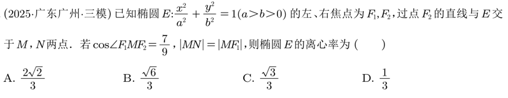
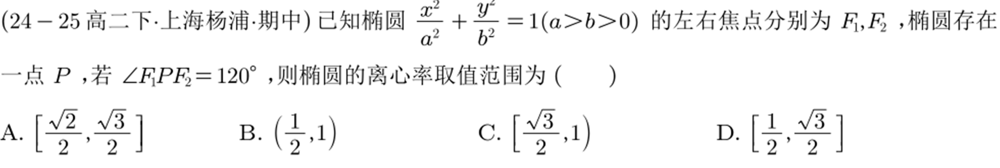
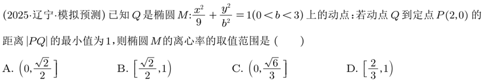
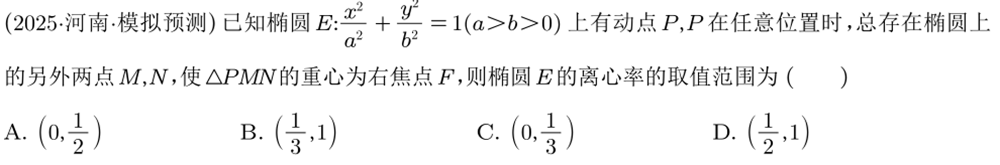
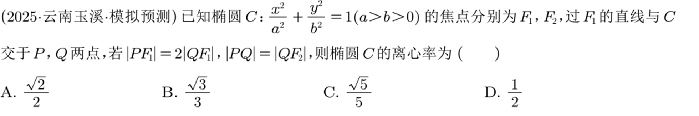

# 20251102

1. 设 $A,B$ 分别为椭圆 $\dfrac{x^2}{a^2}+\dfrac{y^2}{b^2}=1(a>b>0)$ 的右顶点和上顶点，若椭圆中心到直线 $AB$ 的距离为 $\dfrac{\sqrt6}{6}|F_1F_2|$，则椭圆的离心率为？

2. 设 $F$ 是椭圆 $\dfrac{x^2}{a^2}+\dfrac{y^2}{b^2}=1(a>b>0)$ 的右焦点，直线 $y=\dfrac b2$ 与椭圆交于 $B,C$ 两点，且 $\angle BFC=90^\circ$，则该椭圆的离心率为？

3. 设 $O$ 为坐标原点，$F_1,F_2$ 分别是椭圆 $C:\dfrac{x^2}{a^2}+\dfrac{y^2}{b^2}(a>b>0)$ 的左右焦点，点 $P$ 在椭圆上，且 $\vecc{PF_1}\cdot(\vecc{OF_1}+\vecc{OP})=0$，若 $|PF_1|=\sqrt2|PF_2|$，则椭圆的离心率为？

4. 已知椭圆 $\dfrac{x^2}{a^2}+\dfrac{y^2}{b^2}=1(a>b>0)$ 上一点 $A$ 关于原点的对称点为 $B$，设 $F$ 为其右焦点。若 $AF\perp BF$，设 $\angle ABF=\alpha$，且 $\alpha\in\left[\dfrac\pi6,\dfrac\pi4\right]$，则该椭圆的离心率的取值范围是？

5. 已知 $F_1,F_2$ 分别为椭圆 $\dfrac{x^2}{100}+\dfrac{y^2}{b^2}=1(0<b<10)$ 的左右焦点，若 $\angle F_1AF_2=60^\circ$，且 $\triangle F_1AF_2$ 的内切圆半径为 $\dfrac{4\sqrt3}3$，则椭圆的焦距为？

6. 已知椭圆 $\dfrac{x^2}{a^2}+\dfrac{y^2}{b^2}=1(a>b>0)$ 离心率为 $\dfrac{\sqrt3}{2}$，过右焦点 $F$ 的直线 $\ell$ 斜率为 $k(k>0)$，设 $\ell$ 交椭圆于 $A,B$ 两点，且满足 $\vecc{AF}=3\vecc{FB}$，则 $k$ 为？

7.（2022 年新高考 I 卷 16 题）已知椭圆 $C:\dfrac{x^2}{a^2}+\dfrac{y^2}{b^2}=1(a>b>0)$，设 $C$ 的上顶点为 $A$，两个焦点为 $F_1,F_2$，离心率为 $\dfrac{1}{2}$，过 $F_1$ 且垂直于 $AF_2$ 的直线与 $C$ 交于 $D,E$ 两点，且 $|DE|=6$，则 $\triangle ADE$ 的周长是？

1. 已知椭圆 $\dfrac{x^2}{a^2}+\dfrac{y^2}{b^2}=1(a>b>0)$ 短轴顶点 $B(0,b)$，若椭圆一内接三角形 $BMN$ 的重心是椭圆的左焦点 $F$，求椭圆的离心率的取值范围。

2. 已知椭圆 $\dfrac{x^2}{4}+\dfrac{y^2}{3}+1$，求：

（$1$）斜率为 $2$ 的直线与椭圆相交弦的中点的轨迹方程。

（$2$）过 $(1,1)$ 的直线与椭圆的相交弦的中点的轨迹方程。

（$3$）若 $A,B$ 是椭圆的左右顶点，$P$ 为椭圆上异于 $A,B$ 的一点，直线 $PA,PB$ 分别交直线 $x=3$ 于 $E,F$ 两点，则以线段 $EF$ 为直径的圆过定点？

1. 若 $A,B$ 是椭圆 $\dfrac{x^2}{a^2}+\dfrac{y^2}{b^2}=1(a>b>0)$ 的左右顶点，动点 $M$ 满足 $MB\perp AB$，连接 $AM$ 交椭圆于点 $P$，若 $OM\perp PB$，则椭圆的离心率是？

## 补充题

