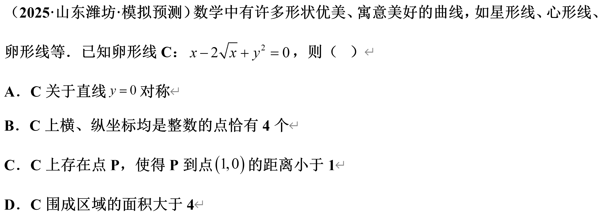
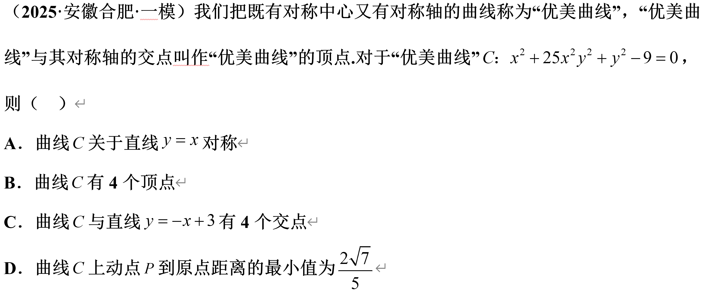
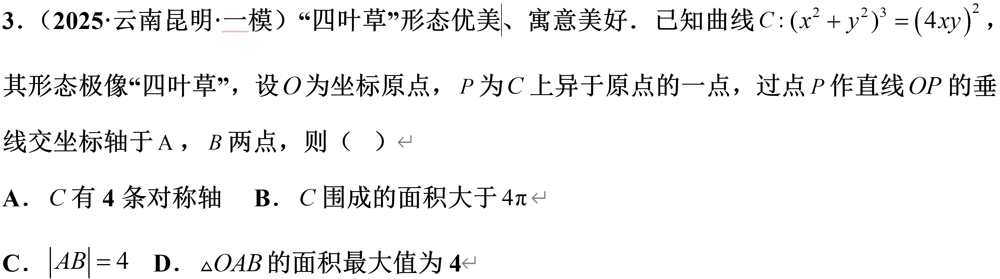
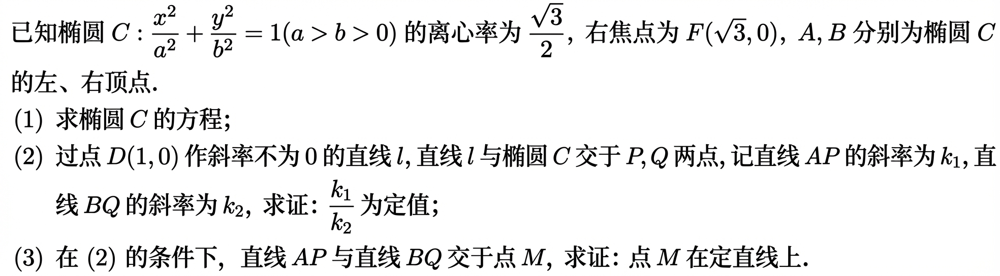

# 20251201

1. 

2. 

3. 

4. 已知 $F_1,F_2$ 分别是椭圆 $\dfrac{x^2}{8}+\dfrac{y^2}{4}=1$ 的左右焦点，$P,A,B$ 为椭圆上三个不同的点，直线 $PA$ 的方程为 $x=2$，且 $\angle APB$ 的角平分线经过点 $Q(1,0)$，设 $\triangle AF_1F_2$ 和 $\triangle BF_1F_2$ 的内切圆半径分别为 $r_1,r_2$，则 $\dfrac{r_1}{r_2}$ 是？

5. 

6. （2024 镇海中学高三下学期适应性训练）已知 $A(-2,0),B(2,0),F_1(-1,0),F_2(1,0)$，动点 $P$ 满足 $k_{PA}\cdot k_{PB}=-\dfrac{3}{4}$，动点 $P$ 的轨迹为曲线 $\tau$，$PF_1$ 交 $\tau$ 于另一点 $Q$，$PF_2$ 交 $\tau$ 于另一点 $R$。

    1. 求曲线 $\tau$ 的标准方程。

    2. 已知 $\dfrac{|PF_1|}{|QF_1|}+\dfrac{|PF_2|}{|QF_2|}$ 是定值，求该定值。

    3. 求 $\triangle PQR$ 面积的范围。

7. 已知点 $A(-1, 0)$，$B(1, 0)$，$P$ 是直线 $AB$ 外的一个动点，$PQ \perp AB$，垂足为 $Q$，且 $Q$ 在线段 $AB$ 外，$\lvert PQ\rvert^2 = 3 \lvert AQ\rvert \cdot \lvert BQ\rvert$，记点 $P$ 的轨迹为曲线 $C$。

    1. 求 $C$ 的方程；

    2. 若直线 $l$ 交 $C$ 于 $M, N$ 两点，$M$ 关于 $x$ 轴的对称点为 $T$，请再从条件 ①、② 和 ③ 中选择一个合适的作为已知，证明以下问题：$l$ 过定点 $(3, 0)$；$\triangle BMN$ 不可能为锐角三角形。

        1. 直线 $TB$ 和 $NA$ 的斜率之和为 $0$；

        2. 直线 $TB$ 和 $NB$ 的斜率之积为 $6$；

        3. 直线 $TB$ 和 $NA$ 的斜率之商为 $2$。

        注：如果选择的条件不符合要求，第 (2) 问得 $0$ 分；如果选择多个符合要求的条件分别解答，按第一个解答计分。
