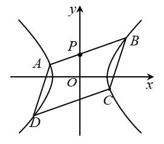

# 20251202

## 强基计划——解析几何第一讲

**【例 1】**（2024 清华大学强基计划） 在平面直角坐标系内，$M \in \left\{(x, y) \mid \dfrac{x^2}{200} + \dfrac{y^2}{8} \le 1\right\}$，$A(2,1)$，若 $\triangle OMA$ 的面积不超过 3，则满足条件的整点 $M$ 个数为________。

**变式训练：** 已知圆 $x^2 + y^2 = 8$ 围成的封闭区域内（含边界）的整点（坐标均为整数的点）数是椭圆 $\dfrac{x^2}{a^2} + \dfrac{y^2}{4} = 1$ 围成的封闭区域内（含边界）整点数的 $\dfrac{1}{5}$，则正实数 $a$ 的取值范围是________。

---

**【例 2】**（2024 清华大学强基计划） 直线 $l： ax +by + c = 0$，$P(x_1, y_1)$，$Q(x_2, y_2)$，$x = \dfrac{ax_1 + by_1 + c}{ax_2 + by_2 + c}$，下列选项中正确的有（ ）。

A. 若 $x > 1$，则 $l$ 与射线 $PQ$ 相交

B. 若 $x = 1$，则 $l$ 与射线 $PQ$ 平行

C. 若 $x = -1$，则 $l$ 与射线 $PQ$ 垂直

D. 若 $x$ 存在，则 $Q$ 在 $l$ 上

**【例 3】**（浙江大学强基）已知 $P(a,b)$ 是椭圆 $E: \dfrac{x^2}{4} + \dfrac{y^2}{3} = 1$ 上的动点，求 $2a + 3b + 4$ 的最大值与最小值和。

**【例 4】** 圆 $x^2 + y^2 = 4$ 上与直线 $4x + 3y - 12 = 0$ 距离最小的点的坐标是（ ）。

A. $\left(\dfrac{6}{5}, \dfrac{8}{5}\right)$

B. $\left(\dfrac{8}{5}, \dfrac{6}{5}\right)$

C. $\left(\dfrac{12}{5}, \dfrac{16}{5}\right)$

D. $\left(\dfrac{16}{5}, \dfrac{12}{5}\right)$

---

**【例 5】**（2023 清华大学强基计划）已知点 $M(8,1)$，过点 $N(1,0)$ 的直线 $l$ 上有一个动点 $P$，则 $|PN| + 2|PM|$ 的最小值为_________。

**【例 6】** 函数 $y = \sqrt{x^4 + 3x^2 - 6x + 10} - \sqrt{x^4 - 3x^2 + 2x + 5}$ 的最大值为 ________。

**【例 7】** 记 $F(x, y) = (x-y)^2 + \left(\dfrac{x}{3} + \dfrac{3}{y}\right)^2 (y \neq 0)$。则 $F(x, y)$ 的最小值是（ ）。

A. $\dfrac{12}{5}$

B. $\dfrac{16}{5}$

C. $\dfrac{18}{5}$

D. $4$

**【例 8】**（2022 年北京大学强基计划测试（上海地区））内接于椭圆 $\dfrac{x^2}{4} + \dfrac{y^2}{9} = 1$ 的菱形周长的最大值和最小值之和是______。

**【例 9】** 已知 $\square ABCD$ 的四个顶点均在双曲线 $x^2 - \dfrac{y^2}{4} = 1$ 上，点 $P(0,1)$ 在边 $AB$ 上，且 $\dfrac{AP}{PB} = \dfrac{1}{2}$，则 $\square ABCD$ 的面积等于 ________。

---

**【例 10】** 在直角坐标平面上，若一个过原点且半径为 $r$ 的圆完全落在区域 $y \ge x^4$ 内，则 $r$ 的最大值为________。

**【例 11】** 双曲线 $y = x + \dfrac{1}{x}$ 的离心率为 ________。

**【例 12】** 二次曲线 $2x^2 + 3xy + 2y^2 = 1$ 的离心率为 ________。

**【例 13】** $x^2 + y^2 - axy + x + y = 1$ 是双曲线，则 $a$ 的范围为________。

**【例 14】** 已知动点 $P(x, y)$ 满足二次方程 $10x - 2xy - 2y + 1 = 0$。则此二次曲线的离心率为 ________。
