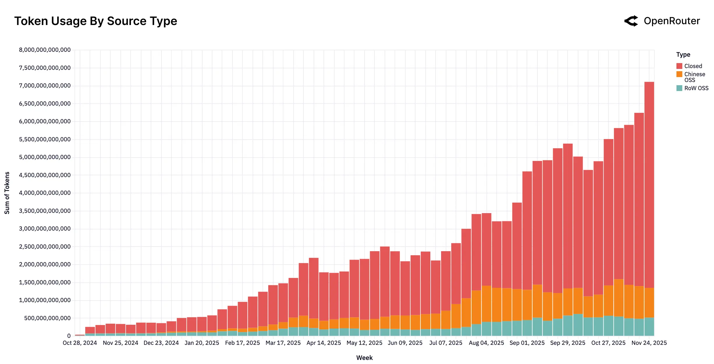

---
date:
  created: 2025-02-04 05:00:00
  updated: 2025-02-04 08:00:00
document_dates_created: 2025-02-04T05:00:00+0000
document_dates_updated: 2025-02-04T08:00:00+0000
readtime: 20
description: 生成式人工智能在中等教育领域的应用深度、技术边界与学习范式变革：一项多维度的实证探究报告。
authors:
  - RainPPR
---

<!-- more -->

    <h1 style="font-family: var(--fontkit-cjk-kai); font-size: 2.2rem; border-bottom: none; margin-bottom: 2rem; color: #000; line-height: 1.4;">生成式人工智能在中等教育领域的应用深度、技术边界与学习范式变革：一项多维度的实证探究报告</h1>

    

        

            
逄沛然

            
山东省青岛第二中学

        

    

    
    

        2026 年 02 月 04 日
    

## 关于生成式人工智能的简介

### 什么是生成式人工智能？

2025 年 5 月，教育部基础教育教学指导委员会正式发布《中小学生成式人工智能使用指南（2025年版）》（以下简称《使用指南》）。《使用指南》指出：生成式人工智能（Generative AI, AIGC）是指具有文本、图片、音频、视频等内容生成能力的模型及相关技术。将生成式人工智能合理融入中小学教育，是抢抓新一轮科技革命机遇、响应国家科技自立自强战略的重要实践，是激发学生创造潜能、提升教育品质的关键路径。为推动其安全规范使用，加速构建以人工智能为引领的创新教育生态，现制定本指南。

从科技发展进程来看，大模型（Large Models）开启了人工智能发展的新阶段。大规模预训练、有监督微调（SFT）、基于人类反馈的强化学习（RLHF）等技术的叠加演进，推动了 AI 从“感知智能”向“认知智能”跨越，也为实现通用人工智能（AGI，即具备在多种环境下自主完成复杂任务能力的智能系统）奠定了工程基础。我们要坚持“以人为本、积极拥抱、引导善用、趋利害避”的方针，既加强普及力度，又统筹应对风险，确保中小学生会用、善用、不滥用 AI 工具。

《使用指南》明确了五大原则：一是坚持育人导向，二是坚持教育公平，三是坚持价值引领，四是坚持需求驱动，五是坚持底线思维。构建覆盖全链条的保障机制，筑牢安全底线。为防范过度依赖导致的独立思考能力弱化，《使用指南》提出系统性防范机制：一方面，严禁直接复制生成内容作为作业答案，杜绝“代劳式”使用；另一方面，强化教师引导，开展批判性思维训练，培养学生的质疑与甄别能力。为保障数据安全，《使用指南》要求严禁输入敏感数据，并建立校园工具“白名单”制度，确保技术合规且安全可控。

### 近年人工智能的发展态势

目前，中国领先的 AI 实验室与全球领导者之间的差距正以前所未有的速度缩小，领先优势已从一年多缩短至不到三个月。中国开放权重（Open Weights）模型在 2024 年末表现优异，DeepSeek R1 等模型的发布进一步巩固了这一地位。

中国活跃的 AI 参与者大致可分为两类：

1. **科技巨头**：由大型科技公司主导，资金与算力雄厚。

    - **阿里巴巴（Alibaba）**：大型电商及超大规模云服务商（阿里云）；发布 Qwen（通义千问）系列。最新的 Qwen3-Max-Thinking 在长文本推理和国产模型中处于领先位置。

    - **字节跳动（ByteDance）**：抖音母公司；拥有国内用户活跃量极大的 AI 助手“豆包”；在多模态（文字、图片、视频）生成领域竞争力极强。

    - **百度（Baidu）**：搜索巨头；运营文心一言（Ernie Bot）；最新的 Ernie 5.0 在语义理解与行业落地方面表现突出。

    - **腾讯（Tencent）**：社交巨头；发布混元（Hunyuan）系列大模型，集成了先进的 T1 与 TurboS 指令遵循特性。

    - **小米（Xiaomi）**：消费电子巨头；发布手机侧优化的 MiMo-V2-Flash 模型。

2. **AI 初创公司（AI Startups）**：规模相对精简，专注技术创新。

    - **DeepSeek（深度求索）**：源自量化背景；以开源 DeepSeek R1 及其极高的推理性价比闻名，V3.2 版本在国内乃至全球处于第一梯队。

    - **Moonshot AI（月之暗面）**：以长上下文窗口著称；最新模型 Kimi K2.5 Thinking 在复杂逻辑推理方面表现卓越。

    - **智谱 AI（Zhipu AI）**：源自清华大学 KEG 实验室；致力于 GLM 系列。GLM-4.7 模型生态丰富，支持 Agentic 智能体协作。

    - **MiniMax（稀宇科技）**：专注于大模型底座研发，最新的 M2.1 版本在对话连贯性与长程记忆方面提升明显。

2024 年是大型语言模型（LLM）从“预测”向“推理”进化的转折点。随着推理模型（Inference Models）的普及，领域重心正从简单的单次文本生成转向多步深思熟虑的推理过程。这种转变加速了新场景的诞生，也要求我们更深入地理解这些模型在实际部署中的实证表现。

### 人工智能的能力如何？

推理能力通用测评：

| 模型 | AA-LCR 长上下文推理 | GPQA Diamond 科学推理 | CritPt 物理推理 | AIME 2025 数学邀请赛 |
| :- | :-: | :-: | :-: | :-: |
| **Kimi K2.5** | $66\%$ | $88\%$ | $3\%$ | - |
| **Qwen3 Max** | $66\%$ | $86\%$ | $2\%$ | - |
| **DeepSeek V3.2** | $65\%$ | $84\%$ | $3\%$ | $92\%$ |
| **GLM 4.7** | $64\%$ | $86\%$ | $2\%$ | $95\%$ |
| **MiMo V2 Flash** | $63\%$ | $85\%$ | $4\%$ | $96\%$ |
| **Minimax M2.1** | $59\%$ | $83\%$ | $0\%$ | $83\%$ |
| *Claude Opus 4.5* | $74\%$ | $87\%$ | $5\%$ | $91\%$ |
| *GPT 5.2* | $73\%$ | $90\%$ | $12\%$ | $99\%$ |
| *Gemini 3 Pro* | $71\%$ | $91\%$ | $9\%$ | $96\%$ |

知识水平通用测评：

| 模型 | Last Exam 推理和知识 | AA-Omni Acc 知识准确度 | AA-Omni Non-H 不幻觉率 | IFBench 指令遵循 |
| :- | :-: | :-: | :-: | :-: |
| **Kimi K2.5** | $29.4\%$ | $33\%$ | $36\%$ | $70\%$ |
| **Qwen3 Max** | $26.2\%$ | $29\%$ | $7\%$ | $71\%$ |
| **DeepSeek V3.2** | $22.2\%$ | $32\%$ | $18\%$ | $61\%$ |
| **GLM 4.7** | $25.1\%$ | $28\%$ | $10\%$ | $68\%$ |
| **MiMo V2 Flash** | $21.1\%$ | $26\%$ | $7\%$ | $64\%$ |
| **Minimax M2.1** | $22.2\%$ | $22\%$ | $33\%$ | $70\%$ |
| *Claude Opus 4.5* | $28.4\%$ | $43\%$ | $42\%$ | $58\%$ |
| *GPT 5.2* | $35.4\%$ | $41\%$ | $22\%$ | $75\%$ |
| *Gemini 3 Pro* | $37.2\%$ | $54\%$ | $12\%$ | $70\%$ |

### 生成式人工智能的原理和技巧？

生成式人工智能（AIGC）的核心在于“对话”。你向 AI 发出的指令被称为**提示词（Prompt）**，而通过优化这些指令来获得更精准、更高质量结果的技术，就被称为**提示工程（Prompt Engineering）**。

- 无论提供的提示是什么，模型都只是使用它确定的最有可能的情况（基于训练数据和训练目标）做出响应。如果在提示中提出问题，则模型不会遵循单独的“Q&A”代码路径，而是看起来在回答问题，因为回答即是输入的给定问题最有可能的响应。

- 成功的提示通常依赖于“单样本”或“少样本”学习。这是指加入模型所需行为的一个或多个示例，通常做法是加入输入和输出对。这不是从模型进行永久更改这一意义上学习，而是通过示例更好地使模型能够仅根据当前推理的需求做出响应。使用没有示例的提示有时称为“零样本”学习。

- 提示充当模型输出的“快速启动”，帮助将模型定向到所需的输出。它通常是模型可以作为生成基础的前缀。提示通常与指令一起使用，但并非总是如此。提示在一种情况下用于帮助聚焦模型的输出，在另一种情况下用于建议特定输出格式（项目符号）。

- 支持内容是模型可用于以某种方式影响输出的信息。它不同于主要内容，因为它不是任务的主要目标，但它通常与主要内容一起使用。常见示例包括上下文信息，例如当前日期、用户名、用户偏好等。

对于学生而言，掌握提示工程就像是学会了如何与一位“博学但需要明确指令”的数字导师沟通。以下是几个简单实用的技巧：

1. **赋予角色（Role-playing）**：明确 AI 的身份。

2. **提供背景（Context）**：给 AI 足够的信息，避免它“盲目猜测”。

3. **任务拆解（Step-by-Step）**：让 AI 分步思考，这能显著提升其逻辑推理能力。

4. **明确限制（Constraints）**：规定输出的格式、语气或字数。

万能公式：角色 $+$ 背景 $+$ 任务 $+$ 限制 $=$ 理想结果

提示工程并不是一种复杂的编程技术，而是一种**清晰表达需求**的能力。在实践中，你可以通过不断调整和追问（Iterative Prompting），引导 AI 逐步逼近你想要的答案。同时请记住，AI 生成的内容可能存在“幻觉”，始终保持批判性思维并进行事实核查是使用 AI 的基本准则。

- **从明确的说明开始**：信息在提示中显示的顺序非常重要。这是因为模型是以某种方式构建的，这定义了它们处理输入的方式。研究表明，在共享其他上下文信息或示例之前，在提示开始时告诉模型你希望它执行的任务有助于生成更高质量的输出。

- **在末尾重复指令**：模型可能容易受到近因偏差的影响，在此上下文中，这意味着提示结束时的信息对输出的影响可能比提示开头的信息更大。因此，值得尝试一下在提示结束时重复指令，
并评估对所生成响应的影响。

- **分解任务**：如果任务分解为较小的步骤，大型语言模型的性能通常会更好。调整提示的结构，以便首先指示模型提取相关事实，然后指示生成可用于验证这些事实的搜索查询。应使用清晰的语法来区分不同部分并引导输出。

    **思维链提示**是分解任务技术的变体。在这种方法中，不是将一项任务分割成较小的步骤，而是指示模型响应逐步进行，并提出所有涉及的步骤。这样做可以减少结果不准确的可能性，并使评估模型响应更容易。

    还可以采取**引导输出**的方式，这是指在提示的末尾包含几个字词或短语，以获取遵循所需形式的模型响应。

- **提供背景信息以帮助理解**：提供可靠答案的最有效方法之一是为模型提供数据，让它从基础数据得出响应。如果你的用例依赖于最新且可靠的信息，而且不是纯粹的创意性场景，我们强烈建议提供有根据的数据。通常，源材料越接近所需答案的最终形式，模型需要完成的工作就越少，这意味着出错的可能性就越小。

    例如，当你在做导数部分的题目时，应该告诉人工智能，帮我解决这道题目，用导数解决，这样人工智能才不会“尝试错误的解题方向”。还可以利用思维链提示的方法，告诉人工智能先从什么角度考虑，再用什么方法，让人工智能“掌握”我们在课堂上学习的技巧，从而更方便的解答。

    例如，当你写作文的时候，如果题目中出现了某个社会热点事件，你应该把整个事件大体复述一遍，让人工智能大体知道情况。现在的人工智能大部分都是固定权重的，也就是说模型从训练完成、发布之后，它的数据就是固定的了，例如 2025 年的人工智能，不会知道 2026 年的某个新闻，你需要让他知道，他才能给出正确的回答。

使用提示指定输出结构时，可能会对结果的性质和质量产生重大影响。有时，系统消息输入“仅写出真实事实”或“不捏造信息”可能不足以缓解问题。相反，要求模型响应同时包含引文有助于减少错误响应的概率。如果你指示模型在编写语句时引用源材料，则这些语句更有可能有根据。请求引文会使模型在每次生成响应时都犯两个错误：第一个错误是捏造的响应，第二个错误是错误的引文。请注意，引文越接近它支持的文本，模型预测引文所需的距离就越短，这表明内联引文比内容末尾的引文更适合缓解虚假内容的生成。

最佳做法：

- **尽量具体**：尽可能少留解读空间、限制操作空间。

- **具有描述性**：使用类比。

- **强调**：有时可能需要对模型进行重复操作。在主要内容之前和之后提供说明，使用指令和提示等。

- **顺序很重要**：向模型呈现信息的顺序可能会影响输出。你选择是在内容之前放置指令（“汇总以下内容...”）还是之后（“汇总以上...”）会影响输出。

- **给模型一个“出路”**：如果模型无法完成分配的任务，有时为模型提供备用路径可能会有所帮助。例如，在对一段文本提出问题时，可以加入“如果这个命题不成立，那么不需要证明，只需要证明错误或者举出反例即可”。这可帮助模型避免生成错误的响应。

**空间效率**：虽然输入大小会随着模型的迭代而增加，但仍存在提供的数据超出模型所能处理的数据量的情况。模型将单词分解为 token。常见的多音节单词通常是单个 token，而不太常见的单词会按音节拆分。token有时可能违反直觉，如以下示例所示，它演示了不同日期格式的 token 边界。在这种情况下，拼出整个月份比使用完全数字的日期更具空间效益。

更详细的提示词工程，可以参考 Lee Boonstra《Prompt Engineering》。

## 生成式人工智能在学习中的应用实例

### 数学错题深度解析与变式训练

**场景**：你在做导数题目时卡住了，看了解析也一知半解，想弄懂解题思路并巩固练习。

**提示词**：

> **Role**: 你是一位耐心且擅长启发式教学的高中数学资深教师。
>
> **Context**: 我在解决这道导数题目时遇到了困难（附上题目和你的尝试步骤）。
>
> **Task**: 请不要直接把答案告诉我。首先，分析我做错或者卡住的原因是什么；其次，用引导性的问题一步步提示我思考下一步该怎么做；最后，在我理解之后，给我出两道考察相同知识点但难度稍有变化的“变式题”让我练习。
>
> **Constraints**: 解释过程中尽量使用图像化或直观的语言，避免堆砌复杂的数学术语。

**分析**：这种“苏格拉底式”的对话能逼迫你主动思考，而不是被动接收答案。变式训练则是检验你是否真正掌握知识点的试金石。

### 古诗文赏析与历史场景重现

**场景**：你在背诵《赤壁赋》，觉得文字晦涩枯燥，难以共情。

**提示词**：

> **Role**: 你是北宋大文豪苏轼本人。
>
> **Context**: 此时是元丰五年的七月十六日，你正与朋友泛舟游于赤壁之下。
>
> **Task**: 请以第一人称的口吻，用现代白话文描述你当晚看到的景色、听到的声音以及内心的感触。告诉我你为什么要写下“寄蜉蝣于天地，渺沧海之一粟”这样的句子？你当时真的很悲观吗？
>
> **Constraints**: 语言要优美、极具画面感，符合苏轼豪放旷达的性格特征。

/// details | 示例输出（Kimi K2.5）
江面上漂着一层薄雾，像是天上哪位仙人随手撒下的轻纱。我举起酒杯，看月光在酒里碎成千万片银鳞——那是元丰五年七月十六的夜，黄州的赤壁之下，我与友人杨世昌乘着一叶扁舟，任它随着江水悠悠荡荡。

你问那晚我看见了什么？

我看见月亮从东山顶上探出头来，懒洋洋地徘徊在斗宿与牛宿之间，把清辉洒得满江都是。那月光不是冷的，是温的，像刚酿好的酒，把整片江水都泡得酥软。白茫茫的雾气横在江面上，水光连着天际，我们的小船就像一片苇叶，漂浮在万顷茫然之中。江风猎猎地吹，鼓满我的衣袖，那一刻我真觉得，只要张开双臂，就能乘着这风羽化登仙，飞到那琼楼玉宇之间去。

你问那晚我听到了什么？

有声音啊。起初是我叩击船舷的歌声："桂棹兮兰桨，击空明兮溯流光..."木桨拍打着月光浸透的江水，发出清脆的声响，像玉磬相击。可随后，杨道士的洞箫声起来了——那声音呜呜咽咽，像是远古的幽怨被江风卷了过来，又如丝如缕地缠在月光里。它能让深谷中的蛟龙起舞，能让孤舟上的寡妇哭泣。那箫声里藏着千年的 weight，压得人心里发沉。

于是就有了那句"寄蜉蝣于天地，渺沧海之一粟"。

朋友，你要知道，当小船漂在茫茫大江之上，四望皆是水天相接，你会突然觉得自己缩小了。想起当年的曹孟德，横槊赋诗，固一世之雄也，而今安在哉？长江还是这条长江，月亮还是这轮月亮，可人的一生却像朝生暮死的蜉蝣，像大海里的一粒小米。这种对比太强烈了——历史的洪流滚滚向前，个体的生命转瞬即逝。那一刻，面对永恒的江月与短暂的人生，谁能不发出一声轻叹？

但你问我当时真的很悲观吗？

不，恰恰相反。我苏轼若真是悲观之人，早在乌台诗案的牢房里就断了气，何必等到黄州来看这赤壁月色？

写下那样的句子，不是因为绝望，而是因为清醒。就像登山者到了高处，必先看见悬崖之险，才能体会苍穹之阔。承认渺小，是为了拥抱宏大；认识短暂，是为了触摸永恒。当我对着江水说出"哀吾生之须臾"时，心里已经在酝酿那个更重要的答案了——你看这江水，日夜东流，看似在变，其实未变；你看这明月，盈亏往复，看似在变，其实也未变。从变化的一面看，天地万物瞬息万变；从不变的一面看，物与我皆无尽也。

这不是自我欺骗，而是一种超越。就像此刻，江上的清风有声，山间的明月有色，这是造物者无尽的宝藏，你听到了，看到了，拥有了，这一刻你就是永恒的。

所以那晚，当箫声渐歇，我们反而笑得更开怀了。把酒杯里的月光一饮而尽，任小船在江心随波逐流。你知道最妙的是什么吗？是东方既白时，我们发现根本不知道自己是怎么睡着的——就在那水声与风声里，在那蜉蝣与一粟的顿悟里，人与自然早已融为了一体。

悲观？不，那是大自在。就像这江水，无论遇到多少礁石，终究是要向东流的。人这一生，纵然渺小如粟，也要在这天地逆旅中，活出一点清风明月的味道来。
///

**分析**：通过角色扮演（Role-playing），死板的文言文变成了鲜活的个人独白。这种沉浸式的体验能帮助你更深刻地理解文章的情感基调和思想内核。

### 物理概念的可视化与类比讲解

**场景**：你对物理学中的“熵（Entropy）”这个概念感到抽象，难以理解。

**提示词**：

> **Role**: 你是一位擅长用生活案例解释复杂物理概念的科普博主。
>
> **Context**: 我是一名高中生，对热力学第二定律中的“熵增”概念感到困惑。
>
> **Task**: 请用“整理房间”或者“耳机线打结”作为类比，通俗易懂地为我解释什么是熵，为什么熵总是增加的？
>
> **Constraints**: 避免使用复杂的公式，多用比喻和生活中的例子。

**分析**：AI 擅长打破学科壁垒，将抽象的概念与你熟悉的生活经验建立连接。好的类比是理解复杂科学理论的捷径。

### 研究性学习课题的头脑风暴

**场景**：学校开展研究性学习，你对“人工智能”感兴趣，但不知道具体研究什么方向。

**提示词**：

> **Role**: 你是一位指导高中生开展研究性学习的学术导师。
>
> **Context**: 我对“生成式人工智能”很感兴趣，想以此为主题开展一项课题研究。
>
> **Task**: 请结合高中生的能力水平和时间精力，为我推荐 5 个具有可行性、创新性且不需要昂贵设备的课题名称。
>
> **Constraints**: 每个课题都要包含：课题名称、研究背景、研究方法（如问卷调查、对比实验）、预期成果。

**分析**：万事开头难。AI 可以作为你的“灵感缪斯”，帮你快速发散思维，找到既感兴趣又具备实操性的切入点。

### 复杂长难句的翻译与语法解构

**场景**：在阅读英语原版书或科技文献时，遇到长难句，查了单词还是读不懂。

**提示词**：

> **Role**: 你是一位精通英汉互译的语言学教授。
>
> **Context**: 我在阅读中遇到了这句话（附上长难句）。
>
> **Task**: 1. 请给出这段话准确、流畅的中文翻译；2. 对这个长难句进行“解剖”，画出句子结构图（主句、从句、修饰语）；3. 讲解其中涉及的特殊语法现象或熟词僻义。
>
> **Constraints**: 解析要细致，像做手术一样拆解句子。

**分析**：AI 能瞬间化身为语法分析器，帮你理清复杂的修饰关系，通过拆解句子结构，让你从“读懂一句话”变成“读懂一类句”。

### 模拟辩论赛对手

**场景**：你将参加一场关于“科技进步是否让人变懒”的辩论赛，你是反方（科技进步没有让人变懒）。

**提示词**：

> **Role**: 你是世界顶级的辩论选手，现在是我的正方对手（认为科技进步让人变懒）。
>
> **Context**: 我们的辩题是“科技进步是否让人变懒”。我是反方。
>
> **Task**: 请列出你能想到的最犀利、最难反驳的 3 个正方论点，并尝试用具体的例子来攻击我的立场。
>
> **Constraints**: 论点要逻辑严密，具有攻击性。

/// details | 示例输出（DeepSeek V3.2）
论点一：科技通过**替代性工具**直接削弱人的基础劳动意愿与能力  

**逻辑核心**：科技创造的“省力工具”本质是对人类体力与脑力劳动的取代，长期使用会降低人从事基础活动的耐受性与主动性，形成行为惯性依赖。  
**攻击例子**：  

- 反方可能主张“科技将人从重复劳动中解放，让人专注于创造性工作”，但正方可反驳：当扫地机器人、洗碗机、智能烹饪机全面接管家务后，连简单的清洁、烹饪等基础生存技能都被放弃，人体机能（如腰背肌肉力量、手眼协调能力）因缺乏日常锻炼而退化，这实质是“用进废退”的生理性懒惰。  
- 针对“科技提升效率”的反方论点，正方可追问：当导航软件让人不再记路、计算器让人心算能力萎缩、语音输入让书写能力下降，这种“效率提升”是否以牺牲人类基础能力为代价？若全球断网断电，现代人是否比20年前的人更缺乏生存能力？  

论点二：科技创造的**即时满足环境**系统性摧毁人的延迟满足能力与深度思考习惯

**逻辑核心**：科技产品通过算法优化（如短视频推荐、外卖速达、一键获取信息）不断缩短反馈周期，重塑人脑的奖励机制，导致人对需要长期投入的事务（如读书、线下社交、技能钻研）产生本能抗拒。  
**攻击例子**：  

- 反方或主张“科技提供更多学习资源（如网课、电子书）”，但正方可引用研究数据：数字时代人均专注时长从2000年的12秒降至现在的8秒，短视频平台使青少年阅读长文字能力下降34%（可引用相关研究）。当知识可通过“3分钟解说视频”获取时，多少人还愿意精读300页的专著？这种“碎片化学习”本质是深度思考的懒惰。  
- 针对反方“科技促进社交”的观点，正方可攻击：社交媒体用点赞、评论的即时反馈替代线下复杂情感互动，导致年轻人宁愿在虚拟世界经营人设，也不愿处理现实人际关系的矛盾（如“已读不回”引发的焦虑），这实则是情感沟通上的懒惰。  

论点三：科技构建的**系统性依赖**迫使社会制度纵容人的惰性，形成不可逆的结构性懒惰

**逻辑核心**：当科技渗透到社会基础设施层面（如无现金支付、自动化办公、算法管理），个体“偷懒”不再是个人选择，而是被系统鼓励的必然行为，甚至引发传统技能与职业道德的集体流失。  
**攻击例子**：  

- 反方可能强调“科技创造新的就业岗位”，但正方可指出：制造业自动化导致工人技术空心化，AI绘图让设计师降低手绘训练热情，GPT写作让学生逻辑建构能力下降。当企业用“数字化转型”掩盖员工核心能力退化时，这种系统性懒惰是否在降低社会抗风险能力？（例如停电导致电子支付瘫痪时，年轻人连现金交易都难以处理）  
- 针对“科技推动社会进步”的宏观论述，正方可追问：如果“进步”的标准是让人越来越少动用自身机能（体力、记忆、计算、决策），那么未来若出现全自动AI管家，人类是否连起床穿衣的动机都会丧失？这种“终极便利”与“废人化”的界限何在？  

反方可能的防御与正方的进一步压制策略  

1. **若反方主张“懒惰是人性而非科技之过”**：  
   → 正方可反驳：科技不是中立的工具，而是通过设计刻意迎合人性弱点（如APP的无限刷新机制），科技公司为获利不断降低使用门槛，本质上是在规模化放大懒惰基因。  

2. **若反方强调“科技催生新的劳动形式（如电竞、编程）”**：  
   → 正方可类比：这好比说“鸦片战争催生了中国近代化”，不能掩盖其摧毁传统生产模式的代价。新兴行业所需人口远少于被替代行业，且电竞选手依赖反应速度而非毅力，程序员依赖代码复用而非创新，恰是“高效懒惰”的体现。  

3. **若反方提出“科技让人有更多自由时间追求意义”**：  
   → 正方可用数据反讽：调查显示，欧美国家人均家务时间因科技减少后，闲暇时间并未用于创造性活动，反而被流媒体和社交网络吞噬。科技提供的“自由”实则被重新捕获为“数字消费时间”，何谈更高价值追求？  

---

**总结**：正方的根本逻辑在于，科技不是“延伸人类能力”，而是“接管人类能力”，且这种接管具有成瘾性与不可逆性。辩论时可紧扣“能力退化”“反馈机制畸变”“系统性依赖”三层递进，用具体场景对比（有科技vs无科技时的行为模式）迫使反方承认：人类在获得便利的同时，正失去对自身主导权的感知——而这正是“懒惰”的心理本质。
///

**分析**：知己知彼，百战不殆。通过与 AI 模拟对抗，你可以提前预判对手的攻势，发现自己逻辑上的漏洞，从而完善己方的论证体系。

### 制作复习提纲与思维导图

**场景**：期末考试快到了，生物必修一的知识点太碎，你想整理一个复习大纲。

**提示词**：

> **Role**: 你是一位善于归纳总结的生物特级教师。
>
> **Context**: 我需要复习高中生物必修一《细胞的能量供应和利用》这一章。
>
> **Task**: 请为我生成一份详细的复习提纲。
>
> **Constraints**: 请使用 Markdown 的层级列表格式（Markdown List），涵盖光合作用、呼吸作用的关键反应式、场所、过程对比，重点突出易错点。

**分析**：AI 拥有强大的结构化能力。你可以将生成的 Markdown 内容直接导入 XMind 等软件，一键生成思维导图，极大地提高复习效率。

## 生成式人工智能驱动的学习范式变革与伦理思考

从知识存储向能力生成的范式跃迁。在传统教育模式中，学习的主要场域在于海量知识的存储与提取。然而，生成式人工智能的介入正使得信息的获取成本趋于极小值，学习的核心命题已由“知识的存量”转向“认知的增量”。这意味着，衡量当代学生核心素养的尺度，不再是其掌握既有知识的广度，而是其通过提示工程（Prompt Engineering）与 AI 进行深度耦合、从而在复杂情境中解构真实问题的能力。这种“分布式认知”的演变，要求学习者建立更具韧性的元认知支架，在人机协作中完成思维的二次进化。

教学逻辑与评价体系的结构重塑。随着生成式工具在课堂内外渗透，教育过程正经历从“标准化灌输”向“个性化激发”的深刻位移。由于 AI 能够生成高准确度的文本产出，传统的以“最终结果”为导向的测评机制已显露滞后性。未来的学术评价将必然转向对“思维轨迹”的多维刻画，更多关注学习者在与模型交互过程中表现出的迭代逻辑、质疑精神以及跨学科迁移能力。这也催促着教学场所从单一的知识传递中枢，蜕变为以学生发散性思考为圆心的协同创新空间，实现真正意义上的因材施教。

技术边界、知识边界与主观能动性的博弈。在拥抱技术红利的同时，我们必须警惕算法逻辑对思维深度的潜在蚕食。生成式模型虽然能提供极具迷惑性的流利响应，但其依赖于大规模概率预测的本质，使得系统性“幻觉（Hallucinated Content）”与底层逻辑偏差依然存在。若在思维构建的萌芽阶段过度依赖技术“代偿”，极易导致学习者出现审美单一化与批判性思维弱化的风险。因此，明确技术应用的合理阈限——处理好“辅助工具”与“主体意识”的关系——是构建可持续、安全的数字学习生态的必修课。

综上所述，生成式人工智能并非传统教育的替代者，而是人类智力边界的延伸与重构。我们正身处一个教育轨迹从“以书为纲”跨向“人机互惠”，最终回归“以人为本”的宏大叙事中。教育的最深层使命，始终是在算法无法触及的幽微处，守护并激发那份属于人类的直觉、同理心与终极创造力。身处 AI 时代的洪流，我们不仅要学会执笔挥舞数字化的光剑，更要学会在浩瀚的字符宇宙里，守望那颗永恒不灭、探索自我的纯真初心。
