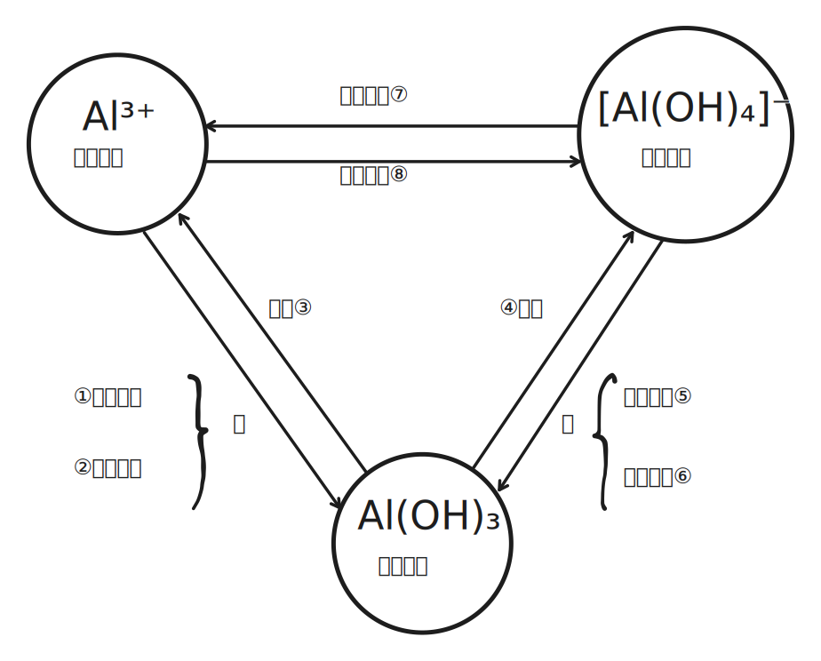

# 铝及其化合物

## 铝单质

### 铝单质概况

铝是地壳中含量最高的金属，大多以化合态存在。

常见矿石为铝土矿 $\ce{Al2O3}$，同时为绿宝石和蓝宝石的主要成分。

### 铝的化学性质

- 还原性：

    | 氧化剂 | 反应方程式 |
    | :-: | :-: |
    | $\ce{O2}$ | $\ce{4Al + 3O2 -> 2Al2O3}$ |
    | $\ce{Cl2}$ | $\ce{2Al + 3Cl2 -> 2AlCl3}$ |
    | $\ce{S}$ | $\ce{2Al + 3S -> Al2S3}$ |

    其中三氯化二铝于水发生双水解，生成 $\ce{Al(OH)3,H2S}$。

- 与酸减和水的反应：

    - 与浓硫酸、浓硝酸：生成致密氧化膜 $\ce{Al2O3}$，钝化。

    - 与非氧化性酸（仅强酸）：$\ce{2Al + 6H+ -> 2Al^3+ + 3H2 ^}$。

    - 与碱（仅强碱）：$\ce{2Al + 2OH- + 6H2O -> 2[Al(OH)4]- + 3H2}$。

    - 铝的金属性不强，非金属性也不强，因此之和强酸强碱发生反应。

- 毛刷实验：

    - $\ce{2Al + 3Hg^2+ -> 2Al^3+ + 3Hg}$。

    - 铝溶解在汞中，生成铝汞剂（铝的汞溶液）。

### 铝的工业制取

熔融氯化铝不导电，因此工业中常用电解熔融氧化铝：

$$
\ce{2Al2O3(熔融) ->[通电][冰晶石] 4Al + 3O2 ^}
$$

冰晶石（$\ce{Na3AlF6}$）可以起到降低氧化铝熔点、防氧化的作用。

## 铝的氧化物和氢氧化物

### 氧化铝和铝热反应

三氧化二铝熔点高，不易熔化，故常用作耐火材料。

### 氢氧化铝及其制备

氢氧化铝不稳定：

$$
\ce{2Al(OH)3 ->[\triangle] Al2O3 + 3H2O}
$$

氢氧化铝有两种电离方式：

- 氢氧化铝的碱式电离：$\ce{Al(OH)3 <=> Al^3+ + 3OH-}$。

- 氢氧化铝的酸式电离：$\ce{Al(OH)3 + H2O <=> [Al(OH)4]- + H+}$。

实验室制取氢氧化铝：

- $\ce{Al^3+ + 3NH3*H2O -> Al(OH)3 v + 3NH4+}$。

- $\ce{[Al(OH)4]- + CO2 -> Al(OH)3 v + HCO3-}$。

- $\ce{Al^3+ + 3[Al(OH)4]- -> 4Al(OH)3 v}$。

### 铝三角

{ width="90%" }

| 编号 | 反应方程式 |
| :-: | :-: |
| ① | $\ce{Al^3+ + 3OH- -> Al(OH)3 v}$ |
| ② | $\ce{Al^3+ + 3NH3*H2O -> Al(OH)3 v + 3NH4+}$ |
| ③ | $\ce{Al(OH)3 + 3H+ -> Al^3+ + 3H2O}$ |
| ④ | $\ce{Al(OH)3 + OH- -> [Al(OH)4]-}$ |
| ⑤ | $\ce{[Al(OH)4]- + H+ -> Al(OH)3 v + H2O}$ |
| ⑥ | $\ce{[Al(OH)4]- + CO2 -> Al(OH)3 v + HCO3-}$ |
| ⑦ | $\ce{[Al(OH)4]- + 4H+ -> Al^3+ + 4H2O}$ |
| ⑧ | $\ce{Al^3+ + 4OH- -> [Al(OH)4]-}$ |
