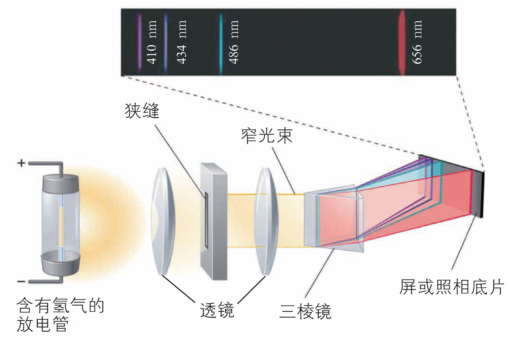

# 原子与元素

$$
\gdef\el#1#2#3{\mathrm{#1#2^{#3}}}
\gdef\za#1#2{\ce{#1}\left({#2}\right)}
\gdef\zb#1#2{\left[\ce{#1}\right]{#2}}
\textrm{This page intentionally left blank.}
$$

## 原子结构理论

### 原子结构模型

| 时间 | 科学家 | 模型名称 | 备注 |
| :-: | :-: | :-: | :-: |
| 公元前 400 多年 | （古希腊）德谟克利特 | 原子唯物论 | 构成物质的最小单位 |
| 1803 年 | （英国）道尔顿 | 原子论 | 具有实在意义的微粒的概念 |
| 1904 年 | （英国）汤姆孙 | 葡萄干布丁模型 | 在发现电子的基础上 |
| 1911 年 | （英国）卢瑟福 | 核式模型 | 根据 α 粒子散射实验 |
| 1913 年 | （丹麦）玻尔 | 原子结构模型 | 氢原子光谱 |
| 20 世纪 20 年代中期 | 薛定谔等 | 量子力学模型 | 电子云 |

波尔的原子结构模型：

1. 原子中的电子在具有确定半径的圆周轨道上绕原子核运动，并且不辐射能量。

2. 在不同轨道上运动的电子具有不同的能量（$E$），而且能量值是不连续的，这称为能量“量子化”。轨道能量依 $n$ 值（$1,2,3,\dots$）的增大而升高，$n$ 称为量子数。对氢原子而言，电子处在 $n=1$ 的轨道时能量最低，这种状态称为基态；能量高于基态能量的状态，称为激发态。

3. 只有当电子从一个轨道（能量为 $E_i$）跃迁到另一个轨道（能量为 $E_j$）时，才会辐射或吸收能量。当辐射或吸收的能量以光的形式表现出来并被记录时，就形成了光谱。

4. 玻尔原子结构模型成功地解释了氢原子光谱是线状光谱的实验事实，阐明了原子光谱源自核外电子在能量不同的轨道之间的跃迁，指出了电子所处的轨道的能量是量子化的。但是其局限性在于，复杂的光谱现象无法解释。

下面我们会详细讲解。

### 原子轨道

- 核外电子按能量不同分成能层，电子的能层从核由内向外排序。

- 能层越高，电子的能量越高，能量的高低顺序为 $E(K)<E(L)<\dots<E(Q)$。

- 记忆方法，起于国王终于皇后（from K king to Q queen）。

/// caption
能层与能级
///

- 任意能层的等级从 s 级开始，每一能层的能级数等于该能层虚数。

- 即第一能层 1s 一个能级，第二能层 2s, 2p 两个能级，第三能层 3s, 3p, 3d 三个能级，第四能层 4s, 4p, 4d 四个能级。

- 能级的字母符号总是按照 s, p, d, f 排序的，记为开始（s start）于 PDF（便携式文档格式），他们可容纳的最多电子数依次为 $1,3,5,7$ 的二倍。

- 同一能层不同能级电子能量接近，故电子先分层后分级。

### 基态与激发态

- 处于最低能量状态的原子叫做基态，基态原子吸收能量，它的原子灰跃迁到较高能级变为激发态原子。

- 电子从较高的激发态跃迁到较低的激发态，甚至基态（易错：不一定跃迁到基态，有可能跃迁到较低的激发态）时会释放能量。

- 光（辐射）是电子跃迁释放能量的重要形式，……都与原子核外电子跃迁释放能量有关。

### 原子光谱

光谱：

- 光谱的定义：利用仪器将物质吸收的光或发射的光的波长和强度分别记录下来，就得到光谱。

- 连续光谱：若光谱是由各种波长的光所组成，且相近的波长差别极小而不能分辨，则这种光谱为连续光谱，例如阳光的光谱即为连续光谱。

- 线性光谱：若光谱是由具有特定波长、彼此分立的谱线组成，则所得的光谱为线性光谱。

- 原子光谱通常是线性光谱，原子光谱源自核外电子在能量不同的轨道之间的跃迁，而电子所处的轨道的能量是量子化的，电子从一个轨道跃迁到另一个轨道时，辐射或吸收的能量是不连续的，以光的形式表现出来的光的波长是不连续的。

不同元素的电子发生跃迁会释放或吸收不同的光，可以用光谱仪摄取各种原子的「吸收光谱」（从低能量到高能量）或「发生光谱」（从高能量到低能量），总称为原子光谱。

{ align=right width="35%" }

如右图，

- 电子从能量较高的轨道跃迁到 $n=1$ 的轨道所形成的谱线在紫外光区。
- 电子从能量较高的轨道跃迁到 $n=2$ 的轨道所形成的谱线在可见光区，可见光区的四条谱线分别为一条红色的、一条蓝色的和两条紫色的。
- 电子从能量较高的轨道跃迁到 $n=3$ 的轨道所形成的谱线在红外光区。

在现代化学中，常利用原子光谱上的特征谱线来鉴定元素，称为光谱分析。

### 构造原理

根据光谱学事实，人们**理想化**的总结出，从氢开始随着核电荷数的递增，新增电子填入能层、能级的顺序，称为构造原理：核电荷数每增加一，核外电子增加一个，填满一个能级后开始填入下一个能级，根据构造原理可以得到元素周期表中各元素**基态原子**的电子排布。

- 能量最低原理表示，在构建基态原子时，电子将尽可能地占据能量最低的原子轨道，使整个原子能量最低。

- 构造原理告诉我们，随着电荷数递增，电子不总是填满一个能层后，再开始填入下一个能层的（这个对于前 $20$ 号元素满足）。同时基于光谱学事实，存在**能级交错**的现象，表明了电子排布顺序（如图）。

{ width="70%" }

然而，构造原理是基于光谱学事实的理想化、经验化的，某些过渡元素基态原子电子排布不符合构造原理，例如 $\za{Cu}{\el3d{10}\el4s{1}},\za{Cr}{\el3d5\el4s1}$。

不仅如此, 核外运动的电子还存在一种被称为“自旋”的量子化状态。处于同一原子轨道上的电子自旋状态只能有两种，分别用符号 $\uparrow$ 和 $\downarrow$ 表示。氢原子的电子由 $n=2$ 的状态跃迁到 $n=1$ 的状态时得到两条靠得很近的谱线，钠的原子光谱中存在靠得很近的两条黄色谱线，都与电子的自旋有关。这里的“自旋”并不意味着电子像地球那样绕轴“自转”，它的实质仍在探索之中。

- 电子排布的轨道表示式：

    表示电子排布的一种图示，画出电子的自旋方向，以氧元素为例：

    $$
    \begin{array}{ccc}
    \el1s{}&\el2s{}&\el2p{}\\
    \begin{array}{|c|}\hline\uparrow\downarrow\\\hline\end{array}&
    \begin{array}{|c|}\hline\uparrow\downarrow\\\hline\end{array}&
    \begin{array}{|c|c|c|}\hline\uparrow\downarrow&\uparrow&\uparrow\\\hline\end{array}
    \end{array}
    $$

    符合下面两个规律。

- 泡利不相容原理：在一个原子轨道里，最多只能容纳两个电子，他们的自旋相反。

- 洪特规则：基态原子中填入简并轨道的电子总是先单独分占且自选平行，即先独占后成对，其同余适用于基态离子。

{ width="100%" }

以硫元素（第 $16$ 号元素）为例：

| | 表示 | 要求及说明 |
| :-: | :-: | - |
| 原子结构示意图 | $+16\space2\space8\space6$ | |
| 电子排布式 | $\el1s2\el2s2\el2p6\el3s2\el3p4$ | 一般情况下能层低的能级要写在左边 |
| 价电子排布式 | $\el2s2\el3p4$ | 仅保留能层最高的一层（最外层电子） |
| 简化电子排布式 | $\zb{Ne}{\el3s2\el3p4}$ | 将内层电子用其对应的稀有气体元素表示 |
| 轨道表示式 | <svg xmlns="http://www.w3.org/2000/svg" width="47.466ex" height="6.722ex" viewBox="0 -1735.5 20980 2971" xmlns:xlink="http://www.w3.org/1999/xlink" aria-hidden="true" style=""><defs><path id="MJX-288-TEX-N-31" d="M213 578L200 573Q186 568 160 563T102 556H83V602H102Q149 604 189 617T245 641T273 663Q275 666 285 666Q294 666 302 660V361L303 61Q310 54 315 52T339 48T401 46H427V0H416Q395 3 257 3Q121 3 100 0H88V46H114Q136 46 152 46T177 47T193 50T201 52T207 57T213 61V578Z"></path><path id="MJX-288-TEX-N-73" d="M295 316Q295 356 268 385T190 414Q154 414 128 401Q98 382 98 349Q97 344 98 336T114 312T157 287Q175 282 201 278T245 269T277 256Q294 248 310 236T342 195T359 133Q359 71 321 31T198 -10H190Q138 -10 94 26L86 19L77 10Q71 4 65 -1L54 -11H46H42Q39 -11 33 -5V74V132Q33 153 35 157T45 162H54Q66 162 70 158T75 146T82 119T101 77Q136 26 198 26Q295 26 295 104Q295 133 277 151Q257 175 194 187T111 210Q75 227 54 256T33 318Q33 357 50 384T93 424T143 442T187 447H198Q238 447 268 432L283 424L292 431Q302 440 314 448H322H326Q329 448 335 442V310L329 304H301Q295 310 295 316Z"></path><path id="MJX-288-TEX-N-32" d="M109 429Q82 429 66 447T50 491Q50 562 103 614T235 666Q326 666 387 610T449 465Q449 422 429 383T381 315T301 241Q265 210 201 149L142 93L218 92Q375 92 385 97Q392 99 409 186V189H449V186Q448 183 436 95T421 3V0H50V19V31Q50 38 56 46T86 81Q115 113 136 137Q145 147 170 174T204 211T233 244T261 278T284 308T305 340T320 369T333 401T340 431T343 464Q343 527 309 573T212 619Q179 619 154 602T119 569T109 550Q109 549 114 549Q132 549 151 535T170 489Q170 464 154 447T109 429Z"></path><path id="MJX-288-TEX-N-70" d="M36 -148H50Q89 -148 97 -134V-126Q97 -119 97 -107T97 -77T98 -38T98 6T98 55T98 106Q98 140 98 177T98 243T98 296T97 335T97 351Q94 370 83 376T38 385H20V408Q20 431 22 431L32 432Q42 433 61 434T98 436Q115 437 135 438T165 441T176 442H179V416L180 390L188 397Q247 441 326 441Q407 441 464 377T522 216Q522 115 457 52T310 -11Q242 -11 190 33L182 40V-45V-101Q182 -128 184 -134T195 -145Q216 -148 244 -148H260V-194H252L228 -193Q205 -192 178 -192T140 -191Q37 -191 28 -194H20V-148H36ZM424 218Q424 292 390 347T305 402Q234 402 182 337V98Q222 26 294 26Q345 26 384 80T424 218Z"></path><path id="MJX-288-TEX-N-33" d="M127 463Q100 463 85 480T69 524Q69 579 117 622T233 665Q268 665 277 664Q351 652 390 611T430 522Q430 470 396 421T302 350L299 348Q299 347 308 345T337 336T375 315Q457 262 457 175Q457 96 395 37T238 -22Q158 -22 100 21T42 130Q42 158 60 175T105 193Q133 193 151 175T169 130Q169 119 166 110T159 94T148 82T136 74T126 70T118 67L114 66Q165 21 238 21Q293 21 321 74Q338 107 338 175V195Q338 290 274 322Q259 328 213 329L171 330L168 332Q166 335 166 348Q166 366 174 366Q202 366 232 371Q266 376 294 413T322 525V533Q322 590 287 612Q265 626 240 626Q208 626 181 615T143 592T132 580H135Q138 579 143 578T153 573T165 566T175 555T183 540T186 520Q186 498 172 481T127 463Z"></path><path id="MJX-288-TEX-N-2191" d="M27 414Q17 414 17 433Q17 437 17 439T17 444T19 447T20 450T22 452T26 453T30 454T36 456Q80 467 120 494T180 549Q227 607 238 678Q240 694 251 694Q259 694 261 684Q261 677 265 659T284 608T320 549Q340 525 363 507T405 479T440 463T467 455T479 451Q483 447 483 433Q483 413 472 413Q467 413 458 416Q342 448 277 545L270 555V-179Q262 -193 252 -193H250H248Q236 -193 230 -179V555L223 545Q192 499 146 467T70 424T27 414Z"></path><path id="MJX-288-TEX-N-2193" d="M473 86Q483 86 483 67Q483 63 483 61T483 56T481 53T480 50T478 48T474 47T470 46T464 44Q428 35 391 14T316 -55T264 -168Q264 -170 263 -173T262 -180T261 -184Q259 -194 251 -194Q242 -194 238 -176T221 -121T180 -49Q169 -34 155 -21T125 2T95 20T67 33T44 42T27 47L21 49Q17 53 17 67Q17 87 28 87Q33 87 42 84Q158 52 223 -45L230 -55V312Q230 391 230 482T229 591Q229 662 231 676T243 693Q244 694 251 694Q264 692 270 679V-55L277 -45Q307 1 353 33T430 76T473 86Z"></path></defs><g stroke="currentColor" fill="currentColor" stroke-width="0" transform="matrix(1 0 0 -1 0 0)"><g data-mml-node="math"><g data-mml-node="mtable"><g data-mml-node="mtr" transform="translate(0, 985.5)"><g data-mml-node="mtd" transform="translate(523, 0)"><g data-mml-node="mn"><use xlink:href="#MJX-288-TEX-N-31"></use></g><g data-mml-node="mi" transform="translate(500, 0)"><use xlink:href="#MJX-288-TEX-N-73"></use></g></g><g data-mml-node="mtd" transform="translate(3463, 0)"><g data-mml-node="mn"><use xlink:href="#MJX-288-TEX-N-32"></use></g><g data-mml-node="mi" transform="translate(500, 0)"><use xlink:href="#MJX-288-TEX-N-73"></use></g></g><g data-mml-node="mtd" transform="translate(8392, 0)"><g data-mml-node="mn"><use xlink:href="#MJX-288-TEX-N-32"></use></g><g data-mml-node="mi" transform="translate(500, 0)"><use xlink:href="#MJX-288-TEX-N-70"></use></g></g><g data-mml-node="mtd" transform="translate(13483, 0)"><g data-mml-node="mn"><use xlink:href="#MJX-288-TEX-N-33"></use></g><g data-mml-node="mi" transform="translate(500, 0)"><use xlink:href="#MJX-288-TEX-N-73"></use></g></g><g data-mml-node="mtd" transform="translate(17912, 0)"><g data-mml-node="mn"><use xlink:href="#MJX-288-TEX-N-33"></use></g><g data-mml-node="mi" transform="translate(500, 0)"><use xlink:href="#MJX-288-TEX-N-70"></use></g></g></g><g data-mml-node="mtr" transform="translate(0, -700)"><g data-mml-node="mtd"><g data-mml-node="mtable"><g data-mml-node="mtr" transform="translate(0, 0)"><g data-mml-node="mtd" transform="translate(470, 0)"><g data-mml-node="mo"><use xlink:href="#MJX-288-TEX-N-2191"></use><use xlink:href="#MJX-288-TEX-N-2193" transform="translate(500, 0)"></use></g></g></g><rect data-frame="true" class="mjx-solid" width="1870" height="1501" x="35" y="-500.5"></rect></g></g><g data-mml-node="mtd" transform="translate(2940, 0)"><g data-mml-node="mtable"><g data-mml-node="mtr" transform="translate(0, 0)"><g data-mml-node="mtd" transform="translate(470, 0)"><g data-mml-node="mo"><use xlink:href="#MJX-288-TEX-N-2191"></use><use xlink:href="#MJX-288-TEX-N-2193" transform="translate(500, 0)"></use></g></g></g><rect data-frame="true" class="mjx-solid" width="1870" height="1501" x="35" y="-500.5"></rect></g></g><g data-mml-node="mtd" transform="translate(5880, 0)"><g data-mml-node="mtable"><g data-mml-node="mtr" transform="translate(0, 0)"><g data-mml-node="mtd" transform="translate(470, 0)"><g data-mml-node="mo"><use xlink:href="#MJX-288-TEX-N-2191"></use><use xlink:href="#MJX-288-TEX-N-2193" transform="translate(500, 0)"></use></g></g><g data-mml-node="mtd" transform="translate(2540, 0)"><g data-mml-node="mo"><use xlink:href="#MJX-288-TEX-N-2191"></use><use xlink:href="#MJX-288-TEX-N-2193" transform="translate(500, 0)"></use></g></g><g data-mml-node="mtd" transform="translate(4610, 0)"><g data-mml-node="mo"><use xlink:href="#MJX-288-TEX-N-2191"></use><use xlink:href="#MJX-288-TEX-N-2193" transform="translate(500, 0)"></use></g></g></g><line data-line="v" class="mjx-solid" x1="2005" y1="-535.5" x2="2005" y2="1035.5"></line><line data-line="v" class="mjx-solid" x1="4075" y1="-535.5" x2="4075" y2="1035.5"></line><rect data-frame="true" class="mjx-solid" width="6010" height="1501" x="35" y="-500.5"></rect></g></g><g data-mml-node="mtd" transform="translate(12960, 0)"><g data-mml-node="mtable"><g data-mml-node="mtr" transform="translate(0, 0)"><g data-mml-node="mtd" transform="translate(470, 0)"><g data-mml-node="mo"><use xlink:href="#MJX-288-TEX-N-2191"></use><use xlink:href="#MJX-288-TEX-N-2193" transform="translate(500, 0)"></use></g></g></g><rect data-frame="true" class="mjx-solid" width="1870" height="1501" x="35" y="-500.5"></rect></g></g><g data-mml-node="mtd" transform="translate(15900, 0)"><g data-mml-node="mtable"><g data-mml-node="mtr" transform="translate(0, 0)"><g data-mml-node="mtd" transform="translate(470, 0)"><g data-mml-node="mo"><use xlink:href="#MJX-288-TEX-N-2191"></use><use xlink:href="#MJX-288-TEX-N-2193" transform="translate(500, 0)"></use></g></g><g data-mml-node="mtd" transform="translate(2540, 0)"><g data-mml-node="mo"><use xlink:href="#MJX-288-TEX-N-2191"></use></g></g><g data-mml-node="mtd" transform="translate(4110, 0)"><g data-mml-node="mo"><use xlink:href="#MJX-288-TEX-N-2191"></use></g></g></g><line data-line="v" class="mjx-solid" x1="2005" y1="-535.5" x2="2005" y2="1035.5"></line><line data-line="v" class="mjx-solid" x1="3575" y1="-535.5" x2="3575" y2="1035.5"></line><rect data-frame="true" class="mjx-solid" width="5010" height="1501" x="35" y="-500.5"></rect></g></g></g></g></g></g></svg> | 能量最低原理、泡利不相容原理、洪特规则 |

关于铜 $\ce{Cu}$ 和铬 $\ce{Cr}$ 的特例，洪特通过分析光谱实验的结果指出，能量相同的原子轨道在全充满（如 $\rm d^{10}$）、半充满（如 $\rm d^5$）和全空（如 $\rm d^0$）状态时，体系的能量较低。基态铬原子和基态铜原子的核外电子排布就反映了这种情况。

### 电子云模型

概率密度：

- 用 $P$ 表示电子在某处出现的概率，$V$ 表示该处的体积，则 $\roh=P/V$ 称为概率密度。

- 意义：点密集的地方，表示电子在此处单位体积内出现的概率大；点稀疏的地方，表示电子在此处单位体积内出现的概率小。

电子云：

- 核外电子的概率密度分布看起来像一片云雾，故称为电子云。

- 电子云是处于一定空间运动状态的电子在原子核外空间的概率密度分布的形象化描述。

- 电子云轮廓图是表示电子云轮廓的形状，以对核外电子的空间状态有一个形象化的简便描述。

不同能级的电子云轮廓：

- 任意能层 s 能级的电子云轮廓是球形，只有一种空间延伸方向，故只有一个原子轨道。

- 任意能层 p 能级的电子云轮廓是哑铃形（纺锤形），有三种空间延伸方向，称为 $\mathrm{p}_x,\mathrm{p}_y,\mathrm{p}_z$，故有三个原子轨道。

- 当有磁场时，同能级上电子能量不同，说明电子云在合外空间伸展方向不同。

{ width="80%" }
