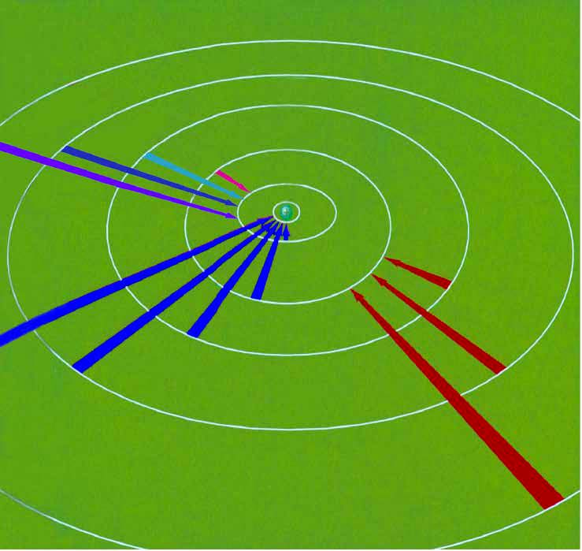

# 原子与元素

$$
\gdef\el#1#2#3{\mathrm{#1#2^{#3}}}
\gdef\za#1#2{\ce{#1}\left({#2}\right)}
\gdef\zb#1#2{\left[\ce{#1}\right]{#2}}
$$

## 原子结构理论

### 原子结构模型

| 时间 | 科学家 | 模型名称 | 备注 |
| :-: | :-: | :-: | :-: |
| 公元前 400 多年 | （古希腊）德谟克利特 | 原子唯物论 | 构成物质的最小单位 |
| 1803 年 | （英国）道尔顿 | 原子论 | 具有实在意义的微粒的概念 |
| 1904 年 | （英国）汤姆孙 | 葡萄干布丁模型 | 在发现电子的基础上 |
| 1911 年 | （英国）卢瑟福 | 核式模型 | 根据 α 粒子散射实验 |
| 1913 年 | （丹麦）玻尔 | 原子结构模型 | 氢原子光谱 |
| 20 世纪 20 年代中期 | 薛定谔等 | 量子力学模型 | 电子云 |

波尔的原子结构模型：

1. 原子中的电子在具有确定半径的圆周轨道上绕原子核运动，并且不辐射能量。

2. 在不同轨道上运动的电子具有不同的能量（$E$），而且能量值是不连续的，这称为能量“量子化”。轨道能量依 $n$ 值（$1,2,3,\dots$）的增大而升高，$n$ 称为量子数。对氢原子而言，电子处在 $n=1$ 的轨道时能量最低，这种状态称为基态；能量高于基态能量的状态，称为激发态。

3. 只有当电子从一个轨道（能量为 $E_i$）跃迁到另一个轨道（能量为 $E_j$）时，才会辐射或吸收能量。当辐射或吸收的能量以光的形式表现出来并被记录时，就形成了光谱。

4. 玻尔原子结构模型成功地解释了氢原子光谱是线状光谱的实验事实，阐明了原子光谱源自核外电子在能量不同的轨道之间的跃迁，指出了电子所处的轨道的能量是量子化的。但是其局限性在于，复杂的光谱现象无法解释。

下面我们会详细讲解。

### 原子轨道

- 核外电子按能量不同分成能层，电子的能层从核由内向外排序。

- 能层越高，电子的能量越高，能量的高低顺序为 $E(K)<E(L)<\dots<E(Q)$。

- 记忆方法，起于国王终于皇后（from K king to Q queen）。

/// caption
能层与能级
///

- 任意能层的等级从 s 级开始，每一能层的能级数等于该能层虚数。

- 即第一能层 1s 一个能级，第二能层 2s, 2p 两个能级，第三能层 3s, 3p, 3d 三个能级，第四能层 4s, 4p, 4d 四个能级。

- 能级的字母符号总是按照 s, p, d, f 排序的，记为开始（s start）于 PDF（便携式文档格式），他们可容纳的最多电子数依次为 $1,3,5,7$ 的二倍。

- 同一能层不同能级电子能量接近，故电子先分层后分级。

### 基态与激发态

- 处于最低能量状态的原子叫做基态，基态原子吸收能量，它的原子灰跃迁到较高能级变为激发态原子。

- 电子从较高的激发态跃迁到较低的激发态，甚至基态（易错：不一定跃迁到基态，有可能跃迁到较低的激发态）时会释放能量。

- 光（辐射）是电子跃迁释放能量的重要形式，……都与原子核外电子跃迁释放能量有关。

### 原子光谱

光谱：

- 光谱的定义：利用仪器将物质吸收的光或发射的光的波长和强度分别记录下来，就得到光谱。

- 连续光谱：若光谱是由各种波长的光所组成，且相近的波长差别极小而不能分辨，则这种光谱为连续光谱，例如阳光的光谱即为连续光谱。

- 线性光谱：若光谱是由具有特定波长、彼此分立的谱线组成，则所得的光谱为线性光谱。

- 原子光谱通常是线性光谱，原子光谱源自核外电子在能量不同的轨道之间的跃迁，而电子所处的轨道的能量是量子化的，电子从一个轨道跃迁到另一个轨道时，辐射或吸收的能量是不连续的，以光的形式表现出来的光的波长是不连续的。

不同元素的电子发生跃迁会释放或吸收不同的光，可以用光谱仪摄取各种原子的「吸收光谱」（从低能量到高能量）或「发生光谱」（从高能量到低能量），总称为原子光谱。

{ align=right width="35%" }

如右图，

- 电子从能量较高的轨道跃迁到 $n=1$ 的轨道所形成的谱线在紫外光区。
- 电子从能量较高的轨道跃迁到 $n=2$ 的轨道所形成的谱线在可见光区，可见光区的四条谱线分别为一条红色的、一条蓝色的和两条紫色的。
- 电子从能量较高的轨道跃迁到 $n=3$ 的轨道所形成的谱线在红外光区。

在现代化学中，常利用原子光谱上的特征谱线来鉴定元素，称为光谱分析。

### 构造原理

根据光谱学事实，人们**理想化**的总结出，从氢开始随着核电荷数的递增，新增电子填入能层、能级的顺序，称为构造原理：核电荷数每增加一，核外电子增加一个，填满一个能级后开始填入下一个能级，根据构造原理可以得到元素周期表中各元素**基态原子**的电子排布。

构造原理告诉我们，随着电荷数递增，电子不总是填满一个能层后，再开始填入下一个能层的（这个对于前 $20$ 号元素满足）。同时基于光谱学事实，存在**能级交错**的现象，表明了电子排布顺序（如图）。

{ width="70%" }

然而，构造原理是基于光谱学事实的理想化、经验化的，某些过渡元素基态原子电子排布不符合构造原理，例如 $\za{Cu}{\el3d{10}\el4s{1}},\za{Cr}{\el3d5\el4s1}$。

不仅如此, 核外运动的电子还存在一种被称为“自旋”的量子化状态。处于同一原子轨道上的电子自旋状态只能有两种，分别用符号 $\uparrow$ 和 $\downarrow$ 表示。氢原子的电子由 $n=2$ 的状态跃迁到 $n=1$ 的状态时得到两条靠得很近的谱线，钠的原子光谱中存在靠得很近的两条黄色谱线，都与电子的自旋有关。这里的“自旋”并不意味着电子像地球那样绕轴“自转”，它的实质仍在探索之中。

以硫元素（第 $16$ 号元素）为例：

| | 表示 | 要求及说明 |
| :-: | :-: | - |
| 原子结构示意图 | $+16\space2\space8\space6$ | |
| 电子排布式 | $\el1s2\el2s2\el2p6\el3s2\el3p4$ | 一般情况下能层低的能级要写在左边 |
| 价电子排布式 | $\el2s2\el3p4$ | 仅保留能层最高的一层（最外层电子） |
| 简化电子排布式 | $\zb{Ne}{\el3s2\el3p4}$ | 将内层电子用其对应的稀有气体元素表示 |

### 电子云模型

概率密度：

- 用 $P$ 表示电子在某处出现的概率，$V$ 表示该处的体积，则 $\roh=P/V$ 称为概率密度。

- 意义：点密集的地方，表示电子在此处单位体积内出现的概率大；点稀疏的地方，表示电子在此处单位体积内出现的概率小。

电子云：

- 核外电子的概率密度分布看起来像一片云雾，故称为电子云。

- 电子云是处于一定空间运动状态的电子在原子核外空间的概率密度分布的形象化描述。

- 电子云轮廓图是表示电子云轮廓的形状，以对核外电子的空间状态有一个形象化的简便描述。

不同能级的电子云轮廓：

- 任意能层 s 能级的电子云轮廓是球形，只有一种空间延伸方向，故只有一个原子轨道。

- 任意能层 p 能级的电子云轮廓是哑铃形（纺锤形），有三种空间延伸方向，称为 $\mathrm{p}_x,\mathrm{p}_y,\mathrm{p}_z$，故有三个原子轨道。

- 当有磁场时，同能级上电子能量不同，说明电子云在合外空间伸展方向不同。

{ width="80%" }
