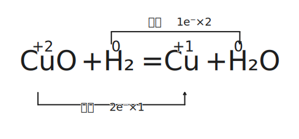
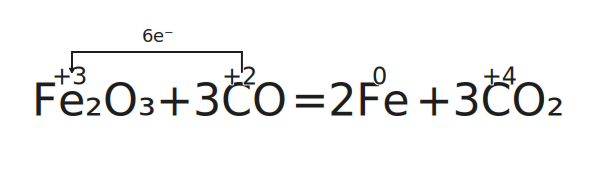

# 化学基础

$$
\gdef\ceq{\xlongequal{\quad}}
\gdef\val#1#2{\overset{#2}{\ce{#1}}}
\textrm{This page intentionally left blank.}
$$

## 物质的分类

{ width="100%" }

## 物质的量计算

### 物质的量相关定义

#### 物质的量

反映粒子数目：符号 $n$，单位 $\pu{mol}$。

重点：指明具体的**微观**物质粒子（原子、离子、分子、质子、电子、种子）。

#### 阿伏伽德罗常数

数值上：

$$
\begin{aligned}
N_A&=6.022\ 140\ 76\times10^{23}\pu{mol^-1}
\end{aligned}
$$

一般取约数为 $6.02$，注意：

- 早期的阿伏伽德罗常数定义为 $\pu{12g}$ 的 $\ce{^12C}$ 中所含的原子个数。
- 现代的定义是一个固定的值（上），由阿伏伽德罗常数和质量定义物质的量。

$$
n=\dfrac N{N_A}
$$

其中 $N$ 表示微粒个数。

#### 摩尔质量

单位物质的量的物质所具有的质量：

$$
M=\dfrac{m}{n}
$$

标准单位为 $\pu{g/mol}$，此时摩尔质量数值上等于粒子的相对质量。

#### 摩尔体积

单位物质的量的物质所具有的体积：

$$
V_m=\dfrac{V}{n}
$$

标准单位为 $\pu{L/mol}$，具体的数值与：

- 微粒种类（直径、间距）和个数。
- 温度和压强（一般对于气体）。

有关。

特殊的，在 $\pu{0^oC,101kPa}$（标准状况，STP 标况），任何气体的摩尔体积都等于 $\pu{22.4L/mol}$。

注意：标况下 $\ce{H2O,SO3,CCl4}$ 以及酒精不是气体。

#### 物质的量浓度

质量分数定义式：

$$
\omega(B)=\dfrac{m(B)}{m}
$$

物质的量浓度定义式：

$$
c(B)=\dfrac{n(B)}{V}
$$

需要注意：

- 溶液的体积不等于溶剂的体积与溶质体积简单相加，除非题目特殊说明。
- 特殊的，$\ce{CO2,NH3}$ 溶于水，当做 $\ce{H2CO3,NH3*H2O}$ 处理。

离子浓度与离子化合物浓度、原子个数成正比。

### 物质的量相关方法

#### 溶液的稀释

根据：

$$
c_1V_1=c_2V_2
$$

直接计算即可。

#### 浓度公式推导

两个推导公式：

$$
c=\dfrac{1000\rho\omega}M
$$

$$
n=\dfrac{V\rho\omega}M
$$

注意单位换算即可。

#### 基本方法

三步法：

$$
n=\dfrac{N}{N_A}=\dfrac{m}{M}=\dfrac{V}{V_m}=cV
$$

1. 求物质的量。
2. 根据计量数换离子。
3. 求对应的量。

#### 平均摩尔质量

$$
\bar M=\dfrac{\sum m_i}{\sum n_i}=\sum M_ic_i
$$

十字交叉法：

{ width="70%" }

## 电解质和电离

### 电解质和非电解质

电解质：在水溶液中**或**熔融状态下导电的**化合物**。

非电解质：在水溶液中**和**熔融状态下都不导电的**化合物**。

- 常见的电解质：酸、碱、盐、金属氧化物、水。

- 常见的非电解质：非金属氧化物（除了水）、$\ce{NH3}$、部分有机物。

- 注意，单质和混合物无权参与电解质和非电解质的分类。

注意区分：能导电的物质有酸碱盐的水溶液、熔融的碱性氧化物、石墨和金属、$\ce{Fe(OH)3}$ 胶体。

### 电离和强弱电解质

#### 强电解质

在水中完全电离的电解质，称为强电解质。

常见的强电解质有：强酸、强碱、大部分盐、活泼金属氧化物（$\ce{Na2O,Na2O2,CaO}$）。

六大强酸：氢氯酸 $\ce{HCl}$、氢溴酸 $\ce{HBr}$、氢碘酸 $\ce{HI}$、硫酸 $\ce{H2SO4}$、硝酸 $\ce{HNO3}$、高氯酸 $\ce{HClO4}$。

高氯酸是自然界最强的含氧酸，详见原子周期律部分。

四大强碱：$\ce{KOH,NaOH,Ca(OH)2,Ba(OH)2}$。

#### 弱电解质

在水中不完全电离的电解质，称为弱电解质。

常见的弱电解质有：弱酸、弱碱、极少数盐（$\ce{HgCl2,HgCl,(CH3COO)2Pb}$ 醋酸铅）、不活泼金属氧化物、水。

要注意的是，氢氧化镁 $\ce{Mg(OH)2}$ 属于中强碱，其属于强电解质还是弱电解质有争议。

#### 电离方程式的书写

强电解质用横线连接，例如：

$$
\ce{NaCl \ceq Na+ + Cl-}
$$

$$
\ce{H2SO4 \ceq 2H+ + SO4^2-}
$$

$$
\ce{Ba(OH)2 \ceq 2OH- + Ba^2+}
$$

$$
\ce{FeSO4 \ceq Fe2+ + SO4^2-}
$$

弱电解质用可逆号连接，例如：

$$
\ce{CH3COOH <=> CH3COO- + H+}
$$

$$
\ce{HAC <=> AC- + H+}
$$

$$
\ce{NH3 + H2O <=> NH3*H2O <=> NH4+ + OH-}
$$

$$
\ce{AlO_2^- + H3O+ <=> Al(OH)3 <=> Al3+ + 3OH-}
$$

$$
\left\{
\begin{aligned}
\ce{H2CO3 &<=> H+ + HCO3-}\\
\ce{HCO3- &<=> H+ + CO3^2-}
\end{aligned}
\right.
$$

即，多元弱酸分布电离，多元弱碱一步电离。

#### 特殊的电离方程式

注意：$\ce{NaHSO4}$ 的电离方程式书写要分情况。

- 在水中：$\ce{NaHSO4 \ceq Na+ + H+ + SO4^2-}$。

- 熔融下：$\ce{NaHSO4 \ceq Na+ + HSO4-}$。

注意：$\ce{NaHCO3}$ 的电离方程式书写要注意。

- 熔融状态下：发生反应 $\ce{2NaHCO3 -> Na2CO3 + H2O + CO2}$。

- 在水中，分布电离：

    $$
    \left\{
    \begin{aligned}
    \ce{NaHCO3 &\ceq Na+ + HCO3-}\\
    \ce{HCO3- &<=> H+ + CO3^2-}
    \end{aligned}
    \right.
    $$

注意，存在非氧化还原反应强酸制弱酸的反例：

$$
\ce{CuSO4 + H2S -> CuS v + H2SO4}
$$

实质是硫化铜溶解度过低，因此铜离子与 $\ce{S2-,HS-,H2S}$ 均不共存。

#### 导电能力的比较

- 与离子浓度成正比。
- 与离子电荷量成正比。
- 与离子的摩尔质量成反比。

### 离子反应

#### 离子反应的定义

在水溶液中，有离子参与（生成或消耗）的反应，称为离子反应。

存在有复分解、氧化还原、水解等类型，其中复分解反应反应条件为：

生成物有难溶物质（沉淀）、挥发性物质（气体）、弱电解质（水、醋酸等）。

例如：

$$
\ce{CH3COONa + HCl = NaCl + CH3COOH}
$$

也是强酸制弱酸的体现。

#### 离子反应方程式的书写

四步法：

1. 写化学方程式。
2. 拆强酸强碱可溶盐（注意不溶的即使是强电解质也不能拆）。
3. 删掉左右相同的，系数最简。
4. 检查原子守恒、电荷守恒。

不可以拆的物质如：

- 难溶物质、弱电解质、气体、单质、氧化物。
- 浓硫酸不拆，浓硝酸、浓盐酸可以拆。
- 微溶物如氢氧化钙，做生成物不拆，反应物清拆浊不拆。

注意一定要符合客观事实。

## 氧化还原反应

### 氧化还原的定义

- 定义：有化合价变化的反应。
- 本质：电子的转移（得失或偏移）。

其中，化合价有：

| 元素 | 化合价规律 |
| :-: | :-: |
| $\ce{H}$ | 一般显 $+1$ 价 在金属氢化物中显 $-1$ 价 |
| $\ce{O}$ | 一般显 $-2$ 价 在过氧化物中显 $-1$ 价 |
| $\ce{F}$ | 只显 $-1$ 价（没有正价） |

特殊物质化合价

| 物质 | 物质 | 物质 | 物质 |
| :-: | :-: | :-: | :-: |
| $\ce{K2\val{Fe}{+4}O4}$ 高铁酸钾 | $\ce{K2\val{Cr}{+6}_2O7}$ 重铬酸钾 | $\ce{K\val{Mn}{+7}O4}$ 高锰酸钾 | $\ce{\val{O}{+2}\val{F}{-1}_2}$ 二氟化氧 |
| $\ce{\val{B}{+3}_2H6}$ | $\ce{\val{Si}{+4}H4}$ | $\ce{\val{C}{+4}H4}$ | $\ce{\val{S}{+6}_2O8^2-}$ |

### 氧化还原的特征与规律

氧化还原反应反应的特征：

- 氧化反应和还原反应是在一个反应中同时发生的。

- 氧化反应反应伴随着化合价的升降，且升降总数相等。

反应物和生成物：

- 氧化剂得电子，化合价降低，以自己的氧化能力将还原剂氧化，自身发生还原反应，被还原后生成还原产物。

- 还原剂失电子，化合价升高，以自己的还原能力将氧化剂还原，自身发生氧化反应，被氧化后生成氧化产物。

简记为：升失氧化还原剂，降得还原氧化剂。

- 歧化反应：一样的反应物或元素，其一化合价上升，另一下化合价降；常发生在碱性环境中。

- 归中反应：两个或多个含有某元素而化合价不同的反应物，得到化合价相同的单一产物；常发生在酸性环境中。

对于反应的判断，有性质：

- 所有置换反应都是氧化还原反应。

- 有单质参与的化合或分解反应都是氧化还原反应。

总结规律如下：

- 电子守恒：价态有升有降，且升降总数相等。

- 能不变就不变：

    - 相近转化、能不相交就不相交。

    - 同时一个元素化合价不变的原子不参与氧化还原反应。

    - 相邻价态不反应。

- 强者先行：假设法，例如 $\ce{Cl2}$ 先氧化 $\ce{FeI2}$ 中的碘离子。

### 常见的氧化剂和还原剂

| 氧化剂 | 还原产物 | | 氧化剂 | 还原产物 |
| :-: | :-: | :-: | :-: | :-: |
| $\ce{HClO,Cl2,KClO3}$ | $\ce{Cl-}$ | | $\ce{KMnO4,MnO2(H+)}$ | $\ce{Mn^2+}$ |
| $\ce{O2,H2O2}$ | $\ce{H2O}$ | | $\ce{H2SO4(浓)}$ | $\ce{SO2}$ |
| $\ce{HNO3(浓)}$ | $\ce{NO2}$ | | $\ce{HNO3(稀)}$ | $\ce{NO}$ |
| $\ce{Br2}$ | $\ce{Br-}$ | | $\ce{I2}$ | $\ce{I-}$ |
| $\ce{Fe^3+}$ | $\ce{Fe^2+}$ | | $\ce{Ag+}$ | $\ce{Ag}$ |

| 还原剂 | 氧化产物 | | 还原剂 | 氧化产物 |
| :-: | :-: | :-: | :-: | :-: |
| $\ce{S2-,H2S}$ | $\ce{S}$ | | $\ce{SO2,SO3^2-}$ | $\ce{SO4^2-}$ |
| $\ce{NH3}$ | $\ce{N2,NO}$ | | $\ce{H2O2}$ | $\ce{O2}$ |
| $\ce{CO,C}$ | $\ce{CO2}$ | | $\ce{I-}$ | $\ce{I2}$ |

### 氧化性和还原性的比较

1. 同种元素：

    - 最高价态只降不升，最低价态只升不降。

    - 一般价态越高氧化性越强，价态越低氧化性越弱。

2. 互补性：单质氧化性越强，其对应的离子还原性越弱。

    - （金属）活动性顺序：

        氧化性：$\ce{Ag+ > Fe^3+ > Cu^2+ > H+ > \dots > Fe^2+ > \dots}$

        还原性：$\ce{Au < Ag < Cu < (H) < \dots < Fe < \dots}$

    - （非金属）活动性顺序：

        氧化性：$\ce{F2 > Cl2 > Br2 > I2 > S}$。

        还原性：$\ce{F- < Cl- < Br- < I- < S^2-}$。

3. 根据反应条件与反应现象：

    - 与同一类反应物反应，条件越低越强。

    - 与同一类反应物反应，反应越剧烈越强。

4. 不是很不准确的（存疑）：

    - 通常价位变化越大越强（反例：硝酸）。

    - 通常浓度越大越强，酸性越强氧化性越强（对于 $\ce{ClO-,MnO4-,NO3-}$ 等含氧酸）。

5. 根据反应方程式判断：

    - 两强制两弱：氧化剂氧化性大于氧化产物，还原剂还原性大于还原产物。

    - 不能说氧化剂氧化性大于还原剂，只能说某一条件下某物质表现了氧化性或还原性。

6. 有还原性不一定表现还原性，有强氧化性也不一定表现氧化性。

常见物质氧化性、还原性顺序表：

- 氧化性：$\ce{MnO4- > Cl2 > Br2 > Fe^3+ > I2 > SO2 > S}$。

- 还原性：$\ce{Mn^2+ < Cl- < Br- < Fe^2+ < I- < SO3^2- < S2-}$。

- 上表使用方法，找到左上、右下两组为反应物，找到对应左下、右上为产物。

### 单双线桥和方程式配平

用箭头表示电子的转移，依据是得电子数等于失电子数。

1. 标化合价升降。
2. 根据化合价升降守恒配平变价元素。
3. 根据原子守恒、电荷守恒配平其他元素和物质。

{ width="70%" }
/// caption
双线桥
///

{ width="70%" }
/// caption
单线桥
///

转移电子数为一条线上的，只考虑得到的电子数或者失去的电子数。
