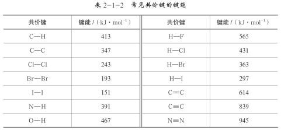
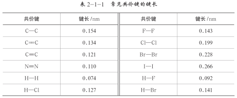

# 分子与晶体

## 化学键概述

### 化学键

化学键：**分子内部**相邻原子间**强烈**的**相互作用**，称为化学键，主要决定了物质的化学性质。

化学反应的过程实质是，旧化学键的断裂（吸收热量），和新化学键的生成（放出热量）。

化学键分为**离子键**、**共价键**、**金属键**，其中有**配位键**作为一个特殊的共价键。

### 离子键

离子键：阴阳离子之间强烈的静电作用，称为离子键，活泼金属（或铵根）与非金属之间易形成离子键。

离子化合物：含有离子键的化合物称为离子化合物，绝大多数盐（$\ce{AlCl3}$ 为特例）、强碱、活泼金属氧化物、硫化物为离子化合物

离子键强度：离子键强度越大，键能越大，熔沸点越高。

$$
F=k\dfrac{Q_1Q_2}{d^2}
$$

离子键的破坏：发生化学变化、电离（溶于水或熔融）。

### 金属键

## 共价键模型

### 共价键概述

共价键：原子间通过共用电子对形成的相互作用。

共价化合物：只有共价键的化合物称为共价化合物。

根据共用电子对数，可以分为单键、双键、三键。

注意区分：

- 含有离子键即为离子化合物，只有共价键才为共价化合物。

- 离子化合物中可能含有共价键，共价化合物中不可能有离子键。

特性：

- 饱和性：

- 方向性：

稳定条件：

- 电子配对原理：两原子各自提供 $1$ 个自旋方向相反的电子，彼此配对。

- 最大重叠原理：重叠部分越大，核间电子的概率密度越大，形成的共价键越牢固，分子越稳定。

共价键分为极性键和非极性键：

- 极性键：不同元素两个原子，共用电子偏向电负性强的原子，显示负电性，另一原子显示正电性。

- 非极性键：相同元素两个原子，对称，两原子均不显电性，例如在形成氯化氢分子时，氯原子吸引电子的能力比氢原子强，使氯原子带部分负电荷（$\delta^-$）、氢原子带部分正电荷（$\delta^+$），所形成的共价键是极性键。

### 共价键类型

- $\sigma$ 键：原子轨道以「头碰头」方式相互重叠导致电子在核间出现的概率增大而形成的共价键。

- $\pi$ 键：原子轨道以「肩并肩」方式相互重叠导致电子在核间出现的概率增大而形成的共价键。

{ width="70%" }

| 共价键类型 | $\sigma$ 键 | $\pi$ 键 |
| :-: | :-: | :-: |
| 电子云重叠方式 | 沿键轴方向相对重叠 | 沿键轴方向平行重叠 |
| 电子云重叠程度 | 大，因此键的强度大 | 小，因此键的强度小 |
| 化学活泼性 | 不活泼 | 活泼 |

成键规律：

- 共价单键是 $\sigma$ 键。

- 共价双键中一个是 $\sigma$ 键，一个是 $\pi$ 键。

- 共价三键中一个是 $\sigma$ 键，两个是 $\pi$ 键。

- 两个原子形成共价键时先形成 $\sigma$ 键，后形成 $\pi$ 键。

### 电子式

咕咕咕。

### 结构式

咕咕咕。

### 分子轨道理论

根据已学的知识，氧分子的结构是 $\ce{O \bond{2} O}$，因此，氧分子中的电子已经完全配对，氧分子应该是逆磁性分子。但事实上，将液态氧倒入配有磁铁的仪器中时，氧分子被磁场吸引而悬浮在磁场中，这说明氧分子是顺磁性分子，即分子中存在未成对电子。

利用分子轨道理论能够很好地解释氧分子是顺磁性分子这一事实。

- 分子轨道理论认为，分子中的每个电子都是在整个分子中运动的，分子中的单电子运动状态可以用分子轨道来描述。分子轨道可以用能级相近的原子轨道线性组合来表示。

- 光电子能谱为分子轨道理论提供了实验基础，若入射光的能量超过一定值，就能够将电子击出，由此产生的电子称为光电子。通过光电子能谱可以了解分子轨道能级的信息。

### 分子光谱

分子光谱和分子内部的运动密切相关，涉及的分子运动方式主要为：

1. 分子的转动，吸收或发射的光处在远红外区或微波区，称为远红外光谱或微波谱。

2. 分子中原子间的振动，通常振动光谱在近红外区和中红外区，一般称为红外光谱。

3. 分子中电子在不同能级的分子轨道间跃迁，得到紫外 $\sim$ 可见光谱。

因此：

- 键长缩短、键能加强，化学键的伸缩振动频率升高，在红外光谱中对应吸收峰值的频率依次增加。

- 基于红外光谱中吸收峰值的频率可以推测分子中存在的官能团，进而为推测分子结构提供证据。

- 物质的浓度越高，其吸收峰的强度则越大，因此分子光谱还被广泛用于测定物质浓度。

## 键参数

### 键能

化学键的断裂需要吸收能量，常用键能来表示化学键的强弱程度。

在常温差压下（$\pu{1\times10^5 Pa, 298 K}$），断开 $\pu{1 mol} \ce{AB(g)}$ 分子中的化学键，使其分别生成气态 $\ce A$ 原子和气态 $\ce B$ 原子所吸收的能量称为 $\ce{A-B}$ 键的键能，常用 $E_{\ce{A-B}}$ 表示。

{ width="100%" }

表中的键能数据是对大量分子进行统计得到的平均值。

### 键长

两个成键原子的原子核间的距离（简称核间距）叫作该化学键的键长。

{ width="100%" }

键长是影响分子空间结构的因素之一。键长的数值可以通过晶体 X 射线衍射实验进行测定，也可以通过理论计算求得。

### 键角

在多原子分子中，两个化学键的夹角叫作键角。

键角可通过晶体 X 射线衍射实验测定，常用于描述多原子分子的空间结构。

### 共价键强弱判断

对于键能和键长：

- 键能的大小可以定量地表示化学键的强弱。

- 一般而言，化学键的键长愈短，化学键就愈强，键就愈牢固。

总的来说：

- 键长越短，键能愈大，断开时需要的能量就愈多，这个化学键就愈牢固。

- 键长越长，键能愈小，断开时需要的能量就愈少，这个化学键就愈不牢固。

- 原子半径越小、共用电子对越多、元素电负性越大，一般越牢固，键长越小。

分子的性质由：

- 键能、键长，决定分子的稳定性。

- 键长、键角，决定分子的空间结构。

## 分子的空间结构

### 空间结构概述

### 杂化轨道理论

### 价电子对互斥理论

### 等电子原理

### 原子排布对称性

### 电荷分布与极性

### 分子中键参数比较

### 大 $\pi$ 键分析

## 分子间作用力

### 范德华力

### 氢键

### 超分子

## 晶体概述

### 晶体与晶胞

晶胞：描述晶体结构的最小单元。

原子在晶胞中的占有率：$n$ 个晶胞完全包含该原子，则该原子对每个晶胞有 $1/n$。

| 原子位置 | $n$ 个包含 | 占有率 |
| :-: | :-: | :-: |
| 体内 | $1$ | $1/1$ |
| 面上 | $2$ | $1/2$ |
| 棱上 | $4$ | $1/4$ |
| 顶点 | $8$ | $1/8$ |

### 熔沸点比较
