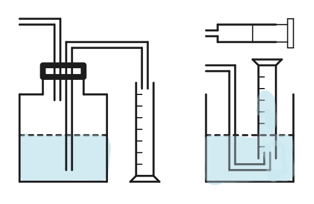
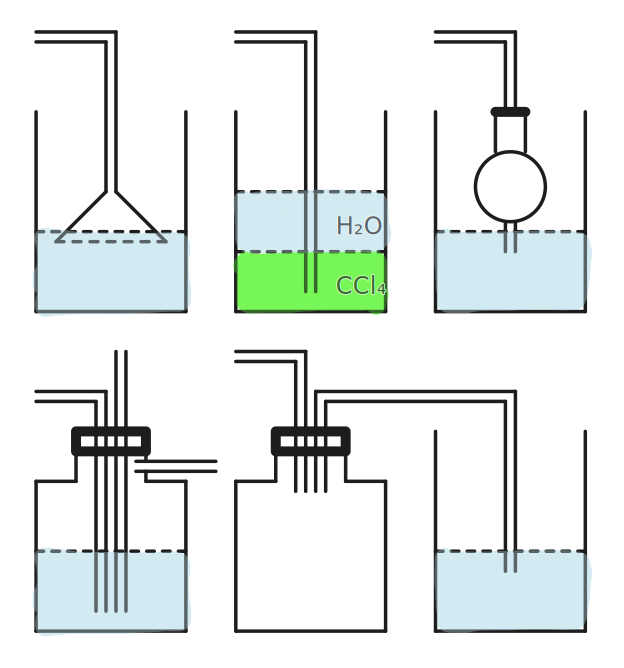

# 化学与技术

## 离子相关内容

### 离子的共存

#### 复分解型不共存

常见离子不共存：

| 离子 | 不共存离子和物质 |
| :-: | :-: |
| $\ce{H+}$ | $\ce{CO3^2-,HCO3-,OH-,SO3^2-,HSO3-,SiO3^2-}$、氢前金属 |
| $\ce{OH-}$ | $\ce{H+,HCO3-,NH4+,Cu^2+,Al^3+}$ |
| $\ce{CO3^2-}$ | $\ce{H+,Ca^2+,Ba^2+,Ag+}$ |
| $\ce{SO4^2-}$ | $\ce{Ca^2+,Ba^2+,Ag+}$ |
| $\ce{Ag+}$ | $\ce{Cl-,CO3^2-,SO4^2-,OH-}$ |

#### 氧化还原型不共存

- 酸性条件下硝酸根和亚铁离子。

- 咕咕咕。

#### 配合反应不共存

- 铁离子和硫氰酸根。

- 咕咕咕。

#### 双水解型不共存

- 硫离子和铝离子。

- 咕咕咕。

### 离子的检验和鉴别

#### 观察法

- 离子颜色：

    | 离子符号 | 名称 | 颜色 |
    | :-: | :-: | :-: |
    | $\ce{KMnO4-}$ | 高锰酸根 | 紫红色 |
    | $\ce{CrO4^2-}$ | 铬酸根 | 黄色 |
    | $\ce{Cr2O7^2-}$ | 重铬酸根 | 橙红色 |

- 注意：清澈透明可以有色。

#### 沉淀气体法

常见检验方法：

| 离子 | 检验方法 |
| -: | :- |
| $\ce{H+}$ | 酸碱指示剂、氢前金属、**碳酸氢盐**、金属氧化物 |
| $\ce{OH-}$ | 酸碱指示剂、弱碱对应金属盐、**铵盐** |
| $\ce{CO3^2-}$ | $\ce{H+,Ca^2+,Ba^2+}$ |
| $\ce{SO4^2-}$ | 先加稀盐酸，后加 $\ce{BaCl2} $不溶解 |
| $\ce{NH4+}$ | 加浓氢氧化钠产生碱性、有刺激性气味气体 |

#### 滴定实验

- 咕咕咕。

#### 离子的鉴别

- 咕咕咕。

### 离子的分离提纯

#### 过滤

- 范围：固液不互溶。

- 仪器：烧杯、漏斗、玻璃棒。

- 通常伴随洗涤和干燥。

#### 结晶

单一溶质：

- 不带结晶水且稳定的：

    - 蒸发结晶，出现大量晶体时停止加热（蒸干）。
    
    - 玻璃棒：搅拌，使受热均匀，防止喷溅。

- 带结晶水或不稳定的：

    - 蒸发浓缩，冷却结晶，过滤，洗涤，干燥。
    
    - 降温结晶：出现少量晶体或表面出现晶膜后停止。

多种溶质：

- 得到溶解度随温度变化小的：

    - 蒸发浓缩，趁热过滤，洗涤，干燥。
    
    - 趁热过滤：防止杂质降温析出，减少损耗，提高浓度。

- 得到溶解度随温度变化大的：

    - 加热浓缩，蒸发结晶。

    - 蒸发浓缩，冷却结晶，过滤，洗涤，干燥。

#### 洗涤

- 洗涤：使固体纯净，减少测量误差、提高纯度。

- 冰水洗涤：洗去晶体表面的杂志离子，减少晶体在洗涤过程中的溶解损耗。

- 无水乙醇洗涤：除去表面水分、易于干燥。

- 证明洗涤干净：取样，加沉淀试剂，如无沉淀则证明洗净。

- 干燥：连续两次干燥，质量差值小于 $\pu{0.1g}$。

#### 升华

- 固固混合，其一易升华。

- 例如 $\ce{NH4Cl}$ 受热分解，随即化合重新生成。

#### 渗析

- 分离胶体和溶液，详见分散系。

#### 蒸馏

- 蒸馏烧瓶内加入沸石防暴沸。

- 温度计球上表面与管下表面相切。

- 冷凝水从下进入，从上流出。

- 不能蒸馏共沸物（例如水和乙醇）。

- 分馏：多温度多产物，例如石油分馏。

#### 滴定

- 常见滴定误差分析：

    - $\ce{I-}$ 会被空气中的氧气氧化，滴定 $\ce{I2}$ 偏高。

## 气体相关内容

### 气体的制取

#### 发生原理[^noteg]

[^noteg]: 此处只放非七种元素相关的气体制取方法。

| 气体 | 方程式 |
| -: | :- |
| $\ce{H2}$ | $\ce{Zn + H2SO4 -> H2 ^ + ZnSO4}$ |
| $\ce{CO2}$ | $\ce{CaCO3 + 2HCl -> CaCl2 + H2O + CO2 ^}$ |
| | $\ce{Na2CO3 + H2SO4 -> Na2SO4 + H2O + CO2 ^}$ |
| $\ce{O2}$ | $\ce{2H2O2 ->[MnO2] 2H2O + O2 ^}$ |
| | $\ce{2KClO3 ->[MnO2] 2KCl + 3O2 ^}$ |
| | $\ce{2KMnO4 ->[\triangle] K2MnO4 + MnO2 + O2 ^}$ |
| $\ce{HCl}$ | $\ce{2NaCl + H2SO4(浓) ->[\triangle] Na2SO4 + 2HCl}$ |
| | 浓硫酸滴到浓盐酸里（吸水放热、溶剂减少） |
| $\ce{HX}$（$\ce{Br/I}$） | $\ce{3NaX + H3PO4(浓) ->[\triangle] Na3PO4 + 3HX}$ |

#### 发生装置

| | 加热 | 常温 |
| :-: | :-: | :-: |
| **固固** | 烧杯或试管 | 烧杯或试管 |
| **固液** | 烧杯或试管 | 烧杯或试管 |
| **固气** | 硬质玻璃管 | 玻璃管 |
| **液液** | 烧杯或试管 | 烧杯或试管 |
| **液气** | 烧杯或试管 | 烧杯或试管 |
| **气气** | 集气瓶 | 集气瓶 |

#### 检查装置气密性

- 前提：有封闭气体生成。

- 理论：气压差。

- 方法：加热有气泡、冷却回流，封闭水柱。

#### 净化装置

- 杂质的主要原因：水溶液挥发、副反应等。

- 净化原理：溶解性、酸碱性反应、干燥等。

- 净化的主要方式：洗气，粗进细出，长进短出。

#### 收集装置

- 排气法：

    - 根据密度和是否与空气反应选择。

    | | 长进短出 | 短进长出 |
    | :-: | :-: | :-: |
    | 向上排空气法 | 密度大 | 密度小 |
    | 向下排空气法 | 密度小 | 密度大 |

- 排液法：

    - 排水法：不与水反应。

    - 排油等不与气体反应的物质法。

#### 量气装置

{ width="100%" }

- 上图为业余测量装置，测量结果会被压强、温度影响。

- 专业的量气装置，读数前需要冷却，调整左右液面向平后读数。

#### 防堵塞装置

- 恒压分液漏斗。

- 在导管口放置棉花团，防止粉末堵塞试管。

- 下图左下。

#### 防倒吸装置

{ width="100%" }

#### 尾气处理

燃烧式处理：

- 燃着的酒精灯：$\ce{O2,H2}$。

吸收式处理（注意防倒吸）：

- 碱性溶液（$\ce{NaOH}$ 溶液）：$\ce{SO2,Cl2}$。

- 酸性溶液（稀硫酸）：$\ce{NH3}$。

- 水（严格注意防倒吸）：极易溶于水的 $\ce{NH3,HCl}$。

万能式处理：

- 气球收集。

- 然后扔给化学老师（雾）。

### 气体的检验和鉴别

#### 气体的检验方法

| 气体 | 检验方法 |
| -: | :- |
| $\ce{CO2}$ | 使澄清石灰水变浑浊 |
| $\ce{H2O}$ | 使无水硫酸铜变蓝 |
| $\ce{CO}$ | 还原氧化铜后，检验二氧化碳 |
| $\ce{H2}$ | 还原氧化铜后，检验水 |
| $\ce{HCl}$ | 使蓝色石蕊试纸变红，使硝酸银溶液产生沉淀 |
| $\ce{NH3}$ | 使红色石蕊试纸变红，有刺激性气味 |
| $\ce{SO2}$ | 使澄清石灰水变浑浊，使品红溶液褪色且可恢复，使酸性高锰酸钾溶液褪色 |
| $\ce{Cl2}$ | 黄绿色，使湿润的淀粉碘化钾试纸变蓝，使品红溶液褪色且不可恢复 |

#### 气体的检验步骤

- 检验先验水。

- 咕咕咕。

#### 气体的鉴别

- 咕咕咕。

### 气体的除杂

#### 气体的除杂方法

常见除杂方法：

| | 除杂方法 |
| -: | :- |
| $\ce{CO2(HCl)}$ | 饱和 $\ce{NaHCO3}$ |
| $\ce{CO2(SO2)}$ | 饱和 $\ce{NaHCO3}$，酸性高锰酸钾 |
| $\ce{H2(HCl)}$ | $\ce{NaOH}$ 或水 |
| $\ce{HCl(Cl2)}$ | 灼热铜网，生成 $\ce{CuCl2}$ 后除杂 |
| $\ce{Cl2(HCl)}$ | 饱和 $\ce{NaCl}$ |
| $\ce{N2(O2)}$ | 灼热铜网 |
| $\ce{NH3(CO2)}$ | 碱石灰 |
| $\ce{NO(NO2)}$ | 水 |

干燥装置：

| | 固体干燥剂（球形干燥管、U 形管） | 液体干燥剂（洗气瓶） |
| :-: | :-: | :-: |
| **酸性干燥剂** | 五氧化二磷（氧化性） | 浓硫酸（氧化性） |
| **碱性干燥剂** | 碱石灰（生石灰、氢氧化钠） | |
| **中性干燥剂** | 无水氯化钙（和氨气配合反应） | |

#### 气体的除杂步骤

- 除杂后除水。

- 咕咕咕。

## 工业流程

### 工业流程概述

1. 利益最大化：

    - 药品：便宜。

    - 装置：简单。

    - 操作：方便。

    - 环境：友好。

### 工业流程常用方法

- 粉碎：

    - 增加原料与气体或液体的接触面积。

    - 加快反应速率，使反应更充分。

- 控制温度：

    - 避免反应物或生成物过热分解和水解。

    - 例如：$\ce{H2O2,NH4+,KMnO4,AgNO3,HNO3}$。

- 通入惰性气体：

    - 常通入氮气、氦气、氩气（仅非常活泼）等。

    - 反应前排尽空气，反应后排产物，使充分吸收。

## 化学推理推断

### 非水溶液置换

Mg + CO2

Cl2 + HI(g)

Fe + H2O(g)

C + H2O -> CO + H2

### 多电子微粒

十电子微粒：

十八电子微粒：

二电子微粒：

十四电子微粒：
