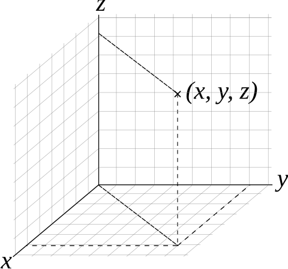

# 空间向量

{ align=right width="40%" }

## 空间向量基本概念

### 空间直角坐标系

直角坐标系也可以推广至三维空间与高维空间。

在原本的二维直角坐标系，再添加一个垂直于 $x$ 轴、$y$ 轴的坐标轴，称为 $z$ 轴。

### 空间向量基本性质

我们推导平面向量的基本性质：

|  | 平面向量 | 空间向量 |
| :-: | :-: | :-: |
| 基底分解 | $\bm a=(x,y)=x\bm e_1+y\bm e_2$ | $\bm a=(x,y,z)=x\bm e_1+y\bm e_2+z\bm e_3$ |
| 线性运算 | $\lambda\bm a=\lambda(x,y)=(\lambda x,\lambda y)$ | $\lambda\bm a=\lambda(x,y,z)=(\lambda x,\lambda y,\lambda z)$ |
| 向量点积 | $(x_1,y_1)\cdot(x_2,y_2)=x_1x_2+y_1y_2$ | $(x_1,y_1,z_1)\cdot(x_2,y_2,z_2)=x_1x_2+y_1y_2+z_1z_2$ |
| 点积意义 | $\bm a_1\cdot\bm a_2=\lvert\bm a_1\rvert\cdot\lvert\bm a_2\rvert\cos\theta$ | $\bm a_1\cdot\bm a_2=\lvert\bm a_1\rvert\cdot\lvert\bm a_2\rvert\cos\theta$ |
| 向量的模 | $\lvert\bm a\rvert=\sqrt{\bm a\cdot\bm a}=\sqrt{x^2+y^2}$ | $\lvert\bm a\rvert=\sqrt{\bm a\cdot\bm a}=\sqrt{x^2+y^2+z^2}$ |

### 空间向量基本定理

类似平面向量基本定理的，有：若基底 $\bm e_1,\bm e_2,\bm e_3$ 不共面，则对于空间内任一向量 $\bm a$，存在唯一实数 $x,y,z$ 使得 $\bm a=x\bm e_1+y\bm e_2+z\bm e_3$。

我们类似平面向量共线的定义，若 $\bm e_3$ 可以表示为 $\lambda\bm e_1+\mu\bm e_2$，则称 $\bm e_3$ 与 $\bm e_1,\bm e_2$ 共面。

本质还是张成空间。

## 空间中的距离

### 点与点的距离

根据毕达哥拉斯定理：

$$
|P_1P_2|=|\overrightarrow{P_1P_2}|=\sqrt{(x_1-x_2)^2+(y_1-y_2)^2+(z_1-z_2)^2}
$$

### 点与面的距离

如何确定一个平面？

- 三个点确定一个平面。
- 一个点和两个向量确定一个平面。
- 一个点和一个法向量确定一个平面。

其中，使用法向量最好用，因为只需要两个变量、五个参数即可确定一个平面。

!!! note "什么是法向量"
    三维平面的法线，或称**法向量**是垂直于该平面的三维向量。曲面在某点 P 处的法线为垂直于该点切平面的向量，一个平面存在无限个法向量。

    因为法向量是垂直于平面内每一条直线的，因此法向量与平面内直线的点积为零。

因此，我们问题是，给点一个点 $A$ 和一个法向量 $\bm n$，求出确定的平面 $\alpha$ 外一点 $P$ 到这个平面的距离。

???+ note "一个朴素方法"
    是不推荐使用的，但是很 trivial 的。

    我们对于点 $P$，做其到平面 $\alpha$ 的垂线，设垂足为 $P'$ 点。

    我们知道此时 $PP'\bot\alpha$，也就是说 $PP'$ 与 $\bm n$ 共线，其中 $\bm n$ 表示一个法向量。

    同时我们还知道平面上的点满足 $AP'\bot\bm n$，由此可以列出若干个关系式，解之即可。

我们直接连接点 $P$ 和点 $A$，则 $\overrightarrow{AP}$ 在 $\bm n$ 上的投影即为点到平面的距离：

$$
\begin{aligned}
|AP'|&=|\overrightarrow{AP}|\cos\theta\\
&=|\overrightarrow{AP}|\times\dfrac{|\overrightarrow{AP}\cdot\bm n|}{|\overrightarrow{AP}|\cdot|\bm n|}\\
&=\dfrac{|\overrightarrow{AP}\cdot\bm n|}{|\bm n|}
\end{aligned}
$$

即点到直线的距离为 $\dfrac{|\overrightarrow{AP}\cdot\bm n|}{|\bm n|}$。
