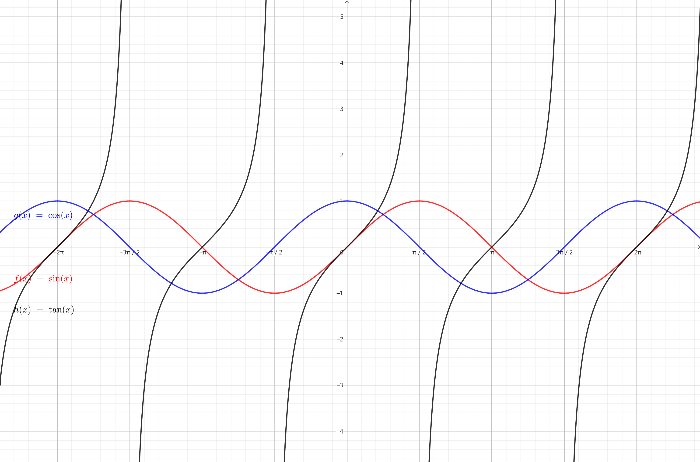

# 三角函数公式

## 任意角和角的计量

### 任意角的定义

平面内一条射线绕其端点从一个位置旋转到另一个位置形成的图形叫做角。

开始的位置称为始边，结束的位置称为终边。并规定：

- 按逆时针方向旋转形成的角叫做正角，其角度为正；
- 按顺时针方向旋转形成的角叫做负角，其角度为负；
- 终边相对于始边没有做任何旋转的角叫做零角，其角度为 $0$。

为什么逆时针是正角？考虑点 $(1,0)$ 绕着 $(0,0)$ 转一个锐角：

得到的点 $A(x,y)$ 一定满足 $x,y>0$，因此定义逆时针为正角。

这样就把角的概念推向了任意角。

### 弧度制的定义

弧度用符号 $\text{rad}$ 表示，读作「弧度」。

定义正角的弧度为正、负角的弧度为负，零角的弧度为 $0$；

如果半径为 $r$ 的圆的圆心角 $\alpha$ 所对弧长为 $l$ ，则：

$$
|\alpha|=\dfrac{l}{r}
$$

与角 $\alpha$ 终边位置相同的角的集合很容易得出，为：

$$
\{\varphi \mid \varphi = \alpha - 2k\pi, k \in \mathbb{Z}\}
$$

### 弧度与角度的转化

关键是，$180^\circ=\pi$，具体的：

以度数表示的角，把数字乘以 $\dfrac{\pi}{180^\circ}$ 便转换成弧度；

以弧度表示的角，乘以 $\dfrac{180^\circ}{\pi}$ 便转换成度数。

## 三角函数的定义

### 用直角三角形定义

直角三角形只有锐角三角函数的定义。

指定锐角 $\theta$，可做出直角三角形，使一个内角为 $\theta$：

定义：正弦 $\sin\alpha$ 表示 $\alpha$ 的对边与斜边的比值。

定义：余弦 $\cos\alpha$ 表示 $\alpha$ 的邻边与斜边的比值。

定义：正切 $\tan\alpha$ 表示 $\alpha$ 的对边与邻边的比值。

### 用直角坐标系定义

设点 $P(x,y)$ 是平面直角坐标系 $xOy$ 中的一点。

我们记 $\theta$ 是从 $x$ 旋转到 $OP$ 的角度，$r$ 是 $OP$ 长度。

则：

$$
\begin{aligned}
r=\sqrt{x^2+y^2}\\
\sin\theta=\frac{y}{r}\\
\cos\theta=\frac{x}{r}\\
\tan\theta=\frac{y}{x}\\
\end{aligned}
$$

这样可以定义任何角度的三角函数（除非当定义式无意义时）。

### 用单位圆定义

单位圆指半径为单位长度的圆。

通常是平面直角坐标系中以 $(0,0)$ 为圆心、半径为 $1$ 的圆。

单位圆上的点满足：$x^2+y^2=1$，即毕达哥拉斯定理。

指定一角 $\theta$，点 $(1,0)$ 旋转 $\theta$ 度得到的点 $A(x,y)$，那么：

$$
\begin{aligned}
x^2+y^2=1\\
\sin\theta=y\\
\cos\theta=x\\
\tan\theta=\frac{y}{x}\\
\end{aligned}
$$

### 常见的三角函数定义

$$
\begin{aligned}
\tan\alpha=\frac{\sin\alpha}{\cos\alpha}\\
\cot\alpha=\frac{1}{\tan\alpha}\\
\sec\alpha=\frac{1}{\cos\alpha}\\
\csc\alpha=\frac{1}{\sin\alpha}
\end{aligned}
$$

### 常见角度的三角函数

|    角度     |   弧度    | 正弦（$\sin$） | 余弦（$\cos$） | 正切（$\tan$） |
| :---------: | :-------: | :------------: | :------------: | :------------: |
|  $0^\circ$  |    $0$    |      $0$       |      $1$       |      $0$       |
| $30^\circ$  |  $\pi/6$  |     $1/2$      |   $\sqrt3/2$   |   $\sqrt3/3$   |
| $45^\circ$  |  $\pi/4$  |   $\sqrt2/2$   |   $\sqrt2/2$   |      $1$       |
| $60^\circ$  |  $\pi/3$  |   $\sqrt3/2$   |     $1/2$      |    $\sqrt3$    |
| $90^\circ$  |  $\pi/2$  |      $1$       |      $0$       |     无意义     |
| $120^\circ$ | $2\pi/3$  |   $\sqrt3/2$   |     $-1/2$     |   $-\sqrt3$    |
| $135^\circ$ | $3\pi/4$  |   $\sqrt2/2$   |  $-\sqrt2/2$   |      $-1$      |
| $150^\circ$ | $5\pi/6$  |     $1/2$      |  $-\sqrt3/2$   |  $-\sqrt3/3$   |
| $180^\circ$ |   $\pi$   |      $0$       |      $-1$      |      $0$       |
| $210^\circ$ | $7\pi/6$  |     $-1/2$     |  $-\sqrt3/2$   |   $\sqrt3/3$   |
| $225^\circ$ | $5\pi/4$  |  $-\sqrt2/2$   |  $-\sqrt2/2$   |      $1$       |
| $240^\circ$ | $4\pi/3$  |  $-\sqrt3/2$   |     $-1/2$     |    $\sqrt3$    |
| $270^\circ$ | $3\pi/2$  |      $-1$      |      $0$       |     无意义     |
| $300^\circ$ | $5\pi/3$  |  $-\sqrt3/2$   |     $1/2$      |   $-\sqrt3$​    |
| $315^\circ$ |   $7/4$   |  $-\sqrt2/2$   |   $\sqrt2/2$   |      $-1$      |
| $330^\circ$ | $11\pi/6$ |     $-1/2$     |   $\sqrt3/2$   |  $-\sqrt3/3$   |
| $360^\circ$ |  $2\pi$   |      $0$       |      $1$       |      $0$       |

### 正切函数及其性质

定义域：$\{x\mid x\neq k\pi+\pi/2,k\in\mathbb Z\}$；

值域：$(-\infty,+\infty)$

周期性：$T=\pi$；

单调性：在 $(k\pi-\pi/2,k\pi+\pi/2)$ 单调递增。

对称性：奇函数，关于 $(k\pi,0),k\in\mathbb Z$ 对称。

### 尼云定理

尼云定理指出，在 $0\sim90^\circ$ 范围内，如果正弦函数 $\sin$ 的自变量和因变量都要求是有理数，那么答案只有： 

$$
\begin{aligned}
\sin0^\circ&=0\\
\sin30^\circ&=1/2\\
\sin90^\circ&=1
\end{aligned}
$$

## 正弦、余弦函数及其性质

分析函数的套路：

- 定义域、值域、图像。

- 周期性、单调性。

- 对称轴、对称中心。

- 最大值、最小值、零点。

### 图像

{ width="100%" }

### 周期性

$$
\begin{aligned}
\sin\alpha=\sin(\alpha+2\pi)\\
\cos\alpha=\cos(\alpha+2\pi)
\end{aligned}
$$

可知 $\sin$、$\cos$ 是最小正周期为 $2\pi$ 的周期函数。

### 奇偶性

正弦函数是奇函数，余弦函数是偶函数。

### 对称性

1. 正弦函数：
   - 中心对称：$(k\pi,0),k\in\mathbb Z$；
   - 轴对称：$x=k\pi-\pi/2,k\in\mathbb Z$；

2. 余弦函数：
   - 中心对称：$(k\pi-\pi/2),k\in\mathbb Z$；
   - 轴对称：$x=k\pi,k\in\mathbb Z$。

- 对称中心：零点；对称轴：极值点。

### 单调性

1. 正弦函数：
   - 单调递增：$[2k\pi-\pi/2,2k\pi+\pi/2],k\in\mathbb Z$；
   - 单调递减：$[2k\pi+\pi/2,2k\pi+3\pi/2],k\in\mathbb Z$；

2. 余弦函数：
   - 单调递增：$[2k\pi-\pi,2k\pi],k\in\mathbb Z$；
   - 单调递减：$[2k\pi,2k\pi+\pi],k\in\mathbb Z$；

## 正弦曲线及其性质

定义：正弦曲线，形如 $y=A\sin(\omega x+\varphi)$。

注意到 $\sin$、$\cos$ 其实都属于正弦曲线。

### 函数 $y=A\sin x$ 的性质

我们发现这个操作其实就是对 $y$ 轴的伸缩：

若 $A>1$，图像伸长；若 $A<1$，图像压缩；伸缩倍率为 $A$。

也就是图像上任何一个点的纵坐标变成了原来的 $A$ 倍。

其中 $A$ 决定了函数上的点的纵坐标的变化幅度，我们称为振幅。

### 函数 $y=\sin(x+\varphi)$ 的性质

我们发现这个操作其实就是对 $y=\sin x$ 图像的平移：

若 $\varphi>0$，图像向左平移；若 $\varphi<0$ 图像向右平移；平移单位为 $|\varphi|$。

也就是点 $P(x,\sin x)$ 平移到了 $P'(x-\varphi,\sin x)$。

其中 $\varphi$ 决定了初始时刻的位置，我们称为初相。

### 函数 $y=\sin(\omega x)$ 的性质

我们发现这个操作其实就是对 $x$ 轴的伸缩：

若 $\omega>1$，图像压缩；若 $\omega<1$，图像伸长；伸缩倍率为 $1/\omega$。

也就是点 $P(x,\sin x)$ 平移到了 $P'\left(\dfrac{x}{\omega},\sin x\right)$。

其中 $\omega$ 决定了函数值的变化快慢，我们称为角速度。

由于 $\sin x$ 的最小正周期为 $2\pi$，因此 $\sin(\omega x)$ 的最小正周期为：

$$
T=\frac{2\pi}{\omega}
$$

### 函数 $y=\sin(\omega x+\varphi)$ 的性质

一下为作者以前写的文字，简单来说思想有两个：

- 一切变换是对于 $x,y$ 的且满足左加右减，上加下减。

- $\omega,\varphi$ 可以统称为相位（初相和角速度）。

我们把上面两个操作合在一起，但是，顺序？我们来分析一下。

考虑 $y=\sin x$ 平移 $\varphi$ 和 $x$ 轴伸缩 $\omega$ 这两个操作以不同的顺序会得到什么：

- 先平移 $\varphi$，后 $x$ 轴伸缩 $\omega$：
    1. $y=\sin x$
    2. $y=\sin(x+\varphi)$
    3. $y=\sin(\omega x+\varphi)$
- 先 $x$ 轴伸缩 $\omega$，后平移 $\varphi$：
    1. $y=\sin x$
    2. $y=\sin(\omega x)$
    3. $y=\sin(\omega(x+\varphi))$
    4. $y=\sin(\omega x+\omega\varphi)$
- 易错点：
    - 平移是对于 $x$ 的，而伸缩（在 $x$ 轴上）是对应整个函数的。
    - 把函数 $y=\sin(\omega x+\varphi)$（可以看为 $f(x)=\sin(\omega x+\varphi)$）：
    - 平移 $\varphi'$ 是 $y=\sin(\omega(x+\varphi')+\varphi)$，而不是 $y=\sin(\omega x+\varphi'+\varphi)$
    - 伸缩 $\omega'$ 是 $y=\sin(\omega'\omega x+\varphi)$，而不是 $y=\sin(\omega'(\omega x+\varphi))$
    - 即，平移是对于 $x$ 的操作，伸缩是对于传入函数的值的操作。

注意到 $y=\sin(\omega x+\varphi)$ 相当于 $y=\sin(\omega x)$ 平移 $\dfrac{\varphi}{\omega}$ 得到的，

这个函数过点 $P\left(-\dfrac{\varphi}{\omega},0\right)$，而不是 $y=\sin(\omega x+\omega\varphi)$ 过 $P'(-\varphi,0)$。

据此，我们得出，从 $y=\sin x$ 变换到 $y=\sin(\omega x+\varphi)$，需要：

- 先平移 $\varphi$，再对 $x$ 轴伸缩 $\omega$。

因此可以得出，$P(x,\sin x)$ 平移到了 $P'\left(\dfrac{x-\varphi}{\omega},\sin x\right)$。

### 正弦函数到 $y=A\sin(\omega x+\varphi)$ 的变换

其实就相当于对函数 $y=\sin(\omega x+\varphi)$ 的 $y$ 轴伸缩 $A$ 倍。

注意到 $A$ 只是对 $y$ 轴的伸缩，因此可以在任意时间变换。

注意到 $\omega$ 是对 $x$ 轴的伸缩，因此需要在 $\varphi$ 的变换之后（前文已述）。

当然上面说的是分别进行三个变换各一次的顺序，据此我们进行组合：

1. 平移 $\varphi$；
2. $x$ 轴伸缩 $\omega$；
3. $y$ 轴伸缩 $A$。

可以从 $y=\sin x$ 得到 $y=A\sin(\omega x+\varphi)$ 的组合有：

$$
(1,2,3),(1,3,2),(3,1,2)
$$

三种方式。

注意倒推法的应用。

## 函数 $y=A\sin(\omega x+\varphi)$ 的性质

### 图像

自行百度。

### 基础性质

上文写的很详细了，再梳理一遍：

我们知道，正弦函数和余弦函数只差了一个平移，

因此下文只讨论了正弦函数对应的正弦曲线，余弦函数的自己脑补。

PS：（其实也包括上文）

首先我们整理一下各个字母的含义：

- $A$ 表示振幅：
    - 若 $A>1$，图像在 $y$ 轴上伸长；
    - 若 $A<1$，图像在 $y$ 轴上压缩；
    - 伸缩倍率为 $A$。
- $\omega$ 表示角速度：
    - 若 $\omega>1$，图像在 $x$ 轴上压缩；
    - 若 $\omega<1$，图像在 $x$ 轴上伸长；
    - 伸缩倍率为 $1/\omega$。
- $\varphi$ 表示初相，但是并不单独决定函数的位置。

这个函数相当于函数 $y=\sin x$ 进行一定的操作（下面再说）。

其中，点 $P(x,\sin x)$ 平移到了 $P\left(\dfrac{x-\varphi}{\omega},A\sin x\right)$。

### 定义域和值域

我们在这里统一说明正弦曲线的定义域和值域：

定义域，$\mathbb R$；值域，$[-A,A]$。

因此，$\sin$、$\cos$ 函数的值域就是 $[-1,1]$。

### 最小正周期

由于其进行的变换对最小正周期没有影响，因此：

$$
T=\frac{2\pi}{\omega}
$$

### 绘制简图

五点作图法：正弦曲线在一个周期内，一定是上去下来上去（或是歪了的）。

因此我们可以对于周期内的五个点（分为四个区间）画图：

比如，最小正周期为 $\pi$ 的，我们可以做出 $[0,\pi/4,\pi/2,3\pi/4,\pi]$ 五个点的图像。

然后用光滑的曲线连接，再根据周期性画出其他部位的图像即可。

也可以先看出来在所求范围内，函数的极大、极小点在哪里。

也就是正弦函数的最值点，求出传入函数的值中 $x$ 对应多少。

然后先把这些点画出来，再找三个或更多上述性质的点求解、画图。

### 单调区间

可以用下面的方式：

我们知道正弦函数的单增区间是 $[2k\pi-\pi/2,2k\pi+\pi/2]$。

意思是当传入正弦函数的值在这个区间内，函数值单增。

因此可以把传入函数的值当做一个整体，对于 $y=A\sin(\omega x+\varphi)$：

$$
2k\pi-\pi/2\le\omega x+\varphi\le2k\pi+\pi/2
$$

就是单调区间，化简即可。

单减区间是 $[2k\pi+\pi/2,2k\pi+\pi]$，计算同理。

不过单减区间还有一个求法，就是单增区间的两个端点都加上 $T/2$。

原理就是单增区间往右到下一个单增区间是单减的且长度是半周期。

### 极大、极小值

对于整个图像的最值，就是函数的值域 $[-A,A]$。

对于一个区间的最值，可以有两个方法：

1. 画出函数简图，找到区间在图像上的位置，找到极大极小点求解。
2. 画出单位圆的示意图，在单位圆上找到函数的极大极小点，求解。

### 对称轴、对称中心

对称轴：最值点。

正弦函数的最值点都可以表示为 $k\pi+\pi/2,k\in\mathbb Z$，余弦函数不加 $\pi/2$。

对称中心：零点。

余弦函数的零点都可以表示为 $k\pi+\pi/2,k\in\mathbb Z$，正弦函数不加 $\pi/2$。

### 求正弦曲线解析式

也就是求三个值：$A$、$\omega$、$\varphi$。

其中 $A$ 只与函数的最值有关，因此我们可以求出来它，则 $A$ 就是函数的最值。

其次 $\omega$ 表示的是角速度，根据公式 $T=2\pi/\omega$ 可以写出 $\omega=2\pi/T$。

而 $T$ 就是两个相邻极值点的距离的两倍、极值和零点的距离的四倍。

考虑 $\varphi$，易发现最好求的方法就是函数与 $y$ 轴的交点 $y|_{x=0}$，那么就有

$$
A\sin\varphi=y|_{x=0}
$$

求解即可。其次我们可以用函数的最值点、零点等，列：

$$
A\sin(\omega x_0+\varphi)=y|_{x=x_0}
$$

解方程时要注意 $\varphi$ 的取值一般是 $0\le\varphi<T$，$A$、$\omega$ 的取值一般是正数。

## 诱导公式

### 函数关于 2π 的周期性

是 $\sin$、$\cos$ 的周期。

$$
\begin{aligned}
\sin(\alpha+2\pi)&=\sin\alpha\\
\cos(\alpha+2\pi)&=\cos\alpha\\
\tan(\alpha+2\pi)&=\tan\alpha
\end{aligned}
$$

### 函数关于 π 的周期性

是 $\tan$、$\cot$ 的周期。

$$
\begin{aligned}
\sin(\alpha+\pi)&=-\sin\alpha\\
\cos(\alpha+\pi)&=-\cos\alpha\\
\tan(\alpha+\pi)&=\tan\alpha
\end{aligned}
$$

### 函数的奇偶性

奇函数：$\sin$、$\tan$、$\cot$，偶函数：$\cos$。

$$
\begin{aligned}
\sin(-\alpha )&=-\sin \alpha\\
\cos(-\alpha )&=\cos \alpha\\
\tan(-\alpha )&=-\tan \alpha\\
\end{aligned}
$$

### 函数关于 y 轴的对称性

用单位圆象限角理解。

$$
\begin{aligned}
\sin(\pi-\alpha)&=\sin\alpha\\
\cos(\pi-\alpha)&=-\cos\alpha\\
\tan(\pi-\alpha)&=-\tan\alpha
\end{aligned}
$$

### 余函数恒等式

用单位圆象限角理解。

$$
\begin{aligned}
\sin(\pi/2-\alpha)&=\cos\alpha\\
\cos(\pi/2-\alpha)&=\sin\alpha\\
\tan(\pi/2-\alpha)&=\cot\alpha
\end{aligned}
$$

### 在直角三角形中的转换

用单位圆象限角理解。

$$
\begin{aligned}
\sin \left(\pi/2+\alpha\right)&=\cos\alpha\\
\cos \left(\pi/2+\alpha\right)&=-\sin\alpha\\
\tan \left(\pi/2+\alpha\right)&=-\cot\alpha\\
\end{aligned}
$$

### 综合：单位圆象限角

上述所有式子有一个联系：

$$
\begin{aligned}
\sin(k\pi/2\pm\alpha)&,k\in\mathbb{Z}\\
\cos(k\pi/2\pm\alpha)&,k\in\mathbb{Z}\\
\tan(k\pi/2\pm\alpha)&,k\in\mathbb{Z}
\end{aligned}
$$

转换法则：

- 当 $k$ 为偶数时，三角函数则不变换。
- 当 $k$ 为奇数时，$\sin$变为 $\cos$，$\cos$ 变为 $\sin$，$\tan$ 变为 $\cot$，$\cot$ 变为 $\tan$。
- 对于正负号，则要看最后角所在的象限进行判断。

可使用口诀：奇变偶不变，符号看象限（ASTC, All Students Take Calculus）记忆。

- 第一象限的 A 即是 All（全部皆正）。
- 第二象限的 S 即是 Sine（正弦以及余割为正）。
- 第三象限的 T 即是 Tangent（正切以及余切为正）。
- 第四象限的 C 即是 Cosine（余弦以及正割为正）。

常见化简方法：周期性（$\sin$、$\cos$ 是 $2\pi$，$\tan$、$\cot$ 是 $\pi$），奇偶性（$\sin$、$\tan$、$\cot$ 是奇函数，$\cos$ 是偶函数），出现 $\pi/2$ 系列的要变符号，画出单位圆求解。

## 毕达哥拉斯三角恒等式

### 基础形式

$$
\begin{aligned}
\sin^2\alpha+\cos^2\alpha=1
\end{aligned}
$$

也称为三角函数的勾股定理。

### 正弦和余弦的转换

根据上面的，易得：

$$
\begin{aligned}
\sin^2\alpha&=1-\cos^2\alpha\\
\cos^2\alpha&=1-\sin^2\alpha
\end{aligned}
$$

开方，得：

$$
\begin{aligned}
\sin\alpha&=\pm\sqrt{1-\cos^2\alpha}\\
\cos\alpha&=\pm\sqrt{1-\sin^2\alpha}
\end{aligned}
$$

一定要注意正负号，正负号由该角所在象限决定。

## 和差恒等式及其推导

也称为「和差定理」、「和差公式」或「和角公式」。

### 和差恒等式

$$
\begin{aligned}
\sin(\alpha\pm\beta)&=\sin\alpha\cos\beta\pm\cos\alpha\sin\beta\\
\cos(\alpha\pm\beta)&=\cos\alpha\cos\beta\mp\sin\alpha\sin\beta\\
\tan(\alpha\pm\beta)&=\frac{\tan\alpha\pm\tan\beta}{1\mp\tan\alpha\tan\beta}
\end{aligned}
$$

注意正负号的对应。

### 二倍角公式

$$
\begin{aligned}
\sin2\alpha&=2\sin\alpha\cos\alpha\\
\cos2\alpha&=\cos^2\alpha-\sin^2\alpha\\
&=1-2\sin^2\alpha\\
&=2\cos^2\alpha-1\\
\tan2\alpha&=\frac{2\tan\alpha}{1-\tan^2\alpha}
\end{aligned}
$$

可以根据里面的结论推出降次公式。

### 三倍角公式

$$
\begin{aligned}
\sin3\alpha&=3\sin\alpha-4\sin^3\alpha&&=4\sin\left(\dfrac\pi3-\alpha\right)\sin\alpha\sin\left(\dfrac\pi3+\alpha\right)\\
\cos3\alpha&=4\cos^3\alpha-3\cos\alpha&&=4\cos\left(\dfrac\pi3-\alpha\right)\cos\alpha\cos\left(\dfrac\pi3+\alpha\right)\\
\end{aligned}
$$

下面的式子即为：

$$
\cos3\alpha=4\cos(\alpha-60^\circ)\cos\alpha\cos(\alpha+60^\circ)
$$

正切同理，也可以用这个式子进行三次降幂。

### 正切半角公式

也称为万能公式。

$$
\begin{aligned}
\sin\alpha&={2\tan{\alpha\over2}\over1+\tan^2{\alpha\over2}}\\
\cos\alpha&={1-\tan^2{\alpha\over2}\over1+\tan^2{\alpha\over2}}\\
\tan\alpha&={2\tan{\alpha\over2}\over1-\tan^2{\alpha\over2}}
\end{aligned}
$$

其中下面的一个也等价于正切函数的二倍角公式。

### 降幂公式

降幂公式：

$$
\begin{aligned}
\sin^2\alpha&=\frac{1-\cos2\alpha}{2}\\
\cos^2\alpha&=\frac{1+\cos2\alpha}{2}\\
\tan^2\alpha&=\frac{1-\cos2\alpha}{1+\cos2\alpha}
\end{aligned}
$$

补充一个属于幂简约公式的：

$$
\sin^2\alpha\cos^2\alpha={1-\cos4\alpha\over8}
$$

可以根据里面的结论推出半角公式。

### 半角公式

$$
\begin{aligned}
\sin\frac{\alpha}{2}&=\pm\sqrt{\frac{1-\cos\alpha}{2}}\\
\cos\frac{\alpha}{2}&=\pm\sqrt{\frac{1+\cos\alpha}{2}}\\
\tan{\frac{\alpha}{2}}&=\pm{\sqrt{1-\cos\theta\over1+\cos\theta}}\\
&=\frac{\sin\alpha}{1+\cos\alpha}=\frac{1-\cos\alpha}{\sin\alpha}
\end{aligned}
$$

正负号由半角所在象限决定。

### 第一类切比雪夫多项式

第一类 Chebyshev（切比雪夫）多项式由以下递推关系确定：

$$
\begin{aligned}
T_0(x)&=1\\
T_1(x)&=x\\
T_{n+1}(x)&=2xT_n(x)-T_{n-1}(x)
\end{aligned}
$$

有三角恒等式：

$$
cos(n\theta)=T_n(\cos\theta)
$$

其中：

$$
\begin{aligned}
T_{0}(x) & = 1\\
T_{1}(x) & = x\\
T_{2}(x) & = 2x^{2}-1\\
T_{3}(x) & = 4x^{3}-3x\\
T_{4}(x) & = 8x^{4}-8x^{2}+1\\
T_{5}(x) & = 16x^{5}-20x^{3}+5x\\
T_{6}(x) & = 32x^{6}-48x^{4}+18x^{2}-1\\
T_{7}(x) & = 64x^{7}-112x^{5}+56x^{3}-7x\\
T_{8}(x) & = 128x^{8}-256x^{6}+160x^{4}-32x^{2}+1\\
T_{9}(x) & = 256x^{9}-576x^{7}+432x^{5}-120x^{3}+9x
\end{aligned}
$$

## 和差化积与积化和差

### 和差化积恒等式

$$
\begin{aligned}
\sin\alpha+\sin\beta&=2\sin{\alpha+\beta\over2}\cos{\alpha-\beta\over2}\\
\sin\alpha-\sin\beta&=2\cos{\alpha+\beta\over2}\sin {\alpha-\beta\over2}\\
\cos\alpha+\cos\beta&=2\cos{\alpha+\beta\over2}\cos {\alpha-\beta\over2}\\
\cos\alpha-\cos\beta&=-2\sin{\alpha+\beta\over2}\sin {\alpha-\beta\over2}
\end{aligned}
$$

### 积化和差恒等式

$$
\begin{aligned}
\sin\alpha\cos\beta&={\sin(\alpha+\beta)+\sin(\alpha-\beta)\over2}\\
\cos\alpha\sin\beta&={\sin(\alpha+\beta)-\sin(\alpha-\beta)\over2}\\
\cos\alpha\cos\beta&={\cos(\alpha+\beta)+\cos(\alpha-\beta)\over2}\\
\sin\alpha\sin\beta&=-{\cos(\alpha+\beta)-\cos(\alpha-\beta)\over2}
\end{aligned}
$$

### 记忆方法

轮换 $\alpha,\beta$，令其为相反数，根据 $\sin,\cos$ 奇偶性判断。

## 公式变形和推导

### 平方差公式

$$
\begin{aligned}
\sin(x+y)\sin(x-y)&&&=\sin^2x-\sin^2y&&=\cos^2y-\cos^2x\\
\cos(x+y)\cos(x-y)&&&=\cos^2x-\sin^2y&&=\cos^2y-\sin^2x
\end{aligned}
$$

注意到右边的式子还可以用平方差公式展开。

### 辅助角公式

对于式子：

$$
a\sin x+b\cos x
$$

如果 $a=r\cos\varphi$，$b=r\sin\varphi$，

可知

$$
a^2+b^2=r^2(\sin^2\varphi+\cos^2\varphi)=r^2
$$

即 $r=\sqrt{a^2+b^2}$，则有 $\cos\varphi=a/r$，$\sin\varphi=b/r$。

化简式子：

$$
\begin{aligned}
a\sin x+b\cos x&=r\cos\varphi\sin x+r\sin\varphi\cos x\\
&=r\sin(x+\varphi)=\sqrt{a^2+b^2}\sin(x+\varphi)
\end{aligned}
$$

其中，$\varphi$ 满足：

$$
\begin{cases}
\cos\varphi&=a/r\\
\sin\varphi&=b/r
\end{cases}
$$

若 $a>0$，可以写成 $\varphi=\arctan b/a$ 的形式。

也就是 $a\sin x+b\cos x=\sqrt{a^2+b^2}\sin(x+\arctan b/a)$。

### 泰勒展开

泰勒公式的初衷是用多项式来近似表示函数在某点周围的情况。

$$
e^x=1+x+\dfrac{x^2}{2!}+\dfrac{x^3}{3!}+\dfrac{x^4}{4!}+\dots+\dfrac{x^n}{n!}
$$

$$
\ln(x+1)=x-\dfrac{x^2}{2}+\dfrac{x^3}{3}-\dfrac{x^4}{4}+\dfrac{x^5}{5}+\dots+(-1)^{n+1}\dfrac{x^n}{n}
$$

$$
\sin x=x-\dfrac{x^3}{3!}+\dfrac{x^5}{5!}-\dfrac{x^7}{7!}+\dots+(-1)^n\dfrac{x^{2n+1}}{(2n+1)!}
$$

$$
\cos x=1-\dfrac{x^2}{2!}+\dfrac{x^4}{4!}-\dfrac{x^6}{6!}+\dots+(-1)^n\dfrac{x^{2n}}{(2n)!}
$$

希腊哲学家芝诺在考虑了利用无穷级数求和来得到有限结果的问题，得出不可能的结论——芝诺悖论。后来，亚里士多德对芝诺悖论在哲学上进行了反驳，但德谟克利特以及后来的阿基米德进行研究，此部分数学内容才得到解决。 正是用了阿基米德的穷竭法才使得一个无穷级数被逐步的细分，得到了有限的结果。

进入 14 世纪，马德哈瓦最早使用了泰勒级数以及相关的方法。尽管他的数学著作没有流传下来，但后来印度数学家的著作表明他发现了一些特殊的泰勒级数，这些级数包括正弦、余弦、正切、和反正切三角函数等等。之后，喀拉拉学派在他的基础上进行了一系列的延伸与合理逼近，这些工作一直持续到 16 世纪。到了 17 世纪，詹姆斯·格雷果里同样继续着这方面的研究并且发表了若干麦克劳林级数。但是直到 1715 年，布鲁克·泰勒提出了一个通用的方法来构建适用于所有函数的此类列级数。这就是后来被人们所熟知的泰勒级数。麦克劳林级数是泰勒级数的特例，是爱丁堡大学的科林·麦克劳林教授在 18 世纪发表的，并以其名字命名。

### 其他公式

$$
(\sin\alpha\pm\cos\alpha)^2=1\pm\sin2\alpha
$$

$$
\dfrac{1+\tan\alpha}{1-\tan\alpha}=\dfrac{\tan\pi/4+\tan\alpha}{1-\tan\pi/4\tan\alpha}=tan\left(\alpha+\dfrac{\pi}{4}\right)
$$

$$
\tan\alpha-\dfrac{1}{\tan\alpha}=\dfrac{\sin^2\alpha-\cos^2\alpha}{\sin\alpha\cos\alpha}=-2\dfrac{1}{\tan2\alpha}
$$
