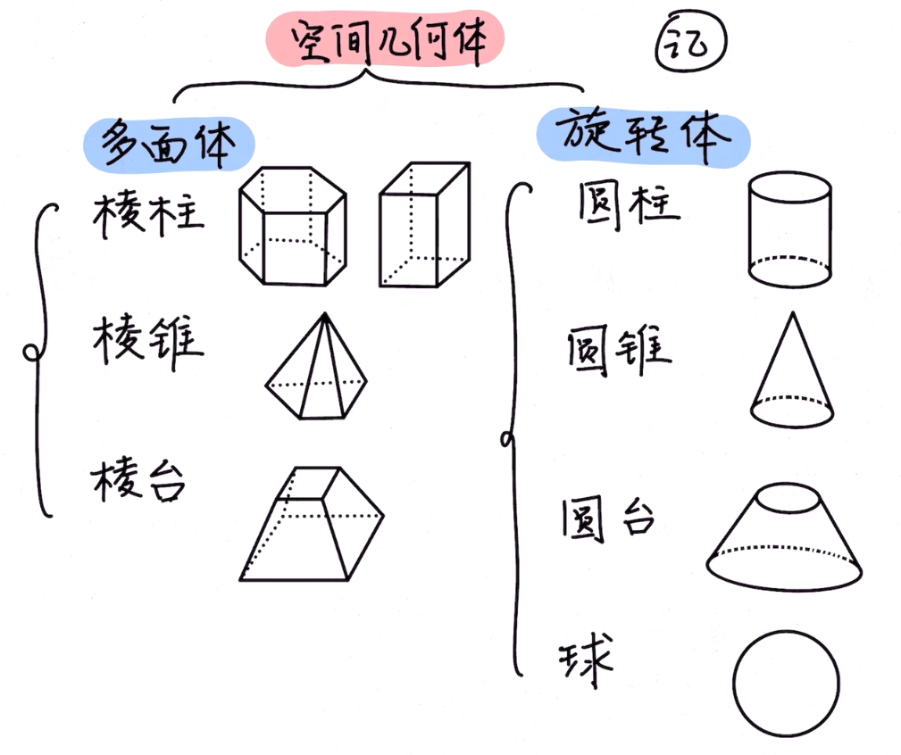

# 空间几何体

## 基础知识

### 分类

/// caption
多面体和旋转体
///

### 斜二测画法

将平面 $x$ 轴不变，$y$ 轴向右倾斜 $45^\circ$ 并长度缩短到原来的 $1/2$。

竖直的 $z$ 轴也不变，称所画出的图形称为直观图。

### 祖暅原理

祖暅（gèng）之《缀术》有云：「缘幂势既同，则积不容异」。

$$
V=\int_{0}^HS(h)\mathrm{d}h
$$

祖暅原理（也称等幂等积定理）指出：所有等高处横截面积相等的两个等高的立体，其体积也必然相等。经典推论是，两个等高的立体，如果其所有等高处横截面积相等，则其体积必然相等。

### 辛普森法则

设拟柱体的高为 $H$，如果用平行于底面的平面去截该图形，所得到的截面面积是与到底面之间距离 $h$ 的不超过 $3$ 次的函数，那么该拟柱体的体积 $V$ 为：

$$
V=\dfrac{h(a+4b+c)}6
$$

其描述的是辛普森积分法（一种数值积分方法）：

$$
\int_{a}^{b}f(x)\mathrm dx\approx {\dfrac {b-a}{6}}\left[f(a)+4f\left({\dfrac {a+b}{2}}\right)+f(b)\right]
$$

## 多面体

多面体是指三维空间中由平面多边形、直边和顶点组成的几何形状。

多面体表面积通用公式就是将每一个平面多边形的面积相加求和。

### 棱柱

#### 棱柱的定义

{ align=right }

棱柱：上下底面平行（且全等），各侧面都是四边形，侧面的公共边互相平行。

棱柱分为直棱柱和**斜棱柱**（右图）。

底面是 $n$ 边形，叫做 $n$ 棱柱。

底面为正 $n$ 边形，叫做正 $n$ 棱柱。

侧棱竖直的 $n$ 棱柱，叫做直 $n$ 棱柱。

底面是平行四边形，叫做平行六面体。

#### 棱柱的体积公式

根据祖暅原理，任何棱柱都可以转化为一个长方体，从而：

$$
V=Sh
$$

### 棱锥

#### 棱锥的定义

侧面都是三角形，有公共顶点。

底面是 $n$ 边形，有 $n$ 个侧面，叫做 $n$ 棱锥。

底面是正 $n$ 边形，且顶点在底面上的投影在底面中心，叫做正 $n$ 棱锥。

有一条侧棱竖直的 $n$ 棱锥，叫做直 $n$ 棱锥。

#### 棱锥的体积公式

根据祖暅原理，任何棱锥都可以转化为一个正棱锥，从而：

$$
V=\dfrac{Sh}3
$$

证明：

$$
V=\int_{0}^HS(h)\mathrm{d}h
$$

其中：

$$
S(h)=S\cdot\dfrac{h^2}{H^2}
$$

注意到：

$$
\dfrac{\mathrm d(Sh^3/3H^2)}{\mathrm dh}=\dfrac{Sh^2}{H^2}
$$

因此：

$$
V=\dfrac{SH^3}{3H^2}=\dfrac{SH}{3}
$$

这个公式对所有椎体成立。

### 棱台

#### 棱台的定义

将棱锥用一个平行于底面的平面截下，下半部分叫做棱台。

#### 棱台的体积公式

根据祖暅原理，任何棱台都可以转化为一个圆台，从而根据：

$$
V=\dfrac{h}{6}[S+S'+4\times\dfrac{1}{4}(S+S'+2\sqrt{SS'})]=\dfrac h3(S+\sqrt{SS'}+S')
$$

棱台的体积公式也可以描述为一种希罗平均数：

$$
H={\dfrac {1}{3}}\left(A+{\sqrt {AB}}+B\right)
$$

用以计算棱台或圆台的体积等于棱台或圆台的高乘以两底面面积的希罗平均数。

希罗平均数也可以看成算术平均数与几何平均数的加权平均数。

$$
H={\dfrac {2}{3}}\cdot {\dfrac {A+B}{2}}+{\dfrac {1}{3}}\cdot {\sqrt {AB}}
$$

## 旋转体

旋转体是指平面曲线以同一平面内的一条直线作为旋转轴进行旋转所形成的立体几何图形。

### 圆柱

#### 圆柱的定义

将一个长方形绕着一条边（轴）旋转得到的立体几何图形。

侧面的每一条平行于轴的线称为母线。

#### 圆柱的体积和表面积

$$
V=Sh=\pi r^2h
$$

$$
S_{表}=2\pi r^2+2\pi rh=2\pi(r+h)
$$

显然。

### 圆锥

#### 圆锥的定义

将一个直角三角形绕着一条直角边（轴）旋转得到的立体几何图形。

直角三角形的每一个斜边对应的线称为母线。

#### 圆锥的体积和表面积

根据祖暅原理：

$$
V=\dfrac13Sh=\dfrac13\pi r^2h
$$

也可以用定积分算。

表面积可以直接拆分为侧面和底面：

$$
S=\pi r^2+\pi rl=\pi r(r+l)
$$

其中 $l$ 表示母线的长度：

$$
l=\sqrt{r^2+h^2}
$$

### 圆台

#### 圆台的定义

将一个直角梯形绕着它的直角边（轴）旋转得到的立体几何图形。

直角梯形的每一个斜边对应的线称为母线。

也可以视为将圆台用一个平行于底面的平面截下，下半部分叫做圆台。

#### 圆台的体积和表面积

根据辛普森法则：

$$
V=\dfrac16h\left[\pi r^2+\pi\left(\dfrac{r+R}{2}\right)^2+\pi R^2\right]=\dfrac{\pi h}3(r^2+rR+R^2)
$$

表面积同样可以拆分：

$$
S=\pi[r^2+(r+R)l+R^2]
$$

其中 $l$ 表示母线的长度：

$$
l=\sqrt{h^2+(R-r)^2}
$$

## 球

### 球的概述

#### 球的定义

一个半圆绕着它的直径（轴）旋转得到的立体几何图形。

球内两个端点在球面上且过球心的线段称为直径。

根据球心 $O$ 称一个球为「球 $O$」。

#### 球的体积和表面积

根据辛普森法则：

$$
V=\dfrac{1}{6}\times2r\times(0+4\pi r^2+0)=\dfrac43\pi r^3
$$

根据球的表面积等于其外接圆柱的侧面面积（详细看 3B1B 的视频）：

$$
S=2\pi r\times2r=4\pi r^2
$$

### 球中的取值问题

#### 球中的定值问题

画一个圆，画出上下两个椭圆表示两个截面，有勾股定理。

#### 球中的最值问题

### 外接球问题

#### 方体的外接球

容易发现，长方体外接球直径就是其对角线的长度，也就是：

$$
R=\dfrac{\sqrt{a^2+b^2+c^2}}{2}
$$

#### 棱锥的外接球

我们尝试求出外接球的半径 $R$ 找到三棱锥的一个底面 $ABC$，容易发现外接球的球心 $O$ 在底面的投影一定是 $ABC$ 的外心（$r=AH=BH=CH$），另外根据 $OD=R$，那么就有：

$$
R^2=OH^2+r^2=R^2
$$

其中 $r$ 为底面外接圆半径，可以通过正弦定理求出。

特殊的，若顶点在底面任意顶点正上方，则外接球球心位与底面外接圆正上方 $h=H/2$ 处。

对于 $n$ 棱锥也类似。

#### 棱柱的外接球

同样是找底面的外接圆圆心，然后向上做高 $h$ 即可。

特殊的，如果是直棱柱，$h=H/2$ 其中 $H$ 是体的高度。

#### 三棱锥内切球

注意到可以将三棱锥分为，等面积法：

$$
V=\dfrac{1}{3}S_1r+\dfrac{1}{3}S_2r+\dfrac{1}{3}S_3r+\dfrac{1}{3}S_4r
$$

即：

$$
r=\dfrac{3V}{S_1+S_2+S_3+S_4}=\dfrac{3V}{S_表}
$$
