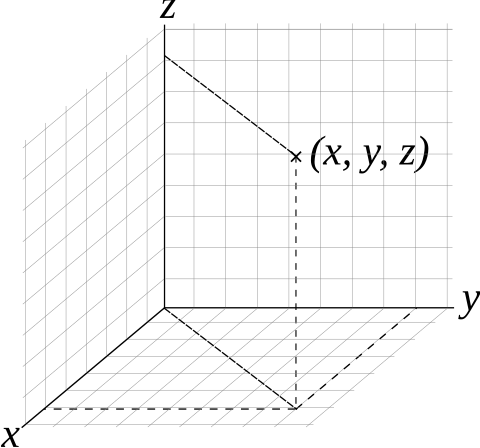

# 空间向量

{ align=right width="40%" }

## 空间向量基本概念

### 空间直角坐标系

直角坐标系也可以推广至三维空间与高维空间。

在原本的二维直角坐标系，再添加一个垂直于 $x$ 轴、$y$ 轴的坐标轴，称为 $z$ 轴。

### 空间向量基本性质

我们推导平面向量的基本性质：

|  | 平面向量 | 空间向量 |
| :-: | :-: | :-: |
| 基底分解 | $\bm a=(x,y)=x\bm e_1+y\bm e_2$ | $\bm a=(x,y,z)=x\bm e_1+y\bm e_2+z\bm e_3$ |
| 线性运算 | $\lambda\bm a=\lambda(x,y)=(\lambda x,\lambda y)$ | $\lambda\bm a=\lambda(x,y,z)=(\lambda x,\lambda y,\lambda z)$ |
| 向量点积 | $(x_1,y_1)\cdot(x_2,y_2)=x_1x_2+y_1y_2$ | $(x_1,y_1,z_1)\cdot(x_2,y_2,z_2)=x_1x_2+y_1y_2+z_1z_2$ |
| 点积意义 | $\bm a_1\cdot\bm a_2=\lvert\bm a_1\rvert\cdot\lvert\bm a_2\rvert\cos\theta$ | $\bm a_1\cdot\bm a_2=\lvert\bm a_1\rvert\cdot\lvert\bm a_2\rvert\cos\theta$ |
| 向量的模 | $\lvert\bm a\rvert=\sqrt{\bm a\cdot\bm a}=\sqrt{x^2+y^2}$ | $\lvert\bm a\rvert=\sqrt{\bm a\cdot\bm a}=\sqrt{x^2+y^2+z^2}$ |

### 空间向量基本定理

类似平面向量基本定理的，有：若基底 $\bm e_1,\bm e_2,\bm e_3$ 不共面，则对于空间内任一向量 $\bm a$，存在唯一实数 $x,y,z$ 使得 $\bm a=x\bm e_1+y\bm e_2+z\bm e_3$。

我们类似平面向量共线的定义，若 $\bm e_3$ 可以表示为 $\lambda\bm e_1+\mu\bm e_2$，则称 $\bm e_3$ 与 $\bm e_1,\bm e_2$ 共面。

本质还是张成空间。

### 法向量的叉乘速求

对于 $ABC$ 决定的面，我们随便取其组成两个不同的向量。

例如 $\overrightarrow{AB}=(x_1,y_1,z_1),\overrightarrow{AC}=(x_2,y_2,z_2)$。

我们将其坐标表示横着写两遍，取中间四个数，交叉相乘再相减。

$$
x_1\quad\boxed{y_1\quad z_1\quad x_1\quad y_1}\quad z_1
$$

$$
x_2\quad\boxed{y_2\quad z_2\quad x_2\quad y_2}\quad z_2
$$

法向量即为：

$$
\vec n=(y_1z_2-z_1y_2,z_1x_2-x_1z_2,x_1y_2-y_1x_2)
$$

或者可以直接叉乘（线性代数）：

空间中任意两个向量 $\bm A,\bm B$，规定其夹角为 $\alpha$，则其叉乘为一个向量，他的大小为 $|\bm A|\cdot|\bm b|\sin\alpha$，方向又右手定则决定：

{ width="70%" }

三维空间中两个向量：

\[
\vec{a} = \begin{pmatrix}x_1 \\ y_1 \\ z_1\end{pmatrix}, \quad \vec{b} = \begin{pmatrix}x_2 \\ y_2 \\ z_2\end{pmatrix}
\]

的叉积定义为：

\[
\vec{a} \times \vec{b} = \begin{pmatrix}
y_1z_2 - z_1y_2 \\
z_1x_2 - x_1z_2 \\
x_1y_2 - y_1x_2
\end{pmatrix}
\]

使用行列式：

\[
\begin{vmatrix}
i & j & k \\
x_1 & y_1 & z_1 \\
x_2 & y_2 & z_2
\end{vmatrix}
\]

具体展开为：

\[
\vec{n} = +\begin{vmatrix}y_1 & z_1 \\ y_2 & z_2\end{vmatrix} \cdot \mathbf{i} \quad -\begin{vmatrix}x_1 & z_1 \\ x_2 & z_2\end{vmatrix} \cdot \mathbf{j} \quad +\begin{vmatrix}x_1 & y_1 \\ x_2 & y_2\end{vmatrix} \cdot \mathbf{k}
\]

## 空间中的距离

本质是通过向量在某个方向上的投影来解题。

### 点与点的距离

根据毕达哥拉斯定理：

$$
|P_1P_2|=|\overrightarrow{P_1P_2}|=\sqrt{(x_1-x_2)^2+(y_1-y_2)^2+(z_1-z_2)^2}
$$

### 点与面的距离

如何确定一个平面？

- 三个点确定一个平面。
- 一个点和两个向量确定一个平面。
- 一个点和一个法向量确定一个平面。

其中，使用法向量最好用，因为只需要两个变量、五个参数即可确定一个平面。

!!! note "什么是法向量"
    三维平面的法线，或称**法向量**是垂直于该平面的三维向量。曲面在某点 P 处的法线为垂直于该点切平面的向量，一个平面存在无限个法向量。

    因为法向量是垂直于平面内每一条直线的，因此法向量与平面内直线的点积为零。

因此，我们问题是，给点一个点 $A$ 和一个法向量 $\bm n$，求出确定的平面 $\alpha$ 外一点 $P$ 到这个平面的距离。

???+ note "一个朴素方法"
    是不推荐使用的，但是很 trivial 的。

    我们对于点 $P$，做其到平面 $\alpha$ 的垂线，设垂足为 $P'$ 点。

    我们知道此时 $PP'\bot\alpha$，也就是说 $PP'$ 与 $\bm n$ 共线，其中 $\bm n$ 表示一个法向量。

    同时我们还知道平面上的点满足 $AP'\bot\bm n$，由此可以列出若干个关系式，解之即可。

我们直接连接点 $P$ 和点 $A$，则 $\overrightarrow{AP}$ 在 $\bm n$ 上的投影即为点到平面的距离：

$$
\begin{aligned}
|AP'|&=|\overrightarrow{AP}|\cos\theta\\
&=|\overrightarrow{AP}|\times\dfrac{|\overrightarrow{AP}\cdot\bm n|}{|\overrightarrow{AP}|\cdot|\bm n|}\\
&=\dfrac{|\overrightarrow{AP}\cdot\bm n|}{|\bm n|}
\end{aligned}
$$

即点到直线的距离为 $\dfrac{|\overrightarrow{AP}\cdot\bm n|}{|\bm n|}$。

### 点与直线的距离

给定直线 $AB$ 外一点 $C$，做 $C$ 到 $AB$ 的垂线，垂足为 $D$，求 $|CD|$。

???+ note "一个朴素方法"
    我们知道此时，$AB\bot CD$，即 $\overrightarrow{AB}\cdot\overrightarrow{CD}=0$。

    同时，$D$ 在直线 $AB$ 上，即 $\overrightarrow{AD}=\lambda\cdot\overrightarrow{AB}$。

    解之即可。

利用向量的知识，我们知道：

$$
|CD|=|AC|\cdot\sin\theta
$$

另外，

$$
\cos\theta=\dfrac{\overrightarrow{AC}\cdot\overrightarrow{AB}}{|AC|\cdot|AB|}
$$

解之即可。

### 线与线的距离

给定 $AB$ 和 $CD$ 为两条没有交点的直线，求其距离。

???+ note "一个朴素方法"
    我们知道其距离可以表示为：

    - $AB$ 上一点 $M$ 和 $CD$ 上一点 $N$ 的 $|MN|$。
    - 且 $MN\bot AB,MN\bot CD$。
    
    设 $\overrightarrow{AM}=\lambda\cdot\overrightarrow{AB},\overrightarrow{CN}=\mu\cdot\overrightarrow{CD}$。
    
    那么我们就可以用两个未知数表示出 $M,N$ 的坐标，那么就可以列出：
    
    $$
    \begin{aligned}
    \overrightarrow{MN}\cdot\overrightarrow{AB}&=0\\
    \overrightarrow{MN}\cdot\overrightarrow{CD}&=0
    \end{aligned}
    $$
    
    解之即可。

我们发现这个距离其实就是两个直线任意两个点连线在公共法向量上的投影。

我们列出公共法向量 $\bm n$ 的表达式：

$$
\begin{aligned}
\bm n\cdot\overrightarrow{AB}&=0\\
\bm n\cdot\overrightarrow{CD}&=0
\end{aligned}
$$

令 $\bm n$ 的某一维为 $1$ 即可解出 $\bm n$ 的表示。

然后根据投影长度：

$$
d=\dfrac{|\overrightarrow{AC}\cdot\bm n|}{|\bm n|}
$$

其中 $AC$ 可以替换为 $AD,BC,BD$ 等。

### 面与面的距离

给定 $A\in\alpha,B\in\beta$ 两点和公共法向量 $\bm n$，求确定的平面间的距离。

???+ note "一个朴素方法"
    我们做出 $\beta$ 内一点 $C$，满足 $BC\bot\bm n$，列出方程：

    $$
    BC\bot\bm n,AC\parallel\bm n
    $$

    即：

    $$
    \overrightarrow{BC}\cdot\bm n=0,\overrightarrow{AC}=\lambda\cdot\bm n
    $$
    
    解之即可。

我们直接找 $A$ 点到平面 $\beta$ 的距离：

$$
d=\dfrac{|\overrightarrow{AB}\cdot\bm n|}{|\bm n|}
$$

### 线与面的距离

同理，直接令线上一点即可：

$$
d=\dfrac{|\overrightarrow{AB}\cdot\bm n|}{|\bm n|}
$$

补充：上面的竖线表示绝对值，下面的竖线表示向量的模。

## 空间中的角度

### 线与线的夹角

我们将一条线平移到另一条线的平面内，容易知道夹角即为：

$$
\cos\theta=\dfrac{|\overrightarrow{AB}\cdot\overrightarrow{CD}|}{|AB|\cdot|CD|}
$$

根据 $\cos$ 的性质，注意要加绝对值。

### 线与面的夹角

注意到线与平面法向量夹角的余弦容易求得：

$$
\sin\theta=\cos\left(\dfrac\pi2-\theta\right)=\dfrac{|\overrightarrow{AB}\cdot\bm n|}{|\overrightarrow{AB}|\cdot|\bm n|}
$$

根据诱导公式可得。

### 面与面的夹角

即半平面的夹角，注意到这个一定是与两法向量夹角互补的：

$$
\theta=\dfrac{|\bm n_1\cdot\bm n_2|}{|\bm n_1|\cdot|\bm n_2|}
$$

注意绝对值。

