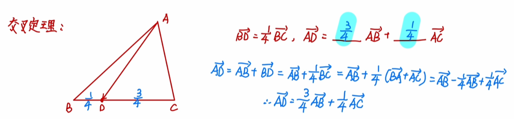

# 解三角形

## 三角形的心

### 心的概况

| 编号 | 心的名称| 定义 |
| :-: | :-: | :-: |
| $X_1$ | 内心 | 三条**角平分线**的交点 |
| $X_2$ | 重心 | 三条**中线**的交点 |
| $X_3$ | 外心 | 三条**中垂线**的交点 |
| $X_4$ | 垂心 | 三条**高线**的交点  |

### 三角形重心

存在有塞瓦定理、塞瓦定理逆定理。

0. 三角形重心到其各个顶点向量之和为零。

1. 一个三角形的重心同时也是其中点三角形的重心。

2. 重心到顶点的距离与重心到对边中点的距离之比为 $2:1$。

3. 在平面直角坐标系中，重心的坐标是顶点坐标的算术平均。

4. 重心和三角形任意两个顶点组成的三个三角形面积相等。

5. 重心到三条边的距离与三条边的长成反比。（上一条的推论）

6. 重心到三边距离之积最大、到三角形三个顶点距离的平方和最小。

## 基本定理

### 正弦定理

回顾初中几何，三角形面积，

$$
S={1\over2}ab\sin C={1\over2}bc\sin A={1\over2}ac\sin B
$$

下面的证明过程只考虑锐角三角形，对于钝角三角形，结论不变。

做过 $\angle A$ 的垂线，则该垂线长度 $h$：

$$
h=b\sin C=c\sin B
$$

对每个角应用，最后可得，

$$
{a\over\sin A}={b\over\sin B}={c\over\sin C}=k
$$

做出该三角形的外接圆，过圆心做 $BC$ 的高，则，

$$
a=2R\sin A,\,{a\over\sin A}=2R
$$

即值 $k$ 为三角形外接圆直径 $2R$。

常常这么写：

$$
a=2R\sin A,\,b=2R\sin B,\,c=2R\sin C\\
\sin A={a\over2R},\,\sin B={b\over2R},\,\sin C={c\over2R}
$$

正弦定理推论：大边对大角，小边对小角。

三角形外接圆半径：

$$
R={abc\over4S}
$$

### 余弦定理

在 $\triangle ABC$ 中，

$$
\begin{array}{c}
\overrightarrow{AB}=\overrightarrow{CB}-\overrightarrow{CA}\\[0.5em]
|\overrightarrow{AB}|^2=|\overrightarrow{CB}|^2+|\overrightarrow{CA}|^2-2|\overrightarrow{CB}|\cdot|\overrightarrow{CA}|\cdot\cos\theta\\[0.5em]
c^2=a^2+b^2-2ab\cos\theta
\end{array}
$$

其中 $\theta$ 为 $c$ 的对角，即 $\angle C$；第二步就是两边平方。

常写作：

$$
\cos A={b^2+c^2-a^2\over2bc},\,\cos B={a^2+c^2-b^2\over2ac},\,\cos C={a^2+b^2-c^2\over2ab}
$$

推论：

$$
\begin{aligned}
a^2+b^2-c^2>0 &\Longrightarrow \cos C>0 \Longrightarrow C\in(0,\pi/2)\\
a^2+b^2-c^2=0 &\Longrightarrow \cos C=0 \Longrightarrow C=\pi/2\\
a^2+b^2-c^2<0 &\Longrightarrow \cos C<0 \Longrightarrow C\in(\pi/2,\pi)
\end{aligned}
$$

## 解三角形概述

回忆初中平几，根据全等三角形的判断：

如果知道 ASA、AAS、SAS、SSS、HL 就可以唯一的确定一个三角形。

总结一下就是两个角全都可以，三个边可以，一个角两个边就需要是夹角。

即知道 $aCb$、$cBa$、$bAc$，才可以唯一确定一个两边一角的三角形。

至于 SSA，只有一个角是直角才可以唯一确定，不过这个就是 HL 了。

三角形确定，意味着我们可以求出所有边的长度以及所有角度的大小。

正弦定理、余弦定理就为我们提供了方法：可以利用角度和边长互相表示。

像这样，确定三角形边、角的过程，就是解三角形。

如何选择正弦定理、余弦定理？

遇到正弦选正弦定理，遇到齐次式考虑正弦定理。

遇到余弦选余弦定理，遇到边的二次齐次式考虑余弦定理。

原则：边角统一。

### 中线长定理

在 $\triangle ABC$ 中，$BC$ 的中点为 $M$，对于中线 $AM$，有：

$$
AM^2={1\over2}b^2+{1\over2}c^2-{1\over4}a^2
$$

或，

$$
AM^2+BM^2={1\over2}(AC^2+AB^2)
$$

或，

$$
AM={1\over2}\sqrt{2b^2+2c^2-a^2}
$$

证明，基底分解：

$$
\overrightarrow{AM}={1\over2}\overrightarrow{AB}+{1\over2}\overrightarrow{AC}\\[0.5em]
\overrightarrow{BM}={1\over2}\overrightarrow{AC}-{1\over2}\overrightarrow{AB}
$$

则，

$$
|\overrightarrow{AM}|^2+|\overrightarrow{BM}|^2={1\over2}|\overrightarrow{AB}|^2+{1\over2}|\overrightarrow{AC}|^2
$$

或者中点两个底角分别列余弦定理，相加化简。

### 角平分线定理

在 $\triangle ABC$ 中，$\angle A$ 的平分线 $AM$，有：

$$
{BM\over CM}={AB\over AC}
$$

是分角定理的直接推论，证明见下。

### 分角定理

在 $\triangle ABC$ 中，$BC$ 上有一点 $M$，则：

$$
{BM\over CM}={AB\sin\angle BAM\over AC\sin\angle CAM}
$$

证明，左右两边等面积法：

$$
{BM\over CM}={S_{\triangle ABM}\over S_{\triangle ACM}}={AB\cdot AM\sin\angle BAM\over AC\cdot AM\sin\angle CAM}={AB\sin\angle BAM\over AC\sin\angle CAM}
$$

或正弦定理：

$$
{BM\over\sin\angle BAM}={AB\over\sin\angle AMB}\\[0.5em]
{CM\over\sin\angle CAM}={AC\over\sin\angle AMC}
$$

上下做比。Q.E.D.

### 交叉定理

常用于基底分解。

### 海伦公式

任意三角形面积可以表示为：

$$
\begin{aligned}
S&=\sqrt{p(p-a)(p-b)(p-c)}\\
p&={a+b+c\over2}
\end{aligned}
$$

其中 $p$ 为三角形的半周长。

### 奔驰定理

在锐角 $\triangle ABC$ 中，

$$
S_{\triangle BOC}\cdot\overrightarrow{OA}+S_{\triangle AOC}\cdot\overrightarrow{OB}+S_{\triangle AOB}\cdot\overrightarrow{OC}=\vec0
$$

推论：

+ 设 $I$ 为内心，则 $a\cdot\overrightarrow{IA}+b\cdot\overrightarrow{IB}+c\cdot\overrightarrow{IC}=\vec0$.

+ 设 $H$ 为垂心，则 $\tan A\cdot\overrightarrow{HA}+\tan B\cdot\overrightarrow{HB}+\tan C\cdot\overrightarrow{HC}=\vec0$.

+ 设 $O$ 为外心，则 $\sin2A\cdot\overrightarrow{OA}+\sin2B\cdot\overrightarrow{OB}+\sin2C\cdot\overrightarrow{OC}=\vec0$.

### 布雷特施奈德公式

任意四边形面积可以表示为：

$$
\begin{aligned}
S&=\sqrt{(p-a)(p-b)(p-c)(p-d)-abcd\cos^2{\alpha+\beta\over2}}\\
p&={a+b+c+d\over2}
\end{aligned}
$$

其中 $p$ 为四边形的半周长，$\alpha,\beta$ 为其中二个对角。

布雷特施奈德公式可视为婆罗摩笈多公式之推广。

### 婆罗摩笈多公式

注意到圆内接四边形对角互补，其半角余弦值为零，$\cos90^\circ=0$ 则圆内接四边形面积可以简化为：

$$
\begin{aligned}
S&=\sqrt{(p-a)(p-b)(p-c)(p-d)}\\
p&={a+b+c+d\over2}
\end{aligned}
$$

其中 $p$ 为四边形的半周长。

### 一些结论

在三角形中，$a=b\cos C+c\cos B$。

若 $\sin^2A+\sin^2B=\sin^2C$，则该三角形是以 $\angle C$ 为直角的 $\mathrm{Rt\triangle}$。

解三角形里面常用的奇怪三角函数：

$$
\sin15^\circ=\cos75^\circ={\sqrt6-\sqrt2\over4}\\[0.5em]
\sin75^\circ=\cos15^\circ={\sqrt6+\sqrt2\over4}
$$

## 三角形中的三角函数

条件，在三角形中，有 $x+y+z=\pi$（三角形内角和），那么：

### 正切恒等式

#### 形式一

$$
\tan x+\tan y+\tan z=\tan x\tan y\tan z
$$

证明：

$$
\begin{aligned}
\tan z&=\tan(\pi-x-y)=-\tan(x+y)\\
\tan z&=-{\tan x+\tan y\over1-\tan x\tan y}
\end{aligned}
$$

下面的式子整理即可。

#### 形式二

$$
\tan{x\over2}\tan{y\over2}+\tan{y\over2}\tan{z\over2}+\tan{z\over2}\tan{x\over2}=1
$$

证明：

$$
\begin{aligned}
\tan{z\over2}&=\tan\left({\pi\over2}-{x\over2}-{y\over2}\right)={1\over\tan({x\over2}+{y\over2})}\\
\tan{z\over2}&={1-\tan{x\over2}\tan{y\over2}\over\tan{x\over2}+\tan{y\over2}}
\end{aligned}
$$

下面的式子整理即可。

### 余切恒等式

#### 形式一

$$
\cot x\cot y+\cot y\cot z+\cot z\cot x=1
$$

证明：

根据 $\displaystyle\tan\alpha={1\over\cot\alpha}$ 展开正切的形式一即可。

#### 形式二

$$
\cot{x\over2}+\cot{y\over2}+\cot{y\over2}=\cot{x\over2}\cot{y\over2}\cot{y\over2}
$$

证明：

根据 $\displaystyle\tan\alpha={1\over\cot\alpha}$ 展开正切的形式二即可。

### 一倍角弦

#### 形式一

$$
\sin x+\sin y+\sin z=4\cos{x\over2}\cos{y\over2}\cos{z\over2}
$$

证明：

$$
\begin{aligned}
\sin x+\sin y&=2\sin{x+y\over2}\cos{x-y\over2}\\
&=2\cos{z\over2}\cos{x-y\over2}\\
\sin z&=2\sin{z\over2}\cos{z\over2}\\
&=2\cos{z\over2}\cos{x+y\over2}
\end{aligned}
$$

然后加起来用和差化积公式即可。

#### 形式二

$$
\cos x+\cos y+\cos z=1+4\sin{x\over2}\sin{y\over2}\sin{z\over2}
$$

证明：

$$
\begin{aligned}
\cos z&=1-\sin^2{z\over2}\\
&=1-\sin{z\over2}\cos{x+y\over2}\\
\cos x+\cos y&=2\cos{x+y\over2}\cos{x-y\over2}\\
&=2\sin{z\over2}\cos{x-y\over2}
\end{aligned}
$$

然后加起来用和差化积公式即可。

### 二倍角弦

#### 形式一

$$
\sin2x+\sin2y+\sin2z=4\sin x\sin y\sin z
$$

证明：

$$
\begin{aligned}
\sin2z&=2\sin z\cos z\\
&=-2\sin z\cos(x+y)\\
\sin2x+\sin2y&=2\sin(x+y)\cos(x-y)\\
&=2\sin z\cos(x-y)
\end{aligned}
$$

然后加起来用和差化积公式即可。

#### 形式二

$$
\cos2x+\cos2y+\cos2z=-1-\cos x\cos y\cos z
$$

证明：

$$
\begin{aligned}
\cos2z&=2\cos^2z-1\\
&=-2\cos z\cos(x+y)-1\\
\cos2x+\cos2y&=2\cos(x+y)\cos(x-y)\\
&=-2\cos z\cos(x-y)
\end{aligned}
$$

然后加起来用和差化积公式即可。
