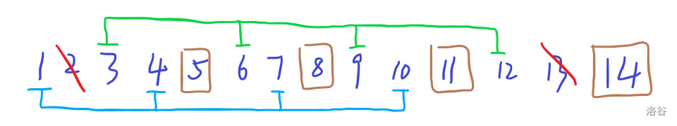

# 2024 新高考一卷

## 第 19 题

### 题目描述

设 $m$ 为正整数，数列 $a_1,a_2,\dots,a_{4m+2}$ 是公差不为 $0$ 的等差数列，若从中删去两项 $a_i$ 和 $a_j\;(i<j)$ 后剩余的 $4m$ 项可以被平均分为 $m$ 组，且每组的 $4$ 个数都能构成等差数列，则称数列 $a_1,a_1\dots,a_{4m+2}$ 是 $(i,j)$—可分数列。

（1）写出所有的 $(i,j)$，$1\le i<j\le 6$，使得数列 $a_1,a_2\dots,a_6$ 是 $(i,j)$—可分数列；

（2）当 $m\ge3$ 时，证明：数列 $a_1,a_2,\dots,a_{4m+2}$ 是 $(2,13)$—可分数列；

（3）从 $1,2,\dots,4m+2$ 中一次任取两个数 $i$ 和 $j\;(i<j)$，记数列 $a_1,a_2,\dots,a_{4m+2}$ 是 $(i,j)$—可分数列的概率为 $P_m$，证明：$P_m>\dfrac18$.

### 思想

这个部分其实数感好（~~哪怕有一点~~）就能直接用。

我们知道等差数列 $a_n=a_{n-1}+d,a_n=a_1+(n-1)d$ 是最基础的公式。

首先考虑，如果一个长度为 $4$ 的子序列构成等差数列，这个数列有何性质。

容易发现，原数列，

$$
\{a_1,a_1+d,a_1+2d,\dots,a_1+(n-1)d\},n=4m+2
$$

假设选出来的四个数，

$$
\{a_{k_1},a_{k_2},a_{k_3},a_{k_4}\},k_1<k_2<k_3<k_4
$$

构成等差数列，那么根据递归式，

$$
a_{k_t}=a_{k_{t'}}+d'\\
a_1+(k_t-1)d=a_1+(k_{t'}-1)d+d'\\
(k_t-k_{t'})d=d'\\
k_t-k_{t'}={d'\over d}
$$

其中 $t'$ 表示 $t$ 的后继，即 $x'=x$（但是 $d'$ 真的只是一撇）。

我们发现到，下标也是一组等差数列，即隔着相同的位（称为步长）选择。

### 铺垫

其实就是第一第二问。

第一问，注意到四个数只能连起来选，

因为如果不连起来，就至少需要 $7$ 位，而只有 $6$ 个数。

因此，答案为，$(1,2),(5,6),(1,6)$。

第二问，注意到如果 $m=3$ 我们可以这么选择，

而，若 $m>3$ 则直接在这个基础上，后面加入若干组连续编组的四个即可。

注意到我们这种构造只是一组可行性构造，因为我们没有用到前 $14$ 个与后面的匹配。

### 发现

考虑第二问的思想，我们在原数组后面加上四位，来拓展。

那我们容易想到，也可以在原数组前面加上四位，来拓展。

注意到这两种其实是有重复的，重复在于两者交错的位置，会重复计算。

而考虑第一问，我们知道，任何一个数列，选择前两个，后两个，首位，都是可以的。

而这里面又有重复了，注意到选择前两个、后两个是包含在后、前拓展里面的。

因此，我们得到了一个构造下界的方法，

设 $\mathit{ans}_m$ 表示从 $1\sim4m+2$ 中选择，得到的确切可行数，

那么我们设 $b_n$ 表示这么选择可以得到的这个下界，那么显然，

$$
b_0=1,b_1=3\\
b_n=2b_{n-1}-b_{n-2}+1
$$

我们先不算出来具体的结果，大体估计一下，

$$
b_2=6,b_3=10,b_4=15
$$

我们取第四项，一共有，

$$
{4m+2\choose2}=(2m+1)(4m+1)=9\times17=153
$$

种情况，概率，

$$
P_m={15\over153}<{1\over8}
$$

显然是不可行的。

### 继续

我们发现，我们这种构造甚至没有包含第二问中要求证明的东西，考虑加强。

注意到我们在第二问中，选择了步长为 $3$ 的，去覆盖除了 $2$ 以外的方格，

最终我们在 $13$ 的位置空出来了，我们考虑类似的处理，使用其他步长来填充，

步长为 $2$，

$$
1\ 2\ 3\ 4\ 5\ 6\ 7\ 8\ 9\ 10\ 11\ 12\ 13\ 14\ 15\ 16\ 17\ 18\ 19\ 20\\
{\color{red}\boxed1}\ 2\ {\color{red}\boxed3}\ 4\ {\color{red}\boxed5}\ 6\ {\color{red}\boxed7}\ 8\ 9\ 10\ 11\ 12\ 13\ 14\ 15\ 16\ 17\ 18\ 19\ 20\\
\boxed1\ 2\ \boxed3\ {\color{red}\boxed4}\ \boxed5\ {\color{red}\boxed6}\ \boxed7\ {\color{red}\boxed8}\ 9\ {\color{red}\boxed{10}}\ 11\ 12\ 13\ 14\ 15\ 16\ 17\ 18\ 19\ 20
$$

我们空出来了 $\boxed{9}$。

步长为 $3$，空出来了 $\boxed{13}$。

步长为 $4$，

$$
\def\crb#1{{\color{red}\boxed{#1}}}
\def\rb#1{\boxed{#1}}
\begin{array}{c}
1\ 2\ 3\ 4\ 5\ 6\ 7\ 8\ 9\ 10\ 11\ 12\ 13\ 14\ 15\ 16\ 17\ 18\ 19\ 20\\
\crb1\ 2\ 3\ 4\ \crb5\ 6\ 7\ 8\ \crb9\ 10\ 11\ 12\ \crb{13}\ 14\ 15\ 16\ 17\ 18\ 19\ 20\\
\rb1\ 2\ \crb3\ 4\ \rb5\ 6\ \crb7\ 8\ \rb9\ 10\ \crb{11}\ 12\ \rb{13}\ 14\ \crb{15}\ 16\ 17\ 18\ 19\ 20\\
\rb1\ 2\ \rb3\ \crb4\ \rb5\ 6\ \rb7\ \crb8\ \rb9\ 10\ \rb{11}\ \crb{12}\ \rb{13}\ 14\ \rb{15}\ \crb{16}\ 17\ 18\ 19\ 20\\
\rb1\ 2\ \rb3\ \rb4\ \rb5\ \crb6\ \rb7\ \rb8\ \rb9\ \crb{10}\ \rb{11}\ \rb{12}\ \rb{13}\ \crb{14}\ \rb{15}\ \rb{16}\ 17\ \crb{18}\ 19\ 20\\
\end{array}
$$

我们空出来了 $\boxed{17}$。

此时，我们已经可以猜结论了，选步长为 $k$，空出来 $4k+1$。

而至于比较严谨的证明，发现我们空出来的 $2$，

造成了本应在 $2$ 处的四个格子，向后移动了 $k$ 位，那么多余所对的，自然就是 $4k+1$。

由此，我们通过不断增加 $k$，使得对于 $m\ge2$ 时，均可以增加一个这个贡献。

于是，原递归式进阶，

$$
b_0=1,b_1=3\\
b_n=2b_{n-1}-b_{n-2}+2
$$

算几项，发现都符合要求，我们考虑严谨证明。

### 结束

我们有，

$$
b_0=1,b_1=3\\
b_n=2b_{n-1}-b_{n-2}+2
$$

我们知道，

$$
\mathit{ans}_n\ge b_n
$$

试证明，

$$
\mathit{ans}_n\Big/{4m+2\choose 2}>{1\over8}
$$

只需证，

$$
b_n\Big/{4m+2\choose 2}>{1\over8}
$$

考虑直接求出 $b_n$ 通项。

我们直接照猫画虎，用特征根法求解，

$$
b_n=2b_{n-1}-b_{n-2}+2\\
b_{n+1}=2b_n-b_{n-1}+2
$$

相减，

$$
b_{n+1}-b_n=2b_n-2b_{n-1}-b_{n-1}+b_{n-2}\\
b_{n+1}=3b_n-3b_{n-1}+b_{n-2}
$$

特征方程，

$$
q^3=3q^2-3q+1\\
q^3-3q^2+3q-1=0
$$

注意到由二项式定理，这个其实就是，

$$
(q-1)^3=0
$$

于是，特征根，

$$
q=1
$$

注意到只有一个解，因此答案形如，

$$
b_n=\lambda n^2+\mu n+\gamma
$$

我们带入几个值，首先，

$$
b_2=2b_1-b_0+2=7
$$

于是，

$$
\begin{cases}
b_0&=\gamma&=1\\
b_1&=\lambda+\mu+\gamma&=3\\
b_2&=4\lambda+2\mu+\gamma&=7
\end{cases}
$$

解得，

$$
\begin{cases}
\lambda&=1\\
\mu&=1\\
\gamma&=1
\end{cases}
$$

即，

$$
b_n=n^2+n+1
$$

于是，所证，

$$
b_n\Big/{4m+2\choose 2}>{1\over8}\\
{n^2+n+1\over(2n+1)(4n+1)}>{1\over8}\\
8n^2+8n+8>8n^2+6n+1
$$

显然成立。Q.E.D.
