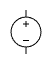
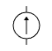
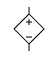
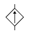
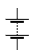
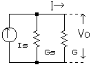
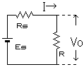

# 电路元件

## 电源

### 电池概述

| 美国型号 | 中国大陆型号 | 尺寸（$\pu{mm}$） |
|----------|---------------|---------------------|
| D        | 1 号电池       | 59.0*32.3           |
| C        | 2 号电池       | 49.5*25.3           |
| AA       | 5 号电池       | 49.0*14.0           |
| AAA      | 7 号电池       | 44.0*10.0           |
| AAAA     | 9 号电池       | 41.5*8.1            |
| A        | 4 号电池       | 49.0*16.8           |
| SC       | 3 号电池       | 42.0*22.1           |
| N        | 8 号电池       | 28.5*11.7           |
| F        |               | 89.0*32.3           |

| 符号 | 符号 |
| :-: | :-: |
| 理想电压源  | 理想电流源  |
| 受控电压源  | 受控电流源  |
| 单电池  | 电池组  |

### 电动势

电动势表征一些电路元件供应电能的特性（非静电力做功的本质），这些电路元件称为电动势源，而电动势源所供应的能量每单位电荷是其电动势，有公式表达：

$$
\mathcal{E}=\dfrac{W}{Q}
$$

即把 $\pu{1C}$ 正电荷从负极运回正极所做的功。通常，这能量是分离正负电荷所做的功，由于这正负电荷被分离至元件的两端，会出现对应电场与电势差。

电池内阻相当于一个电池串联一个电阻，如果没有特殊说明，**电池的内阻不可忽略**。

### 拓展：电流源

电流源（理想电流源）具有两个基本的性质：

1. 它提供的电流是定值 $I$，或是一定的时间函数 $I(t)$ 与两端的电压无关。

2. 电流源自身电流是确定的，而它两端的电压是任意的。

电流源具有很大的内阻（理想状态是内阻无限大）并且作为恒流电路工作。由于负载波动，电压波动较大。实际上，如果一个电流源在电压变化时，电流的波动不明显，我们通常就假定它是一个理想电流源。

像光电池一类的器件，工作时的特性比较接近电流源。

电流源的工作原理如图：

设 $I_S$ 为电源电流，$G_S$ 为内部电导，$G$ 为负载电导，$V_0$ 为施加电压，$I$ 为电流：

$$
I_S=V_0(G_S+G)=V_0G_S+I
$$

因此：

$$
V_0=\dfrac{I_S}{G_S+G}
$$

如果 $G\ll G_S$，则 $I_S\doteq I$。因此，输出电压会因负载波动而发生较大变化。

### 拓展：电压源

电压源（理想电压源）具有两个基本的性质：

1. 它的端电压为定值 $U$，或为一时间函数 $U(t)$，与流过的电流无关。

2. 电压源自身电压是确定的，而流过它的电流是任意的。

常见实际电源的工作机理比较接近电压源，例如发电机以及蓄电池。电压源具有低内阻并且作为恒压电路工作。由于短路时会流过大电流，因此需要安全装置。

实际上，如果一个电压源在电流变化时，电压的波动不明显，我们通常就假定它是一个理想电压源。

电压源的工作原理如图：

设 $E_S$ 为电源电动势，$R_S$ 为内阻，$R$ 为负载，$V_0$ 为施加电压，$I$ 为电流：

$$
I=\dfrac{E_S}{R_S+R}
$$

因此：

$$
V_0=IR=\dfrac{R}{R_S+R}E_S
$$

如果 $R\ll R_S$，则 $V_0\doteq E_S$。因此，输出电压的波动不明显。

## 电路元件总结

符号表示参考 [[IEEE/ANSI 315-1975 IEEE] Standard for Graphic Symbols for Electrical and Electronics Diagrams (Including Reference Designation Letters)](https://www.ee.iitb.ac.in/~spilab/Tips/ansii_graphic_symbols_for_electrical_and_electronics_daigrams_1993.pdf)。

## 复杂电路分析

### 电流走向法

也是初中最常用的方法之一。

### 变形法

具体而言，将电路翻转、伸缩、变形，到达容易分辨的效果。

### 等电势法

原理：

1. 一根导线上，电势处处相等（等势体）。

2. 经过用电器后，电势降低，数值上等于用电器两端电压。

将不同电势分别描出来，确定用电器两端电势。

### 设物理量

设出每一条导线上的电流和每一个用电器两端的电压。

然后根据基尔霍夫电路定律，解出来，符号表示与假设方向相反。
