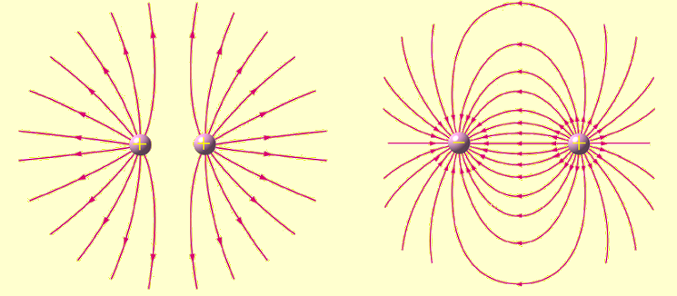

# 静电学

## 电荷

### 导体和绝缘体

**电导体**为能够让电流通过的材料，依其导电性（导电能力），能够细分为超导体、**导体**、半导体及**绝缘体**。

本质：内部自由移动的电荷（只考虑负电荷，即电子）。

### 电荷和电荷量

电荷是构成物质的基本粒子的一种物理性质，原子中的质子和电子分别带有正电荷和负电荷，而中子不带电荷。

- 丝绸摩擦的玻璃棒带正电荷，毛皮摩擦的橡胶棒带负电荷。

- 带有电荷的物质称为**带电物质**，带有电荷的粒子称为**带电粒子**。

电荷量的国际单位是库仑（$\text C$），通常用符号 $Q$ 表示。

元电荷（也成基本电荷）：基本电荷 $e$ 是一个质子所带的**电荷量**，或一个电子所带的负**电荷量**。

其中 $e\approx 1.602\times 10^{-19}\text C$，一个电子携带的电荷量为 $-e$。

???+ note "为什么是小数？"
    历史上，安培（电流强度）是先于库仑定义的，最初的库伦定义就是**安培秒**，即 $1$ 库仑是 $1$ 安培电流在 $1$ 秒钟内传递的电荷，表示为 $1\text C=1\mathrm{A\cdot s}$ 或 $1\text C=1\text{A}\times1\text{s}$，而旧的安培定义为「在相距 $1$ 米的两条平行导线间，产生每米 $0.2$ 微牛顿的磁力所需的电流」。

比荷、比电荷（又称荷质比）：即带电物体所带电荷比上其质量，电子比荷约为 $1.758820024(11)\times 10^{11}\mathrm{C/kg}$，质子的比荷约为 $9.578309\times 10^7\mathrm{C/kg}$。

### 电荷守恒定律

电荷守恒定律是一种关于电荷的**守恒定律**。

电荷守恒定律有两种版本，**弱版电荷守恒定律**（又称为**全域电荷守恒定律**）与**强版电荷守恒定律**（又称为**局域电荷守恒定律**）。

**弱版电荷守恒定律**表明，整个宇宙的总电荷量保持不变，不会随着时间的演进而改变。注意到这定律并没有禁止，在宇宙这端的某电荷突然不见，而在宇宙那端突然出现。

**强版电荷守恒定律**明确地禁止这种可能。强版电荷守恒定律表明，在任意空间区域内电荷量的变化，等于流入这区域的电荷量减去流出这区域的电荷量。对于在区域内部的电荷与流入流出这区域的电荷，这些电荷的会计关系就是电荷守恒。

### 起电方式

摩擦起电：不同物体对电子的束缚能力不同，电子从一个物体转移到另一个物体。

常见错误：产生了电荷。**电荷是守恒的**，只会发生转移而不会凭空产生。

摩擦起电只会发生在绝缘体中，导体中的电荷转移形式为**接触起电**。

关于电荷：同种电荷相互排斥，异种电荷相互吸引，带电荷物体可以吸附轻小物体。

**接触起电**：发生在导体中，形如电荷量中和和平分，应用验电器。

感应起电：发生于导体中，不接触，形式为导体中的自由电荷重新分布。

!!! note "补充：接地模型"
    基础模型题目描述形如：带电物体 $\text C$ 靠近导体 $\text{AB}$ 的 $\text A$ 端，将导体 $\mathrm{A/B}$ 端接地（或者用手触碰一下），然后拿开或不拿开 $\text{C}$，问导体 $\mathrm{A},\text{B}$ 两端分别带什么电荷。

    性质：导体任意一端接地，效果相同。
    解释：因为是导体，所以电荷自由移动，完全不需要考虑导体的两端的差异。

    性质：如果拿开 $\text{C}$，则导体两端电荷相同。
    解释：显然。

    |  | 导体 $\text A$ 端 | 导体 $\text B$ 端 |
    | :-: | :-: | :-: |
    | 移开 $\text{C}$ 物体 | 负电荷 | 负电荷 |
    | 不移开 $\text{C}$ 物体 | 负电荷 | 不带电 |
    /// caption
    假设 ${C}$ 带正点，且移开物体 ${C}$ 前已经停止接地
    ///

## 库仑定律

### 定义式

库仑定律表明，在真空中两个静止点电荷之间的相互作用力，与两电荷间距离的平方成反比，且与两电荷电量的乘积成正比，作用力方向在它们的连线上，同号电荷相斥，异号电荷相吸。

库仑证明两带电体间有相互作用力，且其定量关系可以方程表示。库仑定律的标量形式可以表示为：

$$
F_{库}=k\dfrac{Q_1Q_2}{r^2}
$$

理论上 $Q$ 应该带正负号，但是如果列标量方程，一般不带入正负号，表示库仑力的大小。

适用范围：点电荷，如果两个电荷非常靠近（$r\to0$）时此公式不适用。

!!! note
    形式和万有引力公式类似，同样万有引力公式对于质心距离非常小也不适用。

???+ note "补充：$k$ 的大小"
    在真空中，有公式：

    $$
    k_e=\dfrac{1}{4\pi\varepsilon_0}=\dfrac{c_0^2\mu_0}{4\pi}=c_0^2\times10^{-7}\mathrm{H/m}
    $$

    其中 $c_0$ 表示光速，因此：

    $$
    k_e\approx9\times10^9\ \mathrm{Nm^2C^{-2}}
    $$

    这个数是很大的。

### 模型：三点共线问题

题目描述：三个带电小球在一条直线上，处于平衡状态。

我们进行讨论，容易发现可以平衡的电荷正负只有「正负正」「负正负」两种。

总结：带电正负为两同夹异，带电量为两大夹小、近小远大。

公式表达：

一条直线上一次有电荷量为 $q_1,q_2,q_3$ 的点电荷，其间距分别为 $\ell_1,\ell_2$，若三点电荷平衡：

$$
\sqrt{q_1q_3}=\sqrt{q_1q_2}+\sqrt{q_2q_3}
$$

$$
q_1:q_2:q_3=\ell_1^2:\dfrac{\ell_1^2\ell_2^2}{\ell_1^2+\ell_2^2}:\ell_2^2
$$

证明：暴力展开。

### 模型：带电小球动态平衡

做法：根据库仑定律得出库仑力，然后根据动态平衡解题。

## 电场和电场线

### 场

在物理里，空间中弥漫着的基本相互作用被命名为场。场被认为是延伸至整个空间的，但实际上，每一个已知的场在够远的距离下，都会缩减至无法量测的程度。

例如，在牛顿万有引力定律里，重力场的强度是和距离平方成反比的，因此地球的引力场会随着距离很快地变得不可测得（在宇宙的尺度之下）。

哲学上来讲：场占有空间，含有能量、动量，它形成了一个空间的状态。场的存在排除了真正的真空：真空中没有物质，但并不是没有场的。

???+ note
    当一个电荷移动时，另一个电荷并不会立刻感应到。第一个电荷会感应到一个反作用力，并获得动量，但第二个电荷则没有感应，直到第一个电荷移动的影响以光速传递到第二个电荷那里，并给予其动量之后。场的存在解决了关于第二个电荷移动前，动量存在在哪里的问题。因为依据动量守恒定律，动量必存在于某处。物理学家认为动量应该存在于场之中。如此的认定让物理学家们相信电磁场是真实的存在，使得场的概念成为整个现代物理的范式。

类似保守力[^note2]，也有保守场的定义：曲线积分[^note3]的值与路径无关的场为保守向量场。

[^note2]: 作用力所做的功跟移动路径无关的力称为保守力（例如重力）。另外的定义有如，如果力的矢量场是保守的，则这个力称为保守力。
[^note3]: 对于标量函数，曲线积分的值是积分路径各点上的函数值乘上该点切向量的长度；对于向量函数，曲线积分的值是积分向量函数与曲线切向量的内积。

### 场线

{ align=right }

PS：右图为矢量叠加的电场线。

在空间里，矢量场在每一个位置，都设定了一个方向，因此场线不能相交，并且场线在每一个位置的切线平行于矢量场在那一个位置的方向。

常见的场线有磁场线：在磁铁的四周洒散铁粉，可以清楚地显示出磁场的磁场线。

大多数时候，场线只是一个数学建构，少数情况场线有实际的物理意义。

### 电场

电场是存在于电荷周围，能传递电荷与电荷之间相互作用的物理场。

电场是保守场，电势能只跟初始位置与终止位置有关，与路径无关。

在电荷周围总有电场存在；同时电场对场中其他电荷发生力的作用（电场力）。

根据试探电荷是否受力可以知道是否存在电场。

### 电场线

静电荷的场线称为电场线。

|                    从正电荷往外扩散                    |                     朝着负电荷聚集                      |
| :----------------------------------------------------: | :-----------------------------------------------------: |
|  |  |

电场线用于描述电场，是不存在的，有场的方向（用箭头表示）和大小（用疏密表示）两个要素。

场的方向与试探点电荷（正电荷）在该点所受电场力的方向相同，与该点电场强度 $E$ 方向相同。

根据矢量的性质，电场线可以直接矢量叠加，叠加与磁感线的叠加类似。

对于一个电偶极子[^note1]，电场线总是从正电荷流出，汇入负电荷。

/// caption
图左是两个同电量的正电荷的电场线；图右是一个电偶极子的电场
///

根据场线的性质，一个位置的电场方向总是沿着这个位置的电场线的切线方向。

对于左图：

- 两点电荷连线：电场强度先减小后增大。
- 两点电荷连线的垂直平分线：从内到外先增大再减小。

对于右图：

- 两点电荷连线：电场强度先减小后增大。
- 两点电荷连线的垂直平分线：从内到外逐渐减小。

[^note1]: 电偶极子是两个分隔一段距离，电量相等，正负相反的电荷。

## 电场强度

### 电场强度的定义式

电场强度是用来表示电场的强弱和方向的物理量，常用 $E$ 表示。

电场中**某一点的**电场强度的方向与试探点电荷（正电荷）在该点所受电场力的方向相同。

电场强弱可由试探电荷所受的电场力与**试探点电荷**带电量的比值确定，即矢量比值定义，由于电场力满足矢量叠加原理，电场强度也满足叠加原理。

定义式为：

$$
\bm E=\dfrac{\bm F}q
$$

国际单位为**伏特每米** $\mathrm{V/m}$ 或**牛顿每库仑** $\mathrm{N/C}$（这两个单位实际上相等），常用单位有伏特每厘米 $\mathrm{V/cm}$。

常见误区：

- 在电场中某一点，试探点电荷（正电荷）在该点所受电场力与其所带电荷的比值是一个与试探点电荷无关的量。
- 只要有电荷存在就有静电场存在，电场的存在与否是客观的，与是否引入试探点与电荷无关，引入试探点电荷只是为了检验电场的存在和讨论电场的性质而已。正像人们使用天平可以称量出物体的质量，如果不用天平去称量物体，物体的质量仍然是客观存在的一样。

试探点电荷应该满足两个条件：

- 它的线度必须小到可以被看作点电荷，以便确定场中每点的性质；
- 它的电量要足够小，使得由于它的置入不引起原有电场的重新分布。

### 模型：点电荷电场强度

我们带入将库仑力公式带入电场强度定义式，得到：

$$
E=k\dfrac{Q}{r^2}
$$

其中 $Q$ 表示的是场源电荷。

### 模型：匀强电场

#### 匀强电场的定义

匀强电场在某个区域内各处电场强度大小相等，方向相同。

根据 $\bm F=\bm Eq$，在匀强电场中，带电物体受力始终是不变的，是恒力。

因为本身性质和重力类似，因此可以得出很多运动学动力学的结论，尤其是曲线运动。

有时不可忽略带电物体自身的重力，此时通常将重力和电场力做矢量和，即等效重力。

#### 匀强电场的公式

{ align=right width="50%" }

根据 $U=Ed$：

- 两平行边，电压和长度成正比。
- 一条边上，电势差与长度成正比。

找等势面：

- 根据 $E=U/d$ 求场强，$d$ 是顺着电场线的距离。
- 我们一定需要找一个电场线方向，可以直接找等势面。
- 连接两个等势点得到等势面，其垂直方向即为电场线方向。

### 模型：特殊场强叠加

特殊几何形态：

- 圆环：有且仅有圆心场强为零，从圆心穿出场强先增大后减小。
- 圆球、球壳：可以看为球心的一个点电荷。

点电荷和接地金属板：

/// caption
图甲等价于金属板左侧对称点有一电量大小相等的相反电荷如图乙
///

特殊非点电荷电场：

- 先分析容易分析的点的场强，然后根据对称性得到圆盘对侧的场强。
- 对于半个球壳一类不规则的，根据空间的对称性得出另一半球壳的理论场强，然后对称计算。

多点电荷电场：

- 根据 $\bm E_{总}=\bm0=\bm E_1+\bm E_{n-1}$，得出 $\bm E_1=-\bm E_{n-1}$。
- 将多个点中单个点拆除，如果有特殊点则将特殊点先化为正常点，然后考虑特殊点的贡献。

## 电势和电势能

### 电势能

!!! note "引入"
    我们知道，重力做功会消耗重力势能，即：

    $$
    W_G=-\Delta E_{pG}
    $$

    类似的，电场力做功会消耗电势能，即：

    $$
    W_{电}=-\Delta E_{p电}
    $$

    在匀强电场中：

    $$
    W_{电}=\bm F_{电}\cdot\bm x=F_{电}x\cos\theta=EqH
    $$

    这是很类似重力势能 $W_G=mgH$ 的。

在静电学里，电势能是处于电场的电荷分布所具有的势能，与电荷分布在系统内部的组态有关，单位为焦耳。

电势的数值不具有绝对意义，只具有相对意义，因此为了便于分析问题，必须设定一个参考位置，并把它设为零，称为零势能点。

当物理系统内的每一个点电荷相距无穷远且其相对静止不动时，这一物理系统通常可以设定为电势能等于零的参考系统。

???+ note "单点电荷系统"
    只拥有单独一个点电荷的物理系统，其电势能为零，因为没有任何其它可以产生电场的源电荷，所以，将点电荷从无穷远移动至其最终位置，外机制不需要对它做任何机械功。

    特别注意，这点电荷有可能会与自己生成的电场发生作用。然而，由于在点电荷的位置，它自己生成的电场为无穷大，所以，在计算系统的有限总电势能之时，一般刻意不将这自身能纳入考量范围之内，以简化物理模型，方便计算。

### 电势和电势差

在静电学里，**电势**（又称电位）是描述电场中某一点能量高低的物理量。

电场中某处的电势等于处于电场中该位置的单位电荷所具有的电势能，单位为伏特：

$$
\varphi=\dfrac{E_{p电}}{q}
$$

电势的数值不具有绝对意义，只具有相对意义，因此为了便于分析问题，必须设定一个参考位置，并把它设为零，称为零势能点。

一个直观的定义为：检验电荷从零势能点，经过任意路径，克服电场力，以缓慢、没有产生加速度的方式移动到某位置，则在这位置的电势等于因移动检验电荷所做的功与检验电荷的电荷量的比值。

**电势差**：用字母 $U$ 表示，单位为伏特 $\text V$，有表达式

$$
U_{ab}=\varphi_a-\varphi_b
$$

**等势面**：所有电势相等的面构成的面称为等势面：

- 电场线和等势面总是垂直的。
- 沿着等势面移动的电荷电场力不做功（解释：运动方向等势面与受力方向电场线垂直）。
- 等差等势面越密集，电场强度越大（解释：类比地理等高线）。

/// caption
左图为等量异种电荷；右图为等量同种电荷
///

/// caption
等势面：等量异种电荷。图片由 WolframAlpha 制作
///

/// caption
等势面：等量同种电荷。图片由 WolframAlpha 制作
///

### 模型：电势

#### 电势的规律

电势沿着电场线逐渐降低：

- 假设有正电荷 $q$，沿着电场线移动，则 $W=Fx=Eqx$ 为正功，电势能 $E_p=\varphi q$ 减小，因为 $q$ 是正数，所以 $\varphi$ 减小。
- 假设有负电荷 $q$，沿着电场线移动，则 $W=Fx=Eqx$ 为负功，电势能 $E_p=\varphi q$ 增大，因为 $q$ 是负数，所以 $\varphi$ 减小。

点电荷和电势：

- 设无穷远处电势为零，因为正电荷周围电场线向外，因此正电荷向外电势逐渐降低到零，且正电荷周围电势为正。
- 设无穷远处电势为零，因为负电荷周围电场线向内，因此负电荷向外电势逐渐增加到零，且负电荷周围电势为负。

电场同一位置，电势相同，带不同电荷量的物体电势能不同。

#### 电势的比较

电势只与该点到正负点电荷的距离有关：

- 距离正电荷越近，电势越大；距离负电荷越近，电势越小；距离正电荷和负电荷距离相等的点（连线垂直平分线上的点）电势均等于零。
- 沿着电场线，电势逐渐降低。

比较电势能就是比较电势，因为 $E_p=\varphi q$，其中 $q$ 为定值。

回忆：比较电场强度直接放试探点电荷，注意电场强度是矢量，要比较方向。

### 推导：两个公式

#### 公式一：非匀强电场做功

描述的是电荷 $q$ 从 $A$ 移动到 $B$，做功大小与 $\varphi_A-\varphi_B$ 的关系。

$$
W_{AB}=U_{AB}q
$$

推导：

$$
W_{AB}=-\Delta E_p=E_{pA}-E_{pB}=\varphi_Aq-\varphi_Bq=U_{AB}q
$$

#### 公式二：匀强电场场强

描述的是匀强电场两点间场强与电势的关系：

$$
E=\dfrac Ud
$$

其中 $d$ 表示沿着电场线的长度，注意电场线一定是直线（**匀强电场**）。

推导：

$$
\begin{aligned}
W_{AB}&=Fx\cos\theta\\
U_{AB}q&=Eq\cos\theta\\
U_{AB}&=Ed
\end{aligned}
$$

这个公式也可以描述在两个平行金属板间通入电压所形成的匀强电场的场强。

注意：因为这里的 $\theta$ 是夹角，因此请注意此时公式是不能确定正负号的，即：

$$
U=\pm Ed
$$

### 复习：公式汇总

电场中，物理量存在关系：

| 物理量 | 单位 | 物理意义 | 公式 |
| :-: | :-: | :-: | :-: |
| 电荷量 $Q$ | 库伦 $\text C$ | 带电物体所带电荷量 |  |
| 场强 $E$ | 牛顿每库伦 | 电场的强度，单位电荷所受电场力大小 | $E_{点}=k\dfrac{Q}{r^2}$ |
| 电场力 $F_{电}$ | 牛顿 | 点电荷在电场中受到的力 | $E=\dfrac Fq$ |
| 电场力做功 $W_{电}$ | 焦耳 | 电场力对电荷做的功 | $W=Fx\cos\theta$ |
| 电势能 $E_{p电}$ | 焦耳 | 电场中带电物体所具有的势能 | $W_{电}=-\Delta E_{p电}$ |
| 电势 $\varphi$ | 伏特 | 电场中单位电荷所带电势能 | $\varphi=\dfrac{E_p}q$ |
| 电势差 $U$ | 伏特 | 电场中两点电势的差值 | $U_{AB}=\varphi_A-\varphi_B$ |

由此得出推导公式 $W=Uq$ 和 $E=\dfrac Ud$。

求电势：

- $\varphi=\dfrac{E_p}{q}$。
- $U_{AB}=\varphi_A-\varphi_B$。
- 联立电场力做功。

求电势差：

- $U_{AB}=\varphi_A-\varphi_B$。
- $E=\dfrac Ud=\dfrac W{qd}$。
- 注意正负号。

### 模型：图像问题

做题方法：在 $x$ 轴上画出电场线

- $E-x$ 图像：注意到 $E$ 的正负就表示电场线方向，因此只需要找曲线零点分段即可。
- $\varphi-x$ 图像：注意到 $\varphi$ 递增的方向就是电场线的方向，因此只需要分段找单调区间即可。

特殊性质：在 $\varphi-x$ 图像中，一点的曲线斜率大小即为该点的场强大小。

证明：根据 $\varphi_A-\varphi_B=U_{AB}=Ed$ 显然。

## 特殊模型

### 模型：轨迹问题

#### 轨迹问题的概念

三线：电场线，等势线，轨迹线。

- 电场线和等势线垂直。
- 电场线和等势线的疏密都能反应电场强度，进而根据 $ma=F=Eq$ 可以推出电场力和加速度的大小。
- 轨迹线和电场线重合：电场线为直线，且 $v_0$ 与 $F$ 共线。

解题方法：

- 判断粒子受力情况：找到轨迹线与电场线或等势线交点，则力一定平行与电场线垂直于等势线，根据牛顿第二定律得出合外力一定指向轨迹线弯曲的方向。
- 判断加速度、动能：根据力与速度的夹角，夹角为锐角则加速，如果为钝角则减速。
- 判断电势能、电势：根据动能增减，得出电势能增减，再根据粒子带电正负性可以得出电势大小。

带电正负、电场方向、电势大小，可以互相推导，如果都不知道就都不知道。

#### 点电荷特殊电场

此时电场力就是库仑力：

- 判断粒子受力情况：连线，根据库仑定律可得。
- 判断加速度、动能：注意此时可能会出现先增大后减小，等情况

在点电荷中，通常存在有对称性。

### 模型：电容器

#### 电容器的概念

电容器（符号表示为「卝」）是将电能储存在电场中的被动电子器件，其储能特性可以用电容表示。

构成：两块金属板加一个绝缘介质。具体的，平行板电容器是一种简单的电容器，是由互相平行、以空间或介电质隔离的两片薄板导体构成。

/// caption
电容器原理示意图
///

电容：表示电容器储存电荷的能力。用 $C$ 表示，单位为 $\text F$ 法拉。

!!! note "电容器的应用"
    { align=right }

    在电路中邻近的导体之间即存在电容，而电容器是为了增加电路中的电容量而加入的电子器件。

    当电容器和其充电线路分离后，电容器会储存能量，因此可作为电池，提供短时间的电力。理论上电容器可以充电到很高的电压，例如几百伏特，但因为材料限制和介质击穿的原因，通常不会特别高。

    电容器常用在配合电池使用的电子设备中，在更换电池时提供电力，避免储存的资料因没有电力而消失。在电容充电后关闭电源，电容内的电荷仍可能储存很长的一段时间，此电荷足以产生电击，或是破坏相连结的仪器。

    在维修具有大电容的设备之前，需确认电容已经放电完毕。为了安全上的考量，所有大电容在组装前需要放电。高电压的电容器若在启动时加入缓启动的机制，限制其突入电流，可以延长其设备寿命，提升器件可靠度，也可以避免高电压下造成的危害。

假设这两片导板分别载有负电荷与正电荷，所载有的电荷量分别为 $−Q$、$+Q$，两片导板之间的电势差为 $V$，则这电容器的电容 $C$ 为：

$$
C={Q\over V}
$$

#### 电容的决定式

$$
C={\varepsilon_rS\over4\pi kd}
$$

- 其中 $\varepsilon_r$ 表示相对介电常数，定义为：

    $$
    \varepsilon_r={\varepsilon\over\varepsilon_0}={C\over C_0}
    $$

    用 $\varepsilon_0$ 表示真空电容率，$\varepsilon$ 表示电介质的电容率。

    $$
    \varepsilon_0\approx8.854\ 187\ 817\dots\times10^{-12}\mathrm{(A^2s^4kg^{-1}m^{-3})\ or\ (F/m)}
    $$

    相对介电常数通常与绝缘介质有关，通常真空的相对介电常数最小。

- 其中 $S$ 表示正对面积，即垂直接触的面积。

- 其中 $d$ 表示两板间距，即两平面的距离。

- 其中 $k$ 表示静电常数，详见库仑力。

进行推导，如果一个初始的电容器绝缘介质为真空，则往其中插入任何介质都会导致电容增加：

- 如果插入导体：则 $d$ 减小，$C$ 增大。
- 如果插入绝缘体：则 $\varepsilon$ 增大，$C$ 增大。

#### 电容器的动态变化

公式：

$$
\left\{
\begin{aligned}
C&=\dfrac QU\\
C&=\dfrac{\varepsilon_rS}{4\pi kd}\\
E&=\dfrac Ud
\end{aligned}
\right.
$$

可以推导：

$$
Q=\dfrac{\varepsilon_r ES}{4\pi k}
$$

解题思路：

- 若连接电压，则 $U$ 不变，根据 $d$ 推导 $C,Q,E$ 的变化。
- 若不连接电压，则 $Q$ 不变，根据 $d$ 推导 $C,U,E$ 的变化。
- 若 $Q$ 变化，则一定处于充电或放电的状态中，闭合电路中存在电流且如果是充电则顺着电池方向，如果是放电则逆着电池方向。

解题方法：

- 找出**电场线方向**，让卖家列出上面三个式子。
- 根据 $d$ 的变化推出 $C,E,Q,U$ 的变化。
- 对于求 $\varphi$ 的，列出一个 $Ed_{AB}=U_{AB}=\varphi_A-\varphi_B$ 的 $d_{AB}$ 不变的式子，根据 $E$ 的变化和 $\varphi_A,\varphi_B$ 中不变的一个，推导另一个的变化情况。

注意：根据 $U=Ed$ 求解时，一定要注意这个式子是无法确定正负号，即 $U_{AB}=-Ed_{BA}$ 是成立的。因此我们可以将下标按照电场线的方向书写，即电场线从 $A$ 到 $B$ 就列 $AB$ 的式子，这样可以避免正负号的问题。
