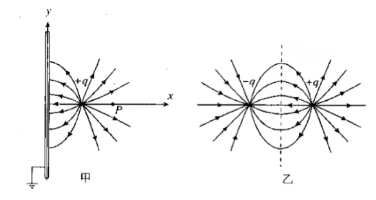

# 静电学模型

## 电荷相关模型

### 模型：起电方式

#### 摩擦起电

摩擦起电：不同物体对电子的束缚能力不同，电子从一个物体转移到另一个物体。

摩擦起电的第一步即是将两种不同的物体相互摩擦，使它们最外层的电子得到足够的能量，摆脱原子核的束缚，在两个物体之间相互转移。

电子转移的原因是不同原子核对电子的吸引力会有差别，同时摩擦起电只会发生在绝缘体中，导体中的电荷转移形式为接触起电。

典型摩擦起电序列表：

- 正电：兔毛、玻璃、云母、人发、尼龙、羊毛、毛皮、铅、丝绸、铝、纸、棉花、钢铁、木。
- 负电：琥珀、封蜡、镍、铜、黄铜、银、黄金、铂金、硫、醋酸人造丝、聚酯纤维、赛璐珞、硅、铁氟龙。

关于电荷：同种电荷相互排斥，异种电荷相互吸引，带电荷物体可以吸附轻小物体。

常见错误：产生了电荷。摩擦起电后两个物体必带等量异性电荷，且**电荷是守恒的**，只会发生转移而不会凭空产生。

#### 接触起电

接触起电：发生在导体中，形如电荷量中和和平分，应用验电器。

即 $q_1+q_2\to(q_1+q_2)/2+(q_1+q_2)/2$ 的公式表达。

注意到这是符合电荷守恒定律的。

#### 感应起电

{ align=right width="50%" }

感应起电：发生于导体中，不接触，形式为导体中的自由电荷重新分布。

**静电平衡**是指导体中的自由电荷（通常为带负电荷电的电子）所受到的力达到平衡而不再做定向运动的状态。

处在静电平衡下的导体，有性质如下：

- 为一个**等势体**，其内部电势处处相等。
- 电荷量只会分布在其表面，内部场强为零。
- 其表面为**等势面**，电场线与其表面垂直。

推导结论：用导线连接处于静电平衡状态下的导体任意两个位置，没有电流流过，原因为等势体无电势差，即无电流。

微观实质：自由电荷重新分布，电场叠加抵消，从而达到静电平衡的条件。

- 自由电荷的重新分布：当导体置于外电场中时，导体内的自由电子会迅速移动，形成与外部电场方向相反的感应电场。

- 电场叠加抵消：自由电子的移动导致导体表面出现极化电荷（一端积累负电荷，另一端积累正电荷），这些极化电荷产生的电场与外电场在导体内部完全抵消。

- 静电平衡条件：当导体内部分子的库仑力与外部电场力达到平衡时，自由电荷停止定向移动，此时导体内总电场强度为零。

#### 接地加感应起电

感应起电接地模型：基础模型题目描述形如，带电物体 $\text C$ 靠近枕形导体 $\text{AB}$ 的 $\text A$ 端，将导体 $\mathrm{A/B}$ 端接地（或者用手触碰一下），然后拿开或不拿开 $\text{C}$，问导体 $\mathrm{A},\text{B}$ 两端分别带什么电荷。

性质：导体任意一端接地，效果相同。  
解释：因为是导体，所以电荷自由移动，完全不需要考虑导体的两端的差异。

性质：如果拿开 $\text{C}$，则导体两端电荷相同。  
解释：显然。

|  | 导体 $\text A$ 端 | 导体 $\text B$ 端 |
| :-: | :-: | :-: |
| 移开 $\text{C}$ 物体 | 负电荷 | 负电荷 |
| 不移开 $\text{C}$ 物体 | 负电荷 | 不带电 |

/// caption
假设 ${C}$ 带正点，且移开物体 ${C}$ 前已经停止接地
///

性质：靠近电荷的一段感应起电，远离电荷的一端不带电。  
解释：显然。

性质：感应起电后接地，电流移动方向与电荷有关。  
解释：因为是等势体，所以导体电势等于电荷在此处的电势，靠近正电荷为正，靠近负电荷为负，而大地电势为零，电流从高电势流到低电势，电子流动方向与电流相反。

#### 感应起电空球壳模型

如图：

{ width="100%" }

- 如果球壳内没有电荷，则球壳电荷一定集中在球壳外表面（图左下）。
- 如果球壳内有电荷，则球壳内一定感应起电（图右上）。
- 如果球壳接地，则球壳外一定没有电荷（图右下）。

电场强度、电势做题方法：

- 根据电荷（上图）画出电场线，电场线由正电荷发出。
- 根据顺着电场线，电势逐渐降低；靠着电荷越近，电场强度越大。
- 导体始终是等势体，如果外表面没有电荷，则球壳内及外电势均为零。

#### 静电屏蔽和法拉第笼

在静电平衡状态下，空腔内部没有电场。不管导体本身带电还是处于外界电场中这一结论始终成立。这样，导体壳的表面就保护了它的内部区域，使之不受导体壳外表面上的电荷或外界电场的影响，这种现象称为静电屏蔽。

{ width="100%" }

- 一个空腔导体，外接电场既不会影响腔内的物体。
- 一个**接地的**空腔导体，腔内带电体的电场不会影响腔外的物体。

静电屏蔽的应用很广泛，例如电子仪器外的**金属网罩**、电缆外层包裹的**金属皮**用于防止外部电场对内部的影响。

**法拉第笼**，又称法拉第屏蔽罩，是一个由金属或者良导体形成的笼子。

- 法拉第遮罩无论被加上多高的电压内部也不存在电场。
- 而且由于金属的导电性，即使笼子通过很大的电流，内部的物体通过的电流也微乎其微。
- 在面对电磁波时，可以有效地阻止电磁波的进入。

由于法拉第遮罩的静电屏蔽原理，在汽车、飞机等交通工具中的人是不会被雷击的。

#### 静电除尘

工作原理：利用高压电场使气体中的尘埃带电，并通过电场力吸附尘埃。

具体过程：

1. 电离气体：在高压电极附近，电场强度极高，使空气分子电离，产生大量自由电子和正离子。
2. 尘埃带电：自由电子奔向正极过程中，附着在尘埃颗粒上，使其带负电。
3. 电场吸附：带电尘埃在电场力作用下向集尘极阳极表面移动，最终被吸附沉积。

应用：工业烟囱废气处理、空气净化设备。

### 模型：等离子体

#### 等离子体的定义

等离子体（又称电浆、电离浆、等离体），是物质状态之一，是物质的高能状态。通俗的说，等离子体就是电离的气体。比较严格的定义是：等离子体是由电子、阳离子和中性粒子组成的整体上呈电中性的物质集合。等离子体可以被看成是由一群粒子所组成的系统，因此在数学上可以用统计的方式来研究，其形状和体积不固定，会依着容器而改变。

宇宙中充斥着各种各样的等离子体，是其最常见的物质相态，亦可以经由对处于其他相态的物质的加工取得。等离子体是宇宙重子物质最常见的形态，其中大部分存在于稀薄的星系际空间（特别是星系团内介质）和恒星之中。地球大气离地表 300 公里的电离层也是处于等离子态，电离层是地球大气较外层的气体吸收了太阳辐射能量，发生光致游离而形成。

#### 离子化过程

现代物理学对气体与等离子体之间的相变给出了详细描述，某种气体在经历外来的高温或强电磁场的作用时，此时该气体内本身存在的游离电子会被加速，并撞击该气体的诸中性粒子，使该气体中各颗中性粒子中的电子与其原子核分离，成为游离电子，而该中性粒子也会因缺少了电子而成为离子。这些分离出来的游离电子又会被该电场加速，再与其他中性粒子碰撞，这称为气体的离子化过程。此时该气体中一部分粒子会拥有比中性状态更多的电子而成为带负电荷的阴离子，另外有一部分粒子会拥有比中性状态更少的电子而成为带正电荷的阳离子，有一部分粒子则维持中性。离子化后的气体成为由各颗阴阳离子、游离电子、中性粒子等多种粒子所组成的电中性物质，其中阴离子的电荷量总和与阳离子的电荷量总和相等，这就是物理学上所谓等离子，此时物质在大尺度上的总电荷是零，这称为准中性。等离子体含有许多可以自由移动的非中性粒子（载流子），加上诸多非中性粒子带有电磁力，并会受其他非中性粒子的电磁力影响，即是说诸非中性粒子之间可以在不碰撞的情况下发生相互作用，这也解䆁了等离子体的导电及受电磁力支配等的多种性质。最后处于等离子态的物质也可以通过相变转化为其他三种物质状态。

#### 等离子体的现象和应用

等离子体现象：

- 对流层大气放电（闪电）。
- 中高层大气放电（红色精灵、蓝色喷流、巨型喷流、淘气精灵）。
- 极光、马祖火。

由等离子体组成的物质：

- 太阳及其他恒星。
- 太阳风。
- 吸积盘。
- 星云。

人工等离子体：

- 电感耦合等离子体火炬。
- 等离子灯（荧光灯、霓虹灯、弧光灯）。
- 臭氧发生器。
- 等离子炬。

电弧（又称弧放电）：由于电场过强，气体发生电击穿而持续形成等离子体，使得电流通过了通常状态下的绝缘介质（例如空气）的现象。

当通电的高电压电路出现导体与导体的分开时，两端就会出现电弧，产生的高热可以融化或是汽化所有的金属。

工业上利用电弧来焊接、融化或是切割金属，例如等离子切割机、放电加工机、炼钢厂的电弧炉，常见于电焊，氩焊。在汽机车修理，板金，车床。

#### 静电放电

静电放电：在某一绝缘介质的两面分别出现正电荷和负电荷，并且逐渐累积时，这时加于该绝缘介质上的电压也会同时增加，当该电压高于一定程度（击穿电压）后，这时绝缘介质会发生电击穿，继而使得一部分绝缘介质变为导体，使电流能够通过。在电流通过绝缘介质后，绝缘介质两面的正负电荷便会消失，加于该绝缘介质的电压也会回复到零，因此静电放电只会在一段短时间之内出现。

静电放电可以产生大小不等、或引人注目的电火花（闪电以及伴随的雷声，则是大规模的静电放电事件），即使是看不见也听不到的放电，仍有可能足以损坏敏感的电子设备。静电放电可能会在产业上造成重要的有害影响，例如气体，燃料蒸气和煤尘的爆炸，以及固态电子部件（例如集成电路）的故障，这些电子器件在承受高压时可能会遭受永久性损坏。

| 静电发生情境 | 相对湿度 10-25%[^noteesda] | 相对湿度 65-90%[^noteesda] |
| :-: | :-: | :-: |
| 行走在地毯上 | $\pu{35,000V}$ | $\pu{1,500V}$ |
| 行走在塑料地板 | $\pu{12,000V}$ | $\pu{250V}$ |
| 在工作台边工作 | $\pu{6,000V}$ | $\pu{100V}$ |
| 从工作台拿起塑料袋 | $\pu{20,000V}$ | $\pu{1,200V}$ |
| 发泡胶椅 | $\pu{18,000V}$ | $\pu{1,500V}$ |

[^noteesda]: <https://www.esda.org/assets/Documents/Fundamentals-Part-1-SimplifiedChinese.pdf>

电击穿：当加在某一绝缘介质上的电压高于过一定程度（击穿电压）后，这时绝缘介质会发生突崩溃而使其电阻迅速下降，继而使得一部分绝缘介质变为导体。不同介质的击穿电压一般是不同的。

突崩溃（又称雪崩击穿）：对一些绝缘体或半导体施加足够的电压时，流过它们的电流突然增大。

在有效的击穿电压下，电击穿现象可以发生在固体、流体、气体或者真空等不同的介质中。这主要与金属原子外自由运动的电子有关。大部分的绝缘体或半导体载运电流的能力受限于能够在原子外中自由运动的电子的不足，强大的电流所产生的电子能够击出原子中的电子而使它变成自由电子。而由于上述的现象类似于雪崩产生的滚雪球效应，因此得名。

电击穿后的常见放电现象有：静电放电、电晕放电、电弧放电、发光放电。

#### 电晕放电

电晕放电：由围绕在高电压导体周围的流体电离造成的放电，此处最常见的流体就是空气，此放电因在黑暗中状似月晕而得名。

电晕放电时，在沿着导线或电极的表面可以看到光层（电晕），伴有咝咝声，并产生臭氧、氮氧化物等。

尖端放电：为电晕放电的其中一种，造成此现象的原因主要为导体尖端周围的空气被导体产生的电场电离。当导体周围电场强度够高来形成一个可作为导体的区域时，将会发生放电现象，但其电场值并不足以引起电压崩溃或对附近的物件造成电弧现象。

电晕放电是一种电流从带电物体（电极）流到不带电之流体，进而造成电极附近产生离子态分子的一种过程，而尖端放电特指电晕放电中因尖端物体所造成的电晕放电现象。

具体的，在高电压下电场强度过大，导致非导电介质被击穿，绝缘体的电阻迅速下降，继而使得一部分绝缘体变为导体，而形成放电现象，常发生在高压电线周围或带电体的尖端附近（尖端放电）。

在空气中，我们通常会在拥有高电压的导体尖端附近看到。在高压系统中，自发性的尖端放电会消耗功率，而在尖端放电下的高化学活性反应中，会产生有害的物质，例如臭氧。可控制的尖端放电现象常被用在过滤及印刷等等制程中。

应用尖端放电的例子：

- 避雷针。
- 制造臭氧。
- 静电除尘。

### 模型：带电小球

带电小球动态平衡：根据库仑定律得出库仑力，然后根据动态平衡解题。

#### 带电金属球问题

两个不可以忽略大小的带电金属球靠近，因为感应起电，电荷在球内的分布不均，因此实际作用力与库仑定律不同，但是存在大小结论：

- 设 $F_0$ 表示球心等价点电荷的库仑力。
- 若两球电性相同，则 $F<F_0$；
- 若两球电性不同，则 $F>F_0$。

理解方式，本来提供库仑力的电荷因为感应，存在有相互远离或靠近的趋势。不考虑球内电荷的相互作用力变化，根据库仑力与 $r$ 的平方成反比，可以得出上述结论。

#### 点电荷三点共线问题

题目描述：三个带电小球在一条直线上，处于平衡状态。

我们进行讨论，容易发现可以平衡的电荷正负只有「正负正」「负正负」两种。

总结：带电正负为两同夹异，带电量为两大夹小、近小远大。

公式表达：

一条直线上一次有电荷量为 $q_1,q_2,q_3$ 的点电荷，其间距分别为 $\ell_1,\ell_2$，若三点电荷平衡：

$$
\sqrt{q_1q_3}=\sqrt{q_1q_2}+\sqrt{q_2q_3}
$$

$$
q_1:q_2:q_3=\ell_1^2:\dfrac{\ell_1^2\ell_2^2}{\ell_1^2+\ell_2^2}:\ell_2^2
$$

证明：暴力展开。

## 电场相关模型

### 模型：电势定性判断

#### 电势的规律

电势沿着电场线逐渐降低：

- 假设有正电荷 $q$，沿着电场线移动，则 $W=Fx=Eqx$ 为正功，电势能 $E_p=\varphi q$ 减小，因为 $q$ 是正数，所以 $\varphi$ 减小。
- 假设有负电荷 $q$，沿着电场线移动，则 $W=Fx=Eqx$ 为负功，电势能 $E_p=\varphi q$ 增大，因为 $q$ 是负数，所以 $\varphi$ 减小。

点电荷和电势：

- 设无穷远处电势为零，因为正电荷周围电场线向外，因此正电荷向外电势逐渐降低到零，且正电荷周围电势为正。
- 设无穷远处电势为零，因为负电荷周围电场线向内，因此负电荷向外电势逐渐增加到零，且负电荷周围电势为负。

电场同一位置，电势相同，带不同电荷量的物体电势能不同。

#### 电势的比较

电势只与该点到正负点电荷的距离有关：

- 距离正电荷越近，电势越大；距离负电荷越近，电势越小；距离正电荷和负电荷距离相等的点（连线垂直平分线上的点）电势均等于零。
- 沿着电场线，电势逐渐降低。

比较电势能就是比较电势，因为 $E_p=\varphi q$，其中 $q$ 为定值。

回忆：比较电场强度直接放试探点电荷，注意电场强度是矢量，要比较方向。

### 模型：特殊场强叠加

#### 几何形态电场叠加

特殊几何形态：

- 圆环：有且仅有圆心场强为零，从圆心穿出场强先增大后减小。
- 圆球、球壳：可以看为球心的一个点电荷。

点电荷和接地金属板：

/// caption
图甲等价于金属板左侧对称点有一电量大小相等的相反电荷如图乙
///

#### 非点或多点电荷电场叠加

特殊非点电荷电场：

- 先分析容易分析的点的场强，然后根据对称性得到圆盘对侧的场强。
- 对于半个球壳一类不规则的，根据空间的对称性得出另一半球壳的理论场强，然后对称计算。

多点电荷电场：

- 根据 $\bm E_{总}=\bm0=\bm E_1+\bm E_{n-1}$，得出 $\bm E_1=-\bm E_{n-1}$。
- 将多个点中单个点拆除，如果有特殊点则将特殊点先化为正常点，然后考虑特殊点的贡献。

#### 等效重力（场）

注意到匀强电场中一个带电物体受到的电场力是恒力，其重力也是如此。

我们将这个电场力和重力合并为等效重力，类似于将空间旋转，当成仅受重力或电场力来分析。

这个可以理解为重力场和电场的合成，即为等效重力场。

{ width="60%" }

如图，如果从 $A$ 点静止释放，在 $B$ 点恰好速度为零，则 $C$ 点一定是动能最高的点，$OC$ 方向即为等效重力场方向。

### 模型：轨迹问题

#### 轨迹问题的概念

三线：电场线，等势线，轨迹线。

- 电场线和等势线垂直。
- 电场线和等势线的疏密都能反应电场强度，进而根据 $ma=F=Eq$ 可以推出电场力和加速度的大小。
- 轨迹线和电场线重合：电场线为直线，且 $v_0$ 与 $F$ 共线。

解题方法：

- 判断粒子受力情况：找到轨迹线与电场线或等势线交点，则力一定平行与电场线垂直于等势线，根据牛顿第二定律得出合外力一定指向轨迹线弯曲的方向。
- 判断加速度、动能：根据力与速度的夹角，夹角为锐角则加速，如果为钝角则减速。
- 判断电势能、电势：根据动能增减，得出电势能增减，再根据粒子带电正负性可以得出电势大小。

带电正负、电场方向、电势大小，可以互相推导，如果都不知道就都不知道。

#### 点电荷特殊电场

此时电场力就是库仑力：

- 判断粒子受力情况：连线，根据库仑定律可得。
- 判断加速度、动能：注意此时可能会出现先增大后减小，等情况

在点电荷中，通常存在有对称性。

### 模型：匀强电场

#### 匀强电场的定义

匀强电场在某个区域内各处电场强度大小相等，方向相同。

根据 $\bm F=\bm Eq$，在匀强电场中，带电物体受力始终是不变的，是恒力。

因为本身性质和重力类似，因此可以得出很多运动学动力学的结论，尤其是曲线运动。

有时不可忽略带电物体自身的重力，此时通常将重力和电场力做矢量和，即等效重力。

#### 匀强电场的公式

{ align=right width="50%" }

根据 $U=Ed$：

- 两平行边，电压和长度成正比。
- 一条边上，电势差与长度成正比。

找等势面：

- 根据 $E=U/d$ 求场强，$d$ 是顺着电场线的距离。
- 我们一定需要找一个电场线方向，可以直接找等势面。
- 连接两个等势点得到等势面，其垂直方向即为电场线方向。

### 模型：电容器

#### 电容器的概念

电容器（符号表示为「卝」）是将电能储存在电场中的被动电子器件，其储能特性可以用电容表示。

构成：两块金属板加一个绝缘介质。具体的，平行板电容器是一种简单的电容器，是由互相平行、以空间或介电质隔离的两片薄板导体构成。

/// caption
电容器原理示意图
///

电容：表示电容器储存电荷的能力。用 $C$ 表示，单位为 $\text F$ 法拉。

!!! note "电容器的应用"
    { align=right }

    在电路中邻近的导体之间即存在电容，而电容器是为了增加电路中的电容量而加入的电子器件。

    当电容器和其充电线路分离后，电容器会储存能量，因此可作为电池，提供短时间的电力。理论上电容器可以充电到很高的电压，例如几百伏特，但因为材料限制和介质击穿的原因，通常不会特别高。

    电容器常用在配合电池使用的电子设备中，在更换电池时提供电力，避免储存的资料因没有电力而消失。在电容充电后关闭电源，电容内的电荷仍可能储存很长的一段时间，此电荷足以产生电击，或是破坏相连结的仪器。

    在维修具有大电容的设备之前，需确认电容已经放电完毕。为了安全上的考量，所有大电容在组装前需要放电。高电压的电容器若在启动时加入缓启动的机制，限制其突入电流，可以延长其设备寿命，提升器件可靠度，也可以避免高电压下造成的危害。

假设这两片导板分别载有负电荷与正电荷，所载有的电荷量分别为 $−Q$、$+Q$，两片导板之间的电势差为 $V$，则这电容器的电容 $C$ 为：

$$
C={Q\over V}
$$

#### 电容的决定式

$$
C={\varepsilon_rS\over4\pi kd}
$$

- 其中 $\varepsilon_r$ 表示相对介电常数，定义为：

    $$
    \varepsilon_r={\varepsilon\over\varepsilon_0}={C\over C_0}
    $$

    用 $\varepsilon_0$ 表示真空电容率，$\varepsilon$ 表示电介质的电容率。

    $$
    \varepsilon_0\approx8.854\ 187\ 817\dots\times10^{-12}\mathrm{(A^2s^4kg^{-1}m^{-3})\ or\ (F/m)}
    $$

    相对介电常数通常与绝缘介质有关，通常真空的相对介电常数最小。

- 其中 $S$ 表示正对面积，即垂直接触的面积。

- 其中 $d$ 表示两板间距，即两平面的距离。

- 其中 $k$ 表示静电常数，详见库仑力。

进行推导，如果一个初始的电容器绝缘介质为真空，则往其中插入任何介质都会导致电容增加：

- 如果插入导体：则 $d$ 减小，$C$ 增大。
- 如果插入绝缘体：则 $\varepsilon$ 增大，$C$ 增大。

#### 电容器的动态变化

公式：

$$
\left\{
\begin{aligned}
C&=\dfrac QU\\
C&=\dfrac{\varepsilon_rS}{4\pi kd}\\
E&=\dfrac Ud
\end{aligned}
\right.
$$

可以推导：

$$
Q=\dfrac{\varepsilon_r ES}{4\pi k}
$$

和

$$
E=\dfrac{4\pi kQ}{\varepsilon_r S}
$$

解题思路：

- 若连接电压，则 $U$ 不变，根据 $d$ 推导 $C,Q,E$ 的变化。
- 若不连接电压，则 $Q$ 不变，根据 $d$ 推导 $C,U,E$ 的变化。
- 若 $Q$ 变化，则一定处于充电或放电的状态中，闭合电路中存在电流且如果是充电则顺着电池方向，如果是放电则逆着电池方向。

解题方法：

- 找出**电场线方向**，让卖家列出上面三个式子。
- 根据 $d$ 的变化推出 $C,E,Q,U$ 的变化。
- 对于求 $\varphi$ 的，列出一个 $Ed_{AB}=U_{AB}=\varphi_A-\varphi_B$ 的 $d_{AB}$ 不变的式子，根据 $E$ 的变化和 $\varphi_A,\varphi_B$ 中不变的一个，推导另一个的变化情况。

注意：根据 $U=Ed$ 求解时，一定要注意这个式子是无法确定正负号，即 $U_{AB}=-Ed_{BA}$ 是成立的。因此我们可以将下标按照电场线的方向书写，即电场线从 $A$ 到 $B$ 就列 $AB$ 的式子，这样可以避免正负号的问题。

### 模型：加速电场

#### 加速电场基本概念

将一个点电荷从匀强电场 $A$ 点静止释放，运动到 $B$ 的速度。

方法一：功动能定理。

$$
U_{AB}q=W=\dfrac12mv_B^2
$$

解得：

$$
v_B=\sqrt{\dfrac{2U_{AB}q}m}
$$

方法二：牛二。

$$
ma=F=Eq=\dfrac{U_{AB}}{d_{AB}}q
$$

$$
2ad_{AB}=v_B^2
$$

解得：

$$
v_B=\sqrt{\dfrac{2U_{AB}q}m}
$$

总结：$W=Uq$ 要注意正负号，数值与正负号可以同时带入也可以后确定正功负功。

#### 加速电场穿出问题

**模型一**：连接电源。

{ align=right width="35%" }

如右图，两个平行板上有一对小孔（对电场的影响不计），初始状态为从 $P$ 点静止释放，带电质点恰好不穿出下板（记为 $Q$ 点）。

此时 $U$ 是不变的，那么列出功动能定理：

$$
\begin{aligned}
mg(d+d)+W_{电}&=0-0\\
mg2d-Uq=0
\end{aligned}
$$

- 若移动上板：因为重力做功和 $Uq$ 都是不变的，因此质点恰好不穿出。
- 若向下移动下板：此时重力做功增大，$Uq$ 不变，在 $Q$ 点时动能大于零，因此会穿出。
- 若向上移动下板：此时重力做功减小，$Uq$ 不变，在 $Q$ 点时*动能小于零*，这是不合理的，即无法到达 $Q$ 点或不穿出。

总结结论：

| | 向上移动 | 向下移动 |
| :-: | :-: | :-: |
| 仅移动上板 | 恰好不穿出 | 恰好不穿出 |
| 仅移动下板 | 不穿出 | 穿出 |

**模型二**：不连接电源。

此时即为一个电容器，我们根据电容器的知识：

$$
E=\dfrac{4\pi kQ}{\varepsilon_r S}
$$

即电场场强是不变的，根据 $ma=F=Eq$ 不变，加速度也是不变的。

列出功动能定理：

$$
\begin{aligned}
mg(d+d)+W_{电}&=0-0\\
mg2d-Fx=0
\end{aligned}
$$

- 若向上移动上板：重力做功不变，$x$ 增大，在 $Q$ 点时*动能小于零*，这是不合理的，即无法到达 $Q$ 点或不穿出。
- 若向下移动上板：重力做功不变，$x$ 减小，在 $Q$ 点时动能大于零，因此会穿出。
- 若移动下板：我们进行动态的分析，因为加速度不变，而刚进入电场时的速度也是不变的，因此如果向下移动下板，则质点会同样恰好到达 $Q$ 点，不穿出电场；如果向上移动下板，则质点会穿出电场，之后因为仅受重力的作用，而无法停在 $Q$ 点，即穿出电场。

总结结论：

| | 向上移动 | 向下移动 |
| :-: | :-: | :-: |
| 仅移动上板 | 不穿出 | 穿出 |
| 仅移动下板 | 穿出 | 不穿出 |

#### 交变电场问题

如图：

本质是多个加速电场的合并。

$$
a=\dfrac{F}{m}=\dfrac{Eq}{m}=\dfrac{Uq}{dm}\propto U
$$

因此，我们可以根据电压的关系，画出 $a-t$ 图像，进而将其作为斜率画出 $v-t$ 图像，然后根据闭合图像面积对 $s-t$ 做出一定判断。

注意，在交变电场中，带电质点释放的时间是非常重要的，不同时间释放可能会影响运动情况。我们可以通过移动坐标轴到由静止释放释放的点，来实现简单的 $v-t$ 图像变换。

### 模型：偏转电场

#### 偏转电场基本模型

**偏转电场基本思路**：

- 根据牛顿第二定律，求得加速度 $a$。
- 解运动学方程，联系电场强度和位移。
- 根据电场强度和位移，联立求电势。

**基础偏转电场**如图：

基本思想是：

- 根据电场知识，求出 $a=\dfrac{qU}{md}$[^notequmd]。
- 根据通过时间为 $t=L/v_0$，列出两个方向的运动学方程求解。
- 如果给了场强，就用 $a=\dfrac{Eq}{m}$。

[^notequmd]: 记忆方法：已和谐。

**偏转电场列动能定理**：

$$
Uq=\dfrac12mv_t^2-\dfrac12mv_0^2
$$

此时注意 $U$ 为通过偏转电场位移在电场线上的投影。

一般不常在偏转电场中使用功动能定理，因为偏转电场与加速电场的通过整段电场不同，通常是通过一部分，需要通过正比例计算通过的电势差。

**偏转电场多段运动**：从偏转电场出去之后，为匀速直线运动或抛体运动，根据结论速度切线的反向延长线过水平位移中点，可以列出相似方程。

更加 trivial 的方式是，求出每一个运动段末状态的坐标和瞬时速度的水平和竖直分量，暴力计算即可。

**给定速度或位移角度**：列出角度的正弦余弦正切的比值，带入计算即可。

**加速电场撞板问题**：容易想到可行的方法只有，忽略板子限制，求出经过整个板后的竖直位移，与高度比较；求出恰好撞到板子上的水平位移，与板长比较。一般来说，我们按照前者计算会比较方便。

询问一排发射，问飞出去的百分比，即找到从下往上的上面算出的距离，在外面的就能飞出去，否则会撞板子。

#### 加速电场结合偏转电场

如图：

根据加速电场相关知识，电子进入偏转电场时的速度为：

$$
v_0=\sqrt{\dfrac{2U_0q}{m}}
$$

根据偏转电场相关知识，电子离开偏转电场时偏转的距离为：

$$
x=\dfrac12at^2=\dfrac{qU\cdot L^2\cdot m}{2\cdot md\cdot 2U_0q}=\dfrac{UL^2}{4U_0d}
$$

与荷质比无关，而电子在偏转电场中的运动时间：

$$
t=\dfrac{L}{v_0}=\sqrt{\dfrac{L^2m}{2U_0q}}
$$

与荷质比有关。

#### 阴极射线管（电场偏向型）

**电子枪**是一种使用于部分真空管中、能发射具有精确动能的平行电子束的电子元件。

**阴极射线管**（又称显像管、布劳恩管）是一种用于显示系统的物理仪器，曾广泛应用于**示波器**和**显示器**上。

它是利用阴极电子枪发射电子，在阳极高压的作用下，射向荧光屏，使荧光粉发光，同时电子束在偏转磁场的作用下，作上下左右的移动来达到扫描的目的。

磁场偏向型：以磁场令电子束产生偏向，产生磁场的偏向线圈附加在阴极射线管颈部外侧。**显示器**使用此种方式的显像管。

电场偏向型：以电场令电子束产生偏向，产生电场的偏向极板内置在阴极射线管内部。**示波器**使用此种方式的显像管，以利应付不同的扫描频率，但此方式需要较长的管身，主要用于电子仪器。
