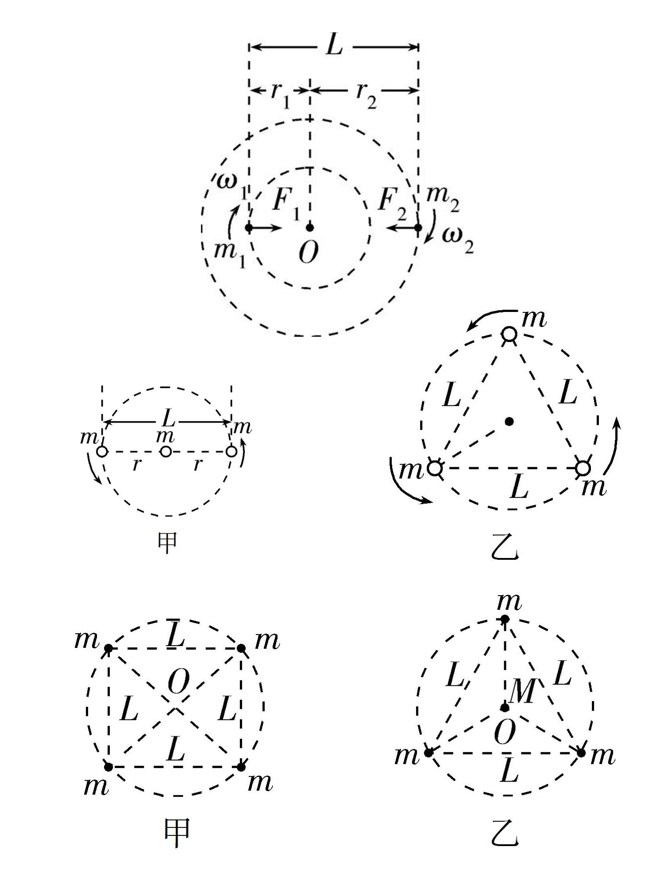

# 天体运动

## 天体运动概述

### 天体运动相关概念

- $r$：质心间距，$r=R_1+d+R_2$；
- $R$：星球半径；
- $h$：轨道高度；

1. 当讨论质点与星球时：$r=R+h$；
2. 贴地飞行、近地卫星、忽略高度：$r=R$；
3. 轨道高度远大于星球半径、忽略星球半径：$r=h$。

### 万有引力定律

公式：$F=G\dfrac{Mm}{r^2}$。

其中 $r$ 为质心间距，一般表示为 $r=R_1+d+R_2$。

常用割补法求解 $F_r=F_1-F_2$。

同时，可得引力加速度 $a_g=G\dfrac{M}{r^2}$。

### 星球的瓦解

当星球表面速度 $v=\sqrt{gR}$ 时，星球表面的物体就会漂浮，导致星球瓦解。

也就是说，半径为 $R$ 的星球，瓦解的角速度为 $\omega=\sqrt{g/R}$。

## 开普勒三大定律

### 开普勒第一定律

又称：椭圆定律、轨道定律。

行星绕太阳的轨迹是椭圆轨道，太阳在椭圆的一个焦点上。

### 开普勒第二定律

又称：等面积定律。

在相等时间内，行星与太阳的连线扫过的面积相等。

结论：近日点速度较大，远日点速度较小。

### 开普勒第三定律

又称：周期定律。

行星轨迹的半长轴 $a$ 的三次方与公转周期 $T$ 的平方的比值是一个定值 $k$。

用公式表示为：$\dfrac{{a_1}^3}{{T_1}^2}=\dfrac{{a_2}^3}{{T_2}^2}=k$。

其中 $k$ 是常数，只与中心天体的质量有关。

$$
k=\dfrac{GM}{4\pi^2}
$$

根据这个可以推导天体质量或周期。

### 开普勒定律结论

若两天体绕同一中心天体，则，

$$
\left(\dfrac{R_1}{R_2}\right)^3=\left(\dfrac{T_1}{T_2}\right)^2
$$

因此，若一天体轨道半径为另一天体的 $\lambda$ 倍，则其周期为：

$$
T'=T\sqrt{\lambda^3}
$$

也就是，

$$
\lambda=\sqrt[3]{\left(\dfrac{T'}{T}\right)^2}
$$

## 三大宇宙速度

### 第一宇宙速度

第一宇宙速度（又称环绕速度）是指在地球上发射的物体绕地球飞行作圆周运动所需的最小初始速度，也是环绕地球做圆周运动的最大环绕速度。

物体从地面发射，即 $r=R$，那么 $v=\sqrt{\dfrac{GM}{R}}=\sqrt{\dfrac{R^2g}{R}}=\sqrt{gR}\approx 7.9\mathrm{km/s}$。

也可以和圆周运动离心运动联系起来。

### 第二宇宙速度

第二宇宙速度（又称脱离速度、逃逸速度）是指在地球上发射的物体摆脱地球引力束缚，飞离地球所需的最小初始速度。

物体从地面发射，即 $r=R$，那么从动能和重力势能的角度：

$$
\begin{aligned}
\dfrac{1}{2}mv^2&=G\dfrac{Mm}{R}\\
v^2&=\dfrac{2GM}{R}\\
v&=\sqrt{\dfrac{2R^2g}{R}}\\
v&=\sqrt{2gR}\approx 11.2\mathrm{km/s}
\end{aligned}
$$

### 第三宇宙速度

第三宇宙速度（又称周期定律），是指在地球上发射的物体摆脱太阳引力束缚，飞出太阳系所需的最小初始速度。

在地球轨道上，要脱离太阳引力所需的初始速度为 $42.1\mathrm{km/s}$；地球绕太阳公转时令地面所有物体已具有 $29.8\mathrm{km/s}$ 的初始速度。

故此若沿地球公转方向发射，还需要提供 $12.3\mathrm{km/s}$ 的动能，因此在脱离地球引力以外额外再加上适当的动能即可：

$$
\begin{aligned}
\dfrac{1}{2}m{v_3}^2&=\dfrac{1}{2}m{v_2}^2+\dfrac{1}{2}m\Delta v^2\\
{v_3}^2&={v_2}^2+\Delta v^2\\
v_3&=\sqrt{{v_2}^2+\Delta v^2}\\
v_3&\approx\sqrt{11.2^2+12.3^2}\approx 16.7\mathrm{km/s}
\end{aligned}
$$

记忆方法：

- 第一 $[7.9]$。

- 第二 $[1+1]$（$1+1=2\Rightarrow11.2$）。

- 第三 $[1+6]$（$1+6=7\Rightarrow16.7$）。

## 轨道模型

### 匀速圆周运动

天体运动公式：

$$
\begin{aligned}
v&=\sqrt{\dfrac{GM}{r}}\\
\omega&=\sqrt{\dfrac{GM}{r^3}}\\
T&=2\pi\sqrt{\dfrac{r^3}{GM}}\\
a&=\dfrac{MG}{r^2}\\
\omega&=\dfrac{2\pi}{T}
\end{aligned}
$$

黄夫人公式：$T^2MG=4\pi^2r^3$。

物理量的变化：

- 当 $r$ 增大时，$v$ 减小、$\omega$ 减小、$a$ 减小，$T$ 增大（前提：圆周运动）。

- 简记为：**高轨低速大周期**（速度：线速度、角速度、加速度）。

代数运算：常取 $G\approx 20/3\times10^{-11}$（忽略单位），$\pi^2\approx 10$。

古老的公式：$\rho=\dfrac{m}{V}$，$V=\dfrac{4}{3}\pi r^3$。

### 同步卫星

同步卫星（又称静止卫星），为相对赤道不动的卫星。

其轨道高度一般在 $\pu{35,786km}$，这是因为：

$$
T=2\pi\sqrt{\dfrac{r^3}{MG}}
$$

此时带入后的 $T$ 恰好和地球自转周期相近，因此同步卫星不属于地球表面。

类似的，我们有：

- 低、中地球轨道：周期小于一天。

- 地球同步轨道：周期等于一天。

- 高地球轨道：周期大于一天。

常用公式：

$$
v=r\omega
$$

$$
a=\omega^2r
$$

记为：**同步卫星看地面**（周期和线速度相同）。

### 比值问题

假设中心天体相同。

- **已知 $r$ 之比求 $T$ 之比**

    ---

    由，

    $$
    T=2\pi\sqrt{\dfrac{r^3}{MG}}
    $$

    得，

    $$
    \gdef\rd#1#2#3#4{\dfrac{#1}{#2}=\dfrac{#3}{#4}}
    \gdef\rds#1#2#3#4{\dfrac{#1}{#2}=\sqrt{\dfrac{#3}{#4}}}
    \rds{T_1}{T_2}{r^3}{r^3}
    $$

- **已知 $r$ 之比求 $v$ 之比**

    ---

    由，

    $$
    v=\sqrt{\dfrac{GM}{r}}
    $$

    得，

    $$
    \rds{v_1}{v_2}{r_2}{r_1}
    $$

- **已知 $r$ 之比求 $\omega$ 之比**

    ---

    由，

    $$
    \omega=\sqrt{\dfrac{GM}{r^3}}
    $$

    得，

    $$
    \rds{\omega_1}{\omega_2}{r_2^3}{r_1^3}
    $$

- **已知 $r$ 之比求 $a$ 之比**

    ---

    由，

    $$
    a=\dfrac{GM}{r^2}
    $$

    得，

    $$
    \rd{a_1}{a_2}{r_2^2}{r_1^2}
    $$

- **特殊的**

    ---

    有反比：

    $$
    \dfrac{T_1}{T_2}\cdot\dfrac{\omega_1}{\omega_2}=1
    $$

- **朴素的**

    ---

    1. 将题目给出的物理量转化为半径之比。

    2. 根据半径之比，结合公式得出所求比。

如果中心天体（质量）不同，保留 $M$ 即可。

### 星球密度

根据：

$$
\rho=\dfrac MV
$$

其中显然，

$$
V=\dfrac43\pi R^3
$$

另外：

$$
M=\dfrac{4\pi^2 R^3}{T^2G}=\dfrac{R^2g}{G}
$$

贴表飞行，$r=R$，则：

$$
\rho=\dfrac{3\pi}{GT^2}
$$

### 变轨运动

过程：

1. 点火加速进入椭圆轨道。

2. 点火加速进入高轨道。

圆轨道使用高轨低速大周期判断速度即可。

具体的，$v_1$ 点火后 $v_p$，最高轨道 $v_q$ 点火加速到 $v_2$ 圆周。

$$
v_q<v_2<v_1<v_p
$$

简记为，椭圆轨道在两极，点火加速 $a$ 不变，周期看长轴（开三）。

### 双星和多星

两个星球同时绕一**质心** $O$ 做匀速圆周运动。

性质：圆周轨道双星 $\omega$ 相同，理解，必然。

基本原理为 $F_g=F_c$，列式：

$$
\begin{aligned}
G\dfrac{m_Am_B}{L^2}&=m_A\omega^2r_{OA}\\
G\dfrac{m_Am_B}{L^2}&=m_B\omega^2r_{OB}\\
\end{aligned}
$$

两式做比：$m_Ar_{OA}=m_Br_{OB}$。

两式做和：

$$
GM=G(m_A+m_B)=\omega^2L^2(r_{OA}+r_{OB})=\omega^2L^3
$$

其中 $M=m_A+m_B$。

结论：

1. 此双星系统中，两星所受万有引力大小相等。
2. 此双星系统中，$\omega$ 只与两星总质量 $M$ 和间距 $L$ 有关。
3. 若一星质量加 $\Delta m$，一星质量减 $\Delta m$，$\omega$ 不变。
4. 此双星系统中，一星质量越大，公转半径越小。
5. 此双星系统中，根据两星 $\omega$ 相同，则 $v=r\omega$，公转半径越大，速度越大。
6. 综上两条，一星质量越大，公转半径越小，速度越小。

对于 $N$ 体问题，一般只考虑星体依次连线，或者形状为正 $N$ 边形的情况。

| | 角速度公式 | 周期公式 |
| :-: | - | - |
| 双星系统 | $\omega=\sqrt{\dfrac{GM}{r^3}}$ | $T=2\pi\sqrt{\dfrac{r^3}{GM}}$ |
| 三星系统 | $\omega=\sqrt{\dfrac{3GM}{r^3}}$ | $T=2\pi\sqrt{\dfrac{r^3}{3GM}}$ |

{ width="90%" }

此时，存在两个可用的条件，$\omega$ 相同，以及万有引力的合力提供向心力。

列式即可，也可以使用质心解决。

### 相遇与追及问题

总体思路：用相对角速度算时间，以速度小的（一般为高轨道）为基准。

公式：$t=\dfrac{\mathrm{rad}}{\Delta\omega}$，即相对角度除以相对角速度。

## 表面模型

### 忽略自转

定义表面的物体：不绕着星球转，不一定在地面。

同步卫星不属于表面物体。

### 地面位置

由万有引力等于重力：

$$
G\dfrac{Mm}{R^2}=mg
$$

得：

$$
MG=R^2g
$$

这也是联系天体运动和重力加速度的黄金代换式。

整理得 $g=\dfrac{MG}{R^2}$。

### 表面以上位置

由万有引力等于重力，得 $MG=(R+h)^2g$。

整理得 $g=\dfrac{MG}{(R+h)^2}$。

### 星球内部

考虑万有引力，只有星球的一部分对物体产生万有引力。

对物体产生万有引力的部分的星球质量：$M'=\dfrac{4}{3}\pi(R-h)^3\rho$。

由 $G\dfrac{M'm}{(R-h)^2}=mg$，得 $g=\dfrac{G}{(R-h)^2}M'$。

整理得，$g=\dfrac{G}{(R-h)^2}\times\dfrac{4}{3}\pi(R-h)^3\rho=\dfrac{4}{3}G\pi(R-h)\rho$。

## 自转模型

### 万有引力和向心力

有公式：$\vec F_g=\vec G+\vec F_c$（矢量相加）。

实际上 $F_c$ 很小（其中的 $r$ 是到地轴的距离，不是星球半径）。

### 极点位置

到地轴的距离为 $0$，即向心力 $F_c=0$。

展开：

$$
\begin{aligned}
F_g&=G+F_c\\
MG&=R^2g_0\\
M&=\dfrac{R^2g_0}{G}
\end{aligned}
$$

### 赤道位置

此时 $G$ 和 $F_c$ 方向相同，则 $F_g=G+F_c$。

展开：

$$
\begin{aligned}
F_g&=G+F_c\\
G\dfrac{Mm}{R^2}&=mg+m\omega^2R\\
\dfrac{MG}{R^2}&=g+\dfrac{4\pi^2}{T^2}R\\
MG&=R^2g+\dfrac{4\pi^2}{T^2}R^3
\end{aligned}
$$

联立上述二式，可解得 $g_0$：

$$
\begin{aligned}
\dfrac{R^2g_0}{R^2}&=g+\omega^2R\\
g_0&=g+\dfrac{4\pi^2}{T^2}R
\end{aligned}
$$

同时，也可解得 $R$：

$$
\begin{aligned}
R^2g_0&=R^2g+\dfrac{4\pi^2}{T^2}R^3\\
g_0&=g+\dfrac{4\pi^2}{T^2}R\\
R&=\dfrac{(g_0-g)T^2}{4\pi^2}
\end{aligned}
$$

联立上述四式，可解得 $M$，不过这玩意没啥用。

### 星球密度（二）

解：

$$
\begin{aligned}
\rho&=\dfrac{M}{V}=\dfrac{\frac{R^2g_0}{G}}{\frac{4}{3}\pi R^3}=\dfrac{3R^2g_0}{4\pi GR^3}\\
&=\dfrac{3g_0}{4\pi GR}=\dfrac{3g_0}{4\pi G\frac{(g_0-g)T^2}{4\pi^2}}=\dfrac{3g_0\pi}{G(g_0-g)T^2}\\
&=\dfrac{g_0}{g_0-g}\cdot\dfrac{3\pi}{GT^2}
\end{aligned}
$$
