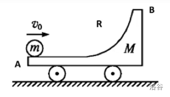
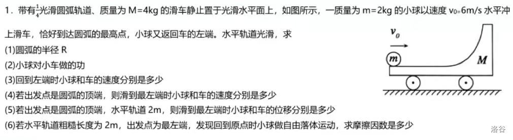

# 功能动量

## 功和功率

### 功

$$
W=\vec{F}\vec{x}=Fx\cos\theta=Fx_F
$$

其中 $\theta$ 表示力与位移的夹角，$x_F$ 表示在力 $F$ 的方向上的位移。

一般来说（对于简单题），直线运动用 $W=Fx\cos\theta$，曲线运动用 $W=Fx_F$。

做功正负：正负号取决于 $\cos\theta$ 的大小，即

- 若力与位移的夹角小于直角，则机械功为正，亦称为力做正功。
- 若力与位移的夹角大于直角，则机械功为负，或力做负功，或物体克服力做功。

PS：善用 Fs 图像，FS 图像中图形围成的面积即功。

### 约束力

约束力决定了系统中对象的位移，将其限制在范围内。它消除了在该方向上所有的位移，即物体平行此力的速度被约束为 $0$，因此约束力不对系统做功。

例如：用一根绳子系上一个小球做匀速圆周运动，小球会受到来自绳子，方向指向圆心的一个向心力。这个力的方向和球速度的方向垂直，所以这个力不做功（$W=0$）。

又如：桌上有一本书，施加外力会使书在桌面上移动。如果再对书施加一个垂直的力（实际上书受到的重力和支持力就属于这个力），和其欲移动之方向垂直，则此约束力（施加的垂直力）不做功。

### 平均功率

$$
P=\frac{W}{t}
$$

### 瞬时功率

$$
P=\frac{\mathrm dW}{\mathrm dt}=\frac{\vec F\vec x}{t}=\vec F\vec v=Fv\cos\theta
$$

符号解释同上。

一定注意到功率的变化量是与 $F$、$v$、$\theta$ 都有关的。

### 汽车启动问题

#### 解题方法

对（物体），做（运动段），如图（受力分析），列（平衡／牛二）。

$$
\begin{aligned}
F_合=ma&=F-f\\
F&=\frac{P}{v}
\end{aligned}
$$

得出（一定要受力分析）：

$$
\begin{aligned}
F&=f+ma\\
ma&=\frac{P}{v}-f
\end{aligned}
$$

#### 恒定功率启动

随着汽车的加速，

1. $v$ 增大，$P$ 不变，$F$ 减小，$F_r$ 减小；
2. $m$ 不变，$a$ 减小，$v$ 变化放缓。
3. 直至 $F=f$，汽车匀速运动。

即汽车加速到一定程度后，汽车将保持匀速运动。

#### 恒定加速度启动

按照时间顺序：

1. $a$ 不变，$m$ 不变，$f$ 不变，$F$ 不变；
2. $v$ 增大，$P$ 增大，汽车持续增速；
3. 汽车增速到一定程度后，$P$ 无法继续增大：
4. 此时 $P$ 恒定，故进行恒定功率启动式的加速。

#### 做题思路

1. 对匀速运动状态分析：平衡 $F=f$；
2. 对匀加速末状态分析：牛二 $ma=P/v-f$；
3. 对加速阶段状态分析：牛二 $ma=P/v-f$。

#### $F-\dfrac{1}{v}$ 图像

按照时间，从右往左，因为汽车速度增大，倒数减小。

- 牵引力为水平直线的：匀加速运动。
- 牵引力逐渐下降的：加速度逐渐减小。
- 牵引力端点位置：最终状态匀速直线运动。

做题方法：同上，一定要分析的是拐点和端点处的受力分析。

## 能量

### 能量的分类

#### 动能

物体因为运动而具有的能量，单位为焦耳 $\mathrm{J}$。

$$
E_k=\frac{1}{2}mv^2
$$

其中 $v$ 表示速率，即瞬时速度。

#### 势能

势能，是储存于一物理系统内的一种能量，是一个用来描述物体在保守力场中做功能力大小的物理量。从物理意义上来说，势能表示物体在特定位置上所储存的能量，描述做功能力的大小。在适当的情况下，势能可以转化为例如动能、内能等其他能量。

如果分别作用于两个质点上的作用力与反作用力做功与具体路径无关，只取决于相互作用质点初末位置，那么这样的一对力就叫作保守力。不满足这个条件的则称为非保守力。例如，重力是一种保守力，而摩擦力是一种非保守力。

常见的势能有重力势能和弹性势能，还有其他的，但是不属于这篇文章的范畴。

#### 内能

内能是指系统所含有的能量，但不包含因外部力场而产生的系统整体之动能与势能。

内能会因系统能量的增损而随之改变，系统的内能可能因对系统加热、对系统作功，或添加或移除物质而改变。当系统内有不可穿透的墙阻止物质传递时，该系统称之为「封闭系统」。

但是一系统内给定状态下的内能不能被直接量测。内能是一系统内的状态函数，因为其值仅取决于该系统的目前状态，而与达到此一状态所采之途径或过程无关。

虽然内能是个宏观物理量，内能也可在微观层面上由两个假设的量来解释。一个是系统内粒子的微观运动（平移、旋转、振动）所产生的微观动能。另一个是与粒子间的化学键及组成物质的静止质量能量等微观力有关之势能。

### 摩擦力发热

公式：

$$
Q=-(W_f+W_{f'})=-f\Delta s
$$

理想情况下，一对平衡力做总功 $0$，除了摩擦力，因为产生的热量属于损耗。

即一对摩擦力做的总功为负数，而损耗的部分就是放热，即总功取相反数。

这对摩擦力大小相同，方向相反，其阻碍物体产生的相对运动就是发热多少。

### 重力势能

重力大小：

$$
G=mg
$$

表示重力做功的能力。

$$
E_{pG}=mgh
$$

其中 $h$ 表示距离零势能面的高度。

$$
\Delta E_{pG}=mg\Delta h
$$

物体质量不变，重力势能变化量与零势能面无关。

$$
W_G=-\Delta E_{pG}
$$

重力做正功，重力势能减少。

### 弹性势能

胡克定律：

$$
F_弹=kx
$$

弹性势能公式：

$$
E_{p弹}={1\over2}kx^2
$$

弹力做正功，弹性势能减少。

$$
W_弹=-\Delta E_{p弹}
$$

注意：这里讨论的做功是弹簧对物体做功，弹簧的势能减小。

### 机械能

#### 定义

机械能是指宏观物质所表现出的势能 $E_p$ 与动能 $E_k$ 的总和，即：

$$
E_机=E_k+E_p
$$

不包括电势能。

#### 机械能与做功的关系

$$
W_{除G}=\Delta E_机
$$

做正功，机械能增加；排除了重力做功，因为：

重力做功会导致重力势能减小，动能增加，总和不变。

## 冲量和动量

### 冲量

冲量是作用在物体上的力在时间上的累积效果。

用符号 $\bm I$ 表示，也可用 $\bm J$ 或 Imp 表示冲量，公式：

$$
\bm I=\bm Ft
$$

没有特殊的单位，其单位为 $F$ 和 $t$ 单位的合成，即 $\mathrm{N\cdot s}$（牛秒）。

### 冲量和功

$$
\begin{aligned}
\bm I=\bm Ft\\
W=\bm F\bm x=Fx\cos\theta
\end{aligned}
$$

如果 $I=0$，那么 $F=0$，因为 $t$ 时间为 $0$ 没有意义。

如果 $W=0$，那么是 $F=0$ 或 $x=0$ 或 $\cos\theta=0$。

注意区分合外力（在瞬间，相当于恒力）的冲量和功：

$$
\begin{aligned}
\bm I_合=\Sigma\bm I=t\Sigma\bm F=\bm F_合t\\
W_合=\Sigma(\bm F\bm x)=\Sigma W
\end{aligned}
$$

### 动量

动量是一个物体在它运动方向上保持运动的趋势。

用符号 $\bm p$ 表示，公式：

$$
\bm p=m\bm v
$$

没有特殊的单位，其单位为 $m$ 和 $v$ 单位的合成，即 $\mathrm{kg\cdot m/s}$（牛秒）。

变化量的计算：

$$
\Delta\bm p=m\bm v_t-m\bm v_0
$$

注意相减一定要是矢量相减，因此在一条直线上的运算需要规定正方向。

PS：默认初速度方向为正方向。

动量与动能的转化：

$$
p^2=m^2v^2={1\over2}mv^2\times2m=2m\cdot E_k
$$

即 $\displaystyle E_k={p^2\over2m}$，但是这个结论适用范围很窄，一定要考虑方向的问题。

### 动量和动能

$$
\begin{aligned}
\bm p=m\bm v\\
E_k={1\over2}mv^2
\end{aligned}
$$

其中 $\bm v$ 表示速度，$v$ 表示速率。

在 $m$ 不改变的情况下：

若 $p$ 改变，$v$ 的方向和大小一定有一个改变。

若 $E_k$ 改变，只可能是 $v$ 的大小改变。

因此，我们得出：

- 一个物体的动能改变，其动量一定改变；
- 一个物体的动量改变，其动能不一定改变。

例如，一辆快速移动的重型卡车拥有很大的动量。若要使这重型卡车从零速度加速到移动速度，则需要使到很大的作用力；若要使重型卡车从移动速度减速到零，则也需要使到很大的作用力；若卡车轻一点或移动速度慢一点，则它的动量也会小一点。

## 守恒定律

假若孤立物理系统的某种可观测性质遵守守恒定律，则随着系统的演进，这种性质不会改变。

诺特定理表明，每一种守恒定律，必定有其伴随的物理对称性。

即不论在空间的取向为何，物理系统的物理行为一样。

### 绝对定律

绝对定律指，物理学者从未找到任何违背这些定律的证据。

- 质能守恒定律
- 动量守恒定律
- 角动量守恒定律
- 电荷守恒定律
- ……

### 近似定律

在某些特别状况，像低速、短暂时间尺寸、某种相互作用等等，以下这些定律近似于正确。

- 质量守恒定律（适用于非相对论性速度与不存在核反应的状况）
- 能量守恒定律（适用于非相对论性速度与不存在核反应的状况）
- 宇称对称性
- ……

### 机械能守恒定律

机械能守恒定律指出，任何物体系统无外力做功，系统内又只有保守力做功时，则系统的机械能（动能与势能之和）保持不变。

外力做功为零，表明没有从外界输入机械功；只有保守力做功，即只有动能和势能的转化，而无机械能转化为其他能，符合这两条件的机械能守恒对一切惯性参考系都成立。

本质：势能（$E_p$）和动能（$E_k$）的相互转化。

机械能守恒的条件：对于一个系统，如果系统内部只有保守力做功（常见的，摩擦力就不属于保守力），系统无外力做功（合外力不做功）的情况下，机械能守恒。

另一个不严谨的判断方式：判断系统内的机械能有没有转变为系统外的机械能（比如弹簧的压缩和伸长），判断系统内的动能和势能之和有没有变化（比如匀速下落的小球）。

注意：有的地方可能会写除去重力，其本质就是当我们讨论地球上的物体的时候，这个被讨论的系统其实是地球和物体，而地球和物体的相互作用重力是保守力，因此重力不算「外力」。

### 能量守恒定律

第一个形式：初能量等于末能量。

$$
E_t=E_0
$$

第二个形式：增能量等于减能量，即所有做功代数和为零。

$$
\Sigma E=0
$$

往往要配合单物体功动能定理使用。

## 功动能定理

### 定义形态

功动能定理指合力作用在物质上（合力做功）的功等于物质的动能变化量。

$$
W_合=\Delta E_k=\frac{1}{2}m{v_t}^2-\frac{1}{2}m{v_0}^2
$$

其中可以表示，

$$
W_合=F_合x=\Sigma W
$$

### 解题方法

对（物体），从（初位置）到（末位置），做功有（哪些力），列功动能定理：

$$
\begin{aligned}
W_合&=\Delta E_k\\
W_G+W_f+\dots&={1\over2}m{v_t}^2-{1\over2}m{v_0}^2
\end{aligned}
$$

PS：仅是具体，具体什么做功请分析。

### 正相关和负相关

#### 负相关

带负号的叫负相关，表示做功后能量减小：

$$
\begin{aligned}
W_G&=-\Delta E_{pG}\\
W_弹&=-\Delta E_{p弹}\\
\end{aligned}
$$

即，负相关，重力势能变化量是克服重力做的功，弹性势能变化量是克服弹力做的功。

对于重力势能，写：取（整个运动的最低点，某点水平位置）为零势能面。

#### 正相关

不带负号的叫正相关，表示做功后能量增加：

$$
\begin{aligned}
W_合=&\Delta E_k\\
W_{除G}=&\Delta E_机
\end{aligned}
$$

即，正相关，动能变化量是合外力做功，机械能变化量是除重力外做的功。

### 摩擦力做功

内能和摩擦力：

$$
Q=-(W_f+W_{f'})
$$

一个物体克服摩擦力做的功没有实际意义，因为内能需要一对摩擦力做的总功。

### 轻杆轻绳

轻绳、轻杆（$m=0$）没有重力势能、动能。

因此其无法具有能量，总功 $W=0$，只起到传递能量的作用。

据此，我们可以整体的分析，对多个物体同时分析。

轻杆轻绳的力做功直接忽略不计，列功动能定理，列关联速度。

杆子和绳子这种同步转动的，关联速度 $v=r\omega$（同一物体 $\omega$ 相同）。

非同步转动的，分解速度到沿绳沿杆方向，根据同绳等力列式。

### 运动段

如何选择运动段应用功动能定理：

- 问一个点的信息：一个 $v$ 已知的点、这个点。
- 问一个段的信息：两个 $v$ 已知的点。

不需要完全是这个段的端点，也可以是包含这个部分的一个大段。

## 动量定理

### 定义形态

动量定理指出：物体所受合力的冲量等于物体的动量变化。

$$
\begin{aligned}
\Sigma\bm I&=\Delta\bm p\\
\bm F_合t&=m\Delta\bm v
\end{aligned}
$$

上述式子可以用一行，更清晰的表示：

$$
\bm I=\bm F\Delta t=m\Delta\bm v=\Delta\bm p
$$

其中 $I$ 表示物体所受冲量，$m$ 表示物体的质量，$F$ 表示物体所受的合外力（恒力），$\Delta t$ 表示力的作用时间，$\Delta v$ 表示速度的变化量，$\Delta p$ 是动量变化量。

理解方式：物体摔到地上，$m\Delta v$ 是定值，比较软的地面会产生形变，时间 $t$ 更长、合外力更小。

### 一点解释

$$
\Delta\bm p=\bm I
$$

即物体的动量变化量即为物体受到的冲量。

$$
{\Delta\bm p\over\Delta t}=\bm F
$$

即物体的动量变化率即为其受到的合外力。

另外，有牛顿第二定律的原式形式：

$$
\bm F={\Delta\bm p\over\Delta t}={m\Delta\bm v\over\Delta t}=m\bm a
$$

部分推导如下：

$$
\begin{aligned}
\bm F\Delta t=m\bm a\Delta t=m\Delta\bm v\\
m\Delta\bm v=\Delta(m\bm v)=\Delta\bm p
\end{aligned}
$$

### 解题方法

对（物体），从（初位置）到（末位置），合外力（正方向－负方向），列动量定理：

比如一个重力为 $G$ 的小球落到地上，对地面的压力为 $N$，弹起用时为 $t$：

$$
(N-G)t=\Delta p=m(v_t-v_0)
$$

其中 $v_0$、$v_t$ 可以用匀变直求解，带入可解得未知量。

注意，合外力一定要用「正方向－负方向」而不是大减小，因为此处是要考虑方向的。

### 判断动量守恒

基础方法：

1. 画出系统内所有物体的受力分析；
2. 一对相互作用力抵消；
3. 判断水平方向上是否合外力分量为零；
4. 判断竖直方向上是否加速度矢量和为零。

### 基础题目

列式：

$$
\begin{aligned}
&m_1\bm v_1+m_2\bm v_2+\dots+m_n\bm v_n\\
=\;&m_1\bm v_1'+m_2\bm v_2'+\dots+m_n\bm v_n'
\end{aligned}
$$

求值，注意规定正方向。

### 流体类动量定理

判断标准：出现密度、面积等特定关键词。

关键字眼：水、空气、光子等一群运动的粒子。

解题思路：

列出动能定理，

$$
Ft=mv-mv_0
$$

发现我们不知道 $m$ 和 $t$，考虑进行处理，我们发现这里的质量只是打在接触面上的质量：

$$
m=\rho V=\rho Sh
$$

然后进行化简：

$$
F=\rho S{h\over t}(v-v_0)=\rho Sv(v-v_0)
$$

其中，$v$ 是打在墙面上时的流体速度，$v_0$ 为流体的初速度。

代数，$\rho$ 为流体密度，$S$ 为打在墙面上的接触面积，$F$ 为墙面受到的平均压力。

其中，后半边式子成立的前提是粒子均匀密布在接触面上，如风和水管。

对于下雨一类的，需要带前半边的式子，用 $h$ 表示 $t$ 时间内的余量（积水高度）。

## 动量守恒定律

### 定义形态

如果物体受到的合外力为零，则系统内各物体动量之和保持不变。

其推论为：没有外力干预，任何系统的质心都将保持匀速直线运动或静止状态不变。

数学表示：

$$
\sum_{i=1}^n\bm p_i=\mathit{const}
$$

一般更常用以以下形式表示：

$$
\sum_{i=1}^nm_i\bm v_i=\mathit{const}
$$

即：

$$
\begin{aligned}
&m_1\bm v_1+m_2\bm v_2+\dots+m_n\bm v_n\\
=\;&m_1\bm v_1'+m_2\bm v_2'+\dots+m_n\bm v_n'
\end{aligned}
$$

### 应用条件

动量守恒定律严格成立的条件是物理系统受到的合外力为零。而若在某一个方向上合外力的分量为零，则该方向的动量守恒，即动量在该方向的分量守恒（根据运动的分解与合成和力的独立作用原理可推知）。

求近似值：若系统内部的物体之间相互作用的内力远远大于外力。相对于内力，可以忽略外力，此时动量守恒定律近似成立。例如碰撞、爆炸、反冲，可认为在此过程中，该物体系统（由各个小物体组成）动量守恒。

根本原因：系统间内力等大、反向，相互抵消，这表现了空间平移不变性的特性。

### 弹性模型——类弹性碰撞

除动能外，无任何能量生成或损失。

1. 初动能＝末动能

2. 动量守恒

    $$
    m_1\bm v_1+m_2\bm v_2=m_1\bm v_1'+m_2\bm v_2'
    $$

3. 动能守恒

    $$
    {1\over2}m_1v_1^2+{1\over2}m_2v_2^2={1\over2}m_1v_1'^2+{1\over2}m_2v_2'^2
    $$

4. 结论，$v_f$ 表示质心速度

    $$
    \left\{\begin{aligned}
    v_1'&=2v_f-v_1\\
    v_2'&=2v_f-v_2\\
    v_f&={m_1v_1+m_2v_2\over m_1+m_2}
    \end{aligned}\right.
    $$

### 共速模型——完全非弹性碰撞

两物体变成相对静止或某方向相对静止。

1. 动量守恒

    $$
    m_1\bm v_1+m_2\bm v_2=m_1\bm v_1'+m_2\bm v_2'
    $$

2. 能量损失

    $$
    E_损=\left({1\over2}m_1v_1^2+{1\over2}m_2v_2^2\right)-{1\over2}(m_1+m_2)v_f^2
    $$

3. 损失去向

    发热量、重力势能、弹性势能。

### 人船模型——初动量为零

1. 动量守恒

    注意这里的加号是矢量相加：

    $$
    0=m_1\bm v_1+m_2\bm v_2
    $$

2. 位移关系

    可以用平均动量乘时间推出来（其中 $x$ 为某一方向上的位移）：

    $$
    \begin{aligned}
    m_1x_1&=m_2x_2\\
    x_1+x_2&=x
    \end{aligned}
    $$

3. 现象：人动船动，人停船停。

4. 推论

    $$
    \begin{aligned}
    x_1&={m_2x\over m_1+m_2}\\
    x_2&={m_1x\over m_1+m_2}
    \end{aligned}
    $$

### 爆炸模型——能量增多

人船模型的一种，但是人船模型一般问位移，爆炸模型一般问速度。

动量守恒，能量（动能）增加；能量来源：重力势能、弹性势能、化学能（爆炸）。

常配合功动能定理列方程解动能增加量。

### 凹槽模型——综合起来

质量为 $m=2\mathrm{kg}$ 的小球，从 $A$ 点以初速度 $v_0=6\mathrm{m/s}$ 向右运动，小车质量 $M=4\mathrm{kg}$：

问：小球运动到点 $B$ 后，能达到的最大高度是多少（水平共速模型）。

小球相对小车向上运动，水平方向上没有相对运动，即水平共速，小球做斜抛运动。

$$
mv_0=(m+M)v_f
$$

即质心速度，

$$
v_f=v_0\cdot{m\over m+M}=2\mathrm{m/s}
$$

损失的动能：

$$
E_损={1\over2}mv_0^2-{1\over2}(m+M)v_f^2=24(\mathrm{J})
$$

损失的动能全部转化为重力势能：

$$
E_损=E_p=mgh=20h
$$

解得 $h=1.2\mathrm{m}$。

问：当小球返回 $A$ 时，小球和小车的速度分别是多少（弹性模型）。

根据质心速度结论：

$$
\left\{\begin{aligned}
v_1&=2v_f-v_0=-2(\mathrm{m/s})\\
v_2&=2v_f=4(\mathrm{m/s})
\end{aligned}\right.
$$

问：若水平轨道粗糙且长度为 $2\mathrm m$，小球回到远处后自由落体，问水平轨道的摩擦因数。

根据动量守恒定律：

$$
mv_0=Mv_1
$$

解得 $v_1=3\mathrm{m/s}$。

求出动能：

$$
\begin{aligned}
E_0&={1\over2}mv_0^2=36(\mathrm{J})\\
E_t&={1\over2}Mv_1^2=18(\mathrm{J})
\end{aligned}
$$

根据发热公式：

$$
\begin{aligned}
Q&=E_0-E_t=18(\mathrm{J})\\
Q&=f\Delta s=\mu mg(L+R)
\end{aligned}
$$

解得 $\mu=0.225$。

## 碰撞模型

PS：这里只讨论垂直碰撞，不讨论斜碰撞。

碰撞在物理学中表现为两粒子或物体间极短的相互作用。

碰撞前后参与物发生速度，动量或能量改变。

由能量转移的方式区分为弹性碰撞和非弹性碰撞。

### 弹性碰撞

弹性碰撞是碰撞前后整个系统的动能不变的碰撞。

弹性碰撞的必要条件是动能没有转成其他形式的能量（变形或发热）。

理想弹性碰撞在宏观上是一个物理模型，由于摩擦和其他因素的存在，系统总会损失动能。

#### 一般形式

- 动能守恒：

$$
{1\over2}m_1v_1^2+{1\over2}m_2v_2^2={1\over2}m_1v_1'^2+{1\over2}m_2v_2'^2
$$

- 动量守恒：

$$
m_1\bm v_1+m_2\bm v_2=m_1\bm v_1'+m_2\bm v_2'
$$

#### 做题方法

由动量守恒、动能守恒：

$$
\left\{\begin{aligned}
m_1v_1+m_2v_2&=m_1v_1'+m_2v_2'\\
{1\over2}m_1v_1^2+{1\over2}m_2v_2^2&={1\over2}m_1v_1'^2+{1\over2}m_2v_2'^2
\end{aligned}\right.
$$

化简，得：

$$
\left\{\begin{aligned}
m_1v_1+m_2v_2&=m_1v_1'+m_2v_2'\\
v_1+v_1'&=v_2+v_2'
\end{aligned}\right.
$$

解得：

$$
\left\{\begin{aligned}
v_1'&={v_1(m_1-m_2)+2m_2v_2\over m_1+m_2}\\
v_2'&={v_2(m_2-m_1)+2m_1v_1\over m_1+m_2}
\end{aligned}\right.
$$

PS：下面的式子不用记，直接用上面的方程组解即可。

#### 动撞静

使用二元组表示，即 $(v_1,m_1)$ 撞 $(0,m_2)$：

$$
\left\{\begin{aligned}
v_1'&={v_1(m_1-m_2)\over m_1+m_2}\\
v_2'&={2m_1v_1\over m_1+m_2}
\end{aligned}\right.
$$

注意到 $v_2'$ 永远是正的，但是 $v_1'$ 可能是负的。

具体的，如果 $m_1<m_2$，$v_1'<0$，即物体反向。

特殊的，如果 $m_2\to\infty$，则 $v_1'\to -v_1$，$v_2'\to0$，类比到小球撞墙。

#### 等重碰撞

即 $(v_1,m)$ 撞 $(v_2,m)$。易得 $v_1'=v_2$，$v_2'=v_1$，即交换速度。

#### 守恒性质

- 质心的速度不变。
- 物件在碰撞前后的平均动量相同。

#### 十字交叉法

质心的速度不变，可以列出初、末速度和质心速度 $v_f$ 的关系：

$$
\left\{\begin{aligned}
v_1+v_1'&=2v_f\\
v_2+v_2'&=2v_f
\end{aligned}\right.
$$

考虑求质心速度，等价于两物体撞到共速的速度 $v_f$：

$$
\begin{aligned}
m_1v_1+m_2v_2=(m_1+m_2)v_f\\
v_f={m_1v_1+m_2v_2\over m_1+m_2}
\end{aligned}
$$

那么就有：

$$
\left\{\begin{aligned}
v_1'&=2\cdot{m_1v_1+m_2v_2\over m_1+m_2}-v_1\\
v_2'&=2\cdot{m_1v_1+m_2v_2\over m_1+m_2}-v_2
\end{aligned}\right.
$$

不要化简。

因为如果你化简了，你就会发现这个式子完全等价于上面那个奇奇怪怪的式子。

结束了？结束了。哇！这么简单。

#### 速度性质

- 一个物件相对另一个物件的速度，在碰撞后逆转：
- 两个碰撞物的质量相同，则两者速度互换。
- 一物碰撞一个质量远小于其的另一物，前者的速度几乎不变，后者以近乎其两倍速度弹出。
- 一物碰撞一个质量远大于其的另一物，前者的以近乎原速率反弹，后者几乎不动。

### 非弹性碰撞

非弹性碰撞是碰撞后整个系统的部分动能转换成至少其中一碰撞物的内能。

在碰撞中一部分动能转化为其他形式的能量（变形或发热），该碰撞称为「非弹性的」。

使整个系统的动能无法守恒，但它们仍遵守动量守恒定律的一类碰撞。

#### 一般形式

- 动能不守恒：

$$
{1\over2}m_1v_1^2+{1\over2}m_2v_2^2\ge{1\over2}m_1v_1'^2+{1\over2}m_2v_2'^2
$$

- 动量守恒：

$$
m_1\bm v_1+m_2\bm v_2=m_1\bm v_1'+m_2\bm v_2'
$$

#### 做题方法

由于朴素的非弹性碰撞只有动量守恒，因此你也只能列这一个。

$$
m_1v_1+m_2v_2=m_1v_1'+m_2v_2'
$$

此时可以问在碰撞中损耗的能量是多少：

$$
\begin{aligned}
E_损&=E_{k0}-E_{kt}\\
&=({1\over2}m_1v_1^2+{1\over2}m_2v_2^2)\\
&-({1\over2}m_1v_1'^2+{1\over2}m_2v_2'^2)
\end{aligned}
$$

因为，注意到在小球中，有用的能量只有动能。

### 完全非弹性碰撞

两个物体在碰撞后黏贴在一起，没有任何弹跳运动，则为完全非弹性碰撞。

完全非弹性碰撞损失的系统总动能，等于非弹性碰撞，大于弹性碰撞。

#### 一般形式

非完全弹性碰撞后两物体速度相同，设为 $v_f$，可以列出动量守恒：

$$
m_1\bm v_1+m_2\bm v_2=(m_1+m_2)\bm v_f
$$

#### 做题方法

非完全弹性碰撞的条件就是撞到共速，一般会表述为黏在一起、无相对运动。

没了。再难的作者也不会了。

### 恢复系数

#### 定义形式

恢复系数是衡量两个物体在碰撞后的反弹程度。

恢复系数通常在 $0$ 与 $1$ 之间，但是不是一定，我们记为 $C_r$：

- $C_r=1$，则此碰撞为弹性碰撞；
- $0\le C_r<1$，则此碰撞为非弹性碰撞；
- $C_r=0$，则此碰撞为完全非弹性碰撞，两个物体黏贴在一起。
- $C_r>1$，表示产生动能的碰撞。例如，当两个地雷碰撞引起爆炸。
- $C_r<0$，表示其中一个物体会超过另外一个物体。例如，子弹穿过弹靶。

#### 运用和方法

恢复系数是两个物体相互碰撞的特性，而不是单独物体的属性。

其中，恢复系数有公式：

$$
C_r={v_1'-v_2'\over v_2-v_1}={v_2'-v_1'\over v_1-v_2}
$$

于是，我们可以根据一次碰撞，求出两物体（材质）的恢复系数，再带入计算另一次碰撞。

### 实际碰撞

两个物体间的实际碰撞是参考理想弹性碰撞和理想非弹性碰撞的混合模型来表述的。

这个混合模型可以通过恢复系数 $C_r$ 来表示，其中 $C_r$ 是物体（材质）的特性。

作为系统只考虑其中之一，所以并不考虑动能守恒，否则系统就改变了其状态。

如果不考虑穿过物体的碰撞（穿墙），以及产生动能的碰撞（爆炸）：

- 动量守恒：

    $$
    m_1\bm v_1+m_2\bm v_2=m_1\bm v_1'+m_2\bm v_2'
    $$

- 同向相撞，后面的球的速度大于前面的球：

- 后面的球的速度在碰撞之后一定减小。

- 末状态动能不大于初状态动能。

### 六、取值范围问题

依旧不考虑穿过物体的碰撞（穿墙），以及产生动能的碰撞（爆炸）。

1. 速度的取值范围：

    $[$ 共速速度 $,$ 弹性碰撞速度 $]$，两边可以取等号。

    适用情况：没有给出任何末状态信息。

    注意问的是速度大小的最大、最小值，要看绝对值。

2. 损失能量的范围：

    $[0,$ 完全非弹性碰撞损失的能量 $]$，两边可以取等号。

3. 质量未知的动量变化范围：

    极限法：后物体撞前物体，

    1. 前物体质量极大速度极小，后物体近似原速返回，动量变化量为 $-2p_1$。

    2. 前物体和后物体速度接近，后物体近似速度不变，动量变化量为 $0$。

    故后物体动量变化范围为 $(-2p_1,0)$，不能取等号。

## 解题方法

### 公式的使用

对于不守恒的，考虑变化量的：

$$
\begin{aligned}
F_合x={1\over2}mv_t^2-{1\over2}mv_0^2&&(1)\\
F_合t=mv_t-mv_0&&(2)
\end{aligned}
$$

我们考虑功动能定理 $(1)$ 和动量定理 $(2)$ 存在什么区别和联系。

相同点：都有速度变化量 $\Delta v$ 和质量；不同点：一个是位移 $x$ 一个是时间 $t$。

因此，如果题目中出现了时间，则用动量定理；出现了位移，就用功动能定理。

均无关的，考虑其他方式求值，或者是用能量守恒、动量守恒解题。

对于守恒的，考虑不变化的：

$$
\begin{aligned}
{1\over2}m_1v_1^2+{1\over2}m_2v_2^2={1\over2}m_1v_1'^2+{1\over2}m_2v_2'^2&&(1)\\
m_1v_1+m_2v_2=m_1v_1'+m_2v_2'&&(2)
\end{aligned}
$$

使用情景很简答，如果守恒，一定要用。是否守恒判断：

如果系统的合外力在某一方向上的分量不做功，那么这个方向上动量守恒。

如果系统内无动能转化为其他形式的能（势能、热能），那么系统动能守恒。

### 经典例题

