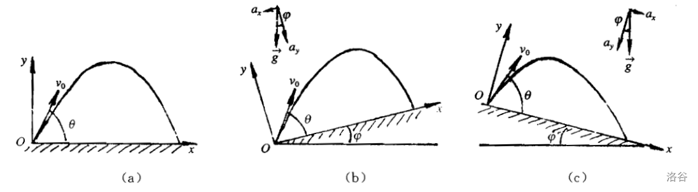
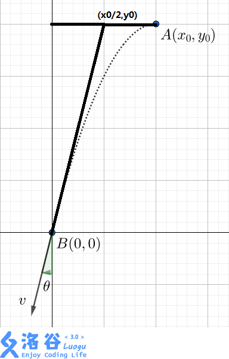

# 运动学

## 直线运动

### 直线运动：概念

#### 位移

如果质点做直线运动，我们可以取运动直线为坐标轴，设正方向为 $x$ 方向。

质点位置：

$$
x=x(t)
$$

质点的位移：

$$
\Delta x=x(t+\Delta t)-x(t)
$$

#### 速度

质点的平均速度定义为：

$$
\bar v={\Delta v\over\Delta t}
$$

平均速度是反映质点运动快慢与运动方向的物理量，而且是较为粗糙的反映 $\Delta t$ 时间段内运动的平均快慢和方向。如果要精确的描述质点在各时刻运动的快慢和方向，需取 $\Delta t\to0$ 的极限：

$$
v=\lim_{\Delta t\to0}{\Delta v\over\Delta t}
$$

做直线运动的质点的位置随时间变化的关系，可以在 $x-t$ 坐标中用一条曲线（称为位置图线）来表示。速度等于过曲线上一点切线的斜率，它是位置对时间的瞬时变化率。

于是，平均速度：

$$
\bar v={x(t+\Delta t)-x(t)\over\Delta t}=\tan\alpha
$$

其中 $\tan\alpha$ 表示割线斜率，当 $\Delta t\to0$，割线变成了切线。

#### 加速度

同样，可以定义平均加速度：

$$
\bar a={\Delta v\over\Delta t}\\
$$

以及，瞬时加速度：

$$
a=\lim_{\Delta t\to0}{\Delta v\over\Delta t}
$$

其中，$\bar a$ 是反映质点运动速度在 $\Delta t$ 时间内变化快慢和方向物理量。

当 $\Delta t\to0$ 时，成为能精确描述的瞬时加速度。

做直线运动的质点的速度随时间的变化关系，可以在 $v-t$ 坐标中用一条曲线（称为速度图线）来表示。同样，平均加速度 $\bar a$ 和加速度 $a$ 分别是过曲线上两点割线的斜率和曲线上一点切线的斜率。

应用 $v-t$ 图像（即速度图线）可以求出质点在任意时间内的位移，具体做法可以用近似求解。令 $t_1\to t_2$ 时间内分成 $n$ 个相等的小段，每段大小为 $\Delta t$，只需 $\Delta t$ 足够小，就可以近似认为 $\Delta t$ 内速度大小几乎不变，然后写出总面积：

$$
S=\sum_{i=1}^nv(t_i)\Delta t
$$

其中 $v(t_i)$ 为第 $i$ 条内的速度值。当 $\Delta t\to0$，即 $n\to\infty$ 时，此值 $S$ 即为位移的精确值。

### 直线运动：解题方法

#### 运动学方程

加速度 $a$ 保持不变的匀速直线运动称为匀变速直线运动。

做匀变速直线运动的质点的运动学方程有：

$$
\begin{aligned}
v_t=v_0+at&\kern{2em}\scriptsize \texttt{少 $x$ 的公式}\\[0.5em]
x={v_0+v_t\over2}t&\kern{2em}\scriptsize \texttt{少 $a$ 的公式}\\[0.5em]
x=v_0t+{1\over2}at^2&\kern{2em}\scriptsize \texttt{少 $v_t$ 的公式}\\[0.5em]
x=v_tt-{1\over2}at^2&\kern{2em}\scriptsize \texttt{少 $v_0$ 的公式}\\[0.5em]
2ax={v_t}^2-{v_0}^2&\kern{2em}\scriptsize \texttt{少 $t$ 的公式}
\end{aligned}
$$

上述方程包括五个参量：$v_0$、$v_t$、$a$、$t$、$x$。

若把这五个参量当成是「独立参量」，那么以上各方程独立的只有两个方程，因此欲由上述方程求解未知参量，必须先给出三个参量。

额外的：

- 平均速度等于中时速度：$\bar v_t=v_{t/2}$。

- 中位移公式：$\displaystyle v_{x\over2}=\sqrt{v_t^2+v_0^2\over2}$（平方平均数）。

#### HuangFuRen

把已知量打对钩，要求的打问号，例如：

$$
\begin{cases}
v_0&\checkmark\\
v_t&\checkmark\\
a&\,?\,\\
t&\checkmark\\
x&
\end{cases}
$$

于是考虑用少 $x$ 的公式，即 $v_t=v_0+at$。

### 直线运动：例题

#### 直线运动：例题一

一物体从静止开始从 $A$ 点做匀加速直线运动，加速度大小为 $5\mathrm{m/s^2}$。一段时间后做匀减速直线运动，加速度大小为 $2.5\mathrm{m/s^2}$，已知 $AB$ 距离为 $60\mathrm{m}$，求物体加速多久，可以恰好停在 $B$ 点。

设加速时间为 $t\mathrm{s}$，则可以列出方程：

$$
5t\times\left(\frac{5t}{2.5}+t\right)\times\frac{1}{2}=60
$$

解得 $t=2\sqrt2\mathrm{s}$。

#### 直线运动：例题二

一火箭从某个无大气层的行星的一个极地竖直向上发射。由火箭上传递过来的无线电信息知，从火箭发射时的一段时间 $\tau$ 内，火箭上所有物体对支持物的压力或对其悬挂装置的拉力是火箭发射前的 $1.8$ 倍。在落回行星表面前的所有时间内，火箭里的物体处于完全失重状态。试问，从火箭发射到落回行星表面经过多少时间？设行星引力大小随距行星高度的变化可以忽略不计。

设星球重力加速度 $g$，则火箭上升的 $\tau$ 时间内，加速度 $a$ 恒为：

$$
a=(1.8-1)g=0.8g
$$

在 $\tau$ 时间内，火箭达到的高度：

$$
h={1\over2}a\tau^2
$$

在 $t$ 秒末火箭的速度（方向向上）：

$$
v=a\tau
$$

火箭落回星球表面，完全失重表明火箭自由落体：

$$
-h=vt-{1\over2}gt^2
$$

带入可得：

$$
-0.4g\tau^2=0.8g\tau t-{1\over2}gt^2
$$

解得 $t_1=-0.4\tau{\scriptsize\texttt{（舍）}},t_2=2\tau$。

即火箭从发射到落回星球表面共用时 $3\tau$ 时间。

#### 直线运动：例题三

两个完全相同的球 $A$ 和 $B$，质量均为 $m$，$A$ 在 $B$ 后的距离为 $a$。如 $A$ 受沿 $AB$ 方向的冲量 $I$ 的作用，同时 $B$ 受沿 $AB$ 方向的常力 $F$ 的作用开始运动。试推导 $A$ 不超越 $B$ 的条件。

球 $A$ 受到冲量 $I$ 的作用，做速度为 $v_A$ 的匀速运动：

$$
I=mv_A
$$

球 $B$ 受到常力 $F$ 的作用，做加速度为 $a_B$ 的匀加速运动：

$$
F=ma_B
$$

则运动方程：

$$
\begin{aligned}
x_A&=v_At&&={I\over m}t\\
x_B&=a+{1\over2}at^2&&=a+{1\over2}{F\over m}t^2
\end{aligned}
$$

球 $A$ 不超越 $B$，即 $x_B$ 恒大于 $x_A$：

$$
\begin{aligned}
x_B>x_A\\
a+{1\over2}{F\over m}t^2>{I\over m}t\\
2am+Ft^2>2It
\end{aligned}
$$

得到：

$$
Ft^2-2It+2am>0
$$

因为 $F>0$，此式恒成立的条件为 $\Delta<0$，即：

$$
\begin{aligned}
4I^2-8maF<0\\
I^2<2maF
\end{aligned}
$$

## 抛体运动

### 抛体运动：概念

抛体运动是一个曲线运动，而且在运动中加速度始终为方向竖直向下的重力加速度 $g$。

因此，抛体运动是一个匀变速曲线运动（易证，也是一个平面运动）。

### 抛体运动：解题方法

#### 平面抛体

根据运动叠加原理，可以把抛体运动看作由两个直线运动叠加而成。

即把一个曲线运动分解成两个直线运动的叠加来讨论。有两种分解方法：

1. 速度为 $v_0$ 的匀速直线运动和沿竖直方向的自由落体运动。

2. 以抛射点为坐标原点，在抛射平面（竖直平面）内建立直角坐标系，再把方程中各矢量沿 $x,y$ 方向分解。如果在抛射平面内分别取水平方向和竖直向上方向为 $x,y$ 轴方向，那么抛体运动方程的分量形式为：

$$
\begin{aligned}
&v_x=v_0\cos\theta&&\kern{1em}v_y=v_0\sin\theta-gt\\[0.5em]
&x=(v_0\cos\theta)t&&\kern{1em}y=(v_0\sin\theta)t-gt^2/2
\end{aligned}
$$

这表示，抛体运动可以看成：

沿 $x$ 方向的速度为 $v_0\cos\theta$ 的匀速直线运动和沿 $y$ 方向的初速为 $v_0\sin\theta$、加速度为 $g$ 的匀变速直线运动。

#### 斜面抛体

在讨论沿斜面向上（或向下）抛掷物体的抛体运动时，通常令直角坐标的 $x,y$ 轴分别指向沿斜面向上（或向下）和垂直于斜面向上的方向更为方便。

此时 $x,y$ 方向的运动均为匀变速直线运动，它们在 $x,y$ 方向的分运动方程分别为：

$$
\begin{aligned}
&v_x=v_0\cos\theta\pm(g\sin\varphi)t&&\kern{1em}v_y=v_0\sin\theta-(g\cos\varphi)t\\[0.5em]
&x=(v_0\cos\theta)t\pm(g\sin\varphi)t^2/2&&\kern{1em}y=(v_0\sin\theta)t-(g\cos\varphi)t^2/2
\end{aligned}
$$

正号为斜面向下，负号为斜面向上，如图：


/// caption
斜面平抛
///

#### 抛体运动的结论

有时，我们关心的是轨道方程，尽管轨道方程所包含的信息没有运动方程所含信息多。

在讨论轨道方程时，通常先写出轨道方程，再消去 $t$ 得到，正如我们上面的两个推导过程。

1. 显而易见，在 $v_0,\theta$ 确定的情况下，抛射体运动的轨道方程确定。

2. 设抛射点为坐标原点，抛射初速度大小 $v_0$ 为已知值，而 $(x,y)$ 为竖直抛射面内被击中的一定点，此时一般能解出两个 $\theta$ 值；其中 $\theta_1+\theta_2=\pi/2+\beta$，其中 $\beta$ 为在抛射点所看到的点 $(x,y)$ 的视角（$|\beta|\le\pi/2$）。

3. 斜抛运动中，速度（切线）的反向延长线过水平位移中点。


/// caption
速度的反向延长线和坐标轴围成的三角形与一半位移围成的三角形相似
///

### 抛体运动：例题

#### 抛体运动：例题一

如图 $(a)$，求射程、最大高度，

射程，可由 $y=0$ 时的 $x$ 求得，表示 $t$：

$$
t={v_0\sin\theta\pm v_0\sin\theta\over g}={2v_0\sin\theta\over g}
$$

表示 $L(x)$，同时根据正弦函数二倍角公式，化简得：

$$
L=(v_0\cos\theta)t={v_0^2\times2\sin\theta\cos\theta\over g}={v_0^2\sin2\theta\over g}
$$

易知，当 $\theta=\pi/4\,(45^\circ)$ 时 $L_{\mathit{max}}=v_0^2/g$。

最大高度，可由 $v_y=0$ 时的 $y$ 求得：

$$
t={v_o\sin\theta\over g},\,H={v_0^2\sin^2\theta\over2g}
$$

易知，当 $\theta=\pi/2\,(90^\circ)$ 时 $H_{\mathit{max}}=v_0^2/2g$。

#### 抛体运动：例题二

如图 $(b)$，同理，小球在斜面上的射程：

$$
S={2v_0^2\cos(\theta+\varphi)\sin\theta\over g\cos^2\varphi}
$$

#### 抛体运动：例题三

在距离墙面 $x$ 处以 $v_0$ 的初速度抛出一小球，小球撞击墙面的最大高度：

$$
H_{\mathit{max}}={v_0^2\over2g}-{gx^2\over2v_0^2}
$$

#### 抛体运动：例题四

在距离水平面 $h$ 处以 $v_0$ 的初速度抛出一小球，小球落到水平面的最大射程：

$$
L_{\mathit{max}}={v_0\over g}\sqrt{v_0^2+2gh}
$$

抛射角：

$$
\theta=\cot\left({v_0\over\sqrt{v_0^2-2gh}}\right)
$$

#### 抛体运动：例题五

斜上抛物体到达最高点时速度为 $v=24\mathrm{m/s}$，落地时速度为 $v_t=30\mathrm{m/s}$，求：

- 物体抛出时的速度的大小和方向；物体在空中的飞行时间；射高和水平射程。

列出方程：

$$
\begin{aligned}
&v_x=v_0\cos\theta&&\kern{1em}v_y=v_0\sin\theta-gt\\
&x=(v_0\cos\theta)t&&\kern{1em}y=(v_0\sin\theta)t-gt^2/2
\end{aligned}
$$

由题意，$v_x=24\mathrm{m/s}$；当 $y=0$ 时，$v_x^2+v_y^2=(30\mathrm{m/s})^2$，解得 $v_y=18\mathrm{m/s}$。

根据对称性，抛出时速度 $v_0=30\mathrm{m/s}$，夹角 $\theta=\cot(v_y/v_x)=\cot(3/4)=37^\circ$。

落地飞行时间，即 $y=0$ 时的 $t$，则 $t_1=0\mathrm{s},\,t_2=3.6\mathrm{s}$，其中 $0$ 为抛出时（舍）。

射高，即 $v_y=0$ 时的 $y$，即 $y|_{t=1.8\mathrm{s}}=16.2\mathrm{m}$；射程，即 $x|_{t=3.6\mathrm{s}}=86.4\mathrm{m}$。

即：初速度 $30\mathrm{m/s}\,(37^\circ)$，飞行时间 $3.6\mathrm{s}$，射高为 $16.2\mathrm{m}$，射程为 $86.4\mathrm{m}$。

#### 抛体运动：例题六

传送门：<https://www.luogu.com.cn/problem/P4710>。

形式化题面：

一个可以视为质点的小球在 $(x_0,y_0)$ 沿 $x$ 轴负方向以一初速度抛出，忽略阻力。

给定该小球落到原点 $(0,0)$ 时的瞬时速度 $v$ 及该速度与法线的夹角 $\theta$，求 $(x_0,y_0)$。

给定速度单位为 $\mathrm{m/s}$，角度单位为 $\mathrm{rad}$，重力加速度取 $g=10\mathrm{m/s^2}$.

考虑将末速度正交分解：

$$
\left\{\begin{aligned}
v_x&=v\sin\theta\\
v_y&=v\cos\theta
\end{aligned}\right.
$$

考虑计算运动时间。

$$
v_t=v_0+at
$$

故：

$$
t={v_t-v_0\over a}={v_y\over2g}={v\cos\theta\over10\mathrm{m/s^2}}
$$

考虑水平运动距离：

$$
x_x=v_xt={v^2\sin\theta\cos\theta\over10\mathrm{m/s^2}}\\
$$

考虑垂直运动距离：

$$
2ax=v_t^2-v_0^2
$$

故：

$$
x_y={v_t^2-v_0^2\over2a}={v_y^2\over2g}={v^2\cos^2\theta\over20\mathrm{m/s^2}}
$$

故起点坐标：

$$
(x_0,y_0)=\left({v^2\sin\theta\cos\theta\over10\mathrm{m/s^2}},{v^2\cos^2\theta\over20\mathrm{m/s^2}}\right)
$$

代码：

```cpp
main() {
    double v, theta;
    scanf("%lf%lf", &v, &theta);
    double x = v * v * sin(theta) * cos(theta) / 10.0;
    double y = v * v * cos(theta) * cos(theta) / 20.0;
    printf("%.6lf %.6lf\n", x, y);
}
```

## 圆周运动

### 圆周运动：概念

#### 物理量

1. 线速度：单位时间通过的弧长，$v(\mathrm{m/s})$；
2. 角速度：单位时间通过的角度，$\omega(\mathrm{rad/s})$；
3. 周期：完成一次的时间，$T(\mathrm{s})$；
4. 频率：单位时间完成的次数：$f(\mathrm{s^{-1},Hz})$；
5. 转速：单位时间完成的圈数：$n(\mathrm{r/s})$。

#### 匀速圆周运动

$$
T=\dfrac{2\pi r}{v},\;
T=\dfrac{2\pi}{\omega}
$$

推导出来：

$$
v=\omega r
$$

即速度（$v$）在（$=$）绕（$r$）弯（$\omega$）。

$$
f={1\over T},\;
f=n
$$

#### 向心力和向心加速度

向心力：

$$
F_c=\dfrac{mv^2}{r},\;
F_c=m\omega^2r,\;
F_c=mv\omega
$$

向心加速度：

$$
a_c=\dfrac{v^2}{r},\;
a_c=\omega^2r,\;
a_c=v\omega
$$

### 圆周运动：解题思路

#### 列表法

对于匀速圆周运动多个圈的题目，列表：

$$
\begin{array}{|c|l|l|l}\hline
&P_c&Q_c&\dots\\\hline
\bm r\\\hline
\bm \omega\\\hline
\bm v\\\hline
\bm a\\\hline
\end{array}
$$

上面对应的就是几个圆周，从上到下填表。

填表的时候常用公式 $a=v\omega$。

如果是求比例，那么设 $\omega$ 相同的点为单位 $1$。

#### 关联速度

现象：传送带上，各处线速度相同；同一物体，各处角速度相同。

现象：沿绳沿杆速度大小相同，力相同，垂直于接触面方向速度相同。

解决方法：

1. 判断合运动方向；
2. 分解合运动到沿绳沿杆方向；
3. 根据速度分量列等式。

#### 牛二思路

切线方向，列平衡式子，注意这个式子一定要列，下面可能会用到；

向心方向，列 $F_合=F_向$（匀速），其中合外力通过受力分析找，$r$ 要找。

常有模型：圆锥摆。

### 模型：圆锥摆

#### 最简形式

一个绳子拴着小球，摆下来遇到钉子然后绕着更小的半径运动。

瞬间小球速度不变，忽略能量损耗，小球线速度 $v$ 始终不变；易得：

$$
\omega=\sqrt{g\over L\cos\theta}
$$

根据 $\displaystyle F={mv^2\over r}$，绳子拉力增大；

根据 $\displaystyle\omega={v\over r}$，角速度增大；

根据 $a=v\omega$，加速度增大。

根据 $\displaystyle T={2\pi\over\omega}$，周期减小。

#### 另一个形式

在一根长度为 $l$ 的绳子下端悬挂一个质量为 $M$ 的小球，以匀角速度 $\omega$  旋转，求绳子与铅锤方向所成的角 $\theta$。

易得：

$$
\begin{aligned}
T\cos\theta&=Mg\\
T\sin\theta&=M\omega^2r=M\omega^2l\sin\theta
\end{aligned}
$$

注意到一个可行解是 $\sin\theta=0$，即 $\theta=0$（因为 $\theta=\pi$ 是不稳定状态）。

否则，

$$
T=M\omega^2l
$$

即，

$$
Mg=T\cos\theta=M\omega^2l\cos\theta
$$

$$
\cos\theta={g\over\omega^2l},\;\theta=\arccos\left({g\over\omega^2l}\right)
$$

结论：

$$
\theta=\left\{\begin{aligned}
&0&,\omega\le\sqrt{g\over l}\\
&\arccos\left({g\over\omega^2l}\right)&,\omega>\sqrt{g\over l}\\
\end{aligned}\right.
$$

#### 同角不同面模型

角，指的是和法线的夹角；面，指的是水平面。

最常见的是漏斗里面小球转圈圈，注意要接触面光滑。

结论，加速度：

$$
a=g\cot\theta
$$

同角不同面，则加速度 $a$ 对各物体相同。

根据 $F_向=ma$，因此质量越大，向心力越大。

根据 $\displaystyle F_N={mg\over\sin\theta}$，因此质量越大，对斜面压力越大。

根据 $a=\omega^2r$，因此半径越大，角速度越小。

根据 $\displaystyle a={v^2\over r}$，因此半径越大，线速度越大。

#### 同面不同角模型

角，指的是和法线的夹角；面，指的是水平面。

结论，角速度（其中，$h$ 结点到圆心的高度）：

$$
\omega=\sqrt{g\over h}
$$

同面不同角，角速度 $\omega$ 对各物体相同。

根据 $a=\omega^2r$，因此半径越大，加速度越大。

根据 $v=r\omega$，因此半径越大，线速度越大。

### 模型：多物体圆盘

一个水平转动的圆盘上两个物体，考虑谁会先开始滑动。

物体 $m_1,m_2,\mu_1,\mu_2$，可以计算出每个物体的临界角速度。

$$
\begin{aligned}
\mu_1m_1g&=m_1\omega_1^2r_1\\
\mu_2m_2g&=m_2\omega_2^2r_2\\
\end{aligned}
$$

得出：

$$
\begin{aligned}
\omega_1&=\sqrt{\mu_1g\over r_1}\\
\omega_2&=\sqrt{\mu_2g\over r_2}\\
\end{aligned}
$$

即 $\displaystyle{\mu\over r}$ 小的先发生滑动，大的后发生滑动。

加上绳子连着也很简单，整体法即可：

两物体同侧：

$$
\omega=\sqrt{2\mu g\over r_1+r_2}
$$

两物体异侧：

$$
\begin{aligned}
\omega_1&=\sqrt{\mu g\over r_1}\\
\omega_2&=\sqrt{\mu g\over r_1-r_2}\\
\omega_3&=\sqrt{2\mu g\over r_1-r_2}
\end{aligned}
$$

### 模型：非匀速绳、杆

#### 基础形态

区别：绳子无法提供对物体向上的力。

列式：

$$
\begin{aligned}
G+T&=F_c\\
mg+T&=m\frac{v^2}{r}
\end{aligned}
$$

#### 绳模型

考虑最高点最小速度、恰好经过顶点、绳子无拉力：

物理量的表示，即：$v$ 最小，$F_c$ 最小，$T$ 为 $0$。

故：

$$
\begin{aligned}
mg&=m\frac{v^2}{r}\\
v&=\sqrt{gr}
\end{aligned}
$$

#### 杆模型

杆子可以提供最大为 $-mg$ 的力（表示为顶着物体）。

即，有最高点最小速度 $v=0$，杆子不受力 $v=\sqrt{gr}$。

最高点时，杆子的力可以向上、向下，因此记临界速度 $v_0=\sqrt{gr}$：

若 $v>v_0$ 则杆子对物体的力向下，若 $v<v_0$ 杆子对物体的力向上。

然后写牛二式子 $mg\pm T=m\dfrac{v^2}{r}$。

#### 动能定理

重力做功等于动能变化量，最高点速度可以求出来。

那么就可以求出来最低点的速度以及绳子的拉力。

#### 圆环模型

小球在圆环里面转圈，双环相当于杆，单环相当于绳。

注意到双环中，只可能两侧中的一侧受理，写牛二即可求 $T$。

## 天体运动

### 天体运动：概念

- $r$：质心间距，$r=R_1+d+R_2$；
- $R$：星球半径；
- $h$：轨道高度；

1. 当讨论质点与星球时：$r=R+h$；
2. 贴地飞行、近地卫星、忽略高度：$r=R$；
3. 轨道高度远大于星球半径、忽略星球半径：$r=h$。

### 开普勒三大定律

#### 开普勒第一定律（椭圆定律、轨道定律）

行星绕太阳的轨迹是椭圆轨道，太阳在椭圆的一个焦点上。

#### 开普勒第二定律（等面积定律）

在相等时间内，行星与太阳的连线扫过的面积相等。

结论：近日点速度较大，远日点速度较小。

#### 开普勒第三定律（周期定律）

行星轨迹的半长轴 $a$ 的三次方与公转周期 $T$ 的平方的比值是一个定值 $k$。

用公式表示为：$\dfrac{{a_1}^3}{{T_1}^2}=\dfrac{{a_2}^3}{{T_2}^2}=k$。

其中 $k$ 是常数，只与中心天体的质量有关。

### 万有引力定律

公式：$F=G\dfrac{Mm}{r^2}$。

其中 $r$ 为质心间距，一般表示为 $r=R_1+d+R_2$。

常用割补法求解 $F_r=F_1-F_2$。

同时，可得引力加速度 $a_g=G\dfrac{M}{r^2}$。

### 三大宇宙速度

#### 第一宇宙速度

第一宇宙速度（环绕速度）是指在地球上发射的物体绕地球飞行作圆周运动所需的最小初始速度。

物体从地面发射，即 $r=R$，那么 $v=\sqrt{\dfrac{GM}{R}}=\sqrt{\dfrac{R^2g}{R}}=\sqrt{gR}\doteq9.7\mathrm{km/s}$。

#### 第二宇宙速度

第二宇宙速度（脱离速度、逃逸速度）是指在地球上发射的物体摆脱地球引力束缚，飞离地球所需的最小初始速度。

物体从地面发射，即 $r=R$，那么从动能和重力势能的角度：

$$
\begin{aligned}
\dfrac{1}{2}mv^2&=G\dfrac{Mm}{R}\\
v^2&=\dfrac{2GM}{R}\\
v&=\sqrt{\dfrac{2R^2g}{R}}\\
v&=\sqrt{2gR}\doteq 11.2\mathrm{km/s}
\end{aligned}
$$

#### 第三宇宙速度

第三宇宙速度（英语：third cosmic velocity)，是指在地球上发射的物体摆脱太阳引力束缚，飞出太阳系所需的最小初始速度。

在地球轨道上，要脱离太阳引力所需的初始速度为 $42.1\mathrm{km/s}$；地球绕太阳公转时令地面所有物体已具有 $29.8\mathrm{km/s}$ 的初始速度。

故此若沿地球公转方向发射，还需要提供 $12.3\mathrm{km/s}$ 的动能，因此在脱离地球引力以外额外再加上适当的动能即可：

$$
\begin{aligned}
\dfrac{1}{2}m{v_3}^2&=\dfrac{1}{2}m{v_2}^2+\dfrac{1}{2}m\Delta v^2\\
{v_3}^2&={v_2}^2+\Delta v^2\\
v_3&=\sqrt{{v_2}^2+\Delta v^2}\\
v_3&\doteq\sqrt{11.2^2+12.3^2}\doteq16.7\mathrm{km/s}
\end{aligned}
$$

#### 记忆方法

第一 $[9.7]$。

第二 $[1+1]$（$1+1=2\Rightarrow11.2$）。

第三 $[1+6]$（$1+6=7\Rightarrow16.7$）。

### 天体运动题型

#### 匀速圆周天体运动

天体运动公式：

$$
\begin{aligned}
v&=\sqrt{\dfrac{GM}{r}}\\
\omega&=\sqrt{\dfrac{GM}{r^3}}\\
T&=2\pi\sqrt{\dfrac{r^3}{GM}}\\
a&=\dfrac{MG}{r^2}\\
\omega&=\dfrac{2\pi}{T}
\end{aligned}
$$

黄夫人公式：$T^2MG=4\pi^2r^3$。

物理量的变化：当 $r$ 增大时，$v$ 减小、$\omega$ 减小、$a$ 减小，$T$ 增大（前提：圆周运动）。

代数运算：常取 $G\doteq20/3\times10^{-11}$（忽略单位），$\pi^2\doteq10$。

古老的公式：$\rho=\dfrac{m}{V}$，$V=\dfrac{4}{3}\pi r^3$。

#### 表面物体（忽略自转）

定义表面的物体：不绕着星球转，不一定在地面；同步卫星不属于表面物体。

一、在地面：$MG=R^2g$，整理得 $g=\dfrac{MG}{R^2}$；

二、在表面一定高度：$MG=(R+h)^2g$，整理得 $g=\dfrac{MG}{(R+h)^2}$；

三、在星球内部：考虑万有引力，只有星球的一部分对物体产生万有引力。

对物体产生万有引力的部分的星球质量：$M'=\dfrac{4}{3}\pi(R-h)^3\rho$。

由 $G\dfrac{M'm}{(R-h)^2}=mg$，得 $g=\dfrac{G}{(R-h)^2}M'$。

整理得， $g=\dfrac{G}{(R-h)^2}\times\dfrac{4}{3}\pi(R-h)^3\rho=\dfrac{4}{3}G\pi(R-h)\rho$。

#### 万有引力和向心力（地球自转）

有公式：$\vec F_g=\vec G+\vec F_c$（矢量相加）。

实际上 $F_c$ 很小（其中的 $r$ 是到地轴的距离，不是星球半径）。

特殊位置计算：

一、极点

到地轴的距离为 $0$，即向心力 $F_c=0$。

展开：

$$
\begin{aligned}
F_g&=G+F_c\\
MG&=R^2g_0\\
M&=\dfrac{R^2g_0}{G}
\end{aligned}
$$

二、赤道

此时 $G$ 和 $F_c$ 方向相同，则 $F_g=G+F_c$。

展开：

$$
\begin{aligned}
F_g&=G+F_c\\
G\dfrac{Mm}{R^2}&=mg+m\omega^2R\\
\dfrac{MG}{R^2}&=g+\dfrac{4\pi^2}{T^2}R\\
MG&=R^2g+\dfrac{4\pi^2}{T^2}R^3
\end{aligned}
$$

联立上述二式，可解得 $g_0$：

$$
\begin{aligned}
\dfrac{R^2g_0}{R^2}&=g+\omega^2R\\
g_0&=g+\dfrac{4\pi^2}{T^2}R
\end{aligned}
$$

同时，也可解得 $R$：

$$
\begin{aligned}
R^2g_0&=R^2g+\dfrac{4\pi^2}{T^2}R^3\\
g_0&=g+\dfrac{4\pi^2}{T^2}R\\
R&=\dfrac{(g_0-g)T^2}{4\pi^2}
\end{aligned}
$$

联立上述四式，可解得 $M$，不过这玩意没啥用。

例题：求星球密度。

解：

$$
\begin{aligned}
\rho&=\dfrac{M}{V}=\dfrac{\frac{R^2g_0}{G}}{\frac{4}{3}\pi R^3}=\dfrac{3R^2g_0}{4\pi GR^3}\\
&=\dfrac{3g_0}{4\pi GR}=\dfrac{3g_0}{4\pi G\frac{(g_0-g)T^2}{4\pi^2}}=\dfrac{3g_0\pi}{G(g_0-g)T^2}\\
&=\dfrac{g_0}{g_0-g}\cdot\dfrac{3\pi}{GT_2}
\end{aligned}
$$

#### 简单双星

两个星球同时绕一质心 $O$ 做匀速圆周运动。

基本原理为 $F_g=F_c$，列式：

$$
\begin{aligned}
G\dfrac{m_Am_B}{L^2}&=m_A\omega^2r_{OA}\\
G\dfrac{m_Am_B}{L^2}&=m_B\omega^2r_{OB}\\
\end{aligned}
$$

两式做比：$m_Ar_{OA}=m_Br_{OB}$。

两式做和：$G(m_A+m_B)=\omega^2L^2(r_{OA}+r_{OB})=\omega^2L^3=GM$，其中 $M=m_A+m_B$。

结论：

1. 此双星系统中，两星所受万有引力大小相等。
2. 此双星系统中，$\omega$ 只与两星总质量 $M$ 和间距 $L$ 有关（若一星质量加 $\Delta m$，一星质量减 $\Delta m$，$\omega$ 不变）。
3. 此双星系统中，一星质量越大，公转半径越小。
4. 此双星系统中，根据两星 $\omega$ 相同，则 $v=r\omega$，公转半径越大，速度越大。
5. 综上两条，一星质量越大，公转半径越小，速度越小。

#### 三星及多星

对于 $N$ 体问题，这里只考虑星体依次连线，形状为正 $N$ 边形的情况。

此时，存在两个可用的条件，$\omega$ 相同，以及 $F_r$ 及 $r$ 的关系，列式即可。

其实是作者太菜，不会。

#### 相遇与追及问题

总体思路：用相对角速度算时间。

公式：$t=\dfrac{\mathrm{rad}}{\Delta\omega}$，即相对角度除以相对角速度。
