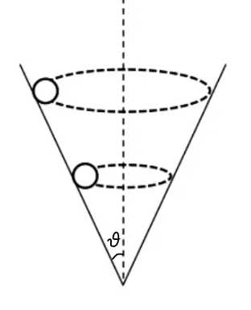
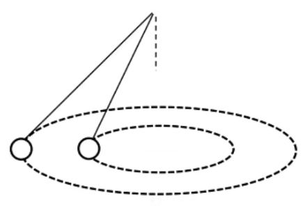

# 圆周运动

## 圆周运动基础

### 圆周运动相关定义

#### 物理量

1. 线速度：单位时间通过的弧长，$v(\mathrm{m/s})$；
2. 角速度：单位时间通过的角度，$\omega(\mathrm{rad/s})$；
3. 周期：完成一次的时间，$T(\mathrm{s})$；
4. 频率：单位时间完成的次数：$f(\mathrm{s^{-1},Hz})$；
5. 转速：单位时间完成的圈数：$n(\mathrm{r/s})$。

#### 匀速圆周运动

$$
T=\dfrac{2\pi r}{v}=\dfrac{2\pi}{\omega}
$$

推导出来：

$$
v=\omega r
$$

即速度（$v$）在（$=$）绕（$r$）弯（$\omega$）。

$$
f=n=\dfrac{1}{T}
$$

#### 向心力和向心加速度

向心力：

$$
F_c=\dfrac{mv^2}{r}=m\omega^2r=mv\omega
$$

向心加速度：

$$
a_c=\dfrac{v^2}{r}=\omega^2r=v\omega
$$

### 圆周运动解题思路

#### 列表法

对于匀速圆周运动多个圈的题目，列表：

$$
\begin{array}{|c|l|l|l}\hline
&P_c&Q_c&\dots\\\hline
\bm r\\\hline
\bm \omega\\\hline
\bm v\\\hline
\bm a\\\hline
\end{array}
$$

上面对应的就是几个圆周，从上到下填表。

填表的时候常用公式 $a=v\omega$。

如果是求比例，那么设 $\omega$ 相同的点为单位 $1$。

#### 关联速度

现象：传送带上，各处线速度相同；同一物体，各处角速度相同。

现象：沿绳沿杆速度大小相同，力相同，垂直于接触面方向速度相同。

解决方法：

1. 判断合运动方向；
2. 分解合运动到沿绳沿杆方向；
3. 根据速度分量列等式。

#### 牛二思路

切线方向，列平衡式子，注意这个式子一定要列，下面可能会用到；

向心方向，列 $F_合=F_向$（匀速），其中合外力通过受力分析找，$r$ 要找。

常有模型：圆锥摆。

## 匀速圆周运动模型

### 圆锥摆模型

#### 基础圆锥摆模型

指向圆心和竖直方向建系，列出两个方向上的牛二方程：

$$
\begin{aligned}
F_合=T\sin\theta\\
T\cos\theta=mg
\end{aligned}
$$

其中 $\theta$ 为绳子和竖直方向的夹角。

列出合外力等于向心力：

$$
F_合=m\omega^2r
$$

计算得到：

$$
\omega=\sqrt{\dfrac{g}{L\cos\theta}}
$$

#### 同角不同面模型

{ align=right width="30%" }

物体和法线的夹角相同，但是不同水平面，如右图所示。

假设接触面光滑：

$$
\begin{aligned}
F_合=F_N\cos\theta\\
F_N\sin\theta=mg
\end{aligned}
$$

结论是向心加速度相同：

$$
a=\dfrac{F_合}{m}=g\cot\theta
$$

同角不同面，最常见的是漏斗里面小球转圈圈。

- 根据 $F_向=ma$，因此质量越大，向心力越大。

- 根据 $\displaystyle F_N=\dfrac{mg}{\sin\theta}$，因此质量越大，对斜面压力越大。

- 根据 $a=\omega^2r$，因此半径越大，角速度越小。

- 根据 $\displaystyle a=\dfrac{v^2}{r}$，因此半径越大，线速度越大。

#### 同面不同角模型

{ align=right width="35%" }

物体在同一平面，与法线的夹角不同，如右图。

根据圆锥摆的公式，角速度 $\omega$ 对各物体相同：

$$
\omega=\sqrt{\dfrac{g}{L\cos\theta}}=\sqrt{\dfrac{g}{H}}
$$

- 根据 $a=\omega^2r$，因此半径越大，加速度越大。

- 根据 $v=r\omega$，因此半径越大，线速度越大。

反向推论：角速度相同，则物体也会在同一平面上。

#### 圆锥摆求夹角

在一根长度为 $l$ 的绳子下端悬挂一个质量为 $M$ 的小球，以匀角速度 $\omega$ 旋转。

求：绳子与铅锤方向所成的角 $\theta$。

易得：

$$
\begin{aligned}
T\cos\theta&=Mg\\
T\sin\theta&=M\omega^2r=M\omega^2l\sin\theta
\end{aligned}
$$

注意到一个可行解是 $\sin\theta=0$，即 $\theta=0$（因为 $\theta=\pi$ 是不稳定状态）。

否则，

$$
T=M\omega^2l
$$

即，

$$
Mg=T\cos\theta=M\omega^2l\cos\theta
$$

$$
\cos\theta=\dfrac{g}{\omega^2l},\;\theta=\arccos\left(\dfrac{g}{\omega^2l}\right)
$$

结论：

$$
\theta=\left\{\begin{aligned}
&0&,\omega\le\sqrt{\dfrac{g}{l}}\\
&\arccos\left(\dfrac{g}{\omega^2l}\right)&,\omega>\sqrt{\dfrac{g}{l}}\\
\end{aligned}\right.
$$

#### 圆锥摆临界问题

先求出临界状态下的角速度。

根据临界角速度和实际角速度，做出受力分析。

### 圆盘模型

#### 单物体圆盘模型

一个水平转动的圆盘上有一个物体。

此时，摩擦力提供向心力，物体与圆盘之间的摩擦因数为 $\mu$。

当最大静摩擦力（大小视为滑动摩擦力）等于向心力时恰好不滑动。

$$
\mu mg=m\omega^2r
$$

得出：

$$
\omega=\sqrt{\dfrac{\mu g}{r}}
$$

#### 多物体圆盘模型

一个水平转动的圆盘上两个物体，考虑谁会先开始滑动。

物体 $m_1,m_2,\mu_1,\mu_2$，可以计算出每个物体的临界角速度。

$$
\begin{aligned}
\mu_1m_1g&=m_1\omega_1^2r_1\\
\mu_2m_2g&=m_2\omega_2^2r_2\\
\end{aligned}
$$

得出：

$$
\begin{aligned}
\omega_1&=\sqrt{\mu_1g\over r_1}\\
\omega_2&=\sqrt{\mu_2g\over r_2}
\end{aligned}
$$

即 $\displaystyle{\mu\over r}$ 小的先发生滑动，大的后发生滑动。

如果摩擦系数相同，则离圆心越远，越先开始滑动。

#### 同侧连接体圆盘模型

两物体质量分别为 $m_1,m_2$，用轻绳连接。

两物体与圆盘摩擦系数为 $\mu_1,\mu_2$，且距圆心分别为 $r_1,r_2(r_1<r_2)$ 同侧。

问题一：转速多大绳子出现拉力。

根据单物体圆盘模型，两物体独立的临界角速度分别为：

$$
\omega_1=\sqrt{\mu_1g\over r_1}
$$

$$
\omega_2=\sqrt{\dfrac{\mu_2g}{r_2}}
$$

如果 $\omega_1<\omega_2$，则绳子会松弛，我们不考虑这个情况。

因此，当转速大于等于 $\omega_2$ 的时候，绳子会出现拉力。

问题二：转速多大物体一起运动。

对物体整体法分析：

$$
\mu_1m_1g+\mu_2m_2g=m_1\omega^2r_1+m_2\omega^2r_2
$$

得出：

$$
\omega=\sqrt{\dfrac{(\mu_1m_1+\mu_2m_2)g}{m_1r_1+m_2r_2}}
$$

假设物体质量相等，即 $m_1=m_2$，则有：

$$
\omega=\sqrt{(\mu_1+\mu_2)g\over r_1+r_2}
$$

假设物体摩擦因数相等，即 $\mu_1=\mu_2$，则有：

$$
\omega=\sqrt{\dfrac{\mu g(m_1+m_2)}{m_1r_1+m_2r_2}}
$$

假设 $m_1=m_2$ 且 $\mu_1=\mu_2$，则有：

$$
\omega=\sqrt{\dfrac{2\mu g}{r_1+r_2}}
$$

注意到不可能有 $r_1=r_2$，因为是两个物体。

#### 异侧连接体圆盘模型

两物体异侧：

$$
\begin{aligned}
\omega_1&=\sqrt{\mu g\over r_1}\\
\omega_2&=\sqrt{\mu g\over r_1-r_2}\\
\omega_3&=\sqrt{2\mu g\over r_1-r_2}
\end{aligned}
$$

## 非匀速圆周运动模型

### 模型：非匀速绳、杆

#### 基础形态

区别：绳子无法提供对物体向上的力。

列式：

$$
\begin{aligned}
G+T&=F_c\\
mg+T&=m\frac{v^2}{r}
\end{aligned}
$$

#### 绳模型

考虑最高点最小速度、恰好经过顶点、绳子无拉力：

物理量的表示，即：$v$ 最小，$F_c$ 最小，$T$ 为 $0$。

故：

$$
\begin{aligned}
mg&=m\frac{v^2}{r}\\
v&=\sqrt{gr}
\end{aligned}
$$

#### 杆模型

杆子可以提供最大为 $-mg$ 的力（表示为顶着物体）。

即，有最高点最小速度 $v=0$，杆子不受力 $v=\sqrt{gr}$。

最高点时，杆子的力可以向上、向下，因此记临界速度 $v_0=\sqrt{gr}$：

若 $v>v_0$ 则杆子对物体的力向下，若 $v<v_0$ 杆子对物体的力向上。

然后写牛二式子 $mg\pm T=m\dfrac{v^2}{r}$。

#### 动能定理

重力做功等于动能变化量，最高点速度可以求出来。

那么就可以求出来最低点的速度以及绳子的拉力。

#### 圆环模型

小球在圆环里面转圈，双环相当于杆，单环相当于绳。

注意到双环中，只可能两侧中的一侧受力，写牛二即可求 $T$。

### 绳子碰钉模型

#### 最简形式

一个绳子拴着小球，摆下来遇到钉子然后绕着更小的半径运动。

瞬间小球速度不变，忽略能量损耗，小球线速度 $v$ 始终不变。

- 根据 $\displaystyle F=\dfrac{mv^2}{r}$，绳子拉力增大；

- 根据 $\displaystyle\omega=\dfrac{v}{r}$，角速度增大；

- 根据 $a=v\omega$，加速度增大。

- 根据 $\displaystyle T=\dfrac{2\pi}{\omega}$，周期减小。
