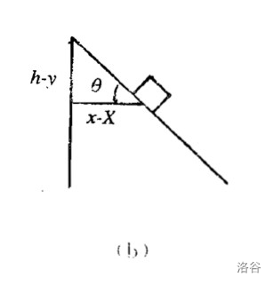

# 牛顿动力学

这一部分的根本是受力分析，因为这里面绝大部分的力都是不平衡的。

其实在后面几乎所有的力学都需要受力分析，虽然可能简单题不需要画出来也能想清楚。

受力分析的一个常用方法就是整体法，整体法一定是能用就用的。

## 牛顿运动定律

### 牛顿第一定律

牛顿第一定律表述为：不受外力作用的物体必将作匀速直线运动或保持静止。

这条定律就其叙述的内容本身提出了力和惯性两个重要概念：牛顿把改变物体运动状态的因素归于物体受到了力，而运动物体自身又具有保持其匀速直线运动或保持静止的属性，并称此属性为惯性。

根据运动的相对性，对于不同的参照系，物体往往有不同的加速度，在一个参照系中作匀速运动的物体，在另一个参照系中可能有加速度。

牛顿第一定律断言存在着一个参照系，在此参照系中，物体的运动遵循牛顿第一定律。这个参照系称为惯性系，因此，第一定律又称为惯性定律。

运动的相对性告诉我们，对于任何两个相互作匀速运动的参照系，同一质点具有相同的加速度。因此，只要存在一个惯性系，那么相对于此惯性系作匀速运动的所有参照系都是惯性系。

总结：

- 假若施加于某物体的外力为零，则该物体的运动速度不变。
- 静止的物体会保持静止状态，除非有外力施加于这物体。
- 运动中的物体不会改变其运动速度，除非有外力施加于这物体。

注意到速度是向量，物体运动速度的大小与方向都不会改变。

牛顿第一定律的意义就在于定义了惯性参照系，并断言惯性系一定存在。下一步需要给出物体在受到某种影响时，它的运动状态是如何变化的规则。这个规则就是牛顿第二定律。

### 牛顿第三定律

牛顿第三定律表述为：两物体间的相互作用力总是大小相等、方向相反并沿着同一直线。

这条定律指明，作用力和反作用力必定同时存在、同时消失，并且作用在两个不同的物体上，不存在相互抵消的问题。

作用力与反作用力这基本物理概念，时常会被许多人一知半解地应用。

在这里，必须清楚明了一个重点：

这反作用力是施加于另外一个物体，而不是施加于感受到作用力的物体。

经典错误举例：

一、一本书稳定地置放在桌子上，书的重量 $G$ 与桌子施加于书本的力 $N$ 是一对反作用力。

重力本质是由万有引力（近似）提供的，因此 $G$ 的反作用力应该是书本对地球的吸引。桌子对书的力 $N$ 的反作用力是，书对桌子的压力 $N$。

二、离心力是向心力的反作用力。

向心力是效果力，而离心力是一种伪力，二者无关联。

PS：此处伪力，只有从非惯性参考系，才会测量出离心力的存在。

### 牛顿第二定律

在惯性参照系中，外力的作用改变物体的动量，并满足

$$
\bm{F}=\lim_{\Delta t\to0}\dfrac{\Delta\bm{p}}{\Delta t}
$$

在质量不随时间变化的情况下，记为

$$
\bm{F}=m\bm{a}
$$

牛顿第二定律指出了力所引起的物体运动的定量变化：动量的变化率正比于力。

在这条定律中，把受到相同大小作用力的推动下，轻物体容易起动，重物体不易起动的事实，引进了质量的概念。

质量被定义为惯性的定量量度。

惯性不仅在第一定律意义下表现为不受力时所具有的保持原来运动状态的属性，而且还在第二定律意义下表现为在受力情况下具有的改变原来运动状态的抗拒能力。

在这条定律的数学表达式中，力失 $\bm F$ 是物体所受的合外力；并认定，质量具有不变性，是一个常数；力与加速度之间的关系是瞬时关系，即某一时刻的力决定了这一时刻的加速度。

多物体牛二：在 $\bm{F}=m\bm{a}$ 中，左侧 $\bm{F}$ 表示合外力，右侧等号应为 $m\bm{a}$ 的矢量和即可，证明略。

---

微分形式，

经 @lanjiarui 补充：

$$
v(t)
=\lim_{\Delta{t}\to0}\dfrac{x(t+\Delta{t})-x(t)}{\Delta{t}}
=\dfrac{\mathrm{d}x}{\mathrm{d}t}
\\[1.2em]
a(t)
=\lim_{\Delta{t}\to0}\dfrac{v(t+\Delta{t})-v(t)}{\Delta{t}}
=\dfrac{\mathrm{d}v}{\mathrm{d}t}
=\dfrac{\mathrm{d^2}x}{\mathrm{d}t^{2}}
$$

经 @pjykk 补充：

$$
a=\dfrac{\mathrm{d}v}{\mathrm{d}t}=\dfrac{\mathrm{d}v}{\mathrm{d}x}\cdot\dfrac{\mathrm{d}x}{\mathrm{d}t}=v\dfrac{\mathrm{d}v}{\mathrm{d}x}
$$

### 加速参考系和惯性力

牛顿运动定律只适用于惯性系，然而，在某些场合需要在非惯性系中讨论问题。

为此，引进惯性力的概念；以下是平动加速参考系。

设参考系 $S'$ 相对于惯性参考系 $S$ 以不变的加速度 $\bm{a}_0$ 运动。

质量为 $m$ 的质点相对于参考系 $S'$、$S$ 的加速度分别为 $\bm a'$、$\bm a$，他们满足关系：

$$
\bm{a}=\bm{a}'+\bm{a}_0
$$

在惯性系 $S$，牛顿第二定律成立，

$$
\bm{F}=m\bm{a}=m\bm{a}'+m\bm{a}_0
$$

在非惯性系 $S'$，有动力学方程，

$$
m\bm{a}'=\bm{F}-m\bm{a}_0=\bm{F}+\bm{F}_{惯}
$$

其中 $\bm{F}_{惯}=-m\bm{a}_0$，称为惯性力，可以理解为受到与加速度方向相反的大小为 $ma_0$ 的力。

这个方程说明，如果把等式右边看成是质点在平动加速参照系 $S'$ 中受到的合力，那么在 $S'$ 系中仍能在形式上运用牛顿第二定律求解动力学问题。等式右边第一项 $F$ 为质点所受真实力的合力，第二项则是惯性力。

应该强调的是，惯性力并不是其它物体施于质点的真实的力，只是为了能在非惯性系中沿用牛顿第二定律的形式来处理问题而人为引入的虚拟力，也称虚拟力。

在加速平动系中所感受的虚拟力是均匀的，而且与重力一样与质量成正比。它起源于参照系的加速运动，而不是物体间的相互作用。

补充：在惯性系到非惯性系的转换时，可以理解为反叠一个加速度（高中大部分情况都是可以的），因此我们不需要考虑在惯性系下复杂的受力情况，只需要在反叠惯性力的情况下，直接按照假设存在于惯性系中分析即可。

经典例题：光滑地面放置光滑直角劈放置光滑物块，物块自由下滑。容易想到直角劈是加速运动的，直角劈以一个不平行于斜面的加速度加速下滑，此时可以换直角劈为参考系，反叠一个斜面的加速度的惯性力即可。

推荐补充阅读：科里奥利力（可以理解为北半球物体受到向右的力，南半球相反）。

???+ note "补充：非惯性系与惯性系"
    在惯性系中，物体满足牛顿第一定律，即在不受力的情况下，速度的大小与方向不变。

    非惯性系与惯性系可以通过惯性力的有无来区分，简单来说：非惯性系的效应导致观察者必须在计算中引入惯性力。

    惯性力存在意味着此时的物理定律并非最简，所以依据狭义相对论，存在惯性力的参考系不是惯性系：在非惯性系中的运动方程与在惯性系中的运动方程相差一项称为惯性力。这使我们能用实验觉察出一个参考系（例如地球的自转）之非惯性系性质。

    非惯性系中的物体会受到惯性力。它是来源于参考系自己加速度的力，而非作用在物体的实际相互作用。

    牛顿还考虑直线加速的一种情况：对于一组物体，无论它们相互之间如何运动，如果它们受到平行方向上的相同加速力，它们会继续保持相对运动状态，就像没有受到这种力一样。

    这个原理推广了惯性系中的情况。比如，一个关在正自由落体的电梯中的观察者，会发现只要不知道电梯外的情况，自己就是个有效的惯性系，即使此时他正受引力作用加速下落（注：当然此时的 $g=g_0-a$，其中 $g_0$ 表示原来的重力加速度，$a$ 表示加速下落的加速度）。

    所以，严格来说，惯性系是一种相对的概念。依据这一点，人们就可以定义彼此静止或匀速平移的惯性系的集合，而单个惯性系是这个集合的一个元素。在使用这种理念的时候，参考系中观测到的一切物体会具有来自参考系的具有基线的共同加速度。例如，还是在电梯的例子中，所有物体都具有相同的引力加速度，而电梯自己也具有这种加速度。

### 补充：质量的定义

惯性质量和引力质量是等价的，这条原理在广义相对论中称为等效原理。

**惯性质量**：一个物体的惯性质量决定它受力时的加速度。根据牛顿运动第二定律，假设一个物体受到一个力 $F$，其加速度为 $a$，则其惯性质量。

$$
m=\dfrac{F}{a}
$$

**主动引力质量和被动引力质量**：根据万有引力定律，

$$
F=G\dfrac{M_1M_2}{r^2}
$$

其中，$G$ 表示万有引力常数，这个质量常称为引力质量。

## 牛顿动力学模型

### 斜面模型

#### 斜面模型基础

斜面模型「物体是否会下滑」，设斜面与水平面夹角为 $\theta$：

受力分析，得 $G_x=mg\sin\theta$，$f=\mu mg\cos\theta$。

- 若物体下滑：$G_x>f \Rightarrow G_x/f>1 \Rightarrow \tan\theta/\mu>1 \Rightarrow \tan\theta>\mu$。
- 同理，若物体静止不动，$G_x\le f \Rightarrow \tan\theta\le\mu$。

即，若 $\tan\theta>\mu$，物体会下滑。

同时也可以根据此探究动摩擦因数 $\mu=\arctan\theta$。

#### 约束方程和直角劈模型

注意物体的位置应该在惯性系中表示，否则应用牛顿定律会产生麻烦。

根据已知常量列出方程，例如绳长不变，绳子切面速度相同，以及对应的加速度关系。

典例是直角劈模型，有 $\theta$ 角度的直角劈，一木块放在上面，则：

其中 $V$ 和 $A$ 为劈的速度和加速度，$x$ 为木块相对参考系的水平位移，$X$ 为木块相对参考系的水平位移，$(h-y)$ 为木块滑下的竖直高度：

$$
\begin{aligned}
(x-X)=(h-y)\cot\theta\\
v_x-V=-v_y\cot\theta\\
a_x-A=-a_y\cot\theta
\end{aligned}
$$

上式从上到下，实为对方程两边做一次时间变化率，常数项忽略，常数系数不变。

注意：约束方程与作用力无关，各接触面有无摩擦不影响约束方程。

### 多物体模型

#### 判断两物体是否加速度相同

1. 看题目是否有「一起运动」的字眼（一般不会给）；
2. 暴力方法：分讨各个物体的加速度关系，排除掉不可能的。
3. 经验：沿绳方向速度、受力大小一定相等。

#### 多物体弹簧突变

因为弹簧的弹力无法突变，因此我们：

1. 受力分析初状态，得出弹簧弹力；
2. 把弹簧弹力当做外力，重新受力分析。

### 连接体模型

#### 狭义连接体模型

整体法可求得加速度。

隔离法可求得压力／绳子拉力，也可以整体一部分物体。

如果绳子是弯的，那么直接两次隔离把力约掉算加速度。

可以得出，绳子拉力与斜面夹角、摩擦因数均无关：

$$
T=\dfrac{m_1}{m_1+m_2}F
$$

这个公式可以成为连接体的质量分配原则，其中 $1$ 是绳子没有直接拉着的那个物体。

推广：如果两个物体两侧分别拉着（$F_1$ 拉质量为 $m_1$ 的物体，$F_2$ 对于 $m_2$）：

$$
T=\dfrac{F_1m_2+F_2m_1}{m_1+m_2}
$$

即总是一个力乘上没有直接连接的物体。

#### 叠加体相对静止模型

广义连接体，指不用绳子连接的连接体，常见的有用静摩擦力、刚体弹力提供的。

叠加体相对静止，可以看为是由摩擦力提供拉力的连接体模型，因此下面的步骤也非常相似。

整体法可求得加速度。

隔离法可求得摩擦力，也可以整体一部分物体。

可以得出，摩擦力与斜面夹角无关，与摩擦因数有关：

$$
f=\dfrac{m_1}{m_1+m_2}F-\mu mg\cos\theta
$$

若斜面是水平面（$\theta=0$），那么 $\cos\theta=1$：

$$
f=\dfrac{m_1}{m_1+m_2}F-\mu mg
$$

同样也类似质量分配原则，其中 $1$ 是力没有直接作用在的那个物体。

#### 叠加体相对滑动模型

1. 找到不受外力的物体，即可能会发生相对滑动的物体，
2. 隔离法，求出这个物体的最大加速度，
3. 整体法，求出最大的外力大小。

形式一：拉着下面的 $M$ 走，其上表面 $\mu_1$、下表面 $\mu_2$：

$$
F=(m+M)(\mu_1+\mu_2+\tan\theta)g\cdot\cos\theta
$$

若斜面是水平面（$\theta=0$），那么 $\cos\theta=1,\tan\theta=0$：

$$
F=(m+M)(\mu_1+\mu_2)g
$$

形式二：拉着上面的 $m$ 走，其下 $M$ 上表面 $\mu_1$、下表面 $\mu_2$：

$$
F=\dfrac{m}{M}(m+M)(\mu_1-\mu_2)g\cdot\cos\theta
$$

若斜面是水平面（$\theta=0$），那么 $\cos\theta=1$：

$$
F=\dfrac{m}{M}(m+M)(\mu_1-\mu_2)g
$$

注意此形式下，需要上物体能拉动下物体，拉不动的话就更简单了。

### 等时圆模型

#### 等时圆模型概述

质点自半径为 $R$ 的空心球（对于平面而言是圆环）的最高点由静止开始无摩擦地沿任一弦下滑至球面（或圆环），所需时间相等，且等于

$$
\sqrt{\dfrac{4R}{g}}
$$

证明：

设下滑的弦与法线的夹角为 $\beta$，则弦长：

$$
l=2R\cos\beta
$$

沿弦方向加速度为：

$$
a=g\cos\beta
$$

列运动学方程：

$$
\begin{aligned}
l&=\dfrac{1}{2}at^2\\
2R\cos\beta&=\dfrac{1}{2}(g\cos\beta)t^2
\end{aligned}
$$

易得 $t$ 与 $\beta$ 无关，且：

$$
t=\sqrt{\dfrac{4R}{g}}
$$

经典例题：

一小球从角度为 $\alpha$ 的斜面上某一点的上方 $l$ 处沿某一直线无摩擦的滑下，问落到斜面上的最短时间。

由上面的结论，最佳下落线与法线的夹角 $\theta=\alpha/2$。

易知，该圆的直径（$Q$ 为圆与斜面的切点，$H$ 为最高点到斜面的垂足）：

$$
2R=\dfrac{OQ}{\cos\theta}=\dfrac{OH}{\cos^2\theta}=\dfrac{l\cos\alpha}{\cos^2(\alpha/2)}
$$

则：

$$
R=\dfrac{l\cos\alpha}{1+\cos\alpha}
$$

则最短时间：

$$
t=\sqrt{\dfrac{4R}{g}}=2\sqrt{\dfrac{l\cos\alpha}{g(1+\cos\alpha)}}
$$

#### 等时圆的构造

咕咕咕。

## 例题

PS：前两道例题是学会写步骤以前做的，所以步骤很混乱（

### 例题１

质量为 $2\text{kg}$ 的物体沿光滑斜面下滑，斜面与水平面的夹角为 $37^\circ$，求木块的加速度。

列式：

$$
\begin{cases}
F_r&=ma\\
F_r&=G\sin37^\circ\\
G&=mg\\
m&=2\text{kg}
\end{cases}
$$

解得：

$$
\begin{cases}
m&=2&\text{kg}\\
G&=20&\text{N}\\
F_r&=12&\text{N}\\
a&=6&\text{m/s}^2\\
\end{cases}
$$

所以，加速度为 $6\text{m/s}^2$，方向沿斜面向下。

### 例题２

质量为 $2\text{kg}$ 的物体沿斜面下滑，斜面的摩擦因数为 $0.2$，斜面与水平面的夹角为 $37^\circ$，求木块的加速度。

列式：

$$
\begin{cases}
F_r&=ma\\
F_r&=G\sin37^\circ-f\\
f&=\mu N\\
N&=G\cos37^\circ\\
G&=mg\\
m&=2\text{kg}
\end{cases}
$$

解得：

$$
\begin{cases}
m&=2&\text{kg}\\
G&=20&\text{N}\\
N&=16&\text{N}\\
f&=3.2&\text{N}\\
F_r&=8.8&\text{N}\\
a&=4.4&\text{m/s}^2\\
\end{cases}
$$

所以，加速度为 $4.4\text{m/s}^2$，方向沿斜面向下。

### 例题３

质量为 $2\text{kg}$ 的物体静止于水平面的 $A$ 处，$AB$ 间距 $L=20\text{m}$，如图：

$$
\begin{matrix}
\underline{\kern{1em}\Box\kern{7em}\Box\kern{1em}}\\[-0.8em]
\cdot\kern{7.5em}\cdot\\[-0.4em]
{\small{A}}\kern{7em}{\small{B}}
\end{matrix}
$$

现用大小为 $30\text{N}$ 的力，沿水平方向拉物体，$2\text{s}$ 后到达 $B$ 处。

求物体与地面的摩擦因数 $\mu$。  

解：

对物体 $A$ 受力分析：

$$
\begin{cases}
F_r&=F-f\\
N&=G
\end{cases}
$$

展开：

$$
\begin{cases}
ma&=F-\mu N\\
N&=mg
\end{cases}
$$

得到方程组：

$$
\begin{cases}
x&=\dfrac{1}{2}at^2\\
ma&=F-\mu mg
\end{cases}
$$

代数，得：

$$
\begin{cases}
20\text{m}&=\dfrac{1}{2}a\cdot(2\text{s})^2\\
2\text{kg}\cdot a&=30\text{N}-\mu\cdot20\text{N}
\end{cases}
$$

解得：

$$
\begin{cases}
a&=10\text{m/s}^2\\
\mu&=0.5
\end{cases}
$$

即 $\mu=0.5$。
