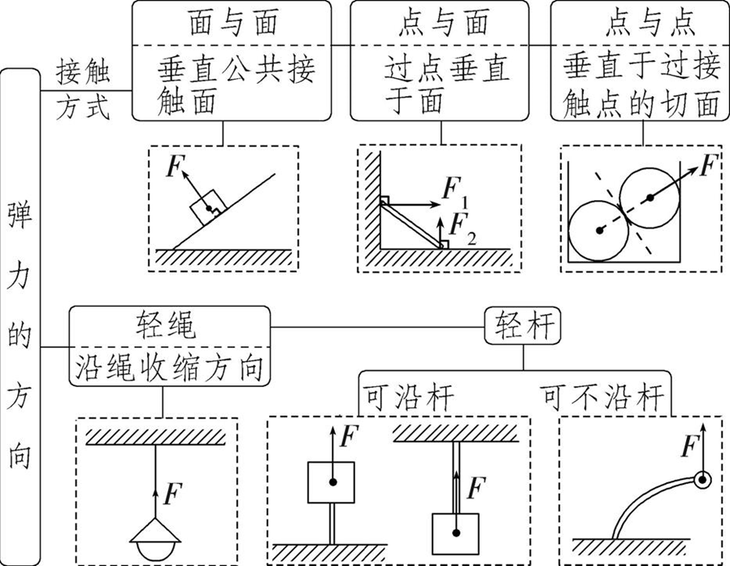
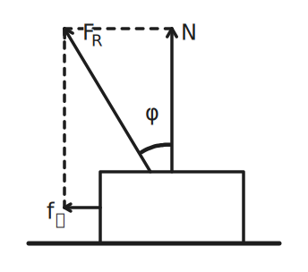

# 基本性质力

## 基本概念

### 力

力：力是物体间的相互作用。

力是改变物体运动状态或改变物体形状的原因。

力有大小、方向、作用点三个要素。

当我们把物体理想化为质点或刚体时，即不计物体的大小或不计物体形状变化时：

力是改变物体运动状态的原因。

力对于刚体具有可传递特性，即可以沿作用线滑移。

可以沿作用线方向改变作用点，而不改变该力对刚体的作用效果。

所以作用在刚体上的力，三个要素是：大小、方向和作用线。

如果物体平衡，即物体静止或保持运动状态不变，作用于物体的各力相互抵消。

受力分析的顺序：先主动力（外力、重力）、后被动力（弹力、摩擦力）。

### 拉密定理

拉密定理指出，如果三个共点力的合力为零，那么任一力与其相对角的正弦的比值均相等：

$$
\dfrac{A}{\sin\alpha}=\dfrac{B}{\sin\beta}=\dfrac{C}{\sin\gamma}
$$

其中 $A$、$B$、$C$ 为作用在一点（假设为 $P$）力的大小。

而 $\alpha$、$\beta$、$\gamma$ 则为在 $A$、$B$、$C$ 力相对角的角度。

证明：

把三个力（向量）根据向量的三角形法则联结成为一个封闭的三角形。

根据正弦定理，

$$
\dfrac{A}{\sin(\pi-\alpha)}=\dfrac{B}{\sin(\pi-\beta)}=\dfrac{C}{\sin(\pi-\gamma)}
$$

根据正弦函数的诱导公式，

$$
\dfrac{A}{\sin\alpha}=\dfrac{B}{\sin\beta}=\dfrac{C}{\sin\gamma}
$$

### 力的合成与分解

力的合成：

- 矢量叠加，无先后顺序。

- 合成范围问题，根据三角不等式：

    $$
    ||\bm F_1|-|\bm F_2||\le|\bm F_1+\bm F_2|\le|\bm F_1|+|\bm F_2|
    $$

- 分力与合力为等价关系，二者不共存。

力的分解：

- 根据水平方向分解：最简单直观。

- 根据斜面方向分解：通常会把更多的力集中在坐标轴上。

- 根据力的作用分解：通常沿绳、杆，利用两端力的关系解决。

注意活杆、死结的问题。

## 力的分类

注意：效果力由性质力充当，例如拉力支持力向心力。

### 重力

基本概念：

- 来源：天体表面或附近。

- 本质：在地球上，万有运力提供重力和向心力的效果，即：

    $$
    \bm F_万=\bm G+\bm F_向
    $$

    其中向心力方向为垂直于地轴，因此重力方向不总是指向地心。

三要素：

1. 大小：重力与重力成正比。

2. 方向：重力竖直向下。

3. 作用点：称为重心。

重心：

- 一个物体的重力是在地球表面附近地球对该物体引力的总和，其等效的作用点称为重心。

- 注意：而重心与重力有关，如果没有重力就没有重心。重心不一定等于质心，在匀强重力场中质心等于重心。

- 经典反例：地球上一根非常非常长的杆子，质心为几何重心，而重心因为重力加速度随高度变化，要偏下一点。

求重心的方法：

1. 如果物体具有对称性，重心必在对称轴线上。

2. 如果质量作平面分布，实验上可以用悬挂方法求，即选平面物体上两点，分别悬挂起来，过悬挂点的两条竖直线所交之点即为重心（如果两线平行，可重新再选一点悬挂起来）。

3. 分割法：如果物体由几个部分组成，每部分重心易求，再逐次选择两部分作为两质点求重心，直至求得整个物体的重心。

4. 负质量法：如果物体经补充一部分后变成重心易求的新的物体，那么原物体重心可以由补充后的新物体与具有负质量的补充部分求得。

5. 质心的定义表达式：

    $$
    R_c=\dfrac{m_1\bm r_1+m_2\bm r_2+\dots}{m_1+m_2+\dots}=\dfrac{\sum m_i\bm r_i}{\sum m_i}=\dfrac{1}{M}\sum m_i\bm r_i
    $$

    这是在某个确定的坐标下写出的，其中 $r_i$ 为第 $i$ 个质点在该坐标系下的位置，$m_i$ 为第 $i$ 个质点的质量，$M$ 为总质量。

    写成直角坐标中的分量形式：

    $$
    \begin{aligned}
    X_c&=\dfrac{1}{M}\sum m_ix_i\\
    Y_c&=\dfrac{1}{M}\sum m_iy_i\\
    Z_c&=\dfrac{1}{M}\sum m_iz_i
    \end{aligned}
    $$

### 弹力

基本概念：

- 来源：接触挤压。

- 分类：弹性弹力、刚体弹力。

弹性弹力：

- 弹力必须沿轴向，非自由端不可突变。

- 公式：$\bm F=-k\bm x$，其中 $k$ 称为劲度系数，单位 $\pu{N/m}$。

刚体弹力：

- 方向：与绳杆平行，与接触面垂直。

- 轻绳模型：绳两端力的大小相等、方向相反。

- 注意：刚体弹力做功，机械能不一定守恒。

弹力存在判定：

1. 假设移除法。

2. 受力分析、动力学分析法。

{ width="80%" }

### 摩擦力

两固体接触面有相对滑动或有相对滑动趋势时，所产生的阻碍相对滑动（滑动摩擦力）或相对滑动趋势（静摩擦）的力。

滑动摩擦力：

- 主动力，可以写成一个近似的表达式：

    $$
    f_k=\mu_kN
    $$

    其中 $N$ 为两个相互接触表面的法向力（即正压力），$\mu_k$ 为滑动摩擦系数。

- 长毛法：

    假设物体长毛了，然后经过摩擦，毛的偏向就是所受摩擦力方向。

静摩擦力：

- 被动力，有近似上限：

    $$
    f_s\le\mu_sN
    $$

    一般静摩擦系数 $\mu_s$ 稍大于滑动摩擦系数 $\mu_k$。

    如果没有特殊说明，可以认为 $\mu_s=\mu_k$，统称为摩擦系数 $\mu$。

- 静摩擦力常作为一种通过接触面作用的未知的切向力，它的大小取决于周围其它物体施加的作用力和该物体的运动情况。只有在临界状态，即该物体在接触面处将产生相对滑动、又未产生滑动的临界运动状态时，静摩擦力等于最大静摩擦，$f_s=\mu_sN$。

滚动摩擦力：

- 通常远小于同条件下的滑动摩擦力。

- 注意滚动的时候，如果不是刚体可能会有能量损失。

了处理问题方便，引进摩擦角的概念：

{ align=right width="35%" }

- 在滑动摩擦下，称 $\varphi=\arctan(f_k/N)$ 为滑动摩擦角，因此 $\mu=\tan\varphi$。

- 我们将滑动摩擦力和支持力合并为一个效果力，称为全反力 $F_R$。全反力和支持力的夹角即为摩擦角 $\varphi$，只要物体发生滑动摩擦力，无论支持力是多少，摩擦角都是不变的。

- 一物置于倾角为 $\theta$ 的粗糙斜面上，$\theta<\varphi$ 则物体不会自行滑下，这一现象称为自锁。

另外，在静摩擦下，称 $\varphi=\arctan(f_{sm}/N)$ 为静摩擦角，$f_{sm}$ 为最大静摩擦力。

## 静力平衡

### 质点平衡

在共点力系作用下，物体平衡条件为合外力等于零，可用两种方式表示。

1. 直角坐标系下的分量表示：

    $$
    \begin{aligned}
    \bm F_1+\bm F_2+\dots=\sum \bm F_i=0\\
    \sum F_{ix}=0,\,\sum F_{iy}=0,\,\sum F_{iz}=0
    \end{aligned}
    $$

2. 矢量表示法：逐个力矢量相加，各矢量首尾相接，最后必形成封闭折线。

三力作用下的平衡物体，这三力平衡力系有两个特性：三力必共面、共点。三个力矢量构成封闭三角形。

### 动态平衡

定义力的变化：

- 恒力：大小方向都不变的力。

- 定力：大小改变方向不变的力。

- 变力：大小方向都改变的力。

转矢量三角形法：

1. 条件：恒力、定力、变力各一个。

2. 恒力反向，定力平移，变力移动（TC）。

3. 定力反向，恒力平移，变力移动（黄夫人）。

相似三角形法：

1. 反向延长绳子的力。

2. 竖直向下平移另一力。

3. 找相似三角形（延长弹力）。

4. 列相似比。

特殊的：

- 四力平衡：全反力合成。

- 比例问题：拉密定理。

- 直角三角形：画圆。

### 晾衣绳模型

等腰三角形、晾衣杆问题，特征为动滑轮通过刚性轻绳固定，有公式：

$$
F=\dfrac{G}{2\cos\theta}
$$

特征；$F$ 仅与 $\theta$ 有关，上下移动绳子端点力不变，端点水平靠近拉力下降、远离拉力上升。

## 平衡的稳定性

物体的平衡可以分为稳定平衡、不稳定平衡和随遇平衡三种。

### 平动平衡的稳定性

处在平衡状态的质点，当受到扰动时，会稍稍偏离平衡位置。这时会产生合外力。

这个合力为回复力，即此合力有把质点拉回到原平衡位置的倾向，那么称原质点的平衡是稳定平衡；

这个合力为推斥力，即此合力有把质点推离原平衡位置的倾向，那么称原质点的平衡是不稳定平衡；

这个合力为零，既没有回复原位的倾向，又没有推离原位的倾向，那么称原质点的平衡是随遇平衡。

例：位于光滑碗底的质点处于稳定平衡状态；位于光滑圆球顶端的质点处于不稳定平衡状态，位于光滑水平面上的质点处于随遇平衡状态。

### 转动平衡的稳定性

相对固定轴可以转动的物体处于平衡时，受到外界扰动而偏离平衡位置，产生合外力矩。

如果外力矩是一个回复力矩，即此合外力矩有把物体拉回原平衡位置的倾向，那么称原物体的平衡处于稳定的转动平衡状态。

同样，可给出不稳定转动平衡状态和随遇转动平衡状态的定义。

### 无固定转轴物体平衡的稳定性

对于无固定转轴物体，当它受外界扰动而偏离平衡位置时，会产生合外力和合外力矩。

如果合外力是回复力，合外力矩是回复力矩，那么会有被拉回到平衡位置的倾向，则原物体的平衡是稳定平衡。

同样，可给出不稳定平衡和随遇平衡的定义。

而且，物体可以在平动方面处于一种平衡状态，而在转动方面处于另一种平衡状态；对于同一种平动平衡状态，可以在一个方向上处于一种平衡状态，在另一个方向上处于另一种平衡状态。

## 力矩和力偶

### 力矩

在绕轴转动的情况下，力矩是改变物体绕轴转动状态的原因。

力矩等于力在与轴垂直的平面上的分量 $F$ 和 $F$ 的作用线到轴的距离 $d$（力臂）的乘积。

其单位为 $\mathrm{N\cdot m}$（牛顿米，不能记为焦耳）；定义式为：

$$
M=Fd=Fr_\perp=Fr\sin\theta
$$

力矩是一个矢量，它不仅有大小，而且有方向，且满足平行四边形加法法则。

在绕轴的情况下，其方向视其作用使物体从静止发生绕轴转动是逆时针转还是顺时针转，前者取为正，后者取为负（这种判定称右手定则）。

因此在定轴转动情况下，力矩 $M$ 可用代数值表示。

一般情况下，常把力矩写成位矢 $r$ 与力 $F$ 的叉积：

$$
\bm M=\bm r\times\bm F
$$

其大小为：

$$
|\bm M|=|\bm r||\bm F|\sin\theta
$$

因而，如果是定轴转动，只需求代数和。

若有多个力作用于物体，物体受到的总力矩等于各分力产生力矩的矢量和。

### 力偶

力偶是一种只有合力矩，而不产生合力的作用力系统，不会给予刚体质心任何加速度。

作用于刚体时，力偶能够改变其旋转运动，同时保持其平移运动不变。

力偶所产生的力矩称为力偶矩，它与力矩不同，改变力矩的参考点并不影响力偶矩的大小。

一般来说，一对大小相等、方向相反但不共线的力称为力偶：

$$
|F_1|=|F_2|=|F|
$$

对于与力偶所在平面垂直的任一轴，这一对力的力矩的代数和称为力偶矩：

$$
M=F_1|OA|-F_2|OB|=F\cdot|AB|
$$

即力偶矩等于力乘两平行力间距离，它与轴的位置选取无关。

因而在计算力偶矩时，轴的选取有其任意性。

### 定轴平衡

可绕定轴转动的物体平衡的条件是：作用在物体上各力对轴的力矩代数和等于零。

$$
\sum M_i=0
$$

### 一般物体平衡

若物体处于静止状态，它既不发生移动，又不发生转动，其平衡条件应该是合力为零，合力矩为零（刚体平衡条件下，合外力矩为零）。

方程就是上面两个合在一起。
