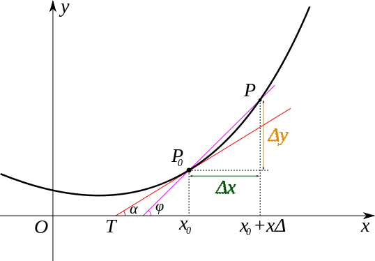

# 导数入门

## 定义和计算

### 导数与可导

如果函数 $f(x)$ 在 $x_{0}$ 的一个**邻域** $(x_{0} - \delta, x_{0} + \delta)$ 有定义，且极限

$$
\lim\limits_{\Delta x \to 0} \dfrac{f(x_{0} + \Delta x) - f(x_{0})}{\Delta x}
$$

存在，那么称这个极限为 $f$ 在 $x_{0}$ 的**导数**，记作 $f'(x_{0})$ 或 $\dfrac{\d f}{\d x}(x_{0})$。此时称 $f$ 在 $x_{0}$ **可导**。

如果函数 $f(x)$ 在 $x_{0}$ 的一个**左邻域** $(x_{0} - \delta, x_{0}]$ 有定义，且极限

$$
\lim\limits_{\Delta x \to 0^{-}} \dfrac{f(x_{0} + \Delta x) - f(x_{0})}{\Delta x}
$$

存在，那么称这个极限为 $f$ 在 $x_{0}$ 的**左导数**，记作 $f'_{-}(x_{0})$。

如果函数 $f(x)$ 在 $x_{0}$ 的一个**右邻域** $[x_{0}, x_{0} + \delta)$ 有定义，且极限

$$
\lim\limits_{\Delta x \to 0^{+}} \dfrac{f(x_{0} + \Delta x) - f(x_{0})}{\Delta x}
$$

存在，那么称这个极限为 $f$ 在 $x_{0}$ 的**右导数**，记作 $f'_{+}(x_{0})$。

函数在 $x_{0}$ 可导的充要条件是它在 $x_{0}$ 的左导数和右导数存在且相等，即 $f$ 在点 $x_{0}$ 连续。
如果函数 $f$ 在区间 $I$ 内的每一点都可导，且在端点单侧可导，那么称 $f$ 在区间 $I$ 上可导。此时 $x \mapsto f'(x), x \in I$ 确定了一个函数，称为 $f$ 的**导函数**，简称**导数**，记作 $f'(x)$ 或 $\dfrac{\d f}{\d x}(x)$。后一种符号由德国数学家莱布尼茨发明。

### 切线的方程

{ width="60%" }

观察曲线 $y = f(x)$ 的图像。连接曲线上的两点 $(x_{0}, f(x_{0}))$ 和 $(x_{0} + \Delta x, f(x_{0} + \Delta x))$，可以得到曲线的一条**割线**，其斜率

$$
k = \dfrac{f(x_{0} + \Delta x) - f(x_{0})}{\Delta x}
$$

由于函数 $f(x)$ 在 $x_{0}$ 连续，当 $\Delta x$ 趋于 $0$ 时，割线趋于某条特定的直线，这条直线称为曲线在点 $(x_{0}, f(x_{0}))$ 的**切线**，其斜率

$$
k = \lim\limits_{\Delta x \to 0} \dfrac{f(x_{0} + \Delta x) - f(x_{0})}{\Delta x}
$$

这就是导数的几何意义。通过点斜式可以写出切线的方程：$y - f(x_{0}) = f'(x_{0}) (x - x_{0})$。

## 导数的计算

### 极限法

极限法求导数，是最简单的方法，高中数学中需要求导的函数基本上都是连续的，我们无需考虑不连续的情况，因此我们设出一个 $\Delta x$ 表示增量，用微分的思想，例如 $f(x)=ax^2$：

$$
\begin{aligned}
 \dfrac{\d f}{\d x}(x)
&= \lim_{\Delta x\to 0} \dfrac{f(x+\Delta x)-f(x)}{\Delta x} \\
&= \lim_{\Delta x\to 0} \dfrac{a(x+\Delta x)^2-ax^2}{\Delta x} \\
&= \lim_{\Delta x\to 0} \dfrac{2a\Delta x+a(\Delta x)^2}{\Delta x} \\
&= \lim_{\Delta x\to 0} (2a+a\Delta x)
\end{aligned}
$$

我们知道，$\Delta x$ 是趋近于 $0$，但是 $0/0$ 没有意义，所以我们继续化简，化简到最后，我们的 $a\Delta x$ 也是趋近于 $0$ 的，因此就可以忽略了，即导函数：

$$
f'(x)=2a
$$

通过一些多项式定理、三角恒等变换等，我们可以轻松得出下面的几个常用导数：

| 函数 | 导函数 | 函数 | 导函数 |
| :- | :- | :- | :- |
| $y=c$ | $y'=0$ | $y=x^n$ | $y'=nx^{n-1}$ |
| $y=a^x$ | $y'=a^x\ln a$ | $y=e^x$ | $y'=e^x$ |
| $y=\log_ax$ | $y'=\dfrac{1}{x\ln a}$ | $y=\ln x$ | $y'=\dfrac{1}{x}$ |
| $y=\sin x$ | $y'=\cos x$ | $y=\cos x$ | $y'=-\sin x$ |
| $y=\tan x$ | $y'=\dfrac{1}{\cos^2x}$ | $y=\cot x$ | $y'=-\dfrac{1}{\sin^2x}$ |

### 四则运算

导数的加减法则：

$$
[f(x)\pm g(x)]'=f'(x)\pm g'(x)
$$

证明：

$$
\begin{aligned}
   [f(x)\pm g(x)]'
&= \lim_{\Delta x\to 0} \dfrac{[f(x+\Delta x)\pm g(x+\Delta x)]-[f(x)\pm g(x)]}{\Delta x}\\
&= \lim_{\Delta x\to 0} \dfrac{[f(x+\Delta x)-f(x)]\pm [g(x+\Delta x)-g(x)]}{\Delta x}\\
&= \lim_{\Delta x\to 0} \dfrac{[f(x+\Delta x)-f(x)]}{\Delta x} \pm  \dfrac{[g(x+\Delta x)-g(x)]}{\Delta x} \\
&= \lim_{\Delta x\to 0} f'(x)\pm g'(x)
\end{aligned}
$$

导数的乘法法则：

$$
[f(x)g(x)]'=f'(x)g(x)+f(x)g'(x)
$$

同时，如果 $g(x)=c$ 也就是说：

$$
[cf(x)]'=cf'(x)
$$

导数的除法法则：

$$
\left[
    \dfrac{f(x)}{g(x)}
\right]'=\dfrac{f'(x)g(x)-f(x)g'(x)}{g^2(x)}
$$

可以由：

$$
\left[\dfrac{1}{g(x)}\right]'=-\dfrac{g'(x)}{g^2(x)}
$$

推导得到，而上式可以通过复合函数，结合 $[x^{-1}]'=-x^{-2}$ 推导得到。

同时根据我们熟知的 $[e^x]'=e^x$，利用导数的除法法则可以用于推导对数函数，另外还有正切函数的导数。

### 链式法则

容易知道：

$$
\dfrac{\d y}{\d x}=\dfrac{\d y}{\d z}\cdot\dfrac{\d z}{\d x}
$$

此时，我们令 $y=f[g(x)]$，$z=g(x)$，那么：

$$
\dfrac{\d f(g(x))}{\d x}=\dfrac{\d f(g(x))}{\d g(x)}\cdot\dfrac{\d g(x)}{\d x}
$$

也就是说：

$$
(f\circ g)'(x)=f'(g(x))\cdot g'(x)
$$

这就是复合函数的导数，根据这个可以推导反函数求导：

$$
\dfrac{\d y}{\d x}\cdot\dfrac{\d x}{\d y}=1
$$

也就是说函数的导数与其反函数的导数互为倒数：

$$
f'(x)\cdot(f^{-1})'(y)=1
$$

例如：

$$
\begin{aligned}
[\arcsin x]'&=\dfrac{1}{(\sin y)'}=\dfrac{1}{\cos y}=\dfrac{1}{\sqrt{1-x^2}}\\
[\arccos x]'&=\dfrac{1}{(\cos y)'}=-\dfrac{1}{\sin y}=-\dfrac{1}{\sqrt{1-x^2}}\\
[\arctan x]'&=\dfrac{1}{(\tan y)'}=\cos^2y=\dfrac{1}{x^2+1}\\
\end{aligned}
$$

另外还有一种**对数求导法**：

$$
[\ln h(x)]'=\frac{h'(x)}{h(x)}
$$

那么，也就是说：

$$
h'(x)=h(x)[\ln h(x)]'=\dfrac{[e^{h(x)}]'}{e^{h(x)}}
$$

这对于 $h(x)$ 为幂函数、指数函数的求导非常有帮助，具体的：

$$
[a^x]'=a^x[\ln a^x]'=a^x[x\ln a]'=a^x\ln a
$$

$$
[x^n]'=x^n[\ln x^n]'=x^n[n\ln x]'=x^n\dfrac{n}{x}=nx^{n-1}
$$

## 微分中值定理

### 费马定理

### 罗尔中值定理

### 拉格朗日中值定理

### 柯西中值定理

## 导数的应用

### 单调性和凹凸性

### 极值点与最值点

