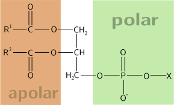
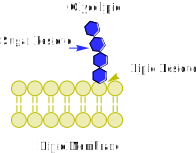
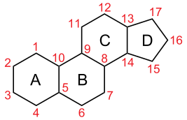
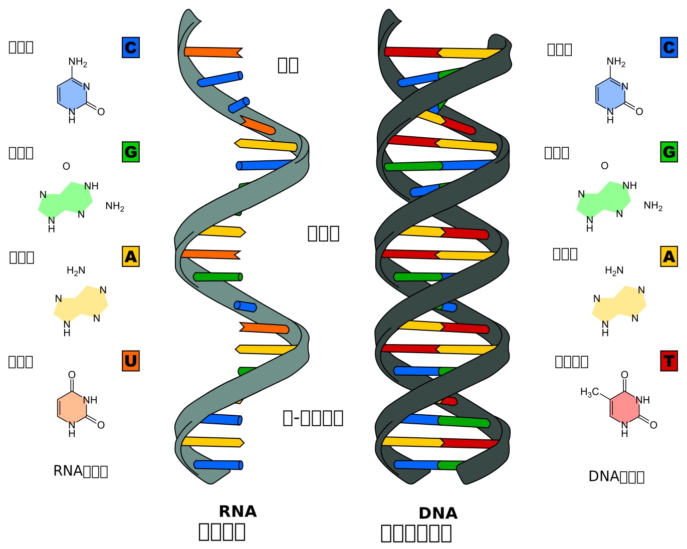

# 细胞中的物质

## 细胞中的物质

### 元素和化合物

生物体总是和外界环境进行着物质交换，细胞生命活动所需要的物质，归根结底是从无机自然界中获取的。因此，组成细胞的化学元素，在无机自然界中都能够找到，没有一种化学元素为细胞所特有。但是，细胞中各种元素的相对含量与无机自然界的大不相同。

组成细胞的化学元素，常见的有 20 多种，其中有些含量多，有些含量很少。一般来说，细胞中含量最多的就是碳元素和氧元素，以人和玉米细胞为例，人的干重 C O N H 依次最多，人的鲜重、玉米的干重、玉米的鲜重都是 O C H N 依次最多。核心原因是玉米富含糖类（例如纤维素细胞壁），糖类中氧元素可以在烘干中保留，而不像自由水那样脱去。

细胞中常见的化学元素中，含量较多的有 C、H、O、N、P、S、K、Ca、Mg、Na、Cl 等元素，称为大量元素（注意，Na 和 Cl 在中学阶段不被列入大量元素，在植物中钠属于非必需/有益元素，氯是必需微量元素）；有些元素含量很少，如 Fe、Mn、Zn、Cu、B、Mo、Ni、Co、Se 等，称为微量元素。

{ width="80%" }

注意：钙和镁都是大量元素！

组成细胞的各种元素大多以化合物的形式存在，如水、蛋白质、核酸、糖类、脂质，等等。细胞内含量最多的化合物是水（约占 $70\%\sim90\%$），含量最多的有机化合物是蛋白质（约占 $7\%\sim 10\%$），其次是糖类和核酸、脂质、无机盐等。

组成细胞的化学元素都能在无机自然界中找到，没有一种元素是生物体特有的，这说明生物界和非生物界的物质组成具有统一性。生物体和地壳、海洋、大气等非生命的无机环境相比，各种元素的相对含量却又差异很大，这说明了生命物质的特殊性。

实际上，不同生物组织的细胞中各种化合物的含量是有差别的，有的还相差悬殊，例如脂肪组织中含量最高的是脂肪。我们平常吃的食物也是如此。正因为不同食物中营养物质的种类和含量有很大差别，我们才需要在日常膳食中做到不同食物的合理搭配，以满足机体的营养需要。我们的食物来自各种生物组织。

> 【沪科技版】科学研究表明，元素在人体中作用的大小不能以其含量的多少来决定。有许多微量元素的含量微乎其微，但作用却不可忽视。人体摄入微量元素不足会对机体产生不利的影响，甚至导致某些疾病的发生。例如，锰（Mn）是一类超氧化物歧化酶（Mn-SOD）的激活剂，在人体抗氧化过程中发挥着重要作用。硒（Se）是谷胱甘肽过氧化物酶（GSH-Px）的组成部分，当机体缺硒时，衰老速度明显加快。微量元素不但维持人体的正常生理功能，也影响着人的智力、情绪等，是人类身心健康的物质基础。然而，微量元素“过量”同样会打破机体元素平衡，可能会拮抗另一些必需元素的吸收或直接造成细胞中毒。无论何种元素的摄入都应特别强调“适量”，这样才能起到应有的效果。

### 细胞中的水

人们普遍认为，地球上最早的生命孕育在海洋中，生命从一开始就离不开水。生物体的含水量随着生物种类的不同有所差别，一般为 60%~95%，水母的含水量达到 97%。水是构成细胞的重要成分，也是活细胞中含量最多的化合物。

1. 水是细胞内良好的溶剂，许多种物质能够在水中溶解；
2. 细胞内的许多生物化学反应也都需要水的参与。
3. 多细胞生物体的绝大多数细胞，必须浸润在以水为基础的液体环境中。
4. 水在生物体内的流动，可以把营养物质运送到各个细胞，
5. 同时也把各个细胞在新陈代谢中产生的废物运送到排泄器官或者直接排出体外。

> 【浙科版】水分子中氧原子的原子核周围电子较多，使氧略带负电性而氢略带正电性，水成为极性分子，一端略正，一端略负。由于正负电荷的吸引，水分子之间便会形成氢键。每个氢键中的氢原子同时属于两个氧原子，而每个水分子中的氧原子可以形成两个氢键，所以一个水分子可以通过氢键与另外 4 个水分子相连。这就是水分子的缔合。具有极性和氢键的形成使得水分子有许多不寻常的特性。
>
> 水是极性分子，凡是有极性的分子或离子都易溶于水中。例如，氯化钠的 Na＋和 Cl－就会分别与水分子的略带负电荷的氧的一端和略带正电荷的氢的一端相互吸引，在这两种离子的周围形成一层水膜，把 Na＋和 Cl－分开，使得氯化钠晶体易溶于水中。在人和动物的体液、植物的汁液中，均含有大量的水，且都溶有多种多样生物体所必需的溶质。因此，水作为良好的溶剂，能帮助溶解和运输营养物质及代谢产物。
>
> 水分子之间的氢键使得水具有调节温度的作用。水分子间大量的氢键使水蒸发时要消耗大量的热，如出汗能有效地降低体温。水温的增高需要较多的热，因为先要破坏氢键才能促进分子的运动；反之，水温的降低就会形成较多的氢键，而氢键的形成会释放热量，这就使得细胞内水的温度变化不那么剧烈。
>
> 此外，水还是细胞中某些代谢的反应物和产物，水在动、植物的分布、繁殖、生长发育以及动物体色、动物行为等方面有着深远的影响。

水是良好的溶剂，氢键比较弱，易被破坏，只能维持极短时间，这样氢键不断地断裂，又不断地形成，使水在常温下能够维持液体状态，具有流动性。同时，由于氢键的存在，水具有较高的比热容，这就意味着水的温度相对不容易发生改变，水的这种特性，对于维持生命系统的稳定性十分重要。

水在细胞中以两种形式存在，绝大部分的水呈游离状态，可以自由流动，叫作自由水；一部分水与细胞内的其他物质相结合，叫作结合水。细胞中自由水和结合水所起的作用是有差异的：自由水是细胞内良好的溶剂；结合水是细胞结构的重要组成部分，大约占细胞内全部水分的 4.5%。细胞内结合水的存在形式主要是水与蛋白质、多糖等物质结合，这样水就失去流动性和溶解性，成为生物体的构成成分。

> 【苏教版】细胞中的水分子以自由水（free water）和结合水（bound water）两种形式存在。
>
> 自由水以游离的形式存在，参与细胞中各种代谢活动。自由水是良好的溶剂，细胞生命活动所需的许多离子、分子都可以溶解其中；自由水可以自由流动，溶解在水中的各种物质随着水的流动到达生物体各处，被细胞吸收和利用，细胞代谢产生的废物一般也借助于水排出体外；细胞中几乎所有的生化反应都是以自由水为介质进行的，有些水还直接作为反应物参与生化反应。正因为自由水的特殊作用，在代谢旺盛的细胞中，自由水的含量一般比较高。
>
> 结合水是被细胞内其他物质（如蛋白质）束缚而不易自由流动的水，是组成细胞的重要成分。休眠的种子、越冬的植物、生活在干旱或盐渍条件下的植物，其细胞内结合水的含量相对较多，抵抗不良环境的能力也较强。总之，细胞中的水对于维持细胞的形态、保证细胞代谢的正常进行具有重要作用。可以说，没有水就没有生命。

在正常情况下，细胞内自由水所占的比例越大，细胞的代谢就越旺盛；而结合水越多，细胞抵抗干旱和寒冷等不良环境的能力就越强。例如，将种子晒干就是减少了其中自由水的量而使其代谢水平降低，便于储藏；北方冬小麦在冬天来临前，自由水的比例会逐渐降低，而结合水的比例会逐渐上升，以避免气温下降时自由水过多导致结冰而损害自身。

> 【苏教版】当某些元素缺乏或过剩时，作物会在形态上表现出明显的症状。传统农业就是针对这些症状，判断作物中哪些元素可能缺乏或过剩（下图），进而针对性地施用肥料。当植物缺乏某种元素时，植物会表现出该种元素缺乏症，甚至死亡。传统农业根据植物的元素缺乏症，往往会有针对性地向农田投入化肥，但对投入化肥的种类和数量做不到精细管理，可能造成一些营养元素的过剩。过剩的元素也会对农田土壤环境造成污染。精准农业能根据农田的土壤元素状况和作物的元素缺乏或过剩状况，实施定位、定量的精准施肥，高效地利用各类农业资源，取得较好的经济效益和环境效益。
>
> 氮元素是作物中蛋白质、核酸和叶绿素等物质不可缺少的组成成分。当作物缺氮时，植株不仅生长矮小、瘦弱，叶色淡绿，还表现为花少，果实少而小。当氮元素过剩时，植株营养生长过旺、叶色浓绿、果实迟熟。磷元素是作物细胞的重要组成成分，对作物体内的物质合成、转化与转移都起着重要作用。缺磷时，作物除生长矮小、瘦弱外，还表现为叶色暗绿、缺乏光泽，开花结果少。当磷元素过剩时，作物叶片大小正常，但出现失绿黄化现象。作物缺钾时，叶色呈暗绿色或紫蓝色，老叶尖端和边缘逐步失绿，发黄焦枯。镁元素是叶绿素的重要组成成分。作物缺镁时，叶脉之间会变黄，但叶脉周围仍呈现清晰的绿色。

作物（绿色植物）的正常生长发育需要阳光、水分、空气以及多种**营养元素**。这些元素从无机环境中被有选择地吸收，构成了生命的物质基础。并非植物体内的所有元素都是必需的，目前已确定的植物必需元素共有 **17 至 20 种**。一种元素被视为“必需”必须满足以下三个准则：

1. **不可替代性**：植物缺少该元素就不能完成其生活周期。
2. **生理功能明确**：该元素直接参与植物的新陈代谢，且其功能不能被其他元素完全替代。
3. **缺乏症特异性**：缺少该元素时，植物会表现出特定的缺乏症状，只有补充该元素后，植物才能恢复正常。

作物在缺乏特定元素时会表现出明显的“缺素症”：

- **氮 (N) —— “生命的基础”**：是蛋白质、核酸及叶绿素的组成成分。**缺氮**时，植株矮小瘦弱，叶片发黄（从老叶开始），花少果小。
- **磷 (P) —— “能量的货币”**：是 ATP、核酸和磷脂的重要组分，参与能量代谢和生物膜构建。**缺磷**时，生长缓慢，叶色暗绿甚至出现紫红色斑点，根系发育差，结实率低。
- **钾 (K) —— “品质元素”**：调节气孔开闭，促进糖类合成与运输，增强抗倒伏和抗病能力。**缺钾**时，叶片边缘会出现枯黄的“焦边”现象，茎秆脆弱。
- **镁 (Mg) —— “光合核心”**：是叶绿素分子的必需成分。**缺镁**时，叶绿素合成受阻，叶脉间失绿变黄，直接影响光合效率。
- **硼 (B) —— “生殖助手”**：促进花粉萌发和花粉管伸长。**缺硼**会导致“花而不实”（只开花不结果）。
- **钙 (Ca)**：调节营养运输，维持细胞壁和膜的稳定性。**缺钙**常导致番茄脐腐病或葡萄果实腐烂。

作物对营养元素的吸收机制：

1. **吸收部位**：根系是吸收水分和无机盐的主要器官，尤其是**根尖成熟区**的根毛细胞，极大地增加了吸收面积。
2. **吸收方式**：矿质离子主要通过**主动运输**的方式进入根细胞，这需要消耗细胞呼吸产生的能量（ATP）并依赖膜上的载体蛋白。
3. **浓度影响与“烧苗”**：正常情况下，根毛细胞液浓度大于土壤溶液浓度，水分通过渗透作用进入根部。若一次性施肥过多，土壤溶液浓度过高，会导致细胞失水，产生**“烧苗”**现象，引起植株萎蔫。

科学家常用**溶液培养法**（水培法）来确定某种元素是否为必需：

- **对照组**：使用含全部营养元素的“完全培养液”，植物正常生长。
- **实验组**：使用缺少元素 X 的培养液。若植物出现缺素症，随后补充元素 X 后症状消失，则证明 X 是必需元素。

农业生产实践建议：

1. **合理施肥**：根据作物的生长阶段和土壤肥力，针对性地补充氮、磷、钾等肥料。
2. **施用有机肥**：有机肥经微生物分解后，能持续缓慢地提供 **CO₂ 和无机盐**，改善土壤结构，提高作物产量。
3. **微量元素补给**：虽然需求量小，但一旦缺乏会对产量产生毁灭性影响，应注意叶面喷施或基肥补给。
4. **精准农业**：利用现代技术对土壤进行测定，实施定位、定量的精准施肥，以减少环境污染并提高资源利用率。

### 细胞中的无机盐

当你点燃一粒小麦种子，待它烧尽时可见到一些灰白色的灰烬，这些灰烬就是小麦种子里的无机盐。人和动物体内也含有无机盐。细胞中大多数无机盐以离子的形式存在，含量较多的阳离子有 $\ce{Na+}$、$\ce{K+}$、$\ce{Ca^2+}$、$\ce{Mg^2+}$、$\ce{Fe^2+}$、$\ce{Fe^3+}$ 等，阴离子有 $\ce{Cl-}$、$\ce{SO4^2-}$、$\ce{PO4^3-}$、$\ce{HCO3-}$ 等。与水不同，无机盐是细胞中含量很少的无机物，仅占细胞鲜重的 1%~1.5%。

植物在缺乏 N、P、K 等营养物质时会出现各种症状，因此生产过程中常要给植物施肥。玉米在生长过程中缺乏 P，植株就会特别矮小，根系发育差，叶片小且呈暗绿偏紫色。

Mg 是构成叶绿素的元素，Fe 是构成血红素的元素。P 是组成细胞膜、细胞核的重要成分，也是细胞必不可少的许多化合物的成分。钠离子、钙离子等离子对于生命活动也是必不可少的。

例如，人体内钠离子缺乏会引起神经、肌肉细胞的兴奋性降低，最终引发肌肉酸痛、无力等，因此，当大量出汗排出过多的无机盐后，应多喝淡盐水。哺乳动物的血液中必须含有一定量的钙离子，如果钙离子的含量太低，动物会出现抽搐等症状。此外，生物体内的某些无机盐离子，必须保持一定的量，这对维持细胞的酸碱平衡也非常重要。可见，许多种无机盐对于维持细胞和生物体的生命活动都有重要作用。

> 【沪科教版】动物的遗体或植物的枝叶充分燃烧后剩下的少量灰烬，其主要成分就是无机盐。细胞中的无机盐大多以离子形式存在，少数以不溶或难溶性化合物分子的形式存在，如骨骼、牙齿中的钙盐。细胞中含量较多的阳离子有 Na+、K+、Fe2+、Ca2+、Mg2+ 等，含量较多的阴离子有 H2PO4 -、NO3 -、Cl-、SO4 2-、HCO3 - 等。无机盐在细胞中含量虽少，但与生命活动密切相关。
>
> 有些无机盐是细胞中某些重要化合物的组成成分。例如，N 是构成蛋白质的必需元素，P 是构成核酸的必需元素。如果植物体缺少 Mg2+，叶绿素就会合成不足，进而影响光合作用的进行。如果人体缺少 Fe2+，血红蛋白的合成就会受到影响，导致缺铁性贫血。
>
> 无机盐离子能维持细胞和生物体的正常渗透压，从而使细胞保持一定的形态，保证了细胞生命活动的正常进行。例如，医生在给需要静脉注射的病人输入药物时，常将药物溶解在生理盐水中，原因就是质量分数为 0.9% 的 NaCl 溶液的渗透压与人体细胞赖以生存的细胞外液渗透压相当。
>
> 有的无机盐离子还能维持生物体或细胞内的酸碱平衡。例如，HCO3 -/CO3 2- 和 H2PO4 -/HPO4 2- 这两对离子在溶液中能够缓冲 pH 的变化，这对于维持细胞的正常代谢同样是非常必要的。还有一些无机盐离子对酶具有活化或辅助作用，参与生物体的代谢活动。
>
> “水善利万物而不争”，没有水，就没有生命。“盐随水行”，参与细胞生命活动的无机盐，也常常需要溶解在水中才能发挥其应有的功能。水和无机盐都是生物体不可缺少的无机组成成分，对维持生物体的正常生命活动具有重要作用。

### 细胞中的有机物

细胞是由多种元素和化合物构成的。在构成细胞的化合物中，多糖、蛋白质、核酸都是生物大分子。通过学习，我们知道组成多糖的基本单位是单糖，组成蛋白质的基本单位是氨基酸，组成核酸的基本单位是核苷酸，这些基本单位称为单体。每一个单体都以若干个相连的碳原子构成的碳链为基本骨架。生物大分子是由许多单体连接成的多聚体，因此，生物大分子也是以碳链为基本骨架的。正是由于碳原子在组成生物大分子中的重要作用，科学家才说“碳是生命的核心元素”“没有碳，就没有生命”。

> 【沪科教版】组成细胞的化学元素大多以化合物的形式存在，不同细胞中各种化合物的组成大致相同。细胞中的化合物可以分为两大类：无机化合物和有机化合物。无机化合物简称无机物，通常是指不含碳的化合物。细胞中的无机物主要是水和各种无机盐。含碳和氢的化合物大都是有机化合物（不包括碳的氧化物、碳的硫化物、碳酸、碳酸盐、氰化物等），简称有机物。细胞中的有机物主要包括糖类、脂质、蛋白质与核酸等。有机物种类繁多，这是由碳原子的结构决定的。
>
> 碳原子最外层有 4 个电子，既不易失电子，也不易得电子。因此，碳原子通常会和其他原子通过共用电子对形成 4 个共价键，既可以形成单键，也可以形成双键或三键。自然界中最简单的有机物是甲烷。在细胞中，碳原子与碳原子之间通过高度稳定的共价键相互连接，构成了各种复杂有机物的骨架结构即碳链（carbon chain）。这些碳链长短各异，有线状、分支状、环状等多种形状，碳链上的碳原子还可以与 H、O、N、P、S 等原子或原子团通过共价键相结合，进而组成结构和功能千差万别的有机物。碳链的结构、长度以及与碳链相连接的原子团，决定了有机物的基本性质。
>
> 官能团是有机物中化学性质比较活泼、容易发生化学反应的原子或原子团。例如，醇的官能团是羟基（—OH），氨基酸的官能团是羧基（—COOH）和氨基（—NH2）等。含有相同官能团的分子具有相似的化学性质。有机小分子按照官能团进行分类命名。官能团限定了有机分子的主要理化性质，并往往能引发有机物之间特定的化学反应。
>
> 葡萄糖、氨基酸、核苷酸等生物体中的有机物，相对分子质量较小，结构简单，属于有机小分子。由众多结构相同或相似的有机小分子（单体），通过缩合反应所生成的结构复杂、相对分子质量非常大的有机物（多聚体），就属于生物大分子，如蛋白质、核酸、淀粉、糖原、纤维素等。这些生物大分子都可以通过水解反应再分解成许多有机小分子。细胞主要由 C、H、O、N、P、S 等元素组成，这些元素组成了种类繁多的化合物，其中以碳链为骨架形成了复杂的生物大分子，承担了细胞的大部分生命活动，所以 C 是组成细胞的最基本元素。细胞中的元素和化合物是细胞生命活动的物质基础。

{ width="70%" }

碳原子性质不活泼，它的最外层有 4 个电子，不易失去或得到电子而形成离子。在含碳化合物中，碳原子与其他原子通过共用电子对结合在一起。原子间通过共用电子对而形成的化学键叫共价键。碳原子之间也可以形成共价键，这样多个碳原子可以相互结合形成稳定的碳链。

> 【浙科版】组成生物体的有机物都是以碳骨架作为结构基础的，主要包括糖类（carbohydrates）、脂质（lipids）、蛋白质（proteins）和核酸（nucleic acids）。许多有机物的相对分子量以万至百万计，所以称为生物大分子。蛋白质和核酸是两类最重要的生物大分子。

以碳链为骨架的多糖、蛋白质、核酸等生物大分子，构成细胞生命大厦的基本框架；糖类和脂质提供了生命活动的重要能源；水和无机盐与其他物质一起，共同承担着构建细胞、参与细胞生命活动等重要功能。细胞中的这些化合物，含量和比例处在不断变化之中，但又保持相对稳定，以保证细胞生命活动的正常进行。

> 【沪科技版】分光光度法：许多反应会有颜色变化，生成的产物在特定波长下具有一定吸光度。通常，物质浓度越大，吸光度越大。在分光光度计中，通过测定待测物质在特定波长处的吸光度，可对该物质进行定量分析。在测定待测物质浓度前，通常需要先测定标准浓度物质的吸光度，找出浓度与吸光度的对应关系（即标准曲线）。然后测定待测物质吸光度，根据标准曲线计算其浓度。

## 糖类

糖类，指的是一系列多羟基醛或多羟基酮及其缩聚物，或者其衍生物的总称。

以前所有分子式可写成 $\ce{C_m (H2O)_n}$ 的化学物质皆被称为 **碳水化合物**，但是现在生物化学理解上的糖类是指除了碳数不为一和二的「碳水化合物」。

在旧版教材中，我们说糖类是主要的能源物质，但是在新版高中教材中，将这一描述改成了，糖类是重要的能源物质。葡萄糖是细胞生命活动所需要的主要能源物质，常被形容为“生命的燃料”。

### 单糖概述

单糖因无法水解为更小的碳水化合物，因此是糖类中最小的分子。它们是一些具有两个或者更多羟基的醛或酮类化合物。

单糖是新陈代谢中的主要燃料，能提供能量（当中以葡萄糖最主）及用于生物合成。单糖未需即时使用的话，细胞会先将其转换成较省空间的形式，通常为多糖。在包括人类的许多动物中，这种储存方式是糖原，特别在肝脏及肌肉细胞。在植物中，则储存成淀粉。

戊糖又称五碳糖，是含有 $5$ 个碳原子的单糖，分子式为 $\ce{C5H10O5}$。

- 在 $1$ 号碳上有醛基的称为五碳醛糖（戊醛糖）。

- 在 $2$ 号碳上有酮基的称为五碳酮糖（戊酮糖）。

己糖又称六碳糖，是含有 $6$ 个碳原子的单糖，分子式为 $\ce{C6H12O6}$。

- 在 $1$ 号碳上有醛基的称为六碳醛糖（己醛糖）。

- 在 $2$ 号碳上有酮基的称为六碳酮糖（己酮糖）。

| | 1 | 2 | 3 | 4 |
| :-: | :-: | :-: | :-: | :-: |
| 戊糖 |   核糖 |   阿拉伯糖 |   木糖 |   来苏糖 |
| 己糖 |   葡萄糖 |   半乳糖 |   果糖 |   山梨糖 |

单糖发生的反应：

- 单糖经氢化还原，可以得到糖醇。

- 发酵反应：$\ce{C6H12O6 ->[酒化酶] 2C2H5OH + 2CO2 ^}$。

- 呼吸作用：$\ce{C6H12O6 + 6O2 ->[酶] 6CO2 + 6H2O}$。

高中生物定义上，说不能水解的糖就是单糖，能够水解的就是多糖。葡萄糖几乎能被大部分细胞直接吸收，植物细胞还能直接吸收蔗糖（在细胞工程中，培养植物往往加入蔗糖，因为其对渗透压的影响更小）。而生物体内的糖类绝大多数以多糖的形式存在。

### 双糖概述

由两个连接成一起的单糖组成的糖类，称为双糖，双糖化学式为 $\ce{C12H22O11}$。

双糖是由两个单糖单元通过脱水反应，形成一种称为糖苷键的共价键连接而成。在脱水过程中，一分子单糖脱除氢原子，而另一分子单糖脱除羟基。

虽然双糖种类繁多，但大多数并不常见。

- 麦芽糖，由两分子 **葡萄糖** 形成。

- 乳糖，由一分子 **葡萄糖** 与一分子 **半乳糖** 形成，广泛的存在于天然产物中。

- 蔗糖，由一分子 **葡萄糖** 与一分子 **果糖** 形成，是存量最为丰富的双糖，它们是植物体内存在最主要的糖类。

双糖还可分类为还原性双糖与非还原性双糖：

- 通过两个单糖分子的半缩醛（酮）羟基脱去一分子水而相互连接。这样的双糖，分子中已没有半缩醛（酮）羟基存在，因此其中任何一个单糖部分都不能再由环式转变成醛（酮）式。

- 还原糖：若两分子单糖结合后所形成的双糖分子之结构仍具有一个游离的半缩醛羟基，在碱性溶液中具有还原性，则该双糖属于还原糖，例如 **乳糖 **、** 麦芽糖** 等。还原糖可使用斐林试剂进行检测，会生成砖红色沉淀。

- 非还原糖：非还原糖的分子结构中没有游离的半缩醛羟基，因此不具还原性。常见的例子有 **蔗糖** 和 **海藻糖** 等。与还原糖相比，非还原糖的化学反应性较低，因此在生物体储存糖类时其较高的稳定性可能为一优势。

在高中阶段，我们学习乙醇时，知道它在浓硫酸、$\pu {140^oC}$ 的条件下可以发生 **分子间脱水** 生成乙醚（$\ce{C2H5 - O-C2H5}$）。既然葡萄糖（$\ce{C6H12O6}$）分子里足足有 $5$ 个羟基（$\ce{-OH}$），按理说分子间脱水缩合生成醚键（$\ce{-O-}$）应该非常容易。

但高中课本乃至基础有机化学却几乎从来不提葡萄糖在 **普通化学试剂** 下的分子间脱水，原因可以归结为以下三个核心维度：**反应极其混乱、副反应（炭化/焦糖化）占据绝对主导，以及反应机理的特殊性**。

- **实验室常规脱水条件会导致“毁灭性”的副反应（炭化）**

    ---

    如果我们要模仿乙醇生成乙醚的条件，给葡萄糖加入 **浓硫酸并加热**，会发生什么？

    你得到的绝不会是两个葡萄糖分子连在一起的“醚”，而是一团膨胀的黑炭！

    - **原因**：浓硫酸具有极强的 **脱水性（夺水性）**。由于葡萄糖分子中氢和氧的比例正好是 $2:1$（俗称碳水化合物 $\ce{C6 (H2O) 6}$），浓硫酸会直接将单个葡萄糖分子内部的氢和氧以水的形式强行剥离，只剩下黑色的碳单质。

    - **结论**：强烈的 **分子内脱水（炭化）** 反应速度远快于分子间脱水。在这个条件下，葡萄糖还没来得及分子间缩合，分子骨架就已经被摧毁了。

- **加热条件下的极度混乱（焦糖化反应）**

    ---

    如果我们不加浓硫酸，只是 **单纯地加热** 葡萄糖固体，企图让它们分子间脱水呢？

    - 葡萄糖在达到熔点（约 $\pu {146^oC}$）后会熔化。如果继续加热，它不会发生像乙醇那样整齐划一的 $A + A \rightarrow B + H2O$ 反应。

    - 相反，它会发生大名鼎鼎的 **焦糖化反应（Caramelization）**。这是一个极其复杂、混沌的化学过程。葡萄糖分子会发生断键、异构化、脱水、分子内成环、低聚聚合等成百上千种副反应，生成数以百计的不同挥发性风味物质和棕色的大分子色素（焦糖色）。

    - **结论**：在实验室里，葡萄糖的热脱水产物是一锅“大杂烩”，根本无法得到单一、明确的含”$\ce{-O-}$“键的目标产物。高中化学为了教学的严谨性和清晰度，通常只讲那些 **主反应明确、产物单一** 的经典反应。

- **位阻效应与交联反应（$5$ 个羟基的烦恼）**

    ---

    退一步讲，假设我们有一种温和的催化剂能促进脱水且不破坏骨架。

    - 葡萄糖有 $5$ 个羟基，这就意味着反应失去了 **方向性**。

    - 分子 A 的 1 号位羟基可能和分子 B 的 3 号位脱水，也可能和分子 C 的 6 号位脱水……

    - 因为反应位点太多，一旦发生分子间脱水，它大概率会形成一种像网一样乱七八糟、高度交联的 **体型高分子聚合物**（类似于树脂），而不是我们想要探讨的简单的两分子缩合产物。

- **葡萄糖的分子间脱水缩合**

    ---

    那么，葡萄糖真的不能分子间脱水缩合生成“$\ce{-O-}$”吗？

    **当然可以！但这正是生命的奇迹所在 —— 这不叫普通的化学脱水，而叫生物合成（酶催化）。**

    其实高中课本 **讲了** 葡萄糖脱水生成”$\ce{-O-}$“的过程，只是换了一个名字：**多糖的合成**。

    1. **生命的精密控制**：在生物体内，通过特定的 **酶** 的催化，葡萄糖分子的某一个特定羟基（通常是具有特殊活性的 **半缩醛羟基**，即 1 号碳上的羟基）会与另一个葡萄糖分子的特定羟基（比如 4 号碳上的羟基）发生脱水缩合。

    2. **特殊的化学键 **：这样形成的”$\ce{-O-}$“键，在化学上不叫简单的”醚键”，而是有一个专属名词 ——** 糖苷键（Glycosidic bond）**（本质上是缩醛结构）。

    3. **产物**：两个葡萄糖这样脱水缩合，生成的就是 **麦芽糖**；成千上万个葡萄糖这样有序地脱水缩合，生成的产物就是 **淀粉** 或 **纤维素**。

高中化学很少提“葡萄糖在试管里的分子间脱水缩合”，是因为：

1. 用浓酸加热，它会变成 **黑炭**（分子内脱水）。
2. 直接加热，它会变成 **焦糖**（复杂裂解与聚合）。
3. 反应位点太多，人工很难精准控制。

只有在讲到 **生命体内的酶促反应**，或者 **淀粉/纤维素的水解与合成** 时，高中课本才会以“生成糖苷键（连接成大分子）”的形式，展现葡萄糖分子间脱水缩合形成”$\ce{-O-}$“的奇妙过程。

### 多糖概述

寡糖和多糖都是由单糖单元通过糖苷键组成的长链分子，分子式可以表示为 $\ce{(C6H10O5)_n}$，两者的区别在于其链上单糖单元的数量。

- 寡糖又称低聚糖，是指由少量单糖聚合而成的碳水化合物，定义上寡糖可以表示 $3\sim10$ 个单糖单元或 $2\sim6$ 个单糖单元，后者寡糖也包含了双糖。

- 多糖由多个单糖分子脱水聚合，以糖苷键连接而成，可形成直链或者有分支的长链，水解后得到相应的单糖和寡糖。例如用来储存能量的淀粉和糖原，以及用来组成生物结构的纤维素和甲壳素。

- 同时，按照单糖单元的种类，可以将多糖分为均一多糖（由一种单糖分子缩合而成的多糖）和不均一多糖（由不同的单糖分子缩合而成的多糖）。

食物中的淀粉水解后变成葡萄糖，这些葡萄糖成为人和动物体合成动物多糖 —— 糖原的原料。糖原主要分布在人和动物的肝脏和肌肉中，是人和动物细胞的储能物质。当细胞生命活动消耗了能量，人和动物血液中葡萄糖含量低于正常时，肝脏中的糖原便分解产生葡萄糖及时补充。

纤维素也是由许多葡萄糖连接而成的，构成它们的基本单位都是葡萄糖分子。几丁质也是一种多糖，又称为壳多糖，广泛存在于甲壳类动物和昆虫的外骨骼中。几丁质及其衍生物在医药、化工等方面有广泛的用途。例如，几丁质能与溶液中的重金属离子有效结合，因此可用于废水处理；可以用于制作食品的包装纸和食品添加剂；可以用于制作人造皮肤；等等。

多糖：

- 淀粉 $\ce{(C6H10O5) n}$，由通过糖苷键连接的大量葡萄糖单元组成，由于淀粉呈粉状，且分散在水中会向下沉淀，故名淀粉，是人类饮食中最常见的碳水化合物。

    纯淀粉为一种白色、无味、无臭的粉末，不溶于冷水或酒精。淀粉因分子内氢键卷曲成螺旋结构的不同，可分为直链淀粉（糖淀粉）和支链淀粉（胶淀粉）。

    直链淀粉遇碘呈蓝色，支链淀粉遇碘呈紫红色。这是由于淀粉螺旋中央空穴恰能容下碘分子，由于范德华力，两者形成一种蓝黑色错合物。单独的碘分子与三碘阴离子（$\ce{I^3-}$）都能使淀粉变蓝。

    淀粉可以在稀酸（如稀硫酸）加热或酶的催化下水解，经多步最终生成麦芽糖，注意麦芽糖是淀粉酶分解淀粉产生的双糖。

    | 水解状态   | 加入银氨溶液水浴加热的现象 | 加入新制氯化铜的现象 | 加入碘水的现象 |
    |:----------:|:--------------------------:|:--------------------:|:--------------:|
    | 未水解     | 无明显现象                 | 无明显现象           | 溶液变蓝       |
    | 部分水解   | 产生银镜                   | 产生砖红色沉淀       | 溶液变蓝       |
    | 完全水解   | 产生银镜                   | 产生砖红色沉淀       | 无明显现象     |

    验证⽔解产物时，⾸先要加⼊氢氧化钠溶液中和后再进⾏实验。

- 糖原 $\ce{(C6H10O5)_n}$ 由葡萄糖脱水缩合作用而成，主要生物学功能是作为动物和真菌的能量储存物质。

    肌糖原只能供给肌肉细胞所用，不能提升血糖浓度。

    肝糖原负责补充血糖使之维持稳定浓度；可以分解成葡萄糖，并释放到血液，供给肌肉以及其他器官，是提供身体的能量来源。

- 纤维素 $\ce{(C6H10O5)_n}$，由葡萄糖组成，是地球上最丰富的有机聚合物，是自然界中分布最广、含量最多的一种多糖，是组成植物细胞壁的主要成分。反刍动物因在瘤胃中含有可分泌纤维素酶的微生物，如纤维杆菌、纤维素单胞菌、瘤胃球菌等而可以消化纤维素。

- 几丁质 $\ce{(C8H13O5N)_n}$ 是一种含氮的多糖，由多数经 N- 乙酰修饰的 D- 葡糖胺及少数 D- 葡糖胺形成线性的聚合物，也称为聚 N- 乙酰基 - D- 葡糖胺。存于节肢动物外骨骼、软体动物骨骼、真菌以及某些藻类细胞壁中。

寡糖有类似水溶性膳食纤维的功能，能促进肠蠕动，改善便秘、腹泻等问题。原因是人体小肠只能不完全消化寡糖，因此寡糖未能消化的部份会让肠道的菌落利用，因而改变肠道生态，使人体消化道菌丛生态正常化，并增加有益菌数，帮助改善肠的正常消化及运动，减少毒素吸收、预防肠癌、肠炎等的发生率，且能改善血脂水平。虽然寡糖甜甜的，但因为分子较大，细菌不容易分解利用，所以不会引起蛀牙。而且因为寡糖是难消化性，摄取后血糖值不会增高，对于糖尿病患及怕胖又想吃甜者可适量摄取。

1. 制造纤维素硝酸酯。

    棉花和浓硝酸浓硫酸在一定条件下，生成以纤维素三硝酸酯为代表的火棉（含氮量 $12.5\%\sim13.8\%$），而含氮量低（$10.5\%\sim12\%$）的称为胶棉。

    火棉遇火迅速燃烧，在密闭容器中发生爆炸，可用作无烟火药；胶棉也易于燃烧，但并不爆炸。

2. 制造纤维素乙酸酯：纤维素乙酸酯俗称醋酸纤维，是由棉花跟乙酸酐（$\ce{(CH3CO) 2O}$）的混合物在一定条件下反应制得的。

3. 制造黏胶纤维：是纤维素依次用 $\ce{NaOH}$ 浓溶液和 $\ce{CS2}$ 处理，再把生成物溶于 $\ce{NaOH}$ 稀溶液中即形成黏胶液。

4. 造纸。

### 拓展：甜味

> 【浙科版】甜是一种很美妙的感觉。甜度的检测通常用蔗糖作为参照物，以它为 100，果糖甜度几乎是蔗糖的两倍，其他天然糖的甜度均小于蔗糖。

{ width="100%" }

甜味的产生是一个复杂的生理过程，涉及分子识别、信号转导以及大脑的认知加工。甜味的感觉起源于舌头上的化学感受器，其产生过程可分为以下几个阶段：

- **分子识别**：甜味物质（如葡萄糖、果糖或人工甜味剂）溶解在唾液中，与分布在舌表面味蕾中的**味觉受体细胞（TRCs）**结合。
- **受体结合**：甜味受体属于**G 蛋白偶联受体（GPCR）**家族。在人类中，发挥功能的甜味受体是由两个蛋白质组成的异源二聚体，即 **Tas1R2 和 Tas1R3**。不同的甜味分子对这些受体的亲和力不同，这决定了它们“甜度”的差异。
- **信号转导**：
    1. 当甜味分子结合受体后，会激活胞内的一种特殊 G 蛋白，称为**味传导蛋白（Gustducin）**。
    2. 被激活的味传导蛋白会通过一系列酶促反应（如激活腺苷酸环化酶提高 cAMP 水平）关闭基底膜上的 **K⁺ 通道**。
    3. K⁺ 外流受阻导致细胞发生**去极化**，随后激活电压门控钙通道或释放胞内钙库，导致胞内钙离子浓度升高。
    4. 最终，受体细胞释放神经递质（如**ATP**），激活与之相连的味觉神经纤维。
- **大脑中枢处理**：神经冲动通过面神经（鼓索支）或舌咽神经传导，经过延髓和丘脑，最终抵达大脑皮层的**主味觉皮层（GC）**，在那里大脑将其识别并加工为“甜”的感觉。

为什么自然界中的甜味物质多为糖类？这种现象是**生物进化与自然选择**的结果，主要原因如下：

- **糖类是核心能源物质**：糖类（尤其是葡萄糖）是大多数生物生命活动所需要的主要能源物质，葡萄糖常被形象地称为“生命的燃料”。大脑和神经系统甚至必须主要由糖类供能。
- **生存的“导航仪”**：味觉系统最初进化的目的是为了帮助动物判断食物的化学成分。甜味通常预示着食物富含热量和生命所需的营养物质，而苦味则往往预示着毒素。
- **正向反馈机制**：为了鼓励机体摄入高能量的食物，进化过程使大脑在感知到甜味时产生“愉悦感”。这种正向反馈引导动物寻找并摄取含糖丰富的植物果实或种子，从而保证能量供应，提高存活率。

为什么淀粉不是甜的？尽管淀粉、纤维素和糖原都是由葡萄糖脱水缩合而成的多糖，但淀粉本身并不具备甜味，原因在于其特殊的物理和化学性质：

- **分子结构巨大**：淀粉是高分子聚合物，由数百至数千个葡萄糖单体组成。由于其分子体积巨大，无法进入并结合味觉受体（Tas1R2+Tas1R3）的分子结合位点。
- **溶解性差**：淀粉分子以大的颗粒或螺旋结构形式存在（如直链淀粉和支链淀粉），通常不溶于水。味觉受体只能感知溶解在水溶液中的小分子物质。
- **受体特异性**：甜味受体具有极高的专一性，只能被单糖（如葡萄糖、果糖）或二糖（如蔗糖、麦芽糖）等特定的结构激活。

**特别说明**：当我们在口腔中细细咀嚼馒头或米饭等富含淀粉的食物时，会感觉到甜味。这并不是因为淀粉是甜的，而是因为口腔分泌的**唾液淀粉酶**将淀粉催化水解成了**麦芽糖**。麦芽糖作为一种二糖，能够与甜味受体结合，从而产生甜感。归根结底，淀粉只有在被水解成较小的糖分子后，才能展现出“糖”的甜味特性。

## 脂质

### 脂类

脂类又称脂质，是一组广泛的有机化合物，包括脂油脂、固醇、脂溶性维生素、磷脂等。脂类不溶于水而易溶于脂肪溶剂（醇、醚、氯仿、苯）等非极性有机溶剂，主要生理功能包括储存能量、膜的讯息传导、作为细胞膜的结构成分。

脂质可以广义定义为疏水性或双亲性小分子；某些脂质因为其双亲性的特质（兼具亲水性与疏水性），能在水溶液环境中形成囊泡、脂质体或膜等构造。

脂类包含油脂，而非其同义词；脂肪属于脂类的一种。

与糖类相似，组成脂质的化学元素主要是 C、H、O，有些脂质还含有 P 和 N。与糖类不同的是，脂质分子中氧的含量远远低于糖类，而氢的含量更高。常见的脂质有脂肪、磷脂和固醇等，它们的分子结构差异很大，通常都不溶于水，而溶于脂溶性有机溶剂，如丙酮、氯仿、乙醚等。

脂肪是由三分子脂肪酸与一分子甘油发生反应而形成的酯，即三酰甘油（又称甘油三酯）。其中甘油的分子比较简单，而脂肪酸的种类和分子长短却不相同。脂肪酸可以是饱和的，也可以是不饱和的。植物脂肪大多含有不饱和脂肪酸，在室温时呈液态，如日常炒菜用的食用油（花生油、豆油和菜籽油等）；大多数动物脂肪含有饱和脂肪酸，室温时呈固态。

脂肪酸的“骨架”是一条由碳原子组成的长链。碳原子通过共价键与其他原子结合。如果长链上的每个碳原子与相邻的碳原子以单键连接，那么该碳原子就可以连接 2 个氢原子，这个碳原子就是饱和的，这样形成的脂肪酸称为饱和脂肪酸。饱和脂肪酸的熔点较高，容易凝固。如果长链中存在双键，那么碳原子连接的氢原子数目就不能达到饱和，这样形成的脂肪酸就是不饱和脂肪酸。不饱和脂肪酸的熔点较低，不容易凝固。

1 g 糖原氧化分解释放出约 17 kJ 的能量，而 1 g 脂肪可以放出约 39 kJ 的能量。脂肪是细胞内良好的储能物质，当生命活动需要时可以分解利用。脂肪不仅是储能物质，还是一种很好的绝热体。生活在海洋中的大型哺乳动物，如鲸、海豹等，皮下有厚厚的脂肪层，起到保温的作用。生活在南极寒冷环境中的企鹅，体内脂肪可厚达 4 cm。分布在内脏器官周围的脂肪还具有缓冲和减压的作用，可以保护内脏器官。

磷脂与脂肪的不同之处在于甘油的一个羟基（-OH）不是与脂肪酸结合成酯，而是与磷酸及其他衍生物结合。因此，磷脂除了含有 C、H、O，还含有 P 甚至 N。磷脂是构成细胞膜的重要成分，也是构成多种细胞器膜的重要成分。在人和动物的脑、卵细胞、肝脏以及大豆的种子中，磷脂含量丰富。

固醇类物质包括胆固醇、性激素和维生素 D 等。胆固醇是构成动物细胞膜的重要成分，在人体内还参与血液中脂质的运输；性激素能促进人和动物生殖器官的发育以及生殖细胞的形成；维生素 D 能有效地促进人和动物肠道对钙和磷的吸收。

> 【沪科教版】脂肪不仅可以提供能量，还能帮助人体吸收维生素，并与一些激素的合成有关，对维持人体正常代谢和健康发挥着不可或缺的作用。营养学家认为，人体摄入脂肪的数量和质量都非常重要，在饮食中脂肪摄入量过多或过少都是不科学的。组成脂肪的脂肪酸包括饱和脂肪酸、单不饱和脂肪酸和多不饱和脂肪酸。牛、羊等常见家畜的脂肪中主要是饱和脂肪酸，通常认为人体过量摄取饱和脂肪酸更容易导致心血管等方面的疾病。单不饱和脂肪酸（如油酸）在坚果和各种植物油中含量较高。多不饱和脂肪酸是人体不能合成的必需脂肪酸，在玉米油、菜籽油等大多数植物油以及深海鱼油中含量较多。食物摄入过多或机体代谢的改变会导致体内脂肪细胞数目增加、体积增大，进而使体内脂肪含量异常增高并沉积在身体某些部位。超重、肥胖不仅影响形体，还会诱发高血压、脂肪肝、糖尿病等多种疾病。通过合理膳食和适量运动，可以预防超重、肥胖等现象的发生。

细胞中的糖类和脂质是可以相互转化的。血液中的葡萄糖除供细胞利用外，多余的部分可以合成糖原储存起来；如果葡萄糖还有富余，就可以转变成脂肪和某些氨基酸。给家畜、家禽提供富含糖类的饲料，使它们肥育，就是因为糖类在它们体内转变成了脂肪。而食物中的脂肪被消化吸收后，可以在皮下结缔组织等处以脂肪组织的形式储存起来。但是糖类和脂肪之间的转化程度是有明显差异的。例如，糖类在供应充足的情况下，可以大量转化为脂肪；而脂肪一般只在糖类供能不足时，才会分解供能，而且不能大量转化为糖类。

注意：在某些细胞，例如油料作物种子内，可以通过特殊的代谢途径（例如乙醛酸循环）将脂肪快速、大量分解为糖类。但是脂肪一般来说都能快速大量分解供能，只不过不能变为糖，进而合成氨基酸等等。在寒冷条件下，代谢加快，主要就是加快的脂肪代谢。

### 脂肪酸

| 饱和脂肪酸 | 不饱和脂肪酸 | 反式不饱和脂肪酸 |
| ---------- | ------------ | ---------------- |
|  |  |  |
| 硬脂酸：$\ce{C17H35COOH}$。  软脂酸：$\ce{C15H31COOH}$。 | 油酸：$\ce{C17H33COOH}$。  亚油酸：$\ce{C17H31COOH}$。 | |

口诀：软 $15$、硬 $17$、油酸不饱 $17$ 烯；亚油酸再多一个烯；最后均含一羧基。

### 磷脂与糖脂

磷脂：

- 也称磷脂质，是含有磷酸的脂类，属于复合脂。磷脂为两性分子，一端为亲水的含氮或磷的头，另一端为疏水（亲油）的长烃基链。

    {width="50%"}

- 由于此原因，磷脂分子亲水端相互靠近，疏水端相互靠近，常与蛋白质、糖脂、胆固醇等其他分子共同构成脂双分子层，即细胞膜的结构，是细胞中所有膜状构造的主要成分。

- 上图在生物中是一个很好的例子，$R^1,R^2$ 两个脂肪酸，一般有一个是不饱和的，展现出“丌”的形状，然后 $X$ 可以是含氮的（例如包含碱基）也可以是氢，因此生物中说，磷脂中含有碳、氢、氧、磷，甚至有氮！

糖脂：

- 糖脂是通过糖苷键连接的碳水化合物的脂质，它们的作用是保持膜的稳定性并促进细胞识别。在所有真核细胞膜的表面上发现这些碳水化合物。

    {width="50%"}

- 它们从磷脂双层延伸到细胞外的含水环境中; 磷脂双层作为特定化学物质的识别位点，有助于保持膜的稳定性并使细胞彼此附着以形成组织。

### 油脂和脂肪

油脂，即油和脂，在口语上，油指常温下呈液态的油脂，脂指常温下呈固态的脂，植物性甘油三酯多为油，动物性甘油三酯多为脂。脂肪通常指甘油三酯类，也就是油和脂，狭义上、尤其是口语上特指固态的脂。

脂肪的化学结构是甘油三酯，为非极性物质，以非水合形式贮存，是体内储量最大、产能最多的能源物质。甘油三酯由甘油和脂肪酸组成；其中甘油的分子比较简单，而脂肪酸的种类和长短却不相同，包括饱和脂肪酸、单不饱和脂肪酸、多不饱和脂肪酸。

在细胞里，三酸甘油酯可以自由穿过细胞膜，原因是其无极性，与组成细胞膜的类脂双层不产生反应。

注意：油脂不是高分子化合物。油脂是甘油（丙三醇）与三个高级脂肪酸通过酯化反应形成的酯：

{width="70%"}

三个脂肪酸 $\ce{RCOOH},\ce{R'COOH},\ce{R''COOH}$ 可能为相同（简单甘油酯）、相异或部份相异（混合甘油酯）的烷基。

油脂作为一种酯，可以发生经典的酸性和碱性水解，油脂在碱性溶液中水解反应又称 **皂化反应**，产物甘油与硬脂酸钠称为皂化液，皂化液经饱和食盐水盐析即可析出高级脂肪酸的钠盐，再经过一系列处理可以得到肥皂。

油脂的氢化：不饱和程度较高、熔点较低的液态油，通过催化加氢可提高饱和程度，转化为半固态脂肪这个过程称为油脂的氢化，也称油脂的硬化。制得的油脂叫人造脂肪，通常又称为硬化油。硬化油不易被空气氧化变质，便于储存和运输，可以制造肥皂和人造奶油的原料。

### 甾体和固醇

**腺甾烷** 另译甾烷，或称甾核，由三个环己烷和一个环戊烷共四个烃环融合而成。

{width="40%"}

腺甾烷的衍生物：

|  腺甾烷 |  雄烷 |  雌烷 |  孕烷 |  胆烷 |
| :-: | :-: | :-: | :-: | :-: |
|  胆固醇 |  睾酮 |  雌二醇 |  孕酮 |  胆酸 |

类固醇又称甾体、类甾醇，其特征是有一个四环的母核（甾核）。必须注意的是，类固醇的意思是类似固醇，其不一定属于醇类；为避免名称中类与醇在上下文中造成误解或歧义，常改称甾体。

固醇属于类固醇的一个子群，固醇是最早发现的类固醇化合物，自然界中分布甚广。广义上的固醇，包括最简单的腺甾醇；而狭义上的固醇，还需在 $17$ 号 $\ce{C}$ 上有一个约 $8\sim10$ 碳原子的烃侧链。

### 脂肪的检测和应用

苏丹 III 染液是生物学实验中用于检测和鉴定 **脂肪（油脂）** 的常用化学试剂。显色反应与原理：

- **显色结果**：在含有脂肪的生物组织中滴加苏丹 III 染液，脂肪颗粒会呈现出特殊的 **橘黄色**。若使用其“兄弟”试剂苏丹 IV，则会呈现红色。
- **物理原理**：苏丹 III 属于人工合成的 **脂溶性染料**，它能溶于酒精，但更易溶于脂肪。
- **染色机制**：在实验过程中，染料分子会穿过细胞的质膜，选择性地溶解在细胞内的脂肪滴中，从而使其显色。

在检测花生种子等材料的脂肪时，操作步骤非常严格：

- **材料准备**：通常需要进行徒手切片，挑选最薄的切片放置在载玻片中央。
- **染色时间**：滴加染液后，一般需要静置 **2~3 分钟** 进行充分染色。
- **洗去浮色（关键步骤）**：染色后必须滴加 **1~2 滴体积分数为 50% 的酒精溶液**。这是为了洗去组织表面多余的染料（浮色），以免干扰显微镜下的观察。
- **观察**：洗色后吸干酒精，滴加蒸馏水盖上盖玻片，先在低倍镜下找到目标，再换用 **高倍显微镜** 观察橘黄色的脂肪颗粒。

试剂配制与安全：

- **配制成分**：一种常见的配方是将 0.2g 苏丹 III 加入 10mL 95% 的酒精中溶解，再加入 10mL 甘油混匀并过滤。
- **注意事项**：苏丹 III 具有一定毒性，使用时需小心。如果实验中不慎将染液沾到皮肤上，应立即用 **50% 的酒精 *。

脂肪的应用：

1. 肥皂的去污作用：

    普通的肥皂约含质量分数 $70\%$ 的高级脂肪酸的钠盐，$30\%$ 的水和少量的盐。有些肥皂内还加有填充剂、香料及染料等。肥皂的去污作用主要是高级脂肪酸的钠盐的作用。从结构上看，高级脂肪酸钠的分子可以分为两部分，一部分是极性的 $\ce{-COONa}$ 或 $\ce{—COO-}$，这一部分可溶于水，叫做亲水基。另一部分是非极性的链状的烃基 $\ce{—R}$，这一部分在结构上跟水的差别很大，不能溶于水，叫做憎水基。憎水基具有亲油的性质。在洗涤的过程中，污垢中的油脂跟肥皂接触后，高级脂肪酸钠分子的烃基就插入油滴内。而易溶于水的羧基部分伸在油滴外面，插入水中。这样油滴就被肥皂分子包围起来。再经摩擦、振动，大的油滴便分散成小的油珠，最后脱离被洗的纤维织品，而分散到水中形成乳浊液，从而达到洗涤的目的。

2. 合成洗涤剂：

    根据对肥皂去污原理的研究，人们认识到凡是分子的两端分别具有亲水基和憎水基的物质都有一定的去污能力。因此，可以利用人工合成的方法来合成具有这种结构的物质作为洗涤剂。这就是人们日常所用的合成洗涤剂。目前，常用的合成洗涤剂的主要成分是烷基苯磺酸钠或烷基磺酸钠。其中亲水基都是极性基团 $\ce{—SO3Na}$，式中 $\ce{R}$ 一般是含十个以上碳原子的烃基。烃基含碳原子太少时，憎水作用太弱，使得憎水基跟油的结合力不强。相反地，烃基含碳原子太多时，就不容易溶于水。所以烃基太大或太小都不能很好地达到去污的目的。

## 核酸

### 核苷酸

核酸的单体结构为核苷酸，每个核苷酸由一个核苷（一个五碳糖、一个含氮碱基）和一个或多个磷酸基团组成。

{width="90%"}

- 如果其五碳糖是脱氧核糖，则此单体的聚合物是脱氧核糖核酸 DNA。

- 如果其五碳糖是核糖，则此单体的聚合物是核糖核酸 RNA。

{width="90%"}

核酸的结构可分为一级结构、二级结构、三级结构和四级结构。

碱基互补配对：

| 胞嘧啶、鸟嘌呤   之间生成三条氢键 | 腺嘌呤、胸腺嘧啶   之间生成两条氢键 |
| :---------------------------------: | :-----------------------------------: |
|              |                |

最终形成脱氧核糖核酸的形式如下：

{width="90%"}

### 核酸

“核酸”，顾名思义，就是从细胞核中提取的具有酸性的物质。核酸（nucleic acid）包括两大类：一类是脱氧核糖核酸（deoxyribonucleic acid），简称 DNA；另一类是核糖核酸（ribonucleic acid），简称 RNA。真核细胞的 DNA 主要分布在细胞核中，线粒体、叶绿体内也含有少量的 DNA。RNA 主要分布在细胞质中。

> 【浙科版】核酸是细胞中控制其生命活动的生物大分子。组成生物体的亿万个细胞中都有 DNA 和 RNA。DNA 中储藏的信息控制着细胞的所有活动，并且决定着细胞和整个生物体的遗传特性。RNA 是合成蛋白质所必需的。

核酸同蛋白质一样，也是生物大分子。核苷酸是核酸的基本组成单位。每个核酸分子是由几十个乃至上亿个核苷酸连接而成的长链。一个核苷酸是由一分子含氮的碱基、一分子五碳糖和一分子磷酸组成的。根据五碳糖的不同，可以将核苷酸分为脱氧核糖核苷酸（简称脱氧核苷酸）和核糖核苷酸。

DNA 和 RNA 各含 4 种碱基，但是组成二者的碱基种类有所不同。DNA 是由脱氧核苷酸连接而成的长链，RNA 则是由核糖核苷酸连接而成的长链。一般情况下，在生物体的细胞中，DNA 由两条脱氧核苷酸链构成，RNA 由一条核糖核苷酸链构成。

生物的遗传信息就储存在 DNA 分子中，而且每个个体的 DNA 的脱氧核苷酸序列各有特点。可以想象：组成 DNA 的脱氧核苷酸虽然只有 4 种，但是如果数量不限，在连成长链时，排列顺序就是极其多样的，它的信息容量自然就非常大了。脱氧核苷酸的排列顺序储存着生物的遗传信息，DNA 分子是储存、传递遗传信息的生物大分子；部分病毒的遗传信息储存在 RNA 中，如 HIV（人类免疫缺陷病毒）、SARS（严重急性呼吸综合征）病毒等。

> 【沪科教版】为什么大多数现存生物的遗传物质是 DNA 分子？核酸包括 DNA 和 RNA，为什么大多数现存生物的遗传物质是 DNA 分子？RNA 是神秘而且富有活力的生物分子之一。随着人们对 RNA 功能多样性认识的不断深化，一些科学家认为 RNA 很可能先于 DNA 出现。20 世纪 80 年代中后期，科学家提出了“RNA 世界”假说：在生命起源早期的某个时期，曾经有过一个由 RNA 组成或由 RNA 控制下的生命世界，即 RNA 世界。这些早期的 RNA 分子既具有类似 DNA 的遗传信息储存和复制功能，又具有类似蛋白质的催化功能。
>
> RNA 几乎可以完成蛋白质和 DNA 的所有功能。例如，RNA 能以自身多核苷酸链为模板进行自我复制，满足遗传信息传递的基本要求；RNA 可为核糖体和其他一些亚细胞结构提供支撑或附着的骨架；科学家还在大肠杆菌、四膜虫等生物中发现 RNA 具有酶的活性（被称为核酶）。但是，RNA 的结构很不稳定，容易受到周围环境的影响而发生突变，携带遗传信息的能力不如 DNA，在作为功能分子方面其多样性和催化效率又远不及蛋白质。在“RNA 世界”以后的亿万年进化过程中，RNA 逐渐将其功能转给了 DNA 和蛋白质。
>
> 一方面，与 RNA 相比，DNA 的结构和化学性质更加稳定，更适合作为遗传信息长期储存的载体。另一方面，在 DNA 分子中，双链上的对应碱基通过氢键“焊接”配对，就像是拉链的齿牙那样“丝丝入扣”，保证了 DNA 复制能准确无误地进行。同时，氢键在特殊环境条件下（如宇宙射线、化学物质等）容易断开，可能导致 DNA 发生突变，使生物出现新性状。这是生物遗传与变异如此完美和谐的微观解释之一。大多数现存生物以 DNA 作为遗传物质，DNA 分子所具备的复制系统和防止变异的“纠错”机制，既保持了生命世界的稳定和谐，又能使其不断地发展进化。
>
> 大多数生物选定 DNA 作为遗传物质，碱基的种类也是一个重要的原因。DNA 和 RNA 所共有的碱基是腺嘌呤、鸟嘌呤和胞嘧啶，DNA 分子中特有的碱基是胸腺嘧啶，RNA 中特有的碱基是尿嘧啶。尿嘧啶与胸腺嘧啶都能与腺嘌呤配对，可 DNA 为什么不含尿嘧啶呢？原来，胞嘧啶容易与亚硝酸盐反应，也容易自发地脱氨基而转变为尿嘧啶，而细胞无法辨明尿嘧啶是自身原有的还是胞嘧啶突变来的。事实上，DNA 分子中一旦出现尿嘧啶，则一般是胞嘧啶脱氨基转变来的，这样就能被“系统”相关的酶迅速识别并切除，从而保证 DNA 携带的遗传信息相对稳定。

核酸是细胞内携带遗传信息的物质，在生物体的遗传、变异和蛋白质的生物合成中具有极其重要的作用。

> 【苏教版】甲基绿—派洛宁染色法：DNA 和 RNA 两种核酸分子都是生物大分子，但聚合程度有所不同。DNA 聚合程度高，易与甲基绿结合，RNA 聚合程度低，易与派洛宁结合。当派洛宁与甲基绿混合在一起作为染料时，派洛宁与 RNA 选择性结合，显示红色；甲基绿与 DNA 选择性结合，显示绿色。即 RNA 对派洛宁的亲和力大，被染成红色；DNA 对甲基绿的亲和力大，被染成绿色。

甲基绿—派洛宁染色法（也常被称为甲基绿—吡罗红染色法）是生物学中用于区分和观察细胞内 **DNA（脱氧核糖核酸）** 和 **RNA（核糖核酸）** 分布的经典实验方法。这一技术利用了两种碱基染料对两种核酸亲和力的差异来实现选择性染色。

- **亲和力差异**：DNA 和 RNA 都是生物大分子，但它们的**聚合程度**不同。
    - **DNA**：具有高度的聚合性。**甲基绿**是一种碱性染料，它与聚合程度高的 DNA 具有很强的亲和力，因此能将 DNA 染成**绿色**。
    - **RNA**：聚合程度相对较低。**派洛宁（吡罗红）** 同样是碱性染料，它对聚合程度低的 RNA 亲和力更强，从而将 RNA 染成**红色**。

- **混合染色**：当将派洛宁与甲基绿混合在一起作为染料时，两种染料能选择性地与细胞内的核酸结合，从而清晰地显示出 DNA 和 RNA 在细胞中的分布位置。

为了保证染色效果，染色液通常由两部分组成，并需精准控制 pH 值：

- **A 液**：将派洛宁和甲基绿粉剂溶解于蒸馏水中。
- **B 液（缓冲液）**：由乙酸钠和乙酸配制而成的**乙酸钠缓冲液**，通常将 pH 值调节在 **4.8** 左右。
- **现配现用**：最终的染色液是由 A 液和 B 液按比例混合而成，通常建议现配现用以保证染料的活性和选择性。

实验材料与关键步骤：

- **常用材料**：通常选用人的**口腔上皮细胞**或**洋葱鳞片叶内表皮细胞**，因为这些细胞接近无色，便于观察颜色反应。

- **关键试剂——盐酸（8% HCl）的作用**：
    1. **改变通透性**：改变细胞膜的通透性，加速染色剂进入细胞。
    2. **解离与结合**：使染色质中的 DNA 与蛋白质分离，有利于 DNA 与甲基绿染料结合。
- **基本流程**：
    1. **制片**：将细胞涂抹在载玻片上。
    2. **水解**：使用盐酸处理，注意温度和时间的控制。
    3. **冲洗**：用蒸馏水洗去多余的盐酸，防止酸性过强影响染色。
    4. **染色**：使用甲基绿—派洛宁混合染液进行染色。
    5. **观察**：在显微镜下进行观察。

- **现象**：
    - **细胞核**：被染成**绿色**。这表明 DNA 主要分布在细胞核中。
    - **核仁**：被染成**红色**。因为核仁含有高浓度的 RNA。
    - **细胞质**：被染成**红色**。这表明 RNA 主要分布在细胞质中。

- **结论**：在真核细胞中，DNA 主要分布在细胞核内，而线粒体和叶绿体内也含有少量的 DNA；RNA 则主要分布在细胞质中。

除了甲基绿—派洛宁法，现代生物学还常用荧光染料来区分核酸。例如，**吖啶橙（Acridine Orange）** 结合 DNA 时会发出**绿色荧光**，结合 RNA 时则发出**橙色或橘黄色荧光**。此外，**荧光原位杂交（FISH）** 技术可以更精确地通过荧光标记的探针定位染色体上的特定 DNA 序列。

### 特殊的碱基

$\text{5-BrdU}$（5 - 溴尿嘧啶脱氧核糖核苷）：

- $\text{5-BrdU}$ 是一种 **合成的** 核苷类似物，其结构特征为胸腺嘧啶的 5 号位甲基被溴原子取代，形成溴代嘧啶环。

- $\text{5-BrdU}$ 与胸腺嘧啶（$\text{T}$）竞争，与腺嘌呤（$\text{A}$）配对，可以通过免疫荧光染色显示增殖细胞（绿色荧光）。

二腺嘌呤（$\text{Z}$）：

- $\text{Z}$ 最早于 1977 年在蓝细菌噬菌体 S - 2L 的基因组中被苏联科学家发现，其完全取代了腺嘌呤，成为噬菌体 DNA 的组成碱基。近年研究发现，含有 $\text{Z}$ 基因组的噬菌体分布广泛。$\text{Z}$ 基因组的合成系统（如 PurZ 酶）可能起源于古菌，并通过水平基因转移传播至噬菌体。

- $\text{Z}$ 与腺嘌呤（$\text{A}$）竞争，与胸腺嘧啶（$\text{T}$）配对，其引入改变了 DNA 的理化性质，可能影响蛋白质与 DNA 的相互作用。从而 $\text{Z}$-DNA 对细菌的限制性内切酶具有抗性，因为宿主酶无法识别 $\text{Z}$-$\text{T}$ 配对，从而保护噬菌体基因组不被切割。$\text{Z}$ 的合成涉及多酶系统。

次黄嘌呤（$\text{I}$）：

- 次黄嘌呤是嘌呤的衍生物，其结构与腺嘌呤相似，但缺少氨基（$\ce{-NH2}$），取而代之的是酮基（$\ce{C = O}$）。

- $\text{I}$ 可以与 $\text{A}$、$\text{U}$、$\text{C}$ 三个碱基配对（摆动配对），这加强了密码子的简并性，提高了翻译效率。次黄嘌呤可能参与 DNA 错配修复，但其在 DNA 中的异常积累也会导致双链不稳定。

### 碱基计算

根据查戈夫法则，一条双链 DNA 分子中，**嘌呤碱基数** 等于 **嘧啶碱基数**（即 $\mathrm {A + G = T + C}$）。

沃森 - 克里克规则认为，腺嘌呤（A）必须与胸腺嘧啶（T）配对，鸟嘌呤（G）必须与胞嘧啶（C）配对，由于现在发现还有很多不同的碱基，这条规则已经不适用，但是一定范围内可以这样认为。

## 蛋白质

### 氨基酸

氨基酸，是构成蛋白质的基本单位，赋予蛋白质特定的分子结构形态，使其分子具有生化活性。不同的氨基酸脱水缩合形成肽，其缩合产生的酰胺键称肽键。肽虽然和蛋白质在化学本质上除了聚合的长度外没什么不同，但是往往不像蛋白质有多级构造与特定功能。

{width="50%"}

α 氨基酸的结构式

根据氨基连结在羧酸中碳原子的位置，可将氨基酸分为 $\alpha,\beta,\gamma,\delta,\dots$ 等类型，在生物化学中，若无明示，氨基酸通常默认 $\alpha$ 氨基酸，即氨基和羧基直接连接在同一个 $\ce{-CH-}$ 结构上的氨基酸，其通式是 $\ce{H2N - CHR - COOH}$。

{width="100%"}

天然的氨基酸都是无色结晶，熔点约在 $\pu {230^oC}$ 以上，都能溶于强酸或强碱溶液中，除胱氨酸、酪氨酸、二碘甲状腺素外，均易溶于水；除脯氨酸和羟脯氨酸外，均难溶于乙醇和乙醚。具有两性，有碱性（二元氨基一元羧酸）、酸性（一元氨基二元羧酸）、中性（一元氨基一元羧酸）三种类型。大多数氨基酸都呈现不同程度的酸性或碱性，呈现中性的较少，所以既能与酸结合成盐，也能与碱结合成盐。

### 蛋白质概述

蛋白质，常简称蛋白，由一个或多个由 $\alpha$- 氨基酸残基组成的长链条组成。$\alpha$- 氨基酸分子呈线性排列，相邻 $\alpha$- 氨基酸残基的羧基和氨基通过肽键连接在一起，最后经过折叠形成有功能的立体结构。蛋白质的 $\alpha$- 氨基酸序列是由对应基因所编码。

蛋白质、肽、多肽这些名词的含义在一定程度上有重叠，经常容易混淆。蛋白质通常指具有完整生物学功能并有稳定结构的分子；而肽则通常指一段较短的氨基酸寡聚体，常常没有稳定的三维结构。然而，蛋白质和肽之间的界限很模糊，通常以 $20\sim30$ 个残基为界。多肽可以指任何长度的氨基酸线性单链分子，但常常表示缺少稳定的三级结构。

组成细胞的有机物中含量最多的就是蛋白质（protein）。从化学角度看，蛋白质也是目前已知的结构最复杂、功能最多样的分子。细胞核中的遗传信息，往往要表达成蛋白质才能起作用。每一种蛋白质分子都有与它所承担功能相适应的独特结构，如果氨基酸序列改变或蛋白质的空间结构改变，就可能会影响其功能。蛋白质是生命活动的主要承担者。

- 许多蛋白质是构成细胞和生物体结构的重要物质，称为结构蛋白。例如，肌肉、头发、羽毛、蛛丝等的成分主要是蛋白质（图为肌纤维）。

- 有些蛋白质能够调节机体的生命活动，如胰岛素（图中黄色区域的部分细胞能分泌胰岛素）。

- 细胞中的化学反应离不开酶的催化。绝大多数酶都是蛋白质（图为胃蛋白酶结晶）。

- 有些蛋白质具有运输功能（图为血红蛋白示意图，能运输氧）。

- 有些蛋白质有免疫功能。人体内的抗体是蛋白质，可以帮助人体抵御病菌和病毒等抗原的侵害。

总体来说，蛋白质是细胞的基本组成成分，具有参与组成细胞结构、催化、运输、信息传递、免疫等重要功能。可以说，细胞的各项生命活动都离不开蛋白质。蛋白质能够承担如此多样的功能，这与蛋白质的多样性有关。人体内有数万种不同的蛋白质。据估计，生物界的蛋白质种类多达 1010~1012 种。

组成人体蛋白质的氨基酸有 21 种，其中有 8 种是人体细胞不能合成的，它们是赖氨酸、色氨酸、苯丙氨酸、蛋（甲硫）氨酸、苏氨酸、异亮氨酸、亮氨酸、缬氨酸，这些氨基酸必须从外界环境中获取，因此，被称为必需氨基酸。经常食用奶制品、肉类、蛋类和大豆制品，人体一般就不会缺乏必需氨基酸。另外 13 种氨基酸是人体细胞能够合成的，叫作非必需氨基酸。

蛋白质是以氨基酸为基本单位构成的生物大分子。氨基酸分子首先通过互相结合的方式进行连接：一个氨基酸分子的羧基（—COOH）和另一个氨基酸分子的氨基（—NH 2）相连接，同时脱去一分子的水，这种结合方式叫作脱水缩合。连接两个氨基酸分子的化学键叫作肽键。由两个氨基酸缩合而成的化合物，叫作二肽。

以此类推，由多个氨基酸缩合而成的，含有多个肽键的化合物，叫作多肽。多肽通常呈链状结构，叫作肽链。由于肽链上不同氨基酸之间还能形成氢键等，从而使得肽链能盘曲、折叠，形成具有一定空间结构的蛋白质分子。许多蛋白质分子都含有两条或多条肽链，它们通过一定的化学键如二硫键相互结合在一起。这些肽链不呈直线，也不在同一个平面上，而是形成更为复杂的空间结构。

在细胞内，组成一种蛋白质的氨基酸数目可能成千上万，氨基酸形成肽链时，不同种类氨基酸的排列顺序千变万化，肽链的盘曲、折叠方式及其形成的空间结构千差万别，因此，蛋白质分子的结构极其多样，这就是细胞中蛋白质种类繁多的原因。

蛋白质变性是指蛋白质在某些物理和化学因素作用下其特定的空间构象被破坏，从而导致其理化性质的改变和生物活性丧失的现象。例如，鸡蛋、肉类经煮熟后蛋白质变性就不能恢复原来状态。高温使蛋白质分子的空间结构变得伸展、松散，容易被蛋白酶水解，因此吃熟鸡蛋、熟肉容易消化。又如，经过加热、加酸、加酒精等引起细菌和病毒的蛋白质变性，可以达到消毒、灭菌的目的。

### 蛋白质的结构

氨基酸的侧链是构成蛋白质结构的重要元素，它们具有不同的化学性质，因此对于蛋白质的功能至关重要。多肽链中的氨基酸之间是通过脱水反应所形成的肽键来互相连接；一旦形成肽键成为蛋白质的一部分，氨基酸就被称为残基，而连接在链的碳、氮、氧原子被称为主链或蛋白质骨架。

{width="80%"}

由于氨基酸的非对称性（两端分别具有氨基和羧基），蛋白质链具有方向性。蛋白质链的起始端有自由的氨基，被称为 $\ce{N}$ 端或氨基端；尾端则有自由的羧基，被称为 $\ce{C}$ 端或羧基端。

大多数的蛋白质都自然折叠为一个特定的三维结构，这一特定结构被称为天然状态。虽然多数蛋白可以通过本身氨基酸序列的性质进行自我折叠，但还是有许多蛋白质需要分子伴侣的帮助来进行正确的折叠。生物化学家常常用以下四个方面来表示蛋白质的结构：

- 蛋白质一级结构：组成蛋白质多肽链的线性氨基酸序列，一个蛋白质是一个聚酰胺。

- 蛋白质二级结构：依靠不同氨基酸之间的基团间的氢键形成的稳定结构，因为二级结构是局部的，不同的二级结构的许多区域可存在于相同的蛋白质分子。

- 蛋白质三级结构：通过多个二级结构元素在三维空间的排列所形成的一个蛋白质分子的三维结构，是单个蛋白质分子的整体形状。蛋白质的三级结构大都有一个疏水核心来稳定结构，具有稳定作用的还有氢键和二硫键。三级结构常常可以用折叠一词来表示。三级结构控制蛋白质的基本功能。

- 蛋白质四级结构：由几个蛋白质分子（多肽链），通常称为蛋白质亚基所形成的结构，在功能上作为一个蛋白质复合体。

{width="100%"}

蛋白质并不完全是刚性分子，许多蛋白质在执行生物学功能时可以在多个相关结构中相互转换。在进行功能型结构重排时，这些相关的三级或四级结构通常被定义为不同构象，而这些结构之间的转换就被称为构象变换。例如，酶的构象变换常常是由底物结合到活性位点所导致。在溶液中，所有的蛋白质都会发生结构上的动态变化，主要表现为热振动和与其他分子之间碰撞所导致的运动。

> 【沪科教版】蛋白质二级结构中的 α 螺旋和 β 折叠：在蛋白质中，形成肽键的氮原子上连有氢原子，N—H 之间的键是一种极性很强的共价键，这个带部分正电荷的氢原子会与另一个肽键中的带部分负电荷的氧原子相互吸引，形成氢键。肽链分子内形成氢键的强烈趋势，使多肽链不再像一条麻绳一样可以摆成任意的形状，而是盘成螺旋或折叠起来，在此基础上形成更高级的空间结构并执行特定的功能。可见，氢键对维系蛋白质特定的空间结构起到了决定性的作用。
>
> 某些肽链的主链沿着“中心轴”盘绕，每一个氨基酸残基都处在合适的位置，第 n 个氨基酸残基的氧原子和氢原子能分别和第 n + 4 个氨基酸残基的氢原子以及第 n - 4 个氨基酸残基的氧原子之间形成氢键，相邻螺旋间形成的氢键几乎与螺旋的中心轴平行。虽然一个氢键的键能并不大，但由于所有氨基酸都与另外两个氨基酸之间形成氢键，从而形成一种非常稳定的空间结构即 α 螺旋。动物毛发中的角蛋白几乎全部是 α 螺旋构象，使得毛发具有很好的韧性。
>
> 两段或两段以上的肽链侧向聚集在一起，相邻多肽链相对应的酰胺氢和羰基氧之间形成氢键，氢键与肽链的长轴接近垂直，肽链通过这种方式连接形成的“片层”结构叫 β 折叠。按肽链的走向可以将 β 折叠分为平行和反平行两种。蚕丝和蛛丝蛋白都有较好的弹性，主要的空间构象就是 β 折叠。

变性作用：

- 物理因素：加热、加压、搅拌、振荡、紫外线照射、X 射线、超声波等。

- 化学因素：强酸、强碱、尿素、重金属盐、非生理浓度的盐类、有机溶剂（甲醛，酒精，苯甲酸等）。

变性为不可逆的化学过程，引起蛋白质结构的改变，形成沉淀，并引起生理活性的消失、易受蛋白酶的水解。变性作用破坏了蛋白质的二级、三级、四级结构，一般不会影响其一级结构。乙醇、碘酒杀菌消毒的原理是使细菌、病毒蛋白质变性死亡，食物加热烹调使蛋白质变性，利于酶发挥作用使其消化。

> 【沪科教版】在某些物理因素（高温、辐射、超声波、剧烈振荡等）和化学因素（强酸、强碱、重金属盐、有机溶剂等）的作用下，蛋白质高度有序的空间结构会被破坏，变为无序松散的伸展状态，从而导致其理化性质的改变和生物活性的丧失，这种现象称为蛋白质的变性（denaturation）。例如，加热可以破坏维系蛋白质空间结构的氢键，使原来处于分子内部的疏水基团大量暴露在分子表面，而亲水基团在表面的分布则相对减少，蛋白质分子就会失去水溶性而聚集沉淀。灭菌、消毒主要就是利用不同的理化因素使蛋白质发生变性，从而使病原体失去活性。

### 蛋白质的检验

双缩脲试剂（Biuret reagent）是生物学实验中用于检测 **蛋白质或多肽** 的常用化学试剂。

- **反应本质**：双缩脲反应是指由两分子尿素缩合而成的双缩脲，在碱性溶液中能与铜离子（$\ce{Cu^2+}$）反应产生紫红色络合物。
- **蛋白质显色原因**：蛋白质和多肽分子中含有大量与双缩脲结构相似的 **肽键**（$\ce{-CO - NH-}$）。在碱性环境下，这些肽键能与 $\ce{Cu^2+}$ 发生显色反应，使溶液呈现 **紫色**。
- **特异性**：该反应是肽与蛋白质特有的。游离氨基酸由于没有肽键，不能发生此反应；二肽通常也不显色（需至少两个肽键）。

双缩脲试剂由两部分组成，必须配合使用：

- **A 液**：质量浓度为 $0.1\text{g/mL}$ 的 $\ce{NaOH}$ 溶液，作用是为反应提供 **碱性环境**。
- **B 液**：质量浓度为 $0.01\text{g/mL}$ 的 $\ce{CuSO4}$ 溶液，作用是提供参与络合反应的 **铜离子**。

**使用顺序**：先向组织样液中加入 $1\text{mL}$ 的 A 液并摇匀，制造碱性环境；然后再加入 $3\sim4$ 滴 B 液并摇匀。

- **无需加热**：与鉴定还原糖的斐林试剂不同，双缩脲反应在常温下即可进行，**不需要加热**。
- **用量控制**：B 液（$\ce{CuSO4}$）不能过量。如果加入过多，过量的蓝色 $\ce{Cu^2+}$ 会遮盖反应生成的紫色，影响结果观察。
- **对比观察**：实验时通常会留出一部分原始组织样液作为空白对照，以便更清晰地分辨紫色变化。

与斐林试剂，虽然两者都包含 $\ce{NaOH}$ 和 $\ce{CuSO4}$，但存在显著差异：

- **浓度不同**：斐林试剂中 $\ce{CuSO4}$ 浓度为 $0.05\text{g/mL}$，而双缩脲试剂中仅为 $0.01\text{g/mL}$。
- **用法不同**：斐林试剂是甲乙液 **等量混合** 后使用，且需 **水浴加热**；双缩脲试剂是 **先后加入** 且不加热。

补充：双缩脲（Biuret）是一种特定的有机化合物，其化学式为 $H_2NCO-NH-CONH_2$。

- **形成机制**：它是由两分子尿素（Urea）在加热条件下经缩合反应，脱去一分子氨（$NH_3$）而形成的。
- **结构特征**：双缩脲分子的核心特征是含有两个**酰胺基团**（$—CONH_2$），这使得它能够与某些金属离子发生特定的络合反应。

双缩脲试剂并非双缩脲溶液，而是因最初用于检测“双缩脲”这一物质而得名的检测试剂。

1. **成分组成：**
    - **A 液**：质量浓度为 $0.1 g/mL$ 的 $NaOH$ 溶液，用于提供碱性环境。
    - **B 液**：质量浓度为 $0.01 g/mL$ 的 $CuSO_4$ 溶液，提供 $Cu^{2+}$。
2. **使用方法（关键）：**
    - **先加 A 液**：先向待测样液中加入 $1 mL$ A 液，振荡摇匀，目的是制造碱性环境。
    - **后加 B 液**：再向混合液中滴加 $3$ 至 $4$ 滴 B 液，摇匀。
    - **注意**：实验过程中**无需加热**。且 B 液不可过量，否则 $CuSO_4$ 本身的蓝色会掩盖反应产生的紫色。

双缩脲试剂检测蛋白质的显色原理：

1. **结构相似性**：蛋白质是由氨基酸通过**肽键**（$-CO-NH-$）连接而成的多聚体。资料显示，蛋白质分子中含有的肽键结构与双缩脲（$H_2NCO-NH-CONH_2$）结构极其相似。
2. **配位反应**：在**碱性环境**（由 A 液提供）下，蛋白质分子中的肽键能与双缩脲试剂中的 $Cu^{2+}$（由 B 液提供）发生反应。
3. **显色结果**：这种反应会生成一种**紫色**的复杂复（络）合物。溶液中紫色程度的深浅在一定范围内与蛋白质的浓度成正比。
4. **反应条件限制：**
    - 必须含有至少**两个肽键**。因此，二肽（仅含一个肽键）和游离的氨基酸不能与双缩脲试剂发生紫色反应。
    - 该反应是蛋白质和多肽特有的性质，可用于蛋白质的定性检测和定量分析。

根据资料归纳，两者的主要区别如下表所示：

| 比较项目 | 双缩脲试剂 | 斐林试剂 |
| :--- | :--- | :--- |
| **检测对象** | 蛋白质（肽键） | 还原糖（醛基） |
| **B液浓度** | $0.01 g/mL$ (较稀) | $0.05 g/mL$ (较浓) |
| **使用方法** | 先加A液，后加B液 | 甲乙液等量混合后再加入 |
| **反应条件** | 常温，不加热 | $50 \sim 65℃$ 水浴加热 |
| **反应现象** | 溶液变紫色 | 产生砖红色沉淀 |

在进行蛋白质鉴定实验时（如使用鸡卵清蛋白），通常建议将材料进行**高倍稀释**（如 $10$ 倍以上）。如果稀释不够，蛋白质在反应后可能凝结并粘附在试管壁上，导致反应不彻底且难以清洗试管。

利用**尿蛋白试纸**测试尿液中的蛋白质，是一种比传统的双缩脲试剂检测更为简单、快速且现象明显的定性或半定量检测方法。在医学临床和家庭健康监测中，它被广泛用于初步筛查**蛋白尿**现象。尿蛋白试纸的测试端（通常呈黄色）涂布有**特殊的化学试剂**。这些试剂在接触到蛋白质（主要是白蛋白）时会发生特定的化学反应，从而引起测试端的颜色变化。

- **显色规律**：颜色变化遵循从**黄色到绿色**的梯度。
- **反应实质**：该方法利用了某些指示剂在特定条件下与蛋白质结合后的颜色偏移现象，绿色愈深代表尿液中蛋白质的浓度愈高。
- **核心材料**：待测尿液样本。在模拟实验中，可以使用**鸡蛋清稀释液**来模拟含有蛋白质的尿液（蛋白尿）。
- **对照材料**：**蒸馏水**（作为阴性对照组，用于对比排除干扰）。
- **器材**：**尿蛋白试纸**、点滴板（或试管）、镊子、烧杯、标准色板。

根据相关教学实践建议，标准操作流程如下：

1. **取样**：在点滴板的一个凹穴中加入一滴**待测尿液**；在另一个凹穴中加入等量的**蒸馏水**作为对照。
2. **浸润**：使用镊子夹取尿蛋白试纸，将**黄色测试端**浸入待测样液中，取出后静置（通常建议等待约 30 秒以便反应充分）。
3. **重复对照**：以同样的方法用另一张试纸测试蒸馏水，观察现象。
4. **比色**：将试纸测试端显现的颜色与随试纸提供的**标准色板**进行实时对比。

通过观察试纸颜色的变化，可以对尿蛋白含量做出判断：

- **阴性（-）**：测试端颜色维持**淡黄色不变**，表示尿液中不含蛋白质或含量极微，符合健康人的生理特征。
- **阳性（+）**：测试端由**黄色转变为绿色**。
    - **微量（±）**：呈现极浅的绿色。
    - **含量高（+ 至 ++++）**：**绿色愈深，“+”号愈多**，表明尿蛋白含量越高。标准色板上通常标有对应的浓度参考值（如 10、30、100、300、2000 mg/dL等）。
生物学与临床意义：

- **生理背景**：正常情况下，血液流经肾小球时，由于**肾小球的滤过作用**，大分子蛋白质无法进入肾小囊腔形成原尿。即便有极微量的小分子蛋白质滤出，也会在流经**肾小管**时被重新吸收回血液。

- **异常判断**：如果尿蛋白试纸检测结果呈强阳性，通常意味着肾脏功能出现了异常，例如**急性肾小球肾炎**导致肾小球通透性增高，使蛋白质滤过到尿液中。
- **局限性**：尿蛋白试纸仅作为一种**初步筛查手段**。当发现尿蛋白含量异常增高时，必须去医院进行更为精确的尿常规生化分析或肾功能进一步检查。

- **双缩脲试剂**：需要在碱性环境下，利用 $Cu^{2+}$ 与蛋白质中的**肽键**反应生成紫色络合物，操作步骤涉及先加 A 液后加 B 液，且对试剂浓度和加入顺序有严格要求。

- **尿蛋白试纸**：**操作更简单、现象更明显**，且不需要配制多种溶液，更适合非实验室环境下的快速检测。

### 纤维状蛋白质和球状蛋白质

蛋白质根据其三维结构的空间构象、形状和溶解度，主要分为**纤维状蛋白质**（Fibrous proteins）和**球状蛋白质**（Globular proteins）两大类。

**纤维状蛋白质** (Fibrous Proteins)：纤维状蛋白质具有长而薄的纤维状或棒状结构，主要承担生物体的结构支撑和保护功能。

1. **结构特征：**
    - **外形**：分子结构相对简单且伸长，呈细长的纤维状或棒状，其长短轴之比通常大于 10。
    - **二级结构主导**：纤维状蛋白质通常由一种主要的二级结构重复排列而成。例如，$\alpha$-角蛋白几乎完全由 $\alpha$-螺旋组成，而丝心蛋白则以 $\beta$-折叠为主要成分。
    - **稳定性**：这种蛋白质具有极高的机械强度、韧性和耐久性，结构非常稳定，不易发生构象改变。

2. **物理性质：**
    - **溶解性**：绝大多数纤维状蛋白质不溶于水及稀盐溶液。
    - **交联**：胞外纤维蛋白常通过共价交联（如二硫键）来增强其结构的稳定性，起到“原子钩环”的作用。

3. **主要功能与实例：**
    - **胶原蛋白 (Collagen)**：动物结缔组织（如皮肤、骨骼、肌腱）的主要成分，占动物体内蛋白质总量的 25%。它由三条多肽链盘绕成坚挺的三股螺旋（超螺旋）结构。
    - **角蛋白 (Keratin)**：构成毛发、指甲、蹄、角和皮肤表皮的主要蛋白质。$\alpha$-角蛋白通过卷曲螺旋结构组装成绳状的中间丝，为细胞提供机械支撑。
    - **弹性蛋白 (Elastin)**：存在于韧带和动脉壁中，由松散、无特定结构的多肽链共价交联形成，使组织具有伸缩自如的弹性。
    - **丝心蛋白 (Fibroin)**：蚕丝和蜘蛛丝的主要成分，具有极高的抗张强度，由于富含反平行 $\beta$-折叠，其质地柔软但不可拉伸。

**球状蛋白质** (Globular Proteins)：球状蛋白质的多肽链折叠成致密、不规则的球形或圆球状，是生命活动中功能最活跃的一类蛋白质。

1. **结构特征：**
    - **外形**：分子紧密折叠成球状，表面不规则且多有凹陷或裂缝（结合位点），长短轴之比接近 1。
    - **折叠模式**：包含多种二级结构的组合，如 $\alpha$-螺旋、$\beta$-折叠、转角和无规卷曲相互穿插。
    - **疏水核结构**：在折叠过程中，疏水性氨基酸侧链通常聚集在分子内部形成疏水核，而极性或带电荷的亲水侧链则排列在分子表面，以便与水环境相互作用。
    - **结构域 (Domain)**：较大的球状蛋白通常由多个能独立折叠的结构域组成，每个结构域往往承担特定的功能。

2. **物理性质：**
    - **溶解性**：大多数球状蛋白质可溶于水或稀盐溶液，形成亲水性胶体。

3. **主要功能与实例：**
    - **酶 (Enzymes)**：几乎所有的酶都是球状蛋白（如溶菌酶、己糖激酶），通过其表面的活性位点特异性地结合底物并催化化学反应。
    - **转运蛋白**：如红细胞中的**血红蛋白**（Hemoglobin）负责运载氧气，血清中的**白蛋白**负责运送脂质和药物。
    - **调节蛋白**：如**胰岛素**（Insulin）等蛋白类激素，通过结合特定的受体来调节机体的生命活动。
    - **免疫蛋白**：如**抗体**（免疫球蛋白），利用其精细的空间结构识别并结合外来病原体。

| 特征 | 纤维状蛋白质 | 球状蛋白质 |
| :--- | :--- | :--- |
| **外形** | 伸长、细丝状或棒状 | 致密、圆球状或椭球状 |
| **溶解性** | 通常不溶于水 | 通常溶于水或稀盐溶液 |
| **结构规律性** | 高度重复的二级结构占优势 | 多种二级结构复杂盘绕折叠 |
| **稳定性** | 极稳定，耐机械压力 | 相对较不稳定，易受 pH 或温度影响 |
| **主要功能** | 结构支撑、连接、保护 | 催化、运输、调节、免疫 |
| **典型实例** | 胶原蛋白、角蛋白、丝心蛋白 | 酶、血红蛋白、抗体、胰岛素 |

### 持家蛋白和奢侈蛋白

根据提供的来源，从基因表达特性和细胞分化的视角，蛋白质可分为**持家蛋白**（Housekeeping Protein，又称管家蛋白）和**奢侈蛋白**（Luxury Protein）两大类。这种分类方法反映了蛋白质在维持细胞基本生命活动与执行特定生理功能之间的分工。

持家蛋白是指在多细胞生物的所有组织细胞中均要表达，且为维持细胞正常结构和最基本的生命活动所必需的蛋白质。

1. **功能定位：**
    - 它们负责执行细胞最基础的代谢任务，如呼吸作用、能量转换、蛋白质合成和物质转运等。
    - 它们构成了细胞的基本骨架和通用分子机器。

2. **主要实例：**
    - **遗传信息处理**：DNA 聚合酶、RNA 聚合酶、DNA 修复酶及转录因子等。
    - **蛋白质合成**：各种核糖体蛋白。
    - **基础代谢酶**：参与糖酵解（如 GAPDH）、三羧酸循环以及磷酸化/去磷酸化调节的酶。
    - **细胞骨架**：构成微管的微管蛋白（tubulin）、构成微丝的肌动蛋白（actin）等。

3. **表达特征：**
    - **组成型表达（Constitutive expression）**：它们的编码基因（持家基因）在生命的全过程和生物体的所有细胞中持续表达，且表达水平相对恒定，较少受环境因素影响。
    - **实验应用**：在生物学实验（如 Western Blot）中，常利用这些稳定表达的蛋白（如 $\beta$-actin）作为内参，以校准样本间的差异。

奢侈蛋白是指仅在某些特定的组织或细胞类型中表达，且在特定的发育阶段才产生的蛋白质。它们是细胞分化和执行特殊生理功能的标志。

1. **功能定位：**
    - 它们赋予了细胞“独特的个性”，决定了不同组织细胞间形态和功能的差异。
    - 它们不直接参与维持细胞生存的基础代谢，而是为生物体整体的协调运作服务。

2. **主要实例：**
    - **血红蛋白 (Hemoglobin)**：仅在发育中的红细胞（网织红细胞）内大量合成，负责运载氧气。
    - **蛋白类激素**：如胰岛 B 细胞分泌的**胰岛素**。
    - **防御蛋白**：如 B 淋巴细胞产生的**免疫球蛋白**（抗体）。
    - **结构标志蛋白**：上皮细胞中的**角蛋白**、结缔组织中的**胶原蛋白**和**弹性蛋白**、眼球中的**晶状体蛋白**。
    - **特异性酶**：如肝、肾中的**苯丙氨酸羟化酶**。

3. **表达特征：**
    - **选择性表达（Selective gene expression）**：其编码基因（奢侈基因）的开启或关闭受到严格的时空调控，取决于细胞的分化状态和所接收到的外部信号（如激素刺激）。
    - **动态性**：奢侈蛋白的组成（蛋白谱）随代谢状态、发育阶段及环境变化而不断波动。

持家蛋白与奢侈蛋白的共存体现了生命系统的统一性与差异性：

- **统一性**：同一生物体的所有细胞都含有相同的全套基因组，因此都能合成维持生存所需的持家蛋白。
- **差异性（细胞分化）**：细胞分化的本质就是**基因的选择性表达**。虽然所有细胞都具备生产任何蛋白的潜力，但通过调控机制（如转录水平、翻译后加工等），只有特定的一部分“奢侈基因”被激活，从而产生执行特异功能的奢侈蛋白。

不同类型蛋白的基因突变对机体的影响截然不同：

1. **持家蛋白突变**：由于它们是维持细胞生存的基础，一旦发生普遍性的严重突变，往往是致命的。但常见的临床持家蛋白突变往往具有局限性，例如精氨酸琥珀酸合成酶缺陷主要导致尿素循环障碍（肝组织特性），而非影响全身所有氨基酸代谢。
2. **奢侈蛋白突变**：具有明显的组织特异性效应。突变不仅会引起原发组织的功能异常（如胰岛素缺陷导致糖尿病），还可能通过系统影响累及其他器官。例如苯丙酮尿症，原发缺陷是肝肾中的酶，但后果却是患者的智力低下。

### 结合蛋白质

结合蛋白质（Conjugated proteins）是蛋白质分类中的一大类，由蛋白质部分（称为脱辅蛋白质）和非蛋白质部分（称为辅基或辅因子）组成。这类蛋白质的独特性在于，仅仅依靠氨基酸序列往往不足以完成其复杂的生物学功能，必须依赖与之紧密结合的非蛋白组分来执行催化、运输或感光等特殊任务。

结合蛋白质的功能活性高度依赖于其包含的非蛋白成分。

1. **辅因子（Cofactor）**：指与蛋白质或核酸结合并辅助其功能的分子。辅因子可以是无机离子（如 $\text{Ca}^{2+}$、$\text{Mg}^{2+}$、$\text{Zn}^{2+}$），也可以是复杂的有机分子（如维生素及其衍生物）。
2. **辅基（Prosthetic group）**：特指与蛋白质结合非常牢固，且为维持蛋白质活性所必需的辅助因子。例如，血红蛋白中的血红素就是一个典型的辅基。
3. **协同作用**：蛋白质框架为辅基提供精确的化学环境和物理定位，使其能以极高的效率和专一性进行反应。

根据非蛋白部分的化学性质，结合蛋白质可分为以下几类：

1. 糖蛋白 (Glycoproteins) 是蛋白质与糖类（寡糖或聚糖）共价连接形成的复合分子。主要有 N-连接糖基化（糖链连在天冬酰胺残基上）和 O-连接糖基化（糖链连在丝氨酸或苏氨酸上）。广泛分布在细胞外表面和分泌液中。它们在细胞识别、信号转导、机体免疫以及防护（如作为润滑剂）中发挥关键作用。

2. 脂蛋白 (Lipoproteins) 是蛋白质与脂质（如三酰甘油、磷脂、胆固醇）结合形成的复合物。主要负责在血液或淋巴液中运输不溶于水的脂质。极低密度脂蛋白（VLDL）主要运输外源性甘油三酯和胆固醇。

3. 染色蛋白质 (Chromoproteins) 含有生色基团（辅基），使得蛋白质呈现特定颜色。

    - **血红素蛋白**：含有血红素辅基，如**血红蛋白**（携带氧气）和**细胞色素**（参与电子传递）。
    - **视紫质 (Rhodopsin)**：存在于视网膜中，由视蛋白与小分子**视黄醛**共价结合而成，是感光成像的基础。
    - **含金属色蛋白**：如含铜的**铜蓝蛋白**呈现亮蓝色。

4. 金属蛋白质 (Metalloproteins) 以金属离子作为辅因子或核心组成部分。许多酶需要金属离子才能发挥催化作用，如含锌的羧肽酶、含铁的细胞色素氧化酶。金属离子可以稳定蛋白质的活性构象，或者直接参与氧化还原反应中的电子转移。

5. 磷蛋白 (Phosphoproteins) 是指多肽链中的某些氨基酸残基（如丝氨酸、苏氨酸、酪氨酸）被磷酸化的蛋白质。磷酸化和去磷酸化是细胞内最重要的分子开关，可以调控蛋白质的活性状态、定位以及与其他分子的相互作用。

6. 核糖核蛋白 (Ribonucleoproteins, RNP) 虽然常被视为复杂的分子机器，但它们本质上是蛋白质与核酸（如 RNA）结合形成的复合物。**核糖体**是最大的核糖核蛋白复合物，由数种 rRNA 和 50 多种蛋白质组成，负责细胞内的蛋白质合成。

血红蛋白（Hemoglobin）是结合蛋白质的完美范例：

1. **蛋白质部分**：由四条多肽链（两条 $\alpha$ 链和两条 $\beta$ 链）组成其四级结构。
2. **非蛋白部分**：每条肽链都紧密结合一个**血红素**分子。
3. **核心机制**：血红素中心的铁原子能可逆地结合氧气。如果没有这个非蛋白的血红素辅基，单纯的珠蛋白无法执行运输氧气的功能。

结合蛋白质通过将蛋白质的柔性架构与辅因子的特殊化学活性相结合，极大地扩展了生命分子的功能范围。这种多组分的构建方式使得细胞能够执行极其复杂的化学转化和信息处理，是蛋白质作为“生命活动主要承担者”的重要体现。

### 蛋白质计算

- 肽键数 $=$ 脱去水分子数 $=$ 氨基酸数 $-$ 肽链数

- $m$ 个氨基酸 $n$ 条肽链，氨基酸的平均相对分子质量是 $a$，形成的蛋白质总相对分子质量为 $am-18 (m-n)$。

- 一条肽链至少一个游离的氨基和一个游离的羧基。

- $m$ 个氨基酸 $n$ 条肽链，至少有 $n + m$ 个氧原子

## 蛋白质的合成与分泌

### 基因指导蛋白质的合成

分泌蛋白的合成与运输是一个高度有序且协调的过程，涉及细胞内多个细胞器的分工合作。这一过程不仅体现了生物膜系统在结构和功能上的连续性，也展示了细胞作为生命基本单位的整体性。

科学家通过在豚鼠的胰腺腺泡细胞中注射 $^3\text{H}$ 标记的亮氨酸，利用放射性同位素的示踪作用，观察到标记物质在细胞内的移动路径。

- **3 分钟后**：放射性出现在附着有核糖体的**粗面内质网**中。
- **17 分钟后**：出现在**高尔基体**中。
- **117 分钟后**：出现在靠近细胞质膜的**囊泡**及**细胞外**分泌物中。

合成与运输的详细步骤：

- **起始阶段：核糖体上的翻译**
    分泌蛋白的合成始于细胞质基质中的**游离核糖体**。最初合成的一段氨基酸序列被称为**信号肽**（Signal Peptide）。
- **进入内质网：初步加工**
    信号肽被信号识别颗粒（SRP）识别并引导，使核糖体附着到内质网膜上。多肽链边合成边通过膜上的通道进入内质网腔内，在此进行**折叠、组装**，并进行初步的**糖基化**修饰，形成具有一定空间结构的蛋白质。
- **囊泡运输：从内质网到高尔基体**
    内质网膜通过“出芽”形成**转运囊泡**，包裹着初步加工的蛋白质离开内质网，移动并融合到高尔基体的“顺式面”（接收侧）。
- **高尔基体：进一步加工与分拣**
    在高尔基体内，蛋白质经历进一步的修饰（如复杂的糖基化、磷酸化或蛋白酶解切割），并被分类和包装。高尔基体起着“发送站”的作用，根据蛋白质上的信号将其分发到特定目的地。
- **分泌阶段：胞吐作用**
    高尔基体“反式面”（外运侧）突起形成**分泌小泡**，小泡沿细胞骨架移动到细胞质膜，与其融合并将内容物释放到细胞外，这一过程称为**胞吐**。

能量供应与协调：

- **能量来源**：整个合成、加工和转运过程需要消耗大量能量（ATP），这些能量主要由**线粒体**通过有氧呼吸提供。
- **膜面积变化**：在分泌过程中，**内质网**膜面积因出芽而减少，**高尔基体**膜面积动态平衡（接收囊泡增加，发出囊泡减少），**细胞质膜**面积因囊泡融合而增加。

分泌路径的分类：

- **组成型分泌（Constitutive Secretion）**：所有真核细胞中持续进行的默认路径，负责更新质膜成分和连续分泌蛋白质。
- **调节型分泌（Regulated Secretion）**：仅存在于特化分泌细胞（如胰岛 B 细胞），蛋白质储存在分泌囊泡中，只有在接收到胞外信号（如血糖升高）时才触发分泌。

通过这一系列步骤，细胞确保了分泌蛋白（如抗体、消化酶、胰岛素等）能够被精确合成并输送到胞外发挥生理功能。

### 蛋白质的筛选和分选

内质网（ER）的质量监控机制是一套严密的“筛选系统”，确保只有正确折叠和组装的蛋白质才能进入分泌途径。

1. 分子伴侣的拦截与辅助：内质网腔内含有大量的**分子伴侣**（如 BiP、热激蛋白 Hsp90 家族成员）。

    - **识别与结合**：分子伴侣能识别蛋白质折叠过程中暴露出的异常结构（如疏水区域）。
    - **滞留机制**：它们会紧紧结合在未折叠或错误折叠的蛋白上，掩盖其出口信号，使其无法被包装进出芽的转运囊泡中，从而将其扣留在内质网内进行“返工”。

2. 内质网相关降解 (ERAD)：如果蛋白质经过多次尝试仍无法正确折叠，细胞会启动“报废”程序：

    - **转运至胞质**：错误折叠的蛋白通过内质网膜上的转位通道被“遣送”回细胞质基质。
    - **泛素 - 蛋白酶体降解**：在胞质中，这些蛋白会被贴上**泛素**标签，随后进入**蛋白酶体**被彻底降解成短肽或氨基酸。

3. 未折叠蛋白反应 (UPR)：当内质网中积压的错误折叠蛋白超过其处理能力时，会触发**未折叠蛋白反应（UPR）**：

    - **扩产与增援**：内质网表面的受体感知到压力，激活转录调节蛋白进入细胞核，诱导产生更多的内质网膜和分子伴侣，以增强处理能力。
    - **减产减压**：部分信号还会抑制蛋白质的整体合成速度，以减轻内质网的负担。
    - **极端后果**：如果应激状态长期无法缓解，UPR 会诱导细胞执行**凋亡**（程序性死亡），以防止功能异常的细胞损害生物体。

4. 临床案例：囊性纤维化。这种监控机制有时也可能“过度执法”。例如，在**囊性纤维化**患者中，某种跨膜蛋白仅由于微小的折叠错误就被内质网完全拦截并降解，虽然该蛋白若能到达细胞膜仍可发挥功能，但这种过于严格的监控最终导致了严重的疾病。

细胞内蛋白的分选（Protein Sorting）是一个将新合成的蛋白质精确运送到其行使功能的目标位置的过程，这对于细胞的生长和正常运作至关重要。

1. 分选的依据：信号序列（信号肽）。蛋白质的去向主要取决于其氨基酸序列中包含的**信号序列**（Signal Sequence），这就像是蛋白质的“邮政编码”或“地址标签”。

    - **核定位信号**：引导蛋白质通过核孔进入细胞核。
    - **内质网信号序列**：通常位于 N 端，引导蛋白质进入内质网。
    - **内质网滞留信号（KDEL）**：位于 C 端，确保特定的驻留蛋白留在内质网腔内。
    - **无信号序列**：若蛋白质缺乏分选信号，则会作为“永久居民”留在细胞质基质中。

2. 三种主要的转运机制。根据目标细胞器的不同，蛋白质通过三种不同的方式跨膜或进入区室：

    - **门控运输（通过核孔）**：蛋白质以**完全折叠**的状态，在核转运受体的帮助下通过核孔复合体在细胞质与细胞核之间移动。
    - **跨膜运输（通过转运体）**：蛋白质在运往内质网、线粒体或叶绿体时，通常需要先**解折叠**成伸展状态，由膜上的蛋白质转运体（Translocator）将其“穿”过膜。
    - **囊泡运输**：蛋白质通过由一种膜出芽形成的**转运囊泡**，在不同区室（如内质网到高尔基体）之间转运。这是分泌蛋白和膜蛋白的主要移动方式。

3. 核心分选路径：内质网与高尔基体。对于进入分泌途径的蛋白质，分选过程高度有序：

    - **起始进入**：信号识别颗粒（SRP）识别核糖体上正在合成的信号肽，并将其引导至内质网膜上的受体，实现**翻译中输入**（一边翻译一边进入内质网）。
    - **质量监控**：在内质网腔内，**分子伴侣**（如 BiP）会扣留未正确折叠的蛋白；如果错误折叠的蛋白过多，会触发**未折叠蛋白反应（UPR）**。
    - **高尔基体分拣**：高尔基体是“发送站”，负责对蛋白质进行糖基化修饰、分类和包装。离开高尔基体的蛋白质会根据信号被分送往溶酶体、细胞膜或分泌泡。

4. 默认路径与调节路径：

    - **默认路径（组成型分泌）**：无需特殊信号，蛋白质通过囊泡自动运往质膜并分泌出去。

    - **调节路径**：在特化细胞中，蛋白质（如胰岛素）会在高尔基体中聚集并浓缩在分泌小泡中，直到接收到胞外信号后才触发分泌。

### 细胞内多余的蛋白质如何被降解？

> 【沪科技版】细胞内的蛋白质寿命长短不一，有些合成后几分钟就完成了其功能使命，随即被降解。细胞是如何准确降解多余蛋白质的呢？以色列科学家切哈诺沃（A. Ciechanover）、赫什科（A. Hershko）和美国科学家罗斯（I. Rose）发现并提出了泛素 - 蛋白酶体途径，并由此获得了 2004 年诺贝尔化学奖。
>
> 泛素是一种由 76 个氨基酸组成的肽链，最初是从小牛胸腺中分离得到的，随后在多种不同的组织和器官中也发现该分子。泛素介导的蛋白质降解过程需要一系列与泛素相关的酶参与。1981― 1983 年，切哈诺沃等三位科学家及其团队在细胞内发现了与泛素相关的三种酶，分别是：泛素活化酶（E1）、泛素偶连酶（E2）、泛素 - 蛋白连接酶（E3）。三种酶协作完成对需要降解的蛋白质标记上一串泛素。这些被标记的蛋白质进入蛋白酶体复合物，被降解成 7 ～ 9 个氨基酸长度的短肽片段。通过对这种蛋白质降解系统的解析，人们更好地理解了细胞是如何控制细胞分裂周期、DNA 修复、基因转录、新合成蛋白的质量控制等过程。如果细胞内蛋白质泛素化降解系统出错或缺失将导致多种疾病产生，包括一些免疫类疾病及癌症。

在真核细胞中，**泛素 - 蛋白酶体途径（Ubiquitin-Proteasome Pathway, UPP）**是降解胞质和核内蛋白质最主要的特异性调节机制。它不仅负责清除受损、氧化或错误折叠的“垃圾”蛋白，还通过精确降解特定功能的调节蛋白（如细胞周期蛋白、转录因子）来控制细胞的生长、分裂和凋亡。

- **基本特征**：泛素是一种由 **76 个氨基酸** 组成的小分子球蛋白。
- **高度保守性**：它是自然界中进化最保守的蛋白质之一，在从酵母到人类的几乎所有真核生物中序列基本相同，反映了其在生命活动中的基础重要性。
- **“死亡标签”作用**：泛素的主要功能是作为“标签”共价连接到待降解的靶蛋白上，标志着该蛋白的生命周期结束，引导其进入蛋白酶体进行销毁。

蛋白质标记上泛素的过程称为**泛素化（Ubiquitylation）**，这是一个消耗 **ATP** 的精确过程，需要三种酶的协同作用：

1. **E1（泛素活化酶）**：在 ATP 提供能量的情况下，E1 与泛素分子结合，激活泛素的化学活性。
2. **E2（泛素结合酶）**：激活的泛素从 E1 转移到 E2 上，E2 作为泛素的载体准备将其递送给靶蛋白。
3. **E3（泛素连接酶）**：这是整个途径中**最具特异性**的关键环节。E3 负责识别特定的待降解靶蛋白，并将 E2 上的泛素转移到靶蛋白的**赖氨酸（Lys）**残基侧链上，形成异肽键。

- **多聚泛素化**：为了被蛋白酶体识别，靶蛋白通常需要连接上一条由至少 **4 个泛素分子** 组成的链（多聚泛素链，通常通过泛素第 48 位赖氨酸连接）。

被贴上多聚泛素标签的蛋白质会被运送到细胞内的“垃圾处理厂”——**26S 蛋白酶体**。

- **结构组成**：
    - **19S 调节亚单位（“盖子”）**：负责识别多聚泛素标签，并利用 ATP 水解产生的能量将靶蛋白去折叠（展开成线状），同时将泛素分子切除并**回收再利用**。
    - **20S 催化亚单位（“圆柱形核心”）**：这是一个中空的圆柱体，内壁布满了蛋白酶的活性位点。靶蛋白被“喂”进这个筒状结构内，被降解成 **3~22 个氨基酸** 长度的短肽片段，最后释放到胞质中进一步分解为氨基酸。

泛素 - 蛋白酶体途径的生物学意义：

- **质量控制**：及时清除受损或错误折叠的蛋白质。如果这些蛋白堆积，会形成有害的有毒聚合物，导致细胞损伤甚至死亡。
- **细胞周期调控**：例如，**细胞周期蛋白（Cyclin）**在完成特定阶段的任务后，必须通过 UPP 迅速降解，以保证细胞周期单向、有序地推进。
- **信号转导调节**：许多重要的调控蛋白（如抗癌蛋白 **p53**）的水平受 UPP 的严格控制，从而调节细胞对 DNA 损伤等应激的反应。

临床相关性与疾病：当泛素 - 蛋白酶体系统功能紊乱时，会导致多种疾病的发生。

- **神经退行性疾病**：如**帕金森病（Parkinson's）**。如果负责泛素化的酶（如 Parkin）发生突变，受损的蛋白和线粒体无法被及时清理，会导致神经元死亡。
- **癌症**：例如，如果抑制细胞增殖的蛋白被过度降解，或者促癌蛋白不能被及时降解，都会导致细胞失控生长形成肿瘤。
- **心血管疾病与炎症**：该途径的异常也与动脉粥样硬化及免疫系统失调密切相关。
