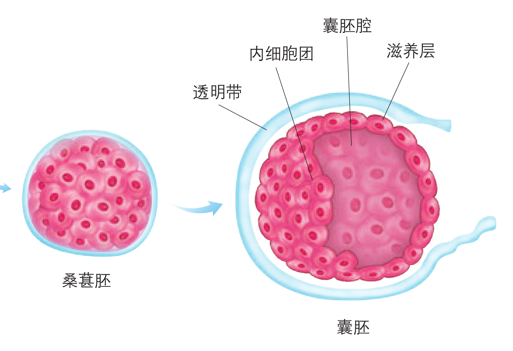
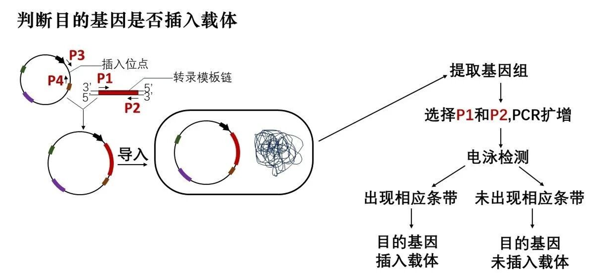
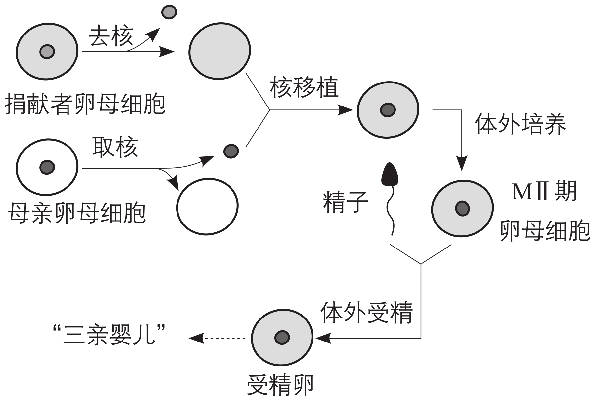
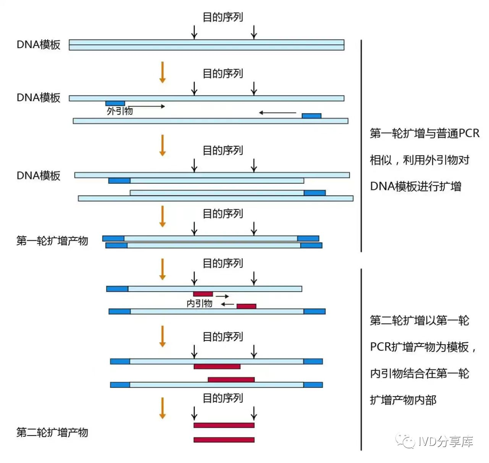
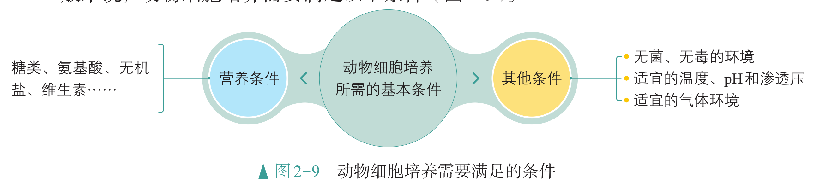

# 细胞的生命历程

## 细胞分裂

### 细胞分裂的分类

### 减数分裂的过程

## 细胞工程

细胞工程是指应用细胞生物学、分子生物学和发育生物学等多学科的原理和方法，通过细胞器、细胞或组织水平上的操作，有目的地获得特定的细胞、组织、器官、个体或其产品的一门综合性的生物工程。

生物技术是应用生命科学的研究成果，对生物或生物的成分、产物等进行改造和利用的技术。生物技术是一个综合性的技术体系，我们可以将它与工程学原理相结合，来进行研究、设计和加工生产，为社会提供服务。

### 植物细胞工程

| 时间 | 内容 |
| :--: | :--- |
| 1902 年 | **哈伯兰特**提出了细胞全能性的理论，但相关的实验尝试没有成功。 |
| 1958 年 | **斯图尔德**等发现胡萝卜的体细胞可以分化为胚，为细胞全能性理论提供了强有力的支持。 |
| 1960 年 | **科金**用真菌的纤维素酶分解番茄根的细胞壁，成功获得了原生质体。 |
| 1964 年 | **古哈**等在培养毛曼陀罗的花药时，首次得到了由花药中的花粉粒发育而来的胚。 |
| 1971 年 | **卡尔森**诱导烟草种间原生质体融合，获得了第一株体细胞种间杂种植株。 |
| 1974 年 | 土壤农杆菌的 Ti 质粒被发现。之后，该质粒应用于植物分子生物学领域，促进了植物细胞工程与分子生物学技术的紧密结合。 |

**细胞经分裂和分化后，仍然具有产生完整生物体或分化成其他各种细胞的潜能，即细胞具有全能性。**但是，在生物的生长发育过程中，并不是所有的细胞都表现出全能性，比如，芽原基的细胞只能发育为芽，叶原基的细胞只能发育为叶。这是因为在特定的时间和空间条件下，**细胞中的基因会选择性地表达**。**植物组织培养**是指将离体的植物器官、组织或细胞等，培养在人工配制的培养基上，给予适宜的培养条件，诱导其形成完整植株的技术。这些离体培养的植物器官、组织或细胞被称为外植体。

植物细胞一般具有全能性。在一定的激素和营养等条件的诱导下，已经分化的细胞可以经过脱分化，即失去其特有的结构和功能，转变成未分化的细胞，进而形成不定形的薄壁组织团块，这称为愈伤组织。愈伤组织能重新分化成芽、根等器官，该过程称为再分化。植物激素中生长素和细胞分裂素是启动细胞分裂、脱分化和再分化的关键激素，它们的浓度、比例等都会影响植物细胞的发育方向。将愈伤组织接种到含有特定激素的培养基上，就可以诱导其再分化成胚状体，长出芽和根，进而发育成完整的植株。

植物细胞外面有一层细胞壁，这层细胞壁阻碍着细胞间的杂交。因此，在进行体细胞杂交之前，必须先利用纤维素酶和果胶酶去除这层细胞壁，获得原生质体。杂交过程中的一个关键环节，是原生质体间的融合，这必须要借助一定的技术手段才能实现。人工诱导原生质体融合的方法基本可以分为两大类—物理法和化学法。物理法包括电融合法、离心法等；化学法包括聚乙二醇（PEG）融合法、高 $\ce{Ca^2+}$—高 $\pH$ 融合法等。融合后得到的杂种细胞再经过诱导可形成愈伤组织，并可进一步发育成完整的杂种植株。

{ width="100%" }

{ width="100%" }

**植物体细胞杂交是指将不同来源的植物体细胞，在一定条件下融合成杂种细胞，并把杂种细胞培育成新植物体的技术。**利用这项技术，科学家培育出了白菜—甘蓝、普通小麦—长穗偃麦草等杂种植株。植物体细胞杂交技术在打破生殖隔离，实现远缘杂交育种，培育植物新品种等方面展示出独特的优势。

植物细胞工程在农业、医药工业等方面有着广泛的应用，并且取得了显著的社会效益和经济效益。

- 快速繁殖：用于快速繁殖优良品种的植物组织培养技术，被人们形象地称为植物的快速繁殖技术，也叫作微型繁殖技术。它不仅可以高效、快速地实现种苗的大量繁殖，还可以保持优良品种的遗传特性。

- 作物脱毒：20 世纪 50 年代，科学家就发现植物顶端分生区附近（如茎尖）的病毒极少，甚至无病毒。因此，切取一定大小的茎尖进行组织培养，再生的植株就有可能不带病毒，从而获得脱毒苗。

- 单倍体育种：常规选育出一个可以稳定遗传的作物优良品种，一般要经过 $5\sim6$ 年的连续筛选。而单倍体育种可以先通过花药（或花粉）培养获得单倍体植株，然后经过诱导染色体加倍，当年就能培育出遗传性状相对稳定的纯合二倍体植株，这极大地缩短了育种的年限，节约了大量的人力和物力。单倍体育种已成为作物育种的一条有效途径。此外，由于大多数单倍体植株的细胞中只含有一套染色体，染色体加倍后得到的植株的隐性性状容易显现，因此它也是进行体细胞诱变育种和研究遗传突变的理想材料。

- 突变体的利用：在植物的组织培养过程中，由于培养细胞一直处于不断增殖的状态，因此它们容易受到培养条件和诱变因素（如射线、化学物质等）的影响而产生突变。从产生突变的个体中可以筛选出对人们有用的突变体，进而培育成新品种。

初生代谢是生物生长和生存所必需的代谢活动，因此在整个生命过程中它一直进行着。初生代谢物有糖类、脂质、蛋白质和核酸等。次生代谢不是生物生长所必需的，一般在特定的组织或器官中，并在一定的环境和时间条件下才进行。植物代谢会产生一些一般认为不是植物基本的生命活动所必需的产物—次生代谢物。次生代谢物是一类小分子有机化合物（如酚类、萜类和含氮化合物等），在植物抗病、抗虫等方面发挥作用，也是很多药物、香料和色素等的重要来源。

由于植物细胞的次生代谢物含量很低，从植物组织提取会大量破坏植物资源，有些产物又不能或难以通过化学合成途径得到，因此人们期望利用植物细胞培养来获得目标产物，这个过程就是细胞产物的工厂化生产。植物细胞培养是指在离体条件下对单个植物细胞或细胞团进行培养使其增殖的技术。它不占用耕地，几乎不受季节、天气等的限制，因此对于社会、经济、环境保护具有重要意义。

### 动物细胞工程

| 时间 | 内容 |
| :--: | :--- |
| 1890 年 | **希普**将安哥拉兔的胚胎移入比利时兔的输卵管内，得到了两只安哥拉兔，这是世界上胚胎移植成功的首例。 |
| 1907 年 | **哈里森**用一滴淋巴液成功培养了蝌蚪的神经元，首创了动物组织体外培养法。 |
| 1951 年 | **张明觉**等发现了哺乳动物精子的获能现象。 |
| 1958 年 | **格登**用非洲爪蟾进行体细胞核移植实验，成功培育出性成熟个体。同一时期，我国科学家 **童第周** 等开展了鱼类细胞核移植工作。 |
| 1959 年 | 试管家兔诞生。之后，多种试管动物相继出生。 |
| 1975 年 | **米尔斯坦** 和 **科勒** 等创立了单克隆抗体技术。 |
| 1978 年 | 小鼠的桑葚胚被成功分割。次年，科学家分割绵羊胚胎获得了同卵羔羊。 |
| 1981 年 | **埃文斯** 等成功分离和培养了小鼠的胚胎干细胞。 |
| 1996 年 | 世界上第一只体细胞克隆羊多莉在英国诞生。随后多种克隆动物相继问世。 |
| 2006 年 | **山中伸弥** 等获得了诱导多能干细胞。我国科学家用这种细胞培育出了小鼠。 |
| 2014 年 | 世界上第一个用单细胞基因组测序进行遗传病筛查的试管婴儿在我国诞生。 |
| 2017 年 | 我国科学家首次培育了体细胞克隆猴。 |

动物细胞工程常用的技术包括动物细胞培养、动物细胞融合和动物细胞核移植等，其中**动物细胞培养是动物细胞工程的基础**。人造皮肤的构建、动物分泌蛋白的规模化生产等，都离不开动物细胞培养。**动物细胞培养是指从动物体中取出相关的组织，将它分散成单个细胞，然后在适宜的培养条件下，让这些细胞生长和增殖的技术。**我们知道，动物体内的细胞之所以能够维持正常的生命活动，有些细胞还能不断增殖，是因为机体给这些细胞提供了适宜的条件，包括充足的营养、稳定的内环境等。在体外培养动物细胞，也需要满足类似的条件。

{ width="80%" }

- 营养：细胞在体外培养时，培养基中应含有细胞所需要的各种营养物质。将细胞所需的营养物质按种类和所需量严格配制而成的培养基，称为合成培养基。由于人们对细胞所需的营养物质尚未全部研究清楚，因此在使用合成培养基时，通常需要加入血清等一些天然成分。培养动物细胞一般使用液体培养基，也称为培养液。

- 无菌、无毒的环境：在体外培养细胞时，必须保证环境是无菌、无毒的，即需要对培养液和所有培养用具进行灭菌处理以及在无菌环境下进行操作。培养液还需要定期更换，以便清除代谢物，防止细胞代谢物积累对细胞自身造成危害。

- 温度、$\pH$ 和渗透压：维持细胞生存必须有适宜的温度。哺乳动物细胞培养的温度多以 $\pu{36.5 \pm 0.5 ^oC}$ 为宜。多数动物细胞生存的适宜 $\pH$ 为 $7.2\sim 7.4$。此外，渗透压也是动物细胞培养过程中需要考虑的一个重要环境参数。

- 气体环境：动物细胞培养所需气体主要有 $\ce{O2}$ 和 $\ce{CO2}$。$\ce{O2}$ 是细胞代谢所必需的，$\ce{CO2}$ 的主要作用是维持培养液的 $\pH$。在进行细胞培养时，通常采用培养皿或松盖培养瓶，并将它们置于含有 $95\%$ 空气和 $5\%$ 的 $\ce{CO2}$ 混合气体的 $\ce{CO2}$ 培养箱中进行培养。

在从动物体取出的成块组织中，细胞与细胞靠在一起，彼此限制了生长和增殖。因此，在进行细胞培养时，首先要对新鲜取材的动物组织进行处理，或用机械的方法，或用胰蛋白酶、胶原蛋白酶等处理一段时间，将组织分散成单个细胞。然后，用培养液将细胞制成细胞悬液，再将细胞悬液放入培养瓶或培养皿内，置于适宜环境中培养。体外培养的动物细胞可以分为两大类：一类细胞能够悬浮在培养液中生长增殖；另一类则需要贴附于某些基质表面才能生长增殖，大多数细胞属于这种类型，这类细胞往往贴附在培养瓶的瓶壁上，这种现象称为细胞贴壁。悬浮培养的细胞会因细胞密度过大、有害代谢物积累和培养液中营养物质缺乏等因素而分裂受阻。贴壁细胞在生长增殖时，除受上述因素的影响外，还会发生接触抑制现象，即当贴壁细胞分裂生长到表面相互接触时，细胞通常会停止分裂增殖。这时就需要对细胞进行分瓶培养，让细胞继续增殖。人们通常将分瓶之前的细胞培养，即动物组织经处理后的初次培养称为原代培养，将分瓶后的细胞培养称为传代培养。在进行传代培养时，悬浮培养的细胞直接用离心法收集；贴壁细胞需要重新用胰蛋白酶等处理，使之分散成单个细胞，然后再用离心法收集。之后，将收集的细胞制成细胞悬液，分瓶培养。

### 干细胞和 iPS 细胞

干细胞的培养成功是动物细胞培养领域重大的成就之一，在一定条件下，干细胞可以分化成其他类型的细胞。干细胞存在于早期胚胎、骨髓和脐带血等多种组织和器官中，包括胚胎干细胞和成体干细胞等。

胚胎干细胞（简称 ES 细胞）存在于早期胚胎中，具有分化为成年动物体内的任何一种类型的细胞，并进一步形成机体的所有组织和器官甚至个体的潜能，ES 细胞可以在体外分化成心肌细胞、神经元和造血干细胞等细胞。成体干细胞是成体组织或器官内的干细胞，包括骨髓中的造血干细胞、神经系统中的神经干细胞和睾丸中的精原干细胞等。一般认为，成体干细胞具有组织特异性，只能分化成特定的细胞或组织，不具有发育成完整个体的能力。造血干细胞是发现最早、研究最多、应用也最为成熟的一类成体干细胞，主要存在于成体的骨髓、外周血和脐带血中。

有着自我更新能力及分化潜能的干细胞，与组织、器官的发育、再生和修复等密切相关，因而在医学上有着广泛的应用。例如，将正常的造血干细胞移植到病人体内，恢复病人的造血和免疫功能，已成为治疗白血病及一些恶性肿瘤放疗或化疗后引起的造血系统、免疫系统功能障碍等疾病的一种重要手段；神经干细胞在治疗神经组织损伤和神经系统退行性疾病（如帕金森病、阿尔茨海默病等）方面有重要的应用价值。

胚胎干细胞必须从胚胎中获取，这涉及伦理问题，因而限制了它在医学上的应用。2006 年，科学家通过体外诱导小鼠成纤维细胞，获得了类似胚胎干细胞的一种细胞，将它称为诱导多能干细胞（简称 iPS 细胞），并用 iPS 细胞治疗了小鼠的镰状细胞贫血。现在，用 iPS 细胞治疗阿尔茨海默病、心血管疾病等领域的研究也取得了新进展。因为诱导过程无须破坏胚胎，而且 iPS 细胞可以来源于病人自身的体细胞，将它移植回病人体内后，理论上可以避免免疫排斥反应，所以科学家普遍认为 iPS 细胞的应用前景优于胚胎干细胞。

科学家已尝试采用多种方法来制备 iPS 细胞，包括借助载体将特定基因导入细胞中，直接将特定蛋白导入细胞中或者用小分子化合物等来诱导形成 iPS 细胞。iPS 细胞最初是由成纤维细胞转化而来的，后来发现已分化的 T 细胞、B 细胞等也能被诱导为 iPS 细胞。干细胞的研究正在如火如荼地开展。虽然将干细胞用于临床治疗还面临一些问题，如存在导致肿瘤发生的风险，但是我们相信，随着理论和技术的不断完善，干细胞将在再生医学、药物安全性与有效性检测等领域发挥大作用。

### 动物细胞融合技术

**动物细胞融合技术就是使两个或多个动物细胞结合形成一个细胞的技术**。融合后形成的杂交细胞具有原来两个或多个细胞的遗传信息。动物细胞融合与植物原生质体融合的基本原理相同。诱导动物细胞融合的常用方法有 PEG 融合法、电融合法和灭活病毒诱导法等。灭活是指用物理或化学手段使病毒或细菌失去感染能力，但并不破坏它们的抗原结构。灭活病毒诱导细胞融合的原理是：病毒表面含有的糖蛋白和一些酶能够与细胞膜上的糖蛋白发生作用，使细胞互相凝聚，细胞膜上的蛋白质分子和脂质分子重新排布，细胞膜打开，细胞发生融合。细胞融合技术突破了有性杂交的局限，使远缘杂交成为可能。人们可以按照预先的设计使不同细胞融合，至今，种间、属间、科间，甚至动物和植物之间的细胞融合都已获得了成功。目前，这一技术已经成为研究细胞遗传、细胞免疫、肿瘤和培育生物新品种等的重要手段，特别是利用动物细胞融合技术发展起来的杂交瘤技术，为制造单克隆抗体开辟了新途径。

早期人们为了获得抗体，就向动物体内反复注射某种抗原，使动物产生抗体，然后从动物血清中分离所需抗体。用这种方法制备的抗体不仅产量低、纯度低，而且特异性差。为了解决这一难题，科学家进行了多年的研究和探索。他们发现，哺乳动物感染病原体后，体内会形成相应的 B 淋巴细胞，这些细胞能分泌抗体，抗体识别并特异性结合病原体，从而抑制病原体的增殖等。动物体内产生的特异性抗体的种类超过百万种，但每一个 B 淋巴细胞只分泌一种特异性抗体。因此，要想获得大量的单一抗体，必须克隆单一的 B 淋巴细胞，形成细胞群。1975 年，英国科学家米尔斯坦和德国科学家科勒在前人工作的基础上，充分发挥想象力，设计了一个极富创造性的实验方案。他们想到，如果把一种 B 淋巴细胞与能在体外大量增殖的骨髓瘤细胞融合，所得到的融合细胞就可能大量增殖，产生足够数量的特定抗体。根据该设想，通过实验，他们得到了单克隆抗体。

1. 用特定的抗原对小鼠进行免疫，并从该小鼠的脾中得到能产生特定抗体的 B 淋巴细胞。

2. 用特定的选择培养基进行筛选：在该培养基上，未融合的亲本细胞和融合的具有同种核的细胞都会死亡，只有融合的杂交瘤细胞才能生长。

3. 对上述经选择培养的杂交瘤细胞进行克隆化培养和抗体检测，经多次筛选，就可获得足够数量的能分泌所需抗体的细胞。

4. 将抗体检测呈阳性的杂交瘤细胞在体外条件下大规模培养，或注射到小鼠腹腔内增殖。

5. 从细胞培养液或小鼠腹水中获取大量的单克隆抗体。

使用高效的细胞毒素类药物进行化疗可以有效杀伤肿瘤细胞。但细胞毒素没有特异性，在杀伤肿瘤细胞的同时还会对健康细胞造成伤害，这限制了它在临床上的应用。抗体—药物偶联物通过将细胞毒素与能特异性识别肿瘤抗原的单克隆抗体结合，实现了对肿瘤细胞的选择性杀伤。ADC 通常由抗体、接头和药物（如细胞毒素）三部分组成，它的作用机制如下图所示。

{ width="60%" }

单克隆抗体能准确地识别抗原的细微差异，与特定抗原发生特异性结合，并且可以大量制备，因此被广泛用作诊断试剂，在多种疾病的诊断和病原体鉴定中发挥重要的作用。例如，利用同位素或荧光标记的单克隆抗体在特定组织中成像的技术，可定位诊断肿瘤、心血管畸形等疾病。除前面介绍的单克隆抗体可以运载药物外，单克隆抗体自身也能用于治疗疾病。在医药领域，单克隆抗体药物占有非常重要的地位。

### 细胞核移植技术

**动物细胞核移植技术是将动物一个细胞的细胞核移入去核的卵母细胞中，使这个重新组合的细胞发育成新胚胎，继而发育成动物个体的技术。**哺乳动物核移植可以分为胚胎细胞核移植和体细胞核移植。由于动物胚胎细胞分化程度低，表现全能性相对容易，而动物体细胞分化程度高，表现全能性十分困难，因此动物体细胞核移植的难度明显高于胚胎细胞核移植。而在动物体细胞核移植中，非人灵长类动物的体细胞核移植非常困难。主要原因一方面是供体细胞的细胞核在去核卵母细胞中不能完全恢复其分化前的功能状态，这导致了胚胎发育率低；另一方面是对非人灵长类动物胚胎进行操作的技术尚不完善。

体细胞核移植技术在畜牧业、医药卫生以及其他领域有着广泛的应用前景。在畜牧生产中，利用体细胞核移植技术，可以加速家畜遗传改良进程、促进优良畜群繁育。在医药卫生领域，通过建立转基因体细胞系，再利用体细胞核移植技术培育的转基因克隆动物可以作为生物反应器，生产许多珍贵的医用蛋白；在治疗人类疾病时，转基因克隆动物的细胞、组织或器官可以用于异种移植；以患者作为供体培育的人核移植胚胎干细胞，经过诱导分化能形成相应的细胞、组织或器官，将它们移植给患者时可以避免发生免疫排斥反应。此外，研究克隆动物可使人类更深入地了解胚胎发育及衰老过程；克隆一批遗传背景相同的动物，可以通过它们之间的对比来分析致病基因；克隆特定疾病模型的动物，还能为研究该疾病的致病机制和开发相应的药物提供帮助。在保护濒危物种方面，该技术有望增加濒危物种的存活数量。

{ width="60%" }
/// caption
三亲婴儿
///

尽管通过体细胞核移植技术已经获得了多种克隆动物，但该技术的成功率仍然非常低，各个技术环节也有待进一步改进。相对于技术研究，核移植的理论研究较为滞后，需要与发育生物学、细胞生物学和分子遗传学等学科更深层次的理论研究相结合。此外，一些研究者指出，绝大多数克隆动物存在健康问题，许多克隆动物表现出遗传和生理缺陷，如体形过大、异常肥胖、发育困难、脏器缺陷和免疫失调等。总之，体细胞核移植技术的研究仍在继续深入，人类对克隆技术的应用还有许多问题需要解决。期待在不远的将来，克隆技术能更好地造福于人类。

## 胚胎工程

### 胚胎工程的理论基础

胚胎工程的迅猛发展让人们大量繁殖优良家畜品种的愿望，正在成为现实。**胚胎工程是指对生殖细胞、受精卵或早期胚胎细胞进行多种显微操作和处理**，然后将获得的胚胎移植到雌性动物体内生产后代，以满足人类的各种需求。胚胎工程技术包括体外受精、胚胎移植和胚胎分割等。胚胎工程的许多技术，实际上是在体外条件下，对动物自然受精和早期胚胎发育条件进行的模拟操作。因此，了解哺乳动物受精和早期胚胎发育的规律十分重要。

受精是精子与卵子结合形成合子（即受精卵）的过程，包括受精前的准备阶段和受精阶段。在自然条件下，哺乳动物的受精在输卵管内完成。

- 精子获能：科学研究发现，刚刚排出的精子不能立即与卵子受精，必须在雌性动物的生殖道发生相应的生理变化后，才能获得受精能力，这一生理现象称为“精子获能”。通过对精子获能机制的研究，科学家找到了使精子在体外获能的方法，实现了各种哺乳动物精子在体外条件下的获能，为体外受精技术的建立奠定了重要基础。使精子获能的方法有直接利用雌性动物的生殖道使精子获能；将精子培养在人工配制的获能液中使其获能等。获能液的成分因动物种类不同而有所差异，常见的有效成分有肝素、$\ce{Ca^2+}$ 载体等。

- 卵子的准备：卵子一般在排出 $\pu{2\sim3 h}$ 后才能被精子穿入。动物排出的卵子成熟程度不同，有的可能是初级卵母细胞，如马、犬等；有的可能是次级卵母细胞，如猪、羊等。但它们都要在输卵管内进一步成熟，到 MII 期时，才具备与精子受精的能力。

- 受精阶段：获能后的精子与卵子相遇时，首先它释放出多种酶，以溶解卵细胞膜外的一些结构，同时借助自身的运动接触卵细胞膜。随之，精子的细胞膜与卵细胞膜融合，卵细胞膜外的透明带迅速发生生理反应，阻止后来的精子进入透明带。精子入卵后，卵细胞膜也会立即发生生理反应，拒绝其他精子再进入卵内。精子入卵后，尾部脱离，原有的核膜破裂并形成一个新的核膜，最后形成一个比原来精子的核还大的核，叫作雄原核。与此同时，精子入卵后被激活的卵子完成减数分裂Ⅱ，排出第二极体后，形成雌原核。雄、雌原核充分发育后，相向移动，彼此靠近，核膜消失。这个含有两个染色体组的合子就是受精卵。受精过程结束后，受精卵的发育也就开始了。

{ width="100%" }

多数哺乳动物的第一极体不进行减数分裂Ⅱ，因而不会形成两个第二极体。在实际胚胎工程操作中，常以观察到两个极体或者雌、雄原核作为受精的标志。受精卵形成后即在输卵管内进行有丝分裂，开始发育。胚胎发育早期，有一段时间是在透明带内进行分裂，细胞的数量不断增加，但胚胎的总体积并不增加，这种受精卵的早期分裂称为卵裂。根据胚胎形态的变化，可将早期发育的胚胎分为以下几个阶段。

- 桑葚胚：当卵裂产生的子细胞逐渐形成致密的细胞团，形似桑葚时，这时的胚胎称为桑葚胚。

- 囊胚：胚胎进一步发育，细胞继续分化。聚集在胚胎一端的细胞形成内细胞团，将来发育成胎儿的各种组织；而沿透明带内壁扩展和排列的细胞，称为滋养层细胞，它们将来发育成胎膜和胎盘。

{ width="60%" }

随着胚胎的进一步发育，胚胎的内部出现了含有液体的腔—囊胚腔，这个时期的胚胎叫作囊胚。囊胚进一步扩大，透明带破裂，胚胎从其中伸展出来，这一过程叫作孵化。孵化非常重要，如果不能正常孵化，胚胎就无法继续发育。囊胚孵化后，将发育形成原肠胚。原肠胚表面的细胞层为外胚层，向内迁移的细胞形成内胚层。随着发育的进行，一部分细胞还会在内、外两个胚层之间形成中胚层。这三个胚层将逐渐分化形成各种组织、器官等。

### 胚胎工程技术及其应用

胚胎工程技术包含的内容很丰富，目前在医学和生产上应用较多的是体外受精、胚胎移植和胚胎分割等，借助这些技术，可以进一步挖掘动物的繁殖潜力。

通过人工操作使卵子在体外受精，经培养发育为早期胚胎后，再进行移植产生的个体。体外受精技术是提高动物繁殖能力的有效措施，还可以为胚胎移植提供可用的胚胎。在这个过程中，首先要做的就是体外受精。哺乳动物的体外受精技术主要包括卵母细胞的采集、精子的获取和受精等步骤。采集到的卵母细胞和精子，要分别在体外进行成熟培养和获能处理，然后才能用于体外受精。一般情况下，可以将获能的精子和培养成熟的卵子置于适当的培养液中共同培养一段时间，来促使它们完成受精。

{ width="80%" }

胚胎移植是指将通过体外受精及其他方式得到的胚胎，移植到同种的、生理状态相同的雌性动物体内，使之继续发育为新个体的技术。其中提供胚胎的个体称为“供体”，接受胚胎的个体叫“受体”。通过任何一项技术（如转基因、核移植和体外受精等）获得的胚胎，都必须移植给受体才能获得后代。以牛的胚胎移植为例，胚胎移植主要包括供体、受体的选择和处理，配种或人工授精，胚胎的收集、检查、培养或保存，胚胎的移植，以及移植后的检查等步骤。

{ width="100%" }

进行胚胎移植的优势是可以充分发挥雌性优良个体的繁殖潜力。在这项技术中，供体的主要职能变为产生具有优良遗传特性的胚胎，繁重而漫长的妊娠和育仔任务由受体取代，这就大大缩短了供体本身的繁殖周期。同时，在对供体施行超数排卵处理后，可获得多枚胚胎，经移植可得到多个后代，这使供体的后代数是自然繁殖的十几倍到几十倍。超数排卵是指应用外源促性
腺激素，诱发卵巢排出比自然情况下更多的成熟卵子。

胚胎分割
早期胚胎细胞具有很强的分裂能力，并保持着细胞全
能性，能不能将一个胚胎分割成几份，从而提高胚胎的利
用率？基于这样的设想，胚胎分割技术逐渐发展成熟。
胚胎分割（embryo splitting）是指采用机械方法将早期胚
胎切割成2等份、4等份或8等份等，经移植获得同卵双胎或
多胎的技术。来自同一胚胎的后代具有相同的遗传物质，因
此胚胎分割可以看作动物无性繁殖或克隆的方法之一。
胚胎分割所需要的主要仪器设备为体视显微镜和显微
操作仪（图2 - 24）。在进行胚胎分割时，应选择发育良好、
形态正常的桑葚胚或囊胚，将它移入盛有操作液的培养皿
中，然后在显微镜下用分割针或分割刀分割。在分割囊胚
阶段的胚胎时，要注意将内细胞团均等分割。对于不同发育阶段的胚胎，分割的具体操作不完全相同。分割后的胚
胎可以直接移植给受体，或经体外培养后，再移植给受体。
经过40多年的发展，胚胎分割技术日趋成熟。这项技
术可以促进优良动物品种的繁殖，产生的遗传性状相同的
后代是进行遗传学研究的宝贵材料。此外，在胚胎移植前，
进行性别鉴定、遗传病筛查等，对于人工控制动物性别、
动物繁育健康后代具有重要意义（图2 - 25）。

1978年，科学家将小鼠的桑葚胚一分
为二，获得了成功。1979年，科学家分割
绵羊胚胎获得了同卵羔羊。20世纪80年代
后，人们建立了系统的胚胎分割方法，并相
继得到1/4和1/8分割胚胎的后代。我国的胚
胎工程专家也进行了分割胚胎移植的实验研
究，成功地对小鼠、家兔、绵羊、山羊和牛
等动物进行了分割胚胎移植，并将二分胚胎
分割技术应用到牛和羊的胚胎移植中。
尽管胚胎分割技术已经在多种动物中
取得成功，但仍存在一些问题，如刚出生
的动物体重偏低，毛色和斑纹可能存在差异
胚胎分割的发展简史
等。实践证明，采用胚胎分割技术产生同卵
多胚的可能性是有限的，分割次数越多，分
割后胚胎成活的概率越小。目前，仍然以二
分胚胎的分割和移植效率最高，这成为提高
家畜胚胎利用率的手段之一。
