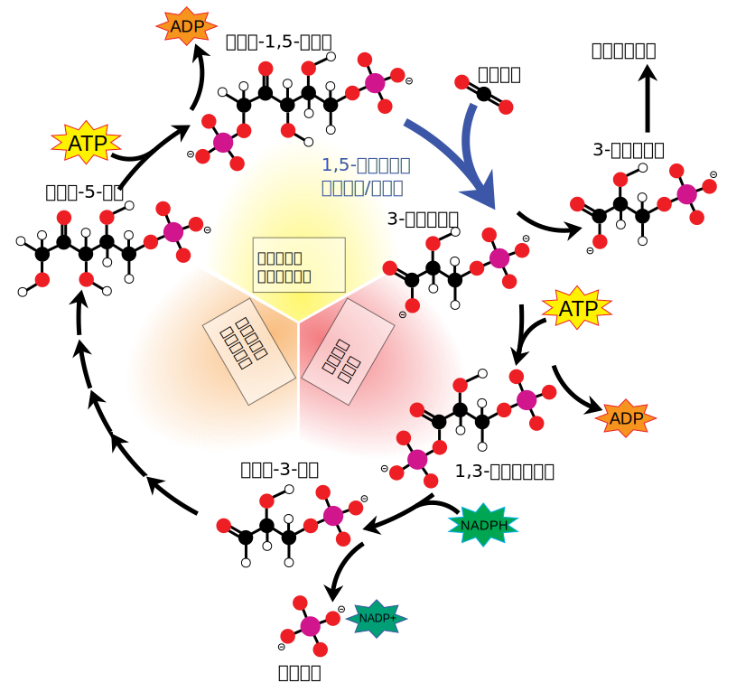

# 光合作用与光呼吸

## 光合作用

在植物工厂里，人工光源可以为植物的生长源源不断地提供能量。在自然界，则是万物生长靠太阳。太阳光能的输入、捕获和转化，是生物圈得以维持运转的基础。光合作用（photosynthesis）是唯一能够捕获和转化光能的生物学途径。因此，有人称光合作用是“地球上最重要的化学反应”。无论是在植物工厂里，还是在自然界，植物捕获光能要依靠特定的物质和结构。

{width="80%"}

光合作用的强度（简单地说，就是指植物在单位时间内通过光合作用制造糖类的数量），直接关系农作物的产量，研究影响光合作用强度的环境因素很有现实意义。

根据光合作用的反应式可以知道，光合作用的原料 —— 水、CO2，动力 —— 光能，都是影响光合作用强度的因素。因此，只要影响到原料、能量的供应，都可能是影响光合作用强度的因素。例如，环境中 CO2 浓度，叶片气孔开闭情况，都会因影响 CO2 的供应量而影响光合作用的进行。叶绿体是光合作用的场所，影响叶绿体的形成和结构的因素，如无机营养、病虫害，也会影响光合作用强度。此外，光合作用需要众多的酶参与，因此影响酶活性的因素（如温度），也是影响因子。

### 绿叶中色素的提取和分离

对于高等植物来说，叶片是进行光合作用的主要器官。这些植物的叶片多数是绿色的，说明其中有绿色的色素。在玉米地里，有时可以看到叶片中不含绿色色素的白化苗。这样的白化苗，待种子中储存的养分耗尽就会死去。可见，叶片中的色素可能与光能的捕获有关。

课本实验“绿叶中色素的提取和分离”是高中生物中非常经典且重要的实验，它通过物理化学方法揭示了植物光合作用的物质基础。下面我为你详细解析实验的原理、步骤要点以及结果分析。实验原理：

1. **提取原理**：叶绿体中的色素属于有机物，不溶于水，但能溶解在有机溶剂中（如无水乙醇、丙酮等）。因此，我们利用无水乙醇作为**提取液**，将色素从破碎的细胞中“泡”出来。
2. **分离原理**：这涉及到**纸层析法**。不同色素在层析液（一种脂溶性很强的溶剂）中的**溶解度不同**。溶解度高的色素随层析液在滤纸上扩散得快；溶解度低的则扩散得慢。经过一段时间，原本混合在一起的色素就会因“跑”的速度不同而分离开来。

关键试剂的作用：

- **无水乙醇**：作为提取剂，溶解色素。
- **二氧化硅（SiO₂）**：增加摩擦力，使研磨更加充分，从而破坏细胞结构释放色素。
- **碳酸钙（CaCO₃）**：**极其重要**。研磨时细胞中的有机酸会释放，酸性环境会破坏叶绿素分子（使其脱镁）。加入碳酸钙可以中和有机酸，保护色素不被破坏。
- **层析液**：作为流动相，利用溶解度差异分离色素。

操作步骤的深度细节：

1. **提取色素（研磨与过滤）**：
    - **研磨要迅速**：目的是防止乙醇挥发，并减少色素被空气氧化。
    - **尼龙布过滤**：不能用滤纸过滤，因为滤纸会大量吸附色素，导致滤液浓度过低。
2. **制备滤纸条**：
    - **剪去两角**：目的是防止层析液在滤纸边缘扩散过快，导致色素带呈现弧形而非整齐的直线。
3. **画滤液细线**：
    - **要求**：细、齐、直。
    - **重复**：待滤液干后，需重复画 2-3 次，目的是积聚更多的色素，使分离后的色素带更加清晰明显。
4. **色素分离（层析）**：
    - **关键点**：层析液**绝不能触及**滤液细线。如果触碰，细线上的色素会直接溶解到烧杯里的层析液中，导致实验失败，滤纸条上什么也跑不出来。
    - **密封**：层析时需加盖，防止层析液中的有毒挥发性物质扩散到空气中。

实验结果：四条彩虹带。层析结束后，滤纸条上从上到下（即从扩散最快到最慢）依次出现四条色素带。

1. **胡萝卜素**：**橙黄色**，最快（溶解度最高），最窄（含量最少）。
2. **叶黄素**：**黄色**，次之。
3. **叶绿素 a**：**蓝绿色**，较慢，**最宽**（含量最多，约占 3/4 中的大部分）。
4. **叶绿素 b**：**黄绿色**，最慢（溶解度最低），较宽。

**总结**：这个实验成功与否，很大程度上取决于研磨时色素是否得到了充分保护（CaCO₃），以及画线和层析时操作的规范性。

### 叶绿素

叶绿素是光合作用中最核心的色素，主要存在于叶绿体的类囊体薄膜上。它不仅是植物呈现绿色的原因，更是将太阳能转化为化学能的关键“机器”。种类与分布：

- **主要类型**：高等植物中主要含有**叶绿素 a**（蓝绿色）和**叶绿素 b**（黄绿色）。在所有光合放氧生物中，叶绿素 a 是必需的。
- **比例**：在正常绿叶中，叶绿素的含量约占色素总量的 3/4，其中叶绿素 a 与叶绿素 b 的比例约为 3:1。

光谱吸收特性：

- **吸收区域**：叶绿素主要吸收**红光**和**蓝紫光**。
    - **叶绿素 a**：吸收峰分别在波长 430 nm（蓝紫）和 662 nm（红）附近。
    - **叶绿素 b**：吸收峰分别在波长 453 nm（蓝）和 642 nm（红橙）附近。
- **为什么是绿色的**：叶绿素对**绿光**的吸收最少，绿光会被反射或透过，因此我们看到的叶片呈现绿色。

分子结构与成分：

- **核心结构**：叶绿素分子包含一个**卟啉环**，其中心含有一个**镁原子（Mg）**。
- **营养需求**：镁是合成叶绿素的必需元素，若植物缺镁，叶绿素无法合成，叶片会发黄（失绿症）。
- **疏水尾部**：分子末端有一条长长的疏水“尾巴”（叶醇基），使叶绿素分子能牢牢地锚定在类囊体薄膜的脂双层中。

生物学功能：

- **能量捕获（天线色素）**：绝大多数叶绿素分子像天线一样吸收并传递光能。
- **能量转换（反应中心）**：极少数特殊状态的叶绿素 a（如 P680 和 P700）构成**反应中心**。它们受光激发后会释放高能电子，实现光能向电能的转换，这是光反应的起始点。

环境影响因素：

- **光的诱导**：叶绿素的形成需要光。避光生长的豆芽呈黄色（黄化现象），见光后才能合成叶绿素变绿。
- **季节变化**：秋季气温降低，叶绿素分子变得不稳定并易被破坏，而类胡萝卜素较稳定，导致叶片显现出黄色。

叶绿素在光合作用中通过捕获光能，驱动了水分子的裂解和 ATP、NADPH 的合成，为后续合成糖类提供了动力。

### 叶绿体

叶绿体是绿色植物进行光合作用的核心细胞器，被誉为植物细胞的“养料制造车间”和“能量转换站”。

叶绿体通常呈扁平的椭球形或球形，由**双层膜**包被。其内部结构设计极大地增加了光合作用的有效面积：

- **类囊体与基粒**：叶绿体基质中悬浮着许多扁平的囊状结构，称为**类囊体**。类囊体叠集成**基粒**，这种结构使光吸收面积最大化（1 克菠菜叶片的类囊体总面积可达约 60 平方米）。
- **基质**：内膜与类囊体之间的浓稠液体，含有固定二氧化碳所需的酶，以及少量的 **DNA、RNA 和核糖体**。

光合色素：光的“捕获者”光合色素分布在**类囊体薄膜**上。主要分为两类：

- **叶绿素（约占 3/4）**：包括**叶绿素 a**（蓝绿色）和**叶绿素 b**（黄绿色），主要吸收蓝紫光和红光。
- **类胡萝卜素（约占 1/4）**：包括**胡萝卜素**（橙黄色）和**叶黄素**（黄色），主要吸收蓝紫光。
- **绿光反射**：由于这些色素基本不吸收绿光，绿光被反射或透过，使叶片呈现绿色。

功能：能量转换的两个阶段。叶绿体通过两个相互联系的阶段将光能转化为化学能：

- **光反应（在类囊体薄膜进行）**：色素捕获光能，将水分解并释放氧气，同时产生 **ATP 和 NADPH**（活跃化学能）。
- **碳反应/暗反应（在基质中进行）**：利用光反应提供的 ATP 和 NADPH，将二氧化碳固定并还原为**糖类**（稳定的化学能）。

生物学特性：半自主与起源。叶绿体具有一定的**遗传独立性**，能合成部分自身所需的蛋白质。科学界普遍认为叶绿体起源于被古代真核细胞吞噬的**光合细菌**（内共生起源学说）。

**实验验证**：恩格尔曼通过水绵实验证明，叶绿体受光部位会释放氧气，直接证实了它是**光合作用的场所**。

### 光合作用概述

光合作用是生物界乃至整个自然界最基础的代谢过程。光合作用是指绿色植物、藻类以及某些细菌（如蓝细菌）利用光能，通过叶绿体或光合片层，将二氧化碳和水（或硫化氢等无机物）转化成储存着能量的有机物（如糖类），并释放出氧气（或硫）的过程。根据产物不同，可分为**产氧光合作用**（利用水并释放氧气）和**不产氧光合作用**（如某些细菌利用硫化氢并释放硫）。

人类对光合作用的认识经历了从直观推测到定量实验，再到分子水平研究的漫长过程：

- **土壤源泉说**：亚里士多德曾认为植物生长所需的物质全部来自土壤。
- **柳树实验（1642 年）**：比利时人海尔蒙特通过五年的盆栽柳树实验发现，土壤质量几乎未减，从而推论植物生长主要来源于水而非土壤。
- **空气净化实验（1771 年）**：普里斯特利通过薄荷枝条和蜡烛、小鼠的实验，证明植物能“净化”被污浊的空气。
- **光的重要性（1779 年）**：英格豪斯发现只有植物的绿色部分在光照下才能净化空气。
- **能量转化（1845 年）**：迈尔根据能量守恒定律指出，植物在光合作用时把光能转换成化学能储存。
- **淀粉生成（1864 年）**：萨克斯通过叶片一半曝光、一半遮光的对比实验，证实光合作用产生了淀粉。
- **场所与光谱（1880 年）**：恩格尔曼利用水绵和好氧细菌证明，叶绿体是光合作用的场所，且红光和蓝紫光效率最高。
- **氧气来源（1941 年）**：鲁宾和卡门利用 $^{18}\text{O}$ 同位素标记法，确证光合作用释放的氧气全部来自水。
- **卡尔文循环（1945-1957 年）**：卡尔文用 $^{14}\text{C}$ 标记二氧化碳，探明了碳在光合作用中转化成有机物的具体途径。

光合作用被誉为“地球上最重要的化学反应”，其意义远超生物学范畴：

1. **物质与能量源泉**：它为生物圈中几乎所有生物提供食物和能量来源。
2. **维持碳氧平衡**：通过吸收二氧化碳、释放氧气，光合作用对维持大气成分的相对稳定和减缓温室效应起着至关重要的作用。
3. **化石燃料的根基**：人类目前使用的煤炭、石油、天然气，本质上都是古代植物通过光合作用固定的太阳能。
4. **演化推动力**：由于蓝细菌等早期光合生物释放氧气，才催生了需氧生物的繁衍和陆生生物的出现。

### 化能合成作用

化能合成作用（Chemosynthesis）是自养生物（主要是原核生物）不利用光能，而是利用体外环境中的无机物氧化时所释放的化学能，将二氧化碳和水合成糖类的过程。

与光合作用类似，化能合成作用也是一个**氧化还原过程**，但其能量来源完全不同：

- **能量捕获**：生物通过氧化还原电位较高的无机物（如 $NH_3$、$H_2S$、$Fe^{2+}$、$H_2$）获取高能电子。
- **碳固定**：利用氧化释放的化学能推动类似卡尔文循环的反应，将 $\ce{CO2}$ 还原为有机物（如糖类），并储存能量。
- **生态地位**：这些生物是稀有生态系统（如深海、黑洞穴）中的**生产者**，支撑着不依赖阳光的生物圈。

模式生物及其生化反应：

- **硝化细菌**：包括亚硝酸细菌（如*Nitrosomonas*）和硝酸细菌（如*Nitrobacter*）。它们在氮循环中至关重要，能将植物难以利用的铵盐转化为易吸收的硝酸盐。
- **硫细菌**：例如*Beggiatoa*，能在黑暗中氧化 $H_2S$ 产生单质硫。在深海热泉，这类细菌是管虫、贻贝等生物的共生伙伴，为其提供营养。
- **产甲烷古菌**：这是一类极其古老的化能自养生物。例如*Methanococcus jannaschii*，它利用从热水口排放的 $H_2$ 还原 $\ce{CO2}$ 产生甲烷，并在此过程中泵送质子以合成 ATP。
- **氢细菌**：利用分子氢氧化产生的能量同化二氧化碳，通常为兼性化能自养菌。

“生命摇篮”深海热泉与进化？化能合成作用被认为是地球上**最古老的生物自养过程**，甚至早于光合作用：

- **代谢起源说**：该假说认为生命起源于热液喷口附近的化学反应，逐渐发展出基于质子梯度的代谢结构。
- **极端环境适应**：这些生物多为**嗜极生物**（Extremophiles），能在高温（可达 350℃）、高压、强酸或高盐的极端环境下生存，反映了早期地球的生存条件。
- **大气重塑的前奏**：在产氧光合生物出现前，化能自养生物是地球化学循环的主导者，它们将碳元素从大气转移至岩石圈（形成碳酸盐），对调节地球早期气温起到了作用。

化能合成细菌在现代生物技术中也有重要应用：

- **环境修复**：利用嗜油细菌降解原油污染，或利用工程菌吸收环境中的重金属。
- **湿法冶金**：利用微生物的氧化还原特性，将矿石中的金属溶解并提取出来，具有低污染、高回收的优点。

化能合成作用展示了生命极强的适应性。

### 探究环境因素对光合作用强度的影响

这份探究实验的核心是通过**小圆形叶片浮起法**（叶片真空渗入法）来定量测量光合作用强度。其背后的生物学逻辑非常严密，我们可以从实验设计、原理和环境因子三个维度来深度拆解：

- **抽气处理（关键步骤）**：利用注射器造成负压，将叶肉细胞间隙中的空气排出，代之以液体，使叶片由于密度增大而沉入水底。
- **$\ce{CO2}$ 的定额供应**：实验中使用 $NaHCO_3$ 溶液（通常为 1%~2%）。它在水中充当 $\ce{CO2}$ 缓冲液，能持续稳定地提供光合作用所需的原料，保证 $\ce{CO2}$ 浓度不成为限制实验的变量。
- **自变量的控制**：通过改变台灯与烧杯的距离来调节**光照强度**。距离越近，单位面积接收的光子越多，光反应产生的 $[H]$ 和 ATP 就越多。

为什么“叶片浮起”能代表光合速率？

- **浮起机制**：叶片沉在水底时只进行呼吸作用。一旦光照开启，光反应裂解水产生的 **$\ce{O2}$** 会填充进叶肉细胞的间隙。随着 $\ce{O2}$ 的积累，叶片浮力增大，最终浮起。
- **净光合速率**：注意，实验测得的是**净光合速率**。因为在叶片制造 $\ce{O2}$ 的同时，线粒体也在消耗 $\ce{O2}$ 进行呼吸作用。只有当光合产生的 $\ce{O2}$ 超过呼吸消耗的 $\ce{O2}$ 时，多余的气体才会让叶片浮起。因此，单位时间内浮起的叶片数越多，说明净光合强度越大。

影响光合强度的“三驾马车”除了光照强度，你还可以根据这个实验框架更换变量：

- **$\ce{CO2}$ 浓度**：配置不同浓度的 $NaHCO_3$ 溶液。在一定范围内，光合速率随 $\ce{CO2}$ 浓度升高而增加，直到达到饱和。
- **温度**：使用恒温水浴。温度主要通过影响**酶的活性**来影响暗反应（卡尔文循环）的速率。
- **光质（光色）**：在台灯上罩不同颜色的玻璃纸。由于叶绿素主要吸收**红光和蓝紫光**，在这两种光下叶片浮起的速度通常比绿光下快得多。

实验异常现象分析：

- **光饱和点**：如果距离缩短到一定程度后，叶片浮起速度不再加快，说明已达到**光饱和点**。此时限制因素可能是 $\ce{CO2}$ 浓度或温度。
- **光补偿点**：如果光线极弱，叶片可能永远不会浮起。这意味着此时的光合强度小于或等于呼吸强度，即处于或低于**光补偿点**。

## 光反应阶段

### 光反应概述

一般来说，光合作用是指绿色植物通过叶绿体，利用光能，将二氧化碳和水转化成储存着能量的有机物，并且释放出氧气的过程。这一过程可以用下面的化学反应式来概括，其中（CH₂O）表示糖类。

$$
\ce {CO2 + H2O ->[光能][叶绿体] (CH2O) + O2}
$$

自然界中到处都有二氧化碳、水和阳光，然而，能够利用它们合成有机物的却只有进行光合作用的细胞。完成这一神奇过程的就是叶绿体。

在大学生物学中，高中所学的“光反应”和“暗反应”会被拆解为更精确的分子机制和代谢途径。光反应在大学阶段通常被称为 **光合电子传递反应**，它主要对应两种电子流动方式：

- **非循环电子传递（Non-cyclic electron flow）**：这是光反应的主要形式，涉及光系统 II（PSII）和光系统 I（PSI）的协同工作。它通过裂解水产生 $\ce {O2}$、ATP 和 NADPH。
- **循环电子传递（Cyclic electron flow）**：仅涉及光系统 I（PSI）。它不产生 NADPH 和 $\ce {O2}$，仅产生 ATP，用于调节细胞内 ATP 与 NADPH 的比例平衡。

这段课本内容通过三个核心实验，展示了人类如何从猜测走向实证，最终揭示光合作用本质的过程。我们可以结合大学生物化学的视角，对这些实验进行深度拆解：

1. 希尔反应（1937 年）：打破“二氧化碳分解释放氧气”的旧观念。在希尔（R. Hill）之前，人们普遍认为光合作用释放的氧气来自 $\ce {CO2}$。希尔最巧妙的贡献在于实现了 **反应体系的简化与分离**。

    - **实验核心**：他将离体的叶绿体放入盛有水和高铁盐（作为电子受体）的容器中，但不提供 $\ce {CO2}$。在光照下，他观察到了氧气的释放。
    - **深度解读**：
        - **独立性**：该实验证明了水的光解（光反应的一部分）可以不依赖于糖的合成（碳反应）而独立发生。
        - **电子受体的本质**：实验中的高铁盐（$\ce {Fe^{3+}}$）起到了氧化剂的作用。在真实的叶绿体中，这个位置对应的是 **$\ce {NADP^{+}}$**。
    - **回答讨论**：希尔反应说明氧气可以在没有 $\ce {CO2}$ 的情况下产生，暗示了水光解与糖合成是两个 **相对独立** 的过程，但直到鲁宾和卡门的实验才彻底证明了氧气中的氧元素 **全部** 来自水。

2. 鲁宾和卡门实验（1941 年）：氧气来源的“终极判决”。希尔反应虽然暗示了水是氧源，但并没有直接追踪氧原子的流向。鲁宾和卡门利用了当时最前沿的技术 ——**同位素标记法**。

    - **实验逻辑**：他们分别标记了 $\ce {H2O}$ 和 $\ce {CO2}$ 中的氧原子（使用 $\ce {^{18} O}$）。
        - 提供 $\ce {H2O + C^{18} O2}$ → 释放的氧气是 $\ce {O2}$
        - 提供 $\ce {H2^{18} O + CO2}$ → 释放的氧气是 $\ce {^{18} O2}$
    - **结论**：这个实验提供了无可辩驳的直接证据，证明了光合作用释放的 **$\ce {O2}$ 全部来自 $\ce {H2O}$**。

3. 阿尔农实验（1954、1957 年）：发现能量的转化机器。如果说前两个实验搞清楚了“氧气从哪来”，阿尔农（D. Arnon）则搞清楚了“光能存到哪去”。

    - **重大发现**：他首先在光照下观察到叶绿体能合成 **ATP**（光合磷酸化）。随后他发现这一过程与水的光解是相伴发生的。
    - **深度解读**：这标志着人们认识到光能不仅仅是被用来“劈开”水分子，更被转换成了活跃的化学能储存在 **ATP** 和 **NADPH** 中。

**总结**：ATP 合成与希尔反应的关系。两者通过 **电子传递链** 耦合在一起：

1. **光能** → 被色素捕获
2. **希尔反应**：水裂解产生电子（$\ce {e^-}$）、质子（$\ce {H^{+}}$）和 $\ce {O2}$
3. **电子流**：电子在传递链中流动释放能量，泵送 $\ce {H^{+}}$ 形成跨膜梯度
4. **ATP 合成**：质子梯度驱动 **ATP 合酶**，利用 ADP 和 Pi 合成 ATP

光合作用释放的氧气中的氧元素来自水，氧气的产生和糖类的合成不是同一个化学反应，而是分阶段进行的。实际上，光合作用的过程十分复杂，它包括一系列化学反应。根据是否需要光能，这些化学反应可以概括地分为 **光反应（light reaction）** 和 **暗反应（dark reaction，现在也称为碳反应，carbon reaction）** 两个阶段。

**光反应阶段** 是光合作用第一个阶段的化学反应，必须有光才能进行，这个阶段叫作光反应阶段。光反应阶段是在 **类囊体的薄膜上** 进行的。叶绿体中光合色素吸收的光能，有以下两方面用途：

**一是将水分解为氧和 $\ce {H^{+}}$**，氧直接以氧分子的形式释放出去，$\ce {H^{+}}$ 与氧化型辅酶 Ⅱ（$\ce {NADP^{+}}$）结合，形成还原型辅酶 Ⅱ（$\ce {NADPH}$）。$\ce {NADPH}$ 作为活泼的还原剂，参与暗反应阶段的化学反应，同时也储存部分能量供暗反应阶段利用；

**二是在有关酶的催化作用下**，提供能量促使 ADP 与 Pi 反应形成 ATP。这样，光能就转化为储存在 ATP 中的化学能。这些 ATP 将参与第二个阶段合成有机物的化学反应。

水分解为氧和 $\ce {H^{+}}$ 的同时，被叶绿体夺去两个电子。电子经传递，可用于 $\ce {NADP^{+}}$ 与 $\ce {H^{+}}$ 结合形成 $\ce {NADPH}$。

**调压与保险机制**。如果你想更全面地理解光反应，还可以补充两个细节：

- **调节机制（循环电子流）**：有时候植物不需要产生 $\ce {NADPH}$，光能会被专门用来进行“循环电子传递”，此时光能只用于产生 ATP，而不产生 $\ce {NADPH}$ 和 $\ce {O2}$。这通常是为了弥补卡尔文循环对 ATP 额外量的需求。
- **能量耗散（热能）**：并不是所有的光能都会被成功转化为化学能。当光照过强时，部分能量会以 **热能** 的形式耗散掉（非光化学猝灭），以保护叶绿体不被“烧坏”。

简单来说，课本抓住了“生产”的主干，而实际过程中还有“调压”和“保险”机制。

### 光系统

光系统是参与光合作用的蛋白质复合物的功能和结构单元，一起进行光合作用主要的光化学作用：光的吸收和转移能量和电子。光系统存在于植物、藻类和蓝细菌的类囊体膜中。类囊体位于植物和藻类的叶绿体中，以及光合细菌的细胞质膜中。存在两种光系统：**光系统 II** 和 **光系统 I**。

光系统的核心是 **反应中心**，它是一种利用光来还原分子（提供电子）的酶。该反应中心被光捕获复合物包围，以增强光的吸收。

在光系统中有两种反应中心：

- **I 型反应中心**（例如叶绿体中的光系统 I（P700）和绿硫细菌）
- **II 型反应中心**（例如叶绿体中的光系统 II（P680）和非硫紫色菌）

每个光系统可以通过其最具反应性的光的波长（对于叶绿体中的 PSI 和 PSII 分别为 **700 和 680 纳米**），光捕获复合物的数量和类型，以及所用的末端电子受体的类型来区分。

- **I 型光系统** 使用铁氧化物样铁 - 硫簇蛋白作为末端电子受体
- **II 型光系统** 最终将电子穿梭到醌末端电子受体

两种反应中心类型都存在于叶绿体和蓝细菌中，并且共同形成独特的光合链，能够从水中提取电子，从而产生作为副产物的氧气。

**结构体**：反应中心包含几（多于 24 或多于 33）个蛋白质亚基，其为一系列辅因子提供支架。辅因子可以是色素（如叶绿素、脱镁叶绿素、类胡萝卜素）、醌或铁 - 硫簇。

**光系统 I 和 II 之间的关系**：对于含氧光合作用，需要光系统 I 和光系统 II。有氧光合作用可以通过植物和蓝细菌进行；蓝细菌被认为是含有光系统的真核生物叶绿体的祖细胞。不能产生氧气的光合细菌具有与之相似的单一光系统。

当光系统 II 吸收光时，反应中心叶绿素中的电子被激发到更高的能级并被初级电子受体捕获。光激发的电子通过设置在类囊体膜中的电子传递链穿过 **细胞色素 $\ce {b6f}$ 蛋白复合体** 到达光系统 I。利用这种能量降低（整个过程称为化学渗透），将氢离子（$\ce {H^{+}}$）通过膜输送到类囊体腔中，以提供类囊体腔与叶绿体基质之间的潜在能量差异，相当于可用于产生 ATP 的质子动力。质子由质体醌运输。如果电子仅通过一次，则该过程称为非循环光合磷酸化。

当电子到达光系统 I 时，它填充光系统 I 的反应中心叶绿素的电子缺陷。当 ATP 合酶将存在于管腔中的质子通过膜转运到基质时产生 ATP。电子可以继续通过 PS I 周围的循环电子传递或通过铁氧还蛋白传递给酶 $\ce {NADP^{+}}$ 还原酶。将电子和氢离子加入 $\ce {NADP^{+}}$ 中以形成 $\ce {NADPH}$。这种还原剂被输送到卡尔文循环，与 3 - 磷酸甘油盐一起与 ATP 反应生成甘油醛 3 - 磷酸，这是植物可以制造各种物质的基本构件。

**PSI 的进化起源**：分子数据显示，PSI 可能是从绿色硫细菌的光系统发展而来。绿色硫细菌和蓝细菌、藻类和高等植物的光系统不一样，但是有许多类似的功能和类似的结构。不同光系统之间的三个主要特征相似：

1. 氧化还原电位足以还原铁氧还蛋白
2. 电子接受反应中心包括铁 - 硫蛋白
3. 在两个光系统的复合物中的氧化还原中心构建在蛋白质亚基二聚体上

绿色硫细菌的光系统甚至包含 PSI 中电子传递链的所有相同辅助因子。两个光系统之间的相似性的数量和程度强烈地表明 PSI 来自绿色硫细菌的类似光系统。

**光系统 II（PSII）**：光系统 II（或水 - 质体醌氧化还原酶）是氧光合作用的光依赖性反应中的第一个蛋白质复合物。它位于植物、藻类和蓝细菌的类囊体膜中。在光系统中，酶捕获光的光子以激发电子，然后通过各种辅酶和辅因子转移电子以将质体醌还原为质体酚。激发的电子氧化水而被取代，形成氢离子和分子氧。

通过光解水得到的电子来补充丢失的电子，光系统 II 为所有光合作用提供电子。由水的氧化产生的氢离子（质子）有助于产生质子梯度，ATP 合成酶用于产生 ATP。转移到质体醌的赋能电子最终用于还原 $\ce {NADP^{+}}$ 为 $\ce {NADPH}$ 或用于非循环电子流。

**Z 字形（Z-scheme）路径** 是描述非循环电子传递链中，电子能级随传递过程变化的示意图。之所以称为“Z 字形”，是因为电子流动的能级变化在坐标图（纵轴为氧化还原电位）上呈现出类似横放的“Z”字母形状。

这一过程详细分为以下四个核心阶段：

1. **第一阶段：PSII 吸能与水的光解（Z 的第一画：向上升）**

    - **激发**：光系统 II（PSII）中的 **P680** 叶绿素分子吸收光子，电子被激发到极高的能级并弹出。
    - **补位**：为了填补弹出电子留下的“空穴”，PSII 催化 **水的光解**（$\ce {H2O -> O2 + H^{+} + e^{-}}$），从水中夺取电子。这是地球大气中氧气的根本来源。

2. **第二阶段：电子在“桥梁”中下坡传递（Z 的第二画：向下滑）**

    - **传递**：电子从 PSII 弹出后，经由 **质体醌（PQ）**、**细胞色素 $\ce {b6f}$ 复合体** 和 **质体蓝素（Pc）** 进行传递。
    - **产能**：电子在此过程中能级逐渐下降（“下坡”），释放出的能量被用于将 $\ce {H^{+}}$ 从叶绿体基质泵入类囊体腔，形成质子梯度来驱动 **ATP** 的合成。

3. **第三阶段：PSI 二次激发（Z 的第三画：再上升）**

    - **再加能**：电子到达光系统 I（PSI）的 **P700** 时能级已较低。此时，PSI 吸收第二个光子，将电子再次提升到甚至比 PSII 还要高的能量水平。

4. **第四阶段：生成 NADPH（Z 的第四画：最终下挫）**

    - **还原**：高能电子经 **铁氧还蛋白（Fd）** 传递给 $\ce {NADP^{+}}$ 还原酶。
    - **终点**：电子最终交给了 **$\ce {NADP^{+}}$**，结合基质中的 $\ce {H^{+}}$ 产生 **$\ce {NADPH}$**。

Z 字形路径完美解释了植物如何利用两次光能“接力”，将电子从能量极低的 **水** 提升到能量极高的 **$\ce {NADPH}$** 中，并在此过程中顺带生产了 **ATP**。

在大学生物学中，光反应的核心是 **光合电子传递链**。根据电子流动的路径不同，分为 **非循环** 和 **循环** 两种方式。

| 特性 | 非循环电子传递 (主流) | 循环电子传递 (调节) |
| :--- | :--- | :--- |
| **涉及光系统** | PSII 和 PSI | 仅 PSI |
| **电子来源** | 水 ($\ce {H2O}$) | PSI 自身循环 |
| **最终受体** | $\ce {NADP^{+}}$ | 回到 PSI |
| **产物** | ATP、$\ce {NADPH}$、$\ce {O2}$ | 仅 ATP |
| **主要功能** | 提供固碳所需的还原力和能量 | 补足 ATP 缺口，维持能量平衡 |
| **形象比喻** | “单行道”、“生产线” | “回力棒”、“跑圈”、“调压器” |

**非循环电子传递** 是光合作用最主要的路径，呈现为 Z 字形（Z-scheme）。电子从 **水** 出发，经过 PSII → 细胞色素 $\ce {b6f}$ → PSI，最终交给 $\ce {NADP^{+}}$，是“单行道”，不再回头。

**循环电子传递** 当细胞内 ATP 短缺或 $\ce {NADPH}$ 过多时启动。电子从 PSI 弹出后传给 Fd，但 **不流向 $\ce {NADP^{+}}$**，而是折返回细胞色素 $\ce {b6f}$ 复合体，再回到 PSI，形成一个闭合循环 —— 就像“回力棒”或“在操场跑圈”。

简单来说，非循环流是“生产线”，而循环流是“调压器”。

### 光合磷酸化

在光合作用的过程中，以阳光作为能量源，将 ADP 磷酸化为 ATP 的过程称为 **光合磷酸化**。循环光磷酸化在有氧和无氧条件下都会发生。生命体只有两种能量来源：阳光和氧化还原反应。所有生物都会产生 ATP，它是生命的通用能源。在光合作用中，ATP 的合成通常包括水的光解或光解离，以及电子从水到光系统 II 的连续单向流动。

**与氧化磷酸化的关联**：光合磷酸化与呼吸作用中的氧化磷酸化原理极其相似，都利用 **化学渗透（Chemiosmosis）** 机制，即通过建立 $\ce {H^{+}}$ 浓度梯度来驱动 ATP 合成酶。

**区别**：

- **氧化磷酸化**：发生在线粒体，能量来自有机物氧化
- **光合磷酸化**：发生在叶绿体类囊体膜，能量来自阳光

在光合磷酸化中，光能用于产生高能电子供体和低能电子受体。然后，电子通过电子传输链自发地从供体向受体移动。

ATP 是由一种称为 **ATP 合酶** 的酶合成的。在所有已知的生命形式中，该酶的结构及为其编码的基因都非常相似。卡尔文循环是光合作用最重要的部分。

ATP 合酶由跨膜电化学势梯度（通常以质子梯度的形式存在）驱动。电子传输链的功能是产生这种梯度。在所有生命体中，一系列氧化还原反应被用来产生跨膜的电化学势梯度或质子动力（pmf）。

**循环光合磷酸化**：这种形式的光合磷酸化作用发生在叶绿体的基质层或品格通道上。在循环光合磷酸化中，从 PS1 的 P700 释放的高能电子顺着一条环状路径流动。在循环电子流中，电子从称为光系统 I 的色素复合物开始，从主要受体传递至铁氧还蛋白，接着传递至质体醌，然后传递到细胞色素 $\ce {b6f}$（它类似于线粒体中发现的络合物），最后通过质体蓝素返回光系统 I。

该运输链产生质子动力，以将 $\ce {H^{+}}$ 离子泵到膜外。这产生了一个浓度梯度，它在化学渗透过程中用来驱动 ATP 合酶。这条反应路径被称为循环光合磷酸化，它既不产生也不产生 $\ce {NADPH}$。与非循环光合磷酸化不同，电子没有被 $\ce {NADP^{+}}$ 吸收，而是被送回细胞色素 $\ce {b6f}$ 复合体。

细菌的光合作用中使用了一个光系统，因此它们也参与了循环光合磷酸化。厌氧条件下以及高辐照度和 $\ce {CO2}$ 补偿点条件都对循环光合磷酸化有利。

**非循环光合磷酸化**：另一条反应途径是非循环光合磷酸化。它分为两个阶段，涉及两个不同的叶绿素光系统。非循环光合磷酸化发生在类囊体膜中，它是一个光反应。

首先，一个水分子被分解成，这个过程被称为光解（或光分裂）。其中的两个电子保留在光系统 II 中，而 $\ce {2H^{+}}$ 和 $\ce {O2}$ 则留作之后使用。然后，光系统反应核心中心周围的光合色素吸收一个光子。光激发这些色素中的电子，引起链式反应，最终将能量转移到光系统 II 的核心，并激发主要电子受体脱镁叶绿素的两个电子。电子的不足由另一个水分子中的电子来补充。

电子从脱镁叶绿素传输到质体醌，它从脱镁叶绿素接受 $\ce {2e^{-}}$，从基质接受两个 $\ce {H^{+}}$ 离子并合成。它后来被分解成 PQ，将两个电子释放到细胞色素 $\ce {b6f}$ 复合，两个 $\ce {H^{+}}$ 离子释放到类囊体腔中。接着，电子通过 Cyt $\ce {b6}$ 和 Cyt $\ce {f}$。然后，它们被传递到质体蓝蛋白中，这个过程为氢离子（$\ce {H^{+}}$）提供能量，以将其泵入类囊体空间。它产生了一个梯度，使 $\ce {H^{+}}$ 离子流回到叶绿体的基质中，从而为 ATP 的再生提供能量。

光系统 II 复合物用外部的电子替代了损失的电子。但另外两个电子却没有像它们一样以类似循环路径的方式返回光系统 II。事实上，仍然被激发的电子被转移到一个光系统 I 络合物中，第二个来自太阳的光子将它们的能级提高到一个更高的水平。高激发电子被转移到一个受体分子上，这个受体被称为铁氧还蛋白 -$\ce {NADP^{+}}$ 还原酶，该酶利用它们来催化反应：

$$
\ce {NADP^{+} + 2H^{+} + 2e^{-} -> NADPH + H^{+}}
$$

这个反应消耗了水分解产生的 $\ce {H^{+}}$ 离子。最终，这个反应消耗了光子和水，并生成了 $\ce {O2}$、ATP、$\ce {NADPH}$ 与 $\ce {H^{+}}$。

叶绿体中 $\ce {NADPH}$ 的浓度高低可能有助于调节电子在光反应中经过哪条路径。当叶绿体为卡尔文循环提供的 ATP 数量较低时，$\ce {NADPH}$ 会积累，使得反应路径可能会从非循环电子流转移到循环电子流。

为什么需要循环电子传递？这是一个非常敏锐的观察。在卡尔文循环中，消耗 ATP 和 $\ce {NADPH}$ 的比例确实不是 1:1，而是 **3:2**。

简单来说，每固定 3 个 $\ce {CO2}$ 分子，需要消耗 **9 个 ATP** 和 **6 个 $\ce {NADPH}$**。这种“不平衡”的原因在于卡尔文循环的三个阶段对能量的需求不同：

1. **还原阶段（消耗 1:1）**：在将固定的碳（3 - PGA）还原为糖（G3P）的过程中，每处理一个碳需要 1 个 ATP 和 1 个 $\ce {NADPH}$。
2. **再生阶段（额外消耗 ATP）**：为了让循环持续进行，植物必须把剩下的五分之六的糖（G3P）重新变回 $\ce {CO2}$ 的受体（RuBP）。这个 **五碳糖的再生过程** 只需要 3 个额外的 ATP，而不需要 $\ce {NADPH}$。

这就是为什么 ATP 的需求量更大。这也解释了我们之前提到的 **循环电子传递链** 存在的意义：它能让植物在不产生 $\ce {NADPH}$ 的情况下，单独“加餐”生产 ATP，以满足这个 3:2 的比例缺口。

**植物何时开启循环流？**：这种“加餐”行为通常发生在植物需要 **打破 ATP 和 $\ce {NADPH}$ 生产与消耗的失衡** 时：

1. **补足卡尔文循环的 ATP 缺口**：非循环电子流产生的 ATP 和 $\ce {NADPH}$ 比例大约是 1:1，但卡尔文循环固定 $\ce {CO2}$ 时消耗两者的比例是 **3:2**。为了填补这 0.5 份 ATP 的差额，植物必须开启循环流来单独生产 ATP。

2. **$\ce {NADPH}$ 积累（还原力过剩）**：当细胞内 $\ce {NADP^{+}}$ 含量低、$\ce {NADPH}$ 堆积时，电子没有足够的受体去生成更多的 $\ce {NADPH}$。此时电子会“折返”进行循环流动，只用来建立质子梯度产生 ATP，从而调节两者的比例。

3. **特定的固碳策略（如 C4 植物）**：C4 植物的维管束鞘细胞通常缺乏 PSII 活性，主要运行循环电子流。这是因为它们需要大量的额外 ATP 来驱动 $\ce {CO2}$ 浓缩机制，同时要尽量减少 $\ce {O2}$ 的产生以降低光呼吸。

4. **环境胁迫响应**：在强光、干旱等逆境下，植物可能通过增加循环流来产生额外的 ATP，用于修复受损的蛋白质或维持渗透压平衡，同时避免产生过多的还原力导致氧化损伤。

简单来说，当植物发现“钱（ATP）不够花”或者“原料（$\ce {NADPH}$）囤积太多”时，就会启动循环流这个“调压器”。

### 非循环电子传递链

非循环电子传递（Non-cyclic Electron Flow）是光合作用最主要的路径，呈现为“Z”字形（Z-scheme）。

**路径**：$\ce {H2O ->}$ 光系统 II (PSII) $\ce {->}$ 细胞色素 $\ce {b6f}$ 复合体 $\ce {->}$ 光系统 I (PSI) $\ce {-> \ce {NADP^{+}}}$

**详细步骤：**

1. **水的光解**：光能激发 PSII 的反应中心（P680），电子被弹出。为了填补空缺，PSII 氧化水分子，释放出 $\ce {O2}$ 和 $\ce {H^{+}}$。

2. **质子泵送**：电子经质体醌（PQ）传递给细胞色素 $\ce {b6f}$ 复合体。在此过程中，能量被用来将 $\ce {H^{+}}$ 从叶绿体基质泵入类囊体腔，形成质子梯度用于合成 **ATP**。

3. **二次激发**：电子经质体蓝素（PC）传至 PSI。光能再次激发 PSI 反应中心（P700），电子获得更高能量。

4. **生成 $\ce {NADPH}$**：高能电子最终经铁氧还蛋白（Fd）传递给 $\ce {NADP^{+}}$，生成 **$\ce {NADPH}$**。

**产物**：ATP、$\ce {NADPH}$ 和 $\ce {O2}$。

Z 字形路径完美解释了植物如何利用两次光能“接力”，将电子从能量极低的 **水** 提升到能量极高的 **$\ce {NADPH}$** 中，并在此过程中顺带生产了 **ATP**。

这个过程产生的 ATP 和 $\ce {NADPH}$ 会被送往 **卡尔文循环**。

### 循环电子传递链

循环电子传递（Cyclic Electron Flow）当细胞内 ATP 短缺或 $\ce {NADPH}$ 过多时，植物会启动这种“旁路”来调节能量比例。

**路径**：仅涉及光系统 I (PSI) 和细胞色素 $\ce {b6f}$ 复合体。

**过程：**

1. 电子从 PSI 弹出后传给 Fd，但 **不流向 $\ce {NADP^{+}}$**，而是折返回细胞色素 $\ce {b6f}$ 复合体。

2. 电子再次通过复合体流回 PSI，形成一个闭合循环。

3. **只泵质子，不还原**：这个循环不断重复泵送 $\ce {H^{+}}$ 的过程，建立质子梯度来合成 **ATP**。

**特点**：不产生 $\ce {NADPH}$，也不产生 $\ce {O2}$（因为不涉及 PSII 和水的光解）。

**产物**：仅产生 ATP。

之所以被称为“循环”，是因为电子在光系统 I（PSI）中形成了一个 **闭合回路**。电子从 PSI 的反应中心弹出后，传递给铁氧还蛋白（Fd），但它并不流向 $\ce {NADPH}$，而是被回收到细胞色素 $\ce {b6f}$ 复合体中。电子随后经由质体蓝素（Pc）再次回到 PSI，就像在操场跑圈一样周而复始。

这个过程不涉及 PSII，所以 **不裂解水**，也 **不产生 $\ce {O2}$ 和 $\ce {NADPH}$**。它唯一的功劳是利用电子流动产生的能量泵送质子，从而只驱动 **ATP** 的合成。

### NADH 与 NADPH 的区分

区分这两者其实有一个非常简单的“字母记忆法”：

**如何区分光合还是呼吸？**

看字母 **P**：

- **$\ce {NADPH}$**：含有字母 **P**，对应 **P**hotosynthesis（光合作用）。它是光反应产生的还原力，专门用于暗反应（卡尔文循环）中合成糖类等有机物（合成代谢）。
- **$\ce {NADH}$**：没有字母 P，对应呼吸作用（Cellular Respiration）。它在糖酵解和三羧酸循环中产生，最后去线粒体内膜“发电”产生 ATP（分解代谢）。

**如何记忆辅酶 I 和辅酶 II？**

- **辅酶 I（Coenzyme I）**：对应 **$\ce {NAD^{+}}$**
- **辅酶 II（Coenzyme II）**：对应 **$\ce {NADP^{+}}$**

**记忆窍门**：辅酶 II 比辅酶 I 多了一个磷酸基团（Phosphate）。既然“II”比“I”大，那么含有“额外赠品（P）”的就是辅酶 II。

**为什么课本把 $\ce {NADH}$ 记作 $[\ce {H}]$？**

这主要是高中阶段的简化处理。

- 在呼吸作用中，$\ce {NADH}$ 和 $\ce {FADH2}$ 都携带氢原子（质子和电子），为了方便理解，课本统称它们为 **还原型辅酶 $[\ce {H}]$**。
- 但在大学生物学中，必须区分开：$\ce {NADH}$ 主要由脱氢酶产生，而 $\ce {NADPH}$ 是光合作用特有的高能还原态载体，两者不能混用。

**核心区别总结：**

| 特性 | $\ce {NADH}$ (辅酶 I) | $\ce {NADPH}$ (辅酶 II) |
| :--- | :--- | :--- |
| **字母 P** | 无（单纯的载体） | **P**hosphate（磷酸基团） |
| **主要领域** | 呼吸作用（分解代谢） | 光合作用（合成代谢） |
| **细胞比率** | $\ce {NAD^{+}} / \ce {NADH}$ 比例高（利于吸电子氧化） | $\ce {NADP^{+}} / \ce {NADPH}$ 比例低（利于供电子还原） |

简单来说，$\ce {NADH}$ 是为了 **“拆解”食物换钱**（ATP），而 $\ce {NADPH}$ 是为了 **“建设”**（合成大分子）。这种“分工明确”的机制让细胞能独立调节合成与分解过程，互不干扰。

## 暗反应阶段

### 暗反应概述

一般来说，**暗反应阶段**（Dark Reaction Stage）是光合作用第二个阶段中的化学反应，它 **不直接依赖光**，在叶绿体的基质中进行。在这一阶段，$\ce {CO2}$ 被利用，经过一系列的反应后生成糖类。

**应当说明，暗反应名称并不严谨，叫作碳反应更好。** 因为这些反应虽然不直接需光，但需要光反应提供的 ATP 和 $\ce {NADPH}$ 产物，且部分酶也受光调节。

$\ce {CO2}$ 是如何转变成糖类的呢？20 世纪 40 年代，美国科学家卡尔文（M. Calvin, 1911—1997）等用小球藻（一种单细胞的绿藻）做了这样的实验：用经过 $\ce {^{14} C}$ 标记的 $\ce {^{14} CO2}$，供小球藻进行光合作用，然后追踪放射性 $\ce {^{14} C}$ 的去向，最终探明了 $\ce {CO2}$ 中的碳是如何转化为有机物中的碳的。

绿叶通过气孔从外界吸收的 $\ce {CO2}$，在特定酶的作用下，与 C5（一种五碳化合物）结合，这个过程称作 $\ce {CO2}$ 的固定。一分子的 $\ce {CO2}$ 被固定后，很快形成两个 C3 分子。在有关酶的催化作用下，C3 接受 ATP 和 $\ce {NADPH}$ 释放的能量，并且被 $\ce {NADPH}$ 还原。随后，一些接受能量并被还原的 C3，在酶的作用下经过一系列的反应转化为糖类；另一些接受能量并被还原的 C3，经过一系列变化，又形成 C5。这些 C5 又可以参与 $\ce {CO2}$ 的固定。这样，暗反应阶段就形成从 C5 到 C3 再到 C5 的循环，可以源源不断地进行下去，因此暗反应过程也称作 **卡尔文循环**。

简而言之，在光反应阶段，光能被叶绿体内类囊体膜上的色素捕获后，将水分解为 $\ce {O2}$ 和 $\ce {H^{+}}$ 等，形成 ATP 和 $\ce {NADPH}$，于是光能就转化成 ATP 和 $\ce {NADPH}$ 中的化学能；ATP 和 $\ce {NADPH}$ 驱动在叶绿体基质中进行的暗反应，将 $\ce {CO2}$ 转化为储存化学能的糖类。可见光反应和暗反应紧密联系，能量转化与物质变化密不可分。光合作用产生的有机物，不仅供植物体自身利用，还养活了包括你我在内的所有异养生物。光能通过驱动光合作用而驱动生命世界的运转。

在大学生物学中，高中所学的“暗反应”现在学术界更准确地称其为 **固碳反应（Carbon fixation）** 或 **碳反应（Carbon reaction）**，因为这些反应虽然不直接需光，但需要光反应提供的 ATP 和 $\ce {NADPH}$ 产物，且部分酶也受光调节。

它根据途径不同细分为：

- **卡尔文循环（Calvin cycle）**：也称光合碳还原循环（C3 途径）。这是所有植物固碳的核心途径，直接产物是三碳糖（G3P）。
- **C4 类二氧化碳固定（C4 pathway）**：主要见于玉米等热带植物。它通过在叶肉细胞中将 $\ce {CO2}$ 固定为四碳酸，再转运至维管束鞘细胞释放，从而克服“光呼吸”。
- **景天酸代谢（CAM）**：见于仙人掌等干旱植物。这类植物在夜间固定 $\ce {CO2}$ 形成有机酸，白天再释放 $\ce {CO2}$ 进入卡尔文循环，以最大限度减少水分散失。

**总结**：高中的“光反应”在大学里深入到了 **电子传递链** 的能级变化，而“暗反应”则扩展为植物对不同环境适应的 **多元固碳策略**。

这三种植物由于 **固碳途径** 的差异，在不同的环境下展现出截然不同的生存智慧和效率：

| 类型 | 策略 | 代表植物 | 适应环境 | 光呼吸 |
|:---|:---|:---|:---|:---|
| **C3** | 直接卡尔文循环 | 水稻、小麦 | 温带、湿润 | **高损耗**（约 30%） |
| **C4** | **空间分离**（$\ce {CO2}$ 泵） | 玉米、甘蔗 | 热带高温 | **几乎为零** |
| **CAM** | **时间分离**（昼夜节律） | 仙人掌、凤梨 | 极端干旱 | 极低 |

- **C3 植物（温带代表）**：二氧化碳固定最初产物是 **3 - 磷酸甘油酸（C3）**。在温和湿润环境下效率尚可，但在高温下，气孔关闭会导致 $\ce {CO2}$ 不足，面临严重的 **光呼吸** 损耗。
- **C4 植物（高温强者）**：通过 **空间分离**（叶肉细胞固定，$\ce {CO2}$ 泵往维管束鞘细胞再次固定）来浓缩 $\ce {CO2}$。这使得它们在强光和高温下固碳效率极高，且几乎没有光呼吸。
- **CAM 植物（干旱专家）**：采取 **时间分离**。夜间开启气孔吸收 $\ce {CO2}$ 并储存在有机酸中，白天关闭气孔以节水，再释放 $\ce {CO2}$ 供光合作用。虽然节水能力最强，但其光合速率和生长速度通常较慢。

**总结**：C4 是 **“空间效率派”**，CAM 是 **“极限节水派”**，而 C3 则是 **“中庸派”**。

### 卡尔文循环

卡尔文循环（英语：Calvin cycle，或简称卡氏循环，又译作开尔文循环，或光不依赖反应、生物合成相、暗反应）是由美国加州大学伯克利分校梅尔文・卡尔文、安德鲁・本森（Andrew Benson）和詹姆斯・巴沙姆（James Bassham）3 人发现。梅尔文・卡尔文于 1961 年获得诺贝尔化学奖。

卡尔文循环是光合作用里碳反应的一部分，反应场所为叶绿体内的基质，分为三个阶段：羰化、还原和二磷酸核酮糖的再生。

卡尔文循环是一种类似克雷伯氏循环的新陈代谢过程，其可使起始物质以分子的形态进入和离开这循环后发生再生。碳以二氧化碳形态进入，并以糖的形态离开。整个循环是利用 ATP 作为能量来源，并以降低能阶的方式来消耗 $\ce {NADPH}$，如此以增加高能电子来制造糖。其制造出来的碳水化合物并不是葡萄糖，而是一种称为 3 - 磷酸甘油醛的三碳糖。为了要合成 1 摩尔这种碳，整个循环过程必须发生 3 次的取代作用，将 3 摩尔的二氧化碳固定。

尽管它也被称为“暗反应”，但卡尔文循环实际上并不发生在黑暗或夜间。这是因为该过程需要 $\ce {NADPH}$，而 $\ce {NADPH}$ 的寿命很短，并且来自光依赖反应。在黑暗中，植物将淀粉储备中的蔗糖释放到韧皮部，为植物提供能量。因此，当光照独立于光合作用类型（C3 类二氧化碳固定、C4 类二氧化碳固定和景天酸代谢 (CAM)）时，就会发生卡尔文循环；景天酸代谢植物每天晚上将苹果酸储存在液泡中，并在白天释放出来，以使这一过程发挥作用。

卡尔文循环分为三个阶段：

1. **羰化阶段（$\ce {CO2}$ 固定）**：$\ce {CO2}$ 与 C5（1,5 - 二磷酸核酮糖，RuBP）结合，形成不稳定的六碳化合物，随即分解为两分子的三碳化合物（3 - 磷酸甘油酸，3 - PGA）。
2. **还原阶段（消耗 1:1）**：在将固定的碳（3 - PGA）还原为糖（G3P）的过程中，每处理一个碳需要 1 个 ATP 和 1 个 $\ce {NADPH}$。
3. **再生阶段（额外消耗 ATP）**：为了让循环持续进行，植物必须把剩下的五分之六的糖（G3P）重新变回 $\ce {CO2}$ 的受体（RuBP）。这个 **五碳糖的再生过程** 只需要 3 个额外的 ATP，而不需要 $\ce {NADPH}$。

{ width="100%"}

为什么需要额外的 ATP？在卡尔文循环中，消耗 ATP 和 $\ce {NADPH}$ 的比例确实不是 1:1，而是 **3:2**。

简单来说，每固定 3 个 $\ce {CO2}$ 分子，需要消耗 **9 个 ATP** 和 **6 个 $\ce {NADPH}$**。这种“不平衡”的原因就在于上述的第三阶段 ——**五碳糖的再生过程只需要 3 个额外的 ATP，而不需要 $\ce {NADPH}$**。

这就是为什么 ATP 的需求量更大。这也解释了为什么植物需要 **循环电子传递链**：它能让植物在不产生 $\ce {NADPH}$ 的情况下，单独“加餐”生产 ATP，以满足这个 3:2 的比例缺口。

### 光呼吸

光呼吸（英语：photorespiration）是所有使用卡尔文循环进行碳固定的细胞在光照和高氧低二氧化碳情况下发生的一个生化过程。它是卡尔文循环中一个损耗能量的副反应。过程中氧气被消耗，并且会生成二氧化碳。如果光呼吸发生在进行光合作用的生物中，那么光呼吸会抵消约 30% 的光合作用。因此降低光呼吸被认为是提高光合作用效能的途径之一。但是人们后来发现，光呼吸有着很重要的细胞保护作用。

在光呼吸过程中，参与卡尔文循环的反应物 1,5 - 二磷酸核酮糖（英文缩写为 RuBP）和催化剂核酮糖 - 1,5 - 二磷酸羰化酶/加氧酶（英文缩写为 RuBisCO）发生了与其在光合作用中不同的反应。光合作用中，二磷酸核酮糖在羰化/加氧酶的催化下与二氧化碳结合增加一个碳原子，再经过一系列反应，最终生成 3 - 磷酸甘油酸。后者再经过部分卡尔文循环中的步骤，可再次重新生成为二磷酸核酮糖。但光呼吸过程中，二磷酸核酮糖在羰化/加氧酶的催化下生成 2 - 磷酸乙醇酸。

换而言之，在羰化/加氧酶的作用下，二磷酸核酮糖参与了两种过程：生成能量获得碳素的卡尔文循环，以及消耗能量释放碳素的光呼吸。由此可见，光呼吸和卡尔文循环关系密切，它们之间的关系可以作一形象的理解：糖工厂内（行卡尔文循环的细胞）的葡萍糖生产线（卡尔文循环）因一部机器（1,5 - 二磷酸核酮糖羰化酶/加氧酶）构造不完善，一部分原材料（1,5 - 二磷酸核酮糖）不断被错误加工，产出次品（2 - 磷酸乙醇酸），虽然有一补救措施，可将次品重加工并再次投入生产线，但是整个过程却是非常费时费力的。这个错误加工和补救的过程就是光呼吸。

{width="60%"}

在 $\ce {O2}$ 浓度过高或 $\ce {CO2}$ 浓度过低的情况下（例如炎热干旱导致气孔关闭时），催化固碳的 **Rubisco 酶** 会表现出“两面性”：它既能催化 $\ce {CO2}$ 的固定（羰化酶活性），也能催化 **C5**（RuBP，五碳化合物）与 **$\ce {O2}$** 反应（加氧酶活性）。

这个过程之所以被视为“浪费”，主要有以下几个原因：

1. **消耗 C5**：Rubisco 错误地让 $\ce {O2}$ 氧化了原本用于循环的 **C5**，而不是将其用于固定 $\ce {CO2}$。
2. **释放 $\ce {CO2}$**：反应产生的二碳化合物经过复杂的代谢路径后，最终会释放出 **$\ce {CO2}$**，把好不容易固定下来的碳又丢掉了。
3. **不产生能量**：与细胞呼吸不同，光呼吸过程不仅 **不产生 ATP**，反而还要 **消耗 ATP**。

这就是为什么 C4 植物（如玉米）进化出了特殊的结构来浓缩 $\ce {CO2}$，从而规避这种由于 $\ce {O2}$“竞争”导致的能量浪费。

{width="90%"}

虽然光呼吸会消耗能量且流失 $\ce {CO2}$，但在进化中被保留下来，说明它具有重要的生理意义：

- **保护作用**：在强光、干旱等逆境下（气孔关闭时），光呼吸可以消耗过剩的光能和还原力，防止 **光合机构被“烧坏”**。
- **代谢调节**：它有助于消除有毒的中间产物，并参与氮代谢的补充。

所有这些发现导致了植物科学方面的讨论，是否应该在降低植物光呼吸方面去作出努力。

### C4 类二氧化碳固定

在 15 亿年前，随着光合作用的出现，氧气开始在地球的大气层积累。二氧化碳固定过程中的关键酶 RuBisCO 同时具有加氧酶的功能，它在一个重要的副反应里也催化了氧的固定。氧气可以与二氧化碳竞争 RuBisCO 的活性部位。在原始大气里，氧气缺乏，在上面提到的副反应里面，二碳化合物积累，碳循环受阻，同化作用在这种环境下并不能顺利进行。回收二碳化合物的过程对于植物来说也是费时耗力的。此过程需要耗氧，人们称之为光呼吸。

随着温度的升高，RuBisCO 与氧气的亲和力递增迅速，超过了对二氧化碳的递增速度，这对于生长在干旱热带地区的植物来说并不是好消息，它们需要另外的途径以固定二氧化碳。植物发展出“ATP 驱动的 $\ce {CO2}$ 泵”，从而创造出一种与原始大气相似的内环境。

除了 Rubisco - 反应外，叶肉细胞还发展出 PEP - 羰化途径以固定二氧化碳。在这个过程里 $\ce {CO2}$ 会被磷酸烯醇式丙酮酸（缩写 PEP）所固定，之后生成四碳化合物草酰乙酸（缩写 OAA），这就是 C4 类植物名称的由来。草酰乙酸转换为苹果酸或天门冬氨酸后进入维管束鞘，在苹果酸酶的作用下生成丙酮酸（Pyruvat）和 $\ce {CO2}$。在维管束鞘里 $\ce {CO2}$ 浓度高，卡尔文循环能高效的运行。

1960 年代，澳洲科学家哈奇（M. D. Hatch）和斯莱克（C. R. Slack）发现玉米、甘蔗等热带绿色植物，除了和其他绿色植物一样，具有卡尔文循环外，$\ce {CO2}$ 首先通过一条特别的途径被固定。这条途径也被称为 **“哈奇 - 史莱克途径”**。

C4 植物主要是一些生活在干旱热带地区的植物。在这种环境中，植物倘若长时间开放气孔吸收二氧化碳，会导致水分通过蒸腾作用过快的流失。所以，植物只能短时间开放气孔，二氧化碳摄入量必然少。植物必须利用这少量的二氧化碳进行光合作用，合成自身所需物质。

在 C4 植物叶片维管束的周围，有维管束鞘包围，这些维管束鞘细胞含有叶绿体，但里面并无基粒或发育不良。在这里，就是主要进行卡尔文循环的地方。

其叶肉细胞中，含有独特的酶，即磷酸烯醇式丙酮酸羰基化酶，使得二氧化碳先被一种三碳化合物磷酸烯醇式丙酮酸同化，形成四碳化合物草酰乙酸，这也是该暗反应类型名称的由来。这草酰乙酸在转变为苹果酸盐后，进入维管束鞘，就会分解释放二氧化碳和一分子丙酮酸。二氧化碳利用此细胞才进入卡尔文循环，后同 C3 进程。而丙酮酸则会被再次合成磷酸烯醇式丙酮酸。此过程消耗 ATP。

该类型的优点是，二氧化碳固定效率比 C3 高很多，有利植物在干旱环境生长。C3 植物行光合作用所得的淀粉，会贮存在叶肉细胞中，因为这是卡尔文循环的场所，而维管束鞘细胞则不含叶绿体。而 C4 植物的淀粉，将会贮存于维管束鞘细胞 (bundle-sheath cells) 内，因为 C4 植物的卡尔文循环是在此发生的。

20 世纪 60 年代，马沙・哈奇和罗杰・斯莱克阐明了这种发生在相邻两种类型细胞里的四碳双羰酸途径的反应，后世便以他们的名字命名该循环。循环开始于叶肉细胞，但那里缺少 RuBisCO，反应转到维管束鞘里面进行，在这里，就遵循 C3 类植物的卡尔文循环途径发生反应。

{width="90%"}

C4 植物的维管束鞘细胞通常缺乏 PSII 活性，主要运行 **循环电子流**。这是因为它们需要大量的额外 ATP 来驱动 $\ce {CO2}$ 浓缩机制，同时要尽量减少 $\ce {O2}$ 的产生以降低光呼吸。

简单来说，当植物发现“钱（ATP）不够花”或者“原料（$\ce {NADPH}$）囤积太多”时，就会启动循环流这个“调压器”。而 C4 植物由于需要额外的 ATP 来驱动其独特的 $\ce {CO2}$ 泵机制，对循环电子流的依赖更强。

### 景天酸代谢

景天酸代谢（英语：Crassulacean acid metabolism，简称 CAM，也称为 CAM 光合作用）是一种特殊而精巧的碳固定方式，它在某些植物中进化，以适应干旱条件。这一代谢途径最早在景天科植物中被发现，由此得名。代表性的植物有仙人掌、凤梨和长寿花等，99% 的仙人掌物种都采用景天酸代谢。

大部分植物开放气孔吸收二氧化碳，二氧化碳参与一系列光合反应生成生命活动所需的有机物。然而，气孔的开放伴随着水分蒸发流失，对于生长在炎热干旱地区的植物非常不利。因此，CAM 植物演化出一套生存机制，只在凉爽的夜间开放气孔，将二氧化碳以有机酸的形式暂时储存下来，到白天再进行卡尔文循环，此时可以闭合大部分气孔，有效减少水分流失。

CAM 固碳途径与 C4 固碳途径有一定的相似之处，两者利用相似的化学物质作为媒介，都通过拆分碳固定的步骤，实现对干旱环境的适应。相比之下，C4 类植物实行的是 **空间分离**（叶肉细胞和维管束鞘细胞两个相对独立的场所），而景天酸代谢植物则服从昼夜节律，细节如下：

**夜间**：二氧化碳进入细胞质，在磷酸烯醇式丙酮酸（PEP）的作用下生成草酰乙酸（OAA），后续被还原为苹果酸，并储存于细胞的液泡中。PEP 羰化酶催化草酰乙酸的生成，该酶的表达受高温（即白天）和苹果酸的抑制。虽然吸收了二氧化碳，但将其转化为有机物的过程需要光反应产物的参与，因此卡尔文循环无法继续进行。

**白天**：液泡中的酸性物质（主要是苹果酸，但也有天门冬氨酸）会被脱羰，释放的二氧化碳进入叶绿体，参与卡尔文循环。

景天酸代谢植物必须准备足够的 PEP 以供夜间二氧化碳固定使用。为此植物在日间储存淀粉，晚间它们将通过丙酮酸转变为磷酸烯醇式丙酮酸。

大多数景天酸代谢植物的生态特征可大致归为如下三类：

1. **沙漠及半干旱地区的陆生植物**：西半球沙漠生境中的代表性景天酸代谢类群包括仙人掌科、天门冬科（龙舌兰亚科）等，而东半球的类似生境中则有大载科、番杏科、阿福花科（芦荟属）等。开启气孔会导致水分蒸腾流失，因而干旱环境会限制植物进行气体交换，而气孔“夜开日合”的景天酸代谢模式则可以帮助植物保存体内水分，一些适应干旱的景天酸代谢物种在数周甚至数月不进行呼吸作用的情况下依然可以存活，由此导致的较低的光合作用速率也是许多沙漠植物类群生长缓慢的原因。

2. **热带及亚热带森林地区的附生植物**：近一半的景天酸代谢植物都原生于降水量中等或较高的地区，例如巴拿马和马达加斯加雨林中的一些兰科和凤梨科物种。这些相对矮小的附生植物依附在高大乔木的树干或枝条上，以在树冠层叠的丛林环境中获得相比地面更多的阳光；这样的生长策略使得它们无法从土壤中获取水分，而景天酸代谢可以帮助它们在水分受限的条件下提高用水效率。一些兰花的气生根也可进行景天酸代谢。

3. **水生植物**：尽管水对于水生植物并不是稀缺资源，部分水生植物却演化出了景天酸代谢的表型，且在维管植物的多个大类群中都可以找到独立演化的代表类群（石松类的水乞科、单子叶植物的慈姜属、真双子叶植物中的水生青锁龙 Crassula aquatica 等）。这些物种多分布于寡营养湖泊或季节性浅水塘，生境中的二氧化碳水平常有较大波动。一种较广接受的观点是采用景天酸代谢可帮助植物体应对水中较低的二氧化碳含量。

### 藻类和细菌

真核藻类，如红藻、绿藻、褐藻等，和植物一样具有叶绿体，也能够进行产氧光合作用。光被叶绿素吸收，而很多藻类的叶绿体中还具有其它不同的色素，赋予了它们不同的颜色。

进行光合作用的细菌不具有叶绿体，而直接由细胞本身进行。属于原核生物的蓝细菌（或者称“蓝藻”）同样含有叶绿素，和叶绿体一样进行产氧光合作用。事实上，目前普遍认为叶绿体是由蓝细菌演化而来的。其它光合细菌具有多种多样的色素，称作细菌叶绿素或菌绿素，但不氧化水生成氧气，而以其它物质（如硫化氢、硫或氢气）作为电子供体。不产氧光合细菌包括紫硫细菌、紫非硫细菌、绿硫细菌、绿非硫细菌和太阳杆菌（Heliobacteria）等。
