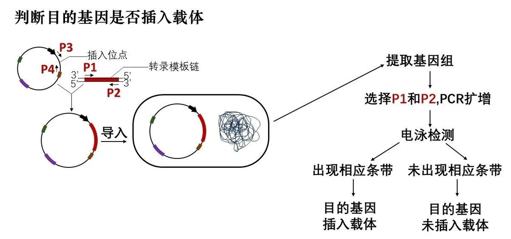
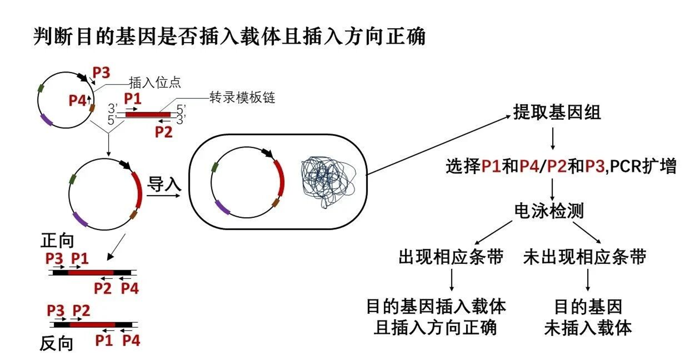
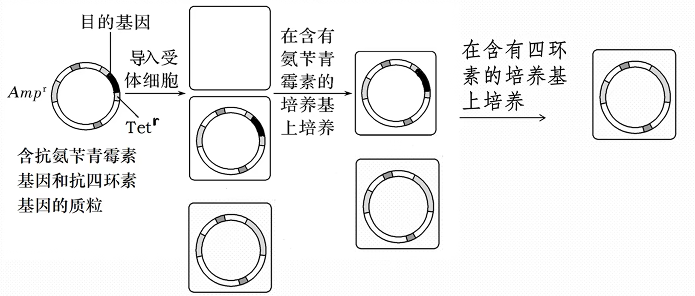
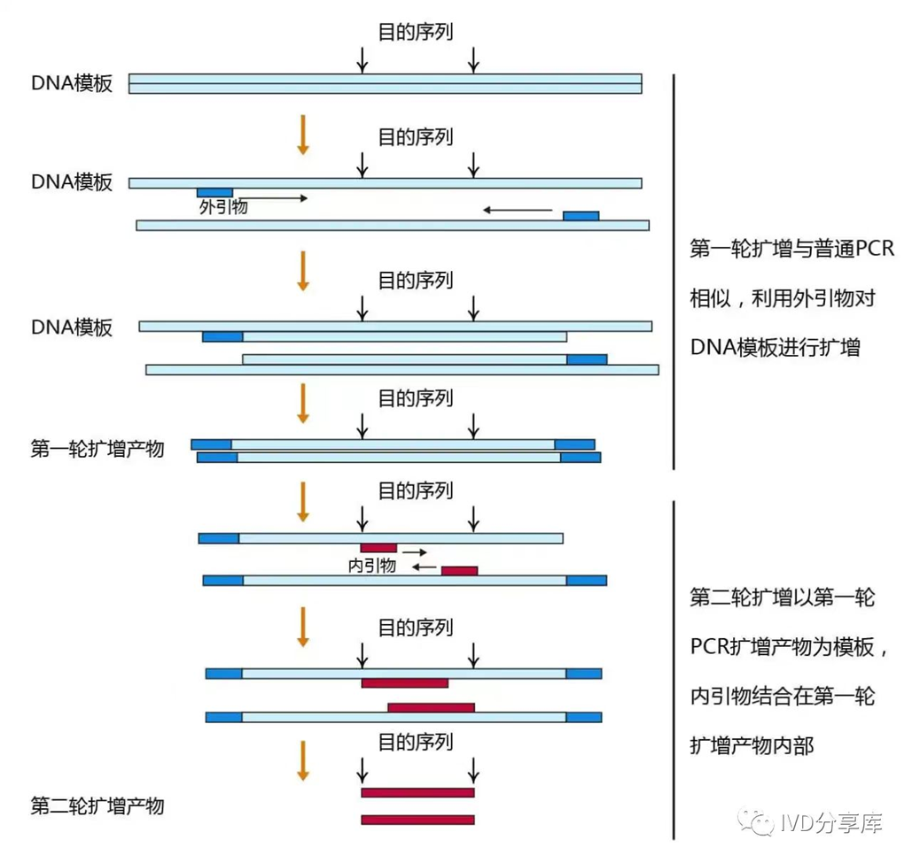
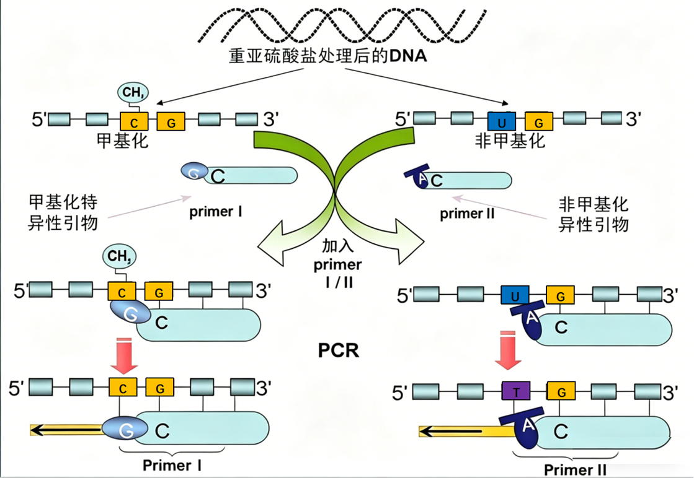

# 基因工程及其应用

## 基因工程概论

### 基因工程发展简史

基因工程是在生物化学、分子生物学和微生物学等学科的基础上发展起来的，正是这些学科的基础理论和相关技术的发展催生了基因工程。基因工程是指按照人们的愿望，通过转基因等技术，赋予生物新的遗传特性，创造出更符合人们需要的新的生物类型和生物产品。从技术操作层面看，由于基因工程是在 DNA 分子水平上进行设计和施工的，因此又叫作重组 DNA 技术。

| 年份/时间 | 人物（其他信息） | 事件/意义 |
|:---:|:---|:---|
| 1944 年 | 艾弗里等 | 证明遗传物质是 DNA，且可在同种生物不同个体间转移 |
| 1950-1952 年 | 埃德曼；桑格 | 发明氨基酸测序方法；完成胰岛素氨基酸序列测定 |
| 1953 年 | 沃森、克里克 | 建立 DNA 双螺旋结构模型，提出自我复制假说 |
| 1958 年 | 梅塞尔森、斯塔尔 | 实验证明 DNA 的半保留复制；中心法则确立 |
| 1961-1966 年 | 尼伦伯格、马太等 | 破译第一个密码子，至1966年全部64个密码子破译完成 |
| 1967 年 | —— | 发现细菌质粒具有自我复制和细胞间转移的能力 |
| 1970 年 | —— | 在细菌中发现第一个限制性内切核酸酶（限制酶） |
| 约 20 世纪 70 年代初 | —— | 多种限制酶、DNA 连接酶和逆转录酶被发现，为 DNA 操作创造条件 |
| 1972 年 | 伯格 | 构建第一个体外重组 DNA 分子 |
| 1973 年 | —— | 证明质粒可作为基因工程载体，实现物种间基因交流，基因工程问世 |
| 1977 年 | 桑格等 | 发明 DNA 序列分析方法，后续 DNA 合成技术为体外合成提供便利 |
| 1982 年 | —— | 第一个基因工程药物——重组人胰岛素获批上市 |
| 1983 年 | —— | 利用农杆菌转化法培育出第一例转基因烟草 |
| 1984 年 | 朱作言团队 | 培育出世界上第一条转基因鱼 |
| 1985 年 | 穆里斯等 | 发明 PCR 技术，为获取目的基因提供有效手段 |
| 1990~2003 年 | —— | 人类基因组计划启动并顺利完成测序任务 |
| 2013 年 | 张锋团队 | 首次利用 CRISPR 技术编辑哺乳动物基因组 |
| 21 世纪以来 | —— | 多种高通量测序技术发明，加速了基因组序列的了解 |

上述仅是按照时间顺序简要提及基因工程相关基础理论的突破和技术的创新。有些你已经学习过，更多的将在本章中展开。科学提供对世界的说明，技术将科学原理应用于认识自然、造福人类的实践，工程则综合运用多种技术来生产人类需要的产品。科学、技术、工程和社会的互动，不断调整着人类与自然界的关系，推动着文明的进步。

### 基因工程概述

所谓“基因”，就是带有遗传信息的 DNA 片段，是产生一条多肽链或功能 RNA 所
需的全部核苷酸序列。基因支持着生命的基本构造和性能，储存着生命的种族、血型、
繁衍、生长、凋亡等过程的全部信息。生物体的生、长、衰、病、老、死等一切生命现
象都与基因有关。基因也是决定生命健康的内在因素。因此，基因具有双重属性，既包
括物质性（存在方式），又包括信息性（根本属性）。其他的 DNA 序列，有些直接以自
身构造发挥作用，有些则参与调控遗传信息的表达。 

孟德尔提出的“遗传因子”概念，认为生物性状是由遗传因子控制的，虽然这仅仅
是一种逻辑推理，但实际上遗传因子的本质就是后来提出的“基因”。1909 年，丹麦遗
传学家约翰逊（Johansen，1859—1927）在《精密遗传学原理》一书中正式提出“基因”
这一名词。1910 年，美国遗传学家摩尔根在果蝇中发现白色复眼突变型，一方面说明基
因可以发生突变，另一方面说明野生型基因具有使果蝇的复眼发育为红色这一生理功
能。1911 年，摩尔根在果蝇中发现基因是一个功能单位，也是一个突变单位和一个交换
单位，得出了染色体是基因载体的结论。1944 年，艾弗瑞（Avery）证明了基因的物质基
础是DNA。20 世纪50 年代以后，随着分子遗传学的发展，尤其是1953 年沃森（Watson）
和克里克（Crick）揭示了DNA 的双螺旋分子结构以后，人们进一步认识了基因的本质，
即基因是具有遗传效应的DNA 片段。研究结果表明，每条染色体有多个基因，每个基因
含有成百上千个脱氧核糖核苷酸。自从RNA 病毒被发现之后，人们进一步认识到，基因
不仅仅只存在于 DNA 上，还存在于 RNA 上。由于不同基因的脱氧核糖核苷酸的排列顺
序（碱基序列）不同，因此，不同的基因就含有不同的遗传信息（李立家和肖庚富，2004）。

基因组（genome）是指生物体所有遗传物质的总和，其中的遗传物质包括 DNA 和
RNA。基因组中包含有成千上万的宝贵基因资源，是几十年来研究的重点和热点。人类
基因组计划是各种生物基因组测序计划中最引人瞩目的一个国际合作大项目，被称为生
命科学领域的“阿波罗登月计划”，总预算高达 30 亿美元。该计划是由美国科学家于 1985
年率先提出、于 1990 年正式启动的，是一项规模宏大、跨国、跨学科的科学探索工程。
人类基因组计划由美国主导和引领，全世界包括美国、英国、法国、德国、日本和中国
共6 个国家的科学家共同参与了这一项庞大计划，其宗旨在于测定组成人类 46 条染色体
及其 DNA 的核苷酸序列，从而绘制人类基因组图谱，辨识其载有的基因及其序列，达
到破译人类遗传信息的最终目的。

基因工程（genetic engineering）、细胞工程、蛋白质工程和酶工程，被认为是生物
工程技术体系中的四大核心工程，其中，基因工程是生物技术中发展速度最快、创新成
果最多、应用前景最广的核心技术。基因工程，又称遗传工程（hereditary engineering）、
重组 DNA 技术（recombinant DNA technique）、分子克隆（molecular cloning）或基因克
隆（gene cloning）技术，是指采用类似于工程设计的理念，以分子遗传学为理论基础，
以分子生物学和微生物学方法为手段，人为地将外源目的基因按预先设计的蓝图，在体外
构建重组载体DNA 分子，构成遗传物质的新组合，然后将这种含有目的基因的重组载体
分子转移到原先没有这类目的基因的受体细胞中进行扩增和表达，以改变生物原有的遗传
特性、获得新品种、生产新产品的遗传技术。通俗地说，基因工程是指将一种供体生物体
的目的基因与适宜的载体在体外进行拼接重组，然后转入另一种受体生物体内，使之按照
人们的意愿稳定遗传并表达出新的基因产物或产生新的遗传性状的 DNA 体外操作程序。
供体基因、受体细胞、工具酶和载体是基因工程技术的四大基本元件。

基因工程的整个过程由工程菌（细胞）的设计构建和基因产物的生产两大部
分组成。前者主要在实验室里进行，后者主要通过工厂化或者大田生产来实现。依据基
因工程的基本概念可以知道，基因工程主要包括目标基因获得、重组 DNA 分子构建、
遗传转化、阳性重组子筛选和外源基因表达产物分离纯化等主要技术体系。这些技术体
系中又包括了核酸凝胶电泳、核酸分子杂交、细菌转化转染、DNA 序列分析、寡核苷
酸合成、基因定点突变和聚合酶链反应（PCR）等具体实验技术。在基因工程技术体系
中，要实现遗传物质的改变，获得目标基因是首要的技术难题。随着各种生物基因组测
序工作的完成，越来越多重要基因的全长序列更容易获得，为基因工程提供了宝贵的基
因资源。 

三大理论基础即证明 DNA 是生物的遗传物质、发现 DNA 双螺旋结构和半保留复
制机制、破译生物的遗传密码子，具体如下。

（1）发现生物的遗传物质是 DNA 而不是蛋白质。1934 年，Avery 等在美国的一次
学术会议上首次报道了肺炎链球菌（Streptococcus pneumoniae）的遗传转化现象，但当
时并不能被人们所接受，直到 10 年后的 1944 年，Avery 等的突破性成果才得以公开发
表。Avery 等的工作证明 DNA 才是生物的遗传物质，而不是蛋白质。另外，该工作还
证明 DNA 可以转移，能把一个细菌的性状传给另外一个细菌。该项工作的理论意义十
分重大，是现代生物科学技术革命的开端，是基因工程这一学科诞生的理论前提。 
（2）DNA 双螺旋结构的发现和 DNA 半保留复制机制的解析，为基因工程奠定了理
论基础。1953 年，Watson 和 Crick 在 Nature 杂志上发表的具有划时代意义的论文，
提出了 DNA 分子的双螺旋结构模型，这对生命科学的意义足以和达尔文的生物进化论、
孟德尔遗传定律相提并论。1958 年，梅塞尔松（Meselson）和斯塔尔（Stahl）以大肠杆
菌为实验材料，运用同位素标记技术和梯度离心技术，以巧妙的实验证明了 DNA 的半
保留复制，并提出了 DNA 半保留复制模型。早在 1957 年，Crick 就提出了中心法则，
五六年之后科学家才揭开了转录和翻译之谜，证明遗传信息是从 DNA 到 RNA 再到蛋白
质的过程，从而从分子水平上揭示了神秘的遗传现象，使中心法则得到公认，为遗传和
变异的操作提供了理论依据。 

（3）破译遗传密码子。1961 年，莫洛（Monod）和雅各布（Jacob）提出了操纵子
学说，为基因表达调控提供了新理论。以马歇尔·沃伦·尼伦伯格（Marshall Warren 
Nirenberg）等为代表的一批科学家，经过艰苦的努力确定遗传信息是以密码子方式传
递的，每三个核苷酸组成一个密码子，代表一个氨基酸。1966 年，科学家破译了全部
64 个密码子，编排了一本密码子字典，除线粒体、叶绿体存在个别特例外，遗传密码
子在所有生物中具有通用性，为操作基因提供了理论上的可行性。 

在理论发展的同时，基因工程的诞生也取决于三项操作技术上的重大发明。这三大
技术发明分别为：限制性核酸内切酶的发现及其在 DNA 酶切上的应用；质粒的发现及
成功改造为基因工程中基因转运载体；反转录酶的发现及其在真核生物基因获得中的成
功应用。具体如下。 

（1）限制性核酸内切酶和 DNA 连接酶的发现及成功应用。从 20 世纪 40 年代到
60 年代，虽然理论上已经确定了基因工程操作的可行性，科学家们也为基因工程设计了
一幅美好的蓝图，但是面对庞大的双链 DNA，尤其是真核生物相当巨大的基因组 DNA，
科学家们仍然是束手无策、难于操作。在细胞外发现和使用工具酶及载体，为基因工
程的实际操作奠定了基础。利用限制性核酸内切酶，科学家们可以先特异性切割 DNA，
然后利用 DNA 连接酶连接 DNA 片段。1970 年，汉弥尔顿·史密斯（Hamilton Othanel 
Smith）等在流感嗜血菌Rd 菌株中发现了第一种Ⅱ型限制性内切核酸酶Hind Ⅱ，使DNA
分子在体外切割成为可能。1972 年，赫伯·玻伊尔（Herbert Boyer）实验室又发现了一
种叫 EcoR Ⅰ的限制性核酸内切酶，每当这种酶遇到 GAATTC 的 DNA 序列，就会将双
链 DNA 分子在该序列中切开形成 DNA 片段。随后又发现了大量类似于 EcoR Ⅰ这样能
够识别特异核苷酸序列的限制性核酸内切酶，使研究者可以获得所需的特殊 DNA 片段。
与此同时，DNA 连接酶的发现对基因工程来说是一项突破性技术。1967 年，世界上有
5 个实验室几乎同时发现了 DNA 连接酶，这种酶能参与 DNA 切口的修复。1970 年，
美国哈尔·葛宾·科拉纳（Har Gobind Khorana）实验室发现了 T4 DNA 连接酶，其具
有更高的连接活性，为 DNA 片段的重组连接提供了技术基础。 
（2）质粒改造为基因工程载体并在 DNA 片段转移中成功应用。大多数 DNA 片段
不具备自我复制的能力，为了使 DNA 片段能够在受体细胞中进行扩增，必须将获得的
DNA 片段连接到一种能够自我复制的特定 DNA 分子上，这种 DNA 分子就是基因工程
的载体。从 1946 年起，乔舒亚·莱德伯格（Joshua Lederberg）等就开始研究细菌的
致育因子 F 质粒，到 20 世纪 60 年代，相继在大肠杆菌中发现抗药性 R 质粒和大肠杆
菌素 Col 质粒。1967 年，罗思（Roth）和海林斯基（Helinski）发现细菌染色体 DNA（拟
核处的 DNA）之外的质粒有自我复制的能力，并可以在细菌细胞间转移，这一发现为
基因转移找到一种运载工具。1973 年，柯恩（Cohen）将质粒作为基因工程的载体使用，
获得基因克隆的成功，标志着质粒作为基因工程载体技术的成熟。 
（3）反转录酶的发现及应用是打开真核生物基因工程的一条通路。1970 年，戴维·巴
尔的摩（David Baltimore）等和霍华德·特明（Howard Temin）等同时各自发现了反转录

酶（reverse transcriptase），也称反转录酶，又称为依赖 RNA 的 DNA 聚合酶。该酶以
RNA 为模板、dNTP 为底物、tRNA（主要是色氨酸 tRNA）为引物，在 tRNA 3′-OH 末
端，根据碱基配对的原则，按 5′→3′方向合成一条与 RNA 模板互补的DNA 单链，这条
DNA 单链称为互补DNA（complementary DNA，cDNA）。反转录酶具有多种酶活性，包
括 RNA 指导的 DNA 聚合酶活性、RNase H 活性、DNA 指导的 DNA 聚合酶活性和
DNA 内切酶活性。反转录酶的发现对于遗传工程技术起到了很大的推动作用，目前
它已成为一种重要的工具酶。用组织细胞提取 mRNA，并以它为模板在反转录酶的作
用下合成出 cDNA，由此可构建出 cDNA 文库，从中筛选特异的目的基因，这是在基
因工程技术中最常用的获得目的基因的有效方法。因此，反转录酶的功能打破了早期
的中心法则，表明不能把生物的遗传信息由 DNA→mRNA→蛋白质的传递方向绝对
化，遗传信息也可以从 RNA 传递到 DNA。反转录酶的应用使真核生物目的基因的制
备更为方便，促进了分子生物学、生物化学和病毒学的研究，已成为研究这些学科的
有力工具。

### 基因工程的基本原理

基因工程是指将一种或多种生物（供体）的基因与运载工具在体外进行拼接重组，然后转入另一种生物体（受体）内，使之按照人们的意愿遗传并表达出新产物或新性状。由于重组拼接的基因和运载工具都是 DNA 分子，因此，基因工程也称为重组 DNA 技术。对于有性生殖的生物而言，不同物种之间存在生殖隔离，难以进行基因交流；即便生活在同一个栖息地的大多数细菌物种也很难交换遗传信息。重组 DNA 技术诞生的科学意义在于打破这种隔离，使跨物种间基因的定向转移成为可能。另一方面，发酵工程所用的微生物菌种以及细胞工程所涉及的细胞株，很多都是采用基因工程技术改造过的，因此基因工程是现代生物工程的核心技术。

- **基本定义**：编码区用于编码蛋白质合成；非编码区不转录、不能编码蛋白质，但参与调控遗传信息表达。

- **原核生物基因**：结构不间隔、连续，包含非编码区、启动子（RNA 聚合酶识别并结合的位点，驱动转录）、编码区和终止子（终止转录）。

- **真核生物基因**：结构间隔、不连续，包含非编码区、启动子、编码区（由外显子和内含子组成）、终止子。外显子能转录并编码蛋白质，内含子能转录但不能编码蛋白质。

- **转录与加工**：真核基因转录后形成前体 mRNA，通过剪切和拼接去除内含子，形成成熟的 mRNA。

对于更加详细的基因工程的技术方面，请查阅[基因工程及其技术苏教版基础资料.pdf](https://huggingface.co/datasets/RainPPR/whk/blob/main/biology/%E5%9F%BA%E5%9B%A0%E5%B7%A5%E7%A8%8B%E5%8F%8A%E5%85%B6%E6%8A%80%E6%9C%AF%E8%8B%8F%E6%95%99%E7%89%88%E5%9F%BA%E7%A1%80%E8%B5%84%E6%96%99.pdf)。

1973 年，基因工程在遗传学、微生物学、生物化学和分子生物学等生物科学分支学科的基础上问世。20 世纪 70 年代初，科学家考恩和博耶等人首先尝试将两种不同来源的 DNA 片段（鼠伤寒沙门氏菌的 RSF1010 和大肠杆菌的 pSC101）在试管里进行拼接，然后将这种重组 DNA 分子导入大肠杆菌细胞中，结果发现这种人工组装的 DNA 分子不仅能准确复制自己，而且还能表达两种 DNA 的遗传信息。紧接着，他们又将另一种亲缘关系较远的金黄色葡萄球菌基因成功导入大肠杆菌中，同样观察到该“外源”基因在大肠杆菌中表达出原来的遗传性状。对上述实验结果进行归纳与概括，他们认为不同物种的细菌可以在实验条件下毫无障碍地进行“交流” 。然而，这一结论是否也能演绎和外推至亲缘关系更远的真核生物物种中呢？随后，他们又参照前人建立的实验程序，成功地将非洲爪蟾的一些基因植入大肠杆菌并获得成功表达，从而证实了他们先前提出的假说：遗传物质 DNA 是可以在保持其功能的前提下进行人为拼接的。自此，宣告了具有划时代里程碑意义的基因工程的诞生。

理论基础：

1. 揭示 DNA 是遗传物质：1944 年，著名的肺炎双球菌转化实验不仅揭示了生物体的遗传物质是 DNA，同时还显示 DNA 可以从一种生物个体转移到另一种生物个体。这项遗传学研究是基因工程中基因转移操作的先驱性工作。

2. 确立 DNA 双螺旋结构和中心法则：1953 年，DNA 双螺旋模型的建立促进了 DNA 半保留复制的实验证明。随后不久确立的中心法则解开了 DNA 复制、转录和 mRNA 翻译过程之谜，阐明了遗传信息传递的方向。这些分子生物学原理为基因工程中提升目的基因的复制和表达水平奠定了基础。

3. 破译遗传密码：$1963 \sim 1966$ 年期间，遗传密码的破译不仅使人们认识到自然界几乎所有生物共用一套遗传密码，而且为基因的鉴别和合成等提供了理论依据。

技术支撑：

1. 发现运载工具：1953 年，发现细菌细胞内除了拟核 DNA 外，还存在一类具有独立复制能力的小型 DNA（称为质粒），它们可在细菌细胞之间转移，这一发现为基因转移找到了一种运载工具。

2. 开发工具酶：1970 年，在细菌中鉴定了第一种能切割DNA 的酶；随后，又相继分离纯化了多种能连接 DNA 和具有其他功能的酶。这些生物化学发现为 DNA 的切割、连接以及基因的获取奠定了技术基础。

3. 实现 DNA 体外重组：1972 年，首次在体外尝试 DNA 的切割和拼接操作，并成功地构建了第一个体外重组 DNA 分子。

基于上述理论和技术的建立，1973 年，美国科学家考恩（S. N. Cohen）和博耶（H. W. Boyer）等人在体外构建出含有四环素和青霉素两个抗性基因的重组 DNA 分子，将之导入大肠杆菌后，这种重组 DNA 分子能稳定复制，并使大肠杆菌表达出相应的抗生素抗性，由此宣告了基因工程的诞生。考恩在评价其实验结果时指出，基因工程技术完全有可能使大肠杆菌具备其他生物物种的特殊生物功能，如光合作用和抗生素合成等。

微生物以其无性繁殖、生长迅速以及易于基因操作等优势为基因工程的问世作出了重大贡献。每个经基因工程改造过的细胞就如同性能优良的微型生物反应器，可用来高效生产人们感兴趣的目标产物。然而，如何控制这些微型生物反应器的数量以及单个微型生物反应器的生产性能，还需要运用生化工程学的理论和技术。

基因工程自 20 世纪 70 年代诞生后，经历了飞速发展，已成为生命科学和生物工程的核心技术。基因工程在医学、农牧业、食品工业等众多领域有着广泛的应用。

基因治疗：就单基因突变或缺陷所导致的疾病而言，向患者体内输入正常版本的基因至少在理论上有可能矫正遗传病，这便是人体基因治疗的基本策略。1990 年，美国批准了世界首例人体基因治疗的临床研究计划，对一名因腺苷脱氨酶基因（ADA）缺陷而患有重度联合免疫缺陷病（SCID）的儿童（终身只能生活在保护性的“气泡”中，被称为“泡泡儿”）进行基因治疗。这一项目最终获得成功，从而开创了基因治疗的新纪元。临床医学研究人员定期从患者血液中分离免疫细胞，用携带正常 ADA 等位基因的病毒表达载体感染这些免疫细胞，然后将这些得以矫正的细胞回输至患者体内，即所谓的“间接体内疗法”。

然而，这种治疗方案在给 SCID 患者带来福音的同时，却也暴露出严重的副作用：四名接受治疗的患者后来发展为白血病，其中一名患者因治疗基因的插入激活了癌基因而死亡。基因治疗给人们带来了希望，但很少有证据能显示其应用的安全性和有效性。尽管如此，临床和学术界仍在坚持不懈地探究更新更严格的安全治疗策略。

2017 年，美国食品和药品管理局（FDA）终于批准了该国的首例基因治疗用剂，该用剂是一种受体蛋白经蛋白质工程设计和改造过的患者自体 T 细胞，用于治疗某些儿童和青少年的急性淋巴细胞白血病（ALL）。生理性 T 细胞受体（TCR）只有在受到抗原刺激后才能发挥免疫效应，而肿瘤表面抗原较难激活 T 细胞。用特异性识别特定肿瘤表面抗原的单链抗体（scFv）取代 TCR 的 αβ 链，同时对 TCR 复合物进行结构改造，构成所谓的嵌合型抗原受体（CAR）。与生理性 T 细胞受体（TCR）复合物相比，第二代嵌合型抗原受体（CAR）在结构上发生了很大改变。

将这种携带工程化 CAR 的 T 细胞作为治疗用剂输回患者体内，此类疗法统称为 CAR-T 细胞疗法。在体内，这种工程化 CAR 能指导 T 细胞识别并杀死表面上带有相应抗原的肿瘤细胞。然而，科学研究没有止境，人们担心这种第二代 CAR-T 细胞输回患者体内后是否会形成新的免疫原性。综上所述，以首例基因治疗临床试验（补充或更换 ADA 基因）为代表的众多策略均属于忠实于原基因编码序列的基因工程；而以 CAR-T 细胞疗法（修饰或改造受体蛋白）为代表的新型策略则属于第二代基因工程——蛋白质工程。

### 基因工程在农牧业方面的应用

基因工程在农牧业中的应用发展迅速。$1996 \sim 2017$ 年，全世界转基因作物的种植面积增加了一百多倍，从 $1.7 \times 10^6 \pu{hm^2}$ 发展到 $1.898 \times 10^8 \pu{hm^2}$（图 3-9）。2016 年世界范围的统计数据表明，转基因作物的种植使化学杀虫剂施用量减少了 $8.2\%$，作物产量增加了 $6.6 \times 10^8 \pu{t}$，增加经济收益近 1.3 万亿元。美国是世界上转基因作物种植面积最大的国家，转基因棉花、大豆、玉米的种植面积占相关作物种植面积的比例都超过了 $90\%$。2017 年，我国转基因作物的种植面积位居世界第八位，商业化种植的转基因作物有棉花和番木瓜。

在转基因动物方面，近些年几乎每年都有令人瞩目的研究成果报道，有些成果正在进入实用化和商业化开发的阶段。2015 年 11 月，第一种用于食用的转基因动物——转基因大西洋鲑（俗称“三文鱼”）在美国获得批准上市。

目前，基因工程技术已被广泛用于改良动植物品种、提高作物和畜产品的产量等方面。

- **转基因抗虫植物**：从某些生物中分离出具有抗虫功能的基因，将它导入作物中培育出具有抗虫性的作物，是目前防治作物虫害的一种发展趋势。已问世的转基因抗虫植物有转基因抗虫棉花、玉米、大豆、水稻（图 3-10）和马铃薯等。

- **转基因抗病植物**：许多栽培作物由于自身缺少抗病基因，因此用常规育种的方法很难培育出抗病的新品种。科学家将来源于某些病毒、真菌等的抗病基因导入植物中，培育出了转基因抗病植物，如转基因抗病毒甜椒（图 3-11）、番木瓜和烟草等。

- **转基因抗除草剂植物**：杂草常常危害农业生产，而大多数除草剂不仅能杀死田间杂草，还会损伤作物，导致作物减产。将降解或抵抗某种除草剂的基因导入作物，可以培育出抗除草剂的作物品种。这样在喷洒除草剂时，田间杂草会被杀死而作物不会受到损伤。目前已经获得转基因抗除草剂玉米（图 3-12）、大豆（图 3-13）、油菜和甜菜等。

- **改良植物的品质**：随着生活水平的提高，人们越来越关注植物的营养价值、观赏价值等，利用转基因技术可以改良这些品质。例如，将某种必需氨基酸含量多的蛋白质编码基因导入植物中，可以提高这种氨基酸的含量，科学家培育的某种转基因玉米中赖氨酸的含量比对照高 $30\%$。我国科学家成功地将与植物花青素代谢相关的基因导入矮牵牛中，使它呈现出自然界没有的颜色变异，大大提高了它的观赏价值（图 3-14）。

- **提高动物的生长速率**：由于外源生长激素基因的表达可以使转基因动物生长得更快，因此科学家将这类基因导入动物体内，以提高动物的生长速率。例如，我国科学家将外源生长激素基因导入鲤鱼，在同等养殖条件下，转基因鲤鱼的生长速率比非转基因鲤鱼提高了 $42\% \sim 115\%$（图 3-15）。

- **改善畜产品的品质**：有些人由于乳糖酶分泌少，不能完全消化牛奶中的乳糖，食用牛奶后会出现腹泻等不适症状，这称为乳糖不耐受。我国约有 $1/3$ 的成年人对乳糖不耐受。为了解决这一问题，科学家将肠乳糖酶基因导入奶牛基因组，使获得的转基因牛分泌的乳汁中，乳糖的含量大大降低，而其他营养成分不受影响。

### 基因工程在医药卫生领域的应用

对微生物或动植物的细胞进行基因改造，使它们能够生产药物，是目前基因工程取得实际应用成果非常多的领域。这些药物包括细胞因子、抗体、疫苗和激素等，它们可以用来预防和治疗人类肿瘤、心血管疾病、传染病、糖尿病和类风湿关节炎等。我国生产的重组人干扰素、血小板生成素、促红细胞生成素和粒细胞集落刺激因子等基因工程药物均已投放市场（图 3-16）。

干扰素是一种具有干扰病毒复制作用的糖蛋白，在临床上被广泛用于治疗病毒感染性疾病。此外，干扰素对治疗乳腺癌、淋巴瘤、多发性骨髓瘤和某些白血病等也有一定的疗效。传统生产干扰素的方法是从人血液中的白细胞内提取，每 $\pu{300 L}$ 血液只能提取出 $\pu{1 mg}$ 干扰素。$1980 \sim 1982$ 年，科学家用基因工程方法从大肠杆菌及酵母菌细胞内获得了干扰素，从 $\pu{1 kg}$ 培养物中可以得到 $\pu{20 \sim 40 mg}$ 干扰素。1993 年，我国批准生产重组人干扰素 $\alpha$-1b，它是我国批准生产的第一个基因工程药物，目前主要用于治疗慢性乙型肝炎、丙型肝炎等。

利用基因工程技术，还可以让哺乳动物批量生产药物。科学家将药用蛋白基因与乳腺中特异表达的基因的启动子等调控元件重组在一起，通过显微注射的方法导入哺乳动物的受精卵中，由这个受精卵发育成的转基因动物在进入泌乳期后，可以通过分泌乳汁来生产所需要的药物，这称为乳腺生物反应器或乳房生物反应器。目前，科学家已经在牛、山羊等动物乳腺生物反应器中，获得了抗凝血酶、血清白蛋白、生长激素和 $\alpha$-抗胰蛋白酶等重要的医药产品。

基因工程技术还可能使建立移植器官工厂的设想成为现实。目前，人体移植器官短缺是一个世界性难题。为此，人们不得不把目光移向寻求可替代的移植器官。由于猪的内脏构造、大小、血管分布与人的极为相似，而且与灵长类动物相比，猪体内隐藏的、可导致人类疾病的病毒要少得多，是否可以用猪的器官来解决人类器官移植的来源问题呢？实现这一目标的最大难题是免疫排斥。目前，科学家正尝试利用基因工程技术改造猪的器官，采用的方法是在器官供体的基因组中导入调控基因表达的 DNA 序列，以抑制抗原决定基因的表达，或设法除去抗原决定基因，再结合克隆技术，培育出不会引起免疫排斥反应的转基因克隆猪器官。

1981 年，采用人血培养病毒制得的乙肝疫苗率先在美国批准上市。这是人类历史上第一种商业化的乙肝疫苗，象征着人类对抗乙肝的一次革命性突破。但是，有限的来源和高昂的价格使其难以普及，而且存在通过血液感染其他病毒（如艾滋病病毒）的风险也引起了人们的严重担忧。基因工程技术为乙肝疫苗的生产工艺带来了革命性突破：首先，获得乙肝病毒表面蛋白（用作抗原）的基因，然后将其转移至酵母中，可使酵母高效合成乙肝病毒表面抗原蛋白，用作乙肝疫苗。由于酵母易于大规模发酵培养，且整个生产过程能彻底摆脱血液需求和病毒培养，因而通过基因工程大规模生产乙肝疫苗成为了可能。

自 20 世纪 80 年代以来，基因工程开始朝着高等动植物物种的遗传性状改良以及人体基因治疗等方向发展。1982 年，科学家将大鼠的生长激素基因转入小鼠体内，培育出具有大鼠雄健体魄的转基因小鼠。1990 年，美国首次批准了一项人体基因治疗临床研究计划，对一名因腺苷脱氨酶基因缺陷而患有重度联合免疫缺陷病的儿童进行基因治疗并获得成功，从而开创了基因治疗的新纪元。

### 基因工程在食品工业方面的应用

利用基因工程菌除了可以生产药物，还能生产食品工业用酶、氨基酸和维生素等。例如，阿斯巴甜是一种普遍使用的甜味剂，主要由天冬氨酸和苯丙氨酸形成，这两种氨基酸就可以通过基因工程实现大规模生产。

奶酪是一种被广泛食用的发酵奶制品。大多数奶酪的生产需要使用凝乳酶来凝聚固化奶中的蛋白质。传统的制备凝乳酶的方法是通过杀死未断奶的小牛，然后将它的第四胃的黏膜取出来进行提取。随着人口的增长和人们饮食需求的变化，单纯依靠宰杀小牛来获得凝乳酶的方法已不能满足日益增长的市场需求。于是，科学家将编码牛凝乳酶的基因导入大肠杆菌、黑曲霉或酵母菌的基因组中，再通过工业发酵批量生产凝乳酶。用这种方法生产的凝乳酶已于 1990 年投入市场，截至 2016 年，有超过 17 个国家在用它生产奶酪。

加工转化糖浆需要的淀粉酶，加工烘烤食品要用到的脂肪酶等也都可以通过构建基因工程菌，然后用发酵技术大量生产。相比从天然产物中提取的酶，用基因工程技术获得的工业用酶的纯度更高，而且它的生产成本显著降低，生产效率较高。

基因工程使人们更容易培育出具有优良性状的动植物品种，获得很多过去难以得到的生物制品，甚至还能培育出可以降解多种污染物的“超级细菌”来处理环境污染，利用经过基因改造的微生物来生产能源…… 未来，期待基因工程带给我们更多的惊喜。

### DNA 片段的扩增及电泳鉴定

利用 PCR 可以在体外进行 DNA 片段的扩增。PCR 利用了 DNA 的热变性原理，通过调节温度来控制 DNA 双链的解聚与结合。PCR 仪实质上就是一台能够自动调控温度的仪器。一次 PCR 一般要经历 30 次循环。

DNA 分子具有可解离的基团，在一定 $\pH$ 下，这些基团可以带上正电荷或负电荷。在电场的作用下，这些带电分子会向着与它所带电荷相反的电极移动，这个过程就是电泳。PCR 的产物一般通过琼脂糖凝胶电泳来鉴定。在凝胶中 DNA 分子的迁移速率与凝胶的浓度、DNA 分子的大小和构象等有关。凝胶中的 DNA 分子通过染色，可以在波长为 $\pu{300 nm}$ 的紫外灯下被检测出来。

{ width="80%" }

1. 用微量移液器按照右栏中的配方或 PCR 试剂盒的说明书，在微量离心管中依次加入各组分。

2. 待所有的组分都加入后，盖严离心管的盖子。将微量离心管放入离心机里，离心约 $10 \pu{s}$，使反应液集中在管的底部。

3. 参照下表的参数，设置好 PCR 仪的循环程序。将装有反应液的微量离心管放入 PCR 仪中进行反应。

4. 根据待分离 DNA 片段的大小，用电泳缓冲液配制琼脂糖溶液，一般配制质量分数为 $0.8\% \sim 1.2\%$ 的琼脂糖溶液。在沸水浴或微波炉内加热至琼脂糖熔化。稍冷却后，加入适量的核酸染料混匀。

5. 将温热的琼脂糖溶液迅速倒入模具，并插入合适大小的梳子，以形成加样孔。

6. 待凝胶溶液完全凝固后，小心拔出梳子，取出凝胶放入电泳槽内。

7. 将电泳缓冲液加入电泳槽中，电泳缓冲液没过凝胶 $\pu{1 mm}$ 为宜。

8. 将扩增得到的 PCR 产物与凝胶载样缓冲液（内含指示剂）混合，再用微量移液器将混合液缓慢注入凝胶的加样孔内。留一个加样孔加入指示分子大小的标准参照物。

9. 接通电源，根据电泳槽阳极至阴极之间的距离来设定电压，一般为 $1 \sim 5 \pu{V / cm}$。待指示剂前沿迁移接近凝胶边缘时，停止电泳。

10. 取出凝胶置于紫外灯下观察和照相。

**注意**

1. 为避免外源 DNA 等因素的污染，PCR 实验中使用的微量离心管、枪头和蒸馏水等在使用前必须进行高压灭菌处理。

2. 该实验所需材料可以直接从公司购买，缓冲液和酶应分装成小份，并在 $\pu{-20 ^oC}$ 储存。使用前，将所需试剂从冰箱拿出，放在冰块上缓慢融化。

3. 在向微量离心管中添加反应组分时，每吸取一种试剂后，移液器上的枪头都必须更换。

### 蛋白质工程的原理和应用

人胰岛素在使用过程中容易聚合成多分子形式，阻断胰岛素从注射部位进入血液，从而延缓其降血糖的作用。另外，胰岛素进入血液循环后容易被降解，患者需要反复注射。上述两方面均与胰岛素分子的氨基酸序列有关。借助蛋白质工程可以定向设计、改变这些氨基酸，降低其聚合作用，使胰岛素快速发挥作用，同时可提高胰岛素在患者体内的稳定性。

重组 DNA 技术使得分离、克隆任何天然存在的基因并令其在特定受体细胞中表达成为可能，这项技术所使用的目的基因均是天然存在的，因而表达出的产物仍为天然蛋白质。天然蛋白质是生物在长期进化过程中形成的，它们的结构和功能符合特定物种适应特殊环境而生存的需求，但不一定都能完全符合人类生产和生活的需要。比如，人类常规主食（尤其是水稻和玉米）中的必需氨基酸（如赖氨酸）含量偏低；工业用酶在高温和有机溶剂生产环境中容易失活；药物蛋白多肽在机体内半衰期较短等。

以蛋白质结构与功能相统一的生命观念为指导，采用重组 DNA 技术在 DNA 分子水平上改变基因的序列和结构，可以对天然蛋白进行理性改造，甚至可以设计并制造出全新的非天然蛋白，以满足人类生产与生活的需求。这种由人为突变或设计基因进而操纵蛋白质结构和性质的过程，称为蛋白质工程，又称第二代基因工程。

蛋白质工程包含特定基因的定点突变和定向进化。定点突变是指改变 DNA 的特定序列；而定向进化是指随机改变 DNA 的序列，然后
选择具有特定功能的突变蛋白。基因工程涉及天然基因的重组，表达产物的结构和功能基本上没有改变；而蛋白质工程旨在对蛋白质的结构和功能进行设计和改造，获得性能更符合人类需求的蛋白质。蛋白质设计从预期的生物学功能出发，去改造蛋白质的结构，充分体现了结构和功能的统一。

蛋白质工程包括修饰改造天然蛋白和设计制造全新蛋白两个方面。修饰改造天然蛋白存在两大类操作策略，即基因的定点突变和定向进化。在 DNA 水平上改变蛋白质特定位点的氨基酸序列，称为基因的定点突变；而在 DNA 水平上随机改变蛋白质任一位点的氨基酸序列，则称为基因的定向进化。修饰改造天然蛋白一方面可实现氨基酸序列改造，优化其功能；另一方面还可以确定多肽链中某个氨基酸在蛋白质结构和功能上的作用，以收集有关氨基酸线性序列与其空间构象和生物功能之间的对应关系，为设计制作新型的突变蛋白提供理论依据。因此，修饰改造天然蛋白实质上是一个模拟自然界进化与适应的循环渐进过程，可将数千万年的自然进化历程缩短为数月、数周甚至数天的实验室过程。

我们知道，天然蛋白质合成的过程是按照中心法则进行的：

<center>
基因 $\to$ 表达（转录和翻译） $\to$ 形成具有特定氨基酸序列的多肽链 $\to$ 形成具有高级结构的蛋白质 $\to$ 行使生物功能
</center>

而蛋白质工程却与之相反，它的基本思路是：

<center>
从预期的蛋白质功能出发 $\to$ 设计预期的蛋白质结构 $\to$ 推测应有的氨基酸序列 $\to$ 找到并改变相对应的脱氧核苷酸序列（基因）或合成新的基因 $\to$ 获得所需要的蛋白质
</center>

借助蛋白质工程设计和改造新型突变蛋白，具有不可估量的经济和社会效益。让我们结合具体案例了解如何借助定点突变策略改造蛋白质的基因结构，进而产生突变蛋白的大致过程。

- 定点突变：研究表明，人胰岛素样生长因子的结构和性质与人胰岛素高度相似，但它不像人胰岛素那样容易聚合形成多分子。比较这两种蛋白质的结构发现，人胰岛素样生长因子在与人胰岛素 B 链对应的第 28 位和第 29 位氨基酸分别是赖氨酸和脯氨酸，而人胰岛素在这两处的氨基酸序列正好颠倒，因而推测这是人胰岛素形成多分子形式的关键原因。为了证实这一猜想，需要更换人胰岛素这两个位点的氨基酸顺序。

    { width="60%" }

    已知，人胰岛素 B 链基因中编码第 28 位脯氨酸和第 29 位赖氨酸的序列分别为 CCC 和 AAG。因此，只需在人胰岛素基因中将原来的“CCCAAG”序列改造成“AAGCCC”，理论上便能在受体细胞中产生两处氨基酸序列颠倒的突变型人胰岛素。由于人胰岛素 B 链基因较短，按照设计好的编码序列进行化学合成，是获取这种突变型目的基因的首选方法。另外，也可采取图 3-17 所示的 PCR 方案获取突变型目的基因（PCR 方案对较长的目的基因编码序列更经济）：首先人工化学合成含有突变序列的突变引物和不含突变序列的正常引物，然后使用这两种引物以人胰岛素基因为模板进行 PCR。研究证实，由这种突变的目的基因表达的突变型人胰岛素不再聚合成多分子形式。将这种突变型人胰岛素注射进入患者体内，降血糖速率大为提高，因而这种突变型人胰岛素被称为“单体速效胰岛素”（又称“赖脯胰岛素”）。

    L-天冬酰胺酶是治疗儿童白血病的有效药物，但在临床应用中因其并非人体蛋白常常引起过敏反应，因此降低免疫原性是该药研究开发的重要内容。采用定点突变技术将细菌来源的 L-天冬酰胺酶某位赖氨酸更换为丙氨酸，形成新型的 L-天冬酰胺酶突变蛋白，其免疫原性比天然酶蛋白下降 $2.5$ 倍，且活性保持不变。

    再如，心脑血管疾病引发的血栓（即血液中主要由蛋白质构成的固体颗粒）并发症严重威胁人类生命，全世界每年死于心脑血管疾病的人数高达 $1,500$ 万人，居各种疾病死亡率首位。因此，研制高效、特异、安全的溶栓药物一直是药物开发领域的热门课题。临床上常将人组织型纤溶酶原激活剂（t-PA）用作溶解血栓、抢救心肌梗死（心脏血管被血栓堵塞）患者的特效药。然而，t-PA 存在体内半衰期短和诱发颅内出血等缺陷。为了提高 t-PA 临床应用的可行性，科研人员采用蛋白质工程的定点突变策略，开发了一系列体内半衰期长、血栓溶解效率高、颅内出血倾向大幅度降低的优质 t-PA 突变蛋白，如 TNK 型 t-PA。

- 随机突变：随机突变以获得高效能酶分子。

    { width="60%" }

- 定向进化：进化到今天的生物体基因都是最优的吗？我们能不能在实验室里模拟并加速自然进化过程呢？基因的定向进化有助于解答这些问题。这项技术的基本操作是在体外对特定基因实施随机突变，然后借助适当的筛选程序准确、迅速地获得所需要的突变基因。比如，针对某个特定的基因采用 PCR 技术进行扩增，在过程中通过改变反应条件（如使用低保真度的 DNA 聚合酶）故意让 DNA 复制发生随机错误，便能创建一系列随机突变的新基因序列；然后再将这些新基因序列导入合适的受体细胞中，表达出相应的一系列随机突变蛋白；最后，根据我们的需求从中筛选出具有特定优良功能或结构的目的蛋白。

{ width="100%" }

在人类胰岛 β 细胞中，胰岛素基因最初表达的是由 110 个氨基酸残基（aa）构成的胰岛素原前体分子，其 N 端的 S 区在新生多肽链进入内质网腔后被切除，形成无活性的胰岛素原（即 B-C-A），其中 A 区与 B 区借助二硫键（共价键）相连。随后，胰岛素原被转运至高尔基体。当机体接到胰岛素的需求指令后，高尔基体内的肽酶再切除胰岛素原中的 C 区，形成 A 区与 B 区相连的活性胰岛素（三个二硫键的正确搭配为胰岛素活性所必需）。

{ width="80%" }

鉴于活性胰岛素仅含 A 区和 B 区，科研人员最初设计的人胰岛素基因工程生产技术路线是：首先化学合成 A 区和 B 区编码序列，然后分别与相同的质粒连接，构建成表达载体 p Ⅰ A1 和 p Ⅰ B1。将这两种重组 DNA 分子分别导入大肠杆菌，便能分别表达人胰岛素的 A 区和 B 区。经分离纯化后，将 A 区与 B 区混合，使其自然形成三个二硫键。由此技术路线（即 AB 表达法）生产的重组人胰岛素成本高昂。

{ width="80%" }

为了降低生产成本，科研人员重新审视了 C 区的作用，他们认为在胰岛 β 细胞内 C 区很可能起到正确组装 A 区和 B 区的“脚手架”作用。为了验证这一假说，他们以胰岛 β 细胞的 mRNA 为原料，采用 PCR 技术获取胰岛素原编码序列，然后依照上述工艺制备 B-C-A，最后再用特殊的酶模拟细胞内的过程将 C 区切除。结果表明，由此技术路线（即 BCA 表达法）生产的人胰岛素基因工程产品成本大幅度降低。

{ width="100%" }

设计制造全新蛋白需要根据已经掌握的蛋白质结构与功能的关系，借助特殊的电脑程序自行设计、拼装感兴趣的全新基因序列，然后借助重组 DNA 技术使之表达，进而检测这种全新蛋白的性能是否能达到设计标准。

{ width="60%" }

小鼠单克隆抗体的制备比较简单，但这种鼠源性的单克隆抗体会被人的免疫系统排斥，不能直接用于人体。嵌合抗体（chimeric antibody）分子的可变区是由鼠抗体的可变区基因所编码，恒定区则由人抗体的恒定区基因编码，这种嵌合抗体的抗原性显著下降，而抗体的特异识别功能没有丧失。目前，已有多种嵌合抗体用于临床治疗。

{ width="60%" }

蛋白质工程经常要借助计算机来建立蛋白质的三维结构模型；要制备蛋白质晶体，然后通过 X 射线衍射技术，分析晶体的结构；要用到基因的定点突变技术来进行碱基的替换。蛋白质工程是一项难度很大的工程，主要是因为蛋白质发挥功能必须依赖于正确的高级结构，而这种高级结构往往十分复杂（图 3-18）。科学家要设计出更加符合人类需要的蛋白质，还需要不断地攻坚克难。我们相信，随着科学技术的深入发展，蛋白质工程将会给人类带来更多的福祉。

{ width="100%" }

蛋白质是生命活动的主要承担者，蛋白质结构改变会直接影响其功能活性。蛋白质工程技术已经能够对蛋白质稳定性、最适 pH 范围、酶的活性以及底物特异性等进行预期的设计和改造。提高胰蛋白酶的活性与稳定性胰蛋白酶在医药、轻工业、科学研究等方面有广泛的应用价值，但天然胰蛋白酶活性低，稳定性差。科学家通过选择胰蛋白酶第 216 位和第 226 位的甘氨酸进行定点突变，获得了催化活性更高的胰蛋白酶；通过对第 117 位的精氨酸进行定点突变，获得了稳定性更高的胰蛋白酶。并以此为手段，进一步研究了胰蛋白酶底物专一性和胰蛋白酶结构与功能的关系。

改变金属硫蛋白对重金属的亲和力金属硫蛋白（MT）中丰富的巯基对金属离子有很高的亲和性，对于抵抗重金属中毒及维持某些必需元素在体内的代谢平衡具有重要意义。MT 一般由 α 和 β 两个功能区域组成。科学家将 α 和 β 两个功能区域拆分后，用 α 功
能区域代替 β 功能区域，构建出含两个 α 功能区域的 MT 突变体 α-α，然后将 MT 突变体 α-α 转入烟草体内，使烟草具有较高的重金属抗性。

延长白细胞介素-2 的作用时间：白细胞介素-2（IL-2）是一种细胞因子，能够促进 T 淋巴细胞增殖以及增强某些免疫细胞的活性，已被广泛运用于各种肿瘤和病毒感染疾病的治疗。IL-2 作为临床药物在血浆中的作用时间较短，治疗期间需要频繁给药。科学家通过蛋白质工程，将长效人血清白蛋白（HSA）与 IL-2 重组，获得了一种新的融合蛋白（HSA/IL-2），这种融合蛋白既具有普通 IL-2 的生物活性，作用时间又有所延长，可明显提高 IL-2 的疗效。

```md {admonition=details title="CRISPR/Cas9 基因组编辑技术"}

```

相对小分子药物而言，蛋白质药物具有活性高、特异性强、毒性低、生物功能明确、有利于临床应用等特点。目前上市的蛋白质工程药物常见种类有：基因工程抗体药物，多肽类激素药（包括人胰岛素、人生长激素、卵泡刺激激素等），人造血因子（包括重组人促红细胞生成素、粒细胞 / 单核细胞集落刺激因子等），人细胞因子（包括α干扰素、β干扰素等），人血浆蛋白因子（包括重组人凝血因子、t-PA 等），人骨形成蛋白，融合蛋白，外源重组蛋白等。

蛋白质工程汇集了当代分子生物学等学科的一些前沿领域的最新成就，将蛋白质的研究推进到崭新的时代，为蛋白质在工业、农业和医药方面的应用开拓了诱人的前景。蛋白质工程开创了按照人类意愿改造、创造符合人类需要的蛋白质的新时期。

## 基因工程工具酶

基因工程的操作是分子水平上的操作，它必须依赖于一些重要的酶作为工具来实现
在体外对 DNA 分子进行切割和重新连接等，因此工具酶是进行基因工程操作的重要基
础之一。基因工程中应用的酶类统称为工具酶。基因工程涉及的工具酶种类繁多、功能
各异，就其用途和功能不同可分为限制性内切核酸酶、连接酶、修饰酶、末端脱氧核苷
酸转移酶、核酸酶、T4 噬菌体多核苷酸激酶、外切核酸酶和碱性磷酸酶。

### 限制性内切核酸酶

由于限制性内切核酸酶无法识别甲基化的序列，从而保护了自身 DNA 分子。细菌
可以抵御新病毒的入侵，而这种“限制”病毒生存的办法可归功于细胞内部可摧毁外源
DNA 的限制性内切核酸酶。识别和切割 dsDNA 分子内特殊核苷酸顺序的酶统称为限制
性内切核酸酶，简称限制酶。从原核生物中已发现了约 400 种限制酶，可分为Ⅰ类、Ⅱ
类和Ⅲ类。其中，Ⅰ、Ⅲ类酶具有特定识别位点，但没有特定的切割位点，其切割位点
在距识别位点 1000bp 处和 24～26bp 处，且酶对其识别位点进行随机切割，很难形成稳
定的特异性切割末端，因此基因工程实验中基本不用Ⅰ类和Ⅲ类限制性内切核酸酶。所
以，如果没有专门说明，通常所说的限制性内切核酸酶均是指Ⅱ型酶。 

Ⅱ类限制性内切核酸酶的特点：

1. 识别特定的核苷酸序列，其长度一般为4 个、5 个或6 个核苷酸且呈二重对称。
2. 识别位点即为其切割部位，即限制性内切核酸酶在其识别序列的特定位点对双链 DNA 进行切割，由此产生特定的酶切末端。
3. 没有甲基化修饰酶功能，不需要 ATP 和 SAM（S-腺苷甲硫氨酸）作为辅助因子，一般只需要 Mg2+。Ⅱ类限制性内切核酸酶的主要作用是切割 DNA 分子，以便对所含的特定基因的 DNA 片段进行分离和分析，是基因工程中使用的主要工具酶。 

限制性内切核酸酶在双链DNA 分子上能识别的特定核苷酸序列称为识别序列或识
别位点，它们对碱基序列有严格的专一性，这就是它识别碱基序列的能力，被识别的碱
基序列通常具有双轴对称性，即所谓的回文序列（palindromic sequence）。从大肠杆菌中
分离鉴定的EcoRⅠ是最早发现的一种Ⅱ类限制性内切核酸酶，它的特异识别序列如图5-1
所示，具有回文序列，因此能够特异地结合在一段含这 6 个核苷酸的 DNA 区域内，在
每一条链的鸟嘌呤和腺嘌呤间切断 DNA 链。DNA 的回文结构也是顺看、反看都一样，
但是应该注意要从两个方向来读（5′→3′），即上面的链必须从左往右读，下面的链从右
往左读。

Ⅱ类限制性内切核酸酶的切割方式通常有 3 种：①在识别序列的对称轴同时切割磷
酸二酯键，形成齐平末端，如 SmaⅠ，见图 5-2A；②在识别顺序上两条链对称轴上两
侧同时从 5′端切断磷酸酯键，形成 5′-磷酰基端 2～5 个核苷酸单链黏性末端，如 BamH
Ⅰ，见图 5-2B；③在识别顺序两条链对称轴两侧同时从 3′端切断磷酸酯键，形成 3′-OH
端 2～5 个核苷酸单链黏性末端，如 SacⅠ，见图 5-2C。 

经限制酶切割后产生的 DNA 片段称为限制性片段，不同限制酶切割 DNA 后所形
成的限制性片段长度不同。一些常用的限制性内切核酸酶及其识别位点列于表 5-1。 
有的限制性内切核酸酶可识别两种以上的核苷酸序列，例如，AccⅠ既可识别
GTATAC，又可识别 GTCGAC；DdeⅠ可识别的核苷酸序列有 CTAAG、CTTAG、CTGAG
和 CTCAG。这样的限制性内切核酸酶为获得多种酶切片段提供了方便。另有一些来源
不同的限制酶识别的是同样的核苷酸靶序列，这类酶称为同裂酶。同裂酶的切割位点可
能不同，识别位点和切割位点都相同的称为同序同切酶，识别位点相同但切割位点不同
的称为同序异切酶。同裂酶在载体构建方面往往具有巧妙的应用。最具代表性、应用较
多的同裂酶如 SmaⅠ和 XmaⅠ，它们均识别 CCCGGG，但前者切后产生钝末端，后者
切后产生黏性末端。 

同尾酶是一类识别序列不完全相同，但产生的黏性末端至少有 4 个碱基相同的限
制性内切核酸酶，由此产生的 DNA 片段，能够通过其黏性末端之间的互补作用彼此
连接起来。当把同尾酶切割的 DNA 片段与原来的限制性内切核酸酶切割的 DNA 片段
连接后，原来的酶切位点将不存在，不能被原来的限制性内切核酸酶所识别。例如，
SalⅠ和 XhoⅠ是一组同尾酶，它们切割 DNA 后都形成 TCGA 的黏性末端，用这组同
尾酶处理载体和外源 DNA 得到的黏性末端可以像完全亲和的黏性末端那样进行连接，
但不同的是，一般不会在连接部位上存在原来限制性内切核酸酶的识别位点。例如，
SalⅠ与 XhoⅠ的酶切片段连接后，得到的杂合靶位点既不能被 SalⅠ切开，也不能被
XhoⅠ切开（图 5-3）。 

由于目前发现了大量的限制酶，因此需要有一个统一的命名法。H.O. Smith 和D. Nathans
提议的命名系统现已广泛应用（孙明，2013），该命名系统包括如下几点。 
（1）用属名的头一个字母加上种名的头两个字母，表示寄主菌的物种名称。例如，
大肠杆菌（Escherichia coli）用 Eco 表示，流感嗜血菌（Haemophilus influenzae）用 Hin
表示。 
（2）如果一种特殊的寄主菌株具有几个不同的限制与修饰体系，则以罗马数字表示。
例如，流感嗜血菌 Rd 菌株的几个限制与修饰体系分别表示为 HindⅠ、HindⅡ、Hind Ⅲ
等等。 
（3）如果限制与修饰体系在遗传上是由质粒或病毒引起的，则在缩写的寄主菌的种
名右侧附加一个标注字母，如 EcoRⅠ、EcopⅠ。 
（4）除限制性内切核酸酶（R）这个总的名称外，还应加上系统的名称，如内切核
酸酶 R.Hind Ⅲ。如果是修饰酶，则应在它的系统名称前加上甲基化酶（M）的名称，如
甲基化酶 M.Hind Ⅲ。 

高中阶段一般不涉及限制性内切核酸酶的反应条件和影响限制性内切核酸酶酶切的反应条件。

### DNA 连接酶

1967 年，世界上有数个实验室几乎同时发现了 DNA 连接酶（ligase）。它能催化一
条 DNA 链的 3′端游离羟基（–OH）和另一条 DNA 链的 5′端磷酸基团（–P）共价结合形
成磷酸二酯键，因此它能催化两个DNA 分子末端连接，用来产生重组DNA 分子。目前，
连接酶多来自 E.coli 体内，由于这个反应是需要能量的，因此在大肠杆菌及其他细菌中，
反应过程利用 NAD+［烟酰胺腺嘌呤二核苷酸（氧化型）］作为能源；而在动物细胞及噬
菌体中，则是利用 ATP（腺苷三磷酸）作为能源。 

基因工程中最常用的连接酶是 T4 DNA 连接酶。它既能连接黏性末端，又能连接平
末端，但连接平末端的效率较低。T4 DNA 连接酶的作用分为 3 步：T4 DNA 连接酶与
辅助因子 ATP 形成酶-AMP 复合物，酶-AMP 复合物结合在具有 5′-磷酸基和 3′-羟基切
口的 DNA 上，使 DNA 腺苷化，产生一个新的磷酸二酯键，把缺口封起来。 
连接酶作用的最佳反应温度是 37℃，但在这个温度下，黏性末端之间的氢键结合是
不稳定的。因此，连接黏性末端的最佳温度，应介于酶作用速率最佳温度和末端结合速
率最佳温度之间，一般认为 4～15℃比较合适。根据 DNA 片段的分子大小及末端结构，
在 12～30℃下反应 1～16 h。对于黏性末端，一般在 12～16℃进行反应，以保证黏性末
端退火及酶活性、反应速率之间的平衡。平末端连接反应可在室温（<30℃）进行，并
且需用比黏性末端连接大 10～100 倍的酶量。 

大肠杆菌的 DNA 连接酶是一条分子质量为 75kDa 的多肽链，对胰蛋白酶敏感，可
被其水解。水解后形成的小片段仍具有部分活性，可以催化酶与NAD（而不是ATP）反
应形成酶-AMP 中间物，但不能继续将 AMP 转移到 DNA 上促进磷酸二酯键的形成。
DNA 连接酶在大肠杆菌细胞中约有 300 个分子，在 DNA 复制、修复和重组中起着重要
的作用；连接酶有缺陷的突变株不能进行 DNA 复制、修复和重组。反应的温度和体系
与 T4 DNA 连接酶相同。 

在 DNA 重组操作中，待重组 DNA 分子由于各种限制，在连接重组时可能具有各
种不同的末端，因此 T4 DNA 连接酶连接不同末端的 DNA 分子时会有各自不同的策略。
（1）单酶切产生的相同黏性末端：这是由同一种限制性内切核酸酶分别切割目的基
因 DNA 片段和载体分子产生的，是最常见也最容易连接的情况。T4 DNA 连接酶可以
直接把两个分子连接重组。 
（2）双酶切产生的黏性末端：DNA 分子重组时，为了保证目的片段以正确的方向
连接进入载体，往往尽可能选择两种具有不同黏性末端的酶分别酶切目的 DNA 分子和
载体，这种双酶切虽然使载体和目的 DNA 都产生了两种不同的黏性末端，但是连接酶
会选择把相同的黏性末端连接起来，从而保证目的基因只以一个方向连接入载体。 
（3）双酶切产生的不同 5′突出末端：在不得已的情况下，只能分别用一种酶酶切目
的 DNA，用另一种酶酶切载体。如果这时候两种酶都产生5′突出黏性末端，那么连接前
往往要经过补平处理，用 Klenow 酶分别以突出的 5′端为模板，延伸 3′端至平末端后再
连接。 
（4）双酶切产生的不同 3′突出末端：如果用两种酶分别酶切目的片段和载体分子，
结果产生的是两种不同的 3′突出末端，则连接前必须通过切平的方式使两个末端变成平
头末端。T4 DNA 聚合酶具有 3′→5′外切核酸酶活性，可以用于 3′突出末端的切平。 
（5）双酶切产生的 5′突出末端和 3′突出末端：还有一种情况是，如果用两种酶分别
酶切目的片段和载体分子，结果一个产生 3′突出末端、一个产生 5′突出末端，那么连接
前，3′突出末端必须切平、5′突出末端必须补平后才能连接。 
（6）平切产生的平头末端：T4 DNA 连接酶虽然能够连接平头末端，但是连接效率
很低，因此，为了提高平头末端的连接效率，可以通过在平头末端增加人工接头的策略，
如利用末端转移酶TdT 分别在目的片段和载体分子的末端加上互补的多聚A 和多聚T 碱
基，人工造成黏性互补末端，从而提高连接效率。 
（7）DNA 片段的连接过程与许多因素有关，如DNA 末端的结构、DNA 片段的浓度
和分子质量、不同 DNA 末端的相对浓度、反应温度、离子浓度等。 


## 基因工程的基本操作程序

基因工程是一种重组 DNA 技术，即按照人们预先设计的蓝图，通过基因操作，将目的基因或 DNA 片段与合适的载体结合，然后转入受体细胞，通过复制、转录、翻译，使转基因生物获得新的遗传性状。基因工程可以打破物种之间的生殖隔离，使基因在不同生物之间进行交流，从而赋予生物新的遗传特性。

重组 DNA 过程中需要三种基本的工具，即切割 DNA 分子的“基因剪刀”、将 DNA 分子片段连接起来的“基因针线”、将体外基因导入受体细胞的“运载工具”。
“基因剪刀” ——限制性内切核酸酶：限制性内切核酸酶（restriction endonuclease），又称限制酶（restriction enzyme）。迄今为止，科学家已从微生物体内分离出了几千种不同的限制酶，每一种限制酶能够识别 DNA 分子中特定的脱氧核苷酸序列，并在特定位置将 DNA 分子“切割”开。大部分 DNA 分子被切割后，切口两端会分别留下一段单链末端，叫作黏性末端（图 3-3）。有些限制酶切开 DNA 时，双链末端平齐而无突出单链，叫作平端。
“基因针线” ——DNA 连接酶：将切割下来的 DNA 片段拼接成新的 DNA 分子，要靠 DNA 连接酶（DNA ligase）来实现。当两个 DNA 片段的黏性末端彼此靠拢，相互识别，它们的碱基完成互补配对后，DNA 连接酶就把它们之间的缝隙“缝合”起来（图 3-4）。有些连接酶可以连接 DNA 片段的平端。

- “运载工具” ——载体：将外源基因送入受体细胞，需要运载工具，这种运载工具称为载体（vector）。常用的载体有质粒、噬菌体、动植物病毒等。其中，质粒是一种较为理想的载体，它是一种很小的环状 DNA 分子，具有自我复制能力。质粒 DNA 分子上有一个至多个限制酶切割位点，并含有一些抗生素抗性基因（图 3-5），如四环素抗性基因、氨苄青霉素抗性基因等，这些基因可以作为鉴定和筛选重组 DNA 的标记基因

<div class="grid" markdown>


</div>

### DNA 重组需要三种基本工具

通过模拟 DNA 重组操作，你可以发现若将人胰岛素基因插入环形 DNA 分子的特定位点处，必须进行的操作步骤是“切”和“接”。实现这一精确的操作过程至少需要三种分子工具，即准确切割 DNA 分子的分子手术刀、将 DNA 片段再连接起来的分子缝合针和将体外重组好的 DNA 分子导入受体细胞的分子运输车。

- 限制性内切核酸酶：切割 DNA 分子的工具是限制性内切核酸酶，简称限制酶。这类酶主要是从原核生物中分离纯化出来的。迄今分离的限制酶有数千种，许多已经被商业化生产。它们能够识别双链 DNA 分子的特定核苷酸序列，并且使每一条链中特定部位的磷酸二酯键断开。

    > **关于"限制酶"的命名**：该酶的中文名称存在两种常见写法。"限制性核酸内切酶"在我国初高中生物教材中长期使用，普及度极高；而"限制性内切核酸酶"则是全国科学技术名词审定委员会审定的标准术语，更符合英文 Restriction Endonuclease 的构词逻辑（*Endo-* 意为"内切"，*nuclease* 意为"核酸酶"）。此外，国家标准 GB/T 35539-2017 中采用的也是"限制性核酸内切酶"这一写法。两种称呼指代的是完全相同的酶，可以互换使用。日常交流中通常直接简称"限制酶"；若撰写正式科研文献，建议采用"限制性内切核酸酶"。

    { width="90%" }

    大多数限制酶的识别序列由 $6$ 个核苷酸组成。例如，EcoRⅠ、SmaⅠ限制酶的识别序列均为 $6$ 个核苷酸，也有少数限制酶的识别序列由 $4$ 个、$8$ 个或其他数量的核苷酸组成。DNA 分子经限制酶切割产生的 DNA 片段末端通常有 两种形式（黏性末端和平末端）。当限制酶在它识别序列的中心轴线（图中虚线）两侧将 DNA 分子的两条链分别切开时，产生的是黏性末端；当限制酶在它识别序列的中心轴线处切开时，产生的是平末端。

    > **限制酶切割与水分子消耗**：限制酶切割 DNA 的本质是水解磷酸二酯键，每断开 $1$ 个磷酸二酯键需要消耗 $1$ 个水分子。由于 DNA 为双链结构，在一个切点处限制酶需要将两条链都切断，即断开 $2$ 个磷酸二酯键，因此消耗 $2$ 个水分子。需要注意的是，"将一个 DNA 分子切成两个片段"所需的切割次数取决于 DNA 的形状：线状 DNA 切 $1$ 刀即可分为两段，消耗 $2$ 个水分子；环状 DNA 则需切 $2$ 刀（第一刀将环打开为线，第二刀才能将线分为两段），共消耗 $4$ 个水分子。一般地，消耗的水分子数 $=$ 破坏的磷酸二酯键数 $=$ 切点数 $\times 2$。

    { width="100%" }

    20 世纪 $60 \sim 70$ 年代，限制性内切核酸酶的发现使人们能够对双链 DNA 分子进行精确切割。目前，在细菌中已发现了上千种限制性内切核酸酶，每一种限制性内切核酸酶识别双链 DNA 特定的序列，长度通常为 $4 \sim 8$ 个碱基对（bp），称为识别序列。例如，限制性内切核酸酶 EcoR Ⅰ 的识别序列为 5'-GAATTC-3'；而 Pst Ⅰ 的识别序列则为 5'-CTGCAG-3'。如图 3-7 所示，当限制性内切核酸酶与双链 DNA 的识别序列结合后，便能断裂识别序列内部或两侧相邻两个脱氧核苷酸之间（即切割位点）的化学键，从而切开 DNA 分子的两条链。无论 EcoR Ⅰ 还是 Pst Ⅰ ，切割后形成的双链 DNA 片段末端会呈单链突出，但两种酶切产物的单链突出方向有所不同。从图中还可以看到，如果线形 DNA 分子两个端点的单链突出部分呈序列互补性且方向相同，那么它们便能在较低温度下重新“粘”在一起（即互补碱基之间形成氢键），这样的单链末端称为黏性末端。

    在微生物培养中，人们观察到生长在大肠杆菌某些菌株（如 K 株）中的噬菌体不能在其他菌株（如 B 株）中存活，或者生长能力受到严重限制。于是便产生这样的疑问：大肠杆菌不同菌株对噬菌体生长的这种限制是由什么决定的？为了解答这一问题，研究人员作了如下的实验设计：将 B 株或 K 株分别与其他大肠杆菌菌株按一定比例混合培养，然后再用噬菌体感染这种细菌混合培养物。结果显示，从其他大肠杆菌菌株中释放出来的噬菌体感染 B 株或 K 株的能力也大打折扣。进一步深入分析发现，这种限制效应是由细菌株产生的一种酶所引起的，这种酶能识别“外源”噬菌体 DNA 中的特异性位点并裂解之，因而就被命名为“限制性内切核酸酶”。更为奇妙的是，为了保护其自身的 DNA 免遭自己产生的限制性内切核酸酶切割，细菌还会表达一种 DNA 甲基化酶，催化限制性内切核酸酶识别序列内某种碱基的甲基化（即修饰效应），从而使其抗限制性内切核酸酶的切割。不难想象，如果外源入侵的 DNA 在此类细菌菌株中偶然站住脚，同样会被宿主细胞内的甲基化酶所修饰，从而形成对限制性内切核酸酶切割作用的“免疫”。细菌的这种限制 - 修饰机制相当于脊椎动物体内的先天性免疫系统，不具备免疫记忆功能。

- DNA 连接酶：将切下来的 DNA 片段拼接成新的 DNA 分子，是靠 DNA 连接酶来完成的。1967 年，世界上几个实验室几乎同时发现了一种能够将两个 DNA 片段连接起来的酶，称之为 DNA 连接酶（DNA ligase）。在基因工程操作中，DNA 连接酶主要有两类：一类是从大肠杆菌中分离得到的，称为 E.coli DNA 连接酶；另一类是从 T4 噬菌体中分离出来的，称为 T4 DNA 连接酶。这两类酶都能将双链 DNA 片段“缝合”起来，恢复被限制酶切开的磷酸二酯键，但 E.coli DNA 连接酶连接具有平末端的 DNA 片段的效率要远远低于 T4 DNA 连接酶。

    { width="80%" }

    DNA 连接酶　黏性末端之间在低温下形成的氢键并不牢固，若要使两个黏性末端牢固地连为一体，便需要使用另一种工具：DNA 连接酶。大多数生物的 DNA 连接酶能封闭双链 DNA 分子中的单链“缺口”，即一条链上相邻两个脱氧核苷酸之间断开的化学键（共价键），因此特别适合将两个黏性末端牢固地连为一体。

- 将外源基因导入受体细胞中，为什么要使用载体呢？大部分 DNA 片段（尤其是目的基因）并不具备可遗传的自我复制能力，因为缺少复制所必需的特定 DNA 序列。而且，即便一个 DNA 片段能在原供体细胞中复制，这种复制能力一般情况下也难以在受体细胞中正常发挥。因此，要让外源 DNA 在受体细胞中复制，就需要一种合适的运载工具为其提供在受体细胞中复制的能力，这种用于重组 DNA 技术的运载工具称为载体。也就是说，任何具备在受体细胞中独立复制性能的 DNA 分子，理论上均可用作基因工程的载体。

    怎样才能将外源基因送入细胞呢？通常是利用质粒（plasmid）作为载体（vector），将基因送入细胞。质粒是一种裸露的、结构简单、独立于真核细胞细胞核或原核细胞拟核 DNA 之外，并具有自我复制能力的环状双链 DNA 分子。质粒 DNA 分子上有一个至多个限制酶切割位点，供外源 DNA 片段（基因）插入其中。携带外源 DNA 片段的质粒进入受体细胞后，能在细胞中进行自我复制，或整合到受体 DNA 上，随受体 DNA 同步复制。在基因工程操作中，真正被用作载体的质粒，都是在天然质粒的基础上进行过人工改造的。这些质粒上常有特殊的标记基因，如四环素抗性基因、氨苄青霉素抗性基因等，便于重组 DNA 分子的筛选（图 3-4）。

    生物界至少存在两大类能独立于拟核 DNA 或染色体 DNA而自主复制的小型 DNA 分子，即广泛存在于微生物细胞内的质粒 DNA 以及存在于大多数生物体内的病毒 DNA。大多数质粒是一类双链环状 DNA 分子（图 3-9）。质粒并非其宿主正常生长所必需，但大都携带抗生素抗性等基因，因而能帮助宿主抵御环境不利因素的影响。除了质粒 DNA 和病毒 DNA 外，生物体内还存在其他能独立于染色体 DNA 而自主复制的小型 DNA，它们的结构与功能均有别于质粒 DNA和病毒 DNA。病毒不仅能在宿主细胞中自主复制，还能通过感染将其 DNA 高效导入宿主细胞中。

    > **关于质粒的补充说明**：上述"质粒是小型环状双链 DNA 分子"的描述在中学及基础生物学语境下是正确的，但从更严格的微生物学角度来看，有以下几点需要注意：

    - **并非所有质粒都是环状的**：虽然绝大多数质粒为环状双链 DNA，但也存在线性质粒（如引起莱姆病的伯氏疏螺旋体以及许多链霉菌中均发现有线性双链 DNA 质粒）。
    - **质粒大小差异较大**：常见质粒从几千碱基对到几十万碱基对不等，甚至存在"巨型质粒"（Mega-plasmids），其大小可与某些小型细菌的染色体相媲美。
    - **质粒不仅存在于细菌中**：质粒最常见于细菌，但也可在古菌以及某些真核微生物（如酵母中的"2 微米质粒"）中发现。
    - **"自我复制"更准确地说是"自主复制"**：质粒带有自己的复制起点（ori），能独立于宿主染色体进行复制，但复制过程通常仍需借助宿主细胞的复制酶系统和原料。

    { width="40%" }

在基因工程中使用的载体除质粒外，还有噬菌体、动植物病毒等。它们的来源不同，在大小、结构、复制方式以及可以插入外源 DNA 片段的大小上也有很大差别。这些基因工程载体，相当于一种运输工具，因此将它们比喻为“分子运输车”。

DNA、RNA、蛋白质和脂质等在物理和化学性质方面存在差异，可以利用这些差异，选用适当的物理或化学方法对它们进行提取。例如，DNA 不溶于酒精，但某些蛋白质溶于酒精，利用这一原理，可以初步分离 DNA 与蛋白质。DNA 在不同浓度的 $\ce{NaCl}$ 溶液中溶解度不同，它能溶于 $\pu{2 mol/L}$ 的 $\ce{NaCl}$ 溶液。在一定温度下，DNA 遇二苯胺试剂会呈现蓝色，因此二苯胺试剂可以作为鉴定 DNA 的试剂。

### PCR 是获取目的基因的主要方法

目的基因是人们为了达到基因工程特定目标而导入受体细胞的基因。例如，在规模化生产人胰岛素的基因工程中，人胰岛素基因就是目的基因。从供体生物的 DNA 中有效分离和克隆目的基因是基因工程各项产业化应用的前提，也是基因工程项目实施的首要阶段。

在基因工程的设计和操作中，用于改变受体细胞性状或获得预期表达产物等的基因就是目的基因。根据不同的需要，目的基因是不同的，它主要是指编码蛋白质的基因，如与生物抗逆性、生产药物、毒物降解、工业用酶等相关的基因。随着测序技术的发展，以及序列数据库（如 GenBank）、序列比对工具（如 BLAST）等的应用，越来越多的基因的结构和功能为人们所知，这也为科学家找到合适的目的基因提供了更多的机会和可能。

采用何种方法分离获得特定的目的基因，取决于我们对目的基因背景知识的了解程度。如果目的基因的部分序列已知，可采用聚合酶链式反应（Polymerase Chain Reaction，PCR）；如果目的基因的完整序列已知，还可采用化学合成法；如果基因序列未知，则采用基于大规模筛选的方法获得。PCR 是聚合酶链式反应的缩写。它是一项根据 DNA 半保留复制的原理，在体外提供参与 DNA 复制的各种组分与反应条件，对目的基因的核苷酸序列进行大量复制的技术（表 3-1）。

PCR 是一项模拟细胞内 DNA 复制过程的 DNA 体外扩增技术，由美国科学家穆勒斯（K. B. Mullis）于 20 世纪 80 年代中期首创。利用这项技术可由微量的 DNA 样品特异、高效、准确地扩增特定区域的 DNA 序列。采用 PCR 扩增技术获取目的基因需要 DNA 模板、引物、DNA 聚合酶、四种脱氧核苷三磷酸（dNTP）以及缓冲液系统。由于几乎所有生物来源的 DNA 聚合酶只能在一段与模板 DNA 发生碱基互补配对的单链核酸（称为引物）存在的条件下，才能催化 DNA 链的延伸聚合反应，因此， PCR 扩增目的基因的前提条件是目的基因两侧的序列已知，以便人工化学合成 DNA 引物。PCR 的基本程序如图 3-10 所示。

{ width="80%" }

| 参与的组分 | 在 DNA 复制中的作用 |
| :--- | :--- |
| 解旋酶（体外用高温代替） | 打开 DNA 双链 |
| DNA 母链 | 提供 DNA 复制的模板 |
| 4 种脱氧核苷酸 | 合成 DNA 子链的原料 |
| DNA 聚合酶 | 催化合成 DNA 子链 |
| 引物 | 使 DNA 聚合酶能够从引物的 $3'$ 端开始连接脱氧核苷酸 |

{ width="100%" }

PCR 反应需要在一定的缓冲液中才能进行，需提供 DNA 模板，分别与两条模板链结合的 2 种引物，4 种脱氧核苷酸和耐高温的 DNA 聚合酶；同时通过控制温度使 DNA 复制在体外反复进行。扩增的过程是：目的基因 DNA 受热变性后解为单链，引物与单链相应互补序列结合；然后以单链 DNA 为模板，在 DNA 聚合酶作用下进行延伸，即将 4 种脱氧核苷酸加到引物的 $3'$ 端，如此重复循环多次。由于延伸后得到的产物又可以作为下一个循环的模板，因而每一次循环后目的基因的量可以增加一倍，即成指数形式扩增（约为 $2^n$，其中 $n$ 为扩增循环的次数）。每次循环一般可以分为变性、复性和延伸三步（图 3-5）。

{ width="100%" }

1. 变性：当温度超过 $90 ^oC$ 时，双链 DNA 解聚为单链。

2. 复性（退火）：当温度下降到 $50 ^oC$ 左右时，两种引物通过碱基互补配对与两条单链 DNA 结合。

3. 延伸（聚合）：当温度上升到 $72 ^oC$ 左右时，溶液中的 $4$ 种脱氧核苷酸在耐高温的 DNA 聚合酶的作用下，根据碱基互补配对原则合成新的 DNA 链。

第一轮循环的产物作为第二轮反应的模板，经过变性、复性和延伸三步产生第二轮循环的产物。第二轮循环的产物作为第三轮反应的模板，经过变性、复性和延伸三步产生第三轮循环的产物。上述过程可以在 PCR 扩增仪（PCR 仪）中自动完成，完成以后，常采用琼脂糖凝胶电泳来鉴定 PCR 的产物。

真核细胞和细菌的 DNA 聚合酶都需要 $\ce{Mg^2+}$ 激活。因此，PCR 反应缓冲液中一般要添加 $\ce{Mg^2+}$。引物是一小段能与 DNA 母链的一段碱基序列互补配对的短单链核酸。用于 PCR 的引物长度通常为 $20 \sim 30$ 个核苷酸。

迄今为止，在几乎所有生物体内发现的 DNA 聚合酶都不能以单个脱氧核苷酸为起点，将游离的脱氧核苷三磷酸从头聚合形成多核苷酸链，而只能将脱氧核苷酸掺入到一段已存在的核苷酸链（即引物）上。就大多数生物而言，引物通常为 $6 \sim 8$ 个碱基长度的单链 RNA 分子。

由于引物是根据碱基互补配对原理（即形成氢键）“搭在”DNA 模板特定区域上的（该过程称为“退火”），因此，在较低的温度下，引物可能会与不完全配对的 DNA 模板区域结合，造成 PCR 扩增产物的多样化（即非特异性）。此外，随着扩增轮数的递增，DNA 扩增产物的浓度（也包括黏度）急剧上升，严重影响 PCR系统中的分子扩散，直至过早终止扩增反应。因此，PCR 的连续多轮循环必须在高温条件下进行，而 PCR 技术的核心便是耐热 DNA 聚合酶的发现，此类耐热酶大都来自生活在温泉中的嗜热细菌。

一般而言，衡量 PCR 的质量指标包含：（1）特异性：扩增产物纯净单一，引物长度和退火温度是关键影响因素。（2）准确性：扩增产物的序列忠实于模板 DNA序列，与所用高温聚合酶的保真性有关。（3）有效性：扩增产物高产量，与酶量和镁离子浓度有关。

经过 $n$ 次循环后：

- 产生的 DNA 分子总数：$2^n$
- 消耗的引物数：$2^{n+1} - 2$（最开始的两条母链模板不需要连引物）
- 至少需要 **3 个循环** 才能得到只有目的片段大小的等长双链 DNA

### 切割和连接是构建表达载体的主要方式

将 PCR 扩增获得的目的基因和合适的载体用相应的限制性内切核酸酶切割出黏性末端（简称“切”），然后加入 DNA 连接酶将两者连接为一体（简称“接”），形成含目的基因且能表达的表达载体，该过程称为表达载体的构建。

如果目的基因和载体均用相同的限制性内切核酸酶切开，那么它们都带有相同的黏性末端，因而可在较低温度下（一般在 $4 \sim 26$ ℃）“粘”在一起，并在 DNA 连接酶的作用下封闭所有的缺口，成为稳定的重组 DNA 分子。但在此过程中，需要注意下列问题：

1. 由于目的基因两侧的黏性末端相同，因而能以正反两种方式等概率接入载体，但在基因工程大多数应用中，只有一种方式是可用的。
2. 由于载体片段两侧的黏性末端也相同，因而在连接时载体两个黏性末端可以自我环化，导致载体“空载”（即非重组 DNA分子）。
3. 根据 DNA 连接酶的工作原理，目的基因和载体 DNA 只需黏性末端相同便能有效连接，也就是说，两种 DNA并不必须用同一种酶切开。
4. 如果使用两种识别序列不同、但黏性末端相同的限制性内切核酸酶分别切开目的基因和载体 DNA，那么两者连接后原来的限制性内切核酸酶识别序列会消失，也就是说，不能用相应的限制性内切核酸酶从重组 DNA 分子中重新“卸下”目的基因。

在高考中，限制酶的选择是常见考点。选择时需遵循以下原则：

- **切目的基因**：需要切两刀（左边一刀、右边一刀），保留完整的目的片段，**不能破坏目的基因**。
- **切质粒**：单酶切往往会出现「自连」和「反连」的情况，所以往往选择**双酶切法**。
- **保护重要结构**：至少保留一个标记基因用于后续筛选；不能破坏启动子、终止子、复制原点。
- **末端匹配与方向**：为确保目的基因正向接入，通常应在两侧设计不同且互不兼容的末端（常用双酶切）；若两侧为相同黏性末端（如同尾酶），则需通过后续鉴定区分插入方向。

此外，DNA 连接酶与 DNA 聚合酶的区别也常考**：DNA 连接酶**连接两个 DNA 片段（不需要模板），恢复磷酸二酯键；**DNA 聚合酶**必须以一条单链 DNA 为模板，逐个连接脱氧核苷酸。

{ width="100%" }

获取了足够量的 Bt 基因后，下一步就是要让基因在受体细胞中稳定存在，并且遗传给下一代；同时，使 Bt 基因能够表达和发挥作用，这就需要构建基因表达载体。这一步是培育转基因抗虫棉的核心工作。

基因表达载体是载体的一种，除目的基因、标记基因外，它还必须有启动子（promoter）、终止子（terminator）等。启动子是一段有特殊序列结构的 DNA 片段，位于基因的上游，紧挨转录的起始位点，它是 RNA 聚合酶识别和结合的部位，有了它才能驱动基因转录出 mRNA，最终表达出人类需要的蛋白质。有时为了满足应用需要，会在载体中人工构建诱导型启动子，当诱导物存在时，可以激活或抑制目的基因的表达。终止子相当于一盏红色信号灯，使转录在所需要的地方停下来，它位于基因的下游，也是一段有特殊序列结构的 DNA 片段。

在构建抗虫棉的基因表达载体时，首先会用一定的限制酶切割载体，使它出现一个切口；然后用同种限制酶或能产生相同末端的限制酶切割含有目的基因的 DNA 片段；再利用 DNA 连接酶将目的基因片段拼接到载体的切口处，这样就形成了一个重组 DNA 分子（图 3-6）。

{ width="100%" }

### 将 DNA 分子导入受体细胞

经连接操作后的 DNA 分子只有导入受体细胞，才能借助细胞内的基因表达系统使目的基因所蕴含的遗传信息得以表达。受体细胞可以是微生物、植物或动物细胞，完全由基因工程的应用性质而定。例如，采用基因工程技术改良农作物的性状，受体细胞显然来自相应的植物。

在自然条件下，DNA 很难进入细胞。为了大幅度提高 DNA 分子进入受体细胞的效率，通常需要对受体细胞进行特殊的处理，这一操作称为转化（简称“转”）。转化的方法可以采用物理方法（如电击法）、化学方法（如氯化钙法）、生物方法（如农杆菌法）等。即使如此，转化成功的效率也只有 $10^{-4} \sim 10^{-2}$，因而需要高效筛选出接纳了 DNA 分子的受体细胞。为了做到这一点，转化后的细胞需要经过一段时间的培养，使得用于筛选的性状得以表达，这个过程称为扩增（简称“增”）。

{ width="100%" }

构建好的基因表达载体需要通过一定的方式才能进入受体细胞。我国科学家采用他们独创的一种方法——花粉管通道法，将 Bt 基因导入了棉花细胞。花粉管通道法有多种操作方式。例如，可以用微量注射器将含目的基因的 DNA 溶液直接注入子房中；可以在植物受粉后的一定时间内，剪去柱头，将 DNA 溶液滴加在花柱切面上，使目的基因借助花粉管通道进入胚囊。除此之外，将目的基因导入植物细胞常用的方法还有农杆菌转化法。

**农杆菌转化法**：转化（transformation）是指目的基因进入受体细胞内，并且在受体细胞内维持稳定和表达的过程。

农杆菌是一种在土壤中生活的微生物，能在自然条件下侵染双子叶植物和裸子植物，而对大多数单子叶植物没有侵染能力。农杆菌细胞内含有 Ti 质粒，当它侵染植物细胞后，能将 Ti 质粒上的 T-DNA（可转移的 DNA）转移到被侵染的细胞，并且将其整合到该细胞的染色体 DNA 上。根据农杆菌的这种特点，如果将目的基因插入 Ti 质粒的 T-DNA 中，通过农杆菌的转化作用，就可以使目的基因进入植物细胞。

根据受体植物的不同，所用的具体转化方法有所区别。例如，可以将新鲜的从叶片上取下的圆形小片与农杆菌共培养，然后筛选转化细胞，并再生成植株；可以将花序直接浸没在含有农杆菌的溶液中一段时间，然后培养植株并获得种子，再进行筛选、鉴定等。随着转化方法的突破，用农杆菌侵染水稻、玉米等多种单子叶植物也取得了成功。

{ width="100%" }

### 借助标记基因筛选和鉴定含目的基因的受体细胞

由于在转化操作中，只有少数细胞能接纳 DNA 分子，而且进入受体细胞的 DNA 分子还有可能含有空载质粒。因此，需要借助有效的实验技术快速、准确地找到正确导入（甚至高效表达）目的基因的受体细胞，这一过程称为筛选与鉴定（简称“检”）。

筛选含目的基因的受体细胞常用抗药性筛选法和显色筛选法。抗药性筛选法实施的前提条件是载体 DNA 携带抗生素的抗性基因。例如，大肠杆菌 pBR322 质粒含有氨苄青霉素抗性基因（$\text{Amp}^{\text{r}}$）和四环素抗性基因（$\text{Tet}^{\text{r}}$），这些可供筛选使用的功能性基因称为标记基因。如果外源 DNA 插在质粒 pBR322 的 BamH Ⅰ 位点处，则只需将转化扩增的细菌涂布在含有氨苄青霉素（Amp）的固体平板上，理论上能长出的菌落便是转化成功的克隆（图 3-13）。上述筛选获得的转化成功克隆中有两种类型，即含重组质粒的克隆和含空载质粒的克隆。为了进一步区分这两类克隆，需要采用图 3-13 中（B）所示的方法进行第二轮筛选。由于外源 DNA 片段在 BamH Ⅰ 位点的重组导致载体 DNA 的 $\text{Tet}^{\text{r}}$ 基因插入灭活，含重组质粒的克隆呈 $\text{Amp}^{\text{r}} \text{Tet}^{\text{s}}$ 表型（上标“r”代表抗性；“s”代表敏感）；而含空载质粒的克隆则为 $\text{Amp}^{\text{r}} \text{Tet}^{\text{r}}$ 表型。因此，含重组质粒的克隆只能在 Amp 平板上生长；而含空载质粒的克隆可出现在同时含 Amp 和 Tet 的平板上。

{ width="100%" }

很多大肠杆菌的质粒上含有 lacZ' 标记基因，其表达的酶蛋白可将一种无色的化合物（X-gal）水解成蓝色产物。重组 DNA 技术常用的大肠杆菌质粒 pUC18/19 同时携带 $\text{Amp}^{\text{r}}$ 和 lacZ' 两个标记基因。将外源 DNA 插在 lacZ' 标记基因内部的任何限制性内切核酸酶切割位点处，将转化扩增的细菌涂布在同时含有 Amp 和 X-gal 的固体培养基上，在长出来的克隆中，白色克隆即为含重组质粒的克隆（图 3-14）。

除了上述两大类标记基因外，在产业化生产用于食品和药品的基因工程产品时，出于安全考虑，还需要使用其他无害的标记基因以及相应的筛选方法。经抗药性或显色筛选获得的含目的基因的受体细胞还需进一步鉴定重组在载体上的目的基因位置是否正确以及是否能高效表达，这需要使用 PCR 技术和基因表达产物（蛋白质）的结构和功能分析技术。

### 构建转基因动植物需要针对特定受体细胞进行操作

如果构建多细胞的转基因动植物，还需将表达载体导入可发育成动植物个体的受体细胞中，例如动物的生殖细胞（精细胞和卵细胞）、受精卵（或早期胚胎细胞）、诱导性多能干细胞等，植物的愈伤组织（或其他组织的原生质体）、生殖细胞或胚胎组织等。DNA 显微注射是动物细胞基因转移普遍采用的一种物理转化方法，其基本操作程序如下：通过激素疗法使雌鼠超数排卵，并与雄性小鼠交配后从其输卵管内取出受精卵，用吸管将受精卵固定在倒置显微镜上，然后借助玻璃注射针向受精卵注入 DNA 溶液；将注射了 DNA 的受精卵移植到母鼠子宫中发育，继而繁殖转基因小鼠子代。此外，当采用动物病毒（如腺相关病毒和慢病毒）DNA 作表达载体时，可以通过病毒感染的方式将目的基因高效导入动物细胞中。

植物细胞的常用转化方法是用含有表达载体的根瘤农杆菌感染受体细胞。此外，也可用含有表达载体的植物病毒直接感染植物的叶或茎等组织，这些病毒能将目的基因迅速扩散至整株植物。由于植物的愈伤组织能再生出整株植物，因此转基因植物的构建要比转基因动物的构建更加简便。转基因动植物培育出来后，仍需要使用 PCR 等技术确认转基因是否获得成功，以及目的基因在动植物体内是否正确表达。

目的基因进入受体细胞后，是否稳定维持和表达其遗传特性，只有通过检测与鉴定才能知道，这也是检查转基因抗虫棉是否培育成功的一步。首先是分子水平的检测，包括通过 PCR 等技术检测棉花的染色体 DNA 上是否插入了 Bt 基因或检测 Bt 基因是否转录出了 mRNA；从转基因棉花中提取蛋白质，用相应的抗体进行抗原—抗体杂交，检测 Bt 基因是否翻译成 Bt 抗虫蛋白等。其次，还需要进行个体生物学水平的鉴定。例如，通过采摘抗虫棉的叶片饲喂棉铃虫来确定 Bt 基因是否赋予了棉花抗虫特性以及抗性的程度。

在获得转基因产品的过程中，还可以通过构建基因文库来获取目的基因，并且由于不同转基因产品所需要的目的基因不同，受体细胞又有植物、动物、微生物之分，因此基因表达载体的构建方法不是千篇一律的，将目的基因导入受体细胞的方法也不是完全相同的。例如，将目的基因导入动物受精卵最常用的一种方法是利用显微注射将目的基因注入动物的受精卵中（图 3-8），这个受精卵将发育成为具有新性状的动物。

在基因工程操作中，常用原核生物作为受体细胞，其中以大肠杆菌应用最为广泛。研究人员一般先用 $\ce{Ca^2+}$ 处理大肠杆菌细胞，使细胞处于一种能吸收周围环境中 DNA 分子的生理状态，然后再将重组的基因表达载体导入其中。目前，基因工程已经步入产业化发展阶段，具有巨大的生产力和发展潜力，我们在充满信心和期待的同时，还要严格规范操作流程，科学、客观地评估风险，只有这样，才能让基因工程永葆生机。

## PCR 技术的拓展应用

### PCR 重难点——PCR 的计算

学过 DNA 半保留复制，就会知道，这个是很无意义的，就是一些公式，熟练掌握即可。

### PCR 重难点——引物的设计

PCR引物
        是人工合成的两段寡核苷酸。一个与目的DNA区域一端的一条DNA模板链互补， 另—个与目的DNA区域另一端的另一条DNA模板链互补。
        PCR产物的特异性取决于引物与模板DNA互补的程度。引物是PCR特异性反应的关键。

PCR的首要任务就是引物设计。引物设计的好坏，直接影响了PCR的结果。成功的PCR反应既要高效，又要特异性扩增产物。设计的目的是在两个目标间取得平衡：扩增特异性和高效性。

① 引物长度要适宜 ② 引物GC含量要适宜 ③ 退火温度要适宜 ④ 引物自身及引物之间不应存在互补序列 ⑤ 引物5'端可以修饰，3'端不可修饰

引物设计要点（1）：引物长度、GC含量与退火温度


       一般引物的长度为15-23bp，常用的长度为 18-21bp。
       Tm值通常为一半引物与模板DNA解链所需温度。其与DNA片段长度、片段中GC碱基对含量有关系。退火温度为Tm减去5-10℃，确保大部分引物结合上去，而减少两条模板链结合概率。
        GC含量越多，Tm值越高，退火温度越高；
        DNA片段越长，Tm值越高，退火温度越高。

拓展：退火温度高低的影响
             退火温度高，扩增特异性强；退火温度低，扩增效率高。
思考：原因是什么？

       如果引物碱基数（或氢键数）较少，Tm 较低，应适当降低退火温度，保证引物能有效结合模板；
       如果引物碱基数（或氢键数）较多，Tm 较高，可适当提高退火温度，以提高 PCR 特异性。
        一对引物的退火温度相差 4℃～6℃通常不会显著影响 PCR 产率，但理想情况下一对引物的退火温度应尽量一致。


引物设计要点（2）
         碱基要随机分布，且引物自身和引物之间不能有连续4个碱基的互补。否则引物自身会折叠成发夹结构或二聚体，从而影响引物与模板的复性结合。
1、发夹结构（Hairpin）自身互补   2、二聚体（Dimer）两个引物间互补

引物设计要点（3）
引物的5'端可以修饰，而3'端不可修饰
引物的延伸是从3'端开始的，不能进行任何修饰。
3'端需要与模板紧密贴合以便引发后续的延伸，否则影响PCR的工作效率。
引物的5' 端决定着PCR产物的长度（即从哪里开始），它对扩增特异性影响不大。因此可以被修饰而不影响扩增的特异性。引物5'端修饰包括：
加酶切位点，加标记荧光，引入点突变、插入突变、缺失突变序列；引入启动子序列，互补序列等。
在引物的5'端连接一对限制酶的识别序列，这样便于目的基因连接到载体上。


通过引物的选择可以解决以下问题：

1. 扩增目的基因
2. 扩增未知序列 (反向 PCR)
3. 判断目的基因是否插入载体
4. 判断目的基因是否插入载体且插入方向正确
5. 判断基因型 (纯合子 / 杂合子)
6. 在目的基因两端引入其他 DNA 片段 (如：限制酶切位点、同源重组的同源序列等)
7. 形成融合基因

{ width="100%" }

{ width="100%" }

引物设计不合理,引物与非目的基因片段存在互补配对区域；
复性温度不合适,复性温度过低,引物与模板的结合特异性降低,
导致引物与非目的基因片段结合；
模板DNA中含有杂质,杂质DNA可能作为模板与引物结合进行扩增。


### PCR 重难点——复杂载体的结构及其构建

启动子和目的基因的正确连接？模板链？编码链？启动子沿启动方向连接在目的基因的模板链3’端或编码链的5’端。

一条DNA上不同的基因，它们的方向可以相同，也可以不同；但同一个基因，方向是固定的。
方向相同的基因，转录的模板链是相同的。

选酶原则：①去掉不能用的，剩下的就是能用的！

选酶原则：②载体上的同尾酶不利于确定连接的方向性！

选酶原则：③载体和目的基因之间选择同尾酶才有意义，二者通常是分别切割处理的！


双酶切：  选择两种不同的限制酶同时对目的基因和质粒切割（双酶切），防止目的基因和载体的自身环化和反向连接。但是依然不能保证只有唯一正确连接方式。

如何检测是否正向连接？PCR。

如何提高筛选的准确性
        当质粒上有两个标记基因时，可将目的基因插入其中一个标记基因中，也就是重组质粒上只含一个标记基因，普通质粒上含有两个标记基因。则没有导入质粒的受体细胞不具有标记基因控制的性状，导入普通质粒的受体细胞具有两个标记基因控制的性状，导入重组质粒的受体细胞只具有一个标记基因控制的性状。这样可根据标记基因控制的性状准确筛选出含有重组质粒的受体细胞。


特殊的限制酶：【TODO: 在识别序列外切的，有没有不切同文序列的？】

电泳，线性和环状的 DNA，电泳速度通常不同，且差异较大，高中阶段有的时候默认只和分子量/碱基数有关，但是很多时候也是需要考虑是否是环状的。

（1）DNA分子为链状。若限制酶切割后电泳出现两条电泳条带，则说明该DNA分子中含有一个限制酶的酶切位点；同理若限制酶切割后电泳出现三条电泳条带，则说明该DNA分子中含有两个限制酶的酶切位点，以此类推。
（2）DNA分子为环状。若限制酶切割后电泳出现一条电泳条带，则说明该DNA分子中含有一个限制酶的酶切位点；若限制酶切割后电泳出现两条电泳条带，则说明该DNA分子中含有两个限制酶的酶切位点，以此类推。

根据基因转录模式,启动子主要有三种,如当环境中主要碳源是乳糖时,大肠杆菌才会表达与乳糖跨膜转运、水解、代谢相关的蛋白,其基因的启动子属于诱导型启动子,乳糖是其诱导物。而与葡萄糖代谢相关的蛋白始终表达,其对应基因的启动子即组成型启动子。还有一种在特定的组织细胞中发挥作用的特异性启动子

筛选用什么标记基因：在题目中，最常见到的是抗生素抗性基因，但是实际生产中，为了避免超级细菌的产生和基因污染，尤其是在农业中，通常会用的是各种染色，比如将某种物质催化为某种有色物质，或者能使有色物质褪色，通过颜色来识别。

深度思维——含重组质粒的目的菌的筛选

1.“影印法”筛选重组质粒（抗性筛选）

{ width="90%" }

①氨苄青霉素培养基培养所有细胞，含普通质粒与重组质粒的细胞存活，不含质粒的细胞死亡

②培养一段时间使含质粒的细胞形成菌落，用绒布印章印取氨苄青霉素培养基中细胞，再印在四环素培养基中

③在对应位置处，能在氨苄青霉素培养基中存活的而在四环素培养基中不能存活的即为导入重组质粒的细胞，可在氨苄青霉素培养基中对应位置获取


2.“蓝白斑法”筛选重组质粒（利用基因的插入失活）


①Lac Z编码的半乳糖苷酶可以将无色的X-gal变为蓝色。
②选取的普通质粒上含Lac Z基因与抗性基因
③受体细胞为半乳糖苷酶缺陷细胞，不能合成自主合成半乳糖苷酶

白斑为含重组质粒的细胞
蓝斑为不含目的基因的空载体菌落

拓展应用 提示 外源基因插入基因组中可能为单位点插入，或者同一染色体多位点插入，或者不同染色体多位点插入。大多数情况下，难以做到定点插入；插入的拷贝数也是随机的。因此，外源基因在转基因植物中的遗传是很复杂的。例如，科研人员在对转 GUS 基因（β- 葡萄糖醛酸糖苷酶基因）的烟草进行基因表达分析时，发现部分转基因植株的染色体 DNA 整合了多个拷贝的基因，从而导致 GUS 基因失活。除此之外，外源基因丢失、基因重排等也可能影响外源基因的稳定性。


### PCR 重难点——质粒线性化、无缝拼接和同源重组

无缝克隆技术（Seamless Cloning）是现代分子生物学对传统限制性内切酶克隆法的重大突破。它不再依赖特定的酶切位点，而是利用**同源重组（Homologous Recombination）**的原理，实现 DNA 片段的精确拼接。

以下是该技术的三个核心难点与操作要点：

线性化是构建重组载体的第一步，目的是将环状质粒打开，暴露出用于拼接的末端。

- **实现方式**：可以通过**限制性内切酶单酶切**或**双酶切**来实现。此外，对于完全不含合适酶切位点的载体，也可以通过 **反向 PCR** 直接扩增出除插入位点外的整段质粒序列，从而得到线性化载体。
- **关键点**：必须确保线性化完全，未切开的环状质粒会导致极高的假阳性背景。

与传统方法相比，无缝拼接的最大优势在于“不留痕迹”，即不会在连接处引入额外的酶切位点序列。

- **引物设计**：核心在于设计带有**同源臂**的 PCR 引物。通常在目的基因引物的 5' 端增加一段与线性化载体末端序列完全一致的碱基（长度通常为 15-40 bp）。
- **多片段组装**：该技术支持多个片段的一步法组装。例如，**Gibson 组装**（Gibson Assembly）可以在一个反应管中同时拼接 3-5 个甚至更多片段，通过末端的同源序列相互引导进行定向连接。

这是无缝克隆的核心生物学原理，其过程通常涉及三种酶的协同作用（以 Gibson 组装为例）：

- **核酸外切酶（Chew-back）**：如 T5 外切酶，从 5' 端开始消化 DNA，产生较长的 3' 黏性单链末端。
- **DNA 聚合酶（Fill-in）**：两个具有同源序列的单链末端互补配对后，聚合酶会填充其中的缺口。
- **DNA 连接酶（Ligation）**：最后由连接酶（如 Taq 连接酶）封闭切口，形成完整的双链重组分子。

| 特性 | 传统酶切连接法 | 无缝克隆（同源重组） |
| :--- | :--- | :--- |
| **序列限制** | 受酶切位点限制，易切断目的基因 | 不受限，可在任意位置插入 |
| **产物特征** | 往往引入额外碱基（酶切位点） | 无缝拼接，保持序列天然性 |
| **操作效率** | 需多步酶切、纯化，耗时长 | 一步反应，15-60 分钟完成 |
| **多片段拼接** | 效率极低，需多次亚克隆 | 强，可一步组装多个片段 |

这种技术极大地简化了复杂表达载体的构建流程。你是否在实验中遇到过目的基因内部恰好含有载体唯一酶切位点的尴尬情况？无缝克隆正是解决这一难题的最佳方案。

### 利用 PCR 技术扩增未知基因序列——反向 PCR

反向 PCR（Inverse PCR, iPCR）是一种用于扩增**已知序列两端未知侧翼序列**的分子生物学技术。常规 PCR 需要引物指向已知序列内部，而反向 PCR 巧妙地通过改变模板拓扑结构，解决了无法为未知序列设计引物的难题。

首先，选择合适的**限制性内切核酸酶**处理含有已知序列的基因组 DNA。

- **选择原则**：该限制酶在已知序列内部**没有**识别位点，但能切开两侧的未知区域。
- **结果**：产生一个包含完整已知序列及其两端部分未知序列的线形 DNA 片段。

在较低的 DNA 浓度下，利用 **DNA 连接酶**催化酶切产物进行自身环化。

- **原理**：酶切产生的黏性末端（或平末端）重新连接，将线形片段转变为环状 DNA 分子。
- **关键变化**：原本位于已知序列两侧、互不相连的未知序列，现在被连接在一起，并处于环状结构的另一侧。

这是反向 PCR 的核心环节。根据已知序列的信息，设计一对**背向排列**的特异性引物。

- **排列方式**：在原始的线形序列中，引物的 3' 端指向已知序列的外部（背向）。
- **功能转换**：当模板环化后，这对引物在环状结构上的方向实际上变成了**相向而行**，从而能够引导 DNA 聚合酶对原本处于侧翼的未知区域进行扩增。

进行标准的 PCR 循环（变性、退火、延伸）。

- **产物**：扩增出的产物是包含已知序列两端、且在原酶切位点处首尾相连的未知 DNA 片段。
- **后续处理**：扩增产物通常需要通过 DNA 测序来最终揭示这些未知区域的具体序列。

主要应用场景：

- **鉴定插入位点**：探测转座子、病毒 DNA 或转基因片段在宿主基因组中的精确插入位置。
- **获取启动子**：若已知编码区序列，可通过此方法扩增其上游的启动子等调控元件。
- **定点突变**：在重组质粒中，通过反向 PCR 引入特定的碱基突变、缺失或插入。

这种方法极大地扩展了 PCR 技术的应用范围，使其不再局限于已知序列的内部扩增。

### 利用 PCR 技术引导基因定点突变——重叠延伸 PCR

**重叠延伸 PCR**（Overlap Extension PCR, OE-PCR）是一种精巧的基于 PCR 的定点突变技术，它不依赖限制酶切位点，通过引物设计在体外精确引入碱基替换、增添或缺失。

该技术核心在于使用**四条引物**（引物 1-4）：

- **外侧引物（1 和 4）**：位于目标基因的两端，用于最终扩增全长片段。
- **内侧突变引物（2 和 3）**：这两条引物包含预设的突变位点。引物 2 和 3 的序列设计为部分互补（包含突变区域），这意味着它们扩增出的两个中间片段可以在后续步骤中通过碱基互补配对“重叠”在一起。

在两个独立的反应体系中分别进行：

- **反应 A**：使用引物 1 和引物 2，得到含有突变位点的左侧片段。
- **反应 B**：使用引物 3 和引物 4，得到含有突变位点的右侧片段。
此时，得到的两个 DNA 片段在突变位点处具有重叠的互补序列。

这是该技术最关键的一步，通常在一个体系中完成：

- **杂交与延伸**：将第一轮得到的两个片段混合并变性。在复性阶段，两条带有突变的单链会通过互补区域杂交在一起。随后，在 **DNA 聚合酶**的作用下，两条链以彼此为模板向 3' 端延伸，补齐各自缺失的部分，形成完整的全长突变基因。
- **指数扩增**：加入外侧引物 1 和 4，对形成的完整突变片段进行大量扩增。

最后，通过**琼脂糖凝胶电泳**检测产物长度是否正确，并通过 **DNA 测序**验证突变位点是否按照设计成功引入。

这种方法非常灵活，不仅能做点突变，还能通过改变内侧引物的设计来实现基因片段的拼接或大片段的缺失。

### 利用 PCR 技术引导基因定点突变——大引物 PCR

**大引物 PCR**（Megaprimer PCR）是一种常用的基于 PCR 的定点突变技术。它通过两轮独立的 PCR 反应，利用第一轮产生的中间片段作为第二轮的“大引物”，从而将突变引入全长基因中。

在第一个反应体系中，通过特定的引物组合初步引入突变。

- **引物组合**：使用一条**突变引物**（含有预设的错配碱基）和一条**常规外侧引物**（如常规下游引物）。
- **反应产物**：扩增得到一个长度较短、带有突变位点的 DNA 片段。这个片段在第二轮反应中将扮演引物的角色，因此被称为“**大引物**”。
- **温度控制**：退火温度需根据较短的那条突变引物的 $T_m$ 值来设定，通常在 **50–58℃** 之间。

第一轮结束后，必须对产物进行纯化或高度稀释，并换入全新的反应体系。**必要性**：这是为了彻底去除第一轮中残余的短引物。如果这些短引物残留在体系中，它们会在第二轮中竞争性结合模板，干扰大引物的延伸，导致无法获得全长产物。

在第二个反应体系中，利用大引物完成全基因的“缝合”。

- **引物组合**：使用第一轮产生的**大引物**和另一条**常规外侧上游引物**。
- **反应机制**：大引物通过碱基互补配对结合到模板 DNA 上，并在耐高温 DNA 聚合酶的作用下向 3' 端延伸，补齐剩余序列。
- **温度控制**：由于大引物序列很长，与模板结合非常紧密，氢键数量多，其 $T_m$ 值远高于普通短引物。因此，第二轮的退火温度需要显著升高，通常设定在 **62–72℃**。

关键设计要求：

- **突变位点位置**：为了确保大引物在第一轮中能高效扩增，且在第二轮中能稳定结合，突变位点适合放在距离基因序列任意一端约 **50–300 bp** 处。
- **局限性**：如果突变点位于基因正中间，产生的大引物可能过长，导致其在第二轮反应中的错配率增加或扩增效率下降。

这种方法通过巧妙调整两轮反应的温度差，实现了对突变片段的精确选择性扩增。

### 利用 PCR 检测抗原——免疫 PCR

免疫 PCR（Immuno-PCR）是一种极其灵敏的检测技术，它巧妙地将抗体对抗原识别的**特异性**与 PCR 技术极强的**扩增能力**结合在一起。

在免疫 PCR 中，核心工具是**标记有 DNA 的抗体探针**。

- **抗体部分**：负责精准识别并锁定待测抗原。
- **DNA 部分**：作为“扩增标签”。这是一段已知的、特定序列的 DNA 片段，通过化学共价结合或生物素-亲和素系统连接在抗体上。

检测过程通常分为以下几个关键阶段：

- **抗原捕获与结合**：将标记探针加入待测样本中。如果样本中含有目标抗原，探针上的抗体会与之特异性结合，形成“抗原-抗体-DNA”复合物。
- **洗涤（关键步骤）**：反应结束后，必须进行彻底洗涤。这一步是为了除去所有未结合的游离探针，确保后续 PCR 扩增的 DNA 全部来自于已经捕获抗原的复合物。
- **PCR 扩增**：向体系中加入针对该标记 DNA 段设计的特异性引物、dNTPs 以及耐高温 DNA 聚合酶（Taq 酶）。
    - **变性**：高温使 DNA 双链解开。
    - **复性**：引物与模板 DNA 结合。
    - **延伸**：酶促合成新的 DNA 链。
    - 经过 25~40 个循环后，即使最初只有极其微量的 DNA（意味着极少量的抗原），也能被扩增出数十亿倍的拷贝。
- **结果检测**：使用**琼脂糖凝胶电泳**对 PCR 产物进行鉴定。如果在电泳图中观察到特定长度的 DNA 条带（杂交带），则说明原始样本中存在该抗原。

相较于传统的酶联免疫吸附试验（ELISA），免疫 PCR 的主要优点在于其**超高的灵敏度**。

- 传统 ELISA 依赖酶催化底物显色来检测，信号放大有限。
- 免疫 PCR 通过 DNA 扩增实现信号放大，使其能够检测到常规方法无法发现的痕量病毒蛋白或肿瘤标志物。

这种方法对于疾病的早期诊断具有重要意义，能在病原体数量极少时就实现精准识别。

### 利用 PCR 检测 RNA——逆转录 PCR

**逆转录 PCR（RT-PCR）** 是将 RNA 的反转录（RT）与 DNA 的聚合酶链式反应（PCR）相结合的技术。该技术突破了 PCR 只能直接扩增 DNA 的限制，使我们能够对 **mRNA** 或 **RNA 病毒**（如 HIV、流感病毒、新冠病毒）进行检测和定量分析。

RT-PCR 的操作通常分为两个主要阶段：

- **第一阶段：逆转录（合成 cDNA）**
    - **原理**：利用**逆转录酶**（RTase，一种依赖于 RNA 的 DNA 聚合酶），以单链 RNA 为模板，在引物的引导下按 $5' \to 3'$ 方向合成互补的 DNA 单链，称为 **cDNA**。
    - **引物选择**：
        - **Oligo(dT) 引物**：利用真核生物 mRNA 末端的 poly(A) 尾巴进行结合，适用于获取完整的 mRNA 表达信息。
        - **随机引物**：适用于没有 poly(A) 尾的 RNA 片段。
        - **基因特异性引物**：仅针对特定的目标基因进行逆转录。
- **第二阶段：标准 PCR 扩增**
    - **合成第二链**：通过 DNA 聚合酶（如 *Taq* 酶）以第一阶段产生的单链 cDNA 为模板合成互补链，形成**双链 cDNA**。
    - **指数扩增**：双链 cDNA 作为模板，进入经典的 PCR 循环（变性、复性、延伸），使目标片段在短时间内呈指数级增加。

关键工具与组分：

- **逆转录酶 (RTase)**：来源于逆转录病毒，能打破早期“中心法则”的绝对化，实现遗传信息从 RNA 向 DNA 的传递。
- **耐高温 DNA 聚合酶 (*Taq* 酶)**：在第二阶段负责高温环境下的 DNA 链延伸。
- **dNTPs**：作为合成 DNA 链的原料，并提供反应所需的能量。
- **RNA 酶抑制剂**：在操作中必不可少，因为环境中的核糖核酸酶（RNase）极易降解极不稳定的 RNA 样品。

主要应用场景：

- **病毒检测**：RT-PCR 是检测 RNA 病毒（如 HIV 和新冠病毒）最灵敏的方法，能在感染早期通过扩增病毒基因组确定患者是否感染。
- **基因表达分析**：通过检测细胞中特定 mRNA 的含量，可以判断该基因在特定发育阶段或环境下是否表达及其表达水平的高低。
- **构建 cDNA 文库**：利用成熟的 mRNA 构建只包含编码序列（不含内含子）的文库，便于在原核生物（如大肠杆菌）中表达真核蛋白。

实时荧光定量 RT-PCR (RT-qPCR)：为了更精准地知道起始样本中 RNA 的“量”，科学家通常在体系中加入荧光基团。通过监测荧光信号到达阈值的循环数（Ct 值），可以定量计算出初始 RNA 的浓度。

**实时荧光 PCR（qPCR）** 是分子生物学中的一项革命性技术，它通过在 PCR 反应体系中引入荧光信号，实现了对核酸模板的**实时监测**和**精确测定**。与传统 PCR 仅能进行“有或无”的定性分析相比，它实现了从定性到定量的飞跃。

目前应用最广泛的定量方式是 **TaqMan 探针法**。其核心在于利用了 $Taq$ DNA 聚合酶的 **$5' \to 3'$ 外切酶活性**。

- **探针构造**：在加入一对引物的同时，加入一个特异性的寡核苷酸探针。该探针的两端分别标记一个**报告荧光基团（R）**和一个**淬灭荧光基团（Q）**。
- **荧光猝灭**：当探针完整时，由于能量转移效应，报告基团发射的信号被淬灭基团吸收，体系内检测不到荧光。
- **切割与发光**：在延伸阶段，当 $Taq$ 酶合成新链遇到探针时，其外切酶活性会将探针酶切降解。此时，报告基团与淬灭基团分离，荧光信号得以释放。
- **实时同步**：每扩增一条 DNA 链，就有一个荧光分子形成。荧光信号的累积与 PCR 产物的形成完全同步。

实时荧光 PCR 的定量并不依赖反应结束后的产物量，而是监测反应过程中的**循环阈值（Ct 值）**。

- **定义**：Ct 值是指荧光信号到达设定的检出阈值时所经历的循环数。
- **线性关系**：在扩增的指数时期，起始模板的拷贝数与 Ct 值之间存在严格的线性关系。
- **浓度推算**：起始模板浓度越高，荧光信号达到阈值所需的循环数越少（Ct 值越小）；反之则 Ct 值越大。通过标准曲线，可以精确计算出样本的原始载量。

检测新型冠状病毒（SARS-CoV-2）或 HIV 等 RNA 病毒时，必须在 PCR 之前增加**逆转录（RT）**步骤。

- **流程**：
    1. **逆转录**：利用逆转录酶以单链 RNA 为模板合成互补的 cDNA。
    2. **实时扩增**：以生成的 cDNA 为模板，进行上述的实时荧光 PCR 扩增。
- **优势**：该技术灵敏度极高，能够在感染早期、抗体尚未产生时就检测到微量的病毒核酸，是目前诊断新冠病毒感染等疾病的“金标准”。

在 qPCR 反应后期，扩增曲线会进入平台期，荧光强度不再增加。这并非模板耗尽，通常由以下因素引起：

- **原料耗尽**：dNTPs 或引物/探针被大量消耗，无法维持高效合成。
- **酶活性下降**：$Taq$ 酶在长时间高温循环中逐渐失活。
- **产物抑制**：高浓度的产物积累会产生空间位阻或抑制酶活性。

**注意：反应时间并非越长越好。** 若循环数过多或时间过长，会导致**非特异性扩增**（如引物二聚体）增加，消耗体系原料并产生背景干扰，从而导致 Ct 值偏移，破坏定量结果的准确性。

解读 qPCR 熔解曲线的核心在于通过监测荧光信号随温度升高的变化，来确定产物的**熔解温度 ($T_m$)**。以下是判断产物单一性的具体方法：

- **单一峰（Single Peak）**：如果曲线上只出现一个对称且尖锐的峰，说明体系内所有 DNA 分子在相同的温度下解链，这通常意味着扩增产物是单一且特异的。
- **杂峰或多个峰（Multiple Peaks）**：如果曲线中出现多个峰，则表明反应体系中存在非特异性扩增产物或**引物二聚体**。通常引物二聚体的 $T_m$ 值较低，会出现在主峰左侧的小峰处。
- **$T_m$ 值的决定因素**：$T_m$ 值取决于 DNA 片段的长度和碱基组成。由于 G-C 碱基对之间有三个氢键（A-T 只有两个），因此 G-C 含量越高，DNA 分子越稳定，对应的 $T_m$ 值也就越高。

通过观察熔解曲线，你可以快速判断实验结果是否可靠，而无需进行凝胶电泳鉴定。

### 利用 PCR 技术灵敏检测——数字 PCR

**数字 PCR (Digital PCR, dPCR)** 被称为“第三代 PCR”，它通过将反应体系进行极端稀释和分割，实现了对核酸分子的绝对定量检测。

不同于常规 PCR 在一个试管中完成，数字 PCR 的关键在于**分区（Partitioning）**：

- **样本分割**：将反应混合液分配到数以万计的微小反应单元中，这些单元可以是芯片上的纳米孔（cdPCR），也可以是油包水产生的微滴（ddPCR）。
- **单分子分布**：通过稀释，使每个微单元中平均只含有 1 个或 0 个目标分子。

两种实现方式：

- **芯片数字 PCR (cdPCR)**：利用微流控技术将样本物理隔离在芯片的微腔室中。
- **微滴数字 PCR (ddPCR)**：利用水油乳化过程生成成千上万个微液滴，每个液滴都是一个独立的“微型反应器”。

扩增完成后，对每个单元进行检测：

- **二进制读数**：含有目标分子的单元会发出荧光信号，记为“1”（阳性）；不含分子的单元无信号，记为“0”（阴性）。
- **绝对计数**：根据阳性单元的数量和比例，利用**泊松分布（Poisson distribution）**统计学原理，直接计算出原始样本中分子的绝对浓度。

技术优势：

- **无需标准曲线**：与 qPCR 不同，dPCR 不需要参照标准品就能获得精确的拷贝数。
- **超高灵敏度**：特别适用于复杂背景下（如大量正常 DNA 中混有少量癌变 DNA）检测极低拷贝的序列。
- **抗干扰能力强**：样本中的抑制物在分区过程中被稀释，显著降低了对反应的影响。

这种“化整为零”的策略让 PCR 从“模拟信号”跨越到了“数字信号”时代。

### 增强 PCR 产物特异性的方法——降落 PCR

**降落 PCR (Touchdown PCR, TD-PCR)** 是一种通过动态调整退火温度来规避非特异性扩增的巧妙技术。它解决了常规 PCR 中退火温度（$T_m$）难以精确确定的痛点。

PCR 的特异性高度依赖于退火温度：温度越高，引物结合的严谨性（Stringency）越高。

- **初始高压**：在反应的前几个循环，设置一个显著高于引物理论 $T_m$ 值的退火温度。此时，只有引物与目标模板之间完美的碱基配对才能稳定结合并起始延伸。
- **非特异性抑制**：这种高温环境让那些“不完美”的非特异性结合（错配）无法发生，从而在反应早期就锁定了正确的目标序列。

降落 PCR 的程序通常分为两个阶段：

- **降落阶段**：每经过 1-2 个循环，退火温度就降低一个梯度（如 0.5°C 或 1°C），直到降至最适退火温度或略低于该温度。虽然温度在下降，但由于正确的目标片段在第一阶段已经获得了初步扩增，它在竞争中占据了绝对优势。
- **标准扩增阶段**：随后按照这个最终的退火温度继续完成剩余的 20-25 个循环，以确保足够的产物产量。

- **提高特异性**：极大减少了引物二聚体和背景杂带的产生。
- **省去摸索过程**：研究人员无需为每一对引物进行繁琐的温度梯度测试（Gradient PCR），降落过程覆盖了最理想的结合区间。

这种方法非常适合用于引物序列不够完美（如简并引物）或模板非常复杂的实验环境。

### 增强 PCR 产物特异性的方法——热启动 PCR

**热启动 PCR (Hot-start PCR)** 是一项关键的改良技术，专门用于在扩增开始前的升温阶段减少非特异性产物的生成。

在常规 PCR 中，反应组分通常在室温下混合。此时，引物可能会在较低温度（如 37°C）下与模板的非目标区域结合，或者引物之间相互结合形成二聚体。由于此时聚合酶已具备活性，它会延伸这些错误结合的末端，导致背景干扰严重，甚至耗尽反应原料。

目前最常用的热启动方法是使用**抗体封闭技术**：

- **抑制阶段**：将 DNA 聚合酶与一种特异性的单克隆抗体结合，形成失活的复合物。在室温甚至预变性开始前的低温下，该抗体会封锁聚合酶的活性位点，使其无法催化 DNA 合成。
- **激活阶段**：当热循环仪升温至变性温度（约 94°C–95°C）时，这种热不稳定的抗体发生变性并从聚合酶上脱落。
- **启动反应**：聚合酶被释放并恢复活性，此时反应体系已处于高温环境，引物只能与高度互补的目标序列特异性结合，从而确保了扩增的精准性。

除了抗体法，热启动也可以通过以下方式实现：

- **物理隔离**：利用石蜡等材料将聚合酶、镁离子或引物与其他组分隔开，直到加热使石蜡熔化后，组分才混合。
- **化学修饰**：对聚合酶进行可逆的化学修饰，仅在高温下通过化学键断裂释放活性酶。

热启动 PCR 不仅提高了目标片段的**产量和特异性**，还使实验操作更加便捷，因为研究人员可以在室温下配置反应体系，而无需全程在冰上操作。这种方法对于扩增低拷贝序列、复杂基因组或多重 PCR 尤为重要。

### 增强 PCR 产物特异性的方法——巢式 PCR

巢式 PCR（Nested PCR，也译作嵌套 PCR）是一种通过两轮连续反应来显著提高扩增**特异性**和**灵敏度**的变体技术。其核心原理是在两轮反应中使用两对不同的引物。

{ width="80%" }

- **第一轮 PCR（外部扩增）**：使用一对位于靶序列最外侧的**外部引物**（引物 1 和 2）。这一轮扩增会产生一个较长的 DNA 片段（L1）。由于初始模板复杂，此阶段可能会伴随少量的非特异性扩增（即扩增出了错误的片段）。
- **第二轮 PCR（内部嵌套）**：将第一轮的产物稀释后作为模板，使用一对位于第一对引物内侧的**内部引物**（即嵌套引物，引物 3 和 4）。这一轮会产生一个更短的最终片段（L2）。
- **双重筛选机制**：巢式 PCR 的特异性极高，是因为任何在第一轮中产生的非特异性片段，极难同时拥有第二对引物的结合位点。因此，只有正确的靶序列才能在两轮筛选中都被扩增，从而排除了杂带的干扰。
- **应用场景**：它非常适合用于检测**极少量**的 DNA 模板。在诸如 3' RACE 等技术中，也经常利用巢式 PCR 的思路（即第二轮使用特异性更强的内部引物）来减少背景噪声并确保结果的准确。

这种方法虽然增加了操作步骤，但在面对复杂背景或低浓度样本时，其提供的保真度是普通 PCR 难以企及的。

### 制备单链 DNA 的方法——不对称 PCR

不对称 PCR（Asymmetric PCR）是一种专门用于大量制备单链 DNA（ssDNA）的体外扩增技术。与常规 PCR 使用等摩尔浓度的引物对不同，不对称 PCR 巧妙地利用了引物浓度的差异来实现扩增产物的转型。

不对称 PCR 的关键在于体系中引入的两种引物浓度极不相等：

- **限制性引物（Limiting primer）**：浓度较低，在反应初期被耗尽。
- **非限制性引物（Non-limiting primer）**：浓度较高，通常是限制性引物的 50 到 100 倍。

反应的两个阶段：

- **指数增长阶段**：在最初的 $10$ 到 $15$ 个循环中，由于两种引物都存在，反应以双链 DNA（dsDNA）的指数增长为主。
- **线性增长阶段**：当低浓度的限制性引物被完全耗尽后，dsDNA 的合成停止。此时，过量的非限制性引物继续引导反应，并以之前积累的 dsDNA 为模板，线性地产生大量单链 DNA。

不对称 PCR 制备的单链 DNA 片段具有广泛的科研用途：

- **DNA 测序**：为 Sanger 双脱氧测序法提供单链模板，尤其在分析真核 DNA 外显子时是首选方法。
- **制备探针**：用于核酸杂交实验中制备具有高特异性的核酸探针。
- **构象分析**：辅助单链构象多态性（SSCP）等检测技术。

这种方法虽然简便，但在实际操作中需要精确摸索两条引物的比例，以达到最佳的扩增效率。

### 特异性检测甲基化的方法——甲基化特异性 PCR

甲基化特异性 PCR（Methylation-Specific PCR, MSP）是一种通过化学修饰与特异性扩增来检测 DNA 特定序列（如 CpG 岛）甲基化状态的高灵敏度技术。

在脊椎动物中，DNA 甲基化主要发生在启动子区富含 C、G 核苷酸的 **CpG 岛**上。这种修饰通过甲基转移酶将甲基（-CH₃）连接到胞嘧啶的 5 号碳原子上，形成 **5-甲基胞嘧啶（5-mC）**，通常起到抑制基因转录的“静音键”作用。

MSP 的关键在于 PCR 前的**重亚硫酸盐（Bisulfite）处理**。该化学处理能使 DNA 序列发生特异性改变：

- **未甲基化的 C**：发生脱氨基反应，转化为**尿嘧啶（U）**。在随后的 PCR 扩增中，U 会被当作胸腺嘧啶（T）进行配对。
- **甲基化的 C (5-mC)**：受到甲基保护，保持不变，在 PCR 中仍作为 **C** 进行配对。

根据修饰后的序列差异，设计两对相互独立的特异性引物：

- **甲基化特异性引物（M 引物）**：针对未改变的 5-mC 序列设计。只有当模板 DNA 原本被甲基化时，引物才能与模板完全匹配并引导扩增。
- **非甲基化特异性引物（U 引物）**：针对转化为 U（即 PCR 中的 T）的序列设计。只有当模板 DNA 原本未被甲基化时，引物才能结合。

{ width="90%" }

通过琼脂糖凝胶电泳观察扩增条带的有无来判断甲基化状态：

- **M 位点有带，U 位点无带**：该区域完全甲基化。
- **U 位点有带，M 位点无带**：该区域未甲基化。
- **两者均有带**：说明样本中存在甲基化与非甲基化的混合状态（如组织异质性或杂合子）。

MSP 技术因其操作简便、成本低且灵敏度高，被广泛应用于：

- **癌症研究**：检测抑癌基因启动子区的异常高甲基化，作为早期诊断的分子标志物。
- **表观遗传分析**：研究环境因素（如营养、压力）如何通过甲基化改变基因表达。
- **临床诊断**：辅助遗传病诊断及评估药物对甲基化水平的影响。

### 定位靶序列的方法——原位 PCR

**原位 PCR**（In situ PCR）是一种将 PCR 的高灵敏度与原位杂交（ISH）的精确定位能力相结合的技术，由 Hasse 等于 1990 年建立。

原位 PCR 直接在组织切片或细胞涂片中进行。它利用 DNA 聚合酶，以细胞内的靶序列为模板，通过“变性—退火—延伸”的循环使特定 DNA 片段原位扩增。由于扩增是在保持组织细胞结构完整的前提下进行的，因此能将扩增产物固定在靶序列原始位置。

扩增后的产物通常通过以下两种方式观察：

- **直接显色**：在 PCR 反应体系中直接加入标记的碱基（如带有荧光或生物素标记的 dNTP），使扩增出的产物自带标记。
- **结合原位杂交**：先进行原位扩增提高靶序列浓度，再利用特异性标记探针通过原位杂交进行检测。

技术优势：

- **高灵敏度**：解决了普通原位杂交难以检测低拷贝、单拷贝序列或微量病原体的问题。
- **空间定位**：相比于普通 PCR 破坏细胞提取 DNA 的做法，原位 PCR 既能鉴定是否存在靶序列，又能明确该序列存在于哪些细胞以及细胞内的具体部位。

主要应用：

- **临床病理诊断**：确定病毒（如 HIV、HPV）在组织中的感染情况及定位。
- **基因表达研究**：观察特定基因在不同发育阶段、不同组织细胞中的时空表达模式。
- **肿瘤研究**：检测致癌基因或抑癌基因的突变、扩增及分布。

这项技术对实验条件（如组织固定、温度控制）要求极高，以防止扩增产物由于细胞膜受损而发生扩散。

### 多对引物同时扩增——多重引物 PCR

**多重 PCR**（Multiplex PCR），也称为多重引物 PCR，是在同一个反应体系中加入**两对及以上**的引物，从而同时扩增出多个不同 DNA 片段的技术。

多重 PCR 的反应原理、试剂和操作步骤与普通 PCR 基本相同，同样包括变性、退火和延伸三个阶段。其核心差异在于：

- **多对引物**：体系内含有多对特异性引物，每一对引物负责扩增基因组上的一个特定区域。
- **共同组分**：所有扩增反应共享同一份 DNA 模板、Taq 聚合酶、dNTP 以及缓冲液系统。

相比于普通 PCR，多重 PCR 具有显著的实用价值：

- **高效节能**：在一个反应管内完成多项检测，大幅节省时间、样品和试剂成本。
- **同步检测**：可在同一份样本中同时鉴定多种致病因子（如不同的病毒或细菌）或多个基因位点。
- **内部标准**：可以加入一对针对已知参考基因的引物，作为内部对照来标准化实验结果。
- **一致性好**：相比于分多次进行的普通 PCR，多重 PCR 确保了所有目标片段在完全相同的反应条件下进行扩增，减少了操作误差。

虽然原理简单，但多重 PCR 的设置比普通 PCR 更为复杂：

- **引物设计**：这是成功的关键。必须确保多对引物之间不会相互配对形成引物二聚体，且各引物的退火温度需尽可能接近。
- **反应优化**：不同片段的扩增效率可能存在偏差（偏向于较短或更易扩增的片段），需要精细调整引物浓度和盐离子平衡。

扩增产物通常通过以下方式区分：

- **片段大小**：在凝胶电泳中，根据不同长度条带的移动位置进行识别。
- **荧光信号**：在实时荧光定量 PCR 或数字 PCR 中，可使用不同颜色的荧光探针来标记不同的扩增产物。


### PCR 与其他系统的配合——Cre-loxP 系统

**Cre-loxP 系统**是一种非常强大的位点特异性 DNA 重组系统，广泛用于基因敲除、基因激活及染色体易位等基因工程操作。核心组成部分：

- **Cre 重组酶**：来源于 P1 噬菌体的一种酶，能特异性识别并在 loxP 位点介导 DNA 重组。

- **loxP 位点**：一段长 34 bp 的 DNA 序列，包含两个 13 bp 的反向重复序列和一个 8 bp 的中间间隔序列（决定方向性）。

重组的结果取决于两个 loxP 位点在 DNA 链上的**位置和方向**：

- **同向排列**：若位点位于同一条 DNA 链且方向相同，Cre 酶会**切除**两者间的序列。

- **反向排列**：若方向相反，Cre 酶会使两者间的序列发生**倒置**。

- **不同 DNA 分子**：若位点位于两条不同的 DNA 链上，则介导**易位或交换**。

该技术允许在特定的**组织**或**发育阶段**关闭基因，解决了某些基因完全敲除会导致胚胎早期死亡的问题。通常需要通过杂交两只转基因小鼠实现：

1. **“Floxed”小鼠**：目标基因的关键外显子两侧各被植入一个 loxP 位点。

2. **Cre 小鼠**：在特定组织启动子驱动下表达 Cre 重组酶。

**结果**：只有在 Cre 表达的组织中，目标基因才会被切除失活。

### PCR 与其他系统的配合——CRISPR/Cas9 系统

CRISPR/Cas9 系统是目前应用最广泛的基因编辑技术，其灵感源自细菌和古细菌的一种**适应性免疫防御机制**。该系统主要由两个关键元件组成：

- **Cas9 蛋白**：一种核酸内切酶，充当“分子手术刀”，负责切割 DNA 双链。
- **向导 RNA (gRNA)**：由 crRNA 和 tracrRNA 结合而成。它通过碱基互补配对原则，引导 Cas9 精确锁定基因组上的目标位点。

工作机制三部曲：

1. **目标定位与识别**：gRNA 引导 Cas9 扫描基因组。系统必须首先识别目标序列旁的一段短序列，称为 **PAM**（通常为 NGG），这是切割的前提条件。

2. **DNA 切割**：一旦定位成功，Cas9 蛋白的两个活性结构域（HNH 和 RuvC）会像剪刀一样在特定位置切断 DNA 双链，造成 **DNA 双链断裂 (DSB)**。

3. **DNA 修复与编辑**：细胞会启动天然修复机制来缝合缺口，这正是实现“编辑”的契机：

    - **NHEJ（非同源末端连接）**：这种修复容易出错，常导致碱基插入或缺失（Indels），从而使目标基因失活（**基因敲除**）。

    - **HDR（同源定向修复）**：若人为提供一段模板 DNA，细胞会以此为模板进行精确修复，实现序列的替换或插入（**基因敲入**）。

系统优势与局限：

- **优势**：操作简便、效率高、成本低，且具备**多位点编辑能力**（可同时编辑多个基因）。
- **局限**：存在**脱靶效应**（即切割了非目标位点）以及对 PAM 序列的依赖性限制了编辑范围。
