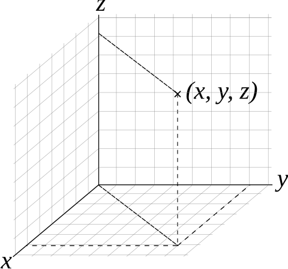
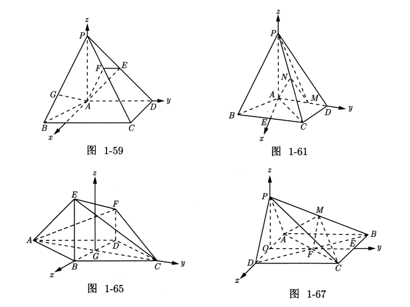

# 直线平面

## 坐标系

### 空间坐标系

直角坐标系也可以推广至三维空间与高维空间。

{ width="40%" }

在原本的二维直角坐标系，再添加一个垂直于 $x$ 轴、$y$ 轴的坐标轴，称为 $z$ 轴。

### 建系概述

- 如果几何体存在互相垂直的三条棱，但是它们不交于一点，那么我们可以将它们平移到某一顶点，

- 如果几何体不存在三条棱两两垂直，但是存在侧棱垂直于底面，那么我们需要在底面上找到两条互相垂直的直线作为 $x$ 轴和 $y$ 轴，而垂直于底面的侧棱作为 $z$ 轴。

- 如果几何体不存在侧棱垂直于底面，但是存在侧面垂直于底面，我们可以利用面面垂直的性质定理找出线面垂直。

- 有时候我们会遇到空间几何中的动点问题，若动点在坐标轴上，则设出该动点坐标；若动点不在坐标轴上，而是在某线段上，则应该利用向量来表示该线段，从而得到动点坐标。

{ width="100%" }

特殊建系方法：

- 非正交建系，注意此时向量的点乘（夹角）可能发生改变，但平行性不变。

## 直线与平面

### 直线方程

### 平面方程

我们知道，平面上的任意一个向量垂直于法向量，因此可以用一个法向量和平面上任意一点确定一个平面。

假设 $M_0(x_0,y_0,z_0)$ 在平面 $\alpha$ 上，平面法向量 $\bm n=(A,B,C)$，我们知道平面上任意一点 $M(x,y,z)$ 满足：

$$
\overrightarrow{MM_0}\cdot\bm n=0
$$

化简开得到一个简洁的式子：

$$
A(x-x_0)+B(y-y_0)+C(z-z_0)=0
$$

这个成为点法式方程，展开后得到一般式方程：

$$
Ax+By+Cz+D=0
$$

其中，

$$
D=-(Ax_0+By_0+Cz_0)
$$

我们知道如果 $D=0$ 那么意味着平面过原点。

快速写出平面方程：直接写出点法式方程，观察展开。

### 点到平面的距离

平面外一点 $P(x_1,y_1,z_1)$ 到平面 $Ax+By+Cz+D=0$ 的距离为：

$$
\text{dis}=\dfrac{Ax_1+By_1+Cz_1+D}{\sqrt{A^2+B^2+C^2}}
$$

