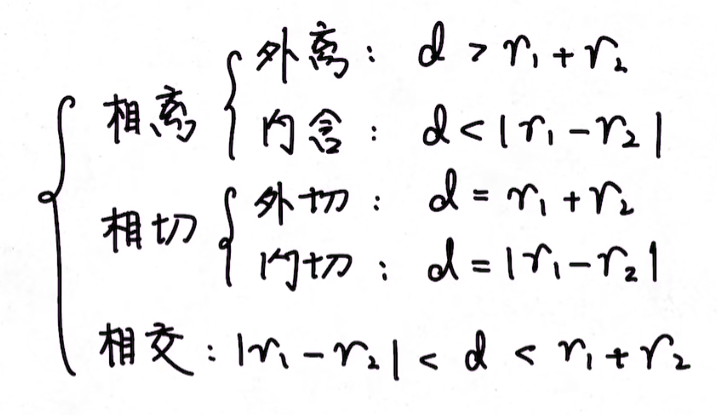
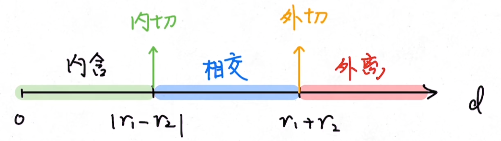
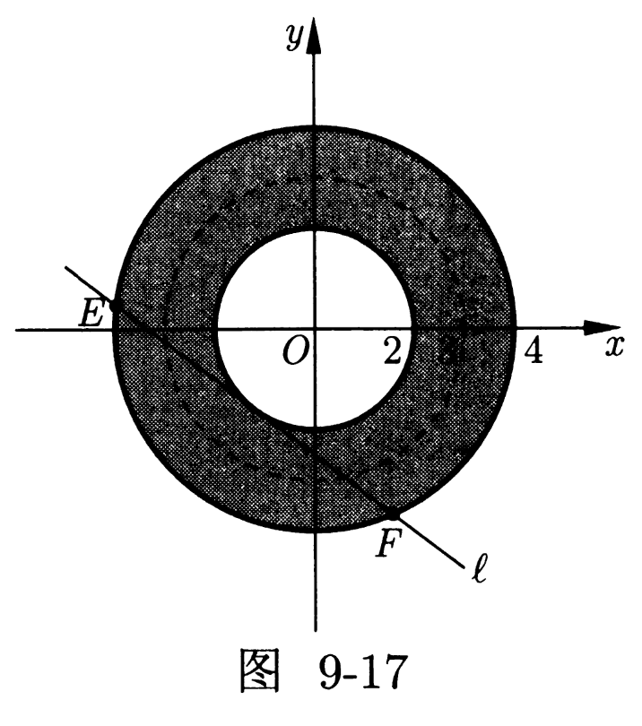

# 直线和圆

## 直线方程

### 点斜式

确定一条直线需要两条信息，假设我们知道了一条直线过一个点 $(x_0,y_0)$，那么我们只需要知道这条直线的倾斜角或者斜率，就可以确定这条直线了。

我们定义直线的方向为直线向上的方向，这个方向与 $x$ 轴正半轴的夹角 $\theta$，记为这条直线的**倾斜角**，倾斜角的范围是 $\theta\in[0,\pi)$。特殊的，规定 $x$ 轴的倾斜角为 $0$。

我们定义直线的**斜率**为：

$$
k=\dfrac{y_2-y_1}{x_2-x_1},x_1\neq x_2
$$

也就是，$x$ 每增加 $1$，$y$ 的变化量就是直线的斜率，特殊的，我们不定义平行于 $y$ 轴的直线的斜率。容易得到：

- 倾斜角 $\alpha\in(0,\pi/2)$，斜率 $k>0$，$y$ 随 $x$ 增大而增大。

- 倾斜角 $\alpha\in(\pi/2,\pi)$，斜率 $k<0$，$y$ 随 $x$ 增大而减小。

$$
k=\tan\theta,\quad\theta=\arctan k
$$

因此，我们就可以得到直线方程的点斜式：

$$
\boxed{y-y_0=k(x-x_0)}\tag{\scriptsize\text{点斜式}}
$$

### 两点式

容易知道，两点确定一条直线，如果两点横坐标不相等，我们可以这么写出直线方程：

$$
\boxed{y-y_1=\dfrac{y_2-y_1}{x_2-x_1}(x-x_1)}\tag{\scriptsize\text{两点式}}
$$

可以认为是把点斜式和斜率的公式带入而已，也可以认为是：

$$
\boxed{\dfrac{y-y_1}{x-x_1}=\dfrac{y_2-y_1}{x_2-x_1}}\tag{\scriptsize\text{两点式}}
$$

等一系列斜率的等式。

### 向量式

我们知道过一个点的直线可以用法向量或方向向量来表示，我们将在一般式中用到法向量，因此这里用方向向量的方法。假设 $M_0(x_0,y_0)$ 在直线 $\ell$ 上，直线方向向量 $\bm e=(A,B)$，因此直线上任意一点满足：

$$
\overrightarrow{OM}=\overrightarrow{OM_0}+\lambda\bm e,\lambda\in\R
$$

容易知道，直线斜率就是 $B/A$。

### 参数式

从向量式出发，可以将参数 $\lambda$ 引入方程组：

$$
\begin{cases}
x&=x_0+A\lambda\\
y&=y_0+B\lambda
\end{cases}
$$

或者从点斜式出发：

$$
\begin{cases}
x&=x_0+\lambda\cos\alpha\\
y&=y_0+\lambda\sin\alpha
\end{cases}
$$

称为参数式，这个表示不常用。

### 斜截式

当一个点横坐标为 $0$，点斜式就退化为斜截式，斜截式的通式为：

$$
\boxed{y=kx+b}\tag{\scriptsize\text{斜截式}}
$$

其中 $b$ 称为纵截距，这也是初中数学的常用形式。

### 截距式

当两点分别在 $x,y$ 轴上，两点式退化为截距式：

$$
\boxed{\dfrac{x}{a}+\dfrac{y}{b}=1}\tag{\scriptsize\text{截距式}}
$$

注意：正比例函数 $y=x$ 无法写成截距式，这个通常要特殊讨论。

表示两点分别是 $(a,0),(0,b)$，分别称为横截距和纵截距。

### 一般式

我在这里用法向量的方法做截距式，如下：

一条直线过 $M_0(x_0,y_0)$，且法向量为 $\bm n=(A,B)$，则对于直线上一点 $M(x,y)$ 有：

$$
MM_0\cdot\bm n=0
$$

展开得到：

$$
A(x-x_0)+B(y-y_0)=0
$$

设 $C=-(Ax_0+By_0)$，那么可以得到一般式：

$$
\boxed{Ax+By+C=0}\tag{\scriptsize\text{一般式}}
$$

在这形式下，直线的斜率是 $-\dfrac{A}{B}$ ，横截距是 $-\dfrac{C}{A}$ ，纵截距是 $-\dfrac{C}{B}$。

特殊的，如果直线过原点，则 $C=0$；对于斜率不存在的，直线方程就为 $x=x_0$。

写一般式技巧：

- 用两种方式表示斜率，比如用 $(x,y)$ 点和任意给定的一点，给定的两点，然后化简。

## 圆的方程

在有关圆的问题中几何法往往是第一选择，但解析几何的意思就是用代数的万法研究几何问题。在这里代数方法指的就是坐标法求出坐标成了最关键的一步，而求坐标的大前提就是需要联立直线与圆的方程，我们会在圆锥曲线中详细讨论这个问题。

### 极坐标

理解：在笛卡尔坐标系中，我们关心的是点到坐标轴的距离，同样，我们也可以关心点到原点的距离，那么，我们还需要一个「方向」信息，于是我们引入点与原点的连线与 $x$ 轴的夹角，即为极坐标。

- 在平面上选一定点 $O$，称为极点。
- 自极点引出一条射线 $Ox$，称为极轴。
- 选择一个单位长度（在数学问题中通常为 $1$），一个角度单位（通常为弧度）及其正方向（通常为逆时针方向）。

就建立了平面极坐标系。设 $A$ 为平面上一点。

- 极点 $O$ 与 $A$ 之间的距离 $|OA|$ 称为极径，记为 $\rho$。
- 以极轴为始边，$OA$ 为终边的角 $\angle xOA$ 称为极角，记为 $\varphi$。
- 那么有序数对 $(\rho,\varphi)$ 即为 $A$ 的极坐标。

由终边相同的角的定义可知，$(\rho,\varphi)$ 与 $(\rho,\varphi + 2k\pi)\ (k\in \mathbf{Z})$ 其实表示的是一样的点。特别地，极点的极坐标为 $(0,\varphi)\ (\varphi \in \mathbf{R})$，于是平面内的点的极坐标表示有无数多种。如果规定 $\rho \ge 0,0 \le \varphi < 2\pi$，那么除极点外，其他平面内的点可以用唯一有序数对 $(\rho,\varphi)$ 表示，而极坐标 $(\rho,\varphi)$ 表示的点是唯一确定的。

当然，有时候研究极坐标系下的图形有些不方便。要想转到直角坐标系下研究，有互化公式。点 $A(\rho,\varphi)$ 的直角坐标 $(x,y)$ 可以如下表示：

$$
\begin{cases}
x &= \rho \cos \varphi \\
y &= \rho \sin \varphi
\end{cases}
$$

进而可知：

$$
\begin{aligned}
\rho^2 &= x^2 + y^2\\
\tan \varphi &= \frac{y}{x}\quad(x\not =0)
\end{aligned}
$$

于是有 $\rho = \sqrt{x^2+y^2}$。但具有相同 $\dfrac{y}{x}$ 的 $\tan\varphi$ 有两个可能的 $\varphi$ 的值，此时还需要根据 $x, y$ 的值来确定方向。具体地，定义函数：

$$
\operatorname{atan2}(y, x) = \begin{cases}
\arctan(\frac{y}{x}) & \text{if } x > 0 \\
\arctan(\frac{y}{x}) + \pi & \text{if } y \ge 0, x < 0 \\
\arctan(\frac{y}{x}) - \pi & \text{if } y < 0, x < 0 \\
\pi/2 & \text{if } y > 0, x = 0 \\
-\pi/2 & \text{if } y < 0, x = 0 \\
\text{any} & \text{if } y = 0, x = 0
\end{cases}
$$

则 $\varphi = \operatorname{atan2}(y, x)$。注意上述函数的值域为 $(-\pi, \pi]$。

注意，在极坐标中表示直线或曲线，我们常用 $\rho=f(\varphi)$ 的函数。

### 标准方程

我们知道圆可以通过圆心和半径确定，我们写出距离公式：

$$
\boxed{(x-a)^2+(y-b)^2=r^2}
$$

即为圆的标准方程，而圆内和圆外分别为小于号和大于号。

单位圆的标准方程：

$$
x^2+y^2=1
$$

### 一般方程

我们将标准方程展开：

$$
x^2+y^2-2ax-2by+a^2+b^2-r^2=0
$$

分别设：

$$
\begin{cases}
D&=-2a\\
E&=-2b\\
F&=a^2+b^2-r^2
\end{cases}
$$

而根据次数，$A,B,C$ 分别为 $x^2,y^2,xy$ 的系数，分别为 $1,1,0$，我们不在一般方程中体现，但是字母保留，不用写出，因此字母应当从 $D$ 开始写，即一般方程：

$$
\boxed{x^2+y^2+Dx+Ey+F=0}
$$

一个圆一定可以表示成这个形式，但是满足这个形式的不一定是一个圆，根据配方法：

$$
\boxed{\left(x+\dfrac{D}{2}\right)+\left(y+\dfrac{E}{2}\right)=\dfrac{D^2+E^2-4F}{4}}
$$

因此只要 $D^2+E^2>4F$，该方程就可以表示一个圆了；特殊的，如果 $D=E=F$ 则该方程表示一个点 $(0,0)$。具体的，圆心：$\left(-\dfrac{D}{2},-\dfrac{E}{2}\right)$，半径：$\dfrac{\sqrt{D^2+E^2-4F}}{2}$。

做题方法：

- 一般来说，给定三个点，会求一般方程，因为一般方程是一次方程。

- 如果有两个点某坐标相等，那么做出垂直平分线，然后设出标准方程。

- 一般方程判断点是否在圆内、外，只需要用左式与 $0$ 比较即可，大于 $0$ 在圆外，小于 $0$ 在园内。

直径方程：已知一个圆的一条直径 $AB$，则圆的方程可以表示为：

$$
\boxed{(x-x_1)(x-x_2)+(y-y_1)(y-y_2)=0}
$$

容易知道根据直径所对圆周角是直角，向量点积为零得到，即为圆的方程。

已知点 $A(x_1, y_1)$，$B(x_2, y_2)$，若

$$
\overrightarrow{AP} \cdot \overrightarrow{BP} = \lambda
$$

则点 $P$ 的轨迹是圆，其方程为：

$$
(x - x_1)(x - x_2) + (y - y_1)(y - y_2) = \lambda
$$

其中 $(x_1 - x_2)^2 + (y_1 - y_2)^2 + 4\lambda > 0$。

### 参数方程

容易知道：

$$
\boxed{\begin{cases}
x&=a+r\cos\theta\\
y&=b+r\sin\theta
\end{cases}}
$$

也可以表示一个圆。

## 直线和圆

### 平行与垂直

基本思想：

- 两条直线平行，当且仅当 $k_1=k_2$ 或 $\theta_1=\theta_2$。

- 两条直线垂直，当且记得 $k_1k_2=-1$ 或 $\theta_1+\theta_2=90^\circ$。

做题方法：

- 验证三点共线：将直线分为两半，证明夹角为 $180^\circ$ 或两段斜率相等。

- 验证两直线是否平行：在两直线上任取三个点（不在同一直线上），随便验证两个斜率是否相等即可。

- 除非特殊优势，一般情况下可以常用点斜式和一般式来进行书写直线方程。

- 用方向向量和法向量可以规避对斜率不存在的讨论，经常可以快速解题。

- 关于坐标轴对称，优先用斜截式，因为斜率和纵截距一定是有关系的。

- 圆上的点与点的距离的最值往往可以转化为圆心与这个点的距离加上半径或者减去半径求出。

- 已知点 $N$ 是圆 $C$ 内一点，则过点 $N$ 的直线与圆所交得的弦的长度的最大值为圆的直径，最小值为垂直于过点 $N$ 的直径的弦的长度，垂足为点 $N$。

### 交点与距离

给出两条直线：

$$
\begin{cases}
\ell_1:&A_1x+B_1y+C_1=0\\
\ell_2:&A_2x+B_2y+C_2=0
\end{cases}
$$

求交点，即为 $Q(x,y)$ 满足上述两式，解方程组即可，我们写出矩阵：

$$
\begin{bmatrix}A_1 & B_1 \\A_2 & B_2\end{bmatrix}\begin{bmatrix} x \\ y\end{bmatrix}=\begin{bmatrix}-C_1\\-C_2\end{bmatrix}
$$

根据克拉默法则，若 $A_1B_2-A_2B_1\neq0$ 则方程有解，且：

$$
\begin{cases}
x&=\dfrac{B_1C_2-B_2C_1}{A_1B_2-A_2B_1}\\
y&=\dfrac{A_2C_1-A_1C_2}{A_1B_2-A_2B_1}
\end{cases}
$$

两点 $A(x_1,y_1),B(x_2,y_2)$ 间的距离：

$$
\boxed{\begin{aligned}
\text{dis}&=\sqrt{(x_2-x_1)^2+(y_2-y_1)^2}\\
&=\sqrt{k^2+1}|x_2-x_1|
\end{aligned}}
$$

在圆锥曲线中，后者称为弦长公式。

点 $(x_0,y_0)$ 到直线 $Ax+By+C=0$ 的距离：

$$
\boxed{\text{dis}=\dfrac{Ax_0+By_0+C}{\sqrt{A^2+B^2}}}
$$

两直线的距离，假设两条平行直线可以表示为：

$$
\begin{cases}
\ell_1:&Ax+By+C_1=0\\
\ell_2:&Ax+By+C_2=0
\end{cases}
$$

写出点到直线距离公式，将另一直线带入分子：

$$
\boxed{\text{dis}=\dfrac{|C_2-C_1|}{\sqrt{A^2+B^2}}}
$$

### 位置的关系

- 直线和圆的位置关系：相离、相切、相交。

    1. 圆心到直线的距离，与圆的半径比较。

        $$
        d=\dfrac{Ax_O+By_O+C}{\sqrt{A^2+B^2}}
        $$

        弦长根据垂径定律，为 $2\sqrt{r^2-d^2}$。

    2. 联立，求交点个数，即方程的解的个数，通常用带入消元。得到交点后，可以用距离公式得到弦长。

- 圆与圆的位置关系：

    { width="70%" }
    
    对应距离图示如下：

    { width="90%" }

    除了用圆心距离，同样可以联立，解方程可以用加减消元。两个二次项系数相等的圆的直线方程的差，就是交点所确定的直线的直线方程。

### 切线的问题

两圆位置关系与公切线条数的关系：

- 两圆外离 ⇔ 公切线有 $4$ 条；
- 两圆外切 ⇔ 公切线有 $3$ 条；
- 两圆相交 ⇔ 公切线有 $2$ 条；
- 两圆内切 ⇔ 公切线有 $1$ 条；
- 两圆内含 ⇔ 公切线有 $0$ 条。

过圆（下面的内容详见 [GeoGebra](https://www.geogebra.org/calculator/z27tcbb5)）：

$$
(x−a)^2+(y−b)^2=r^2
$$

- **圆上**一点 $P(x_0,y_0)$ 作圆的切线，则以 $P(x_0,y_0)$ 为切点的切线方程为：

- **圆外**一点 $P(x_0,y_0)$ 作圆的两条切线，则两切点所在的直线方程为：

$$
\boxed{(x_0−a)(x−a)+(y_0−b)(y−b)=r^2}
$$

注意：当设出直线，一定要考虑斜率不存在的情况，这个时候是无法通过直线方程解出来的。

- 已知切线：连接圆心和切点，有垂直关系。

- 过一点求切线：设直线方程，解方程圆心到直线的距离为半径，应该有两条切线。

- 若直线与圆相交，那么圆心到直线的距离 $d$、弦长 $L$ 的一半以及圆的半径 $r$ 刚好构成了一个小的直角三角形，则 $r^2=d^2+(L/2)^2$。

- 当涉及恒过定点的直线与曲线（完整的圆除外）有交点的时候，首先确定相应的临界情形（初始位置），然后绕着定点旋转直线，直到完全符合题意才终止旋转。

## 特殊问题

### 圆心系

我们考虑这个方程：

$$
(x-3\cos\theta)^2+(y-3\sin\theta)^2=1
$$

容易知道，这是一个以 $(3\cos\theta,3\sin\theta)$ 为圆心、半径为 $1$ 的圆，

{ width="40%" }

这样的圆有无数个，围成了一个圆环。

### 圆的包络

我们知道过圆 $(x-a)^2+(y-b)^2=r^2$ 外一点 $P(x_0,y_0)$ 的切线方程为：

$$
(x_0-a)(x-a)+(y_0-b)(x-b)=r^2
$$

带入圆的参数方程：

$$
\boxed{(x-a)\cos\theta+(y-b)\sin\theta=r}
$$

我们发现该直线所围成的图形就是圆，只要过圆上任意一点作圆的切线构成的集合就可以把整个圆包络在里面。因此我们把该直线称为是圆的包络线。

### 阿波罗尼斯圆

已知平面上两点 $A,B$，则所有满足 $PA/PB=k$（$k\neq1$）的点 $P$ 的轨迹是一个圆。

$$
\boxed{\dfrac{(x-x_a)^2+(y-y_a)^2}{(x-x_b)^2+(y-y_b)^2}=k^2}
$$

整理可以得到圆的方程，但是阿波罗尼斯圆的常见找法是，在 $AB$ 所在直线上找到满足条件的两个点，以两点中点为圆心作圆即可。

阿氏圆的性质：$\triangle POA\backsim\triangle POB$，根据相似。

