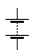
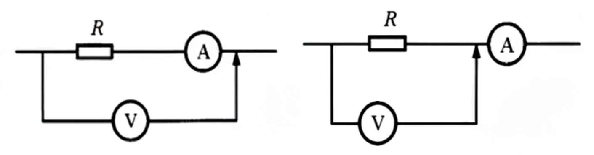

# 恒定电流

## 电路概述

### 电流定义

电流：

- 电流：电荷的定向移动。

- 电流方向于正电荷运动方向相同，与负电荷（电子）运动方向相反。

电流的分类：

- 恒定电流：大小和方向都不变的电流。

- 直流电：方向不变的电流。

- 交流电：方向改变的电流。

物理学定义：

- 定义：单位时间内通过导体横截面的电荷量。

- 定义式：$I=\dfrac{Q}{t}$。

额外的，有微观表达式：$I=neSv$。

- 其中 $n$ 表示通过导体横截面的电子数。

- 其中 $e$ 表示电子的电荷量。

- 其中 $S$ 表示导体的横截面积大小。

- 其中 $v$ 表示导体中自由电子的运动速率。

三种速度数量级：

- 电子定向移动速率：$\pu{10^-5m/s}$。

- 电子热运动速率：$\pu{10^5m/s}$。

- 电子的传导速率：$\pu{10^8m/s}$，即电场的形成速率。

### 欧姆定律

欧姆定律表明：处于某状态的导电体（**定温下**），其两端的电压与通过电导体的电流成正比，即：

$$
U\propto I
$$

- 人教版高中物理教材指出：欧姆定律适用于金属、电解液导电，不适用气态导体和半导体导电。

- 哈里德《物理学基础》指出，欧姆定律要求通过一器件的电流始终正比于加到该器件上的电势差。

也就是说，欧姆定律**仅适用于线性电路**。

电动势与电流的比例，即电阻，不会随着电流而改变。根据焦耳定律，导电体的焦耳加热与电流有关，当传导电流于导电体时，导电体的温度会改变，这称为温度效应。电阻对于温度的相关性，使得在典型实验里，电阻跟电流有关，从而很不容易直接核对这形式的欧姆定律。

需要注意的是，欧姆定律并没有提到电阻，而电阻的定义式与欧姆定律非常类似：

$$
R=\dfrac{U}{R}
$$

实际上有一定区别：

- 欧姆定律仅限于线性电路。

- 电阻的定义式对于任意元件成立，因为电阻与电路无关。

这也是欧姆定律的一个常见错误认知[^note100]。

[^note100]: <https://zh.wikipedia.org/wiki/欧姆定律#常見錯誤>。

### 电阻定律

我们知道电阻的决定式如下：

$$
R=\rho\dfrac{l}{S}
$$

其中 $\rho$ 为电阻率。

而对于一个均匀的柱体电阻，可以得到：

$$
R=\rho\dfrac{l}{S}=\rho\dfrac{l^2}{V}
$$

### 焦耳定律

发热量：

$$
Q=I^2Rt
$$

电功推导：

$$
W=Uq=UIt
$$

而热功率和电功率分别除以时间就可以了。

以上三个公式，适用于**任何电路**，而对于纯电阻电路才可以根据欧姆定律得到 $I^2R=UI$，我们将在电动机部分详细解释。

## 电路应用

### 电动势

电动势表征一些电路元件供应电能的特性（非静电力做功的本质），这些电路元件称为电动势源，而电动势源所供应的能量每单位电荷是其电动势，有公式表达：

$$
\mathcal{E}=\dfrac{W}{Q}
$$

即把 $\pu{1C}$ 正电荷从负极运回正极所做的功。通常，这能量是分离正负电荷所做的功，由于这正负电荷被分离至元件的两端，会出现对应电场与电势差。

| 符号 | 符号 |
| :-: | :-: |
| 理想电压源  | 理想电流源  |
| 受控电压源  | 受控电流源  |
| 单电池  | 电池组  |

电池内阻相当于一个电池串联一个电阻，如果没有特殊说明，**电池的内阻不可忽略**。

### 串并联规律

串联规律：

- 电流 $I$ 相同、分压 $U=U_1+U_2$。

    $$
    \begin{aligned}
    I_1&=I_2\\
    \dfrac{U_1}{U_2}&=\dfrac{R_1}{R_2}
    \end{aligned}
    $$

- 等效电阻为一个 $R=R_1+R_2$ 的电阻。

并联规律：

- 电压 $U$ 相同，分流 $I=I_1+I_2$。

    $$
    \begin{aligned}
    U_1&=U_2\\
    I_1R_1&=I_2R_2\\
    \dfrac{I_1}{I_2}&=\dfrac{R_2}{R_1}
    \end{aligned}
    $$

- 等效电阻为一个 $R=\dfrac{R_1R_2}{R_1+R_2}$ 的电阻，记为鸡在和上飞。

- 多电阻等效：

    $$
    \dfrac{1}{R}=\dfrac{1}{R_1}+\dfrac{1}{R_2}+\dots+\dfrac{1}{R_n}
    $$

### 伏安特征曲线

- 只有图像是一条过原点的直线，才是线性元件，斜率是 $1/R$。

- 电灯泡随着电流、电压、电功率增大，电阻增大。

- 曲线向 $U$ 轴偏移为电压增加电阻变大，向 $I$ 轴偏移为电压增大电阻变小。

### 电动机概述

对于电动机，根据能量守恒：

$$
\begin{aligned}
W_电&=Q+W_机\\
UIt&=I^2Rt+W_机
\end{aligned}
$$

因此，再根据一些推导，我们可以得到：

$$
UI>I^2R>\dfrac{U^2}{R}
$$

从基本原理出发，具体的原因需要从线圈开始说。

- 我们声称 $R$ 为电动机线圈的电阻，而 $U,I$ 是根据实际测量得到的。

- 通电线圈在磁场中受到安培力而转动。当线圈在磁场中转动时，它同时也在切割磁感线。根据法拉第电磁感应定律，切割磁感线的导体内部会产生感应电动势。根据楞次定律，这个感应电动势的方向总是要阻碍引起它的原因。在这里，引起感应电动势的原因是线圈的转动，而线圈的转动是由电源电流引起的。因此，这个感应电动势的方向与电源电压的方向相反，起到了阻碍电流的作用，所以被称为**反电动势**。

    

- 所以，电路方程是：

    $$
    U=U_反+IR
    $$

    两端同时乘以 $I$，得到：

    $$
    UI=U_反I+I^2R
    $$

    也就是说其实，

    $$
    U_反I=P_机
    $$

    这就揭示了本质：电能之所以能转化为机械能，正是通过反电动势实现的。反电动势是机械运动和电磁感应的直接结果。

- 然而当电机卡死的时候，就不存在这个反电动势了，因此电路中的电流会增加，所有的输入电能**全部转化为了热能**，导致发热增加。这也就是为什么电机卡死的时候，可能会烧坏电机。

总之，对于电机来说，无论其是否转动，欧姆定律肯定是适用的。只是当其转动时，加在线圈两端的电压要减掉其产生的反电动势而已。

## 电路测量

### 电表改装

**检流计** $-\kern{-0.4em}\bigcirc\kern{-1em}{\scriptsize\text{G}}\kern{0.05em}-$：也称为**表头**，被用于测量**微弱电流**。指针式的表头是一只高灵敏度的磁电式灵敏检流计，其工作原理为利用电流的磁效应，当电流通过其导线时，会产生磁场，与永久磁铁互斥而带动指针旋转，与磁电式电流表基本相同。电表的主要性能指标基本上取决于表头的性能。表头的灵敏度是指表头指针满刻度偏转时流过表头的直流电流值，这个值越小，表头的灵敏度愈高，其性能就越好。

检流计有内阻 $\Omega$、最大电压 $U$ 和最大电流 $I$，满足欧姆定律，检流计与大电阻串联构成电压表 $-\kern{-0.4em}\bigcirc\kern{-1em}{\scriptsize\text{V}}\kern{0.1em}-$，与小电阻并联构成电流表 $-\kern{-0.4em}\bigcirc\kern{-1em}{\scriptsize\text{ I}}\kern{0.2em}-$，由欧姆定律分压分流规律，可以计算出应该串联、并联多大的电阻。

### 伏安法测电阻

电流表内接法（电流表在电压表里面）：

- 电压表测电流表和电阻的电压，电压偏大、电流准确，电阻偏大。

- 当待测电阻远大于电流表内阻（大电阻）时，测量结果较为准确。

电流表外接法（电流表在电压表外面）：

- 电流表测电压表和电阻的电流，电流偏大、电压准确，电阻偏大。

- 当待测电阻远小于电压表内阻（小电阻）时，测量结果较为准确。

伏安法测电阻：将预估 $R_x$ 与 $\sqrt{R_AR_B}$ 比较，大（$R_x>\sqrt{R_AR_B}$）内偏大，小（$R_x<\sqrt{R_AR_B}$）外偏小。

### 惠斯通电桥

惠斯通电桥是一种测量工具，用来精确测量未知电阻器的电阻。

将待测电阻 $R_x$ 和 $R_3$ 串联，可变电阻 $R_2$ 和 $R_1$ 串联。再将这两个串联电路并联，在各路中点间接入检流计 $V_G$。其中 $V_G$ 可以认为是测量电势差的，或是测量电流的，因为这是等价的。

我们得出结论，当且仅当 $\displaystyle{R_x\over R_3}={R_2\over R_1}$ 时，电桥平衡（灵敏电流计无示数）。

/// caption
百科解法：有基尔霍夫电路定律可得。
///

一句话：$D$ 和 $B$ 等势的时候灵敏电流计无示数，结论显然。

### 滑动变阻器

**变阻器**，又称**电位器**，是种具有三个端子，其中有两个固定接点与一个滑动接点，可经由滑动而改变滑动端与两个固定端间电阻值的电子零件，属于被动元件，使用时可形成不同的分压比率，改变滑动点的电位，因而得名。

只有两个端子的（或已将滑动端与其中一个固定端保持连接，对外实际只有两个有效端子的）并不称为电位器，只能称为可变电阻，或可变电阻器。

常见的碳膜或陶瓷金属膜的电位器可以透过铜箔或铜片与印刷膜接触，经旋转或滑动产生输出、输入端的不同电阻。至于需要较大功率的电位器则是使用线绕式。电位器有时会合并附带其他功能，例如在最小的一端附带关闭电源。

滑动变阻器的限流式和分压式。

{ width="90%" }

- 限流式：电路简单，调控范围小，选大电阻。

- 分压式：电路复杂，调控范围大，选小电阻。

## 电路题型

### 等电势法

原理：

1. 一根导线上，电势处处相等（等势体）。

2. 经过用电器后，电势降低，数值上等于用电器两端电压。

3. 如果没有电流通过用电器，例如理想电压表串联电阻，则可以将电阻视为等电势。

将不同电势分别描出来，确定用电器两端电势。

变形法：具体而言，将电路翻转、伸缩、变形，到达容易分辨的效果。

### 闭合电路

基本概念：

- 内电路：电源内部的电路，$U_内=Ir_内$。

- 外电路：电源外部的电路，$U_外=E-U_内$。

- 测外电压（路端电压）：直接把电压表并在电池两端。

在闭合电路部分，除非特殊说明，电表和电池一般不能看做理想的。

- 理论基础：串并联规律、欧姆定律。

- 滑动变阻器电阻增大 $\implies$ 总电阻增大 $\implies$ 总电流减小 $\implies$ 内电路电压减小、外电路电压增大。

- 总电流减小，一条支路电流增大，另一条支路（滑动变阻器所在支路）电流减小。路端电压增大，滑动变阻器串联的电阻电压减小，滑动变阻器电压增大。

- 电路故障：将短路视为电阻减小到零，断路视为电阻增加到无穷大。

- 串反并同：前提是电源有内阻，外电路仅有电阻串联后并联。对于电流、电压、电功率，与滑动变阻器串联的用电器与滑动变阻器阻值变化相反，与滑动变阻器并联的用电器与滑动变阻器阻值变化相同。

- 未知电源电动势、内阻：联立两个方程，

    $$
    E=U_外+Ir_内
    $$

    对两个状态列方程即可。

功率最值问题：

- 若研究对象为定值：$R_变=0$ 时功率最大。

- 若研究对象在改变：$R_研=R_{其他}$ 时功率最大。

$\Delta U/\Delta I$ 问题：

- 若研究对象电阻为定值：

    $$
    \dfrac{\Delta U}{\Delta I}=R
    $$

- 若研究对象电阻在改变：

    $$
    \dfrac{\Delta U}{\Delta I}=\dfrac{\Delta(E-U)}{\Delta I}=R_{其他}
    $$

### 含容电路

1. 恒定电路中电容器所在支路没有电流流过，把电容器看做一个理想电压表。

2. 通过电势法求出电容器两端的电势差，通过 $Q=CU$ 算出电荷量。

3. 如果电容器被直接串联在电池上，电路中没有电流，电容器电势差即为电源电动势。

### 图像问题

外电压-总电流（电源的 $U-I$）图：

- 图像为一条直线：

    $$
    U=E-rI
    $$

- 与 $y$ 轴交点为电源电动势，与 $x$ 轴交点为短路电流，斜率大小为内阻 $r$。

电阻的 $P-I$ 图像：

{ width="50%" }

电灯泡 $U-I$ 与电源 $U-I$ 联立：

- 根据短路电流 $I=E/r$ 得出横截距，以 $E$ 为纵截距在 $U-I$ 图上做出下降直线（电源）。

    { width="50%" }

- 电灯泡的 $U-I$ 曲线与电源的直线交点即为连接后的电路状态。

### 电路实验

测量电源的电动势和内阻：

理想情况下，电流表测外电流、电压表测外电压。

- **内接法**（电压表抱住电源和电流表）或外接法（电压表抱住滑动变阻器）：

    电压表不准（电流表分压，测小了），电流表测量准确。

    电动势测量准确，内阻测量值比真实值大。

    适用于内阻非常大的电池。

- **外接法**（电压表抱住电源）或内接法（电压表抱住滑动变阻器和电流表）：

    电压表测量准确，电流表不准（电压表分流，测小了）。

    电动势和内阻测量值均比真实值小。

    适用于内阻比较小的电池（绝大部分电池），一般情况下使用这种。

{ width="60%" }

### 物理量总结

| 中文     | 字母（单位）    | 公式                                    |
| :------: | :-------------: | --------------------------------------- |
| 电流     | $I$（$\pu{A}$） | $I = \frac{Q}{t} = \frac{U}{R}$         |
| 电动势   | $E$（$\pu{V}$） | $E = \frac{W}{q}$                       |
| 电压     | $U$（$\pu{V}$） | $U = I \cdot R$                         |
| 电阻     | $R$（$\Omega$） | $R = \frac{U}{I} = \rho \frac{l}{S}$    |
| 电功率   | $P$（$\pu{W}$） | $P = U \cdot I = I^2 R = \frac{U^2}{R}$ |
| 发热量   | $Q$（$\pu{J}$） | $Q = I^2 R t$                           |
| 供电效率 | $\eta$          | $\eta = \frac{U \cdot I}{E \cdot I}$    |

百科版本：

| 单位 | 符号 | 物理量 | 注 |
| :-: | :-: | :-: | - |
| 安培 | $A$ | **电流** | 基本单位 |
| 伏特 | $V$ | **电势**，电势差，电动势 | $=W\cdot A^{-1}$ |
| 欧姆 | $\Omega$ | **电阻**，电抗，阻抗 | $=V\cdot A^{-1}$ |
| 法拉 | $F$ | **电容** | |
| 亨利 | $H$ | 电感 | |
| 西门子 | $S$ | **电导**，导纳，磁化率 | $=\Omega^{−1}$ |
| 库仑 | $C$ | **电荷量** | $=A\cdot s$ |
| 欧姆⋅米 | $\Omega\cdot m$ | 电阻率 | $\rho$ |
| 西门子/每米 | $S\cdot m^{-1}$ | 电导率 | |
| 法拉/每米 | $F\cdot m^{-1}$ | 电容率；介电常数 | $\varepsilon$ |
| 反法拉 | $F^{−1}$ | 电弹性 | $=F^{−1}$ |
| 伏安 | $VA$ | 交流电功率，视在功率 | |
| 无功伏安 | $\mathit{var}$ | 无功功率，虚功 | |
| 瓦特 | $W$ | **电功率**，有功功率，实功 | $=J\cdot s^{-1}$ |
| 千瓦⋅时 | $kW⋅h$ | **电能** | $=3.6\,MJ$ |
