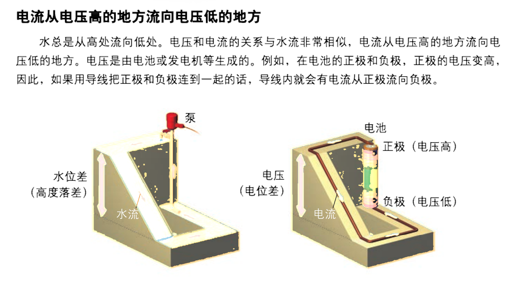

# 恒定电流

## 电路概述

### 电流定义

电流：

- 电流：电荷的定向移动。

- 电流方向于正电荷运动方向相同，与负电荷（电子）运动方向相反。

电流的分类：

- 恒定电流：大小和方向都不变的电流。

- 直流电：方向不变的电流。

- 交流电：方向改变的电流。

物理学定义：

- 定义：单位时间内通过导体横截面的电荷量。

- 定义式：$I=\dfrac{Q}{t}$。

额外的，有微观表达式：$I=neSv$。

- 其中 $n$ 表示通过导体横截面的电子数。

- 其中 $e$ 表示电子的电荷量。

- 其中 $S$ 表示导体的横截面积大小。

- 其中 $v$ 表示导体中自由电子的运动速率。

三种速度数量级：

- 电子定向移动速率：$\pu{10^-5m/s}$。

- 电子热运动速率：$\pu{10^5m/s}$。

- 电子的传导速率：$\pu{10^8m/s}$，即电场的形成速率。

电子运动速度这么低，为什么平常开灯的时候，按下开关的一瞬间灯就亮了呢？按下开关的一瞬间，导线内部的电场线光速建立好，使导线内部所有电子瞬间开始移动。注意这个过程是导线内所有电子同步开始移动的，虽然导线内开关处的电子移动到导线内灯泡处需要很长时间，但导线内灯泡处已经有电子了，这里的电子瞬间移动，就可以做功使灯泡发光。

电流既不依赖电路，也不依赖电源，任何电荷定向移动的情形都可以称作电流。如氢原子电子绕核运动可以等效为环形电流；原电池电解质溶液内离子的定向移动可以等效为电流；令一个摩擦后带上负电的橡胶棒向右运动，也可以等效为一个向左的电流。

一个 $\ce{H}$ 原子的电子绕核运动可等效为一环形电流。已知电子电量大小 $e$，周期 $T$，绕质子顺时针运动。求电流的方向和电流强度 $I$ 的大小。

我们知道，「电流的电流强度的大小是多少」这种问题，应该在电流是恒定电流的时候才有意义。然而这类环形电流模型有点不符合常规的恒定电流：它并不是相当于导线内部处处有电子，而只是一个孤立电子在运动。这会导致一个问题：考虑钦定 $\dfrac T 2$ 这个时间，那么一半的横截面被电子经过，另一半却没有，这真的是恒定电流吗？

与力学不同，载流子（这里是电子）是一粒一粒的，因此电流通常是在 统计意义下 讨论的，并不适用对于极度微小的时间上的讨论。事实上，对于恒定电流，我们不能保证在两段相等的微小时间内，经过电路中某一点的电荷总量绝对相同。足够严谨的说法是：在宏观尺度上选取任意两段相等的时间，经过电路中某一点的电荷总量几乎不变，也即 「恒定」是一个宏观意义上统计出的结果。

电子绕核运动速率很快，$T$ 很小。在统计意义上，对宏观尺度的时间计时，那么每个横截面经过电荷总量都近似相等，且与时间成正比，这就说明它是一个恒定电流。

那怎么计算这个恒定电流的大小呢？在统计意义上每个横截面经过的总电荷总量大小都近似相等，且与时间成正比，那这个比值就是电流大小了！分析一下这个比值，考虑经过宏观时间 $t$ 后，电子应近似做了 $\dfrac t T$ 次圆周运动，那么经过每个横截面的总电荷总量大小为 $\dfrac{t e}T$。除以总时间 $t$ 即可得到电流大小 $\dfrac{e}T$。

或者，可以直接钦定经过时间为 $T$ 的倍数，比如直接钦定为 $T$。那么经过每个横截面的电荷总量就是 $e$，可以直接计算得 $\dfrac{e}T$。这里虽然选用了微小时间，但是它可以保证计算出的结果在统计意义上也正确，因为在统计意义上，一段宏观时间的电子运动就是很多次圆周运动拼起来（一次运动了部分圆周的运动可以忽略），而无论多少次圆周运动拼起来，统计意义上计算出的电流都等于 $\dfrac{e}T$。

因此，对于单电子环形电流问题，取周期 $T$ 计算经过每个横截面的总电荷总量大小即可。

电流的方向为电子定向移动方向的反方向，即逆时针方向。经过时间 $T$ 后，经过任一横截面的电荷总量大小为 $e$。因此，电流大小为 $\dfrac{\mathrm{e}}T$。

### 欧姆定律

欧姆定律表明：处于某状态的导电体（**定温下**），其两端的电压与通过电导体的电流成正比，即：

$$
U\propto I
$$

- 人教版高中物理教材指出：欧姆定律适用于金属、电解液导电，不适用气态导体和半导体导电。

- 哈里德《物理学基础》指出，欧姆定律要求通过一器件的电流始终正比于加到该器件上的电势差。

也就是说，欧姆定律**仅适用于线性电路**。

电动势与电流的比例，即电阻，不会随着电流而改变。根据焦耳定律，导电体的焦耳加热与电流有关，当传导电流于导电体时，导电体的温度会改变，这称为温度效应。电阻对于温度的相关性，使得在典型实验里，电阻跟电流有关，从而很不容易直接核对这形式的欧姆定律。

需要注意的是，欧姆定律并没有提到电阻，而电阻的定义式与欧姆定律非常类似：

$$
R=\dfrac{U}{R}
$$

实际上有一定区别：

- 欧姆定律仅限于线性电路。

- 电阻的定义式对于任意元件成立，因为电阻与电路无关。

这也是欧姆定律的一个常见错误认知[^note100]。

[^note100]: <https://zh.wikipedia.org/wiki/欧姆定律#常見錯誤>。

温度降低时，金属导体电阻率将会减小，一些金属在温度特别低时电阻可以减小到 $0$，称之为超导现象。目前发现的超导体只能在很低温度下保持超导性质。

在恒定电场的作用下，导体中的自由电荷做定向运动，在运动过程中与导体内不动的粒子不断碰撞，碰撞阻碍了自由电荷的定向运动（这个阻碍作用对应的就是导体的电阻）。

超导体上欧姆定律不成立，可以这样认为：欧姆定律适用于「电荷仅受电场力和与导体内不动粒子碰撞产生的阻力两个力作用」的情形，然而这里「电荷仅受电场力作用」。

### 电阻定律

我们知道电阻的决定式如下：

$$
R=\rho\dfrac{l}{S}
$$

其中 $\rho$ 为电阻率。

而对于一个均匀的柱体电阻，可以得到：

$$
R=\rho\dfrac{l}{S}=\rho\dfrac{l^2}{V}
$$

### 焦耳定律

发热量：

$$
Q=I^2Rt
$$

电功推导：

$$
W=Uq=UIt
$$

而热功率和电功率分别除以时间就可以了。

以上三个公式，适用于**任何电路**，而对于纯电阻电路才可以根据欧姆定律得到 $I^2R=UI$，我们将在电动机部分详细解释。

## 电路应用

### 电动势

电动势表征一些电路元件供应电能的特性（非静电力做功的本质），这些电路元件称为电动势源，而电动势源所供应的能量每单位电荷是其电动势，有公式表达：

$$
\mathcal{E}=\dfrac{W}{Q}
$$

即把 $\pu{1C}$ 正电荷从负极运回正极所做的功。通常，这能量是分离正负电荷所做的功，由于这正负电荷被分离至元件的两端，会出现对应电场与电势差。

| 符号 | 符号 |
| :-: | :-: |
| 理想电压源  | 理想电流源  |
| 受控电压源  | 受控电流源  |
| 单电池  | 电池组  |

电池内阻相当于一个电池串联一个电阻，如果没有特殊说明，**电池的内阻不可忽略**。

### 串并联规律

串联规律：

- 电流 $I$ 相同、分压 $U=U_1+U_2$。

- 等效电阻为一个 $R=R_1+R_2$ 的电阻。

并联规律：

- 电压 $U$ 相同，分流 $I=I_1+I_2$。

- 等效电阻为一个 $R=\dfrac{R_1R_2}{R_1+R_2}$ 的电阻，记为鸡在和上飞。

串联电路：根据以上两个基本特点，运用欧姆定律，很容易得到以下三个推论。

1.  串联电路的总电阻(等效电阻)等于各电阻之和，即

    $$R=R_1+R_2+R_3$$

2.  串联电路中各电阻的电压与它们的阻值成正比，或者说，电压按阻值成正比分配，即

    $$U_1:U_2:U_3=R_1:R_2:R_3$$
    
3.  串联电路中各电阻消耗的电功率与它们的阻值成正比，即

    $$P_1:P_2:P_3=R_1:R_2:R_3$$

并联电路：根据以上两个基本特点，运用欧姆定律，也可以得到三条推论。

1.  并联电路的总电阻(等效电阻)的倒数等于各电阻的倒数之和，即

    $$\frac{1}{R} = \frac{1}{R_1} + \frac{1}{R_2} + \frac{1}{R_3}$$

2.  并联电路中各支路的电流与它们的电阻的倒数成正比，即

    $$I_1:I_2:I_3 = \frac{1}{R_1}:\frac{1}{R_2}:\frac{1}{R_3}$$

3.  并联电路中各电阻消耗的电功率与它们的电阻的倒数成正比，即

    $$P_1:P_2:P_3 = \frac{1}{R_1}:\frac{1}{R_2}:\frac{1}{R_3}$$

### 电源的串并联

我们只考虑 $n$ 个一样的电源（$E,r$）串并联：

- 串联：电动势增加，内阻增加。

    $$
    \begin{cases}
    E'&=nE\\
    r'&=nr
    \end{cases}
    $$

- 并联：电动势不变，内阻减小。

    $$
    \begin{cases}
    E'&=E\\
    r'&=r/n
    \end{cases}
    $$

聪明的你想到用 $n^2$ 个电池连成方格，于是电动势增加，内阻不变。

### 伏安特征曲线

- 只有图像是一条过原点的直线，才是线性元件，斜率是 $1/R$。

- 电灯泡随着电流、电压、电功率增大，电阻增大。

- 曲线向 $U$ 轴偏移为电压增加电阻变大，向 $I$ 轴偏移为电压增大电阻变小。

### 电流的能量

电源的功率：$P_{源} = I\epsilon = \frac{\epsilon^2}{(R+r)}$。

电源输出功率：

$$
P_{出} = IU = \frac{\epsilon^2}{(R+r)} \cdot R = \frac{\epsilon^2}{\frac{(R+r)^2}{R}+4r}
$$

功率最值问题：

- 若研究对象为定值：$R_变=0$ 时功率最大。

- 若研究对象在改变：$R_研=R_{其他}$ 时功率最大。

当 $R=r$ 时电源输出功率为最大：$P_{\max} = \frac{\epsilon^2}{4r}$，此时电源效率：$\eta = 50\%$。

{ width="60%" }

### 闭合电路

基本概念：

- 内电路：电源内部的电路，$U_内=Ir_内$。

- 外电路：电源外部的电路，$U_外=E-U_内$。

- 测外电压（路端电压）：直接把电压表并在电池两端。

在闭合电路部分，除非特殊说明，电表和电池一般不能看做理想的。

- 理论基础：串并联规律、欧姆定律。

- 滑动变阻器电阻增大 $\implies$ 总电阻增大 $\implies$ 总电流减小 $\implies$ 内电路电压减小、外电路电压增大。

- 总电流减小，一条支路电流增大，另一条支路（滑动变阻器所在支路）电流减小。路端电压增大，滑动变阻器串联的电阻电压减小，滑动变阻器电压增大。

- 电路故障：将短路视为电阻减小到零，断路视为电阻增加到无穷大。

- 串反并同：前提是电源有内阻，外电路仅有电阻串联后并联。对于电流、电压、电功率，与滑动变阻器串联的用电器与滑动变阻器阻值变化相反，与滑动变阻器并联的用电器与滑动变阻器阻值变化相同。

- 未知电源电动势、内阻：联立两个方程，

    $$
    E=U_外+Ir_内
    $$

    对两个状态列方程即可。

$\Delta U/\Delta I$ 问题：

- 若研究对象电阻为定值：

    $$
    \dfrac{\Delta U}{\Delta I}=R
    $$

- 若研究对象电阻在改变：

    $$
    \dfrac{\Delta U}{\Delta I}=\dfrac{\Delta(E-U)}{\Delta I}=R_{其他}
    $$

含容电路：

1. 恒定电路中电容器所在支路没有电流流过，把电容器看做一个理想电压表。

2. 通过电势法求出电容器两端的电势差，通过 $Q=CU$ 算出电荷量。

3. 如果电容器被直接串联在电池上，电路中没有电流，电容器电势差即为电源电动势。

## 电路题型

### 等电势法

原理：

1. 一根导线上，电势处处相等（等势体）。

2. 经过用电器后，电势降低，数值上等于用电器两端电压。

3. 如果没有电流通过用电器，例如理想电压表串联电阻，则可以将电阻视为等电势。

将不同电势分别描出来，确定用电器两端电势。

在一个复杂电路中，如果能找到一些完全对称的点，（以两端连线为对称轴），通过对电势的分析，可以找到某一些电势相等的点，就可以把接在等电势节点间的导线或电阻或不含电源的支路断开（即去掉），也可以用导线或电阻或不含电源的支路将等电势节点连接起来，且不影响电路的等效性。而通过这些连接，可能就使原来的复杂电路变成了简单电路。

变形法：具体而言，将电路翻转、伸缩、变形，到达容易分辨的效果。

### 图像问题

外电压-总电流（电源的 $U-I$）图：

- 图像为一条直线：

    $$
    U=E-rI
    $$

- 与 $y$ 轴交点为电源电动势，与 $x$ 轴交点为短路电流，斜率大小为内阻 $r$。

电阻的 $P-I$ 图像：

{ width="50%" }

电灯泡 $U-I$ 与电源 $U-I$ 联立：

- 根据短路电流 $I=E/r$ 得出横截距，以 $E$ 为纵截距在 $U-I$ 图上做出下降直线（电源）。

    { width="50%" }

- 电灯泡的 $U-I$ 曲线与电源的直线交点即为连接后的电路状态。

### 物理量总结

| 中文     | 字母（单位）    | 公式                                    |
| :------: | :-------------: | --------------------------------------- |
| 电流     | $I$（$\pu{A}$） | $I = \frac{Q}{t} = \frac{U}{R}$         |
| 电动势   | $E$（$\pu{V}$） | $E = \frac{W}{q}$                       |
| 电压     | $U$（$\pu{V}$） | $U = I \cdot R$                         |
| 电阻     | $R$（$\Omega$） | $R = \frac{U}{I} = \rho \frac{l}{S}$    |
| 电功率   | $P$（$\pu{W}$） | $P = U \cdot I = I^2 R = \frac{U^2}{R}$ |
| 发热量   | $Q$（$\pu{J}$） | $Q = I^2 R t$                           |
| 供电效率 | $\eta$          | $\eta = \frac{U \cdot I}{E \cdot I}$    |

百科版本：

| 单位 | 符号 | 物理量 | 注 |
| :-: | :-: | :-: | - |
| 安培 | $A$ | **电流** | 基本单位 |
| 伏特 | $V$ | **电势**，电势差，电动势 | $=W\cdot A^{-1}$ |
| 欧姆 | $\Omega$ | **电阻**，电抗，阻抗 | $=V\cdot A^{-1}$ |
| 法拉 | $F$ | **电容** | |
| 亨利 | $H$ | 电感 | |
| 西门子 | $S$ | **电导**，导纳，磁化率 | $=\Omega^{−1}$ |
| 库仑 | $C$ | **电荷量** | $=A\cdot s$ |
| 欧姆⋅米 | $\Omega\cdot m$ | 电阻率 | $\rho$ |
| 西门子/每米 | $S\cdot m^{-1}$ | 电导率 | |
| 法拉/每米 | $F\cdot m^{-1}$ | 电容率；介电常数 | $\varepsilon$ |
| 反法拉 | $F^{−1}$ | 电弹性 | $=F^{−1}$ |
| 伏安 | $VA$ | 交流电功率，视在功率 | |
| 无功伏安 | $\mathit{var}$ | 无功功率，虚功 | |
| 瓦特 | $W$ | **电功率**，有功功率，实功 | $=J\cdot s^{-1}$ |
| 千瓦⋅时 | $kW⋅h$ | **电能** | $=3.6\,MJ$ |
