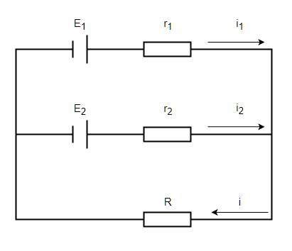
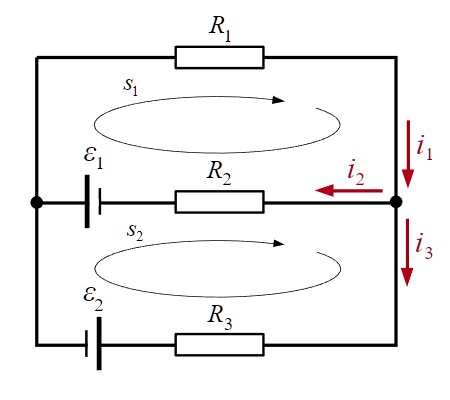

# 恒定电流

## 相关定义

### 电流的定义

电流：

- 电流：电荷的定向移动。

- 电流方向于正电荷运动方向相同，与负电荷（电子）运动方向相反。

电流的分类：

- 恒定电流：大小和方向都不变的电流。

- 直流电：方向不变的电流。

- 交流电：方向改变的电流。

### 电流的物理学定义

- 定义：单位时间内通过导体横截面的电荷量。

- 定义式：$I=\dfrac{Q}{t}$。

额外的，有微观表达式：$I=neSv$。

- 其中 $n$ 表示通过导体横截面的电子数。

- 其中 $e$ 表示电子的电荷量。

- 其中 $S$ 表示导体的横截面积大小。

- 其中 $v$ 表示导体中自由电子的运动速率。

三种速度数量级：

- 电子定向移动速率：$\pu{10^-5m/s}$。

- 电子热运动速率：$\pu{10^5m/s}$。

- 电子的传导速率：$\pu{10^8m/s}$，即电场的形成速率。

## 欧姆定律

### 线性电路

线性元件：

- 在电路中电流与电压有线性关系的电子元件，例如金属导体和电解液。

- 在温度不变的情况下，其两端电压和电流的关系就可以近似的认为是线性的。

- 理想的电阻是最普遍的线性元件，常见的线性元件还有理想的电容和电感。

- 在伏安特性曲线中，表示为一条过坐标轴原点的直线的器件，一定是线性元件。

- 注意：材料并不是线性元件的决定因素，例如避雷器在高电压下电阻值变小。

线性电路：

- 电子线路的基本类型之一，是指响应与输入信号成正比的电路。

- 从构成上，线性电路是指完全由线性元件，独立电源和线性受控源构成的电路。

- 其特点是输入信号的变化会导致输出信号的相应变化，输出信号与输入信号之间存在线性相关性。

### 欧姆定律

欧姆定律表明：定温下，电导体两端的电压与通过电导体的电流成正比，即：

$$
U\propto I
$$

人教版高中物理教材指出：欧姆定律适用于金属、电解液导电，不适用气态导体和半导体导电。

哈里德《物理学基础》指出，欧姆定律要求通过一器件的电流始终正比于加到该器件上的电势差。

也就是说，欧姆定律**仅适用于线性电路**。

### 电阻的定义式

电阻的定义式表示为：

$$
R:=\dfrac{U}{R}
$$

这个式子形式上和欧姆定律很类似，实际上有一定区别：

- 欧姆定律仅限于线性电路。

- 电阻的定义式对于任意元件成立，因为电阻与电路无关。

这也是欧姆定律的一个常见错误认知[^note100]。

[^note100]: <https://zh.wikipedia.org/wiki/欧姆定律#常見錯誤>。

### 电阻定律

$$
R=\rho\dfrac{l}{S}
$$

其中 $\rho$ 为电阻率。

### 伏安特征曲线

## 焦耳定律

### 焦耳定律

### 纯电阻电路

### 非纯电阻电路

## 等效电路

### 电阻串联规律

- 电流 $I$ 相同、分压 $U=U_1+U_2$。

    $$
    \begin{aligned}
    I_1&=I_2\\
    \dfrac{U_1}{U_2}&=\dfrac{R_1}{R_2}
    \end{aligned}
    $$

- 等效电阻为一个 $R=R_1+R_2$ 的电阻。

### 电阻并联规律

- 电压 $U$ 相同，分流 $I=I_1+I_2$。

    $$
    \begin{aligned}
    U_1&=U_2\\
    I_1R_1&=I_2R_2\\
    \dfrac{I_1}{I_2}&=\dfrac{R_2}{R_1}
    \end{aligned}
    $$

- 等效电阻为一个 $R=\dfrac{R_1R_2}{R_1+R_2}$ 的电阻。

### 等效电压源

## 基尔霍夫电路定律

### 适用范围

基尔霍夫电路定律（基尔霍夫定律）涉及了电荷的守恒及电势的保守性。

1. 支路：

    * 每个元件就是一条支路。
    * 串联的元件我们视它为一条支路。
    * 在一条支路中电流处处相等。

2. 节点：

    * 支路与支路的连接点。
    * 两条以上的支路的连接点。

3. 回路：

    * 闭合的支路。
    * 闭合节点的集合。

基尔霍夫电路定律包括以下两条电路学定律：

- 基尔霍夫电流定律（基尔霍夫第一定律，KCL）。

- 基尔霍夫电压定律（基尔霍夫第二定律，KVL）。

基尔霍夫定律建立在电荷守恒定律、欧姆定律及电压环路定理的基础之上，在稳恒电流条件下严格成立。

当基尔霍夫第一、第二方程组联合使用时，可正确迅速地计算出电路中各支路的电流值。

对于含有电感器的电路，必需将基尔霍夫电压定律加以修正。

由于含时电流的作用，电路的每一个电感器都会产生对应的电动势 $E_k$。

必需将这电动势纳入基尔霍夫电压定律，才能求得正确答案。

### 基尔霍夫电流定律

又称：基尔霍夫第一定律，KCL。

定义：所有进入某节点的电流的总和等于所有离开这节点的电流的总和。

或者：设电流流入为正，流出为负，则所有涉及某节点的电流的代数和等于零。

基尔霍夫电流定律是节点分析的基础定律。

对于方程表达：$\sum i_k=0$；其中，$i_k$ 是与这节点相连接的第 $k$ 个支路的电流。

如图，有 $i_2+i_3=i_1+i_4$，或者可以写成 $i_2+i_3-i_1-i_4=0$ 的形式。

### 基尔霍夫电压定律

又称：基尔霍夫第二定律，KVL。

定义：沿着闭合回路所有器件两端的电势差（电压）的代数和等于零。

或者：沿着闭合回路的所有电动势的代数和等于所有电压降的代数和。

基尔霍夫电压定律是网目分析的基础定律。

对于方程表示：$\sum v_k=0$；其中，$v_k$ 是器件两端的电压。

基尔霍夫电压定律不仅应用于闭合回路，也可以把它推广应用于回路的部分电路。

如图，有 $v_1+v_2+v_3=v_4$，或者可以写成 $v_1+v_2+v_3-v_4=0$ 的形式。

### 例题一

可以列出三个式子：

$$
\left\{\begin{array}{c}
E_1&=&i_1r_1+iR\\
E_2&=&i_2r_2+iR\\
i&=&i_1+i_2
\end{array}\right.
$$

已知 $E_1,E_2,r_1,r_2,R$，可以求出 $i_1,i_2,i$。

### 例题二

根据基尔霍夫第一定律：

$$
i_1=i_2+i_3
$$

将基尔霍夫第二定律应用于回路 $s_1$：

$$
\mathcal{E}_1=R_1i_1+R_2i_2
$$

将基尔霍夫第二定律应用于回路 $s_2$：

$$
\mathcal{E}_1+\mathcal{E}_2+R_3i_3=R_2i_2
$$

已知：$R_1=100\Omega$，$R_2=200\Omega$，$R_3=300\Omega$，$\mathcal{E}_1=3V$，$\mathcal{E}_2=4V$。

解得：

$$
\left\{\begin{array}{c}
i_1&=&1/1100&A\\
i_2&=&4/275&A\\
i_3&=&-3/220&A
\end{array}\right.
$$

注意到电流 $i_3$ 带了负号，这意味着我们 $i_3$ 的假定方向不正确。

这也意味着基尔霍夫电路定律解题不完全需要电流方向已知。

## 电路的叠加定理

### 描述

定义上：对于一个线性系统，一个含多个独立源的双边线性电路的任何支路的响应，等于每个独立源单独作用时的响应的代数和，此时所有其他独立源被替换成他们各自的阻抗。 

具体的：在线性电路中，任一支路的电压或电流（不包括功率等），都等于独立电源单独作用在该支路产生的电压和电流的代数和。

形式化：在一个线性元件组成的电路中，一条电路上的电压和电流，是周围其他电压源或电流源在这条电路上单独作用后叠加在一起产生的。

还有的：对于任一线性网络，若同时受到多个独立电源的作用，则这些共同作用的电源在某条支路上所产生的电压或电流等于每个独立电源各自单独作用时，在该支路上所产生的电压或电流分量的代数和。

**Q**：为什么放这么多？**A**：不好理解，自己理解吧。

### 求解步骤

1. 做出每个独立电源单独作用的电路分图，不作用的独立源置零：

    * 电压源短路：从而消除电压，即令 $V = 0$；
    * 电流源开路：从而消除电流，即令 $I = 0$。

2. 求各电路分图中的相应，求代数和。

### 注意事项

1. 只适用于求电压、电流，不适用于求功率；也不适用于非线性电路。
2. 某个独立电源单独作用时，其余独立源全为零值。
3. 代数和指分量参考方向与原方向一致取正，不一致取负。

### 齐次定理

线性电路的齐次定理，即叠加定理的齐次性：

在线性电路中当所有独立源同时缩放 $K$ 倍（$K$ 为实常数）时，响应也将同样增大或缩小 $K$ 倍。

### 电功率

要计算电功率，我们应该先用叠加定理得到各线性器件的电压和电流，然后计算出倍增的电压和电流的总和。

## 题型和总结

### 物理量总结

| 单位 | 符号 | 物理量 | 注 |
| - | - | - | - |
| 安培 | $A$ | **电流** | 基本单位 |
| 伏特 | $V$ | **电势**，电势差，电动势 | $=W\cdot A^{-1}$ |
| 欧姆 | $\Omega$ | **电阻**，电抗，阻抗 | $=V\cdot A^{-1}$ |
| 法拉 | $F$ | **电容** | |
| 亨利 | $H$ | 电感 | |
| 西门子 | $S$ | **电导**，导纳，磁化率 | $=\Omega^{−1}$ |
| 库仑 | $C$ | **电荷量** | $=A\cdot s$ |
| 欧姆⋅米 | $\Omega\cdot m$ | 电阻率 | $\rho$ |
| 西门子/每米 | $S\cdot m^{-1}$ | 电导率 | |
| 法拉/每米 | $F\cdot m^{-1}$ | 电容率；介电常数 | $\varepsilon$ |
| 反法拉 | $F^{−1}$ | 电弹性 | $=F^{−1}$ |
| 伏安 | $VA$ | 交流电功率，视在功率 | |
| 无功伏安 | $\mathit{var}$ | 无功功率，虚功 | |
| 瓦特 | $W$ | **电功率**，有功功率，实功 | $=J\cdot s^{-1}$ |
| 千瓦⋅时 | $kW⋅h$ | **电能** | $=3.6\,MJ$ |

### 公式总结
