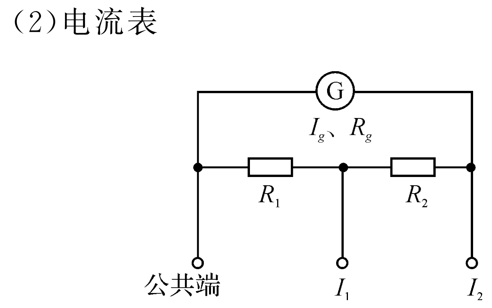
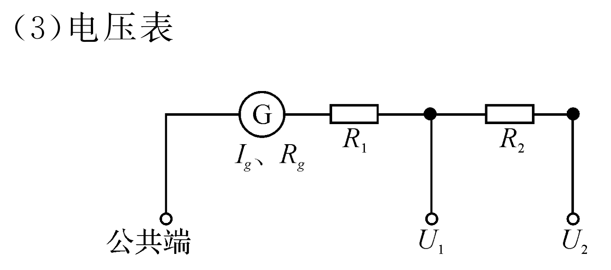
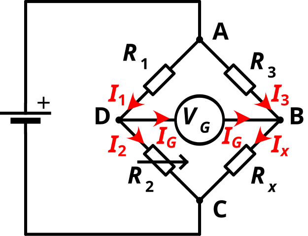
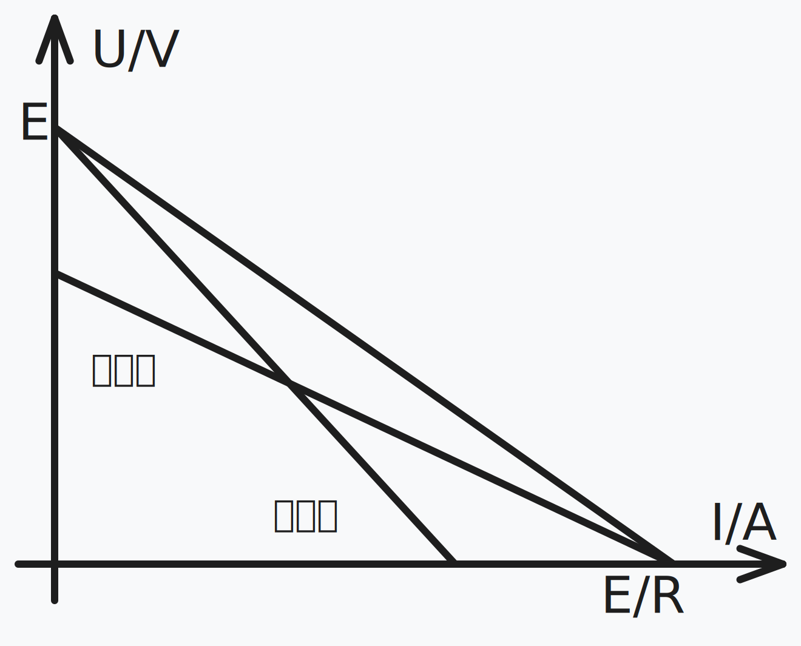

# 电学实验

## 实验基础

### 滑动变阻器

**变阻器**，又称**电位器**，是种具有三个端子，其中有两个固定接点与一个滑动接点，可经由滑动而改变滑动端与两个固定端间电阻值的电子零件，属于被动元件，使用时可形成不同的分压比率，改变滑动点的电位，因而得名。

只有两个端子的（或已将滑动端与其中一个固定端保持连接，对外实际只有两个有效端子的）并不称为电位器，只能称为可变电阻，或可变电阻器。

常见的碳膜或陶瓷金属膜的电位器可以透过铜箔或铜片与印刷膜接触，经旋转或滑动产生输出、输入端的不同电阻。至于需要较大功率的电位器则是使用线绕式。电位器有时会合并附带其他功能，例如在最小的一端附带关闭电源。

滑动变阻器的限流式和分压式。

{ width="90%" }

- 限流式：电路简单，调控范围小，选大电阻。

- 分压式：电路复杂，调控范围大，选小电阻。

### 欧姆表

一个常见的欧姆表电路图如左图所示：

我们发现，如果我们将两个表笔直接连在一起（注意与电源正极相连的是黑表笔，即电流从黑表笔留出，从红表笔流入，红进黑出），那么电流表示数为

$$
I_m=\dfrac{E}{r+R_g+R}
$$

我们记内阻 $r_i=r+R_g+R$，根据电流之比为电阻反比，某一时刻电流表示数为 $I$，则

$$
\dfrac{I}{I_m}=\dfrac{R_x+r_i}{r_i}
$$

我们根据这一表达式，在表盘上直接表上对应的欧姆刻度，如上右图所示。我们知道这个表盘刻度是不均匀的，测量范围在 $(0,+\infty)$ 欧姆。

### 多用电表

多用电表，又称万用电表、多用表、多用计、万用表、万用计，俗称三用电表，一般包含电流表（安培计）、电压表（伏特计）、电阻表（欧姆计）等功能。一个老式的多用电表（上海第四仪表厂）如图所示：

{ width="90%" }

多用电表的使用方法：

- 第一次调零（机械调零）：红黑表笔断开、不接入任何电路，旋转螺丝，使得指针指向左端电流表零刻度线。

- 第二次调零（欧姆调零）：红黑短接，调整变阻器（多用电表上的旋钮），使得指针指向右端欧姆表零刻度线。

- 多用电表的读数：

- 多用电表的换挡：每次换挡后都需要重新调零。如果需要把指针向右偏，则需要换更大的档位，因为换成大档位之后，表盘上的读数会变小。

- 多用电表使用完毕后应当将其调至 OFF 档位（或者空档），如果没有 OFF 档（如上图），则调至交流电压最高档位。

注意事项：

- 中值电阻：我们知道，多用电表刻度一边过于稀疏、一边过于密集，因此我们通常需要让指针指在正中间附近的位置，我们把此时的电阻称为中值电阻，这就需要换挡。

- 误差分析：若时间放置久后，内部电源电动势降低，则测的的值比真实值大；另外，如果仅仅是内阻增大，则会被欧姆调零低消掉，不会有影响。

几个常见的多用电表电路如图所示：

### 电表改装

**检流计** $-\kern{-0.4em}\bigcirc\kern{-1em}{\scriptsize\text{G}}\kern{0.05em}-$：也称为**表头**，被用于测量**微弱电流**。指针式的表头是一只高灵敏度的磁电式灵敏检流计，其工作原理为利用电流的磁效应，当电流通过其导线时，会产生磁场，与永久磁铁互斥而带动指针旋转，与磁电式电流表基本相同。电表的主要性能指标基本上取决于表头的性能。表头的灵敏度是指表头指针满刻度偏转时流过表头的直流电流值，这个值越小，表头的灵敏度愈高，其性能就越好。

 

检流计有内阻 $\Omega$、最大电压 $U$ 和最大电流 $I$，满足欧姆定律，检流计与大电阻串联构成电压表 $-\kern{-0.4em}\bigcirc\kern{-1em}{\scriptsize\text{V}}\kern{0.1em}-$，与小电阻并联构成电流表 $-\kern{-0.4em}\bigcirc\kern{-1em}{\scriptsize\text{ I}}\kern{0.2em}-$，由欧姆定律分压分流规律，可以计算出应该串联、并联多大的电阻。

电表串并联偏角、示数问题（默认表头一样）：

- 电流表串联：根据电流一样，所以示数相同。

- 电流表并联：还原为表头并联电阻，则偏转角度相同。

- 电压表并联：根据电压一样，所以示数相同。

- 电压表串联：还原为表头并联电阻，则偏转角度相同。

- 示数相同，量程越小，偏转角度越大；偏转角度相同，量程越大，示数越大。

电表改偏角、改量程。

- 改量程：增大电压表量程，串联一个大电阻；增大电流表量程，并联一个小电阻。

- 电压表、电流表偏角始终偏大、偏小。

## 电阻测量

- 系统误差：实验设计本身存在缺陷，可以确定偏大或者偏小。

- 偶然误差：操作或读数造成，具有不确定性；多次测量取平均值或者用图像计算比值都可以减少偶然误差。

### 伏安法

最容易想到的测量方法是直接测量电流和电阻两端的电压，但是我们非理想电流表、电压表会分压、分流，导致产生系统误差，于是就产生了内接法和外接法。

{ width="80%" }

电流表内接法（电流表在电压表里面）：

- 电压表测电流表和电阻的电压，电压偏大、电流准确，电阻偏大。

- 测到的电阻为电流表和待测电阻串联得到的电阻。

- 当待测电阻远大于电流表内阻（大电阻）时，测量结果较为准确。

电流表外接法（电流表在电压表外面）：

- 电流表测电压表和电阻的电流，电流偏大、电压准确，电阻偏大。

- 测到的电阻为电压表和待测电阻并联得到的电阻。

- 当待测电阻远小于电压表内阻（小电阻）时，测量结果较为准确。

简记为：大内偏大，小外偏小；此外，如果为理想电表，则可以任选；如果电流表内阻已知，则用内接法；如果电压表内阻已知，则用外接法。

- 计算法：将预估 $R_x$ 与 $\sqrt{R_AR_B}$ 比较，作为大小电阻的依据。

- 试触法：将电笔轻轻接触，然后迅速拿开。将电压表的一端分别在电流表的内外试触，如果电压表示数变化较大，则说明电流表分压较大，使用外接法；如果电流表示数变化较大，说明电压表分流较大，使用内接法。

    具体来说，我们可以定量判断 $\vert{\dfrac{U_外-U_内}{U_内}}$ 和 $\vert{\dfrac{I_外-I_内}{I_内}}$ 的关系，确定哪一个更接近真实值。

### 伏阻法

伏阻法，又称伏伏法，如图所示：

{ width="80%" }

/// note | 如左图
由已知电阻 $R_0$ 推导出 $R_x$ 两端电压。

$$
R_x=\dfrac{U}{I_2}=\dfrac{R_0(I_1-I_2)}{I_2}
$$

若考虑电流表分压，则测量值比真实值偏大，测量值为待测电阻和电流表内阻的和，如果 $A_2$ 用内阻已知的电流表，则可以消除系统误差。
///

/// note | 如右图
由已知电阻 $R_0$ 推导出 $R_x$ 两端电压。

$$
R_x=\dfrac{U}{I_2}=\dfrac{I_1R_0}{I_2}
$$

这里的误差，既有可能偏大，也有可能偏小，取决于两个电流表分流程度。当且仅当知道两个电流表的内阻，可以消除系统误差。
///

### 安阻法

安阻法，又称安安法，如图所示：

{ width="80%" }

/// note | 如左图
容易得到

$$
R_x=\dfrac{U_1}{U_2}\cdot R_0
$$

此处也无法判断出误差偏大还是偏小，想要消除系统误差计算也比较复杂。
///

/// note | 如右图
同理，可以写出

$$
R_x=\dfrac{U_1}{U_2-U_1}\cdot R_0
$$

此处可以认为 $R_0$ 充当了电流表，相当于外接，测量值比真实值偏小。
///

### 半偏法

半偏法分为限流式半偏法和分压式半偏法，是一种在题目中常见的测量电阻的方法。

限流式半偏法：

{ width="40%" }

1. 闭合开关 $S$ 和 $S_1$，调节滑动变阻器，使电流表满偏。

2. 再闭合开关 $S_2$，保持滑动变阻器位置不动，调节电阻箱示数为 $R$，使得电流表半偏。

3. 记录电阻箱示数 $R$，则 $R=R_x+R_A$。

通常情况下，限流式半偏法通常直接用于测量电流表内阻 $R_A$，此时不接入 $R_x$，电阻箱示数即为电流表的内阻。

误差分析：

- 我们在上面假设干路电流不变，而实际上因为形成了并联电路，总电阻减小，故总电流增大，因此通过电阻箱的电流要大于通过电流表支路的电流，因此电阻箱阻值小于电流表阻值。

- 因为我们将电阻箱阻值读数当做电流表的内阻，因此测量值比真实值偏小。

- 限流式半偏法适合测量小电阻（例如电流表），因为电阻小、闭合 $S_2$ 后总电阻变化也就越小，误差越小。

- 为了减小误差，我们需要电路总电阻变化较小，容易想到需要滑动变阻器接入阻值较大，因此，应当选择大的电源电动势和大的滑动变阻器。

分压式半偏法：

{ width="40%" }

1. 电阻箱归零，闭合开关，调节滑动变阻器，使得电压表满偏。

2. 保持滑动变阻器不变，调节电阻箱示数为 $R$，使得电压表半偏。

3. 记录电阻箱示数 $R$，则电阻大小 $R_V=R$。

误差分析：

- 我们已经假设电压表和电阻箱两端的电压不变，实际上因为电阻箱阻值增大，分到的电压增大，故若电压表仍半偏，电阻箱两端的电压应当大于电压表示数，也就是说电阻箱阻值大于电压表阻值。

- 因为我们将电阻箱阻值读数当做电压表的内阻，因此测量值比真实值偏大。

- 分压式半偏法适合测量大电阻（例如电压表），因为电阻大，则滑动变阻器并联与其并联，阻值变化就会较小，误差较小。

- 容易想到，应当使滑动变阻器接入并联部分电阻越小越好，因此，总的来说，应当选用小的电源电动势和小的滑动变阻器。

注意，如果开始的时候忘记归零，则可以通过写出电压不变的方程，解出来 $R_V$ 的值。

### 替代法

替代法是一种类似于限流式半偏法的方法，如图所示：

{ width="40%" }

1. 闭合开关 $S$ 和 $S_1$，适当调整滑动变阻器，记录此时电流表示数。

2. 断开开关 $S_1$，闭合开关 $S_2$，调整电阻箱，使得电流表示数和上一步相同。

3. 则电阻 $R_x$ 即为电阻箱的示数 $R$，这个方法是没有系统误差的。

### 电桥法

惠斯通电桥是一种测量工具，用来精确测量未知电阻器的电阻。

将待测电阻 $R_x$ 和 $R_3$ 串联，可变电阻 $R_2$ 和 $R_1$ 串联。再将这两个串联电路并联，在各路中点间接入检流计 $V_G$。其中 $V_G$ 可以认为是测量电势差的，或是测量电流的，因为这是等价的。

{ width="90%" }

{ width="90%" }

我们得出结论，当且仅当

$$
\displaystyle{R_x\over R_3}={R_2\over R_1}
$$

电桥平衡，此时灵敏电流计无示数。

证明：$D$ 和 $B$ 等势的时候灵敏电流计无示数，结论显然。

## 电源测量

### 限流法

测量电源的电动势和内阻：

理想情况下，电流表测外电流、电压表测外电压。

- **内接法**（电压表抱住电源和电流表）或外接法（电压表抱住滑动变阻器）：

    电压表不准（电流表分压，测小了），电流表测量准确。

    电动势测量准确，内阻测量值比真实值大。

    适用于内阻非常大的电池。

- **外接法**（电压表抱住电源）或内接法（电压表抱住滑动变阻器和电流表）：

    电压表测量准确，电流表不准（电压表分流，测小了）。

    电动势和内阻测量值均比真实值小。

    适用于内阻比较小的电池（绝大部分电池），一般情况下使用这种。

{ width="60%" }

另外，还有一些高级测量方法，例如电势差计。

### 电势差计

补偿电路是一种比较精确地测量电源电动势的电路，其测量装置亦称电势差计。

{ width="30%" }

若两电源的电动势不相等，即 $\varepsilon_0 \neq \varepsilon_x$，则回路中必有电流，检流计的指针发生偏转。如果 $\varepsilon_0 = \varepsilon_x$，则回路中没有电流，检流计指示为零，这时称电路达到补偿状态。这样可以根据已知电动势 $\varepsilon_0$ 的值，求出待测电动势 $\varepsilon_x$ 的值，这种测电源电动势的方法称为补偿法。

{ width="50%" }

工作电源 $E$、限流电阻 $R$、开关 $K_1$、粗细均匀的电阻丝 AB 串联成一闭合电路，称为辅助电路。

- 闭合 $K_1$，调节 $R$，使 AB 中有一恒定的工作电流 $I_0$。$\varepsilon_0$ 为标准电源，$\varepsilon_x$ 为待测电源。

- 开关 $K_2$ 倒向标准电源的一边与 $\varepsilon_0$ 连通检流计发生偏转，移动触点 C，使检流计中的电流 $I_g=0$，这时有 $\varepsilon_0=U_{AC}$。

- 同理，$K_2$ 倒向待测电源一侧时，做相应的调节，有 $\varepsilon_x = U_{AC'}$

比较 $\varepsilon_0$ 与 $\varepsilon_x$，有

$$
\varepsilon_x = \frac{L_x}{L_0}\varepsilon_0
$$

所以，只需测出 $L_0$、$L_x$，即可得 $\varepsilon_x$。
