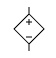
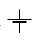

# 电路元件

## 电源

### 电池概述

| 美国型号 | 中国大陆型号 | 尺寸（$\pu{mm}$） |
|----------|---------------|---------------------|
| D        | 1 号电池       | 59.0*32.3           |
| C        | 2 号电池       | 49.5*25.3           |
| AA       | 5 号电池       | 49.0*14.0           |
| AAA      | 7 号电池       | 44.0*10.0           |
| AAAA     | 9 号电池       | 41.5*8.1            |
| A        | 4 号电池       | 49.0*16.8           |
| SC       | 3 号电池       | 42.0*22.1           |
| N        | 8 号电池       | 28.5*11.7           |
| F        |               | 89.0*32.3           |

| 符号 | 符号 |
| :-: | :-: |
| 理想电压源  | 理想电流源  |
| 受控电压源  | 受控电流源  |
| 单电池  | 电池组  |

### 电动势

电动势表征一些电路元件供应电能的特性（非静电力做功的本质），这些电路元件称为电动势源，而电动势源所供应的能量每单位电荷是其电动势，有公式表达：

$$
\mathcal{E}=\dfrac{W}{Q}
$$

即把 $\pu{1C}$ 正电荷从负极运回正极所做的功。通常，这能量是分离正负电荷所做的功，由于这正负电荷被分离至元件的两端，会出现对应电场与电势差。

电池内阻相当于一个电池串联一个电阻，如果没有特殊说明，**电池的内阻不可忽略**。

### 拓展：电流源

电流源（理想电流源）具有两个基本的性质：

1. 它提供的电流是定值 $I$，或是一定的时间函数 $I(t)$ 与两端的电压无关。

2. 电流源自身电流是确定的，而它两端的电压是任意的。

电流源具有很大的内阻（理想状态是内阻无限大）并且作为恒流电路工作。由于负载波动，电压波动较大。实际上，如果一个电流源在电压变化时，电流的波动不明显，我们通常就假定它是一个理想电流源。

像光电池一类的器件，工作时的特性比较接近电流源。

电流源的工作原理如图：

设 $I_S$ 为电源电流，$G_S$ 为内部电导，$G$ 为负载电导，$V_0$ 为施加电压，$I$ 为电流：

$$
I_S=V_0(G_S+G)=V_0G_S+I
$$

因此：

$$
V_0=\dfrac{I_S}{G_S+G}
$$

如果 $G\ll G_S$，则 $I_S\doteq I$。因此，输出电压会因负载波动而发生较大变化。

### 拓展：电压源

电压源（理想电压源）具有两个基本的性质：

1. 它的端电压为定值 $U$，或为一时间函数 $U(t)$，与流过的电流无关。

2. 电压源自身电压是确定的，而流过它的电流是任意的。

常见实际电源的工作机理比较接近电压源，例如发电机以及蓄电池。电压源具有低内阻并且作为恒压电路工作。由于短路时会流过大电流，因此需要安全装置。

实际上，如果一个电压源在电流变化时，电压的波动不明显，我们通常就假定它是一个理想电压源。

电压源的工作原理如图：

设 $E_S$ 为电源电动势，$R_S$ 为内阻，$R$ 为负载，$V_0$ 为施加电压，$I$ 为电流：

$$
I=\dfrac{E_S}{R_S+R}
$$

因此：

$$
V_0=IR=\dfrac{R}{R_S+R}E_S
$$

如果 $R\ll R_S$，则 $V_0\doteq E_S$。因此，输出电压的波动不明显。

## 电表及测量

### 电表改装

**检流计** $-\kern{-0.4em}\bigcirc\kern{-1em}{\scriptsize\text{G}}\kern{0.05em}-$：也称为**表头**，被用于测量**微弱电流**。指针式的表头是一只高灵敏度的磁电式灵敏检流计，其工作原理为利用电流的磁效应，当电流通过其导线时，会产生磁场，与永久磁铁互斥而带动指针旋转，与磁电式电流表基本相同。电表的主要性能指标基本上取决于表头的性能。表头的灵敏度是指表头指针满刻度偏转时流过表头的直流电流值，这个值越小，表头的灵敏度愈高，其性能就越好。

检流计有内阻 $\Omega$、最大电压 $U$ 和最大电流 $I$，满足欧姆定律，检流计与大电阻串联构成电压表 $-\kern{-0.4em}\bigcirc\kern{-1em}{\scriptsize\text{V}}\kern{0.1em}-$，与小电阻并联构成电流表 $-\kern{-0.4em}\bigcirc\kern{-1em}{\scriptsize\text{ I}}\kern{0.2em}-$，由欧姆定律分压分流规律，可以计算出应该串联、并联多大的电阻。

### 伏安法测电阻

电流表内接法（电流表在电压表里面）：

- 电压表测电流表和电阻的电压，电压偏大、电流准确，电阻偏大。

- 当待测电阻远大于电流表内阻（大电阻）时，测量结果较为准确。

电流表外接法（电流表在电压表外面）：

- 电流表测电压表和电阻的电流，电流偏大、电压准确，电阻偏大。

- 当待测电阻远小于电压表内阻（小电阻）时，测量结果较为准确。

伏安法测电阻：将预估 $R_x$ 与 $\sqrt{R_AR_B}$ 比较，大（$R_x>\sqrt{R_AR_B}$）内偏大，小（$R_x<\sqrt{R_AR_B}$）外偏小。

### 惠斯通电桥

惠斯通电桥是一种测量工具，用来精确测量未知电阻器的电阻。

将待测电阻 $R_x$ 和 $R_3$ 串联，可变电阻 $R_2$ 和 $R_1$ 串联。再将这两个串联电路并联，在各路中点间接入检流计 $V_G$。其中 $V_G$ 可以认为是测量电势差的，或是测量电流的，因为这是等价的。

我们得出结论，当且仅当 $\displaystyle{R_x\over R_3}={R_2\over R_1}$ 时，电桥平衡（灵敏电流计无示数）。

/// caption
百科解法：有基尔霍夫电路定律可得。
///

一句话：$D$ 和 $B$ 等势的时候灵敏电流计无示数，结论显然。

### 滑动变阻器

**变阻器**，又称**电位器**，是种具有三个端子，其中有两个固定接点与一个滑动接点，可经由滑动而改变滑动端与两个固定端间电阻值的电子零件，属于被动元件，使用时可形成不同的分压比率，改变滑动点的电位，因而得名。

只有两个端子的（或已将滑动端与其中一个固定端保持连接，对外实际只有两个有效端子的）并不称为电位器，只能称为可变电阻，或可变电阻器。

常见的碳膜或陶瓷金属膜的电位器可以透过铜箔或铜片与印刷膜接触，经旋转或滑动产生输出、输入端的不同电阻。至于需要较大功率的电位器则是使用线绕式。电位器有时会合并附带其他功能，例如在最小的一端附带关闭电源。

## 电路元件总结

符号表示参考 [[IEEE/ANSI 315-1975 IEEE] Standard for Graphic Symbols for Electrical and Electronics Diagrams (Including Reference Designation Letters)](https://www.ee.iitb.ac.in/~spilab/Tips/ansii_graphic_symbols_for_electrical_and_electronics_daigrams_1993.pdf)。

## 电路分析方法

### 串并联规律

串联规律：

- 电流 $I$ 相同、分压 $U=U_1+U_2$。

    $$
    \begin{aligned}
    I_1&=I_2\\
    \dfrac{U_1}{U_2}&=\dfrac{R_1}{R_2}
    \end{aligned}
    $$

- 等效电阻为一个 $R=R_1+R_2$ 的电阻。

并联规律：

- 电压 $U$ 相同，分流 $I=I_1+I_2$。

    $$
    \begin{aligned}
    U_1&=U_2\\
    I_1R_1&=I_2R_2\\
    \dfrac{I_1}{I_2}&=\dfrac{R_2}{R_1}
    \end{aligned}
    $$

- 等效电阻为一个 $R=\dfrac{R_1R_2}{R_1+R_2}$ 的电阻，记为鸡在和上飞。

### 等电势法

原理：

1. 一根导线上，电势处处相等（等势体）。

2. 经过用电器后，电势降低，数值上等于用电器两端电压。

3. 如果没有电流通过用电器，例如理想电压表串联电阻，则可以将电阻视为等电势。

将不同电势分别描出来，确定用电器两端电势。

### 电流走向法

也是初中最常用的方法之一。

### 变形法

具体而言，将电路翻转、伸缩、变形，到达容易分辨的效果。

### 设物理量

设出每一条导线上的电流和每一个用电器两端的电压。

然后根据基尔霍夫电路定律，解出来，符号表示与假设方向相反。
