# 电路拓展

## 回路基础

### 电压源和电流源

电压源（理想电压源）具有两个基本的性质：

1. 它的端电压为定值 $U$，或为一时间函数 $U(t)$，与流过的电流无关。

2. 电压源自身电压是确定的，而流过它的电流是任意的。

常见实际电源的工作机理比较接近电压源，例如发电机以及蓄电池。电压源具有低内阻并且作为恒压电路工作。由于短路时会流过大电流，因此需要安全装置。

实际上，如果一个电压源在电流变化时，电压的波动不明显，我们通常就假定它是一个理想电压源。

电流源（理想电流源）具有两个基本的性质：

1. 它提供的电流是定值 $I$，或是一定的时间函数 $I(t)$ 与两端的电压无关。

2. 电流源自身电流是确定的，而它两端的电压是任意的。

电流源具有很大的内阻（理想状态是内阻无限大）并且作为恒流电路工作。由于负载波动，电压波动较大。实际上，如果一个电流源在电压变化时，电流的波动不明显，我们通常就假定它是一个理想电流源。

像光电池一类的器件，工作时的特性比较接近电流源。

/// note | 电压源的工作原理
如图：

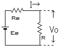

设 $E_S$ 为电源电动势，$R_S$ 为内阻，$R$ 为负载，$V_0$ 为施加电压，$I$ 为电流：

$$
I=\dfrac{E_S}{R_S+R}
$$

因此：

$$
V_0=IR=\dfrac{R}{R_S+R}E_S
$$

如果 $R\ll R_S$，则 $V_0\doteq E_S$。因此，输出电压的波动不明显。
///

/// note | 电流源的工作原理
如图：

设 $I_S$ 为电源电流，$G_S$ 为内部电导，$G$ 为负载电导，$V_0$ 为施加电压，$I$ 为电流：

$$
I_S=V_0(G_S+G)=V_0G_S+I
$$

因此：

$$
V_0=\dfrac{I_S}{G_S+G}
$$

如果 $G\ll G_S$，则 $I_S\doteq I$。因此，输出电压会因负载波动而发生较大变化。
///

戴维南定理和诺尔顿定理：

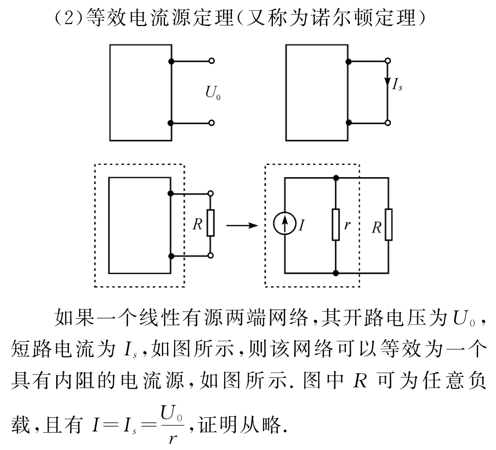

### 基尔霍夫电路定律

基尔霍夫电路定律（基尔霍夫定律）涉及了电荷的守恒及电势的保守性。

1. 支路：

    * 每个元件就是一条支路。
    * 串联的元件我们视它为一条支路。
    * 在一条支路中电流处处相等。

2. 节点：

    * 支路与支路的连接点。
    * 两条以上的支路的连接点。

3. 回路：

    * 闭合的支路。
    * 闭合节点的集合。

基尔霍夫电路定律包括以下两条电路学定律：

- 基尔霍夫电流定律（基尔霍夫第一定律，KCL）。

- 基尔霍夫电压定律（基尔霍夫第二定律，KVL）。

基尔霍夫定律建立在电荷守恒定律、欧姆定律及电压环路定理的基础之上，在稳恒电流条件下严格成立。

当基尔霍夫第一、第二方程组联合使用时，可正确迅速地计算出电路中各支路的电流值。

对于含有电感器的电路，必需将基尔霍夫电压定律加以修正。

由于含时电流的作用，电路的每一个电感器都会产生对应的电动势 $E_k$。

必需将这电动势纳入基尔霍夫电压定律，才能求得正确答案。

**例题一**：

可以列出三个式子：

$$
\left\{\begin{array}{c}
E_1&=&i_1r_1+iR\\
E_2&=&i_2r_2+iR\\
i&=&i_1+i_2
\end{array}\right.
$$

已- 知 $E_1,E_2,r_1,r_2,R$，可以求出 $i_1,i_2,i$。

**例题二**：

根据基尔霍夫第一定律：

$$
i_1=i_2+i_3
$$

将基尔霍夫第二定律应用于回路 $s_1$：

$$
\mathcal{E}_1=R_1i_1+R_2i_2
$$

将基尔霍夫第二定律应用于回路 $s_2$：

$$
\mathcal{E}_1+\mathcal{E}_2+R_3i_3=R_2i_2
$$

已知：$R_1=100\Omega$，$R_2=200\Omega$，$R_3=300\Omega$，$\mathcal{E}_1=3V$，$\mathcal{E}_2=4V$。

解得：

$$
\left\{\begin{array}{c}
i_1&=&1/1100&A\\
i_2&=&4/275&A\\
i_3&=&-3/220&A
\end{array}\right.
$$

注意到电流 $i_3$ 带了负号，这意味着我们 $i_3$ 的假定方向不正确。

这也意味着基尔霍夫电路定律解题不完全需要电流方向已知。

### 基尔霍夫电流定律

又称：基尔霍夫第一定律，KCL。

定义：所有进入某节点的电流的总和等于所有离开这节点的电流的总和。

或者：设电流流入为正，流出为负，则所有涉及某节点的电流的代数和等于零。

基尔霍夫电流定律是节点分析的基础定律。

对于方程表达：$\sum i_k=0$；其中，$i_k$ 是与这节点相连接的第 $k$ 个支路的电流。

如图，有 $i_2+i_3=i_1+i_4$，或者可以写成 $i_2+i_3-i_1-i_4=0$ 的形式。

### 基尔霍夫电压定律

又称：基尔霍夫第二定律，KVL。

定义：沿着闭合回路所有器件两端的电势差（电压）的代数和等于零。

或者：沿着闭合回路的所有电动势的代数和等于所有电压降的代数和。

基尔霍夫电压定律是网目分析的基础定律。

对于方程表示：$\sum v_k=0$；其中，$v_k$ 是器件两端的电压。

基尔霍夫电压定律不仅应用于闭合回路，也可以把它推广应用于回路的部分电路。

- 顺着电流的方向走，如果设定的电流是 $I$，走过的电阻是 $R$，则电压降低 $IR$，逆着电流走，则升高 $IR$。
- 走过一个电动势为 $E$ 的电源，如果是负到正，则电压升高 $E$；如果是正到负，则电压降低 $E$。
- 当然，更常用的方法是，设的时候不考虑正负，结果带入符号。

如图，有 $v_1+v_2+v_3=v_4$，或者可以写成 $v_1+v_2+v_3-v_4=0$ 的形式。

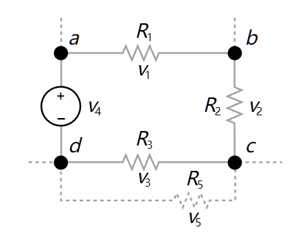

在具体使用回路电压方程时，应注意：

1. 选用的回路中，必须有一段是没有用过的电路。

2. 设定各条支路中电流的方向，在电流方向不明确的情况下，可以任意设。如果最后解出来的电流值为正，则真实电流方向与设定的方向相同；如果最后解出来的电流值为负，则真实电流方向与设定的方向相反。

## 分析拓展

### 线性电路

线性元件：

- 在电路中电流与电压有线性关系的电子元件，例如金属导体和电解液。

- 在温度不变的情况下，其两端电压和电流的关系就可以近似的认为是线性的。

- 理想的电阻是最普遍的线性元件，常见的线性元件还有理想的电容和电感。

- 在伏安特性曲线中，表示为一条过坐标轴原点的直线的器件，一定是线性元件。

- 注意：材料并不是线性元件的决定因素，例如避雷器在高电压下电阻值变小。

线性电路：

- 电子线路的基本类型之一，是指响应与输入信号成正比的电路。

- 从构成上，线性电路是指完全由线性元件，独立电源和线性受控源构成的电路。

- 其特点是输入信号的变化会导致输出信号的相应变化，输出信号与输入信号之间存在线性相关性。

### 叠加定理

叠加定理的描述：

- 定义上：对于一个线性系统，一个含多个独立源的双边线性电路的任何支路的响应，等于每个独立源单独作用时的响应的代数和，此时所有其他独立源被替换成他们各自的阻抗。 

- 具体的：在线性电路中，任一支路的电压或电流（不包括功率等），都等于独立电源单独作用在该支路产生的电压和电流的代数和。

- 形式化：在一个线性元件组成的电路中，一条电路上的电压和电流，是周围其他电压源或电流源在这条电路上单独作用后叠加在一起产生的。

- 还有的：对于任一线性网络，若同时受到多个独立电源的作用，则这些共同作用的电源在某条支路上所产生的电压或电流等于每个独立电源各自单独作用时，在该支路上所产生的电压或电流分量的代数和。

求解步骤：

1. 做出每个独立电源单独作用的电路分图，不作用的独立源置零：

    * 电压源短路：从而消除电压，即令 $V = 0$；
    * 电流源开路：从而消除电流，即令 $I = 0$。

2. 求各电路分图中的相应，求代数和。

注意事项：

1. 只适用于求电压、电流，不适用于求功率；也不适用于非线性电路。
2. 某个独立电源单独作用时，其余独立源全为零值。
3. 代数和指分量参考方向与原方向一致取正，不一致取负。
4. 要计算电功率，我们应该先用叠加定理得到各线性器件的电压和电流，然后计算出倍增的电压和电流的总和。

线性电路的**齐次定理**，即叠加定理的齐次性：

在线性电路中当所有独立源同时缩放 $K$ 倍（$K$ 为实常数）时，响应也将同样增大或缩小 $K$ 倍。

### 无穷电路

1. 一类比较简单的无穷电路所含的器件是相同的，如图所示的电路就属于这一类，组成电路的所有电阻的阻值都是 $R$。

    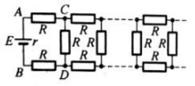

    不难看出，这个电路是由很多单元组成的，每一个单元包含三个电阻，既然电路的右端是无穷的，那么左端多一个单元、少一个单元是不影响整个电路的电阻的，也就是说从 $A,B$ 两点向右看和从 $C,D$ 两点向右看的电阻是一样的，设从 $C,D$ 两点向右看的电阻是 $R_x$，那么有：

    $$
    \dfrac{R_xR}{R_x+R}+2R=R_x
    $$

    解得 $R_x=(\sqrt3+1)R$。

2. 另一类比较复杂的无穷电路所含的器件是不同的，但有一定的规律，如图所示的电路就属于这一类，电路也同样由九数多个单元组成，相邻的后面一个单元电阻的阻值要比前一个单元的阻值大一倍。

    

    这一类无穷电路需要寻找规律，把从 $A,B$ 向右看的总电阻和从 $A',B'$ 向右看的总电阻进行比较，后者对应的单元都要比前者大一倍，所以后者的总电阻也要比前者大一倍，设从 $A,B$ 向右看的总电阻为 $R_x$，那么有：

    $$
    \dfrac{2R_x\cdot R}{2R_x+R}+2R=R_x
    $$

    解得 $R_x=(\sqrt{41}+5)R/4$。

### 对称性简化

所谓对称性简化，就是利用电路网络中可能存在的各种对称性，作出某种判断或结论，以简化等效电阻计算。

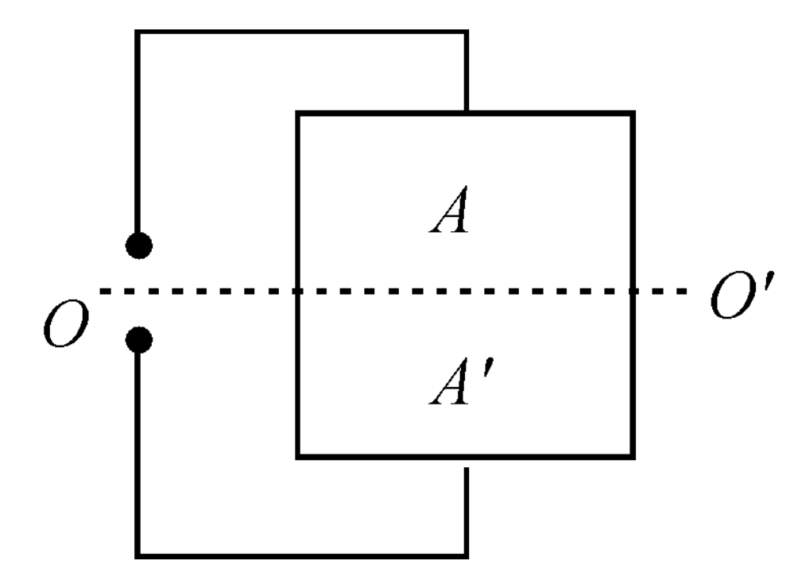{ align=right width="30%" }

平衡对称电路：

- 对一个电路，用垂直平分端口的平面横切，可将该电路切成上下完全相同的两部分，而且这两部分之间没有交叉连接和支路，这种电路称为**平衡对称电路**。

- 所用的横切面，即该电路对端口的**平衡对称面**，如右图中的 $OO'$ 平面。一般情况下，平衡对称面只有一个。如在端口处加上电压，则在平衡对称面上的点都是等势点，该平面是一个**等势面**。

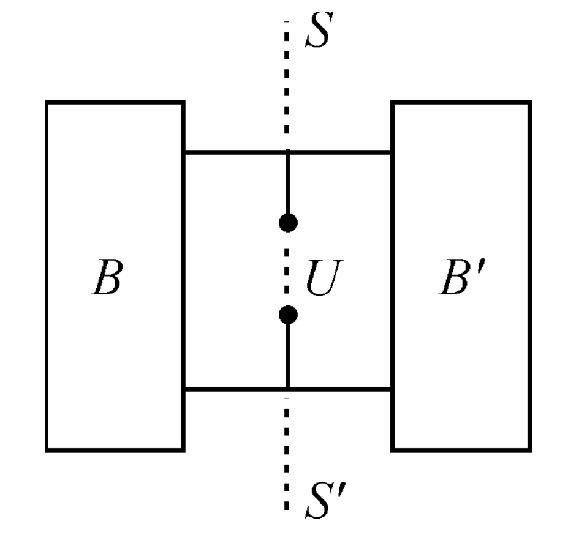{ align=right width="30%" }

传递对称电路：

- 对一个电路，用过端口的平面直切，可将该电路切成左、右完全相同的两部分，这种电路称为**传递对称电路**。

- 所用的直切面，即该电路的**传递对称面**，如右图中的 $SS'$ 平面。传递对称面可能不止一个。与传递对称面对称的点称为**传递对称点**。如在端口处加上电压，每一对传递对称点的电势都是相等的。

应当指出的是，对称性简化往往并不给出等效电阻的某种直接计算公式，而只是使电阻的计算得到简化，最终的结果仍有赖于电阻串、并联的公式，电流分布法，极限法等计算完成。

## 一道例题

### 题目描述

有电路如图乙所示（图中电流表为理想电流表）：

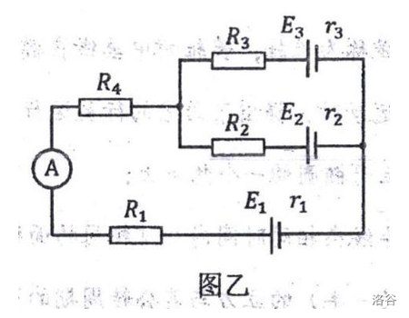

电路参数为：$R_1=1\Omega$，$R_2=3\Omega$，$R_3=2\Omega$，$R_4=3\Omega$，$E_1=3V$，$r_1=2\Omega$，$E_2=6V$，$r_2=3\Omega$，$E_3=9V$，$r_3=1\Omega$。

电路正常工作时，电流表的示数是多少？

### 基尔霍夫电路定律

如图，存在两条回路 $s_1$、$s_2$，假设电流流向为从 $E_2$、$E_3$ 正极出发，干路、支路电流分别为 $i_1$，$i_2$、$i_3$：

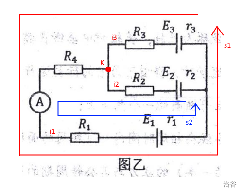

对节点 $K$ 应用基尔霍夫第一定律，得 $i_1-i_2-i_3=0$。

对回路 $s_1$、$s_2$ 分别应用基尔霍夫第二定律，最终可列出方程组：

$$
\begin{cases}
i_1&=i_2+i_3\\
E_2&=i_2r_2+i_2R_2+i_1R_1+i_1R_4+i_1r_1+E_1\\
E_3&=i_3r_3+i_3R_3+i_1R_1+i_1R_4+i_1r_1+E_1
\end{cases}
$$

代数，得：

$$
\begin{cases}
i_1&=i_2+i_3\\
6V&=3\Omega\cdot i_2+3\Omega\cdot i_2+1\Omega\cdot i_1+3\Omega\cdot i_1+2\Omega\cdot i_1+3V\\
9V&=1\Omega\cdot i_3+2\Omega\cdot i_3+1\Omega\cdot i_1+3\Omega\cdot i_1+2\Omega\cdot i_1+3V
\end{cases}
$$

化简得：

$$
\begin{cases}
i_1&=i_2+i_3\\
3V&=6\Omega\cdot i_2+6\Omega\cdot i_1\\
6V&=3\Omega\cdot i_3+6\Omega\cdot i_1
\end{cases}
$$

解得：

$$
\begin{cases}
i_1&=5/8&A\\
i_2&=-1/8&A\\
i_3&=3/4&A
\end{cases}
$$

分析可知，我们假设的 $i_2$ 电流流向是错误的，而电流表示数为 $\dfrac{5}{8}A$。

### 电路的叠加定理

忽略电流表，可以发现图中仅存在电阻和电压源，因此该电路是线性电路，存在电路的叠加原理。

分别考虑 $E_1$，$E_2$，$E_3$ 的影响，设 $I_1$、$I_2$、$I_3$ 其电流表的示数，以电流从上到下为正值，从下到上为负值：

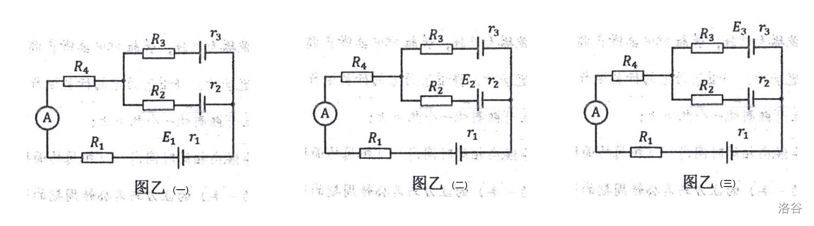

极易得：

$$
\begin{array}{l}
I_1&=-\dfrac{E_1}{r_1+R_1+R_4+\dfrac{(r_2+R_2)(r_3+R_3)}{r_2+R_2+r_3+R_3}}\\[2em]
&=-\dfrac{3V}{2\Omega+1\Omega+3\Omega+\dfrac{(3\Omega+3\Omega)(1\Omega+2\Omega)}{3\Omega+3\Omega+1\Omega+2\Omega}}\\[2em]
&=-\dfrac{3}{8}A
\end{array}
$$

$$
\begin{array}{l}
I_2&=\dfrac{E_2}{r_2+R_2+\dfrac{(r_3+R_3)(r_1+R_1+R_4)}{r_3+R_3+r_1+R_1+R_4}}\times\dfrac{r_3+R_3}{r_3+R_3+r_1+R_1+R_4}\\[2em]
&=\dfrac{6V}{3\Omega+3\Omega+\dfrac{(1\Omega+2\Omega)(2\Omega+1\Omega+3\Omega)}{1\Omega+2\Omega+2\Omega+1\Omega+3\Omega}}\times\dfrac{1\Omega+2\Omega}{1\Omega+2\Omega+2\Omega+1\Omega+3\Omega}\\[2em]
&=\dfrac{1}{4}A
\end{array}
$$

$$
\begin{array}{l}
I_3&=\dfrac{E_3}{r_3+R_3+\dfrac{(r_2+R_2)(r_1+R_1+R_4)}{r_2+R_2+r_1+R_1+R_4}}\times\dfrac{r_2+R_2}{r_2+R_2+r_1+R_1+R_4}\\[2em]
&=\dfrac{9V}{1\Omega+2\Omega+\dfrac{(3\Omega+3\Omega)(2\Omega+1\Omega+3\Omega)}{3\Omega+3\Omega+2\Omega+1\Omega+3\Omega}}\times\dfrac{3\Omega+3\Omega}{3\Omega+3\Omega+2\Omega+1\Omega+3\Omega}\\[2em]
&=\dfrac{3}{4}A
\end{array}
$$

根据叠加定理，得出电流表示数 $I=I_1+I_2+I_3=-\dfrac{3}{8}+\dfrac{1}{4}+\dfrac{3}{4}=\dfrac{5}{8}A$。

### 电流源与电压源

这也是原题想让我们应用的方法，这里先对题目的铺垫加以简单总结。

我们发现，一个内阻为 $r$ 的电压源 $E$，等效如图丙。

其串联一个总电阻为 $R$ 的用电器（或等效用电器）后，干路电流为：

$$
I=\dfrac{E}{r+R}
$$

我们发现 $E/r$ 为电源的特性，于是想办法凑出来这个形式：

$$
I=\dfrac{E}{r}\times\dfrac{r}{r+R}
$$

注意到后面的式子就是并联分流公式，我们转化电路形如图丁。

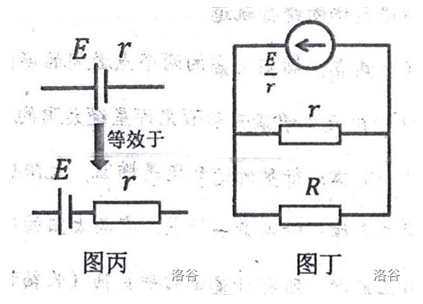

于是，我们就把一个内阻为 $r$ 的电压源 $E$ 串联一个总电阻为 $R$ 的用电器，等效转化为了一个电流源 $E/r$ 并联上原电压源内阻，以及用电器 $R$。

回到问题，（如图）我们可以把原电压源 $E_2$、$E_3$ 及其内阻、支路电阻等效转化为一个电压源：

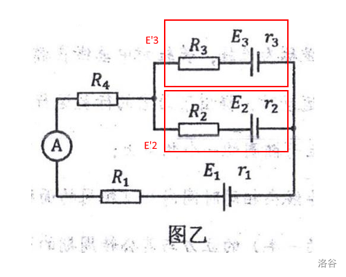

- 把电压源 $E_2$ 同其内阻 $r_2$ 及并联的电阻 $R_2$ 抽象为一个电压源 $E'_2$，内阻为 $(r_2+R_2)$，也就等效为一个电流源 $E_2/(r_2+R_2)$，并联电阻 $(r_2+R_2)$；具体的，电阻 $r_2'=r_2+R_2=6\Omega$，电流 $I_2'=E_2/r_2'=6V/6\Omega=1A$。
- 把电压源 $E_3$ 同其内阻 $r_3$ 及并联的电阻 $R_3$ 抽象为一个电压源 $E'_3$，内阻为 $(r_3+R_3)$，也就等效为一个电流源 $E_3/(r_3+R_3)$，并联电阻 $(r_3+R_3)$；具体的，电阻 $r_3'=r_3+R_3=3\Omega$，电流 $I_3'=E_3/r_3'=9V/3\Omega=3A$。

观察到，这两个电流源（电流流向一致，电流大小相加）就可以合并为一个电流源。

具体的，电阻 $r'=(3\times6)/9=2\Omega$，电流 $I'=1A+3A=4A$；

这个电流源也就等效于一个电压源，电压为 $E'=2\Omega\times4A=8V$，$R'=2\Omega$。

其电流方向与 $E_1$ 相反，电压相减 $V=E'-E_1=8V-3V=5V$，

其总电阻 $R=R_1+R_4+r_1+r'=1\Omega+3\Omega+2\Omega+2\Omega=8\Omega$。

于是，电流表示数即为 $I=V/R=5V/8\Omega=\dfrac{5}{8}A$。

### 简单欧姆定律

我们把原图抽象为三个支路，其电流分别记为 $i_1$、$i_2$、$i_3$，如图：

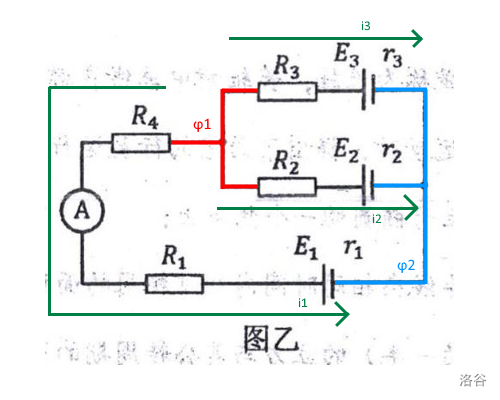

我们假设有一个奇妙的总电源，给红色的和蓝色的部分，提供了大小为 $V$ 的电势差。

我们规定红色部分的电势高于蓝色部分，即 $\varphi_1>\varphi_2$，则有 $V=\varphi_1-\varphi_2$。

据此，我们可以列出三个方程：

$$
\begin{cases}
V&=i_1(r_1+R_1+R_4)-E_1\\
V&=i_2(r_2+R_2)-E_2\\
V&=i_3(r_3+R_3)-E_3
\end{cases}
$$

代数即（其实这个就是基尔霍夫第二定律的意思）：

$$
\begin{cases}
V&=i_1(2\Omega+1\Omega+3\Omega)-3V&=6\Omega\times i_1-3V\\
V&=i_2(3\Omega+3\Omega)-6V&=6\Omega\times i_2-6V\\
V&=i_3(1\Omega+2\Omega)-9V&=3\Omega\times i_3-9V
\end{cases}
$$

发现原式与 $i_1$、$i_2$、$i_3$ 关系密切，尝试找到他们之间的关系。

设电路的等效电阻为 $R_0$，注意到 $V$ 只提供了 $i_1+i_2+i_3$ 的电流，则有：

$$
i_1+i_2+i_3=V/R_0
$$

回到原电路，我们发现并没有这个奇妙的电源，也就是 $V=0$，

因此有（其实这个也是基尔霍夫第一定律的内容）：

$$
i_1+i_2+i_3=0V/R_0=0V
$$

这意味着 $i_1$、$i_2$、$i_3$ 中一定存在负数。综合上述四式，解得：

$$
\begin{cases}
V&=-27/4&V\\
i_1&=-5/8&A\\
i_2&=-1/8&A\\
i_3&=3/4&A
\end{cases}
$$

则电流表示数为 $i_1$ 的绝对值，即电流表示数为 $\dfrac{5}{8}A$。

