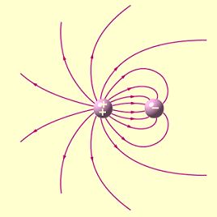
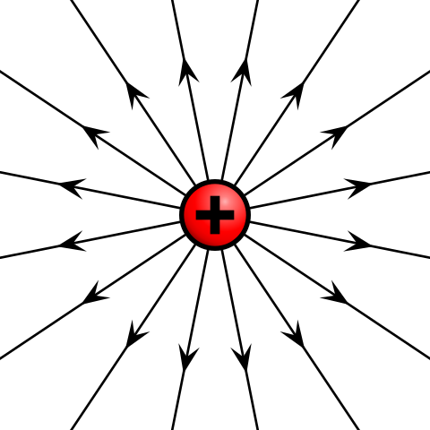
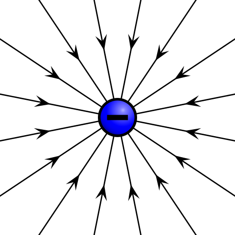
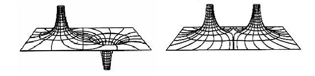
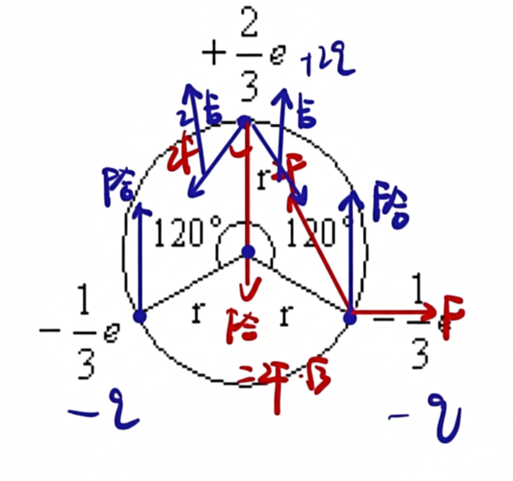
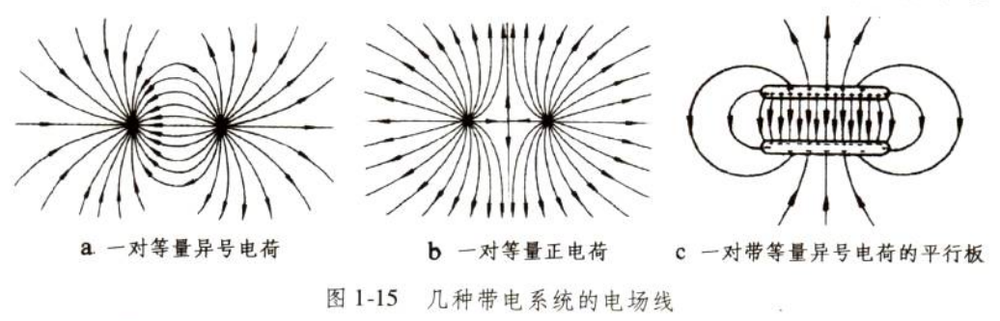

# 静电学基础

## 电荷

### 电荷和电荷量

电荷是构成物质的基本粒子的一种物理性质，原子中的质子和电子分别带有正电荷和负电荷，而中子不带电荷。

质子与电子这种携带电荷的粒子称作**载流子**，电荷作为一种假想物质，无法脱离载流子单独存在。

- 丝绸摩擦的玻璃棒带正电荷，毛皮摩擦的橡胶棒带负电荷。

- 带有电荷的物质称为**带电物质**，带有电荷的粒子称为**带电粒子**。

电荷量的国际单位是库仑（$\text C$），通常用符号 $Q$ 表示。

**电偶极子**是两个分隔一段距离，电量相等，正负相反的电荷。

**电导体**为能够让电流通过的材料，依其导电性（导电能力），能够细分为超导体、**导体**、半导体及**绝缘体**。其本质为：内部自由移动的电荷（只考虑负电荷，即电子）。

元电荷（也成基本电荷）：基本电荷 $e$ 是一个质子所带的**电荷量**，或一个电子所带的负**电荷量**。

其中 $e\approx 1.602\times 10^{-19}\text C$，一个电子携带的电荷量为 $-e$。

???+ note "为什么是小数？"
    历史上，安培（电流强度）是先于库仑定义的，最初的库伦定义就是**安培秒**，即 $1$ 库仑是 $1$ 安培电流在 $1$ 秒钟内传递的电荷，表示为 $1\text C=1\mathrm{A\cdot s}$ 或 $1\text C=1\text{A}\times1\text{s}$，而旧的安培定义为「在相距 $1$ 米的两条平行导线间，产生每米 $0.2$ 微牛顿的磁力所需的电流」。

比荷、比电荷（又称荷质比）：即带电物体所带电荷比上其质量，电子比荷约为 $1.758820024(11)\times 10^{11}\mathrm{C/kg}$，质子的比荷约为 $9.578309\times 10^7\mathrm{C/kg}$。

???+ note "电荷的总量和电量（电荷量）"
    正电荷的电量为正值，负电荷的电量为负值，一个物体的电量就是其内部所有载流子（质子和电子）的电量的**代数和**，我们称一个物体的电性就是它电量的正负性。

    与电量不同，**电荷的总量**计算时会忽略负电荷所带符号，即电荷的总量表示的是所有电荷的**绝对值**之和。

注意到物体不带电不等价于物体中没有正电荷和负电荷，只是说正电荷的电量和负电荷的电量正好可以抵消。

在题目中，有时会将电量的绝对值表达为「电量」，因此我们经常在阐述正电量时在值的前面加一个正号，代表电性为正。

### 电荷守恒定律

电荷守恒定律是一种关于电荷的**守恒定律**。

电荷守恒定律有两种版本，**弱版电荷守恒定律**（又称为**全域电荷守恒定律**）与**强版电荷守恒定律**（又称为**局域电荷守恒定律**）。

**弱版电荷守恒定律**表明，整个宇宙的总电荷量保持不变，不会随着时间的演进而改变。注意到这定律并没有禁止，在宇宙这端的某电荷突然不见，而在宇宙那端突然出现。

**强版电荷守恒定律**明确地禁止这种可能。强版电荷守恒定律表明，在任意空间区域内电荷量的变化，等于流入这区域的电荷量减去流出这区域的电荷量。对于在区域内部的电荷与流入流出这区域的电荷，这些电荷的会计关系就是电荷守恒。

???+ note "补充"
    近代物理实验发现，带电粒子也可以产生或湮没。如一个高能光子在一定条件下可以产生一个正电子（反物质中的内容）和负电子；一对正、负电子可以同时湮没，转化为光子。

    因此全电荷守恒定律有更普遍的表述：一个与外界没有电荷交换的系统，电荷的代数和保持不变（即电量保持不变）。

    全电荷守恒定律的第一种表述已经适用于经典物理，在经典物理中是应当被肯定的。在高中阶段，电荷守恒定律 指的是全电荷守恒定律。

### 电荷量子化

电荷必须依赖载流子存在，一个载流子的电量绝对值为 $e$，因此任何物体（夸克的分数电荷作为例外）的电量都是 $e$ 的整数倍。

也就是说，物体所带电荷量不可能连续地取任意量值，而只能取电子或质子电荷量的整数倍值。电荷量的这种只能取分立的、不连续量值的性质，称为电荷的量子化。

这种量子化并不会影响电动力学中的任何结论。

## 库仑定律

### 定义式

库仑定律表明，在真空中两个静止点电荷之间的相互作用力，与两电荷间距离的平方成反比，且与两电荷电量的乘积成正比，作用力方向在它们的连线上，同号电荷相斥，异号电荷相吸。

库仑证明两带电体间有相互作用力，且其定量关系可以方程表示。库仑定律的标量形式可以表示为：

$$
F_{库}=k\dfrac{Q_1Q_2}{r^2}
$$

理论上 $Q$ 应该带正负号，但是如果列标量方程，一般不带入正负号，表示库仑力的大小。

$$
\bm F=k\dfrac{Q_1Q_2}{r_2}\hat{\bm r}
$$

???+ note "补充：$k$ 的大小"
    在真空中，有公式：

    $$
    k_e=\dfrac{1}{4\pi\varepsilon_0}=\dfrac{c_0^2\mu_0}{4\pi}=c_0^2\times10^{-7}\mathrm{H/m}
    $$

    其中 $c_0$ 表示光速，因此：

    $$
    k_e\approx9\times10^9\ \mathrm{Nm^2C^{-2}}
    $$

    这个数是很大的。

### 库仑定律适用范围

适用范围：场源电荷静止​、点电荷。

库仑定律不适用于场源电荷相对观测者运动的情形，对试探电荷运动或静止的情形没有要求。

当两带电体之间的距离相对于两带电体的半径（考虑近似成球体）很大时，我们才能将两带电体看作点电荷：设两带电体距离为 $r$，两带电体半径分别为 $R$，必须有 $r\gg R$。

一般情况下微观粒子的大小都远远小于彼此之间的距离，因此微观粒子在计算静电力时一般都可以看做点电荷。

正因如此，$r\to0$ 时静电力趋于无穷大这种说法是错误的，两带电体不能看成点电荷（两球体之间相距过近时，两球内部的电量分布会影响静电力的大小），此时库仑定律已不再适用。

### 库伦实验

{ width="100%" }

## 电场和电场线

### 场

在物理里，空间中弥漫着的基本相互作用被命名为场。场被认为是延伸至整个空间的，但实际上，每一个已知的场在够远的距离下，都会缩减至无法量测的程度。

例如，在牛顿万有引力定律里，重力场的强度是和距离平方成反比的，因此地球的引力场会随着距离很快地变得不可测得（在宇宙的尺度之下）。

哲学上来讲：场占有空间，含有能量、动量，它形成了一个空间的状态。场的存在排除了真正的真空：真空中没有物质，但并不是没有场的。

???+ note
    当一个电荷移动时，另一个电荷并不会立刻感应到。第一个电荷会感应到一个反作用力，并获得动量，但第二个电荷则没有感应，直到第一个电荷移动的影响以光速传递到第二个电荷那里，并给予其动量之后。场的存在解决了关于第二个电荷移动前，动量存在在哪里的问题。因为依据动量守恒定律，动量必存在于某处。物理学家认为动量应该存在于场之中。如此的认定让物理学家们相信电磁场是真实的存在，使得场的概念成为整个现代物理的范式。

作用力所做的功跟移动路径无关的力称为**保守力**（例如重力）。

类似保守力，也有**保守场**的定义：曲线积分[^notejf]的值与路径无关的场为保守向量场。

另外的定义有如，如果力的矢量场是保守的，则这个力称为保守力。

[^notejf]: 曲线积分：对于标量函数，曲线积分的值是积分路径各点上的函数值乘上该点切向量的长度；对于向量函数，曲线积分的值是积分向量函数与曲线切向量的内积。

### 场线

{ align=right }

PS：右图为矢量叠加的电场线。

在空间里，矢量场在每一个位置，都设定了一个方向，因此场线不能相交，并且场线在每一个位置的切线平行于矢量场在那一个位置的方向。

常见的场线有磁场线：在磁铁的四周洒散铁粉，可以清楚地显示出磁场的磁场线。

大多数时候，场线只是一个数学建构，少数情况场线有实际的物理意义。

### 电场

电场是存在于电荷周围，能传递电荷与电荷之间相互作用的物理场。

电场是保守场，电势能只跟初始位置与终止位置有关，与路径无关。

在电荷周围总有电场存在；同时电场对场中其他电荷发生力的作用（电场力）。

根据试探电荷是否受力可以知道是否存在电场。

### 电场线

静电荷的场线称为电场线。

|                    从正电荷往外扩散                    |                     朝着负电荷聚集                      |
| :----------------------------------------------------: | :-----------------------------------------------------: |
|  |  |

电场线用于描述电场，是不存在的，有场的方向（用箭头表示）和大小（用疏密表示）两个要素。

场的方向与试探点电荷（正电荷）在该点所受电场力的方向相同，与该点电场强度 $E$ 方向相同。

根据矢量的性质，电场线可以直接矢量叠加，叠加与磁感线的叠加类似。

对于一个电偶极子，电场线总是从正电荷流出，汇入负电荷。

/// caption
图左是两个同电量的正电荷的电场线；图右是一个电偶极子的电场
///

根据场线的性质，一个位置的电场方向总是沿着这个位置的电场线的切线方向。

对于左图：

- 两点电荷连线：电场强度先减小后增大。
- 两点电荷连线的垂直平分线：从内到外先增大再减小。

对于右图：

- 两点电荷连线：电场强度先减小后增大。
- 两点电荷连线的垂直平分线：从内到外逐渐减小。

## 电场强度

### 电场强度的定义式

电场强度是用来表示电场的强弱和方向的物理量，常用 $E$ 表示。

电场中**某一点的**电场强度的方向与试探点电荷（正电荷）在该点所受电场力的方向相同。

电场强弱可由试探电荷所受的电场力与**试探点电荷**带电量的比值确定，即矢量比值定义，由于电场力满足矢量叠加原理，电场强度也满足叠加原理。

定义式为：

$$
\bm E=\dfrac{\bm F}q
$$

国际单位为**伏特每米** $\mathrm{V/m}$ 或**牛顿每库仑** $\mathrm{N/C}$（这两个单位实际上相等），常用单位有伏特每厘米 $\mathrm{V/cm}$。

常见误区：

- 在电场中某一点，试探点电荷（正电荷）在该点所受电场力与其所带电荷的比值是一个与试探点电荷无关的量。
- 只要有电荷存在就有静电场存在，电场的存在与否是客观的，与是否引入试探点与电荷无关，引入试探点电荷只是为了检验电场的存在和讨论电场的性质而已。正像人们使用天平可以称量出物体的质量，如果不用天平去称量物体，物体的质量仍然是客观存在的一样。

试探点电荷应该满足两个条件：

- 它的线度必须小到可以被看作点电荷，以便确定场中每点的性质；
- 它的电量要足够小，使得由于它的置入不引起原有电场的重新分布。

### 点电荷电场强度

我们带入将库仑力公式带入电场强度定义式，得到：

$$
E=k\dfrac{Q}{r^2}
$$

其中 $Q$ 表示的是场源电荷。

## 电势和电势能

### 电势能

!!! note "引入"
    我们知道，重力做功会消耗重力势能，即：

    $$
    W_G=-\Delta E_{pG}
    $$

    类似的，电场力做功会消耗电势能，即：

    $$
    W_{电}=-\Delta E_{p电}
    $$

    在匀强电场中：

    $$
    W_{电}=\bm F_{电}\cdot\bm x=F_{电}x\cos\theta=EqH
    $$

    这是很类似重力势能 $W_G=mgH$ 的。

在静电学里，电势能是处于电场的电荷分布所具有的势能，与电荷分布在系统内部的组态有关，单位为焦耳。

电势的数值不具有绝对意义，只具有相对意义，因此为了便于分析问题，必须设定一个参考位置，并把它设为零，称为零势能点。

当物理系统内的每一个点电荷相距无穷远且其相对静止不动时，这一物理系统通常可以设定为电势能等于零的参考系统。

???+ note "单点电荷系统"
    只拥有单独一个点电荷的物理系统，其电势能为零，因为没有任何其它可以产生电场的源电荷，所以，将点电荷从无穷远移动至其最终位置，外机制不需要对它做任何机械功。

    特别注意，这点电荷有可能会与自己生成的电场发生作用。然而，由于在点电荷的位置，它自己生成的电场为无穷大，所以，在计算系统的有限总电势能之时，一般刻意不将这自身能纳入考量范围之内，以简化物理模型，方便计算。

### 电势和电势差

在静电学里，**电势**（又称电位）是描述电场中某一点能量高低的物理量。

电场中某处的电势等于处于电场中该位置的单位电荷所具有的电势能，单位为伏特：

$$
\varphi=\dfrac{E_{p电}}{q}
$$

电势的数值不具有绝对意义，只具有相对意义，因此为了便于分析问题，必须设定一个参考位置，并把它设为零，称为零势能点。

一个直观的定义为：检验电荷从零势能点，经过任意路径，克服电场力，以缓慢、没有产生加速度的方式移动到某位置，则在这位置的电势等于因移动检验电荷所做的功与检验电荷的电荷量的比值。

**电势差**：用字母 $U$ 表示，单位为伏特 $\text V$，有表达式

$$
U_{ab}=\varphi_a-\varphi_b
$$

**等势面**：所有电势相等的面构成的面称为等势面：

- 电场线和等势面总是垂直的。
- 沿着等势面移动的电荷电场力不做功（解释：运动方向等势面与受力方向电场线垂直）。
- 等差等势面越密集，电场强度越大（解释：类比地理等高线）。

/// caption
左图为等量异种电荷；右图为等量同种电荷
///

/// caption
等势面：等量异种电荷。图片由 WolframAlpha 制作
///

/// caption
等势面：等量同种电荷。图片由 WolframAlpha 制作
///

### 公式：非匀强电场做功

描述的是电荷 $q$ 从 $A$ 移动到 $B$，做功大小与 $\varphi_A-\varphi_B$ 的关系。

$$
W_{AB}=U_{AB}q
$$

推导：

$$
W_{AB}=-\Delta E_p=E_{pA}-E_{pB}=\varphi_Aq-\varphi_Bq=U_{AB}q
$$

### 公式：匀强电场场强

描述的是匀强电场两点间场强与电势的关系：

$$
E=\dfrac Ud
$$

其中 $d$ 表示沿着电场线的长度，注意电场线一定是直线（**匀强电场**）。

推导：

$$
\begin{aligned}
W_{AB}&=Fx\cos\theta\\
U_{AB}q&=Eq\cos\theta\\
U_{AB}&=Ed
\end{aligned}
$$

这个公式也可以描述在两个平行金属板间通入电压所形成的匀强电场的场强。

注意：因为这里的 $\theta$ 是夹角，因此请注意此时公式是不能确定正负号的，即：

$$
U=\pm Ed
$$

### 公式汇总

电场中，物理量存在关系：

| 物理量 | 单位 | 物理意义 | 公式 |
| :-: | :-: | :-: | :-: |
| 电荷量 $Q$ | 库伦 $\text C$ | 带电物体所带电荷量 |  |
| 场强 $E$ | 牛顿每库伦 | 电场的强度，单位电荷所受电场力大小 | $E_{点}=k\dfrac{Q}{r^2}$ |
| 电场力 $F_{电}$ | 牛顿 | 点电荷在电场中受到的力 | $E=\dfrac Fq$ |
| 电场力做功 $W_{电}$ | 焦耳 | 电场力对电荷做的功 | $W=Fx\cos\theta$ |
| 电势能 $E_{p电}$ | 焦耳 | 电场中带电物体所具有的势能 | $W_{电}=-\Delta E_{p电}$ |
| 电势 $\varphi$ | 伏特 | 电场中单位电荷所带电势能 | $\varphi=\dfrac{E_p}q$ |
| 电势差 $U$ | 伏特 | 电场中两点电势的差值 | $U_{AB}=\varphi_A-\varphi_B$ |

由此得出推导公式 $W=Uq$ 和 $E=\dfrac Ud$。

求电势：

- $\varphi=\dfrac{E_p}{q}$。
- $U_{AB}=\varphi_A-\varphi_B$。
- 联立电场力做功。

求电势差：

- $U_{AB}=\varphi_A-\varphi_B$。
- $E=\dfrac Ud=\dfrac W{qd}$。
- 注意正负号。

### 图像问题

做题方法：在 $x$ 轴上画出电场线

- $E-x$ 图像：注意到 $E$ 的正负就表示电场线方向，因此只需要找曲线零点分段即可。
- $\varphi-x$ 图像：注意到 $\varphi$ 递增的方向就是电场线的方向，因此只需要分段找单调区间即可。

特殊性质：在 $\varphi-x$ 图像中，一点的曲线斜率大小即为该点的场强大小。

证明：根据 $\varphi_A-\varphi_B=U_{AB}=Ed$ 显然。
