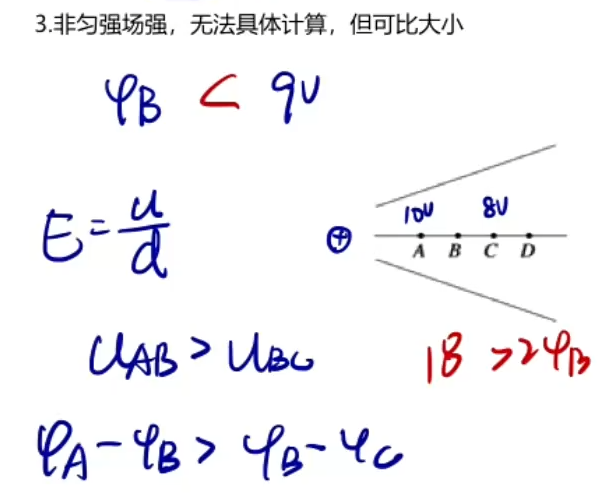
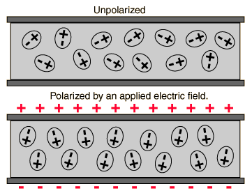
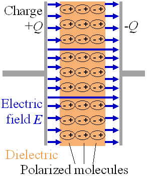
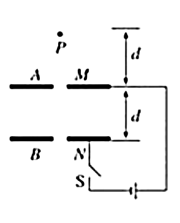
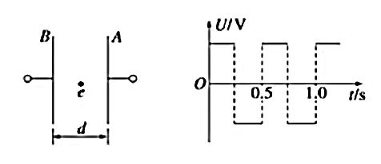
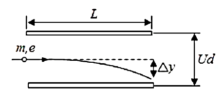
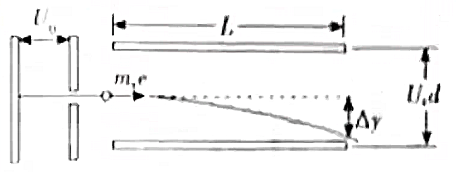

# 电场运动

## 静电动力学

### 运动概述

带电粒子在电场中的运动主要研究匀强电场中带电粒子的平衡、偏转和加速问题。其规律与仅在重力作用下的抛体运动非常相似，只需将抛体运动中使用的重力加速度 $g$ 替换为电场中带电粒子的加速度 $a$，即可将自由落体、竖直上抛、平抛和斜抛运动的相关公式在匀强电场中类比应用。

对于基本粒子（例如电子、质子、$\alpha$ 粒子等）在电场中的运动，通常可以忽略重力；而在讨论带电微粒、尘埃、小球、液滴等在电场中的运动时，必须考虑重力的影响。在处理这类问题时，应注意隐含条件的提取与分析。

### 非匀强电场

描述的是电荷 $q$ 从 $A$ 移动到 $B$，做功大小与 $\varphi_A-\varphi_B$ 的关系。

$$
W_{AB}=U_{AB}q
$$

推导：

$$
W_{AB}=-\Delta E_p=E_{pA}-E_{pB}=\varphi_Aq-\varphi_Bq=U_{AB}q
$$

### 匀强电场

描述的是匀强电场两点间场强与电势的关系：

$$
E=\dfrac Ud
$$

其中 $d$ 表示沿着电场线的长度，注意电场线一定是直线（**匀强电场**）。

推导：

$$
\begin{aligned}
W_{AB}&=Fx\cos\theta\\
U_{AB}q&=Eq\cos\theta\\
U_{AB}&=Ed
\end{aligned}
$$

这个公式也可以描述在两个平行金属板间通入电压所形成的匀强电场的场强。

注意：因为这里的 $\theta$ 是夹角，因此请注意此时公式是不能确定正负号的，即：

$$
U=\pm Ed
$$

### 公式汇总

电场中，物理量存在关系：

| 物理量 | 单位 | 物理意义 | 公式 |
| :-: | :-: | :-: | :-: |
| 电荷量 $Q$ | 库伦 $\text C$ | 带电物体所带电荷量 |  |
| 场强 $E$ | 牛顿每库伦 | 电场的强度，单位电荷所受电场力大小 | $E_{点}=k\dfrac{Q}{r^2}$ |
| 电场力 $F_{电}$ | 牛顿 | 点电荷在电场中受到的力 | $E=\dfrac Fq$ |
| 电场力做功 $W_{电}$ | 焦耳 | 电场力对电荷做的功 | $W=Fx\cos\theta$ |
| 电势能 $E_{p电}$ | 焦耳 | 电场中带电物体所具有的势能 | $W_{电}=-\Delta E_{p电}$ |
| 电势 $\varphi$ | 伏特 | 电场中单位电荷所带电势能 | $\varphi=\dfrac{E_p}q$ |
| 电势差 $U$ | 伏特 | 电场中两点电势的差值 | $U_{AB}=\varphi_A-\varphi_B$ |

由此得出推导公式 $W=Uq$ 和 $E=\dfrac Ud$。

求电势：

- $\varphi=\dfrac{E_p}{q}$。
- $U_{AB}=\varphi_A-\varphi_B$。
- 联立电场力做功。

求电势差：

- $U_{AB}=\varphi_A-\varphi_B$。
- $E=\dfrac Ud=\dfrac W{qd}$。
- 注意正负号。

注意，在不同的公式中，$q$ 是否带入正负号是不同的：

- 库仑力、电场力等表示矢量的大小的，不需要带入符号。

- 功能 $W=Uq,E=\varphi q$ 需要带入符号，因为这些是标量。

### 轨迹问题

三线：电场线，等势线，轨迹线。

- 电场线和等势线垂直。
- 电场线和等势线的疏密都能反应电场强度，进而根据 $ma=F=Eq$ 可以推出电场力和加速度的大小。
- 轨迹线和电场线重合：电场线为直线，且 $v_0$ 与 $F$ 共线。

解题方法：

- 判断粒子受力情况：找到轨迹线与电场线或等势线交点，则力一定平行与电场线垂直于等势线，根据牛顿第二定律得出合外力一定指向轨迹线弯曲的方向。
- 判断加速度、动能：根据力与速度的夹角，夹角为锐角则加速，如果为钝角则减速。
- 判断电势能、电势：根据动能增减，得出电势能增减，再根据粒子带电正负性可以得出电势大小。

带电正负、电场方向、电势大小，可以互相推导，如果都不知道就都不知道。

点电荷特殊电场，此时电场力就是库仑力：

- 判断粒子受力情况：连线，根据库仑定律可得。
- 判断加速度、动能：注意此时可能会出现先增大后减小，等情况

在点电荷中，通常存在有对称性。

## 电容器模型

### 匀强电场

匀强电场在某个区域内各处电场强度大小相等，方向相同。

根据 $\bm F=\bm Eq$，在匀强电场中，带电物体受力始终是不变的，是恒力。

{ align=right width="50%" }

- 因为本身性质和重力类似，因此可以得出很多运动学动力学的结论，尤其是曲线运动。

- 有时不可忽略带电物体自身的重力，此时通常将重力和电场力做矢量和，即等效重力。

- 在动力学部分，通常列水平竖直的 $v_t=v_0+at$，因为需要两个方向的时间联系。

根据 $U=Ed$：

- 两平行边，电压和长度成正比。
- 一条边上，电势差与长度成正比。

找等势面：

- 根据 $E=U/d$ 求场强，$d$ 是顺着电场线的距离。
- 我们一定需要找一个电场线方向，可以直接找等势面。
- 连接两个等势点得到等势面，其垂直方向即为电场线方向。

匀强电场电场强度的正交分解求法：

- 在一对垂直的方向上，分别求出电场强度，用电势差除以长度。

- 用勾股定理正交合成，得到最终的合电场强度。

### 电容器的概念

电容器（符号表示为「卝」）是将电能储存在电场中的被动电子器件，其储能特性可以用电容表示。

构成：两块金属板加一个绝缘介质。具体的，平行板电容器是一种简单的电容器，是由互相平行、以空间或介电质隔离的两片薄板导体构成。

/// caption
电容器原理示意图
///

电容：表示电容器储存电荷的能力。用 $C$ 表示，单位为 $\text F$ 法拉。

!!! note "电容器的应用"
    { align=right }

    在电路中邻近的导体之间即存在电容，而电容器是为了增加电路中的电容量而加入的电子器件。

    当电容器和其充电线路分离后，电容器会储存能量，因此可作为电池，提供短时间的电力。理论上电容器可以充电到很高的电压，例如几百伏特，但因为材料限制和介质击穿的原因，通常不会特别高。

    电容器常用在配合电池使用的电子设备中，在更换电池时提供电力，避免储存的资料因没有电力而消失。在电容充电后关闭电源，电容内的电荷仍可能储存很长的一段时间，此电荷足以产生电击，或是破坏相连结的仪器。

    在维修具有大电容的设备之前，需确认电容已经放电完毕。为了安全上的考量，所有大电容在组装前需要放电。高电压的电容器若在启动时加入缓启动的机制，限制其突入电流，可以延长其设备寿命，提升器件可靠度，也可以避免高电压下造成的危害。

假设这两片导板分别载有负电荷与正电荷，所载有的电荷量分别为 $−Q$、$+Q$，两片导板之间的电势差为 $V$，则这电容器的电容 $C$ 为：

$$
C={Q\over V}
$$

### 电容的决定式

$$
C={\varepsilon_rS\over4\pi kd}
$$

- 其中 $\varepsilon_r$ 表示相对介电常数，定义为：

    $$
    \varepsilon_r={\varepsilon\over\varepsilon_0}={C\over C_0}
    $$

    用 $\varepsilon_0$ 表示真空电容率，$\varepsilon$ 表示电介质的电容率。

    $$
    \varepsilon_0\approx8.854\ 187\ 817\dots\times10^{-12}\mathrm{(A^2s^4kg^{-1}m^{-3})\ or\ (F/m)}
    $$

    相对介电常数通常与绝缘介质有关，通常真空的相对介电常数最小。

- 其中 $S$ 表示正对面积，即垂直接触的面积。

- 其中 $d$ 表示两板间距，即两平面的距离。

- 其中 $k$ 表示静电常数，详见库仑力。

进行推导，如果一个初始的电容器绝缘介质为真空，则往其中插入任何介质都会导致电容增加：

- 如果插入导体：则 $d$ 减小，$C$ 增大。
- 如果插入绝缘体：则 $\varepsilon$ 增大，$C$ 增大。

### 电容器的动态变化

公式：

$$
\left\{
\begin{aligned}
C&=\dfrac QU\\
C&=\dfrac{\varepsilon_rS}{4\pi kd}\\
E&=\dfrac Ud
\end{aligned}
\right.
$$

可以推导：

$$
Q=\dfrac{\varepsilon_r ES}{4\pi k}
$$

和

$$
E=\dfrac{4\pi kQ}{\varepsilon_r S}
$$

解题思路：

- 若连接电压，则 $U$ 不变，根据 $d$ 推导 $C,Q,E$ 的变化。
- 若不连接电压，则 $Q$ 不变，根据 $d$ 推导 $C,U,E$ 的变化。
- 若 $Q$ 变化，则一定处于充电或放电的状态中，闭合电路中存在电流且如果是充电则顺着电池方向，如果是放电则逆着电池方向。

解题方法：

- 找出**电场线方向**，让卖家列出上面三个式子。
- 根据 $d$ 的变化推出 $C,E,Q,U$ 的变化。
- 对于求 $\varphi$ 的，列出一个 $Ed_{AB}=U_{AB}=\varphi_A-\varphi_B$ 的 $d_{AB}$ 不变的式子，根据 $E$ 的变化和 $\varphi_A,\varphi_B$ 中不变的一个，推导另一个的变化情况。

注意：根据 $U=Ed$ 求解时，一定要注意这个式子是无法确定正负号，即 $U_{AB}=-Ed_{BA}$ 是成立的。因此我们可以将下标按照电场线的方向书写，即电场线从 $A$ 到 $B$ 就列 $AB$ 的式子，这样可以避免正负号的问题。

## 加速电场模型

### 加速电场

将一个点电荷从匀强电场 $A$ 点静止释放，运动到 $B$ 的速度。

方法一：功动能定理。

$$
U_{AB}q=W=\dfrac12mv_B^2
$$

解得：

$$
v_B=\sqrt{\dfrac{2U_{AB}q}m}
$$

方法二：牛二。

$$
ma=F=Eq=\dfrac{U_{AB}}{d_{AB}}q
$$

$$
2ad_{AB}=v_B^2
$$

解得：

$$
v_B=\sqrt{\dfrac{2U_{AB}q}m}
$$

总结：$W=Uq$ 要注意正负号，数值与正负号可以同时带入也可以后确定正功负功。

### 加速电场穿出问题

**模型一**：连接电源。

{ align=right width="35%" }

如右图，两个平行板上有一对小孔（对电场的影响不计），初始状态为从 $P$ 点静止释放，带电质点恰好不穿出下板（记为 $Q$ 点）。

此时 $U$ 是不变的，那么列出功动能定理：

$$
\begin{aligned}
mg(d+d)+W_{电}&=0-0\\
mg2d-Uq=0
\end{aligned}
$$

- 若移动上板：因为重力做功和 $Uq$ 都是不变的，因此质点恰好不穿出。
- 若向下移动下板：此时重力做功增大，$Uq$ 不变，在 $Q$ 点时动能大于零，因此会穿出。
- 若向上移动下板：此时重力做功减小，$Uq$ 不变，在 $Q$ 点时*动能小于零*，这是不合理的，即无法到达 $Q$ 点或不穿出。

总结结论：

| | 向上移动 | 向下移动 |
| :-: | :-: | :-: |
| 仅移动上板 | 恰好不穿出 | 恰好不穿出 |
| 仅移动下板 | 不穿出 | 穿出 |

**模型二**：不连接电源。

此时即为一个电容器，我们根据电容器的知识：

$$
E=\dfrac{4\pi kQ}{\varepsilon_r S}
$$

即电场场强是不变的，根据 $ma=F=Eq$ 不变，加速度也是不变的。

列出功动能定理：

$$
\begin{aligned}
mg(d+d)+W_{电}&=0-0\\
mg2d-Fx=0
\end{aligned}
$$

- 若向上移动上板：重力做功不变，$x$ 增大，在 $Q$ 点时*动能小于零*，这是不合理的，即无法到达 $Q$ 点或不穿出。
- 若向下移动上板：重力做功不变，$x$ 减小，在 $Q$ 点时动能大于零，因此会穿出。
- 若移动下板：我们进行动态的分析，因为加速度不变，而刚进入电场时的速度也是不变的，因此如果向下移动下板，则质点会同样恰好到达 $Q$ 点，不穿出电场；如果向上移动下板，则质点会穿出电场，之后因为仅受重力的作用，而无法停在 $Q$ 点，即穿出电场。

总结结论：

| | 向上移动 | 向下移动 |
| :-: | :-: | :-: |
| 仅移动上板 | 不穿出 | 穿出 |
| 仅移动下板 | 穿出 | 不穿出 |

### 交变电场问题

如图：

本质是多个加速电场的合并。

$$
a=\dfrac{F}{m}=\dfrac{Eq}{m}=\dfrac{Uq}{dm}\propto U
$$

因此，我们可以根据电压的关系，画出 $a-t$ 图像，进而将其作为斜率画出 $v-t$ 图像，然后根据闭合图像面积对 $s-t$ 做出一定判断。

注意，在交变电场中，带电质点释放的时间是非常重要的，不同时间释放可能会影响运动情况。我们可以通过移动坐标轴到由静止释放释放的点，来实现简单的 $v-t$ 图像变换。

## 偏转电场模型

### 偏转电场

**偏转电场基本思路**：

- 根据牛顿第二定律，求得加速度 $a$。
- 解运动学方程，联系电场强度和位移。
- 根据电场强度和位移，联立求电势。

**基础偏转电场**如图：

基本思想是：

- 根据电场知识，求出 $a=\dfrac{qU}{md}$[^notequmd]。
- 根据通过时间为 $t=L/v_0$，列出两个方向的运动学方程求解。
- 如果给了场强，就用 $a=\dfrac{Eq}{m}$。

[^notequmd]: 记忆方法：已和谐。

牛二思路：求场强、电势差，考虑加速度。

**偏转电场列动能定理**：

$$
Uq=\dfrac12mv_t^2-\dfrac12mv_0^2
$$

此时注意 $U$ 为通过偏转电场位移在电场线上的投影。

一般不常在偏转电场中使用功动能定理，因为偏转电场与加速电场的通过整段电场不同，通常是通过一部分，需要通过正比例计算通过的电势差。

**偏转电场多段运动**：从偏转电场出去之后，为匀速直线运动或抛体运动，根据结论速度切线的反向延长线过水平位移中点，可以列出相似方程。

更加 trivial 的方式是，求出每一个运动段末状态的坐标和瞬时速度的水平和竖直分量，暴力计算即可。

**给定速度或位移角度**：列出角度的正弦余弦正切的比值，带入计算即可。

**加速电场撞板问题**：容易想到可行的方法只有，忽略板子限制，求出经过整个板后的竖直位移，与高度比较；求出恰好撞到板子上的水平位移，与板长比较。一般来说，我们按照前者计算会比较方便。

询问一排发射，问飞出去的百分比，即找到从下往上的上面算出的距离，在外面的就能飞出去，否则会撞板子。

### 加速与偏转电场

如图：

根据加速电场相关知识，电子进入偏转电场时的速度为：

$$
v_0=\sqrt{\dfrac{2U_0q}{m}}
$$

根据偏转电场相关知识，电子离开偏转电场时偏转的距离为：

$$
x=\dfrac12at^2=\dfrac{qU\cdot L^2\cdot m}{2\cdot md\cdot 2U_0q}=\dfrac{UL^2}{4U_0d}
$$

与荷质比无关，而电子在偏转电场中的运动时间：

$$
t=\dfrac{L}{v_0}=\sqrt{\dfrac{L^2m}{2U_0q}}
$$

与荷质比有关。

### 阴极射线管

**电子枪**是一种使用于部分真空管中、能发射具有精确动能的平行电子束的电子元件。

**阴极射线管**（又称显像管、布劳恩管）是一种用于显示系统的物理仪器，曾广泛应用于**示波器**和**显示器**上。

它是利用阴极电子枪发射电子，在阳极高压的作用下，射向荧光屏，使荧光粉发光，同时电子束在偏转磁场的作用下，作上下左右的移动来达到扫描的目的。

磁场偏向型：以磁场令电子束产生偏向，产生磁场的偏向线圈附加在阴极射线管颈部外侧。**显示器**使用此种方式的显像管。

电场偏向型：以电场令电子束产生偏向，产生电场的偏向极板内置在阴极射线管内部。**示波器**使用此种方式的显像管，以利应付不同的扫描频率，但此方式需要较长的管身，主要用于电子仪器。
