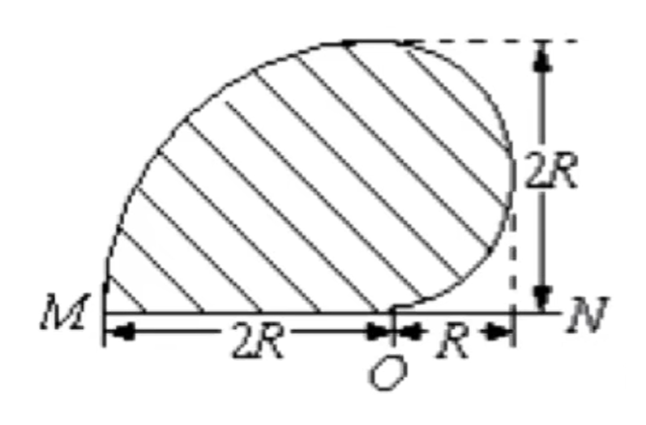
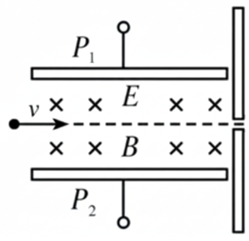
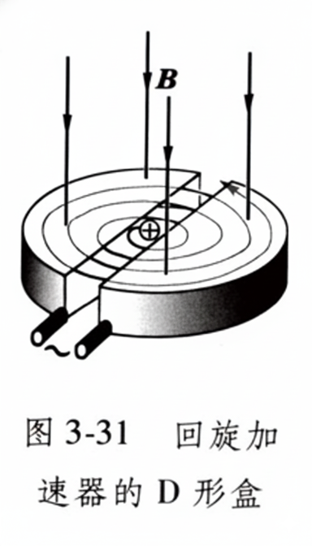
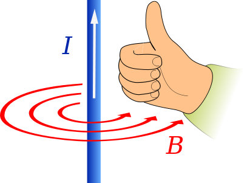
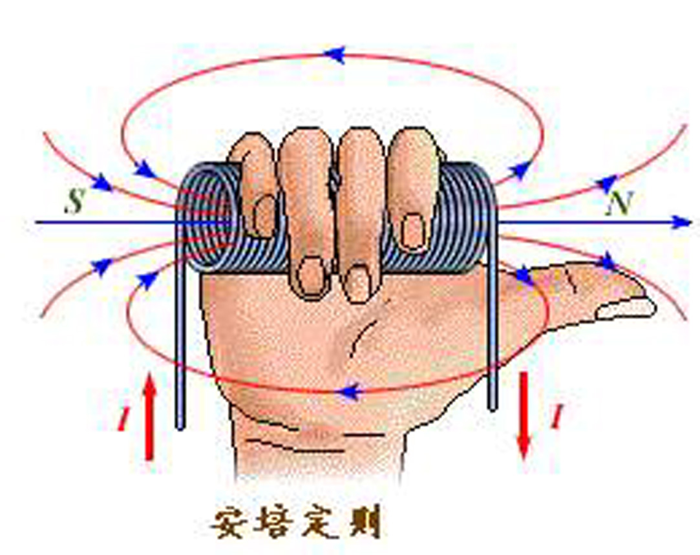
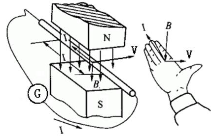

# 磁场概述

## 磁场

### 磁现象

如果将一条形磁铁投入铁屑中，再取出时可以发现，靠近两端的地方吸引的铁屑特别多，即磁性特别强，我们称之为磁极。

如果将条形磁铁或狭长磁针的中心悬挂或支撑起来，使其能在水平面内自由转动，则两磁极总是分别指向南北方向。我们称指北的一端为北极，又叫 $N$ 极；指南的一端为南极，又叫 $S$ 极。如果用另一磁铁去接近它们，则会发现同号的磁极互相排斥，异号的磁极互相吸引。

基于上述现象，16 世纪末，英王御医威廉·吉尔伯特指出，指南针之所以指向南北，是因为地球是一个巨大的磁体，它的地理上的北极和南极就是它的磁南极和磁北极。

现在我们更进一步地知道，地球的地理两极与地磁两极并不重合，因此磁针并非准确地指南或指北，其间有一个交角，这就是地磁偏角，简称磁偏角。磁偏角的数值因地区不同而异。不仅地球是一个巨大的磁体，宇宙中的许多天体都具有磁性。太阳表面的黑子、耀斑和太阳风等的出现都与太阳的磁性及其变化有关。

概括起来说，不仅磁铁—磁铁，而且电流—磁铁、磁铁—电流（运动电荷）、电流—电流之间都存在着相互作用，我们把它们统称为磁相互作用或磁力。

19 世纪杰出的法国科学家安培提出了一个假说：组成磁铁的最小单元（磁分子）就是环形电流。倘若这样一些分子环流定向地排列起来，在宏观上就会显示出 $N$、$S$ 极，这就是安培分子环流假说。

{ width="60%" }

原子是由带正电的原子核和绕核旋转的负电子组成的。电子不仅绕核旋转，而且还有自旋。原子、分子等微观粒子内电子的这些运动形成了“分子环流”，这便是物质磁性的基本来源。据此，物质是否具有磁性以及磁性的强弱，取决于其中分子环流排列的整齐程度，越混乱磁性越弱或无磁性，越整齐磁性越强。所谓磁化，就是使其中的分子环流排列整齐。与此同时，它还自然地说明了为什么磁棒与载流螺线管会具有等效性，磁铁两极总是并存，分割后依然如此。

### 磁场的描述

电荷之间的相互作用力是通过电场来传递的，即每当电荷出现时，就在它周围的空间产生一个电场，而电场的基本性质是它对于任何置于其中的其他电荷施加作用力。这就是说，电的作用是近距的。

磁极和电流之间的相互作用也是这样，不过它通过另外一种场——磁场来传递。磁极或电流在自己周围的空间里产生一个磁场，而磁场的基本性质是它对于任何置于其中的其他磁铁或电流施加作用力。由此，我们可以把前述关于磁铁—磁铁、磁铁—电流、电流—电流之间的相互作用统一起来，即所有这些相互作用都是通过同一种场——磁场来传递的。

鉴于无论是导线中的电流还是磁铁，它们的本源都是电荷的运动，所以上述各种磁现象都可归结为运动着的电荷（即电流）之间的相互作用。应该注意的是，电荷之间的磁相互作用与电相互作用是有区别的。特别是，无论电荷静止还是运动，它们之间都存在电相互作用，但是只有运动着的电荷之间才存在磁相互作用。

### 磁感应强度

实验表明，对于给定的磁场中任一个位置 $P$，当运动电荷的速度与磁场方向平行时，电荷不受力。当速度与磁场方向垂直时，电荷受力最大，且其值 $F_m$ 与其速度 $v$ 成正比，与其带电量 $q$ 成正比。综合起来，我们有：

$$
B = \frac{F_m}{qv}
$$

就是说，磁场中某点的磁感应强度的大小等于电荷以垂直于磁场方向的速度通过该点时，所受磁场力与它的电荷量和速度的乘积的比值。其方向则为小磁针 $N$ 极在该点所指的方向。我们会在洛伦兹力部分详细说明。

在国际单位制中，磁感应强度的单位是特斯拉，简称特，符号是 $T$。

$$
1\text{T} = 1\text{N}/(1\text{C}\cdot 1\text{m/s}) = 1\text{N}/(\text{A}\cdot\text{m})
$$

一般永磁铁磁极附近的磁感应强度约为 $10^{-1}\text{T} \sim 10^{-3}\text{T}$，地面附近地磁场的磁感应强度大约只有 $0.5 \times 10^{-4}\text{T}$。在技术上常用的磁感应强度的单位叫高斯，$1\text{T} = 10^4$ 高斯。

## 磁场力

### 洛伦兹力

磁场对运动电荷的作用力称为洛伦兹力：

$$
\bm F_m=q\bm v\times\bm B
$$

设电荷 $q$ 的速度 $v$ 与磁感应强度 $B$ 之间的夹角为 $\theta$。我们可以把 $B$ 分解为垂直于速度方向和沿速度方向的两个分量 $B_\perp$ 和 $B_{//}$。

{ width="50%" }

根据上述，方向与 $v$ 相同的分量 $B_{//}$ 对运动电荷 $q$ 不产生磁场力，电荷 $q$ 所受的磁场力只是另一分量 $B_\perp$ 所给予的。因此，运动电荷 $q$ 所受的磁场力为：

$$
F_m=qvB_{\perp}=qv_{\perp}B=qvB\sin\theta
$$

需要注意的是，$B,F,v$ 三者均属于矢量，其方向并不是简单确定的，而是通过左手定则。

因为洛伦兹力始终垂直于速度，因此洛伦兹力永远不做功，但是因为力的作用，所以受力分析和动力学分析会有所不同。

### 安培力

根据叉乘的性质，$F$ 一定是垂直于 $B,I$ 的。

数值上：

$$
F=BIL\sin\theta
$$

特殊的，当 $B,I$ 垂直：

$$
F=BIL
$$

等效长度：

- 如果几根导线并联在电压源上，如果这几根导线是直线：

    $$
    F=BIL=B\dfrac{U}{R}L=\dfrac{1}{\rho}BS
    $$

- 如果一条导线不是直线，其在磁场中受力仅和它的起点终点有关，处理 $L,I$ 只需要用起点到终点的线段即可。

根据力的作用是相互的，如果磁铁给导线一个向左的力，那么导线一定会给磁铁一个向右的力。

小磁针问题：

- 性质：小磁针 N 极指向磁感线方向。

- 等效磁铁：将环形电线等效为条形磁铁。

载流导线间：

- 电流和电流之间的相互作用，同种方向相互吸引。

- 分别对导线画出对方对其的作用力，电流不同，作用力相同。

### 霍尔效应

将通有电流的宽导电板（导体或半导体）置于于电流方向垂直的磁场中时，在垂直于电流和磁场方向的 $A,A'$ 两侧会产生一个电势差，这种现象称为霍尔效应。

在磁场不太强的情况下，满足：

$$
U_{AA'}=K\dfrac{IB}{d}
$$

我们试着进行一定推导：

$$
qvB=q\dfrac{U_{AA'}d}{S}
$$

而：

$$
I=nqSv
$$

那么：

$$
U_{AA'}=\dfrac{1}{nq}\cdot\dfrac{IB}{d}
$$

其中 $S$ 为导体横截面积，$v$ 为载流子的平均定向速率。

## 粒子运动

### 粒子简单运动

比较简单的是，在一个直线上，带点微粒在磁场力的作用下运动。此时有一个作用使带电物体固定在直线上，例如一个小孔，也就意味着，除非运动方向改变，洛伦兹力的方向是不会改变的，此时应当分情况讨论洛伦兹力，通常根据与重力、摩擦力的大小关系，分别讨论。注意有的时候不仅需要分析速度的趋势，还需要分析加速度的趋势（速度曲线的变化过程）

对于一些只在一个方向上自由的运动，一定要注意合运动，根据一个确定方向上的确定速度分析得到的洛伦兹力有可能只是洛伦兹力的一个分力，一个简单的判断方法是，洛伦兹力一定与速度垂直，一定不做功，如果违反了这些，那么说明分析有误。

对于在两个方向上自由的运动，最常见的就是磁场圆周问题，我们下面详解。

### 粒子圆周运动

如果带电粒子在磁场中仅受到洛伦兹力的作用，其运动轨迹一定是圆周运动，因为洛伦兹力一定垂直于速度，因此，洛伦兹力提供向心力：

$$
\begin{aligned}
qvB&=m\omega r\\
\omega&=\dfrac{qB}m
\end{aligned}\quad;\quad
\begin{aligned}
qvB&=m\dfrac{v^2}{r}\\
r&=\dfrac{mv}{qB}
\end{aligned}
$$

$$
T=\dfrac{2\pi}{\omega}=\dfrac{2\pi r}{v}=\dfrac{2\pi m}{qB}
$$

我们也可以得出转 $\theta$ 角的时间：

$$
\begin{aligned}
T&=\dfrac{2\pi m}{qB}\\
t&=\dfrac{\theta m}{qB}
\end{aligned}
$$

简记为，Incubator 统治一切。

### 入射出射问题

如果带点粒子通过某一直线进入均匀磁场，且一直在磁场内运动，那么这个粒子再一次穿过这个直线时，入射角等于出射角。

{ width="60%" }

注意，入射角指的是粒子往哪边偏，就是速度与这一边的夹角，入射角取值范围为 $0\sim\pi$；这条直线指的是入射点与出射点的连线，并不一定是磁场的边界线。特殊的，对于圆形磁场，如果径向射入，一定径向射出；延长入射速度，经过圆心；反向延长出射速度，经过圆心。

具体的，将入射角关于磁场边界对称，将得到的箭头在直线上平移到出射为止，即为出射角、出射速度。注意出射的时候有可能到顺着入射方向的一侧，也有可能在另一侧，但是速度方向一定是固定的，即关于直线对称。

{ width="70%" }

理解方式：假设均匀磁场无边界，则带电粒子一定做圆周运动，从入射点看，圆心到入射点的连线一定垂直于入射速度，因为入射点也在圆周内，轨迹一定垂直于速度。

所以速度偏转角为 $2\theta$ 或 $2\pi-2\theta$。对于通用的情景，我们有速度偏转角等于圆心角，从而可以不找圆，直接根据 $t=\theta m/(qB)$ 求出运动时间，也就是说，只要带电粒子经过了完整的一段均匀磁场，且偏转角一样，其运动时间就与速度无关。

而对于找圆心，我们知道入射和出射速度，而且他们一定是圆的切线，因此我们在入射点和出射点分别做入射速度和出射速度的垂线，其交点即为圆心，从圆心到入射点或出射点的距离即为圆的半径，根据公式算数即可。

时间最值问题：根据公式 $t=\theta m/(qB)$，一定是偏转角越大，时间越长，而偏转角可以直接通过几何法看出来。通常来说，在放缩圆中，回到原边，即 $t_m=2\theta m/(qB)$ 即为时间最长；旋转圆中，最长时间一般发生在沿边界射入的情况，入射角为 $\pi$。

经典的几何关系：半径一样，圆心角 $<\pi$，弦长越大、圆心角越大；圆心角 $>\pi$，弦长越小、圆心角越小。

特别的，如果入射方向未知，但入射速度大小已知，那么在偏转的反方向为一个极端情况，入射角为 $\pi$；相反的，反方向上是一个 $R'=2R$ 的圆，因为我们将这个半径为 $R$ 的圆进行旋转，我们观察入射点所在的直径的另一个端点，就是在进行一个 $2R$ 的圆的旋转，如图所示：

{ width="40%" }

在这种情境下，粒子最远能到达的距离为 $2R$，最小运行时间为 $0$（入射角为 $0$ 射入即射出）。

## 磁场应用

### 粒子选择器

装置如图所示：

{ width="20%" }

带电粒子会受到电场力和洛伦兹力，当且仅当他们相等，才会顺利通过速度选择器，穿过小孔，也就是说：

$$
\begin{aligned}
Eq&=qvB\\
v&=\dfrac{E}{B}
\end{aligned}
$$

如果该带电粒子是通过一个 $U=E'd$ 的加速电场进入的，我们列出：

$$
\begin{aligned}
Uq&=\dfrac12mv^2\\
\dfrac{q}{m}&=\dfrac{E^2}{2UB^2}
\end{aligned}
$$

只有该荷质比的带电粒子才能通过这个混合装置。

### 磁聚焦效应

我们知道，当且仅当粒子进入磁场时的初速度垂直于磁感应强度，才会出现其进行简单的圆周运动，其中最简单的一种就是我们前面表示的，在图中，磁感应强度通过点（垂直纸面向外）、叉（垂直纸面向内）来表示，而粒子的速度始终在图示平面内，才会发生上面的现象。

我们将 $\bm v$ 分解为平行和垂直于 $\bm B$ 的分量 $v_{\parallel},v_{\perp}$。其中，$v_{\perp}$ 提供圆周运动分量、$v_{\parallel}$ 提供一个方向上的直线运动，带电粒子在磁场中做螺旋运动。

{ width="60%" }

容易知道，其螺距 $h$ 为：

$$
h=v_{\parallel}T=\dfrac{2\pi mv_{\parallel}}{qB}
$$

我们从一点发出一束很窄的同种带电粒子流，其速率 $v$ 大小相近，且 $\bm v$ 与 $\bm B$ 的夹角很小。因为 $h$ 与 $v_{\perp}$ 无关，则各粒子将沿着不同半径的螺旋线前进。但由于他们的 $v_{\parallel}$ 相近，他们最后又会聚焦在 $A'$ 点，这个现象成为磁聚焦现象。实际上更常用的是短线圈非匀强磁场的聚焦作用，因为他们与光学中的透镜相似，故称为磁透镜。

利用磁聚焦，同样可以测量荷质比，我们同样用一个电势差 $U$ 的加速电场加速，那么：

$$
h^2=\dfrac{4\pi^2m^2}{q^2B^2}\cdot\dfrac{2Uq}{m}=\dfrac{8\pi^2U}{B^2}\cdot\dfrac{m}{q}
$$

{ width="60%" }

也就是说：

$$
\dfrac{q}{m}=\dfrac{8\pi^2U}{h^2B^2}
$$

注意，我们在前面说到，磁聚焦要求初始偏转角很小，我们需要用一个微弱的交变电场来实现偏转，来实现增加一个较小且各个粒子不同的 $v_{\perp}$ 从而分辨磁聚焦。

### 回旋加速器

{ align=right width="30%" }

我们将两个空心 D 形金属盒正对摆放，金属盒上加上交变电流，从而在盒子缝隙里形成一个交变电场，而由于电屏蔽，盒子内部的电场很弱。我们将盒子放在真空中，将一个带电粒子放在缝隙中央，则其会被电场加速，进入一个 D 形盒，而盒子内部没有电场只有磁场，带电粒子会进行一个半圆周的运动，再次经过缝隙，假设此时交变电场依然可以将粒子加速，粒子加速后进入另一半 D 形盒。同样的，粒子这次只是入射速度加大了，根据磁场的性质，粒子再次经过磁场，时间间隔是不变的，因此只需要加速固定频率的交变电流，就可以将带电粒子不断加速。随着粒子速度点加大，其也愈来愈接近 D 形盒的边缘，当加速到预期速率后，利用致偏电极将粒子引入即可。

当粒子穿出时，设最后一次半圆周运动的半径为 $R$，则粒子的最终速度为：

$$
v=\dfrac{q}{m}BR
$$

然而，在实际中，根据相对论效应，这样并不能保证粒子经过缝隙时始终得到加速，因此我们可以让磁场不在均匀，称为同步加速器；也可以让交变电流的频率改变，称为同步回旋加速器。

## 电磁三定则

### 定则概述

这些东西挺乱的，百科很多都矛盾。问题主要集中在是手掌还是手指上面，弗莱明右手定则是手指的。现在国内很多教的右手定则（开掌）是弗莱明右手定则的变形，也就是叉乘的右手定则。

| | 左手定则 | 右手定则 | 安培定则 |
| :-: | :-: | :-: | :-: |
| 用途 | 电动机 | 发电机 | 通电导线 |
| 关键词 | 受力 | 电磁感应 | 磁效应 |

区分和记忆：

- 左手判断受力，右手判断电流。
- 「中指，食指，拇指」指代「电，磁，力」。

### 安培定则

- **安培定则**（一）

    ---

    可以用来辨明一条电线四周磁场的方向。

    将右手的大拇指朝着电线的电流方向指去，再将其它四根手指握紧电线，则四根手指弯曲的方向为磁场的方向。

    { width="100%" }

- 安培定则（**右手螺旋定则**）

    ---

    螺线管载有的电流，会产生磁场。

    将右手握住螺线管，四根手指朝着电流方向指去，然后将大拇指沿着螺线管的中心轴伸直，则磁场的方向即为大拇指所指的方向。

    { width="100%" }

### 电动机定则

电动机定则，又称左手定则，是判断磁场中通电导体的安培力、带电微粒的洛伦兹力的方向的。

- **安培力的方向**

    ---

    伸出左手，使大拇指与四指垂直，让磁感线穿过掌心，四指指向电流方向，此时大拇指所指的方向即为导线所受安培力的方向。

    { width="100%" }

- **洛伦兹力的方向**

    ---

    伸出左手，使大拇指与四指垂直，让磁感线穿过掌心，四指指向正电荷运动的方向，此时大拇指所指的方向即为正电荷所受洛伦兹力的方向。

    { width="100%" }

- **弗莱明左手定则**：将左手的食指，中指和拇指伸直，使其在空间内相互垂直。食指方向代表磁场的方向，中指代表电流的方向，那拇指所指的方向就是受力的方向。使用时可以记住「中指，食指，拇指」指代「电，磁，力」。

    

### 发电机定则

- **右手定则**

    ---

    右手平展，使大拇指与其余四指垂直，且都跟手掌在一个平面内。右手放入磁场中，让磁感线从掌心进入，大拇指指向导线运动方向，则四指所指方向为导线中感应电流的方向。

    { width="100%" }

- **弗莱明右手定则**

    ---

    右手三根手指互相垂直，拇指的方向是导线移动方向，食指指的是磁场方向，中指的则为电流方向。使用时可以记住「中指，食指，拇指」指代「电，磁，力」。

    { width="100%" }

