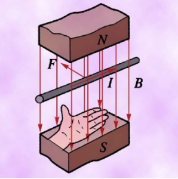

# 磁场概述

## 磁场

### 磁现象

如果将一条形磁铁投入铁屑中，再取出时可以发现，靠近两端的地方吸引的铁屑特别多，即磁性特别强，我们称之为磁极。

如果将条形磁铁或狭长磁针的中心悬挂或支撑起来，使其能在水平面内自由转动，则两磁极总是分别指向南北方向。我们称指北的一端为北极，又叫 $N$ 极；指南的一端为南极，又叫 $S$ 极。如果用另一磁铁去接近它们，则会发现同号的磁极互相排斥，异号的磁极互相吸引。

基于上述现象，16 世纪末，英王御医威廉·吉尔伯特指出，指南针之所以指向南北，是因为地球是一个巨大的磁体，它的地理上的北极和南极就是它的磁南极和磁北极。

现在我们更进一步地知道，地球的地理两极与地磁两极并不重合，因此磁针并非准确地指南或指北，其间有一个交角，这就是地磁偏角，简称磁偏角。磁偏角的数值因地区不同而异。不仅地球是一个巨大的磁体，宇宙中的许多天体都具有磁性。太阳表面的黑子、耀斑和太阳风等的出现都与太阳的磁性及其变化有关。

概括起来说，不仅磁铁—磁铁，而且电流—磁铁、磁铁—电流（运动电荷）、电流—电流之间都存在着相互作用，我们把它们统称为磁相互作用或磁力。

19 世纪杰出的法国科学家安培提出了一个假说：组成磁铁的最小单元（磁分子）就是环形电流。倘若这样一些分子环流定向地排列起来，在宏观上就会显示出 $N$、$S$ 极，这就是安培分子环流假说。

{ width="60%" }

原子是由带正电的原子核和绕核旋转的负电子组成的。电子不仅绕核旋转，而且还有自旋。原子、分子等微观粒子内电子的这些运动形成了“分子环流”，这便是物质磁性的基本来源。据此，物质是否具有磁性以及磁性的强弱，取决于其中分子环流排列的整齐程度，越混乱磁性越弱或无磁性，越整齐磁性越强。所谓磁化，就是使其中的分子环流排列整齐。与此同时，它还自然地说明了为什么磁棒与载流螺线管会具有等效性，磁铁两极总是并存，分割后依然如此。

### 磁场的描述

电荷之间的相互作用力是通过电场来传递的，即每当电荷出现时，就在它周围的空间产生一个电场，而电场的基本性质是它对于任何置于其中的其他电荷施加作用力。这就是说，电的作用是近距的。

磁极和电流之间的相互作用也是这样，不过它通过另外一种场——磁场来传递。磁极或电流在自己周围的空间里产生一个磁场，而磁场的基本性质是它对于任何置于其中的其他磁铁或电流施加作用力。由此，我们可以把前述关于磁铁—磁铁、磁铁—电流、电流—电流之间的相互作用统一起来，即所有这些相互作用都是通过同一种场——磁场来传递的。

鉴于无论是导线中的电流还是磁铁，它们的本源都是电荷的运动，所以上述各种磁现象都可归结为运动着的电荷（即电流）之间的相互作用。应该注意的是，电荷之间的磁相互作用与电相互作用是有区别的。特别是，无论电荷静止还是运动，它们之间都存在电相互作用，但是只有运动着的电荷之间才存在磁相互作用。

### 磁感应强度

实验表明，对于给定的磁场中任一个位置 $P$，当运动电荷的速度与磁场方向平行时，电荷不受力。当速度与磁场方向垂直时，电荷受力最大，且其值 $F_m$ 与其速度 $v$ 成正比，与其带电量 $q$ 成正比。综合起来，我们有：

$$
B = \frac{F_m}{qv}
$$

就是说，磁场中某点的磁感应强度的大小等于电荷以垂直于磁场方向的速度通过该点时，所受磁场力与它的电荷量和速度的乘积的比值。其方向则为小磁针 $N$ 极在该点所指的方向。我们会在洛伦兹力部分详细说明。

在国际单位制中，磁感应强度的单位是特斯拉，简称特，符号是 $T$。

$$
1\text{T} = 1\text{N}/(1\text{C}\cdot 1\text{m/s}) = 1\text{N}/(\text{A}\cdot\text{m})
$$

一般永磁铁磁极附近的磁感应强度约为 $10^{-1}\text{T} \sim 10^{-3}\text{T}$，地面附近地磁场的磁感应强度大约只有 $0.5 \times 10^{-4}\text{T}$。在技术上常用的磁感应强度的单位叫高斯，$1\text{T} = 10^4$ 高斯。

### 磁场的通量

为了形象地描绘磁场的方向和强弱，与电场线类似，可以绘制磁场线即磁感应线，简称磁感线。一方面，磁感线上每一点的切线方向都跟这点的磁感应强度 $B$ 的方向一致；另一方面，为了比较 $B$ 的大小，使单位面积的磁感线数目与 $B$ 的大小成正比，即 $B$ 较大处磁感线密集，$B$ 较小处稀疏。

为了研究问题的方便，人们还引入一个叫做磁通量的物理量。设在磁感应强度为 $B$ 的匀强磁场中或在一个非匀强磁场中可以视为匀强的小区域中，有一个与磁场方向垂直的平面，面积为 $S$，则 $B$ 和 $S$ 的乘积就叫做穿过这个面积的磁通量，简称磁通。用字母 $\Phi$ 表示，即：

$$
\Phi = BS
$$

如果磁场方向不与我们研究的平面垂直，而是有一个夹角 $\alpha$，我们可用这个面在垂直于磁场方向的投影面积 $S'$ 与 $B$ 的乘积表示磁通量，即：

$$
\Phi = BS' = BS\cos\alpha
$$

在国际单位制中，磁通量的单位是韦伯，符号是 $\text{Wb}$，$1\,\text{Wb} = 1\,\text{T}\cdot\text{m}^2$。

$$
B = \frac{\Phi}{S}
$$

这表示磁感应强度等于穿过单位面积的磁通量。因此人们也常把磁感应强度叫做磁通密度。它也就与垂直穿过 $S$ 的单位面积上的磁感线的条数成正比。

在一根很长的载流直导线附近的某点的磁感应强度 $B$ 的大小与电流 $I$ 成正比，与该点到导线的垂直距离 $r$ 成反比，即：

$$
B = k_m \frac{I}{r} = \frac{\mu_0}{2\pi}\frac{I}{r}
$$

式中 $k_m = 2 \times 10^{-7}\,\text{N/A}^2$，称为毕奥—萨伐尔定律。

载流螺线管的磁感应强度的大小决定于电流 $I$ 和螺线管的匝数 $n$。当密绕螺线管的长度比其半径大得多时，可以证明，管内匀强磁场的磁感应强度 $B$ 的大小为

$$
B = 2\pi nI
$$

磁感应强度 $B$ 的大小和方向处处相同的磁场为匀强磁场。匀强磁场里的磁感线是相互平行的直线。常见的匀强磁场有平面磁极间隙中的磁场和密绕长螺线管中的磁场。

平面磁极间隙中的磁场，它有点像平行板电容器里的电场，除了边缘附近有所发散外，中间区域里是相当均匀的。

螺线管产生的磁感线在远离端点且靠近轴线的地方是平行直线。在纵向，靠近螺线管两端的地方磁感线有所发散；在横向，靠近螺线管管壁（即导线绕组）的地方磁感线有些波纹。要使中间磁场均匀的程度增大，一是要螺线管尽量长，二是要绕组尽量细密。所以，产生均匀磁场的理想模型是无限长密绕螺线管。

### 小磁针问题

性质：小磁针 N 极指向磁感线方向。

等效磁铁：将环形电线等效为条形磁铁。

## 洛伦兹力

### 概念

磁场对运动电荷的作用力称为洛伦兹力：

$$
\bm F_m=q\bm v\times\bm B
$$

设电荷 $q$ 的速度 $v$ 与磁感应强度 $B$ 之间的夹角为 $\theta$。我们可以把 $B$ 分解为垂直于速度方向和沿速度方向的两个分量 $B_\perp$ 和 $B_{//}$。

{ width="50%" }

根据上述，方向与 $v$ 相同的分量 $B_{//}$ 对运动电荷 $q$ 不产生磁场力，电荷 $q$ 所受的磁场力只是另一分量 $B_\perp$ 所给予的。因此，运动电荷 $q$ 所受的磁场力为：

$$
F_m=qvB_{\perp}=qv_{\perp}B=qvB\sin\theta
$$

需要注意的是，$B,F,v$ 三者均属于矢量，其方向并不是简单确定的，而是通过左手定则。

## 安培力

### 概念

根据叉乘的性质，$F$ 一定是垂直于 $B,I$ 的。

数值上：

$$
F=BIL\sin\theta
$$

特殊的，当 $B,I$ 垂直：

$$
F=BIL
$$

等效长度：

- 如果几根导线并联在电压源上，如果这几根导线是直线：

    $$
    F=BIL=B\dfrac{U}{R}L=\dfrac{1}{\rho}BS
    $$

- 如果一条导线不是直线，其在磁场中受力仅和它的起点终点有关，处理 $L,I$ 只需要用起点到终点的线段即可。

根据力的作用是相互的，如果磁铁给导线一个向左的力，那么导线一定会给磁铁一个向右的力。

### 载流导线间

- 电流和电流之间的相互作用，同种方向相互吸引。

- 分别对导线画出对方对其的作用力，电流不同，作用力相同。

## 电磁三定则

### 定则概述

这些东西挺乱的，百科很多都矛盾。问题主要集中在是手掌还是手指上面，弗莱明右手定则是手指的。现在国内很多教的右手定则（开掌）是弗莱明右手定则的变形，也就是叉乘的右手定则。

| | 左手定则 | 右手定则 | 安培定则 |
| :-: | :-: | :-: | :-: |
| 用途 | 电动机 | 发电机 | 通电导线 |
| 关键词 | 受力 | 电磁感应 | 磁效应 |

区分和记忆：

- 左手判断受力，右手判断电流。
- 「中指，食指，拇指」指代「电，磁，力」。

### 安培定则

- **安培定则**（一）

    ---

    可以用来辨明一条电线四周磁场的方向。

    将右手的大拇指朝着电线的电流方向指去，再将其它四根手指握紧电线，则四根手指弯曲的方向为磁场的方向。

    { width="100%" }

- 安培定则（**右手螺旋定则**）

    ---

    螺线管载有的电流，会产生磁场。

    将右手握住螺线管，四根手指朝着电流方向指去，然后将大拇指沿着螺线管的中心轴伸直，则磁场的方向即为大拇指所指的方向。

    { width="100%" }

### 电动机定则

电动机定则，又称左手定则，是判断磁场中通电导体的安培力、带电微粒的洛伦兹力的方向的。

- **安培力的方向**

    ---

    伸出左手，使大拇指与四指垂直，让磁感线穿过掌心，四指指向电流方向，此时大拇指所指的方向即为导线所受安培力的方向。

    { width="100%" }

- **洛伦兹力的方向**

    ---

    伸出左手，使大拇指与四指垂直，让磁感线穿过掌心，四指指向正电荷运动的方向，此时大拇指所指的方向即为正电荷所受洛伦兹力的方向。

    { width="100%" }

- **弗莱明左手定则**：将左手的食指，中指和拇指伸直，使其在空间内相互垂直。食指方向代表磁场的方向，中指代表电流的方向，那拇指所指的方向就是受力的方向。使用时可以记住「中指，食指，拇指」指代「电，磁，力」。

    

### 发电机定则

- **右手定则**

    ---

    右手平展，使大拇指与其余四指垂直，且都跟手掌在一个平面内。右手放入磁场中，让磁感线从掌心进入，大拇指指向导线运动方向，则四指所指方向为导线中感应电流的方向。

    { width="100%" }

- **弗莱明右手定则**

    ---

    右手三根手指互相垂直，拇指的方向是导线移动方向，食指指的是磁场方向，中指的则为电流方向。使用时可以记住「中指，食指，拇指」指代「电，磁，力」。

    { width="100%" }

## 安培力和洛伦兹力

通电导体在磁场中受到的力叫做安培力，运动电荷在磁场中受到的力叫做洛伦兹力。

容易发现，安培力是洛伦兹力的宏观表现，洛伦兹力是安培力的微观解释。

设通电导体长为 $L$，垂直放在磁感应强度为 $B$ 的磁场中，所受到的安培力的大小：

$$
F_安=BIL
$$

其中，$B$ 的单位为 $T$（特斯拉），且 $1\mathrm T=1[\mathrm{N/(A\cdot m)}]$。

洛伦兹力和安培力的大小关系为，设 $N$ 表示导体内定向移动的总电荷数：

$$
F_安=NF_洛
$$

易推导：

$$
F_洛=qvB
$$

其中，$v$ 表示电荷定向移动的速度，$q$ 表示每个自由电荷的电荷量。

推导过程，

$$
F_洛={F_安\over N}={BIL\over N}={BnqSvL\over nSL}=qvB
$$

思想是，把自由电荷穿过导体某一横截面，转化为形成一定量的体积。

带点粒子受到洛伦兹力的影响，会在磁场中做匀速圆周运动（忽略粒子自身重力），

此时，洛伦兹力提供了向心力。

$$
\begin{aligned}
F_向&=F_洛\\[0.2em]
mv^2\over r&=qvB\\[0.7em]
mv\over r&=qB
\end{aligned}
$$

根据周期公式，

$$
\begin{aligned}
T&={2\pi r\over v}\\[0.7em]
{v\over r}&={2\pi\over T}
\end{aligned}
$$

则，

$$
{q\over m}={2\pi\over BT}\\[0.7em]
T=2\pi{m\over qB}
$$

当然也可以不带入，求出轨道半径：

$$
r={mv\over qB}
$$