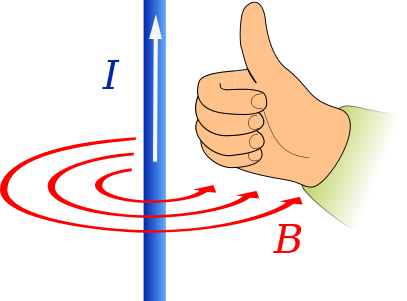
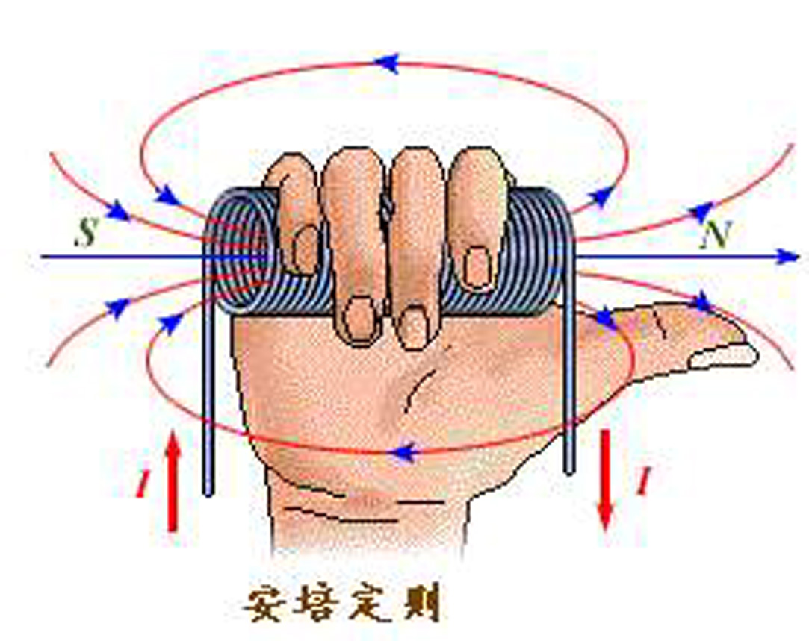
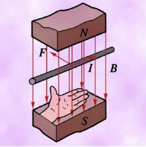
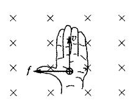
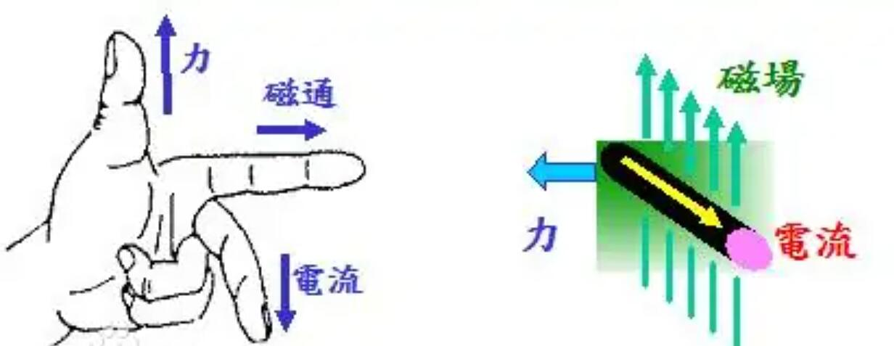
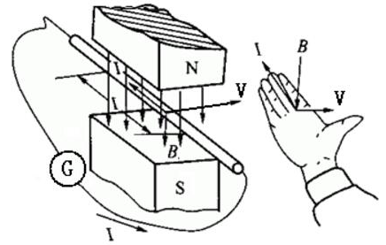
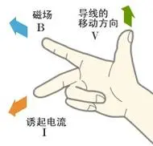

# 电磁感应

## 磁场

### 磁场的通量

为了形象地描绘磁场的方向和强弱，与电场线类似，可以绘制磁场线即磁感应线，简称磁感线。一方面，磁感线上每一点的切线方向都跟这点的磁感应强度 $B$ 的方向一致；另一方面，为了比较 $B$ 的大小，使单位面积的磁感线数目与 $B$ 的大小成正比，即 $B$ 较大处磁感线密集，$B$ 较小处稀疏。

{ width="40%" }

为了研究问题的方便，人们还引入一个叫做磁通量的物理量。设在磁感应强度为 $B$ 的匀强磁场中或在一个非匀强磁场中可以视为匀强的小区域中，有一个与磁场方向垂直的平面，面积为 $S$，则 $B$ 和 $S$ 的乘积就叫做穿过这个面积的磁通量，简称磁通。用字母 $\Phi$ 表示，即：

$$
\Phi = BS
$$

如果磁场方向不与我们研究的平面垂直，而是有一个夹角 $\alpha$，我们可用这个面在垂直于磁场方向的投影面积 $S'$ 与 $B$ 的乘积表示磁通量，即：

$$
\Phi = BS' = BS\cos\alpha
$$

在国际单位制中，磁通量的单位是韦伯，符号是 $\text{Wb}$，$1\,\text{Wb} = 1\,\text{T}\cdot\text{m}^2$。

{ width="80%" }

**特别强调**：虽然磁通量是标量但是有正负，这里符号并非矢量中的方向的意思，而代表穿入或穿出，规定一个方向为正，正负可以相互抵消。

例题：如图所示，套在条形磁铁外的三个线圈，其面积 $S_1>S_2=S_3$，设各线圈中的磁通量以此为 $\Phi_1,\Phi_2,\Phi_3$，则他们的大小关系是？

{ width="40%" }

容易知道，每个圈内，磁铁内的磁通量是相同的，因此只需要考虑磁铁外、圈内的与磁铁内的抵消。容易发现，外面的磁通量 $\Phi_1'>\Phi_2'>\Phi_3'$。因此总的磁通量 $\Phi_1<\Phi_2<\Phi_3$。

### 安培环路定律

我们把磁感强度沿着某一条线段的分量乘以这段线段的长度，叫做这条线段的磁流。如果是一个闭合的回路，那么回路上所有线段的磁流加起来，叫做这个闭合回路磁感强度的环流。

安培环路定律指出，任何一个包围长直载流导线的闭合回路，一根电流为 $I$ 的长直导线垂直于回路所在平面，则该回路的环流是 $\mu_0I$。推而广之，如果有多根电流通过闭合回路，那么考虑电流就是所有电流的代数和，环路所包围电流的正负应服从右手定则。

$$
\oint _{\mathbb {C} }\mathbf {B} \cdot \mathrm {d} {\boldsymbol {\ell }}=\mu _{0}I_{\text{enc}}
$$

我们常常联立，可以用于求 $B$。

## 电磁三定则

这些东西挺乱的，百科很多都矛盾。问题主要集中在是手掌还是手指上面，弗莱明右手定则是手指的。现在国内很多教的右手定则（开掌）是弗莱明右手定则的变形，也就是叉乘的右手定则。

| | 左手定则 | 右手定则 | 安培定则 |
| :-: | :-: | :-: | :-: |
| 用途 | 电动机 | 发电机 | 通电导线 |
| 关键词 | 受力 | 电磁感应 | 磁效应 |

区分和记忆：

- 左手判断受力，右手判断电流。
- 「中指，食指，拇指」指代「电，磁，力」。

### 安培定则

- **安培定则**（一）

    ---

    可以用来辨明一条电线四周磁场的方向。

    将右手的大拇指朝着电线的电流方向指去，再将其它四根手指握紧电线，则四根手指弯曲的方向为磁场的方向。

    { width="100%" }

- 安培定则（**右手螺旋定则**）

    ---

    螺线管载有的电流，会产生磁场。

    将右手握住螺线管，四根手指朝着电流方向指去，然后将大拇指沿着螺线管的中心轴伸直，则磁场的方向即为大拇指所指的方向。

    { width="100%" }

### 电动机定则

电动机定则，又称左手定则，是判断磁场中通电导体的安培力、带电微粒的洛伦兹力的方向的。

- **安培力的方向**

    ---

    伸出左手，使大拇指与四指垂直，让磁感线穿过掌心，四指指向电流方向，此时大拇指所指的方向即为导线所受安培力的方向。

    { width="100%" }

- **洛伦兹力的方向**

    ---

    伸出左手，使大拇指与四指垂直，让磁感线穿过掌心，四指指向正电荷运动的方向，此时大拇指所指的方向即为正电荷所受洛伦兹力的方向。

    { width="100%" }

- **右手的左手定则**

    ---

    我们知道，电流是正电荷的移动方向，那么电子的运动方向就是其反向，根据叉乘的性质，假设四指指向电子的运动方向，那么就应当使用右手来判断，但是这还是左手定则。

- **弗莱明左手定则**

    ---
    
    将左手的食指，中指和拇指伸直，使其在空间内相互垂直。食指方向代表磁场的方向，中指代表电流的方向，那拇指所指的方向就是受力的方向。使用时可以记住「中指，食指，拇指」指代「电，磁，力」。

    

### 发电机定则

当只有部分导线切割磁感线运动时，无法通过楞次定律判断电流，可根据右手定则判断感应电流的方向。若没有构成闭合回路，无感应电流，但可以判断电势高低，手指指向哪里，哪里电势高。

- **右手定则**

    ---

    右手平展，使大拇指与其余四指垂直，且都跟手掌在一个平面内。右手放入磁场中，让磁感线从掌心进入，大拇指指向导线运动方向，则四指所指方向为导线中感应电流的方向。

    { width="100%" }

- **弗莱明右手定则**

    ---

    右手三根手指互相垂直，拇指的方向是导线移动方向，食指指的是磁场方向，中指的则为电流方向。使用时可以记住「中指，食指，拇指」指代「电，磁，力」。

    { width="100%" }

## 感应电流

### 楞次定律

我们知道，通电导线在磁场中是受力的，容易猜到，导线在磁场中运动也可能产生电流。

- 感应电流产生的条件：形成闭合回路，且磁通量改变。

- 楞次定律：由于磁通量的改变而产生的感应电流，其方向为抗拒磁通量改变的方向。

感应电流的方向总是阻碍原磁通量变化，阻碍不是阻止，分析步骤：

1. 判断原磁场变化。

2. 阻碍磁场变化得出感应磁场方向。

3. 右手螺旋定则得出感应电流方向。

4. 感应电流在磁场中受到安培力作用。

注意事项：

- 减弱但不抵消，磁场变化趋势不变。

- 感应电流受到的安培力作用应当是原磁场。

- 缓慢增大磁场强度，封闭线圈在磁场中感应电流受到的安培力会使其收缩，线圈收缩导致面积减小，进而降低磁通量。

感应电流与能量：磁通量变化，一定产生感应电流，产生电流就有电能，最终转化为热能，一定有能量损失。

### 电磁感应定律

法拉第电磁感应定律简称法拉第定律，定律指出：任何封闭电路中感应电动势大小，等于穿过这一电路磁通量的变化率。

此定律预测磁场如何与电路相互作用以产生电动势，这种现象称为电磁感应。

$$
E=\dfrac{\Delta\Phi}{\Delta t}
$$

或者更详细的

$$
E=-\dfrac{\d\Phi}{\d t}
$$

电动势的方向（公式中的负号）由楞次定律提供。

对于一个匝数为 $n$ 的线圈，可以看作 $n$ 个线圈串联，因此

$$
E_{感}=n\cdot\dfrac{\Delta\Phi}{\Delta t}
$$

### 动生电动势

我们按照磁通量变化原因的不同，分为两种情况具体讨论。一种是在恒磁场中运动着的导体内产生感应电动势，另一种是导体不动，因磁场的变化产生感应电动势，前者叫做动生电动势，后者叫做感生电动势。

这种分法在一定程度上只有相对的意义，如果在线圈为静止的参考系内观察，磁棒的运动引起空间的磁场发生变化，线圈内的电动势是感生的；但如果我们在随磁棒一起运动的参考系内观察，则磁棒是静止的，空间磁场也未发生变化，而线圈在运动，因而线圈内的电动势是动生的。

{ width="40%" }

所以，由于运动是相对的，就发生了这样的情况，同一感应电动势在某一参考系内看是感生的，在另一参考系内看则是动生的。然而我们也必须看到，参考系的变换只能在一定程度上消除动生和感生的界限；在普遍情形下不可能通过参考系的变换，把感生电动势完全归结为动生电动势，反之亦然。

动生电动势只可能存在于运动的这一段导体上，而不动的那一段导体上没有电动势，它只是提供电流可运行的通路，如果仅仅有一段导线在磁场中运动，而没有回路，在这一段导线上虽然没有感应电流，但仍可能有动生电动势。至于运动导线在什么情况下才有动生电动势，这要看导线在磁场中是如何运动的。例如导线顺着磁场方向运动，根据洛伦兹力来判断，则不会有动生电动势；若导线横切磁场方向运动，则有动生电动势。因此，有时形象地说成“**导线切割磁感应线时产生动生电动势**”。

公式推导：

$$
E=\dfrac{\Delta\Phi}{\Delta t}=\dfrac{B\ell\Delta x}{\Delta t}=B\ell v
$$

其中 $B,\ell,v$ 两两垂直，$\ell$ 为有效长度，即首尾相连的直线距离、并在 $\bm v$ 方向上的投影。

通过的电荷量

$$
q=N\dfrac{\Delta\Phi}{R+r}
$$

### 感生电动势

感生电动势是由变化的磁场本身引起的，即使不存在导体回路，变化的磁场在其周围也会激发一种电场，称为感应电场或漩涡电场。与静电场不同之处，一方面在于这种漩涡电池不是由电荷激发，而是由变化的磁场所激发；另一方面在于描述漩涡电池的电场线是闭合的，从而它不是保守场。

公式推导：

$$
E=n\dfrac{\Delta\Phi}{\Delta t}=ns\dfrac{\Delta B}{\Delta t}
$$

题目一般会给出后面的分数部分。

## 电磁感应

### 旋转切割

一根长度为 $\ell$ 的导线棒在磁场强度为 $B$ 的匀强磁场中、垂直于磁感线的平面上绕着其一个端点旋转，角速度为 $\omega$，则这根导线棒的电动势为

$$
E=\dfrac{B\Delta S}{\Delta t}=\dfrac{1}{2}B\ell^2\omega
$$

### 二次感应

在一均匀磁场中，外导线圈单棒运动，产生感应电流，从而产生磁场。如果单棒变速运动，则感应磁场也是变化的，从而内导线圈产生二次感应电流。

{ width="40%" }

### 自感现象

我们在导线或导线圈中瞬间通入电流，则产生的磁场对电流本身作用，会产生一个与通入的电流相反的电流，可以认为是产生了一个反电动势或者电阻增大，表现为电流在瞬间并不是瞬间增大，而是缓慢增大。

稳定时，电感就相当于一个电阻；而当我们突然断开电源，则会在瞬间感应出与原电流相反的电流，可以认为在这个瞬间，电感相当于一个电源。

自感的强弱通常与：有无铁芯、线圈的匝数有关。

### 结合安培力

我们知道，导线在磁场中运动会产生感应电流，我们知道电流在磁场中会受到安培力，因此列出：

$$
\begin{aligned}
F_{安}=BIL\\
I=\dfrac{E}{R+r}\\
E=B\ell v
\end{aligned}
$$

得到：

$$
F_{安}=\dfrac{BL\ell v}{R+r}
$$

如果 $L=\ell$（导线垂直于速度），那么可以写 $L^2$。

容易知道，导线棒受到一个与恒力 $F$ 反向的安培力，那么她会做一个加速度减小的加速运动。

$$
\dfrac{BL^2v}{R+r}=F
$$

即最大速度为

$$
v=\dfrac{(R+r)F}{BL^2}
$$

结合电容器：电容器稳定时当做断路，但是如果电容器串联在加速运动的单棒模型上，则会因为棒的加速运动，电动势增加，从而产生电流给电容器充电，进而形成电流，产生安培力。

### 动能和动量

安培力做功：安培力做正功，电能减少；安培力做负功，电能增多。电能通常等于发热量，列动能定理或能量守恒。

安培力特征：安培力做功大多拆不开，通常带入直接计算。

通电导体棒在磁场中运动，我们取一个极小的时间 $\Delta t$，则

$$
\begin{aligned}
F_{安}\cdot\Delta t&=m\Delta v\\
BIL\cdot\Delta t&=m\Delta v\\
BLq&=m\Delta v
\end{aligned}
$$

我们用积分的思想，就可以得到通过导体棒对电荷量即为 $\dfrac{m(v_t-v_0)}{BL}$。

我们总结一下求电荷量的方式：

$$
\begin{aligned}
q&=N\dfrac{\Delta\Phi}{R+r}\\
q&=\dfrac{m(v_t-v_0)}{BL}
\end{aligned}
$$

我们假设匝数 $N=1$，然后化简上式

$$
q=\dfrac{BL\Delta x}{R+r}
$$

已知前进的位移 $\Delta x$ 就可以用这个方式。

同时我们还可以将 $q$ 联立，得到

$$
\dfrac{\Delta v}{\Delta x}=\dfrac{B^2L^2}{m(R+r)}
$$

也就是说，位移长度与速度变化量是成正比的。

总体来说，末速度是一定要求或者利用的，时间通常可以通过动量定理，或者电量来求。

### 电动机概述

对于电动机，根据能量守恒：

$$
\begin{aligned}
W_电&=Q+W_机\\
UIt&=I^2Rt+W_机
\end{aligned}
$$

因此，再根据一些推导，我们可以得到：

$$
UI>I^2R>\dfrac{U^2}{R}
$$

从基本原理出发，具体的原因需要从线圈开始说。

- 我们声称 $R$ 为电动机线圈的电阻，而 $U,I$ 是根据实际测量得到的。

- 通电线圈在磁场中受到安培力而转动。当线圈在磁场中转动时，它同时也在切割磁感线。根据法拉第电磁感应定律，切割磁感线的导体内部会产生感应电动势。根据楞次定律，这个感应电动势的方向总是要阻碍引起它的原因。在这里，引起感应电动势的原因是线圈的转动，而线圈的转动是由电源电流引起的。因此，这个感应电动势的方向与电源电压的方向相反，起到了阻碍电流的作用，所以被称为**反电动势**。

    

- 所以，电路方程是：

    $$
    U=U_反+IR
    $$

    两端同时乘以 $I$，得到：

    $$
    UI=U_反I+I^2R
    $$

    也就是说其实，

    $$
    U_反I=P_机
    $$

    这就揭示了本质：电能之所以能转化为机械能，正是通过反电动势实现的。反电动势是机械运动和电磁感应的直接结果。

- 然而当电机卡死的时候，就不存在这个反电动势了，因此电路中的电流会增加，所有的输入电能**全部转化为了热能**，导致发热增加。这也就是为什么电机卡死的时候，可能会烧坏电机。

总之，对于电机来说，无论其是否转动，欧姆定律肯定是适用的。只是当其转动时，加在线圈两端的电压要减掉其产生的反电动势而已。
