# 电磁感应

## 感应概述

### 磁场的通量

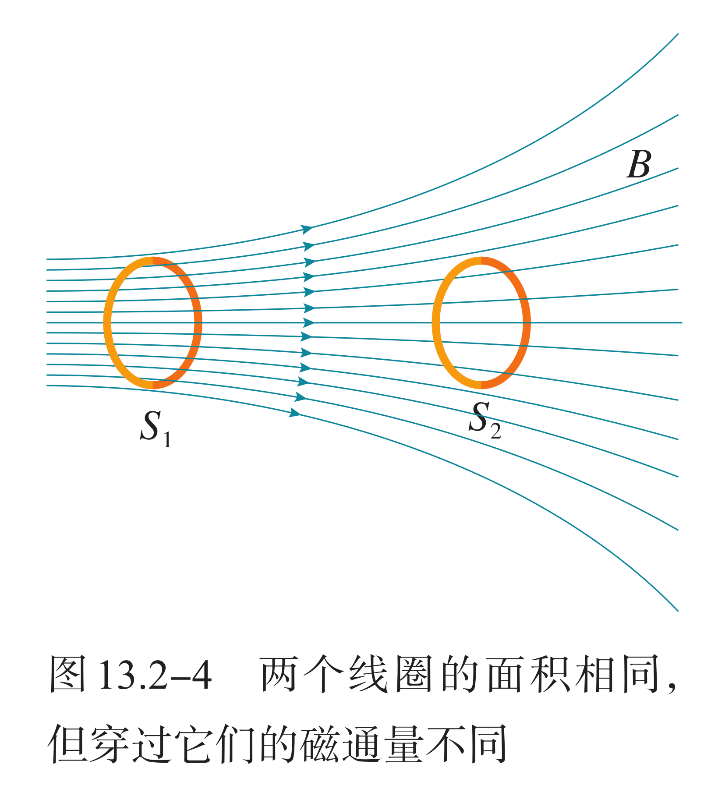{ width="40%" align=right }

为了形象地描绘磁场的方向和强弱，与电场线类似，可以绘制磁场线即磁感应线，简称磁感线。一方面，磁感线上每一点的切线方向都跟这点的磁感应强度 $B$ 的方向一致；另一方面，为了比较 $B$ 的大小，使单位面积的磁感线数目与 $B$ 的大小成正比，即 $B$ 较大处磁感线密集，$B$ 较小处稀疏。

为了研究问题的方便，人们还引入一个叫做磁通量的物理量。设在磁感应强度为 $B$ 的匀强磁场中或在一个非匀强磁场中可以视为匀强的小区域中，有一个与磁场方向垂直的平面，面积为 $S$，则 $B$ 和 $S$ 的乘积就叫做穿过这个面积的磁通量，简称磁通。用字母 $\Phi$ 表示，即：

$$
\Phi = BS
$$

如果磁场方向不与我们研究的平面垂直，而是有一个夹角 $\alpha$，我们可用这个面在垂直于磁场方向的投影面积 $S'$ 与 $B$ 的乘积表示磁通量，即：

$$
\Phi = BS' = BS\cos\alpha
$$

在国际单位制中，磁通量的单位是韦伯，符号是 $\text{Wb}$，$1\,\text{Wb} = 1\,\text{T}\cdot\text{m}^2$。

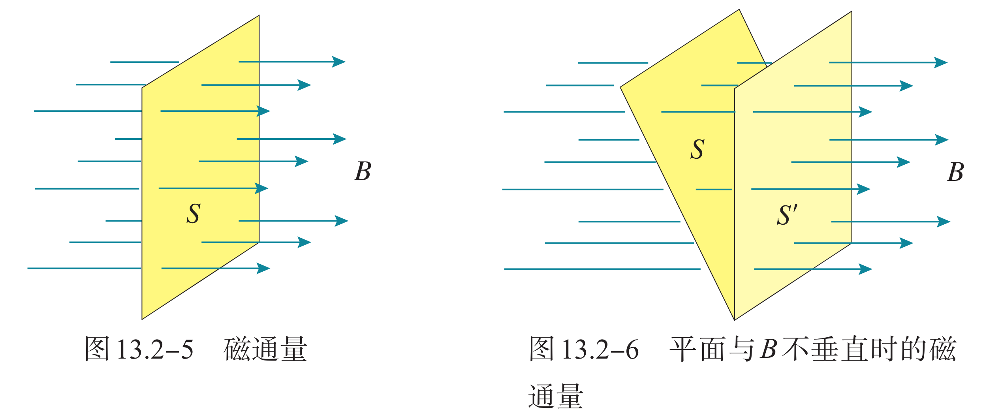{ width="80%" }

**特别强调**：虽然磁通量是标量但是有正负，这里符号并非矢量中的方向的意思，而代表穿入或穿出，规定一个方向为正，正负可以相互抵消。如图所示，套在条形磁铁外的三个线圈，其面积 $S_1>S_2=S_3$，设各线圈中的磁通量**记为** $\Phi_1,\Phi_2,\Phi_3$，则它们的大小关系是？

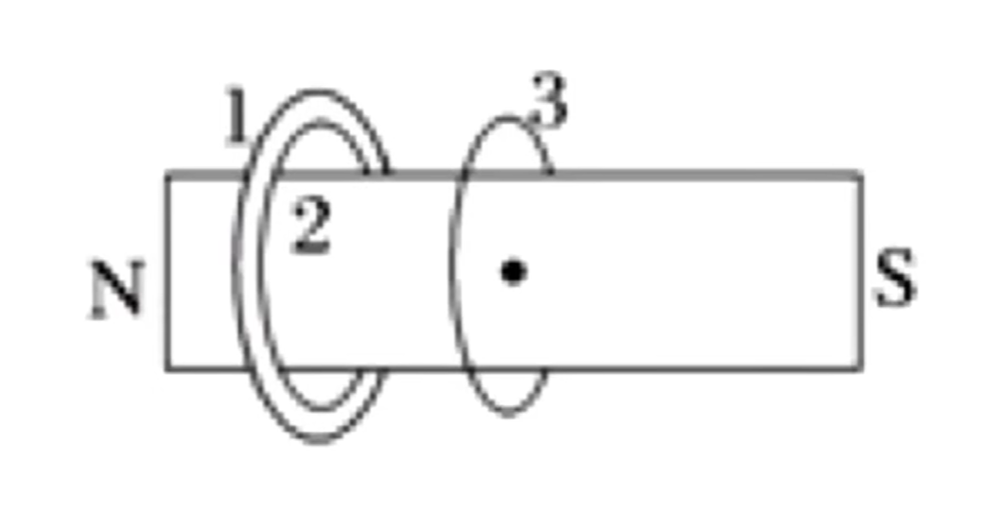{ width="40%" }

容易知道，每个圈内，磁铁内的磁通量是相同的，因此只需要考虑磁铁外、圈内的与磁铁内的抵消。容易发现，外面的磁通量 $\Phi_1'>\Phi_2'>\Phi_3'$。因此总的磁通量 $\Phi_1<\Phi_2<\Phi_3$。

### 安培环路定律

我们把磁感强度沿着某一条线段的分量乘以这段线段的长度，叫做这条线段的**磁通**。如果是一个闭合的回路，那么回路上所有线段的磁通加起来，叫做这个闭合回路磁感强度的环流。

安培环路定律指出，**任何一个包围长直载流导线的闭合回路，若有一根电流为 $I$ 的长直导线垂直于回路所在平面，则该回路的环流是 $\mu_0 I$**。推而广之，如果有多根电流通过闭合回路，那么考虑电流就是所有电流的代数和，环路所包围电流的正负应服从右手定则。

$$
\oint_C \mathbf{B} \cdot \mathrm{d}\boldsymbol{\ell} = \mu_0 I_{\text{enc}}
$$

我们常常**联立方程**，可以用于求 $B$。

### 楞次定律

法拉第最初发现电磁感应现象的实验如图所示。软铁环上绕有两个线圈，当线圈电路中的开关断开的瞬间，另一个线圈中会激发出感应电流。

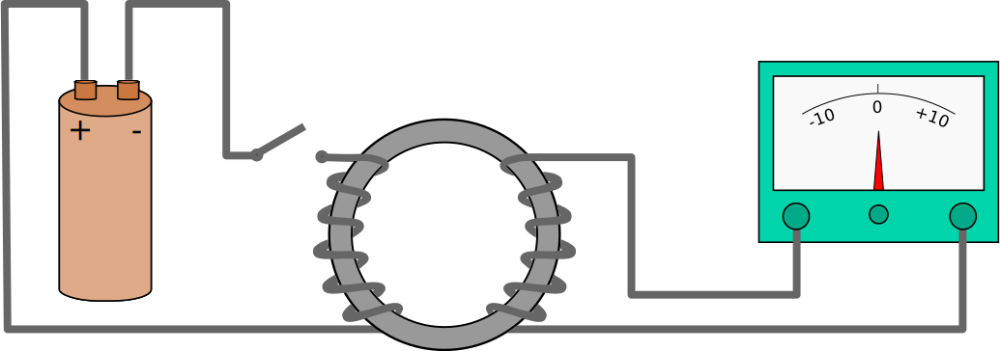{ width="80%" }

我们知道，通电导线在磁场中是受力的，容易猜到，导线在磁场中运动也可能产生电流。

- 感应电流产生的条件：形成闭合回路，且磁通量改变。

- 楞次定律：由于磁通量的改变而产生的感应电流，其方向为抗拒磁通量改变的方向。

- 宏观上：增反减同、增缩减扩、来拒去留。

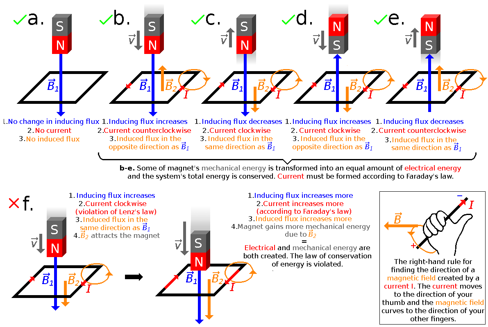{ width="100%" }

感应电流的方向总是阻碍原磁通量变化，阻碍不是阻止。我们会在下面电磁感应定律中解释，电流的大小和匝数成正比，因此实验中经常会用线圈来代替导线圈：

1. 判断原磁场变化。

2. 阻碍磁场变化得出感应磁场方向。

3. 右手螺旋定则得出感应电流方向。

4. 感应电流在磁场中受到安培力作用。

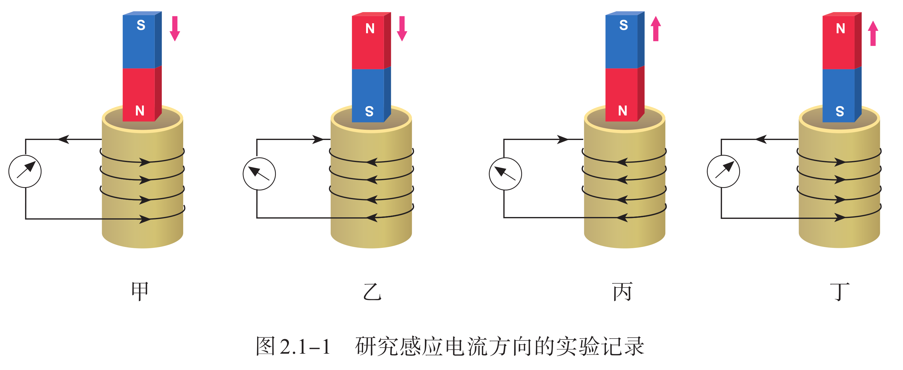{ width="100%" }

注意事项：

- 减弱但不抵消，磁场变化趋势不变。

- 感应电流受到的安培力作用应当是原磁场。

- 缓慢增大磁场强度，封闭线圈在磁场中感应电流受到的安培力会使其收缩，线圈收缩导致面积减小，进而降低磁通量。

感应电流与能量：磁通量变化，一定产生感应电流，产生电流就有电能，最终转化为热能，一定有能量损失。这经常配合能量守恒和下面关于安培力做功来解题，我们后续再说。

### 电磁感应定律

德国物理学家诺伊曼、韦伯在对理论和实验资料进行严格分析后，分别先后指出电磁感应定律。因法拉第对电磁感应现象研究的巨大贡献，后人称之为法拉第电磁感应定律，简称法拉第定律，其指出：

$$
E=\dfrac{\Delta\Phi}{\Delta t}
$$

> 任何封闭电路中感应电动势大小，等于穿过这一电路磁通量的变化率。

此定律预测磁场如何与电路相互作用以产生电动势，这种现象称为电磁感应，其方向可以由楞次定律判断。在试题中，通过这个方法算出来的电动势通常只是关于时间的平均值；如果能证明电动势是定值，那么才可以得出其为电动势的准确值；如果取极限 $\Delta t\to0$ 则也可以说是某一时刻的瞬时电动势，我们展开 $\Delta\Phi=\Delta(BS)=B\Delta S+S\Delta B+\Delta B\Delta S$ 也可以理解这个说法。

重点辨析：电磁感应定律给出的是电动势，而不是“电势差”，实际我们用电动势除以总电阻得到电流，而电流与电阻乘积才能得到电势差，这与电池内阻类似。如果我们将导体棒看作电源，那么电磁感应定律得出的结果就是电动势，电源内阻就是导体棒的阻值。

对于一个匝数为 $n$ 的线圈，可以看作 $n$ 个线圈串联，因此：

$$
E_{感}=n\cdot\dfrac{\Delta\Phi}{\Delta t}
$$

特殊的，如果给出一个线圈，问磁通量变化，我们是不需要乘 $n$ 的，因为 $n$ 在这个公式里面是在 $\Delta\Phi$ 外面的，也就是说我们默认问线圈的磁通量变化，是考虑线圈“看起来”的面积。

在后面导体棒切割磁感线的部分，也可以通过电磁感应定律来进行分析，我们常用的一个方法是，取一个极短的时间，用导体棒划过的面积来来算磁通量，进而可以求出这个极短时间内导体棒的电动势。

### 动生电动势

我们按照磁通量变化原因的不同，分为两种情况具体讨论。一种是在恒磁场中运动着的导体内产生感应电动势，另一种是导体不动，因磁场的变化产生感应电动势，前者叫做动生电动势，后者叫做感生电动势。

这种分法在一定程度上只有相对的意义，如果在线圈为静止的参考系内观察，磁棒的运动引起空间的磁场发生变化，线圈内的电动势是感生的；但如果我们在随磁棒一起运动的参考系内观察，则磁棒是静止的，空间磁场也未发生变化，而线圈在运动，因而线圈内的电动势是动生的。

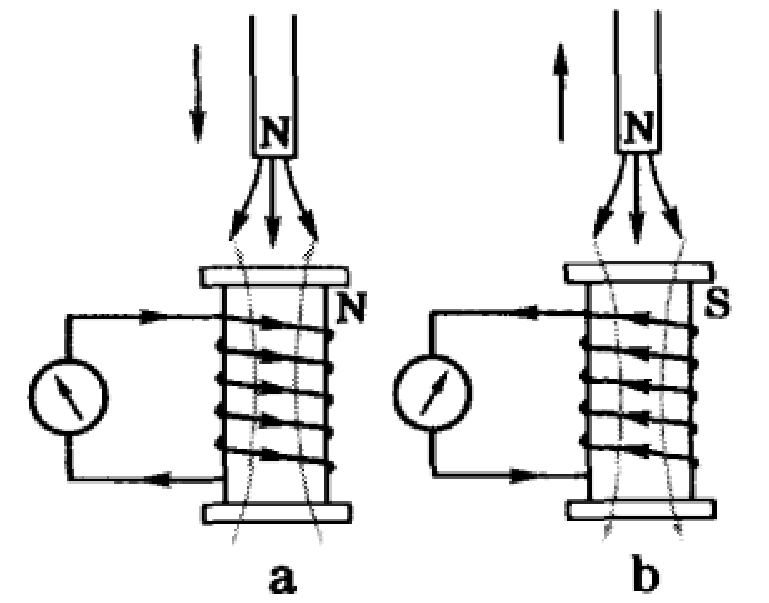{ width="40%" }

所以，由于运动是相对的，就发生了这样的情况，同一感应电动势在某一参考系内看是感生的，在另一参考系内看则是动生的。然而我们也必须看到，参考系的变换只能在一定程度上消除动生和感生的界限；在普遍情形下不可能通过参考系的变换，把感生电动势完全归结为动生电动势，反之亦然。

动生电动势只可能存在于运动的这一段导体上，而不动的那一段导体上没有电动势，它只是提供电流可运行的通路，如果仅仅有一段导线在磁场中运动，而没有回路，在这一段导线上虽然没有感应电流，但仍可能有动生电动势。至于运动导线在什么情况下才有动生电动势，这要看导线在磁场中是如何运动的。例如导线顺着磁场方向运动，根据洛伦兹力来判断，则不会有动生电动势；若导线横切磁场方向运动，则有动生电动势。因此，有时形象地说成“**导线切割磁感应线时产生动生电动势**”。

公式推导：

$$
E=\dfrac{\Delta\Phi}{\Delta t}=\dfrac{B\ell\Delta x}{\Delta t}=B\ell v
$$

其中 $B,\ell,v$ 两两垂直，$\ell$ 为有效长度，即首尾相连的直线距离、并在 $\bm v$ 方向上的投影。

通过的电荷量

$$
q=N\dfrac{\Delta\Phi}{R+r}
$$

### 感生电动势

感生电动势是由变化的磁场本身引起的，即使不存在导体回路，变化的磁场在其周围也会激发一种电场，称为感应电场或漩涡电场。与静电场不同之处，一方面在于这种漩涡电场不是由电荷激发，而是由变化的磁场所激发；另一方面在于描述漩涡电场的电场线是闭合的，从而它不是保守场。

如果面积不变（$\Delta S=0$）则推导公式：

$$
E=n\dfrac{\Delta\Phi}{\Delta t}=nS\dfrac{\Delta B}{\Delta t}
$$

麦克斯韦认为，磁场变化时会在空间激发一种电场。这种电场与静电场不同，它不是由电荷产生的，我们把它叫作感生电场。如果此刻空间存在闭合导体，导体中的自由电荷就会在感生电场的作用下做定向运动，产生感应电流，也就是说导体中产生了感应电动势。

涡流：当某线圈中的电流随时间变化时，由于电磁感应，附近的另一个线圈中可能会产生感应电流。实际上，这个线圈附近的任何导体，如果穿过它的磁通量发生变化，导体内都会产生感应电流。如果用图表示这样的感应电流，看起来就像水中的漩涡，所以把它叫作涡电流，简称涡流。

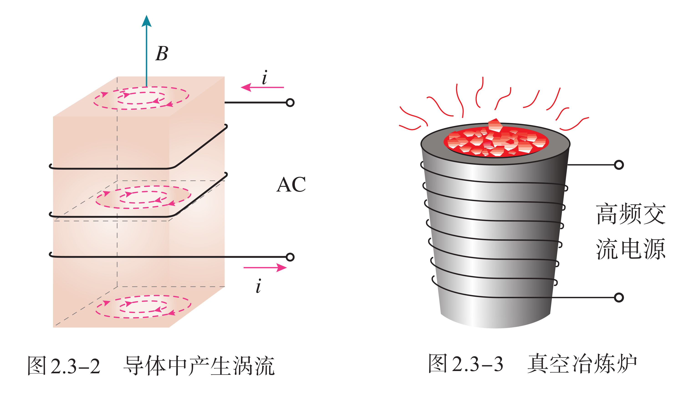{ width="70%" }

金属块中的涡流会产生热量。用来冶炼合金钢的真空冶炼炉，炉外有线圈，线圈中通入迅速变化的电流，炉内的金属中产生涡流。涡流产生的热量使金属熔化。利用涡流冶炼金属的优点是，整个过程可以在真空中进行，能防止空气中的杂质进入金属，可以冶炼高质量的合金。同理，电磁炉的加热原理是，迅速变化的电流通过电磁炉面板下方的线圈时，线圈周围产生迅速变化的磁场，变化的磁场使面板上方的铁锅底部产生涡流，铁锅迅速发热，从而达到加热食物的目的。

电动机、变压器的线圈都绕在铁芯上。线圈中流过变化的电流，在铁芯中产生的涡流使铁芯发热，浪费了能量，还可能损坏电器。因此，我们要想办法减小涡流。途径之一是增大铁芯材料的电阻率，常用的铁芯材料是硅钢，它的电阻率比较大。另一个途径就是用互相绝缘的硅钢片叠成的铁芯来代替整块硅钢铁芯。

一种探测地雷的探雷器是利用涡流工作的。士兵手持一个长柄线圈在地面扫过，线圈中有变化着的电流。如果地下埋着金属物品，金属中会感应出涡流，涡流的磁场反过来影响线圈中的电流，使仪器报警。这种探雷器可以用来探测金属壳的地雷或有较大金属零件的地雷。机场、车站和重要活动场所的安检门可以探测人身携带的金属物品，道理是一样的。

电磁阻尼：当导体在磁场中运动时，感应电流会使导体受到安培力，安培力总是阻碍导体的运动，这种现象称为电磁阻尼。

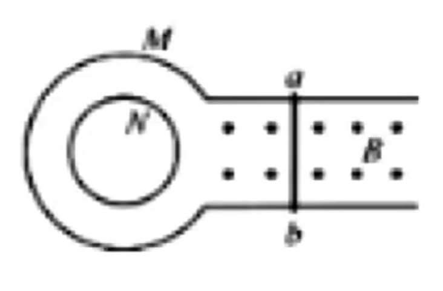{ width="30%" }

二次感应：指的是在题目中反复变换电流与电磁感应的一种题型，主要思想是：恒定电流产生恒定磁场；均匀改变的电流，产生均匀改变的磁场，进而产生恒定感应电流；而不均匀改变的电流，产生不均匀改变的磁场，进而产生不恒定的感应电流。

互感：在法拉第最初发现电磁感应现象的实验中，两个线圈之间并没有导线相连，但当一个线圈中的电流变化时，它所产生的变化的磁场会在另一个线圈中产生感应电动势。这种现象叫作互感，这种感应电动势叫作互感电动势。

利用互感现象可以把能量由一个线圈传递到另一个线圈，在如图一均匀磁场中，外导线圈单棒运动，产生感应电流，从而产生磁场。如果单棒变速运动，则感应磁场也是变化的，从而内导线圈产生二次感应电流。

互感现象是一种常见的电磁感应现象，它不仅可以发生于绕在同一铁芯上的两个线圈之间，而且可以发生于任何两个相互靠近的电路之间。在电力工程和电子电路中，互感现象有时会影响电路的正常工作，这时要设法减小电路间的互感。

### 自感电动势

自感：当一个线圈中的电流变化时，它所产生的变化的磁场在线圈本身激发出感应电动势。变压器、电动机等设备中有匝数很多的线圈，当电路中的开关断开时会产生很大的自感电动势，使得开关中的金属片之间产生电火花，烧蚀接触点，甚至会引起人身伤害。因此，切断这类电路时，必须采用特制的安全开关，避免出现电火花。

我们在导线或导线圈中瞬间通入电流，则产生的磁场对电流本身作用，会产生一个与通入的电流相反的电流，可以认为是产生了一个反电动势或者电阻增大，表现为电流在瞬间并不是瞬间增大，而是缓慢增大。

- 通电自感：通电时自感线圈相当于一个变化的电阻，阻值由无穷大逐渐减小到线圈阻值。

- 断电自感：断电时自感线圈相当于一个变化的电源，电动势从某值逐渐减小到零。

- 电流稳定时，自感线圈就相当于一个电阻，有的时候题目会指出忽略其电阻对支路总电阻的贡献。

自感电动势也是感应电动势，同样遵从法拉第电磁感应定律，实验表明，磁场的强弱正比于电流的强弱，也就是说，磁通量的变化正比于电流的变化。因此，自感电动势正比于电流的变化率，即

$$
E=L\dfrac{\Delta I}{\Delta t}
$$

式中 $L$ 是比例系数，叫作**自感系数**，简称自感或电感，单位是亨利，简称亨，符号是 $\pu{H}。不同的线圈，电感大小一般不同。它与线圈的大小、形状、匝数，以及**是否有铁芯**等因素有关。

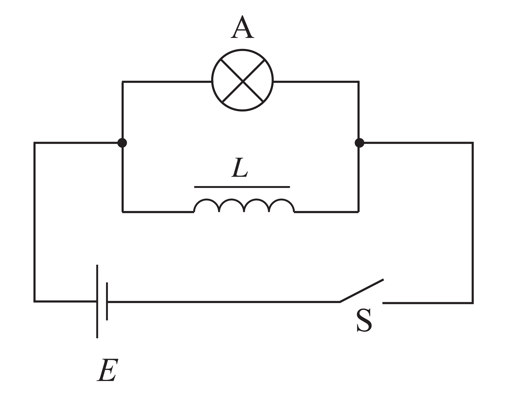{ width="40%" }

开关断开后，灯泡的发光还能维持一小段时间，有时甚至会比开关断开之前更亮。有时自感电动势会大于原来电路中的电源电动势。

- 若开始时 $I_L>I_A$，即当线圈的直流电阻 $R_L<R_A$ 时，会出现灯 $A$ 会闪亮一下的现象。

- 若开始时 $I_L\le I_A$，即当线圈的直流电阻 $R_L\ge R_A$ 时，不会出现灯 $A$ 会闪亮一下的现象。

开关断开以后，线圈中的电流并未立即消失，线圈中有电流，有电流就有磁场，能量储存在磁场中。当开关闭合时，线圈中的电流从无到有，其中的磁场也是从无到有，这可以看作电源把能量输送给磁场，储存在磁场中。当线圈刚刚接通电源的时候，自感电动势阻碍线圈中电流的增加；当电源断开的时候，自感电动势又阻碍线圈中电流的减小。线圈的自感系数越大，这个现象越明显，线圈能够体现电的“惯性”。

## 感应方法

### 含容模型

含电容类的模型，可以简单的分为放电和充电，放电的电容器就相当于一个电压不断减小的电源，而充电的电容器则相对复杂一点。

对于一个时刻，电路中实际的电流可以表示为：

$$
I=\dfrac{\Delta Q}{\Delta t}=C\dfrac{\Delta U}{\Delta t}=C\dfrac{BL\Delta v}{\Delta t}=CBLa
$$

如果此时有外力参与，例如重力牵引，列出牛二关系式：

$$
ma=mg-BIL=mg-CB^2L^2a
$$

也就是说：

$$
a=\dfrac{mg}{m+CB^2L^2}
$$

是一个定值，即一个匀加速直线运动。

### 力学方法

我们知道，导线在磁场中运动会产生感应电流，我们知道电流在磁场中会受到安培力，因此列出：

$$
\begin{aligned}
F_{安}=BIL\\
I=\dfrac{E}{R+r}\\
E=B\ell v
\end{aligned}
$$

得到：

$$
F_{安}=\dfrac{BL\ell v}{R+r}
$$

如果 $L=\ell$（导线垂直于速度），那么可以写 $L^2$。

容易知道，导线棒受到一个与恒力 $F$ 反向的安培力，那么她会做一个加速度减小的加速运动。

$$
\dfrac{BL^2v}{R+r}=F
$$

即最大速度为

$$
v=\dfrac{(R+r)F}{BL^2}
$$

结合电容器：电容器稳定时当做断路，但是如果电容器串联在加速运动的单棒模型上，则会因为棒的加速运动，电动势增加，从而产生电流给电容器充电，进而形成电流，产生安培力。

### 能量方法

安培力做功：安培力做正功，电能减少；安培力做负功，电能增多。电能通常等于发热量，列动能定理或能量守恒。

我们知道载流导线中有很多自由电子，因此当我们对导线做功使其切割磁感线的时候，洛伦兹力在导线方向做正功，形成动生电动势；洛伦兹力在导线运动方向做负功，与外力做功抵消。故总体来说，洛伦兹力并不做功，外力做功被通过若干自由电子洛伦兹力的合力，即安培力的形式转化为电能。

### 动量方法

安培力特征：安培力做功大多拆不开，通常带入直接计算。

通电导体棒在磁场中运动，我们取一个极小的时间 $\Delta t$，则

$$
\begin{aligned}
F_{安}\cdot\Delta t&=m\Delta v\\
BIL\cdot\Delta t&=m\Delta v\\
BLq&=m\Delta v
\end{aligned}
$$

我们用积分的思想，就可以得到通过导体棒对电荷量即为 $\dfrac{m(v_t-v_0)}{BL}$。

我们总结一下求电荷量的方式：

$$
\begin{aligned}
q&=N\dfrac{\Delta\Phi}{R+r}\\
q&=\dfrac{m(v_t-v_0)}{BL}
\end{aligned}
$$

我们假设匝数 $N=1$，然后化简上式

$$
q=\dfrac{BL\Delta x}{R+r}
$$

已知前进的位移 $\Delta x$ 就可以用这个方式。

同时我们还可以将 $q$ 联立，得到

$$
\dfrac{\Delta v}{\Delta x}=\dfrac{B^2L^2}{m(R+r)}
$$

也就是说，位移长度与速度变化量是成正比的。

总体来说，末速度是一定要求或者利用的，时间通常可以通过动量定理，或者电量来求。

我们在动量里面一个经典的结论是，如果题目问时间，首先考虑动量定理，因为：

$$
F_{其他}t+Blq=mv_t-mv_0
$$

在有其他力的参与下，除了运动学解运动方程，就是这种方法。我们结合前面的推导，其实也可以理解为电荷量和电流可以表示时间，而这通常是和动量定理结合的。

类似的，我们求位移既可以用动能定理，还可以通过电荷量来推导。

## 感应题型

### 旋转切割

一根长度为 $\ell$ 的导线棒在磁场强度为 $B$ 的匀强磁场中、垂直于磁感线的平面上绕着其一个端点旋转，角速度为 $\omega$，则这根导线棒的电动势为

$$
E=\dfrac{1}{2}B\ell^2\omega
$$

证明：取一时间 $\Delta t$，则导线棒转过的扇形面积：

$$
\Delta S=\dfrac{1}{2}\ell\cdot\ell\omega\Delta t=\dfrac{1}{2}\ell^2\omega\Delta t
$$

于是，就有电动势公式：

$$
E=\dfrac{\Delta\Phi}{\Delta t}=\dfrac{B\Delta S}{\Delta t}=\dfrac{1}{2}B\ell^2\omega
$$

有一些定性判断的题目中，经常给出一个圆形金属薄片，这就可以视为若干导线棒（看成电源）并联。但是如果仅仅是圆盘在均匀的磁场中旋转，一般不会有电流，如果给圆盘中心与外周接入负载，或者磁场是不均匀的，就有电流。我们同样也可以换参考系，假设磁场在旋转，那么就会产生涡流电场。

### 双杆模型

两个导线棒放在导轨上，导轨可能光滑也可能粗糙，也可能有外力，不计重力和两根导线棒之间的电磁力。

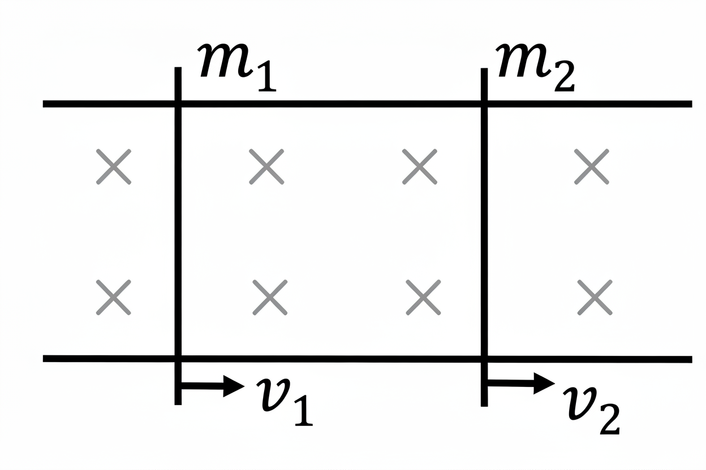{ width="40%" }

一个结论：当达到最终的稳定（速度恒定或加速度恒定）时，回路中电流恒定。如果有外力，则回路中电流不为零，如果无外力则为零。

### 电动机概述

对于电动机，根据能量守恒：

$$
\begin{aligned}
W_电&=Q+W_机\\
UIt&=I^2Rt+W_机
\end{aligned}
$$

因此，再根据一些推导，我们可以得到：

$$
UI>I^2R>\dfrac{U^2}{R}
$$

从基本原理出发，具体的原因需要从线圈开始说。

- 我们声称 $R$ 为电动机线圈的电阻，而 $U,I$ 是根据实际测量得到的。

- 通电线圈在磁场中受到安培力而转动。当线圈在磁场中转动时，它同时也在切割磁感线。根据法拉第电磁感应定律，切割磁感线的导体内部会产生感应电动势。根据楞次定律，这个感应电动势的方向总是要阻碍引起它的原因。在这里，引起感应电动势的原因是线圈的转动，而线圈的转动是由电源电流引起的。因此，这个感应电动势的方向与电源电压的方向相反，起到了阻碍电流的作用，所以被称为**反电动势**。

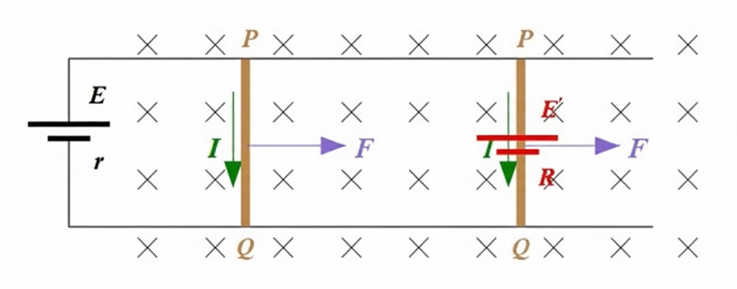{ width="80%" }

所以，电路方程是：

$$
U=U_反+IR
$$

两端同时乘以 $I$，得到：

$$
UI=U_反I+I^2R
$$

也就是说其实，

$$
U_反I=P_机
$$

这就揭示了本质：电能之所以能转化为机械能，正是通过反电动势实现的。反电动势是机械运动和电磁感应的直接结果。

然而当电机卡死的时候，就不存在这个反电动势了，因此电路中的电流会增加，所有的输入电能**全部转化为了热能**，导致发热增加。这也就是为什么电机卡死的时候，可能会烧坏电机。

| **动力源**             | **核心调速方式**                                     | **负载增加时的增扭机制**                                     | **核心特点**                                     |
| :--------------------: | ---------------------------------------------------- | ------------------------------------------------------------ | ------------------------------------------------ |
| **四冲程燃油机**       | **调节节气门开度**（改变混合气量）                      | **主动增加油门**（增加混合气量）+ **变速箱降档**（放大扭矩）    | **主动控制**，依赖燃烧能量和机械传动，响应相对较慢。 |
| **直流电机**           | **调节电枢电压**（通常用 PWM）                         | **转速微降→反电动势减小→电流自动增大**                     | **自动响应**，扭矩与电流直接相关，响应快，低速扭矩好。   |
| **交流异步电机**       | **改变电源频率**（使用变频器）                        | **转速下降→转差率增大→转子感应电流增大**                 | **自动响应**，结构坚固，应用广泛，通过转差实现自适应。   |
| **交流同步电机**       | **改变电源频率**（使用变频器）                        | **功角自动增大**（转子磁极在空间上滞后于定子磁场）              | **自动响应**，转速恒定精确，效率高，存在失步风险。   |

总之，对于电动机来说，无论其是否转动，欧姆定律肯定是适用的。只是当其转动时，加在线圈两端的电压要减掉其产生的反电动势而已。