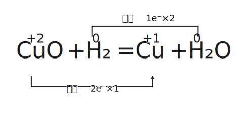

# 氧化还原反应

## 氧化还原反应

### 氧化还原的定义

- 定义：有化合价变化的反应。
- 本质：电子的转移（得失或偏移）。

其中，化合价有：

| 元素 | 化合价规律 |
| :-: | :-: |
| $\ce{H}$ | 一般显 $+1$ 价 在金属氢化物中显 $-1$ 价 |
| $\ce{O}$ | 一般显 $-2$ 价 在过氧化物中显 $-1$ 价 |
| $\ce{F}$ | 只显 $-1$ 价（没有正价） |

特殊物质化合价

| 物质 | 物质 | 物质 | 物质 |
| :-: | :-: | :-: | :-: |
| $\ce{K2\val{Fe}{+4}O4}$ 高铁酸钾 | $\ce{K2\val{Cr}{+6}_2O7}$ 重铬酸钾 | $\ce{K\val{Mn}{+7}O4}$ 高锰酸钾 | $\ce{\val{O}{+2}\val{F}{-1}_2}$ 二氟化氧 |
| $\ce{\val{B}{+3}_2H6}$ | $\ce{\val{Si}{+4}H4}$ | $\ce{\val{C}{+4}H4}$ | $\ce{\val{S}{+6}_2O8^2-}$ |

### 氧化还原的特征与规律

氧化还原反应反应的特征：

- 氧化反应和还原反应是在一个反应中同时发生的。

- 氧化反应反应伴随着化合价的升降，且升降总数相等。

反应物和生成物：

- 氧化剂得电子，化合价降低，以自己的氧化能力将还原剂氧化，自身发生还原反应，被还原后生成还原产物。

- 还原剂失电子，化合价升高，以自己的还原能力将氧化剂还原，自身发生氧化反应，被氧化后生成氧化产物。

简记为：升失氧化还原剂，降得还原氧化剂。

- 歧化反应：一样的反应物或元素，其一化合价上升，另一下化合价降；常发生在碱性环境中。

- 归中反应：两个或多个含有某元素而化合价不同的反应物，得到化合价相同的单一产物；常发生在酸性环境中。

对于反应的判断，有性质：

- 所有置换反应都是氧化还原反应。

- 有单质参与的化合或分解反应都是氧化还原反应。

总结规律如下：

- 电子守恒：价态有升有降，且升降总数相等。

- 能不变就不变：

    - 相近转化、能不相交就不相交。

    - 同时一个元素化合价不变的原子不参与氧化还原反应。

    - 相邻价态不反应。

- 强者先行：假设法，例如 $\ce{Cl2}$ 先氧化 $\ce{FeI2}$ 中的碘离子。

### 常见的氧化剂和还原剂

| 氧化剂 | 还原产物 | | 氧化剂 | 还原产物 |
| :-: | :-: | :-: | :-: | :-: |
| $\ce{HClO,Cl2,KClO3}$ | $\ce{Cl-}$ | | $\ce{KMnO4,MnO2(H+)}$ | $\ce{Mn^2+}$ |
| $\ce{O2,H2O2}$ | $\ce{H2O}$ | | $\ce{H2SO4(浓)}$ | $\ce{SO2}$ |
| $\ce{HNO3(浓)}$ | $\ce{NO2}$ | | $\ce{HNO3(稀)}$ | $\ce{NO}$ |
| $\ce{Br2}$ | $\ce{Br-}$ | | $\ce{I2}$ | $\ce{I-}$ |
| $\ce{Fe^3+}$ | $\ce{Fe^2+}$ | | $\ce{Ag+}$ | $\ce{Ag}$ |

| 还原剂 | 氧化产物 | | 还原剂 | 氧化产物 |
| :-: | :-: | :-: | :-: | :-: |
| $\ce{S2-,H2S}$ | $\ce{S}$ | | $\ce{SO2,SO3^2-}$ | $\ce{SO4^2-}$ |
| $\ce{NH3}$ | $\ce{N2,NO}$ | | $\ce{H2O2}$ | $\ce{O2}$ |
| $\ce{CO,C}$ | $\ce{CO2}$ | | $\ce{I-}$ | $\ce{I2}$ |

### 氧化性和还原性的比较

1. 同种元素：

    - 最高价态只降不升，最低价态只升不降。

    - 一般价态越高氧化性越强，价态越低氧化性越弱。

2. 互补性：单质氧化性越强，其对应的离子还原性越弱。

    - （金属）活动性顺序：

        氧化性：$\ce{Ag+ > Fe^3+ > Cu^2+ > H+ > \dots > Fe^2+ > \dots}$

        还原性：$\ce{Au < Ag < Cu < (H) < \dots < Fe < \dots}$

    - （非金属）活动性顺序：

        氧化性：$\ce{F2 > Cl2 > Br2 > I2 > S}$。

        还原性：$\ce{F- < Cl- < Br- < I- < S^2-}$。

3. 根据反应条件与反应现象：

    - 与同一类反应物反应，条件越低越强。

    - 与同一类反应物反应，反应越剧烈越强。

4. 不是很不准确的（存疑）：

    - 通常价位变化越大越强（反例：硝酸）。

    - 通常浓度越大越强，酸性越强氧化性越强（对于 $\ce{ClO-,MnO4-,NO3-}$ 等含氧酸）。

5. 根据反应方程式判断：

    - 两强制两弱：氧化剂氧化性大于氧化产物，还原剂还原性大于还原产物。

    - 不能说氧化剂氧化性大于还原剂，只能说某一条件下某物质表现了氧化性或还原性。

6. 有还原性不一定表现还原性，有强氧化性也不一定表现氧化性。

常见物质氧化性、还原性顺序表：

- 氧化性：$\ce{MnO4- > Cl2 > Br2 > Fe^3+ > I2 > SO2 > S}$。

- 还原性：$\ce{Mn^2+ < Cl- < Br- < Fe^2+ < I- < SO3^2- < S2-}$。

- 上表使用方法，找到左上、右下两组为反应物，找到对应左下、右上为产物。

### 单双线桥和方程式配平

用箭头表示电子的转移，依据是得电子数等于失电子数。

1. 标化合价升降。
2. 根据化合价升降守恒配平变价元素。
3. 根据原子守恒、电荷守恒配平其他元素和物质。

{ width="70%" }
/// caption
双线桥
///

{ width="70%" }
/// caption
单线桥
///

转移电子数为一条线上的，只考虑得到的电子数或者失去的电子数。
