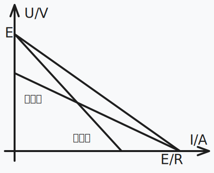

# 恒定电流与电学实验

## 电路概述

### 电流定义

电流：

- 电流：电荷的定向移动。

- 电流方向于正电荷运动方向相同，与负电荷（电子）运动方向相反。

电流的分类：

- 恒定电流：大小和方向都不变的电流。

- 直流电：方向不变的电流。

- 交流电：方向改变的电流。

物理学定义：

- 定义：单位时间内通过导体横截面的电荷量。

- 定义式：$I=\dfrac{Q}{t}$。

额外的，有微观表达式：$I=neSv$。

- 其中 $n$ 表示通过导体横截面的电子数。

- 其中 $e$ 表示电子的电荷量。

- 其中 $S$ 表示导体的横截面积大小。

- 其中 $v$ 表示导体中自由电子的运动速率。

三种速度数量级：

- 电子定向移动速率：$\pu{10^-5m/s}$。

- 电子热运动速率：$\pu{10^5m/s}$。

- 电子的传导速率：$\pu{10^8m/s}$，即电场的形成速率。

电子运动速度这么低，为什么平常开灯的时候，按下开关的一瞬间灯就亮了呢？按下开关的一瞬间，导线内部的电场线光速建立好，使导线内部所有电子瞬间开始移动。注意这个过程是导线内所有电子同步开始移动的，虽然导线内开关处的电子移动到导线内灯泡处需要很长时间，但导线内灯泡处已经有电子了，这里的电子瞬间移动，就可以做功使灯泡发光。

电流既不依赖电路，也不依赖电源，任何电荷定向移动的情形都可以称作电流。如氢原子电子绕核运动可以等效为环形电流；原电池电解质溶液内离子的定向移动可以等效为电流；令一个摩擦后带上负电的橡胶棒向右运动，也可以等效为一个向左的电流。

一个 $\ce{H}$ 原子的电子绕核运动可等效为一环形电流。已知电子电量大小 $e$，周期 $T$，绕质子顺时针运动。求电流的方向和电流强度 $I$ 的大小。

我们知道，「电流的电流强度的大小是多少」这种问题，应该在电流是恒定电流的时候才有意义。然而这类环形电流模型有点不符合常规的恒定电流：它并不是相当于导线内部处处有电子，而只是一个孤立电子在运动。这会导致一个问题：考虑钦定 $\dfrac T 2$ 这个时间，那么一半的横截面被电子经过，另一半却没有，这真的是恒定电流吗？

与力学不同，载流子（这里是电子）是一粒一粒的，因此电流通常是在 统计意义下 讨论的，并不适用对于极度微小的时间上的讨论。事实上，对于恒定电流，我们不能保证在两段相等的微小时间内，经过电路中某一点的电荷总量绝对相同。足够严谨的说法是：在宏观尺度上选取任意两段相等的时间，经过电路中某一点的电荷总量几乎不变，也即「恒定」是一个宏观意义上统计出的结果。

电子绕核运动速率很快，$T$ 很小。在统计意义上，对宏观尺度的时间计时，那么每个横截面经过电荷总量都近似相等，且与时间成正比，这就说明它是一个恒定电流。

那怎么计算这个恒定电流的大小呢？在统计意义上每个横截面经过的总电荷总量大小都近似相等，且与时间成正比，那这个比值就是电流大小了！分析一下这个比值，考虑经过宏观时间 $t$ 后，电子应近似做了 $\dfrac t T$ 次圆周运动，那么经过每个横截面的总电荷总量大小为 $\dfrac{t e}T$。除以总时间 $t$ 即可得到电流大小 $\dfrac{e}T$。

或者，可以直接钦定经过时间为 $T$ 的倍数，比如直接钦定为 $T$。那么经过每个横截面的电荷总量就是 $e$，可以直接计算得 $\dfrac{e}T$。这里虽然选用了微小时间，但是它可以保证计算出的结果在统计意义上也正确，因为在统计意义上，一段宏观时间的电子运动就是很多次圆周运动拼起来（一次运动了部分圆周的运动可以忽略），而无论多少次圆周运动拼起来，统计意义上计算出的电流都等于 $\dfrac{e}T$。

因此，对于单电子环形电流问题，取周期 $T$ 计算经过每个横截面的总电荷总量大小即可。

电流的方向为电子定向移动方向的反方向，即逆时针方向。经过时间 $T$ 后，经过任一横截面的电荷总量大小为 $e$。因此，电流大小为 $\dfrac{\mathrm{e}}T$。

### 欧姆定律

欧姆定律表明：处于某状态的导电体（**定温下**），其两端的电压与通过电导体的电流成正比，即：

$$
U\propto I
$$

- 人教版高中物理教材指出：欧姆定律适用于金属、电解液导电，不适用气态导体和半导体导电。

- 哈里德《物理学基础》指出，欧姆定律要求通过一器件的电流始终正比于加到该器件上的电势差。

也就是说，欧姆定律**仅适用于线性电路**。

电动势与电流的比例，即电阻，不会随着电流而改变。根据焦耳定律，导电体的焦耳加热与电流有关，当传导电流于导电体时，导电体的温度会改变，这称为温度效应。电阻对于温度的相关性，使得在典型实验里，电阻跟电流有关，从而很不容易直接核对这形式的欧姆定律。

需要注意的是，欧姆定律并没有提到电阻，而电阻的定义式与欧姆定律非常类似：

$$
R=\dfrac{U}{I}
$$

实际上有一定区别：

- 欧姆定律仅限于线性电路。

- 电阻的定义式对于任意元件成立，因为电阻与电路无关。

这也是欧姆定律的一个常见错误认知[^note100]。

[^note100]: <https://zh.wikipedia.org/wiki/欧姆定律#常見錯誤>。

温度降低时，金属导体电阻率将会减小，一些金属在温度特别低时电阻可以减小到 $0$，称之为超导现象。目前发现的超导体只能在很低温度下保持超导性质。

在恒定电场的作用下，导体中的自由电荷做定向运动，在运动过程中与导体内不动的粒子不断碰撞，碰撞阻碍了自由电荷的定向运动（这个阻碍作用对应的就是导体的电阻）。

超导体上欧姆定律不成立，可以这样认为：欧姆定律适用于「电荷仅受电场力和与导体内不动粒子碰撞产生的阻力两个力作用」的情形，然而这里「电荷仅受电场力作用」。

### 电阻定律

我们知道电阻的决定式如下：

$$
R=\rho\dfrac{l}{S}
$$

其中 $\rho$ 为电阻率。

而对于一个均匀的柱体电阻，可以得到：

$$
R=\rho\dfrac{l}{S}=\rho\dfrac{l^2}{V}
$$

### 焦耳定律

发热量：

$$
Q=I^2Rt
$$

电功推导：

$$
W=Uq=UIt
$$

而热功率和电功率分别除以时间就可以了。

以上三个公式，适用于**任何电路**，而对于纯电阻电路才可以根据欧姆定律得到 $I^2R=UI$，我们将在电动机部分详细解释。

## 电路应用

### 电动势

电动势表征一些电路元件供应电能的特性（非静电力做功的本质），这些电路元件称为电动势源，而电动势源所供应的能量每单位电荷是其电动势，有公式表达：

$$
\mathcal{E}=\dfrac{W}{Q}
$$

即把 $\pu{1C}$ 正电荷从负极运回正极所做的功。通常，这能量是分离正负电荷所做的功，由于这正负电荷被分离至元件的两端，会出现对应电场与电势差。


|            符号             |            符号             |
| :-------------------------: | :-------------------------: |
| 理想电压源  | 理想电流源  |
| 受控电压源  | 受控电流源  |
|   单电池    |   电池组    |

电池内阻相当于一个电池串联一个电阻，如果没有特殊说明，**电池的内阻不可忽略**。

### 串并联规律

串联规律：

- 电流 $I$ 相同、分压 $U=U_1+U_2$。

- 等效电阻为一个 $R=R_1+R_2$ 的电阻。

并联规律：

- 电压 $U$ 相同，分流 $I=I_1+I_2$。

- 等效电阻为一个 $R=\dfrac{R_1R_2}{R_1+R_2}$ 的电阻，记为鸡在和上飞。

串联电路：根据以上两个基本特点，运用欧姆定律，很容易得到以下三个推论。

1. 串联电路的总电阻 (等效电阻) 等于各电阻之和，即

    $$
    R=R_1+R_2+R_3
    $$

2. 串联电路中各电阻的电压与它们的阻值成正比，或者说，电压按阻值成正比分配，即

    $$
    U_1:U_2:U_3=R_1:R_2:R_3
    $$

3. 串联电路中各电阻消耗的电功率与它们的阻值成正比，即

    $$
    P_1:P_2:P_3=R_1:R_2:R_3
    $$

并联电路：根据以上两个基本特点，运用欧姆定律，也可以得到三条推论。

1. 并联电路的总电阻 (等效电阻) 的倒数等于各电阻的倒数之和，即

    $$
    \frac{1}{R} = \frac{1}{R_1} + \frac{1}{R_2} + \frac{1}{R_3}
    $$

2. 并联电路中各支路的电流与它们的电阻的倒数成正比，即

    $$
    I_1:I_2:I_3 = \frac{1}{R_1}:\frac{1}{R_2}:\frac{1}{R_3}
    $$

3. 并联电路中各电阻消耗的电功率与它们的电阻的倒数成正比，即

    $$
    P_1:P_2:P_3 = \frac{1}{R_1}:\frac{1}{R_2}:\frac{1}{R_3}
    $$

### 电源的串并联

我们只考虑 $n$ 个一样的电源（$E,r$）串并联：

- 串联：电动势增加，内阻增加。

    $$
    \begin{cases}
    E'&=nE\\
    r'&=nr
    \end{cases}
    $$

- 并联：电动势不变，内阻减小。

    $$
    \begin{cases}
    E'&=E\\
    r'&=r/n
    \end{cases}
    $$

聪明的你想到用 $n^2$ 个电池连成方格，于是电动势增加，内阻不变。

### 伏安特征曲线

- 只有图像是一条过原点的直线，才是线性元件，斜率是 $1/R$。

- 电灯泡随着电流、电压、电功率增大，电阻增大。

- 曲线向 $U$ 轴偏移为电压增加电阻变大，向 $I$ 轴偏移为电压增大电阻变小。

### 电流的能量

电源的功率：$P_{源} = I\epsilon = \frac{\epsilon^2}{(R+r)}$。

电源输出功率：

$$
P_{出} = IU = \frac{\epsilon^2}{(R+r)} \cdot R = \frac{\epsilon^2}{\frac{(R+r)^2}{R}+4r}
$$

功率最值问题：

- 若研究对象为定值：$R_变=0$ 时功率最大。

- 若研究对象在改变：$R_研=R_{其他}$ 时功率最大。

当 $R=r$ 时电源输出功率为最大：$P_{\max} = \frac{\epsilon^2}{4r}$，此时电源效率：$\eta = 50\%$。

{ width="60%" }

### 闭合电路

基本概念：

- 内电路：电源内部的电路，$U_{\text{内}} = I r_{\text{内}}$。

- 外电路：电源外部的电路，$U_{\text{外}} = E - U_{\text{内}}$。

- 测外电压（路端电压）：直接把电压表并在电池两端。

在闭合电路部分，除非特殊说明，电表和电池一般不能看做理想的。

- 理论基础：串并联规律、欧姆定律。

- 滑动变阻器电阻增大 $\implies$ 总电阻增大 $\implies$ 总电流减小 $\implies$ 内电路电压减小、外电路电压增大。

- 总电流减小，一条支路电流增大，另一条支路（滑动变阻器所在支路）电流减小。路端电压增大，滑动变阻器串联的电阻电压减小，滑动变阻器电压增大。

- 电路故障：将短路视为电阻减小到零，断路视为电阻增加到无穷大。

- 串反并同：前提是电源有内阻，外电路仅有电阻串联后并联。对于电流、电压、电功率，与滑动变阻器串联的用电器与滑动变阻器阻值变化相反，与滑动变阻器并联的用电器与滑动变阻器阻值变化相同。

- 未知电源电动势、内阻：联立两个方程，

    $$
    E=U_外+Ir_内
    $$

    对两个状态列方程即可。

$\Delta U/\Delta I$ 问题：

- 若研究对象电阻为定值：

    $$
    \dfrac{\Delta U}{\Delta I}=R
    $$

- 若研究对象电阻在改变：

    $$
    \dfrac{\Delta U}{\Delta I}=\dfrac{\Delta(E-U)}{\Delta I}=R_{其他}
    $$

含容电路：

1. 恒定电路中电容器所在支路没有电流流过，把电容器看做一个理想电压表。

2. 通过电势法求出电容器两端的电势差，通过 $Q=CU$ 算出电荷量。

3. 如果电容器被直接串联在电池上，电路中没有电流，电容器电势差即为电源电动势。

## 回路基础

### 电压源和电流源

电压源（理想电压源）具有两个基本的性质：

1. 它的端电压为定值 $U$，或为一时间函数 $U(t)$，与流过的电流无关。

2. 电压源自身电压是确定的，而流过它的电流是任意的。

常见实际电源的工作机理比较接近电压源，例如发电机以及蓄电池。电压源具有低内阻并且作为恒压电路工作。由于短路时会流过大电流，因此需要安全装置。

实际上，如果一个电压源在电流变化时，电压的波动不明显，我们通常就假定它是一个理想电压源。

电流源（理想电流源）具有两个基本的性质：

1. 它提供的电流是定值 $I$，或是一定的时间函数 $I(t)$ 与两端的电压无关。

2. 电流源自身电流是确定的，而它两端的电压是任意的。

电流源具有很大的内阻（理想状态是内阻无限大）并且作为恒流电路工作。由于负载波动，电压波动较大。实际上，如果一个电流源在电压变化时，电流的波动不明显，我们通常就假定它是一个理想电流源。

像光电池一类的器件，工作时的特性比较接近电流源。

<div class="grid" markdown>

```md {admonition="note" title="电压源的工作原理"}
如图：


设 $E_S$ 为电源电动势，$R_S$ 为内阻，$R$ 为负载，$V_0$ 为施加电压，$I$ 为电流：

$$
I=\dfrac{E_S}{R_S+R}
$$

因此：

$$
V_0=IR=\dfrac{R}{R_S+R}E_S
$$

如果 $R\gg R_S$，则 $V_0\doteq E_S$。因此，输出电压的波动不明显。
```

```md {admonition="note" title="电流源的工作原理"}
如图：


设 $I_S$ 为电源电流，$G_S$ 为内部电导，$G$ 为负载电导，$V_0$ 为施加电压，$I$ 为电流：

$$
I_S=V_0(G_S+G)=V_0G_S+I
$$

因此：

$$
V_0=\dfrac{I_S}{G_S+G}
$$

如果 $G\ll G_S$，则 $I_S\doteq I$。因此，输出电压会因负载波动而发生较大变化。
```

</div>

戴维南定理和诺尔顿定理：

<div class="grid" markdown>


</div>

### 基尔霍夫电路定律

基尔霍夫电路定律（基尔霍夫定律）涉及了电荷的守恒及电势的保守性。

1. 支路：
    - 每个元件就是一条支路。
    - 串联的元件我们视它为一条支路。
    - 在一条支路中电流处处相等。

2. 节点：
    - 支路与支路的连接点。
    - 两条以上的支路的连接点。

3. 回路：
    - 闭合的支路。
    - 闭合节点的集合。

基尔霍夫电路定律包括以下两条电路学定律：

- 基尔霍夫电流定律（基尔霍夫第一定律，KCL）。

- 基尔霍夫电压定律（基尔霍夫第二定律，KVL）。

基尔霍夫定律建立在电荷守恒定律、欧姆定律及电压环路定理的基础之上，在稳恒电流条件下严格成立。

当基尔霍夫第一、第二方程组联合使用时，可正确迅速地计算出电路中各支路的电流值。

对于含有电感器的电路，必需将基尔霍夫电压定律加以修正。

由于含时电流的作用，电路的每一个电感器都会产生对应的电动势 $E_k$。

必需将这电动势纳入基尔霍夫电压定律，才能求得正确答案。

**例题一**：


可以列出三个式子：

$$
\left\{\begin{array}{c}
E_1&=&i_1r_1+iR\\
E_2&=&i_2r_2+iR\\
i&=&i_1+i_2
\end{array}\right.
$$

已知 $E_1,E_2,r_1,r_2,R$，可以求出 $i_1,i_2,i$。

**例题二**：


根据基尔霍夫第一定律：

$$
i_1=i_2+i_3
$$

将基尔霍夫第二定律应用于回路 $s_1$：

$$
\mathcal{E}_1=R_1i_1+R_2i_2
$$

将基尔霍夫第二定律应用于回路 $s_2$：

$$
\mathcal{E}_1+\mathcal{E}_2+R_3i_3=R_2i_2
$$

已知：$R_1=100\Omega$，$R_2=200\Omega$，$R_3=300\Omega$，$\mathcal{E}_1=3V$，$\mathcal{E}_2=4V$。

解得：

$$
\left\{\begin{array}{c}
i_1&=&1/1100&A\\
i_2&=&4/275&A\\
i_3&=&-3/220&A
\end{array}\right.
$$

注意到电流 $i_3$ 带了负号，这意味着我们 $i_3$ 的假定方向不正确。

这也意味着基尔霍夫电路定律解题不完全需要电流方向已知。

### 基尔霍夫电流定律

又称：基尔霍夫第一定律，KCL。

定义：所有进入某节点的电流的总和等于所有离开这节点的电流的总和。

或者：设电流流入为正，流出为负，则所有涉及某节点的电流的代数和等于零。

基尔霍夫电流定律是节点分析的基础定律。

对于方程表达：$\sum i_k=0$；其中，$i_k$ 是与这节点相连接的第 $k$ 个支路的电流。

如图，有 $i_2+i_3=i_1+i_4$，或者可以写成 $i_2+i_3-i_1-i_4=0$ 的形式。


### 基尔霍夫电压定律

又称：基尔霍夫第二定律，KVL。

定义：沿着闭合回路所有器件两端的电势差（电压）的代数和等于零。

或者：沿着闭合回路的所有电动势的代数和等于所有电压降的代数和。

基尔霍夫电压定律是网目分析的基础定律。

对于方程表示：$\sum v_k=0$；其中，$v_k$ 是器件两端的电压。

基尔霍夫电压定律不仅应用于闭合回路，也可以把它推广应用于回路的部分电路。

- 顺着电流的方向走，如果设定的电流是 $I$，走过的电阻是 $R$，则电压降低 $IR$，逆着电流走，则升高 $IR$。
- 走过一个电动势为 $E$ 的电源，如果是负到正，则电压升高 $E$；如果是正到负，则电压降低 $E$。
- 当然，更常用的方法是，设的时候不考虑正负，结果带入符号。

如图，有 $v_1+v_2+v_3=v_4$，或者可以写成 $v_1+v_2+v_3-v_4=0$ 的形式。


在具体使用回路电压方程时，应注意：

1. 选用的回路中，必须有一段是没有用过的电路。

2. 设定各条支路中电流的方向，在电流方向不明确的情况下，可以任意设。如果最后解出来的电流值为正，则真实电流方向与设定的方向相同；如果最后解出来的电流值为负，则真实电流方向与设定的方向相反。

## 分析拓展

### 线性电路

线性元件：

- 在电路中电流与电压有线性关系的电子元件，例如金属导体和电解液。

- 在温度不变的情况下，其两端电压和电流的关系就可以近似的认为是线性的。

- 理想的电阻是最普遍的线性元件，常见的线性元件还有理想的电容和电感。

- 在伏安特性曲线中，表示为一条过坐标轴原点的直线的器件，一定是线性元件。

- 注意：材料并不是线性元件的决定因素，例如避雷器在高电压下电阻值变小。

线性电路：

- 电子线路的基本类型之一，是指响应与输入信号成正比的电路。

- 从构成上，线性电路是指完全由线性元件，独立电源和线性受控源构成的电路。

- 其特点是输入信号的变化会导致输出信号的相应变化，输出信号与输入信号之间存在线性相关性。

### 叠加定理

叠加定理的描述：

- 定义上：对于一个线性系统，一个含多个独立源的双边线性电路的任何支路的响应，等于每个独立源单独作用时的响应的代数和，此时所有其他独立源被替换成他们各自的阻抗。

- 具体的：在线性电路中，任一支路的电压或电流（不包括功率等），都等于独立电源单独作用在该支路产生的电压和电流的代数和。

- 形式化：在一个线性元件组成的电路中，一条电路上的电压和电流，是周围其他电压源或电流源在这条电路上单独作用后叠加在一起产生的。

- 还有的：对于任一线性网络，若同时受到多个独立电源的作用，则这些共同作用的电源在某条支路上所产生的电压或电流等于每个独立电源各自单独作用时，在该支路上所产生的电压或电流分量的代数和。

求解步骤：

1. 做出每个独立电源单独作用的电路分图，不作用的独立源置零：
    - 电压源短路：从而消除电压，即令 $V = 0$；
    - 电流源开路：从而消除电流，即令 $I = 0$。

2. 求各电路分图中的相应，求代数和。

注意事项：

1. 只适用于求电压、电流，不适用于求功率；也不适用于非线性电路。
2. 某个独立电源单独作用时，其余独立源全为零值。
3. 代数和指分量参考方向与原方向一致取正，不一致取负。
4. 要计算电功率，我们应该先用叠加定理得到各线性器件的电压和电流，然后计算出倍增的电压和电流的总和。

线性电路的**齐次定理**，即叠加定理的齐次性：

在线性电路中当所有独立源同时缩放 $K$ 倍（$K$ 为实常数）时，响应也将同样增大或缩小 $K$ 倍。

### 无穷电路

1. 一类比较简单的无穷电路所含的器件是相同的，如图所示的电路就属于这一类，组成电路的所有电阻的阻值都是 $R$。

    

    不难看出，这个电路是由很多单元组成的，每一个单元包含三个电阻，既然电路的右端是无穷的，那么左端多一个单元、少一个单元是不影响整个电路的电阻的，也就是说从 $A,B$ 两点向右看和从 $C,D$ 两点向右看的电阻是一样的，设从 $C,D$ 两点向右看的电阻是 $R_x$，那么有：

    $$
    \dfrac{R_xR}{R_x+R}+2R=R_x
    $$

    解得 $R_x=(\sqrt3+1)R$。

2. 另一类比较复杂的无穷电路所含的器件是不同的，但有一定的规律，如图所示的电路就属于这一类，电路也同样由无数多个单元组成，相邻的后面一个单元电阻的阻值要比前一个单元的阻值大一倍。

    

    这一类无穷电路需要寻找规律，把从 $A,B$ 向右看的总电阻和从 $A',B'$ 向右看的总电阻进行比较，后者对应的单元都要比前者大一倍，所以后者的总电阻也要比前者大一倍，设从 $A,B$ 向右看的总电阻为 $R_x$，那么有：

    $$
    \dfrac{2R_x\cdot R}{2R_x+R}+2R=R_x
    $$

    解得 $R_x=(\sqrt{41}+5)R/4$。

### 对称性简化

所谓对称性简化，就是利用电路网络中可能存在的各种对称性，作出某种判断或结论，以简化等效电阻计算。

{ align=right width="30%" }

平衡对称电路：

- 对一个电路，用垂直平分端口的平面横切，可将该电路切成上下完全相同的两部分，而且这两部分之间没有交叉连接和支路，这种电路称为**平衡对称电路**。

- 所用的横切面，即该电路对端口的**平衡对称面**，如右图中的 $OO'$ 平面。一般情况下，平衡对称面只有一个。如在端口处加上电压，则在平衡对称面上的点都是等势点，该平面是一个**等势面**。

{ align=right width="30%" }

传递对称电路：

- 对一个电路，用过端口的平面直切，可将该电路切成左、右完全相同的两部分，这种电路称为**传递对称电路**。

- 所用的直切面，即该电路的**传递对称面**，如右图中的 $SS'$ 平面。传递对称面可能不止一个。与传递对称面对称的点称为**传递对称点**。如在端口处加上电压，每一对传递对称点的电势都是相等的。

应当指出的是，对称性简化往往并不给出等效电阻的某种直接计算公式，而只是使电阻的计算得到简化，最终的结果仍有赖于电阻串、并联的公式，电流分布法，极限法等计算完成。

## 一道例题

### 题目描述

有电路如图乙所示（图中电流表为理想电流表）：


电路参数为：$R_1=1\Omega$，$R_2=3\Omega$，$R_3=2\Omega$，$R_4=3\Omega$，$E_1=3V$，$r_1=2\Omega$，$E_2=6V$，$r_2=3\Omega$，$E_3=9V$，$r_3=1\Omega$。

电路正常工作时，电流表的示数是多少？

### 基尔霍夫电路定律

如图，存在两条回路 $s_1$、$s_2$，假设电流流向为从 $E_2$、$E_3$ 正极出发，干路、支路电流分别为 $i_1$，$i_2$、$i_3$：


对节点 $K$ 应用基尔霍夫第一定律，得 $i_1-i_2-i_3=0$。

对回路 $s_1$、$s_2$ 分别应用基尔霍夫第二定律，最终可列出方程组：

$$
\begin{cases}
i_1&=i_2+i_3\\
E_2&=i_2r_2+i_2R_2+i_1R_1+i_1R_4+i_1r_1+E_1\\
E_3&=i_3r_3+i_3R_3+i_1R_1+i_1R_4+i_1r_1+E_1
\end{cases}
$$

代数，得：

$$
\begin{cases}
i_1&=i_2+i_3\\
6V&=3\Omega\cdot i_2+3\Omega\cdot i_2+1\Omega\cdot i_1+3\Omega\cdot i_1+2\Omega\cdot i_1+3V\\
9V&=1\Omega\cdot i_3+2\Omega\cdot i_3+1\Omega\cdot i_1+3\Omega\cdot i_1+2\Omega\cdot i_1+3V
\end{cases}
$$

化简得：

$$
\begin{cases}
i_1&=i_2+i_3\\
3V&=6\Omega\cdot i_2+6\Omega\cdot i_1\\
6V&=3\Omega\cdot i_3+6\Omega\cdot i_1
\end{cases}
$$

解得：

$$
\begin{cases}
i_1&=5/8&A\\
i_2&=-1/8&A\\
i_3&=3/4&A
\end{cases}
$$

分析可知，我们假设的 $i_2$ 电流流向是错误的，而电流表示数为 $\dfrac{5}{8}A$。

### 电路的叠加定理

忽略电流表，可以发现图中仅存在电阻和电压源，因此该电路是线性电路，存在电路的叠加原理。

分别考虑 $E_1$，$E_2$，$E_3$ 的影响，设 $I_1$、$I_2$、$I_3$ 其电流表的示数，以电流从上到下为正值，从下到上为负值：


极易得：

$$
\begin{array}{l}
I_1&=-\dfrac{E_1}{r_1+R_1+R_4+\dfrac{(r_2+R_2)(r_3+R_3)}{r_2+R_2+r_3+R_3}}\\[2em]
&=-\dfrac{3V}{2\Omega+1\Omega+3\Omega+\dfrac{(3\Omega+3\Omega)(1\Omega+2\Omega)}{3\Omega+3\Omega+1\Omega+2\Omega}}\\[2em]
&=-\dfrac{3}{8}A
\end{array}
$$

$$
\begin{array}{l}
I_2&=\dfrac{E_2}{r_2+R_2+\dfrac{(r_3+R_3)(r_1+R_1+R_4)}{r_3+R_3+r_1+R_1+R_4}}\times\dfrac{r_3+R_3}{r_3+R_3+r_1+R_1+R_4}\\[2em]
&=\dfrac{6V}{3\Omega+3\Omega+\dfrac{(1\Omega+2\Omega)(2\Omega+1\Omega+3\Omega)}{1\Omega+2\Omega+2\Omega+1\Omega+3\Omega}}\times\dfrac{1\Omega+2\Omega}{1\Omega+2\Omega+2\Omega+1\Omega+3\Omega}\\[2em]
&=\dfrac{1}{4}A
\end{array}
$$

$$
\begin{array}{l}
I_3&=\dfrac{E_3}{r_3+R_3+\dfrac{(r_2+R_2)(r_1+R_1+R_4)}{r_2+R_2+r_1+R_1+R_4}}\times\dfrac{r_2+R_2}{r_2+R_2+r_1+R_1+R_4}\\[2em]
&=\dfrac{9V}{1\Omega+2\Omega+\dfrac{(3\Omega+3\Omega)(2\Omega+1\Omega+3\Omega)}{3\Omega+3\Omega+2\Omega+1\Omega+3\Omega}}\times\dfrac{3\Omega+3\Omega}{3\Omega+3\Omega+2\Omega+1\Omega+3\Omega}\\[2em]
&=\dfrac{3}{4}A
\end{array}
$$

根据叠加定理，得出电流表示数 $I=I_1+I_2+I_3=-\dfrac{3}{8}+\dfrac{1}{4}+\dfrac{3}{4}=\dfrac{5}{8}A$。

### 电流源与电压源

这也是原题想让我们应用的方法，这里先对题目的铺垫加以简单总结。

我们发现，一个内阻为 $r$ 的电压源 $E$，等效如图丙。

其串联一个总电阻为 $R$ 的用电器（或等效用电器）后，干路电流为：

$$
I=\dfrac{E}{r+R}
$$

我们发现 $E/r$ 为电源的特性，于是想办法凑出来这个形式：

$$
I=\dfrac{E}{r}\times\dfrac{r}{r+R}
$$

注意到后面的式子就是并联分流公式，我们转化电路形如图丁。


于是，我们就把一个内阻为 $r$ 的电压源 $E$ 串联一个总电阻为 $R$ 的用电器，等效转化为了一个电流源 $E/r$ 并联上原电压源内阻，以及用电器 $R$。

回到问题，（如图）我们可以把原电压源 $E_2$、$E_3$ 及其内阻、支路电阻等效转化为一个电压源：


- 把电压源 $E_2$ 同其内阻 $r_2$ 及并联的电阻 $R_2$ 抽象为一个电压源 $E'_2$，内阻为 $(r_2+R_2)$，也就等效为一个电流源 $E_2/(r_2+R_2)$，并联电阻 $(r_2+R_2)$；具体的，电阻 $r_2'=r_2+R_2=6\Omega$，电流 $I_2'=E_2/r_2'=6V/6\Omega=1A$。
- 把电压源 $E_3$ 同其内阻 $r_3$ 及并联的电阻 $R_3$ 抽象为一个电压源 $E'_3$，内阻为 $(r_3+R_3)$，也就等效为一个电流源 $E_3/(r_3+R_3)$，并联电阻 $(r_3+R_3)$；具体的，电阻 $r_3'=r_3+R_3=3\Omega$，电流 $I_3'=E_3/r_3'=9V/3\Omega=3A$。

观察到，这两个电流源（电流流向一致，电流大小相加）就可以合并为一个电流源。

具体的，电阻 $r'=(3\times6)/9=2\Omega$，电流 $I'=1A+3A=4A$；

这个电流源也就等效于一个电压源，电压为 $E'=2\Omega\times4A=8V$，$R'=2\Omega$。

其电流方向与 $E_1$ 相反，电压相减 $V=E'-E_1=8V-3V=5V$，

其总电阻 $R=R_1+R_4+r_1+r'=1\Omega+3\Omega+2\Omega+2\Omega=8\Omega$。

于是，电流表示数即为 $I=V/R=5V/8\Omega=\dfrac{5}{8}A$。

### 简单欧姆定律

我们把原图抽象为三个支路，其电流分别记为 $i_1$、$i_2$、$i_3$，如图：


我们假设有一个奇妙的总电源，给红色的和蓝色的部分，提供了大小为 $V$ 的电势差。

我们规定红色部分的电势高于蓝色部分，即 $\varphi_1>\varphi_2$，则有 $V=\varphi_1-\varphi_2$。

据此，我们可以列出三个方程：

$$
\begin{cases}
V&=i_1(r_1+R_1+R_4)-E_1\\
V&=i_2(r_2+R_2)-E_2\\
V&=i_3(r_3+R_3)-E_3
\end{cases}
$$

代数即（其实这个就是基尔霍夫第二定律的意思）：

$$
\begin{cases}
V&=i_1(2\Omega+1\Omega+3\Omega)-3V&=6\Omega\times i_1-3V\\
V&=i_2(3\Omega+3\Omega)-6V&=6\Omega\times i_2-6V\\
V&=i_3(1\Omega+2\Omega)-9V&=3\Omega\times i_3-9V
\end{cases}
$$

发现原式与 $i_1$、$i_2$、$i_3$ 关系密切，尝试找到他们之间的关系。

设电路的等效电阻为 $R_0$，注意到 $V$ 只提供了 $i_1+i_2+i_3$ 的电流，则有：

$$
i_1+i_2+i_3=V/R_0
$$

回到原电路，我们发现并没有这个奇妙的电源，也就是 $V=0$，

因此有（其实这个也是基尔霍夫第一定律的内容）：

$$
i_1+i_2+i_3=0V/R_0=0V
$$

这意味着 $i_1$、$i_2$、$i_3$ 中一定存在负数。综合上述四式，解得：

$$
\begin{cases}
V&=-27/4&V\\
i_1&=-5/8&A\\
i_2&=-1/8&A\\
i_3&=3/4&A
\end{cases}
$$

则电流表示数为 $i_1$ 的绝对值，即电流表示数为 $\dfrac{5}{8}A$。

## 实验基础

### 滑动变阻器

**变阻器**，又称**电位器**，是种具有三个端子，其中有两个固定接点与一个滑动接点，可经由滑动而改变滑动端与两个固定端间电阻值的电子零件，属于被动元件，使用时可形成不同的分压比率，改变滑动点的电位，因而得名。

只有两个端子的（或已将滑动端与其中一个固定端保持连接，对外实际只有两个有效端子的）并不称为电位器，只能称为可变电阻，或可变电阻器。

常见的碳膜或陶瓷金属膜的电位器可以透过铜箔或铜片与印刷膜接触，经旋转或滑动产生输出、输入端的不同电阻。至于需要较大功率的电位器则是使用线绕式。电位器有时会合并附带其他功能，例如在最小的一端附带关闭电源。

滑动变阻器常见的接法有限流式和分压式两种。

{ width="90%" }

- 限流式：电路连接简单，调节范围相对较小，通常选用较大的串联限流电阻以限制电流。

- 分压式：用于分压，电路相对复杂，调节范围较大，常选用较小的滑动部分电阻以获得较细的电位调节。

### 二三极管

晶体三极管是半导体基本元件之一，具有电流放大作用，在控制电路中常用作电子开关。本实验采用三极管配合光敏电阻完成光控开关的任务。三极管由三个电极组成，分别是发射极 $e$、基极 $b$ 和集电极 $c$，有 NPN 型和 PNP 型两种。三极管的一个重要特性是，从基极输入一个较小的电流，就会在集电极获得较大的电流。此外，三极管还具有完成断路和接通的开关作用。

{ width="30%" }

### 欧姆表

一个常见的欧姆表电路图如左图所示：

<div class="grid" markdown>


</div>

我们发现，如果将两个表笔短接（即被测电阻 $R_x=0$），在欧姆表内部电路由电源、电源内阻 $r$、表头内阻 $R_g$ 和限流电阻 $R$ 串联组成，则满偏电流为

$$
I_m=\dfrac{E}{r+R_g+R}
$$

我们记内阻 $r_i=r+R_g+R$，根据电流之比为电阻反比，某一时刻电流表示数为 $I$，则

$$
\dfrac{I}{I_m}=\dfrac{r_i}{R_x+r_i}
$$

我们根据这一表达式，在表盘上直接表上对应的欧姆刻度，如上右图所示。我们知道这个表盘刻度是不均匀的，测量范围在 $(0,+\infty)$ 欧姆。

### 多用电表

多用电表，又称万用电表、多用表、多用计、万用表、万用计，俗称三用电表，一般包含电流表（安培计）、电压表（伏特计）、电阻表（欧姆计）等功能。一个老式的多用电表（上海第四仪表厂）如图所示：

{ width="90%" }

多用电表的使用方法：

- 第一次调零（机械调零）：表笔断开时旋转机械调零螺丝或旋钮，使指针指向零位（不同仪表设计可能在左端或中间）。

- 第二次调零（欧姆调零）：将表笔短接，调整欧姆调零旋钮，使指针回到欧姆档的零位，以补偿仪表内部电池和表头偏差。

- 多用电表的读数：换挡后应重新调零；选择量程时使读数接近表盘中段可获得较好精度，量程越小同一阻值产生的指针偏转越大。

- 多用电表的换挡：每次换挡后都需要重新调零。如果需要把指针向右偏，则需要换更大的档位，因为换成大档位之后，表盘上的读数会变小。

- 多用电表使用完毕后应当将其调至 OFF 档位（或者空档），如果没有 OFF 档（如上图），则调至交流电压最高档位。

注意事项：

- 中值电阻：我们知道，多用电表刻度一边过于稀疏、一边过于密集，因此我们通常需要让指针指在正中间附近的位置，我们把此时的电阻称为中值电阻，这就需要换挡。

- 误差分析：若时间放置久后，内部电源电动势降低，则测得的值比真实值大；另外，如果仅仅是内阻增大，则会被欧姆调零抵消掉，不会有影响。

几个常见的多用电表电路如图所示：

<div class="grid" markdown>


</div>

### 电表改装

**检流计** $-\kern{-0.4em}\bigcirc\kern{-1em}{\scriptsize\text{G}}\kern{0.05em}-$：也称为**表头**，被用于测量**微弱电流**。指针式的表头是一只高灵敏度的磁电式灵敏检流计，其工作原理为利用电流的磁效应，当电流通过其导线时，会产生磁场，与永久磁铁互斥而带动指针旋转，与磁电式电流表基本相同。电表的主要性能指标基本上取决于表头的性能。表头的灵敏度是指表头指针满刻度偏转时流过表头的直流电流值，这个值越小，表头的灵敏度愈高，其性能就越好。

<div class="grid" markdown>


<br>

</div>

检流计有内阻 $\Omega$、最大电压 $U$ 和最大电流 $I$，满足欧姆定律，检流计与大电阻串联构成电压表 $-\kern{-0.4em}\bigcirc\kern{-1em}{\scriptsize\text{V}}\kern{0.1em}-$，与小电阻并联构成电流表 $-\kern{-0.4em}\bigcirc\kern{-1em}{\scriptsize\text{ I}}\kern{0.2em}-$，由欧姆定律分压分流规律，可以计算出应该串联、并联多大的电阻。

电表串并联偏角、示数问题（默认表头一样）：

- 电流表串联：根据电流一样，所以示数相同。

- 电流表并联：还原为表头并联电阻，则偏转角度相同。

- 电压表并联：根据电压一样，所以示数相同。

- 电压表串联：还原为表头并联电阻，则偏转角度相同。

- 示数相同，量程越小，偏转角度越大；偏转角度相同，量程越大，示数越大。

电表改偏角、改量程。

- 改量程：增大电压表量程，串联一个大电阻；增大电流表量程，并联一个小电阻。

- 电压表、电流表偏角始终偏大、偏小。

## 电路题型

### 等电势法

原理：

1. 一根导线上，电势处处相等（等势体）。

2. 经过用电器后，电势降低，数值上等于用电器两端电压。

3. 如果没有电流通过用电器，例如理想电压表串联电阻，则可以将电阻视为等电势。

将不同电势分别描出来，确定用电器两端电势。

在一个复杂电路中，如果能找到一些完全对称的点，（以两端连线为对称轴），通过对电势的分析，可以找到某一些电势相等的点，就可以把接在等电势节点间的导线或电阻或不含电源的支路断开（即去掉），也可以用导线或电阻或不含电源的支路将等电势节点连接起来，且不影响电路的等效性。而通过这些连接，可能就使原来的复杂电路变成了简单电路。

变形法：具体而言，将电路翻转、伸缩、变形，到达容易分辨的效果。

### 图像问题

外电压-总电流（电源的 $U-I$）图：

- 图像为一条直线：

    $$
    U=E-rI
    $$

- 与 $y$ 轴交点为电源电动势，与 $x$ 轴交点为短路电流，斜率大小为内阻 $r$。

电阻的 $P-I$ 图像：

{ width="50%" }

电灯泡 $U-I$ 与电源 $U-I$ 联立：

- 根据短路电流 $I=E/r$ 得出横截距，以 $E$ 为纵截距在 $U-I$ 图上做出下降直线（电源）。

    { width="50%" }

- 电灯泡的 $U-I$ 曲线与电源的直线交点即为连接后的电路状态。

### 物理量总结

|   中文   |  字母（单位）   | 公式                                    |
| :------: | :-------------: | --------------------------------------- |
|   电流   | $I$（$\pu{A}$） | $I = \frac{Q}{t} = \frac{U}{R}$         |
|  电动势  | $E$（$\pu{V}$） | $E = \frac{W}{q}$                       |
|   电压   | $U$（$\pu{V}$） | $U = I \cdot R$                         |
|   电阻   | $R$（$\Omega$） | $R = \frac{U}{I} = \rho \frac{l}{S}$    |
|  电功率  | $P$（$\pu{W}$） | $P = U \cdot I = I^2 R = \frac{U^2}{R}$ |
|  发热量  | $Q$（$\pu{J}$） | $Q = I^2 R t$                           |
| 供电效率 |     $\eta$      | $\eta = \frac{U \cdot I}{E \cdot I}$    |

百科版本：

|    单位     |      符号       |           物理量           | 注               |
| :---------: | :-------------: | :------------------------: | ---------------- |
|    安培     |       $A$       |          **电流**          | 基本单位         |
|    伏特     |       $V$       |  **电势**，电势差，电动势  | $=W\cdot A^{-1}$ |
|    欧姆     |    $\Omega$     |    **电阻**，电抗，阻抗    | $=V\cdot A^{-1}$ |
|    法拉     |       $F$       |          **电容**          |                  |
|    亨利     |       $H$       |            电感            |                  |
|   西门子    |       $S$       |   **电导**，导纳，磁化率   | $=\Omega^{−1}$   |
|    库仑     |       $C$       |         **电荷量**         | $=A\cdot s$      |
|   欧姆⋅米   | $\Omega\cdot m$ |           电阻率           | $\rho$           |
| 西门子/每米 | $S\cdot m^{-1}$ |           电导率           |                  |
|  法拉/每米  | $F\cdot m^{-1}$ |      电容率；介电常数      | $\varepsilon$    |
|   反法拉    |    $F^{−1}$     |           电弹性           | $=F^{−1}$        |
|    伏安     |      $VA$       |    交流电功率，视在功率    |                  |
|  无功伏安   | $\mathit{var}$  |       无功功率，虚功       |                  |
|    瓦特     |       $W$       | **电功率**，有功功率，实功 | $=J\cdot s^{-1}$ |
|   千瓦⋅时   |     $kW⋅h$      |          **电能**          | $=3.6MJ$         |

## 电阻测量

- 系统误差：实验设计本身存在缺陷，可以确定偏大或者偏小。

- 偶然误差：操作或读数造成，具有不确定性；多次测量取平均值或者用图像计算比值都可以减少偶然误差。

### 伏安法

最容易想到的测量方法是直接测量电流和电阻两端的电压，但是我们非理想电流表、电压表会分压、分流，导致产生系统误差，于是就产生了内接法和外接法。

{ width="80%" }

电流表内接法（电流表在电压表里面）：

- 电压表测电流表和电阻的电压，电压偏大、电流准确，电阻偏大。

- 测到的电阻为电流表和待测电阻串联得到的电阻。

- 当待测电阻远大于电流表内阻（大电阻）时，测量结果较为准确。

电流表外接法（电流表在电压表外面）：

- 电流表测电压表和电阻的电流，电流偏大、电压准确，电阻偏大。

- 测到的电阻为电压表和待测电阻并联得到的电阻。

- 当待测电阻远小于电压表内阻（小电阻）时，测量结果较为准确。

简记为：大内偏大，小外偏小；此外，如果为理想电表，则可以任选；如果电流表内阻已知，则用内接法；如果电压表内阻已知，则用外接法。

- 计算法：将预估 $R_x$ 与 $\sqrt{R_AR_B}$ 比较，作为大小电阻的依据。

- 试触法：将电笔轻轻接触，然后迅速拿开。将电压表的一端分别在电流表的内外试触，如果电压表示数变化较大，则说明电流表分压较大，使用外接法；如果电流表示数变化较大，说明电压表分流较大，使用内接法。

    具体来说，我们可以定量判断 $\vert{\dfrac{U_外-U_内}{U_内}}$ 和 $\vert{\dfrac{I_外-I_内}{I_内}}$ 的关系，确定哪一个更接近真实值。

### 伏阻法

伏阻法，又称伏伏法，如图所示：

{ width="80%" }

<div class="grid" markdown>

```md {admonition="note" title="如左图"}
由已知电阻 $R_0$ 推导出 $R_x$ 两端电压。

$$
R_x=\dfrac{U}{I_2}=\dfrac{R_0(I_1-I_2)}{I_2}
$$

若考虑电流表分压，则测量值比真实值偏大，测量值为待测电阻和电流表内阻的和，如果 $A_2$ 用内阻已知的电流表，则可以消除系统误差。
```

```md {admonition="note" title="如右图"}
由已知电阻 $R_0$ 推导出 $R_x$ 两端电压。

$$
R_x=\dfrac{U}{I_2}=\dfrac{I_1R_0}{I_2}
$$

这里的误差，既有可能偏大，也有可能偏小，取决于两个电流表分流程度。当且仅当知道两个电流表的内阻，可以消除系统误差。
```

</div>

### 安阻法

安阻法，又称安安法，如图所示：

{ width="80%" }

<div class="grid" markdown>

```md {admonition="note" title="如左图"}
容易得到

$$
R_x=\dfrac{U_1}{U_2}\cdot R_0
$$

此处也无法判断出误差偏大还是偏小，想要消除系统误差计算也比较复杂。
```

```md {admonition="note" title="如右图"}
同理，可以写出

$$
R_x=\dfrac{U_1}{U_2-U_1}\cdot R_0
$$

此处可以认为 $R_0$ 充当了电流表，相当于外接，测量值比真实值偏小。
```

</div>

### 半偏法

半偏法分为限流式半偏法和分压式半偏法，是一种在题目中常见的测量电阻的方法。

限流式半偏法：

{ width="40%" }

1. 闭合开关 $S$ 和 $S_1$，调节滑动变阻器，使电流表满偏。

2. 再闭合开关 $S_2$，保持滑动变阻器位置不动，调节电阻箱示数为 $R$，使得电流表半偏。

3. 记录电阻箱示数 $R$，则 $R=R_x+R_A$。

通常情况下，限流式半偏法通常直接用于测量电流表内阻 $R_A$，此时不接入 $R_x$，电阻箱示数即为电流表的内阻。

误差分析：

- 我们在上面假设干路电流不变，而实际上因为形成了并联电路，总电阻减小，故总电流增大，因此通过电阻箱的电流要大于通过电流表支路的电流，因此电阻箱阻值小于电流表阻值。

- 因为我们将电阻箱阻值读数当做电流表的内阻，因此测量值比真实值偏小。

- 限流式半偏法适合测量小电阻（例如电流表），因为电阻小、闭合 $S_2$ 后总电阻变化也就越小，误差越小。

- 为了减小误差，我们需要电路总电阻变化较小，容易想到需要滑动变阻器接入阻值较大，因此，应当选择大的电源电动势和大的滑动变阻器。

分压式半偏法：

{ width="40%" }

1. 电阻箱归零，闭合开关，调节滑动变阻器，使得电压表满偏。

2. 保持滑动变阻器不变，调节电阻箱示数为 $R$，使得电压表半偏。

3. 记录电阻箱示数 $R$，则电阻大小 $R_V=R$。

误差分析：

- 我们已经假设电压表和电阻箱两端的电压不变，实际上因为电阻箱阻值增大，分到的电压增大，故若电压表仍半偏，电阻箱两端的电压应当大于电压表示数，也就是说电阻箱阻值大于电压表阻值。

- 因为我们将电阻箱阻值读数当做电压表的内阻，因此测量值比真实值偏大。

- 分压式半偏法适合测量大电阻（例如电压表），因为电阻大，则滑动变阻器并联与其并联，阻值变化就会较小，误差较小。

- 容易想到，应当使滑动变阻器接入并联部分电阻越小越好，因此，总的来说，应当选用小的电源电动势和小的滑动变阻器。

注意，如果开始的时候忘记归零，则可以通过写出电压不变的方程，解出来 $R_V$ 的值。

### 替代法

替代法是一种类似于限流式半偏法的方法，如图所示：

{ width="40%" }

1. 闭合开关 $S$ 和 $S_1$，适当调整滑动变阻器，记录此时电流表示数。

2. 断开开关 $S_1$，闭合开关 $S_2$，调整电阻箱，使得电流表示数和上一步相同。

3. 则电阻 $R_x$ 即为电阻箱的示数 $R$，这个方法是没有系统误差的。

### 电桥法

惠斯通电桥是一种测量工具，用来精确测量未知电阻器的电阻。

将待测电阻 $R_x$ 和 $R_3$ 串联，可变电阻 $R_2$ 和 $R_1$ 串联。再将这两个串联电路并联，在各路中点间接入检流计 $V_G$。其中 $V_G$ 可以认为是测量电势差的，或是测量电流的，因为这是等价的。

<div class="grid" markdown>

{ width="90%" }

{ width="90%" }

</div>

我们得出结论：当桥臂满足

$$
\displaystyle{R_x\over R_3}={R_2\over R_1}
$$

电桥平衡，此时灵敏电流计无示数。

证明：$D$ 和 $B$ 等势的时候灵敏电流计无示数，结论显然。

## 电源测量

### 伏安法

测量电源的电动势和内阻：

{ width="60%" }

理想情况下，电流表测外电流、电压表测外电压，因为要测两个量，我们最常见的减小偶然误差的方式就是图像法，容易想到我们会指出伏安（$U-I$）图形，两种方法

<div class="grid" markdown>

```md {admonition="note" title="内接法（如左图）"}
我们列出闭合电路欧姆定律：

$$
\begin{cases}
E&=(U+U_A)+Ir\\
U_A&=IR_A
\end{cases}
$$

化简得到：

$$
U=E-I(R_A+r)
$$

此时我们如果忽略 $R_A$ 容易知道，**电动势测量准确**，**内阻测量值偏大**。

简单来说，电流表测量准确，但是因为电流表分压，电压表示数小于路端电压。

等效上，测量值等效于**电压表和原电池串联**得到的新电源的电动势和内阻，因为空载时没有电流通过，串联的电流表内阻等效于电源内阻，因此新电源电动势不变、内阻偏大。
```

```md {admonition="note" title="外接法（如右图）"}
我们列出闭合电路欧姆定律：

$$
\begin{cases}
E&=U+(I+I_V)r\\
U&=I_VR_V
\end{cases}
$$

化简得到：

$$
\paren{1+\dfrac{r}{R_V}}U=E-Ir
$$

此时我们如果忽略 $R_V$ 容易知道，**电动势测量值偏小**，**内阻测量值偏小**。

简单来说，电压表测量准确，但是因为电压表分流，电流表示数小于总电流。

等效上，测量值等效于**电压表和原电源并联**得到的新电源的电动势和内阻，因为电压表支路始终有电流通过，因此新电源电动势偏小、内阻偏小。
```

</div>

如图形所示：

{ width="50%" }

一般来说，内接法适用于内阻较大的电池，例如水果电池；外接法适用于内阻较小的电池，例如干电池；如果电池电阻过小，则可以将电池与适当的定值电阻串联接入，测的内阻减去定值电阻阻值即可。

### 定阻法

定阻法通常也称为安阻法和伏阻法，我们用电阻箱（为了读出接入电路的电阻大小）和一个电流表或电压表即可测出电源的电动势和内阻。

{ width="60%" }

其思想分别是将电阻箱两端的电压、电流当做外电压、总电流，因此也容易进行误差分析。

<div class="grid" markdown>

```md {admonition="note" title="安阻法（如左图）"}
我们根据闭合电路欧姆定律：

$$
E=I(R+r+R_A)
$$

推导得出：

$$
\dfrac{1}{I}=\dfrac{1}{E}\cdot R+\dfrac{r+R_A}{E}
$$

忽略 $R_A$ 即可得出：

$$
\dfrac{1}{I}=\dfrac{1}{E}\cdot R+\dfrac{r}{E}
$$

因此绘制出 $\dfrac{1}{I}-R$ 图，根据斜率和截距计算即可。

因为我们忽略了电流表的内阻分压，因此所测得的电源内阻大于真实值，真实值比测量值大了 $R_A$。
```

```md {admonition="note" title="伏阻法（如右图）"}
我们根据闭合电路欧姆定律：

$$
E=U+\paren{\dfrac{U}{R}+\dfrac{U}{R_V}}\cdot r
$$

忽略 $R_V$ 即可推导出：

$$
\dfrac{1}{U}=\dfrac{r}{E}\cdot\dfrac{1}{R}+\dfrac{1}{E}
$$

因此绘制出 $\dfrac{1}{I}-\dfrac{1}{R}$ 图，根据斜率和截距计算即可。

因为我们忽略了电压表的分流，根据电表改造的思想，此处与伏安法外接类似，测量值电动势与内阻均小于真实值。

其实在左边的也可以等效为伏安法内接的误差分析。
```

</div>

一般来说，安阻法适合内阻较大的电源，伏阻法适合内阻较小的电源，与其他方法类似的是，如果某个电表内阻已知，则一定可以使用这个以精确测量。

### 电势差计

补偿电路是一种比较精确地测量电源电动势的电路，其测量装置亦称电势差计。

{ width="30%" }

若两电源的电动势不相等，即 $\varepsilon_0 \neq \varepsilon_x$，则回路中必有电流，检流计的指针发生偏转。如果 $\varepsilon_0 = \varepsilon_x$，则回路中没有电流，检流计指示为零，这时称电路达到补偿状态。这样可以根据已知电动势 $\varepsilon_0$ 的值，求出待测电动势 $\varepsilon_x$ 的值，这种测电源电动势的方法称为补偿法。

{ width="50%" }

工作电源 $E$、限流电阻 $R$、开关 $K_1$、粗细均匀的电阻丝 AB 串联成一闭合电路，称为辅助电路。

- 闭合 $K_1$，调节 $R$，使 AB 中有一恒定的工作电流 $I_0$。$\varepsilon_0$ 为标准电源，$\varepsilon_x$ 为待测电源。

- 开关 $K_2$ 倒向标准电源的一边与 $\varepsilon_0$ 连通检流计发生偏转，移动触点 C，使检流计中的电流 $I_g=0$，这时有 $\varepsilon_0=U_{AC}$。

- 同理，$K_2$ 倒向待测电源一侧时，做相应的调节，使检流计回到零位，则有 $\varepsilon_x = U_{AC'}$。

比较 $\varepsilon_0$ 与 $\varepsilon_x$，有

$$
\varepsilon_x = \frac{L_x}{L_0}\varepsilon_0
$$

因此只需测出 $L_0$ 与 $L_x$ 的长度比并乘以已知标准电源的电动势即可得到被测电源的电动势。此方法的优点是避免了直接测量小电压时电压表带来的误差。

## 传感器

### 传感器概念

传感器的功能与人的视觉、听觉、触觉、嗅觉等功能相似。人类是借助感觉器官从外界获取信息的，并由神经系统将这些信号传递给大脑，在人脑中将这些信息进行处理，然后发出命令传递给肌体，做出动作。如果用机器完成这一过程，计算机相当于人的大脑，执行机构相当于人的肌体，传感器就相当于人的“五官”。实际上，有些传感器还具有“超人”的本领。这里所说的“超人”的本领是指传感器不仅可应用于高温、高压、辐射等恶劣环境，还可检测出人类五官不能感知的各种信息，如微弱的磁、电、离子和射线的信息等。利用传感器的这些本领，可以制成形形色色的机器人，承担人类难以直接完成的任务。

在现代技术中，传感器是指这样一类器件或装置：它能够感受诸如力、温度、光、声、化学成分等被测量，并能把它们按照一定的规律转换为便于传送和处理的可用信号输出。通常转换成的可用信号是电压、电流等电学量，或转换为电路的通断。把非电学量转换为电学量，可以很方便地进行测量、传输、处理和控制。

传感器的种类很多，作为一门知识密集型技术，它与许多学科有关：有的利用物质的物理特性或物理效应制作而成，如力传感器、磁传感器、声传感器等物理传感器；有的利用电化学反应原理，把无机或有机化学物质的成分、浓度等转换为电信号，如离子传感器、气体传感器等化学传感器；有的利用生物活性物质的选择性来识别和测定生物化学物质，如酶传感器、微生物传感器、细胞传感器等生物传感器。

在林林总总的传感器世界中，大多数传感器是以物理原理为基础制作的。这类传感器种类最多，应用领域也最广泛。例如，一部普通的智能手机中就安装有十几种传感器，能感受声音、图像、压力、磁场、加速度等各种信息。它们原理各异，分类方法也不同。根据被测量的不同，可分为声、光、压力、位移、加速度、温度等传感器；根据具体工作原理的不同，可分为电阻式、电容式、电感式、光电式、热电式、压电式、磁电式等传感器。

### 传感器组成

传感器种类繁多，工作原理各异，外观和结构也千差万别，但是，传感器的基本部分一般由敏感元件、转换元件组成。敏感元件是指能直接感受或响应外界被测非电学量的部分；转换元件是指能将敏感元件输出的信号直接转换成电信号的部分。它们分别完成检测和转换两个基本功能。应该指出的是，并不是所有传感器都能够明显地区分敏感元件和转换元件。如果敏感元件直接输出的是电学量，它就同时兼为转换元件。这种敏感元件和转换元件二者合一的传感器是很多的。

被测非电学量信号经敏感元件和转换元件作用后，所输出的电信号一般都很微弱，难以带动执行机构去实现控制动作，因此要通过信号调整与转换电路把这个电信号放大。如果需要远距离传送，还要把它转换成其他电信号以抵御外界干扰。如何应用从传感器获得的信号呢？可以用指针式电表或数字屏等显示测量的数据；也可以用来驱动继电器或其他元件，来执行诸如打开管道的阀门、开通或关闭电动机等动作；还可以由计算机对获得的数据进行处理，发出更复杂的指令。概括起来，传感器应用的一般模式可如图：

{ width="90%" }

话筒是一种能够将声音信号转换为电信号的传感器，电容式话筒的振动膜片涂有薄薄的金属层，膜片后相距几十微米有一个金属片（固定电极），它们构成电容器的两个极板。电容式话筒利用电容器的电容与极板间距离的关系来工作。声波使振动膜片发生振动，振动膜片作为敏感元件，感受声音信号的变化，与固定电极组成的电容器相当于转换元件，将声音信号的强弱转换成电容器的电容变化。把电容器接入含有电阻、电源的转换电路中，由于电容器的电容不断发生变化，电容器产生充、放电电流，加载在电阻两端的电压也随之变化。这样，信号最后经过转换电路就被输出为便于测量和处理的电压信号，用于显示、记录等。

- 1920 年，捷克斯洛伐克作家卡佩克在一部科幻小说中构思了一个机器人，名字叫 Robot。它可以不吃饭，却能不知疲倦地工作，展现了人类持续多年的一种愿望。

- 1947 年，世界上第一个机器人在美国诞生。这是一台为反应堆搬运核燃料的简单机器，代替人来从事危险的工作。此后，由于现代制造业的需求，有关机器人的研究迅速发展起来。

根据机器人的结构和功能，可以粗略地把它们分为三代。第一代机器人对外界没有感觉，只能按照编好的程序，由内部的计算机安排它的动作，例如汽车生产线上用于点焊的机器人。第二代机器人有了感觉，它身上安装的传感器能起到人的感官的作用。例如，利用光传感器能让机器人沿着地面上画出的白色轨迹运动；利用图像传感器能让机器人产生视觉来识别烧杯和铁块，当它的手拿着烧杯时，力传感器产生触觉会使它的手指感知压力和滑动，从而既能拿住又不会捏碎。第三代是智能机器人，是人们梦寐以求的，也是当前正在努力发展的。它以人工智能理论和现代信息技术为基础，能够自主地从经验中学习，不断完善自身的程序，增强自己的功能。

机器人的种类很多。应用最广泛的是工业机器人，它们能把人从繁重的体力劳动和危险的环境中解放出来，极大地提高了生产率。服务型机器人主要用于清洁、加油、导盲、抢险等方面。它们通常具有一个移动平台，其上有操作臂，还安装了触觉、视觉、听觉及超声测距等传感器，能够识别周边的环境、判断自己的运动。医疗机器人是近些年来发展迅速的一个新领域。医疗机器人能够帮助医生做复杂的手术，减轻医生的疲劳，保证手术的精确和成功。空间机器人是最复杂、最昂贵的机器人，用于探测太空，我国祝融号火星车就是一个典型代表。

随着机器人技术的发展与进步，机器人变得越来越“聪明”，它们是否有一天会完全取代人类的工作？人类的前途是否堪忧？实际上，科技本身并没有好坏之分，是人类决定了如何去使用它。面对科技进步，人类应该衡量和思考，该如何运用这些技术才会对社会更有益，使世界变得更加美好。

### 光敏电阻

有一些物质，例如硫化镉，电阻率与所受光照的强度有关。把硫化镉涂敷在绝缘板上，在其表面再用银浆涂敷两个互不相连的梳状电极，这样就制成了一个光敏电阻。硫化镉表面受到的光照强度不同时，两个电极间的电阻也不一样。光敏电阻是光电传感器中常见的光敏元件。

光敏电阻在被光照射时电阻发生变化，原因是：硫化镉是一种半导体材料，无光照时，载流子极少，导电性能差；随着光照的增强，载流子增多，导电性变好。光敏电阻能够把光照强弱这个光学量转换为电阻这个电学量。

光敏电阻有许多应用。例如，在产品生产的流水线上，常需要对产品计数，当传送带上没有物品挡住由 A 射向 B 的光信号时，光敏电阻的阻值较小，供给信号处理系统的电压变低；当传送带上有物品挡住由 A 射向 B 的光信号时，光敏电阻的阻值变大，供给信号处理系统的电压变高。这种高低交替变化的信号经过处理，就会转化为相应的数字，实现自动计数的功能。

### 热敏电阻

除了光照以外，温度也能明显地影响金属导体和半导体材料的导电性能。金属热电阻和热敏电阻就是传感器中常见的感知温度的敏感元件。

{ width="40%" align=right }

金属的电阻率随温度的升高而增大（图线 1）。用金属丝可以制作温度传感器，称为热电阻。常用的一种热电阻是用铂制作的，可用来做电阻温度计。与金属不同，有些半导体在温度上升时导电能力增强（图线 2），因此可以用半导体材料制作热敏电阻。金属热电阻和热敏电阻都能够把温度这个热学量转换为电阻这个电学量。

- 双金属温度计是把线膨胀程度不同的两种金属片压合在一起，温度变化时，双金属片的弯曲程度会发生变化，带动指针偏转来指示温度。

- 热电偶温度计是根据不同导体因温差而产生电动势的大小不同来制作的。把一条金属丝的两端分别与另一条不同材料金属丝的两端熔焊，接成闭合电路，倘若两个焊点之间有温度差，电路中就有电动势产生，温度差越大，电动势也越大。热电偶温度计的测温探头，实际上就是两根金属丝相连的一个焊点。选择不同的金属丝可以做成不同的热电偶温度计，有的可以测量高达 3 000 ℃ 的高温，有的可以测量接近绝对零度的低温。

- 电阻温度计是根据金属的电阻率随温度的升高而变化的原理制成的。常见的金属电阻温度计有铂电阻温度计和铜电阻温度计，铂电阻温度计是目前最精确的温度计。热敏电阻温度计是利用某些半导体材料制作的，其电阻随温度的变化比导体更明显，但热敏电阻的稳定性差，主要用于低精度的测量。

- 压力表式温度计是根据气体压强随温度变化的规律制作的。某些铁磁性物质的磁性强弱跟温度有关，磁性的强弱便可以成为温度的标志。声音的传播速度跟介质的温度有关，声速也可以成为温度的标志。有些晶体（如石英）的固有频率跟温度有关，频率也可以成为温度的标志。根据这个思路，磁温度计、声速温度计、频率温度计等都相继制成，而且发挥着各自的作用。

有一种热敏电阻是用氧化锰等金属氧化物烧结而成的，它的电阻随温度的变化非常明显。与热敏电阻相比，金属热电阻的化学稳定性好，测温范围大，但灵敏度较差。

利用金属热电阻和热敏电阻的阻值与温度之间的对应关系，除了可用来测量温度，还可以有其他用处。一些汽车的低油位报警装置采用热敏电阻来检测油箱的警戒液位。若给热敏电阻通以一定的电流，热敏电阻会发热。当液面高于热敏电阻的高度时，热敏电阻发出的热量会被液体带走，温度基本不变，阻值较大，指示灯不亮。当液体减少、热敏电阻露出液面时，发热导致它的温度上升、阻值较小，指示灯亮。通过判断热敏电阻的阻值变化，就可以知道液面是否低于设定值。

### 电阻应变片

电阻应变片是一种使用非常广泛的力敏元件。我们知道，电阻与导体的材料、长度和横截面积有关。当金属丝受到拉力时，长度变长、横截面积变小，导致电阻变大；当金属丝受到压力时，长度变短、横截面积变大，导致电阻变小。金属导体在外力作用下发生机械形变（伸长或缩短）时，其电阻随着它所受机械形变的变化而发生变化的现象，称为金属的电阻应变效应。金属电阻应变片就是利用这一原理制成的。

除了金属电阻应变片外，常用的电阻应变片还有半导体电阻应变片，它的工作原理是基于半导体材料的压阻效应：当单晶半导体材料沿某一轴向受到外力作用时，其电阻率发生变化的现象，称为压阻效应。

电阻应变片能够把物体形变这个力学量转换为电阻这个电学量。我们经常见到的电子秤，它所使用的测力器件是力传感器。常用的一种力传感器是由金属梁和电阻应变片组成的，称为应变式力传感器。弹簧钢制成的梁形元件右端固定，在梁的上下表面各贴一个应变片。在梁的自由端施力，则梁发生弯曲，上表面拉伸，下表面压缩，上表面应变片的电阻变大，下表面应变片的电阻变小。力越大，弯曲形变越大，应变片的电阻变化就越大。如果让应变片中通过的电流保持恒定，那么上表面应变片两端的电压变大，下表面应变片两端的电压变小。传感器把这两个电压的差值输出。力越大，输出的电压差值也就越大。

力传感器除了可以测量重力外，应变式力传感器也用来测量其他各种力，如汽车和卷扬机的牵引力等。

通过前面的学习可以知道，光敏电阻、热敏电阻、电阻应变片等电阻式传感器的工作共性是通过测量电阻的变化来确定外界非电学量的变化。与之类似，电容器的电容 $C$ 决定于极板的正对面积 $S$、极板间的距离 $d$ 以及极板间的电介质这三个因素。如果某个物理量的变化能引起上述某个因素的变化，从而引起电容的变化，那么，通过测定电容器的电容就可以确定这个物理量的变化，由此可以制成电容式传感器。电容式传感器有非常广泛的应用。

### 霍尔元件

除了之前我们接触的干簧管以外，霍尔元件也是一种重要的磁敏元件，它根据霍尔效应原理制成。

1879 年，美国物理学家霍尔观察到，在匀强磁场中放置一块矩形截面的载流导体，当磁场方向与电流方向垂直时，导体中能够自由移动的带电粒子在洛伦兹力的作用下，向着与电流、磁场都垂直的方向漂移，继而在该方向上出现了电势差。后来大家把这个现象称为霍尔效应，所产生的电势差称为霍尔电势差或霍尔电压。

<div class="grid" markdown>


{ width="85%" }

</div>

除导体外，半导体也能产生霍尔效应，而且半导体的霍尔效应要强于导体。在一个很小的矩形半导体（如砷化铟）薄片上制作四个电极，它就成了一个霍尔元件。在电极 E、F 间通入恒定的电流，同时外加与薄片垂直的磁场，则在电极 M、N 间可出现霍尔电压。

通过分析可知，霍尔电压与磁感应强度有线性关系，因此利用霍尔元件可以测量磁感应强度的大小和方向。霍尔元件能够把磁感应强度这个磁学量转换为电压这个电学量。霍尔元件除了可以检测磁场及其变化，还可以在各种与磁场有关的场合中使用。利用霍尔元件进行微小位移，在两块磁感应强度相同、同极相对放置的磁体缝隙中放入霍尔元件，当霍尔元件处于中间位置时，磁感应强度为零，霍尔电压为零，可将该点作为位移的零点。当霍尔元件沿着 $z$ 轴方向移动时，则有霍尔电压输出，且电压大小与位移大小成正比，从而能够实现微小位移的测量。

### 电磁继电器

<div class="grid" markdown>

{ width="70%" }

{ width="90%" }

</div>
