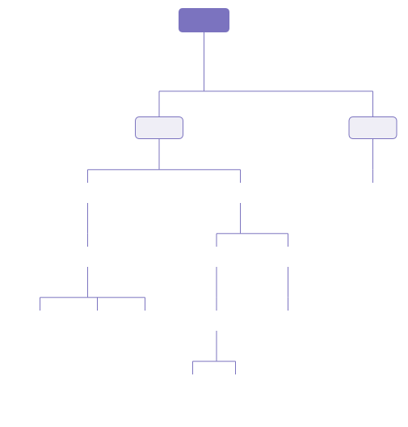

# 卤族元素概述

## 卤素性质概述

### 卤素物理性质

卤族元素普遍在 $\ce{CCl4}$ 中溶解度大于水，相似相容。

卤族元素颜色：

| | 氯元素 $\ce{Cl}$ | 溴元素 $\ce{Br}$ | 碘元素 $\ce{I}$ |
| :-: | :-: | :-: | :-: |
| 单质 | 黄绿色气体 | 深红棕色气体 | 紫黑色固体 |
| 卤化银沉淀 | 白色 | 淡黄色 | 黄色 |
| 水溶液颜色 | 黄绿色 | 橙色 | 黄褐色 |
| 四氯化碳溶液颜色 | 黄绿色 | 橙红色 | 紫红色 |

从上到下，熔沸点升高，非金属性减弱，与氢气反应依次减弱。

$$
\ce{H2 + F2 ->[暗处爆炸] 2HF}
$$

$$
\ce{H2 + Cl2 ->[光照或点燃] 2HCl}
$$

$$
\ce{H2 + Br2 ->[加热] 2HBr}
$$

$$
\ce{H2 + I2 <=>[高温] 2HI}
$$

氯气的物理性质：

- 黄绿色气体。
- 有刺激性气味。
- 密度大于水。
- 可溶于水。
- 有毒。

### 卤素化学性质

能够在水溶液中发生置换反应：

$$
\ce{Cl2 + 2KI -> I2 + 2KCl}
$$

特殊的，氟气能氧化水：

$$
\ce{2F2 + 2H2O -> 4HF + O2}
$$

最高价含氧酸酸性递减，高氯酸 $\ce{HClO4}$ 为最强含氧酸。

## 氯气的化学性质

### 与金属单质反应

- 氯气和钠单质：

    - 剧烈燃烧，产生**黄色**火焰，有白烟生成。

    - $\ce{2Na + Cl2 ->[点燃] 2NaCl}$。

- 氯气和铁单质：

    - 剧烈燃烧，产生**棕红色**烟，水溶液呈**黄色**。

    - $\ce{2Fe + 3Cl2 ->[点燃] 2FeCl3}$。

- 氯气和铜单质：

    - 剧烈燃烧，产生**棕黄色**烟，加水后溶液逐渐由黄色变为**黄绿色、蓝绿色、蓝色**。

    - $\ce{Cu + Cl2 ->[点燃] CuCl2}$。

### 与非金属单质反应

- 氯气和氢气：

    - 安静燃烧，产生**苍白色**火焰，瓶口有**白雾**生成。

    - $\ce{H2 + Cl2 ->[点燃] 2HCl}$。

    - 氢气与氯气混合后，强光或加热，引起爆炸。

### 氯气的反应及制取

- 氯气和水：

    - 产生盐酸和次氯酸，其中次氯酸为弱酸。

    - $\ce{Cl2 + H2O <=> HCl + HClO}$。

- 氯气和碱的反应：

    - 常温或冰水浴中，产生次氯酸；热水浴产生氯酸根。

    - 冰水：$\ce{Cl2 + 2OH- -> Cl- + ClO- + H2O}$。

    - 热水：$\ce{3Cl2 + 6OH- -> 5Cl- + ClO3- + 3H2O}$。

    - 注意：溴单质常温即生成溴酸根。

- 制取：

    - 原理：氧化 $\ce{Cl-}$ 离子。

    - 常用氧化剂：$\ce{MnO2,KMnO4,KClO3,NaClO}$ 或通电。

- 验满：

    - 将湿润的淀粉碘化钾试纸放在瓶口，变蓝。

    - $\ce{Cl2 + 2I- -> I2 + 2Cl-}$。

- 尾气处理：$\ce{NaOH}$ 溶液。

方程式书写：

- $\ce{MnO2 + 4HCl(浓) ->[\triangle] MnCl2 + Cl2 ^ + 2H2O}$。

- $\ce{2KMnO4 + 16HCl(浓) -> 2KCl + 2MnCl2 + 5Cl2 ^ + 8H2O}$。

- $\ce{KClO3 + 6HCl(浓) -> KCl + 3Cl2 ^ + 3H2O}$。

- $\ce{NaClO + 2HCl -> NaCl + Cl2 ^ + H2O}$。

- $\ce{2NaCl(熔融) ->[通电] 2Na + Cl2}$。

- $\ce{2NaCl + 2H2O ->[通电] 2NaOH + H2 ^ + Cl2 ^}$。

常见改良：用 $\ce{NaCl},\ce{H2SO4}(浓)$ 分别提供氯离子和氢离子，代替浓盐酸。

## 氯水和漂白剂

### 氯水的组成

一般认为，氯水由三种分子、四种离子组成：

- 三分：$\ce{Cl2,H2O,HClO}$。

- 四离：$\ce{H+,Cl-,OH-,ClO-}$。

氯水成分的检验：

- $\ce{Cl2}$：观察颜色。

- $\ce{Cl-}$：加入硝酸酸化的硝酸银溶液，产生白色沉淀。

- $\ce{H+}$：加入 $\ce{NaHCO3}$ 固体，产生使澄清石灰水变浑浊的气体。

- $\ce{HClO}$：使有色布条褪色，加热产生气泡。

- 将新制氯水加入石蕊试液，石蕊先变红后褪色（酸性、漂白性）。

在参与反应的时候，认为是氯气分子 $\ce{Cl2}$ 参与即可。

### 漂白粉的原理

成分：

- 主要成分：$\ce{CaCl2,Ca(ClO)2}$。
- 有效成分：$\ce{Ca(ClO)2}$。

制取方法：

- 将氯气通入**石灰乳**中。
- $\ce{2Ca(OH)2 + 2Cl2 -> CaCl2 + Ca(ClO)2 + 2H2O}$。

漂白原理：

- 生效原理：

    - $\ce{Ca(ClO)2 + H2O + CO2 -> 2HClO + CaCO3 v}$。

- 失效原理：

    - $\ce{Ca(ClO)2 + H2O + CO2 -> 2HClO + CaCO3 v}$。

    - $\ce{2HClO ->[光] 2HCl + O2 ^}$。

### 漂白液的原理

成分：

- 主要成分：$\ce{NaCl,NaClO}$。
- 有效成分：$\ce{NaClO}$。

制取方法：

- 将氯气通入氢氧化钠溶液中。
- $\ce{2NaOH + Cl2 -> NaCl + NaClO + H2O}$。

漂白原理：

- 生效原理：

    - $\ce{NaClO + H2O + CO2 -> HClO + NaHCO3}$。

- 失效原理：

    - $\ce{NaClO + H2O + CO2 -> HClO + NaHCO3}$。

    - $\ce{2HClO ->[光] 2HCl + O2 ^}$。

### 次氯酸概述

1. 弱酸性

    - $\ce{HClO <=> H+ + ClO-}$。

    - 其酸性弱于碳酸。

2. 强氧化性

    - 含 $+1$ 价的氯。

    - 用途：杀菌消毒、漂白。

3. 不稳定性

    - $\ce{2HClO ->[\triangle/光] 2HCl + O2 ^}$。

    - 因此新制氯水久置会变为稀盐酸，应当放置在**棕色瓶**内、遮光阴凉处。

一般情况下，不需要考虑次氯酸氧化性对氯气氧化性检验的干扰。

## 溴和碘的概述

### 碘的化学性质

### 海带提碘

海带自带富集碘的作用，海带中碘含量是海水的 $10^4$ 倍作用。

1. 将坩埚放在泥三角上，用酒精灯灼烧海带，待冷却后加水，过滤，可以得到含有 $\ce{I-}$ 的溶液。

2. 用氯气氧化碘离子，得到碘单质。注意，氯气过量会将碘单质继续氧化为碘酸根，但是因为氯气价格低廉、无需酸性环境即可氧化，更常用氯气作为氧化剂。

3. 使用四氯化碳作为萃取剂，萃取碘单质，分液得到碘单质的四氯化碳溶液。此时若直接蒸馏，分离效果不好，如果一定要蒸馏的话，可以使用减压蒸馏或用乙醚作为萃取剂。这里采用反萃取的方式。

4. 将碘的四氯化碳溶液加入氢氧化钠溶液中，充分震荡、静置、分液，得到碘离子和次碘酸根、碘酸根等。在加入足量氯化氢，归中产生碘单质，过滤。这个步骤称为反萃取。

### 海水提溴

海水中也有不少的溴，我们同样先用氯气氧化，然后用热空气吹出得到含有溴单质（液态溴易挥发）的空气，与二氧化硫混合通入水中，得到富含溴离子和硫酸根的水，然后继续用氯气氧化、热空气吹出，就可以得到富含溴单质的蒸汽，冷却后即可得到液态溴。

