# 物质概述

## 物质的分类

### 分类标准

{ width="100%" }

#### 氧化物

氧化物相关：

- 氧化物：一种元素和氧元素组成的化合物。

- 金属氧化物：一种金属和氧元素组成的化合物。

- 非金属氧化物：一种非金属和氧元素组成的化合物。

- 酸性氧化物：与碱反应只生成一种盐的氧化物。

- 碱性氧化物：与碱反应只生成一种酸的氧化物。

辨析：

- 碱性氧化物**一定是**金属氧化物，酸性氧化物**主要是**非金属氧化物。
- 金属氧化物**主要是**碱性氧化物，非金属氧化物**主要是**酸性氧化物。

经典特例：

| | 金属氧化物 | 非金属氧化物 |
| :-: | :-: | :-: |
| **酸性氧化物** | 特例：$\ce{Mn2O7}$ 七氧化二锰 | 通常 |
| **碱性氧化物** | 通常 | 不存在 |

此外，还有：

- 特殊氧化物：与酸和碱反应不只生成一种盐的，例如 $\ce{Na2O2,Fe3O4}$。

- 不成盐氧化物：不与酸和碱（通性）反应的，例如 $\ce{NO,CO}$。

- 两性氧化物：两性金属对应的氧化物。

氧化物形式表达：

- 咕咕咕。

#### 酸概述

非氧化性酸通性：

1. 与酸碱指示剂作用。

2. 与氢前金属反应生成氢气和盐。

3. 与金属氧化物反应生成水和盐。

4. 与部分盐发生复分解反应。

- 本质：电离出的氢离子。

酸的特征：

- 强制弱：强酸制弱酸。

- 难挥发性酸制易挥发性酸：

    - 常见难挥发性酸：硫酸、磷酸。

    - 常见易挥发性酸：卤化氢、硝酸。

    - $\ce{NaCl + H2SO4 -> HCl}$。

    - $\ce{NaBr + H3PO4 -> HBr}$。

- 氧化性：浓硫酸、浓硝酸等具有强氧化性。

#### 碱概述

碱的通性：

1. 与酸碱指示剂作用。

2. 与酸性氧化物反应生成盐。

3. 与酸反应生成水和盐。

4. 与部分盐发生复分解反应。

- 本质：电离出的氢氧根离子。

碱的特征：

- 强制弱：强碱制弱碱，通常倾向于沉淀。

- 很多碱都易潮解，这与其结构有关。

#### 盐概述

碱的通性：

1. 与某些酸、碱发生复分解反应。

2. 与某些金属单质发生置换反应。

3. 与某些盐发生复分解反应。

$$
\ce{正盐 <-->[对应酸][对应碱] 酸式盐}
$$

离子和沉淀颜色：

CrO4^2- 黄色

Cr2O7^2- 橙红色

### 分散系

#### 分散系的定义

若干种物质，分散在另外若干种物质中所得到的体系（混合物），称为分散系。

| | 溶液 | 胶体 | 浊液 |
| :-: | :-: | :-: | :-: |
| 粒子直径 | $\pu{0\sim1nm}$ | $\pu{1\sim100nm}$ | $\pu{100\sim nm}$ |
| 外观表现 | 均一、稳定 | 较均一、较稳定 | 不均一、不稳定 |
| 粒子种类 | 分子、粒子 | 大分子、小分子集合体 | 固体粒、小液滴 |

#### 胶体的性质

胶体根据其分散剂的状态，分为：

- 气溶胶：云、雾、烟等。

- 液溶胶：蛋白质溶液、淀粉溶液、氢氧化铁胶体等。

- 固溶胶：有色玻璃、宝石等。

其性质有：

- 丁达尔效应：

    - 现象：一束光通过胶体时，留下一条光亮的通路。

    - 原因：胶体粒子对光的散射。

    - 用途：鉴别溶液和胶体（非本质区别）。

- 渗析：

    - 作用：分离胶体和溶液，提纯胶体。

    - 原因：半透膜可让溶液通过，不可让胶体通过。

- 电泳：

    - 原因：胶体粒子吸附阴阳离子而带上电荷。

    - 现象：在电场中，胶粒会发生定向移动。

    - 距离：$\ce{Fe(OH)3}$ **胶粒**带正电（胶体不带电，电中性）。

    - 应用：静电除尘。

- 介稳性与聚沉：

    - 介稳性：介于稳定与不稳定之间。

    - 聚沉：加电解质、加电性相反的胶粒、加热或搅拌。

    - 应用：点豆腐，三角洲的形成（淡水与海水的混合）。

## 金属的分类

### 金属单质

金属的通性：

- 与非金属单质（氧气、氯气）。

- 活泼金属和水的反应。

- 氢前金属和非氧化性酸的反应。

- 银前金属和硝酸等氧化性酸的反应。

- 金属和盐发生的置换反应。

金属的物理性质：

- 熔点：最低的 Hg 汞，最高的 W 钨（用于钨丝灯泡）。

- 延展性：延性最强 Pt 铂（铂丝），展性最强 Au 金（金箔）。

- 导电能力排序：$\ce{Ag,Cu,Ag,Al}$，其中银一般仅用于要求极高的场景。

- 室内导线常用铜，室外常用铝（致密氧化膜，防止进一步氧化）。

### 合金概述

合金的性质如下：

- 硬度高于任一成分。

- 熔点低于任一成分。

合金的分类如下：

- 黑色金属：铁、铬、锰及其合金。

- 有色金属。

## 金属冶炼

按照活动性顺序：

- $\ce{K,Ca,Na,Mg}$：通常电解其熔融氯化物。

- $\ce{Al}$：其氯化物不导电，通常电解氧化物（加入冰晶石）。

- $\ce{Zn,Fe,Cu}$：通常用 $\ce{C,CO,H2}$ 还原。

- $\ce{Hg}$：氧化物高温分解，单质与氧气加热化合。

- $\ce{Au}$：自然界多游离态，富集。

- 贵重金属、高熔点金属常用铝热反应或与钠单质熔融还原制得。
