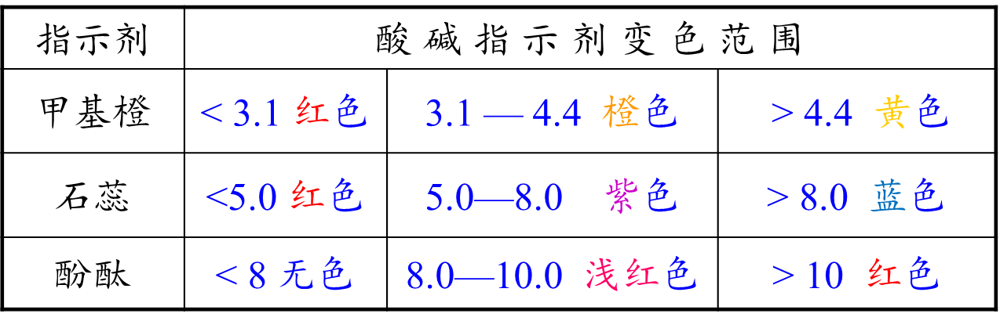

# 化学实验操作

一、实验室突发事件的应对措施

1.烫伤和烧伤：轻微烫伤或烧伤时，可先用洁净的冷水处理，降低局部温度，然后涂上烫伤药膏(若有水疱，尽量不要弄破)。严重时需及时就医。

2.创伤：用药棉把伤口清理干净(伤口处若有碎玻璃片，先要小心除去)，然后用双氧水或碘酒擦洗，最后用创可贴外敷。

3.酸或碱等腐蚀性试剂灼伤如果不慎将酸沾到皮肤上，应立即用大量水冲洗，然后用3% ~5%的NaHCO3溶液冲洗；如果不慎将碱沾到皮肤上，应立即用大量水冲洗，然后涂上1%的硼酸。

如果有少量酸(或碱)滴到实验桌上，应立即用湿抹布擦净，然后用水冲洗抹布。

4.着火：立即切断室内电源，移走可燃物。如果火势不大，用湿布或灭火毯覆盖火源以灭火；火势较猛时，选用合适的灭火器进行灭火，并立即与消防联系。

如果身上的衣物着火，立即用湿布灭火；如果燃烧面积较大，应躺在地上翻滚以达到灭火的目的。

二、常见废弃物的处理方法

1.废液的处理

(1)对于酸、碱、氧化剂或还原剂的废液，应分别收集。在确定酸与碱混合、氧化剂与还原剂混合无危险时，可用中和法或氧化还原法，每次各取少量分次混合后再排放。

(2)对于含重金属(如铅、汞或镉等)离子的废液，可利用沉淀法进行处理。将沉淀物(如硫化物或氢氧化物等)从溶液中分离，并作为废渣处理；在确定溶液中不含重金属离子后，将溶液排放。

(3)对于有机废液，具有回收利用价值的，可以用溶剂萃取，分液后回收利用，或直接蒸馏，回收特定馏分。不需要回收利用的，可用焚烧法处理(注意：含卤素的有机废液焚烧后的尾气处理具有特殊性，应单独处理)。

2.废渣的处理

(1)易燃物如钠、钾、白磷等若随便丢弃易引起火灾，中学实验室中可以将未用完的钠、钾、白磷等放回原试剂瓶。

(2)强氧化剂如KMnO4、KClO3、Na2O2等固体不能随便丢弃，可配成溶液或通过化学反应将其转化为一般化学品后，再进行常规处理。

(3)对于实验转化后的难溶物或含有重金属的固体废渣，应当集中送至环保单位进一步处理。

试剂的保存：

- 环境：酸碱性、水解。

- 瓶子：材料、塞子、口径、磨口。

- 外界：光（棕色瓶）、空气（液封、油封）。

## 物理分离

### 过滤

- 范围：固液不互溶。

- 仪器：烧杯、漏斗、玻璃棒。

- 通常伴随洗涤和干燥。

### 结晶

单一溶质：

- 不带结晶水且稳定的：

    - 蒸发结晶，出现大量晶体时停止加热（蒸干）。

    - 玻璃棒：搅拌，使受热均匀，防止喷溅。

- 带结晶水或不稳定的：

    - 蒸发浓缩，冷却结晶，过滤，洗涤，干燥。

    - 降温结晶：出现少量晶体或表面出现晶膜后停止。

多种溶质：

- 得到溶解度随温度变化小的：

    - 蒸发浓缩，趁热过滤，洗涤，干燥。

    - 趁热过滤：防止杂质降温析出，减少损耗，提高浓度。

- 得到溶解度随温度变化大的：

    - 加热浓缩，蒸发结晶。

    - 蒸发浓缩，冷却结晶，过滤，洗涤，干燥。

### 洗涤

- 洗涤：使固体纯净，减少测量误差、提高纯度。

- 冰水洗涤：洗去晶体表面的杂志离子，减少晶体在洗涤过程中的溶解损耗。

- 无水乙醇洗涤：除去表面水分、易于干燥。

- 证明洗涤干净：取样，加沉淀试剂，如无沉淀则证明洗净。

- 干燥：连续两次干燥，质量差值小于 $\pu{0.1g}$。

### 升华

- 固固混合，其一易升华。

- 例如 $\ce{NH4Cl}$ 受热分解，随即化合重新生成。

### 渗析

- 分离胶体和溶液，详见分散系。

- 用高浓度的盐分离蛋白质，称为盐析。

- 利用不同物质在同种溶剂中溶解度不同，称为层析。

### 蒸馏

- 蒸馏烧瓶内加入沸石防暴沸。

- 温度计球上表面与管下表面相切。

- 冷凝水从下进入，从上流出。

- 不能蒸馏共沸物（例如水和乙醇）。

- 分馏：多温度多产物，例如石油分馏。

### 滴定

- 常见滴定误差分析：

    - $\ce{I-}$ 会被空气中的氧气氧化，滴定 $\ce{I2}$ 偏高。

### 萃取

萃取剂：

- 不与溶剂、溶质反应。

- 与溶剂不相容。

- 对溶质比原溶剂更有吸引力。

- 分配系数：物质在两相中浓度为一个定值，这个比值称为分配系数。

以水为原溶剂为例：

- 密度大于 $1$ 的溶剂（水在上层）：四氯化碳、氯仿、溴苯、二硫化碳等。

- 密度小于 $1$ 的溶剂（水在下层）：液态的饱和烃、直馏汽油、苯及其同系物、液态环烷烃、液态饱和酯。

基本步骤：

- 梨形分液漏斗，验漏，倒置无液体流出。

- 混合原溶液和萃取剂，充分震荡。

- 静置，溶质转移与分层。

- 分液：拔塞子，上走上、下走下，凹槽对准小孔。

## 离心法

离心法是一种利用离心力分离悬浮液中颗粒的技术，其核心公式为离心力 $F=m\omega^2r$。

离心机通过高速旋转产生远高于重力的离心力，使不同密度、大小或形状的颗粒分层或沉降，从而实现分离。

### 差速离心

差速离心是一种基于悬浮液中颗粒因大小、形状和密度不同而具有不同沉降速率的原理进行分离的技术。较大的和密度较高的颗粒在离心力作用下会比小的和密度较低的颗粒更快地沉降。该技术通常涉及一系列连续的离心步骤，每次以逐渐增加的速度和 / 或时间进行，以选择性地沉降不同的细胞组分。

典型的差速离心操作步骤如下：

1. 首先，通过匀浆化等方法破坏细胞或组织，释放出需要分离的细胞组分，形成均匀的悬浮液或裂解液。

2. 然后，将匀浆液在较低的离心速度下进行第一次离心，使较大和较密的组分（如完整的细胞核和细胞膜）沉到底部形成沉淀。小心地收集上清液，其中含有较小和密度较低的组分，并转移到新的离心管中进行后续的离心步骤。

3. 对于收集到的上清液，以更高的离心速度和 / 或更长的离心时间进行第二次离心，这将导致中等大小和密度的组分（如线粒体和溶酶体）沉淀。

4. 重复上述过程，每次使用更高的离心速度，可以进一步分离出更小和密度更低的组分，例如微粒体和核糖体。在每次离心后，得到的沉淀物和上清液都代表了富含特定大小和密度范围组分的级分。

5. 为了提高分离组分的纯度，可以对沉淀物进行重悬和再次离心，这个过程称为洗涤沉淀物。

尽管差速离心操作相对简单且成本较低，使其成为许多实验室常用的初步分离方法 ，但由于生物颗粒的异质性以及不同组分沉降速率的潜在重叠，通过该方法获得的级分纯度有限，通常需要进一步的纯化步骤，如密度梯度离心，以获得更高纯度的分离物。差速离心的效率高度依赖于每个步骤离心力和时间的精确选择和优化，这些参数需要根据被分离的特定组分的沉降特性进行调整。

### 密度梯度离心

密度梯度离心是一种基于颗粒的浮力密度在密度梯度介质中迁移的原理进行分离的技术。在离心管中预先形成一个密度梯度，通常密度从顶部到底部逐渐增加。当样品在这样的梯度中进行离心时，颗粒会迁移，直到它们到达梯度中与其自身密度相等的点，此时颗粒会悬浮在该位置，形成不同的区带。常用的梯度介质包括蔗糖、氯化铯等。

速率区带离心：是根据颗粒在预先形成的密度梯度中沉降系数的差异（主要取决于大小和质量）进行分离的。

1. 首先，制备预先形成的密度梯度，例如通过分层不同浓度的蔗糖溶液来创建密度从顶部到底部逐渐增加的梯度。

2. 然后，将含有待分离生物分子的样品小心地以薄层的形式加到梯度顶部，尽量减少对梯度的扰动。

3. 接下来，在适当的速度和特定的时间进行离心，离心参数需要根据被分离生物分子的特性进行优化。

4. 离心结束后，小心地从离心管中取出梯度，并使用细针或分数收集器从梯度中收集所需的区带或条带，每个区带包含分离出的特定生物分子，收集到的每个级分用于进一步分析。

等密度离心完全基于颗粒的浮力密度进行分离，与颗粒的大小或形状无关。

- 在离心过程中，颗粒会迁移到梯度中与其自身密度完全相同的平衡位置，并在该位置形成区带。为了实现有效的等密度分离，梯度介质的密度范围必须覆盖待分离颗粒的密度范围。等密度离心可以利用预先形成的梯度，也可以使用在离心过程中通过梯度介质自身沉降形成的自形成梯度，例如氯化铯溶液。

1. 首先，制备密度梯度，可以通过预先分层不同密度的溶液（预形成梯度）或将样品与梯度形成介质均匀混合（自形成梯度）来实现。

2. 然后，将样品加载到预形成的梯度顶部，或者与自形成梯度介质混合。

3. 接下来，以高速进行离心，直到所有颗粒都达到其在梯度中与其密度相等的平衡位置。

4. 最后，收集不同密度的区带并进行分析以鉴定分离出的颗粒。

密度梯度离心，无论是速率区带离心还是等密度离心，与差速离心相比，都提供了更高的分辨率，尤其适用于分离密度差异细微的颗粒。速率区带离心和等密度离心是互补的技术，前者更适合根据大小 / 质量进行分离，而后者则根据密度进行分离。梯度介质的选择以及梯度形成的方法（连续与不连续，预形成与自形成）是影响密度梯度离心成功与否的关键因素，并且取决于具体的应用。

### 分析超速离心

分析超速离心是一种利用超速离心机产生极高离心力来分析溶液中生物大分子流体动力学和热力学性质的技术，分析超速离心主要有两种实验方法：沉降速度法和沉降平衡法。

- 沉降速度法：沉降速度法通过观察分子在高离心场中沉降的速率来确定沉降系数、分子量、大小和形状。沉降速度实验通常采用高转速以诱导大分子快速沉降。

- 沉降平衡法：与沉降速度法不同，沉降平衡法在较低的转速下进行较长时间，以使沉降力和扩散力之间达到热力学平衡，从而在离心管中形成稳定的分子浓度梯度。

与制备性离心不同，分析超速离心通过集成的光学检测系统实时监测沉降过程，该技术可以提供关于生物大分子的分子量、大小分布、形状以及它们在天然溶液状态下的相互作用等丰富信息。由于涉及极高的转速，分析超速离心通常在高度真空和精确的温度控制下进行，以防止摩擦生热导致样品降解并确保测量的准确性。

### 沉降系数

沉降系数 $s$ 定义为颗粒在单位离心场中的沉降速度，公式为

$$
s=\dfrac{v}{\omega^2r}
$$

单位为斯维德伯格 $\pu{1S}=10^{-13}$ 秒。

反映颗粒特性：与颗粒密度、大小及形状相关。

应用场景：通过测定可推断分子量或颗粒结构，如 DNA 超螺旋构象的沉降系数差异。

关键影响因素：

- 颗粒大小：沉降速度与粒径平方成正比（Stokes 公式）。
- 密度差：颗粒与介质密度差越大，沉降越快。
- 介质黏度：黏度增加会显著降低沉降速度。
- 离心力：直接影响沉降速率，超速离心可分离纳米级颗粒。

Stokes 公式：

$$
v=\dfrac{2}{9}\cdot\dfrac{d^2\Delta\rho g}{\eta}
$$

## 基本实验

### 一定溶液配制

步骤如下：

1. 计算、验漏。
2. 称量或量取。
3. 溶解和稀释。
4. 冷却至室温。
5. 移液至容量瓶内。
6. 洗涤玻璃棒和烧杯。
7. 定容。
8. 翻转摇匀。
9. 装瓶、贴标签。

注意事项：

- 容量瓶一定要指定容量，例如 $\pu{1000mL}$ 容量瓶。
- 定容至刻度线下 $\pu{1\sim2cm}$ 后用胶头滴管滴加。

### 中和热的测定

### 酸碱中和滴定

测量溶液的 $\pH$：

- 常见 $\pH$ 试剂的变色范围。

    { width="80%" }

- 广泛 $\pH$ 试纸：

    - 试纸不能用水湿润，即使是测量蒸馏水的 $\pH$。

    - 比色卡对照，只能读整数，有小数比色卡称为精密 $\pH$ 试纸。

    - 无法用试纸测量的：本身颜色过深、强氧化性漂白或强腐蚀性。

### 结晶水的测定

### 有机物的燃烧

氧化焰和还原焰：

- 氧化焰是有过量氧气的环境下产生的火焰。当氧气量增加时，火焰的持续时间会缩短，颜色变暗，并发出嘶嘶声和咆哮声。

- 还原焰是在低氧环境下产生的火焰。由于碳或碳氢化合物会与用火加工的材料中所含的氧结合（还原），所以还原焰的颜色偏黄。

- 中性焰是氧气量刚好可以燃烧的火焰，既不发生氧化反应也不发生还原反应，一个拥有好的氧气平衡的火焰是蓝色的。

### 金属碳酸根盐

直接加入碳酸钠溶液中，则可能会因为碱性过强产生金属氢氧化物沉淀；因此通常与碳酸氢铵反应，应当为将碳酸氢铵稀溶液逐滴加入金属阳离子的盐溶液中，并不断搅拌。
