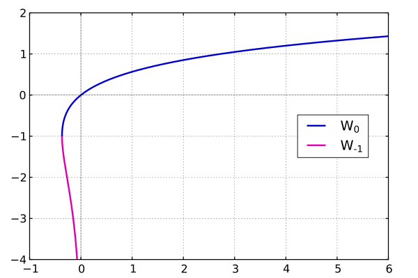

# 函数的基础知识

## 函数的概念

### 定义

函数是一个定义域 $A$ 到值域 $B$ 的映射关系，函数的定义域和值域是一个集合，对于定义域内的每一个数，有且仅有值域内的一个数与之对应，记为 $f:A\to B$。

注意，定义域的是所有函数值的集合，是陪域的一个子集，严格来说函数是定义域到陪域的映射关系，只是陪域内的数，不一定是有效的函数值，只有值域内的数才是有效的函数值。

1. 函数的定义域就是能使解析式有意义的所有实数勿的集合，自然定义域是式子本身所要求的定义域。
2. 不要轻易对解析式进行化简变形，以免定义域发生变化。
3. 当一个函数由两个或两个以上代数式的和、差、积、商的形式构成时，定义域是使得各式子都有意义的公共部分、且（若有）分式有意义的集合。

复合函数：如果 $g$ 的值域为 $f$ 的定义域的子集，那么定义 $y=(f\circ g)(x)=f(g(x))$。

### 解析式

已知函数 $f$ 的一些关系式，求 $f(x)$，最常用的是换元法和变形法，例如：

$$
f(x+1)=x^2
$$

换元法，设 $t=x+1$，则：

$$
f(t)=(t-1)^2=t^2-2t+1
$$

如果给出多个 $f$ 的值，且自变量有对称性，那么对称联立，例如给出上式：

$$
\begin{cases}
3f(x)+2f(-x)&=x+3\\
3f(-x)+2f(x)&=-x+3
\end{cases}
$$

类似的还有 $x$ 与 $1/x$ 等。

由多个子函数分段定义的函数称为分段函数，如绝对值函数：

$$
|x|=\begin{cases}
x&x\ge0\\
-x&x<0
\end{cases}
$$

分段函数的定义域是各段函数定义域的并集，值域是各段函数值域的并集。

符号函数是一种常用的分段函数：

$$
\op{sgn}x=\begin{cases}
1&x>0\\
0&x=0\\
-1&x<0
\end{cases}
$$

### 反函数

对于二元关系 $(f:X\rightarrow Y)$ 和 $(g:Y\rightarrow X)$，若 $(\forall x\in X)\{g[f(x)]=x\}$ 且  $(\forall y\in Y)\{f[g(y)]=y\}$，则称 $g$ 为 $f$ 的反函数，记为 $f^{-1}$。

设 $f$ 表示一个函数，其定义域为 $X$、陪域为 $Y$，若存在一函数 $g$，其定义域为 $Y$、陪域为 $X$，且对于 $x\in X$ 有 $g(f(x))=x$、对于任意 $y\in Y$ 有 $f(g(y))=y$，则称 $g$ 为 $f$ 的反函数。

函数 $f$ 的反函数记为 $f^{-1}$，注意此处的 $-1$（次方的写法）并不是 $-1$ 次方，比如 $\sin$ 的反函数 $\arcsin$ 也记为 $\sin^{-1}$。

单调函数总是有反函数，并且反函数的单调性与原函数一致，原函数与反函数的图像关于函数 $y=x$ 的图像对称。

水平线测试：

- 在数学里，水平线测试为一测试方法，用来判断一函数是否为单射、满射或双射。

- 设一带有图像的函数为 $f:X\rightarrow Y$，接着使用 $X\times Y$ 上的水平线：

    $$
    y_0\in Y,\ \{\langle x,y_0\rangle\in f\mid x\in X\}
    $$

    若函数为单射，则其图像绝不会和任何一条水平线相交超过一次。

    若函数为满射，则每一水平线和图像至少相交一次。

    若函数为双射，则每一水平线和图像相交于一点且只有一点。

求反函数：记 $g$ 表示函数 $f$ 的反函数，那么从图像的角度考虑，若 $\langle x,y\rangle\in f$，那么 $\langle y,x\rangle\in g$，因此，我们对于 $y=f(x)=\dots x$，只需要将 $x,y$ 互换，得到的就是反函数的解析式。当然也不能写 $x=\dots y$ 的形式，要化为 $y=\dots x$ 的形式。

例题：求 $f(x)=2x+1$ 的反函数。答案：有 $y=f(x)=2x+1$；交换 $x,y$，即 $x=g(y)=2y+1$；整理，得 $y=g(y)=\dfrac{1}{2}x-\dfrac{1}{2}$。

### 朗博 W 函数

我们将朗博 $W$ 函数定义为 $f(x)=xe^x$ 的反函数。

也就是说，有关方程 $\displaystyle xe^x=a$ 可以给出通解

$$
\begin{cases}
W_0(a)&a\ge-\frac{1}{e}\\
W_{-1}(a)&a\in\left(-\dfrac{1}{e},0\right)
\end{cases}
$$

但是 $W(x)$ 没有初等意义的解析式，只有积分式。

- 将定义域限制在 $\displaystyle\left[-\frac{1}{e},+\infty\right)$ 上，取其在 $[-1,+\infty)$ 上的函数值，那么就定义了一个单调递增的函数 $W
_0(x)$；

- 将定义域限制在 $\displaystyle\left(-\frac{1}{e},0\right)$ 上，取其在 $(-\infty,-1)$ 上的函数值，那么就定义了一个单调递减的函数 $W_{-1}(x)$.

性质：当 $a\geq 0$ 时，${W(x)\cdot e^{W(x)}=x}$，此外可以推出

$$
\begin{aligned}
x\ln x=a&\implies x=e^{W(a)}\\
x+\ln x=a&\implies x=W(e^a)\\
\frac{\ln x}{x}=-a&\implies x=e^{-W(a)}
\end{aligned}
$$

以及朗博不等式，可以同构证明：${xe^x\geq x+\ln x+1}$

## 初等函数

- 正比例函数：$f(x+y)=f(x)+f(y)$。

- 幂型函数：$f(xy)=f(x)f(y)$。

- 对数型函数：$f(xy)=f(x)+f(y)$。

- 指数形函数：$f(x+y)=f(x)f(y)$。

### 幂函数

形如 $y=x^\alpha$（通常认为 $\alpha\neq0$），有性质：

- 函数恒过 $(1,1)$ 点。

- 如果 $\alpha>0$，那么函数恒过 $(0,0)$.

- 如果 $\alpha\in\Z^+$，那么函数有奇偶性，与 $\alpha$ 的奇偶性相同。

- 在 $(0,\infty)$ 上函数奇偶性与 $\alpha$ 关于 $1$ 的大小有关。

有幂的性质：

$$
a^{\frac{m}{n}}=\sqrt[n]{a^m}=\sqrt[n]{a}^m
$$

其中 $n,m$ 均为正数且不同奇偶。

$$
a^{-x}=\dfrac{1}{a^x}
$$

这一条经常用于简化除法的求导，转化为乘法可以更方便。

$$
\sqrt{a\pm\sqrt{b}}=\sqrt{a+\sqrt{a^2-b}\over2}\pm\sqrt{a-\sqrt{a^2-b}\over2}
$$

对于自然数 $a,b$，只有 $a^2-b$ 是完全平方数的时候，才能开出来。

证明：我们设 $\sqrt{a+\sqrt{b}}$ 化简完的结果是 $\sqrt x+\sqrt y$：

$$
\begin{aligned}
\sqrt{a+\sqrt{b}}&=\sqrt x+\sqrt y\\
a+\sqrt{b}&=x+y+2\sqrt{xy}
\end{aligned}
$$

因为 $a$ 外面没有根号，与 $x+y$ 相对应：

$$
\left\{\begin{aligned}
a&=x+y\\
\sqrt{b}&=2\sqrt{xy}
\end{aligned}\right.
$$

然后我们把下面的式子平方，可以写出方程组：

$$
\left\{\begin{aligned}
x+y&=a\\
xy&={b\over4}
\end{aligned}\right.
$$

然后用公式：

$$
\left\{\begin{aligned}
x+y&=a\\
x-y&=\sqrt{(x+y)^2-4xy}\\
&=\sqrt{a^2-b}
\end{aligned}\right.
$$

或者设 $t$ 满足：

$$
\begin{aligned}
(t-x)(t-y)&=0\\
t^2-(x+y)t+xy&=0
\end{aligned}
$$

解这个方程，得到的 $t$ 的两个根分别就是 $x$ 和 $y$。

具体的：

$$
\begin{aligned}
t^2-at+{b\over4}=0\\
t={a\pm\sqrt{a^2-b}\over2}
\end{aligned}
$$

解得：

$$
\left\{\begin{aligned}
x&={a+\sqrt{a^2-b}\over2}\\
y&={a-\sqrt{a^2-b}\over2}
\end{aligned}\right.
$$

因此：

$$
\begin{aligned}
&\sqrt{a+\sqrt{b}}=\sqrt x+\sqrt y\\
=&\sqrt{a+\sqrt{a^2-b}\over2}+\sqrt{a-\sqrt{a^2-b}\over2}
\end{aligned}
$$

减法同理。

### 指数函数

形如 $y=f(x)=a^x$（$a>0$ 且 $a\neq1$），有性质：

- 恒过 $(0,1)$ 点。

- 满足 $f(x)\cdot f(-x)=1$。

指数函数非积非偶，换元常常先统一底数，例如：

$$
4^x+2^{x+1}+3=(2^x)^2+2\cdot2^x+3
$$

指数函数中，有一种函数特别重要：

$$
f(x)=e^x
$$

其中，$e$ 是一个无理数，近似值为 $2.71828\dots$。

### 对数函数

若 $a^x=n$（$a>0$ 且 $a\neq1$），则记 $x=\log_an$，其中 $a$ 为底数，$n$ 为真数。

$$
\begin{aligned}
a^{\log_ax}&=x\\
\log_aa^x&=x
\end{aligned}
$$

因此：

$$
\begin{aligned}
\log_a1&=0\\
\log_aa&=1\\
\end{aligned}
$$

对数也有一些特殊记号，例如：

$$
\begin{aligned}
\log_ex&=\ln x\\
\log_2x&=\operatorname{lb}x\\
\log_{10}x&=\lg x
\end{aligned}
$$

对数的运算法则与指数相对，如下：

$$
\begin{aligned}
\log_axy&=\log_ax+\log_ay&&\qquad&a^xa^y&=a^{x+y}\\
\log_a\frac{x}{y}&=\log_ax-\log_ay&&\qquad&\frac{a^x}{a^y}&=a^{x-y}\\
\log_ax^y&=y\log_ax&&\qquad&(a^x)^y&=a^{xy}\\
\log_a\sqrt[y]x&=\frac{\log_ax}y&&\qquad&\sqrt[y]x&=x^\frac{1}{y}
\end{aligned}
$$

另外，还有换底公式，非常常用

$$
\begin{aligned}
\log_ax&=\frac{\log_bx}{\log_ba}\\
\log_ax&=\frac{1}{\log_xa}\\
\log_{a^n}b&=\frac{\log_ab}{n}
\end{aligned}
$$

另外，还有：

$$
\begin{aligned}
x^{\log_ay}&=y^{\log_ax}\\
\log_ab\log_bx&=\log_ax\\
\log_a\dfrac{1}{x}&=-\log_ax
\end{aligned}
$$

也就是说：

$$
\begin{aligned}
\log_am\log_bn&=\log_bm\log_an\\
\dfrac nm\log_ab&=\log_{a^m}b^n=\log_ab^{\frac nm}
\end{aligned}
$$

## 导数的定义

### 导数概念

如果函数 $f(x)$ 在 $x_{0}$ 的一个**邻域** $(x_{0} - \delta, x_{0} + \delta)$ 有定义，且极限

$$
\boxed{\lim\limits_{\Delta x \to 0} \dfrac{f(x_{0} + \Delta x) - f(x_{0})}{\Delta x}}
$$

存在，那么称这个极限为 $f$ 在 $x_{0}$ 的**导数**，记作 $f'(x_{0})$ 或 $\dfrac{\d f}{\d x}(x_{0})$。此时称 $f$ 在 $x_{0}$ **可导**。

如果函数 $f(x)$ 在 $x_{0}$ 的一个**左邻域** $(x_{0} - \delta, x_{0}]$ 有定义，且极限

$$
\lim\limits_{\Delta x \to 0^{-}} \dfrac{f(x_{0} + \Delta x) - f(x_{0})}{\Delta x}
$$

存在，那么称这个极限为 $f$ 在 $x_{0}$ 的**左导数**，记作 $f'_{-}(x_{0})$。

如果函数 $f(x)$ 在 $x_{0}$ 的一个**右邻域** $[x_{0}, x_{0} + \delta)$ 有定义，且极限

$$
\lim\limits_{\Delta x \to 0^{+}} \dfrac{f(x_{0} + \Delta x) - f(x_{0})}{\Delta x}
$$

存在，那么称这个极限为 $f$ 在 $x_{0}$ 的**右导数**，记作 $f'_{+}(x_{0})$。

函数在 $x_{0}$ 可导的充要条件是它在 $x_{0}$ 的左导数和右导数存在且相等，即 $f$ 在点 $x_{0}$ 连续。（更加严谨的是，可导 ⇒ 连续，连续 ⇏ 可导）。

如果函数 $f$ 在区间 $I$ 内的每一点都可导，且在端点单侧可导，那么称 $f$ 在区间 $I$ 上可导。此时 $x \mapsto f'(x), x \in I$ 确定了一个函数，称为 $f$ 的**导函数**，简称**导数**，记作 $f'(x)$ 或 $\dfrac{\d f}{\d x}(x)$。后一种符号由德国数学家莱布尼茨发明。

### 切线问题

{ width="60%" }

观察曲线 $y = f(x)$ 的图像。连接曲线上的两点 $(x_{0}, f(x_{0}))$ 和 $(x_{0} + \Delta x, f(x_{0} + \Delta x))$，可以得到曲线的一条**割线**，其斜率

$$
k = \dfrac{f(x_{0} + \Delta x) - f(x_{0})}{\Delta x}
$$

由于函数 $f(x)$ 在 $x_{0}$ 连续，当 $\Delta x$ 趋于 $0$ 时，割线趋于某条特定的直线，这条直线称为曲线在点 $(x_{0}, f(x_{0}))$ 的**切线**，其斜率

$$
k = \lim\limits_{\Delta x \to 0} \dfrac{f(x_{0} + \Delta x) - f(x_{0})}{\Delta x}
$$

这就是导数的几何意义。通过点斜式可以写出切线的方程：$y - f(x_{0}) = f'(x_{0}) (x - x_{0})$。

注意，在求切线的题里，给定的点 $(a,b)$ 不一定在曲线上，如果不在曲线上，那么设出切点 $(x,f(x))$，写出：

$$
f'(x)\cdot\dfrac{f(x)-b}{x-a}=-1
$$

若是两条曲线的公切线问题，则切线方程需要算两次，然后根据直线方程列出对应参数相等，例如：求曲线 $f(x)=\ln x+2$ 与曲线 $g(x)=\ln(x+1)$ 的公切线。

- 设公切线切 $f$ 于点 $(x_1,\ln x_1+2)$，则：

    $$
    y=\dfrac{1}{x_1}x+\ln x_1+1
    $$

- 设公切线切 $g$ 于点 $(x_2,\ln(x_2+1))$，则：

    $$
    y=\dfrac{1}{x_2+1}x+\dfrac{1}{x_2+1}+\ln(x_2+1)-1
    $$

因为这是一条直线，所以列出总方程：

$$
\begin{cases}
\dfrac{1}{x_1}=\dfrac{1}{x_2+1}\\
\ln x_1+1=\dfrac{1}{x_2+1}+\ln(x_2+1)-1
\end{cases}
$$

解得 $x_1=\dfrac{1}{2}$，带入可知 $y=2x+1-\ln2$。

一般地，求曲线的切线方程都是通过求导的方式。但是若曲线为二次函数，一般利用的是判别式方法，即联立两方程，若相切则方程只有一个解，用 $\Delta=0$ 计算即可。

上面的写法可能有一些复杂，我们这里提供一个思路清晰的方法，我们将切线问题转化为一个点和一个斜率，设切点 $(x_1,y_1),(x_2,y_2)$，列出：

- 点：$y_1=f(x_1),y_2=g(x_2)$。

- 斜：$k=f'(x_1)=g'(x_2)$。

这样就可以直接把问题转化为一个解方程了。

还有一个经典的问题，过某点有且仅有几条切线，可以直接列出方程，令其有且仅有几个解即可，注意此时应当注意移项除法是否为零。

### 极限定义

极限法求导数，是最简单的方法，高中数学中需要求导的函数基本上都是连续的，我们无需考虑不连续的情况，因此我们设出一个 $\Delta x$ 表示增量，用微分的思想，例如 $f(x)=ax^2$：

$$
\begin{aligned}
 \dfrac{\d f}{\d x}(x)
&= \lim_{\Delta x\to 0} \dfrac{f(x+\Delta x)-f(x)}{\Delta x} \\
&= \lim_{\Delta x\to 0} \dfrac{a(x+\Delta x)^2-ax^2}{\Delta x} \\
&= \lim_{\Delta x\to 0} \dfrac{2ax\Delta x+a(\Delta x)^2}{\Delta x} \\
&= \lim_{\Delta x\to 0} (2ax+a\Delta x)
\end{aligned}
$$

我们知道，$\Delta x$ 是趋近于 $0$，但是 $0/0$ 没有意义，所以我们继续化简，化简到最后，我们的 $a\Delta x$ 也是趋近于 $0$ 的，因此就可以忽略了，即导函数：

$$
f'(x)=2ax
$$

通过一些多项式定理、三角恒等变换等，我们可以轻松得出下面的几个常用导数：

| 函数 | 导函数 | 函数 | 导函数 |
| :- | :- | :- | :- |
| $y=c$ | $y'=0$ | $y=x^n$ | $y'=nx^{n-1}$ |
| $y=a^x$ | $y'=a^x\ln a$ | $y=e^x$ | $y'=e^x$ |
| $y=\log_ax$ | $y'=\dfrac{1}{x\ln a}$ | $y=\ln x$ | $y'=\dfrac{1}{x}$ |
| $y=\sin x$ | $y'=\cos x$ | $y=\cos x$ | $y'=-\sin x$ |
| $y=\tan x$ | $y'=\dfrac{1}{\cos^2x}$ | $y=\cot x$ | $y'=-\dfrac{1}{\sin^2x}$ |

## 导数的运算

### 四则运算

导数的加减法则：

$$
\boxed{[f(x)\pm g(x)]'=f'(x)\pm g'(x)}
$$

证明：

$$
\begin{aligned}
[f(x)\pm g(x)]'
&= \lim_{\Delta x\to 0} \dfrac{[f(x+\Delta x)\pm g(x+\Delta x)]-[f(x)\pm g(x)]}{\Delta x}\\
&= \lim_{\Delta x\to 0} \dfrac{[f(x+\Delta x)-f(x)]\pm [g(x+\Delta x)-g(x)]}{\Delta x}\\
&= \lim_{\Delta x\to 0} \dfrac{[f(x+\Delta x)-f(x)]}{\Delta x} \pm  \dfrac{[g(x+\Delta x)-g(x)]}{\Delta x} \\
&= \lim_{\Delta x\to 0} f'(x)\pm g'(x)
\end{aligned}
$$

导数的乘法法则：

$$
\boxed{[f(x)g(x)]'=f'(x)g(x)+f(x)g'(x)}
$$

同时，如果 $g(x)=c$ 也就是说：

$$
\boxed{[cf(x)]'=cf'(x)}
$$

导数的除法法则：

$$
\boxed{\left[\dfrac{f(x)}{g(x)}\right]'=\dfrac{f'(x)g(x)-f(x)g'(x)}{g^2(x)}}
$$

可以由：

$$
\boxed{\left[\dfrac{1}{g(x)}\right]'=-\dfrac{g'(x)}{g^2(x)}}
$$

推导得到，而上式可以通过复合函数，结合 $[x^{-1}]'=-x^{-2}$ 推导得到。

同时根据我们熟知的 $[e^x]'=e^x$，利用导数的除法法则可以用于推导对数函数，另外还有正切函数的导数。

### 链式法则

容易知道：

$$
\boxed{\dfrac{\d y}{\d x}=\dfrac{\d y}{\d z}\cdot\dfrac{\d z}{\d x}}
$$

此时，我们令 $y=f[g(x)]$，$z=g(x)$，那么：

$$
\dfrac{\d f(g(x))}{\d x}=\dfrac{\d f(g(x))}{\d g(x)}\cdot\dfrac{\d g(x)}{\d x}
$$

也就是说：

$$
\boxed{(f\circ g)'(x)=f'(g(x))\cdot g'(x)}
$$

这就是复合函数的导数，根据这个可以推导反函数求导：

$$
\dfrac{\d y}{\d x}\cdot\dfrac{\d x}{\d y}=1
$$

也就是说函数的导数与其反函数的导数互为倒数：

$$
\boxed{f'(x)\cdot(f^{-1})'(y)=1}
$$

例如：

$$
\begin{aligned}
[\arcsin x]'&=\dfrac{1}{(\sin y)'}=\dfrac{1}{\cos y}=\dfrac{1}{\sqrt{1-x^2}}\\
[\arccos x]'&=\dfrac{1}{(\cos y)'}=-\dfrac{1}{\sin y}=-\dfrac{1}{\sqrt{1-x^2}}\\
[\arctan x]'&=\dfrac{1}{(\tan y)'}=\cos^2y=\dfrac{1}{x^2+1}\\
\end{aligned}
$$

另外还有一种**对数求导法**：

$$
\boxed{[\ln h(x)]'=\frac{h'(x)}{h(x)}}
$$

那么，也就是说：

$$
\boxed{h'(x)=h(x)[\ln h(x)]'}
$$

这对于 $h(x)$ 为幂函数、指数函数的求导非常有帮助，具体的：

$$
[a^x]'=a^x[\ln a^x]'=a^x[x\ln a]'=a^x\ln a
$$

$$
[x^n]'=x^n[\ln x^n]'=x^n[n\ln x]'=x^n\dfrac{n}{x}=nx^{n-1}
$$

### 高阶导数

设函数 $f(x)$ 在区间 $I$ 上有导数 $f'(x)$：

- 若 $f'$ 在 $I$ 上可导。其为二阶导数，记作 $f''(x)$ 或 $f^{(2)}(x)$ 或

    $$
    \dfrac{\mathrm{d}^{2} f}{\mathrm{d} x^{2}}(x)
    $$

- 如果二阶导数仍然可导，那么就有三阶导数 $f'''(x)$ 或 $f^{(3)}(x)$ 或

    $$
    \dfrac{\mathrm{d}^{3} f}{\mathrm{d} x^{3}}(x)
    $$

- ……

- 如果 $f$ 的 $n - 1$ 阶导数可导，那么称其导数为 $f$ 的 $n$ 阶导数

    $$
    \dfrac{\mathrm{d}^{n} f}{\mathrm{d} x^{n}}(x)
    $$

    记作 $f^{(n)}(x)$。无限阶可导的函数称为光滑函数。

根据定义，不难得到两个函数和、差的高阶导数：

$$
\boxed{[f(x) \pm g(x)]^{(n)} = f^{(n)}(x) \pm g^{(n)}(x)}
$$

对于两个函数乘积的高阶导数，则有莱布尼茨公式：

$$
\boxed{[f(x) g(x)]^{(n)} = \sum\limits_{k=0}^{n} \mathrm{C}_{n}^{k} f^{(k)}(x) g^{(n - k)}(x)}
$$

证明由数学归纳法即可。

### 隐函数偏导

对于多元函数 $z=F(x,y)$ 或更一般的 $F(x,y,\dots)$，我们研究其对某一个变量的变化率时，我们假装其他所有变量都是常数，然后像求普通导数一样，只对我们关心的那个变量求导，这就是偏导，为了与普通的导数 $\d$ 区分，我们用一个新的符号 $\partial$，例如记函数 $F$ 对 $x$ 的偏导为 $F_x$，其计算方法为：

$$
\boxed{\begin{aligned}
F_x=\dfrac{\partial F}{\partial x}(x,y)&=\lim_{\Delta x\to 0}\dfrac{F(x+\Delta x,y)-F(x,y)}{\Delta x}\\
F_y=\dfrac{\partial F}{\partial y}(x,y)&=\lim_{\Delta y\to 0}\dfrac{F(x,y+\Delta y)-F(x,y)}{\Delta y}
\end{aligned}}
$$

在计算偏导的时候，求对某个变量的偏导数时，就把其他所有变量都看作是常数，然后按照普通求导的方法计算即可，例如以 $F(x,y)=x^2+3xy+y^3$ 为例：

$$
\begin{cases}
F_x&=2x+3y\\
F_y&=3y^2+3x\\
\end{cases}
$$

可以写成 $y=f(x)$ 的称为显函数，而有些是由方程 $F(x,y)=0$ 确定的，这种函数称为隐函数。隐函数求导的核心是，将 $y$ 看成 $f(x)$，然后对等式两边关于 $x$ 求导，此时应当使用链式法则。

例如对于一个关于 $y$ 的式子 $g(y)$，其导数应当为 $g'(y)\cdot y'$，也就是说，我们对这个式子直接关于 $y$ 求导之后，还要再乘上 $y'$，最后式子化为仅和 $x,y,y'$ 有关的式子，用 $x,y$ 表示 $y'$ 即可。

例如，我们对 $x^2+4y^2-16=0$ 求导，两边对 $x$ 求导：

$$
2x+8y\cdot y'=0
$$

也就是说：

$$
y'=-\dfrac{x}{4y}
$$

此时，带入满足曲线方程上的点 $(x,y)$，得到的即为该处的切线斜率。

另外，还可以通过求偏导的方式解决，我们容易求出：

$$
\begin{cases}
F_x&=2x\\
F_y&=8y
\end{cases}
$$

那么，根据下面的式子：

$$
\boxed{\dfrac{\d y}{\d x}=-\dfrac{F_x}{F_y}}
$$

也可以得出上面的导数，可以用于求曲线的切线方程。容易发现，后面的这个分数，相反数，完全就是 $(F_y,F_x)$ 的法线斜率，这也可以用曲面的倾斜方向来解释。但是这个观点过于高深，我们不去涉及。

### 洛必达法则

我们已经知道：

- 当 $x$ 趋于 $0$ 时，$\ln x$ 趋于 $-\infty$；当 $x$ 趋于 $+\infty$ 时，$\ln x$ 趋于 $+\infty$；

- 当 $x$ 趋于 $-\infty$ 时，$e^x$ 趋于 0；当 $x$ 趋于 $+\infty$ 时，$e^x$ 趋于 $+\infty$；

- 当 $x > 0$ 且 $x$ 趋于 $0$ 时，$\dfrac{1}{x}$ 趋于 $+\infty$；当 $x < 0$ 且 $x$ 趋于 $0$ 时，$\dfrac{1}{x}$ 趋于 $-\infty$。

而洛必达法则定义了更加复杂的分式型极限，若当 $x\to a$，有 $f(x),g(x)$ 同时趋近于 $0$ 或无穷，那么：

$$
\lim_{x\to a}\dfrac{f(x)}{g(x)}=\lim_{x\to a}\dfrac{f'(x)}{g'(x)}
$$

例如当 $x \to +\infty$ 时，分式函数

$$
f(x) = \frac{e^x}{x^2}
$$

的分子 $e^x \to +\infty$ 且分母 $x^2 \to +\infty$，则无法直接判断 $f(x)$ 的取值趋势，利用洛必达法则可得

$$
\lim_{x\to +\infty} \frac{e^x}{x^2} = \lim_{x\to +\infty} \frac{e^x}{2x}
$$

分子 $e^x$ 和分母 $2x$ 依然趋于正无穷，故再次利用洛必达法则可得

$$
\lim_{x\to +\infty} \frac{e^x}{2x} = \lim_{x\to +\infty} \frac{e^x}{2} = +\infty
$$

注意：如果不是 $\dfrac{0}{0}$ 型或者 $\dfrac{\infty}{\infty}$ 型，则需要先变形使之成为 $\dfrac{0}{0}$ 型或者 $\dfrac{\infty}{\infty}$ 型。比如 $0 \cdot \infty$ 型可以转化为 $\dfrac{0}{\frac{1}{\infty}}$ 型或 $\dfrac{+\infty}{\frac{1}{0}}$ 型。举个例子：当 $x \to 0$ 时，$x \ln x$ 中 $x \to 0$，$\ln x \to -\infty$，可将其变形为 $x \ln x = \dfrac{\ln x}{\frac{1}{x}}$，之后再用洛必达法则。

一定要注意洛必达法则的前提：分子和分母都趋于 $0$ 或 $\infty$，否则洛必达失效！比如我们都知道

$$
\lim_{x\to +\infty} \frac{\sin x}{x} = 0
$$

但如果你用洛必达法则就会得到错误的结论：

$$
\lim_{x\to +\infty} \frac{\sin x}{x} = \lim_{x\to +\infty} \frac{\cos x}{1} = \text{不存在}
$$
